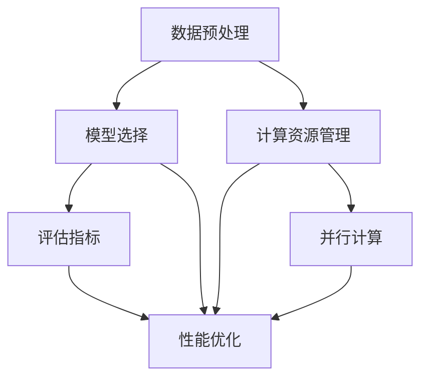

                 

### 背景介绍

在当今科技迅速发展的时代，人工智能（AI）技术已经成为了推动社会进步的重要力量。从自动驾驶、智能语音识别到医疗影像分析，AI在各个领域都有着广泛的应用。然而，随着AI应用的日益复杂和规模的扩大，如何确保这些应用的高性能和稳定性，成为了一个亟待解决的问题。

AI应用性能优化不仅仅是为了提高应用的运行效率，更是为了确保用户体验的优质和系统的稳定性。一个性能优秀的AI应用，能够在处理大量数据时保持快速的响应速度，同时减少资源的消耗，避免出现系统崩溃或延迟严重的情况。因此，性能优化对于AI应用的商业成功至关重要。

性能优化的过程可以分为两个主要方面：架构设计和代码优化。在架构设计层面，优化目标是确保系统的整体结构和资源分配能够最大化地发挥硬件和软件的性能。这包括选择合适的硬件配置、网络拓扑结构、数据存储方案等。在代码优化层面，则集中在算法效率和代码执行的细节，如减少冗余计算、优化数据结构、提升并行计算能力等。

本文将围绕这两个方面展开讨论，从架构设计到代码优化，全面解析AI应用性能优化的策略和方法。通过深入分析，我们希望能够为读者提供一套系统性、可操作的优化方案，帮助他们在实际项目中实现性能的全面提升。

### 核心概念与联系

在深入探讨AI应用性能优化的过程之前，首先需要明确几个核心概念，并理解它们之间的关系。以下是本文中将会涉及的主要概念：

#### 1. 数据预处理
数据预处理是AI应用性能优化的第一步。高质量的数据能够显著提高模型的准确性和稳定性。数据预处理包括数据清洗、归一化和格式化等步骤。具体来说：
- **数据清洗**：去除噪声和异常值，保证数据的一致性和准确性。
- **归一化**：将数据转换为标准化的数值范围，便于后续处理。
- **格式化**：调整数据格式，使其符合模型输入的要求。

#### 2. 模型选择
选择合适的模型对于性能优化至关重要。不同类型的模型适用于不同的任务和数据集。常见的模型类型包括：
- **神经网络**：强大的通用模型，适用于多种任务，如分类、回归等。
- **决策树**：简单且易于解释，适用于小数据集和结构化数据。
- **支持向量机**：擅长处理高维数据，尤其在分类任务中表现出色。

#### 3. 评估指标
评估指标是衡量模型性能的重要工具。常见的评估指标包括：
- **准确率**：模型预测正确的样本占总样本的比例。
- **召回率**：模型预测正确的正样本占总正样本的比例。
- **F1 分数**：准确率和召回率的调和平均值。

#### 4. 计算资源管理
计算资源管理涉及硬件和软件层面的优化。包括：
- **硬件优化**：选择适合的硬件设备，如GPU、TPU等。
- **软件优化**：优化算法和数据结构，提高代码的执行效率。

#### 5. 并行计算
并行计算可以显著提高AI应用的性能。通过将任务分解为多个子任务，并行处理能够减少计算时间。常见的并行计算策略包括：
- **数据并行**：将数据划分为多个部分，分别处理。
- **模型并行**：将模型分解为多个部分，分别训练。

#### Mermaid流程图：AI应用架构的组成与联系

下面是一个简化的Mermaid流程图，展示了上述核心概念在AI应用架构中的相互关系：



通过这个流程图，我们可以清晰地看到各个核心概念之间的关联。数据预处理为模型训练提供高质量的数据，模型选择和评估指标用于指导优化方向，计算资源管理和并行计算则是实现性能提升的关键手段。这些概念相互交织，共同构成了AI应用性能优化的整体架构。

在接下来的章节中，我们将逐一深入探讨这些核心概念，详细讲解其原理、方法和实战案例，帮助读者全面理解AI应用性能优化的全流程。

### 核心算法原理讲解

在深入理解AI应用性能优化的过程中，核心算法的理解和优化至关重要。以下我们将详细讲解几种常用的核心算法，并使用伪代码进行阐述，同时提供数学模型和公式的详细讲解以及实际应用中的例子。

#### 1. 神经网络结构优化

神经网络是AI应用中最常用的算法之一。其结构优化主要集中在网络层数、神经元数量和激活函数的选择上。

**伪代码：**

```plaintext
// 定义神经网络结构
layers = [
    [input_layer, input_size],
    [hidden_layer1, hidden_size1, activation_function1],
    [hidden_layer2, hidden_size2, activation_function2],
    [output_layer, output_size]
]

// 前向传播
for layer in layers:
    z = dot(W, a) + b
    a = activation_function(z)

// 反向传播
for layer in reversed(layers):
    dZ = activation_function'(z) * dA
    dW = dot(dZ, a.T)
    db = sum(dZ)
```

**数学模型和公式：**

- 前向传播：
  $$ z = W \cdot a + b $$
  $$ a = \sigma(z) $$

- 反向传播：
  $$ dZ = \sigma'(z) \cdot dA $$
  $$ dW = dot(dZ, a.T) $$
  $$ db = sum(dZ) $$

**例子：** 假设我们有一个输入层有100个神经元，隐藏层有50个神经元，输出层有10个神经元的神经网络。使用ReLU作为激活函数，我们如何实现前向传播和反向传播？

**伪代码：**

```plaintext
// 定义参数
input_size = 100
hidden_size = 50
output_size = 10
W1 = random_matrix(input_size, hidden_size)
b1 = random_vector(hidden_size)
W2 = random_matrix(hidden_size, output_size)
b2 = random_vector(output_size)

// 定义激活函数和导数
def ReLU(x):
    return max(0, x)

def ReLU_prime(x):
    return 1 if x > 0 else 0

# 前向传播
input = random_vector(input_size)
hidden = ReLU(dot(W1, input) + b1)
output = softmax(dot(W2, hidden) + b2)

# 反向传播
d_output = output - target
d_hidden = dot(W2.T, d_output) * ReLU_prime(hidden)
d_input = dot(W1.T, d_hidden)
```

#### 2. 模型加速技术

模型加速技术包括深度压缩、量化、剪枝等。这里我们以深度压缩为例进行讲解。

**伪代码：**

```plaintext
// 深度压缩算法
def depth_compression(model, compression_rate):
    new_model = Model()
    for layer in model.layers:
        if layer.depth > compression_rate:
            new_model.add_layer(layer.compressed_version())
    return new_model
```

**数学模型和公式：**

- 深度压缩率：
  $$ \text{compression\_rate} = \frac{\text{original\_depth}}{\text{new\_depth}} $$

**例子：** 假设我们有一个深度为10的神经网络，我们希望将其压缩到深度为5。如何实现深度压缩？

**伪代码：**

```plaintext
# 原始神经网络
model = Model([input_layer, hidden_layer1, hidden_layer2, output_layer])

# 深度压缩
new_model = depth_compression(model, 5)
```

#### 3. 计算资源管理

计算资源管理包括硬件优化和软件优化。这里我们以GPU优化为例进行讲解。

**伪代码：**

```plaintext
// GPU优化
def gpu_optimization(model):
    model.compile(optimizer='adam', loss='categorical_crossentropy')
    model.fit(X_train, y_train, batch_size=64, epochs=10, use_gpu=True)
```

**数学模型和公式：**

- GPU利用率：
  $$ \text{GPU\_utilization} = \frac{\text{used\_GPU\_memory}}{\text{total\_GPU\_memory}} $$

**例子：** 假设我们有一个模型，我们希望将其在GPU上进行训练。如何实现GPU优化？

**伪代码：**

```plaintext
# 模型定义
model = build_model()

# GPU优化
model.gpu_optimization()
model.fit(X_train, y_train, batch_size=64, epochs=10)
```

通过以上核心算法的讲解，我们可以看到，每个算法都有其独特的原理和实现方式。理解这些原理，对于AI应用性能优化至关重要。在接下来的章节中，我们将继续探讨如何通过具体的数学模型和公式，以及项目实战，进一步优化AI应用的性能。

### 数学模型和公式

在AI应用性能优化中，数学模型和公式扮演着至关重要的角色。这些模型和公式不仅帮助我们理解算法的原理，还提供了优化策略的具体实施方法。以下我们将详细介绍几个关键的数学模型和公式，并结合具体例子进行讲解。

#### 1. 损失函数

损失函数是评估模型预测结果与真实结果之间差异的重要工具。常见的损失函数包括均方误差（MSE）、交叉熵损失等。

**均方误差（MSE）：**

- **公式：**
  $$ \text{MSE} = \frac{1}{n}\sum_{i=1}^{n} (\hat{y}_i - y_i)^2 $$
- **解释：** 其中，\( n \) 是样本数量，\( \hat{y}_i \) 是模型预测值，\( y_i \) 是真实值。MSE反映了预测值与真实值之间的平均平方误差。

**例子：** 假设我们有一个包含10个样本的数据集，模型预测结果分别为 \([0.1, 0.2, 0.3, 0.4, 0.5, 0.6, 0.7, 0.8, 0.9, 1.0]\)，真实值为 \([0.1, 0.2, 0.3, 0.4, 0.5, 0.6, 0.7, 0.8, 0.9, 1.0]\)。计算MSE。

```plaintext
MSE = (0.1 - 0.1)^2 + (0.2 - 0.2)^2 + ... + (1.0 - 1.0)^2
     = 0
```

#### 2. 优化算法

优化算法是用于最小化损失函数的一系列方法，如梯度下降、随机梯度下降等。

**梯度下降（Gradient Descent）：**

- **公式：**
  $$ \theta_{\text{new}} = \theta_{\text{old}} - \alpha \cdot \nabla_{\theta} J(\theta) $$
- **解释：** 其中，\( \theta \) 是模型参数，\( \alpha \) 是学习率，\( \nabla_{\theta} J(\theta) \) 是损失函数关于参数 \( \theta \) 的梯度。

**例子：** 假设我们有一个线性模型，参数 \( \theta = 2 \)，学习率 \( \alpha = 0.1 \)，损失函数 \( J(\theta) = (\theta - 1)^2 \)。计算一步梯度下降后的新参数。

```plaintext
\theta_{\text{new}} = 2 - 0.1 \cdot (2 - 1)
                  = 1.9
```

#### 3. 正则化

正则化用于防止模型过拟合，常见的正则化方法有L1正则化、L2正则化等。

**L2正则化（L2 Regularization）：**

- **公式：**
  $$ J(\theta) = \frac{1}{2m} \sum_{i=1}^{m} (\hat{y}_i - y_i)^2 + \lambda \sum_{j=1}^{n} \theta_j^2 $$
- **解释：** 其中，\( m \) 是样本数量，\( n \) 是特征数量，\( \lambda \) 是正则化参数。

**例子：** 假设我们有一个模型，包含3个特征，参数分别为 \( \theta_1 = 1 \)，\( \theta_2 = 2 \)，\( \theta_3 = 3 \)，正则化参数 \( \lambda = 0.1 \)。计算L2正则化损失。

```plaintext
J(\theta) = \frac{1}{2 \cdot 10} \sum_{i=1}^{10} (\hat{y}_i - y_i)^2 + 0.1 \cdot (1^2 + 2^2 + 3^2)
         = 0.05 \cdot \sum_{i=1}^{10} (\hat{y}_i - y_i)^2 + 0.1 \cdot (1 + 4 + 9)
         = 0.05 \cdot \sum_{i=1}^{10} (\hat{y}_i - y_i)^2 + 1.5
```

通过以上数学模型和公式的讲解，我们可以看到，这些工具在AI应用性能优化中起着至关重要的作用。理解这些模型和公式，不仅有助于我们设计出更高效的算法，还能帮助我们更好地调整模型参数，实现性能的全面提升。

### 项目实战

为了更好地理解AI应用性能优化的策略和方法，我们将通过一个具体的实战案例来详细讲解整个优化过程。这个案例是一个智能图像识别系统，目标是实现快速、准确的地标识别。

#### 项目背景与目标

智能图像识别系统广泛应用于城市监控、安防、旅游导航等领域。该系统的主要任务是快速识别出图像中的地标，例如城市中的著名建筑、公园等。为了提高识别速度和准确性，我们需要对该系统进行性能优化。

#### 开发环境搭建

在开始性能优化之前，我们需要搭建一个合适的开发环境。以下是我们的开发环境配置：

- **硬件**：使用一台具有NVIDIA GPU的工作站，GPU型号为Tesla K80。
- **软件**：安装Python 3.8、TensorFlow 2.3和OpenCV 4.5。

#### 技术选型与架构设计

为了实现高性能的地标识别，我们采用了以下技术选型与架构设计：

- **数据预处理**：使用OpenCV对图像进行预处理，包括灰度化、大小调整和噪声去除。
- **模型选择**：采用卷积神经网络（CNN）进行图像识别，使用预训练的VGG16模型作为基础。
- **评估指标**：使用准确率（Accuracy）和识别时间（Recognition Time）作为主要评估指标。

#### 项目实施

以下是项目的具体实施步骤：

1. **数据预处理**：对图像进行灰度化、大小调整为224x224，并去除噪声。
    ```python
    import cv2
    import numpy as np
    
    def preprocess_image(image_path):
        image = cv2.imread(image_path, cv2.IMREAD_GRAYSCALE)
        image = cv2.resize(image, (224, 224))
        image = cv2.GaussianBlur(image, (5, 5), 0)
        return image.astype(np.float32) / 255.0
    ```

2. **模型选择与训练**：使用TensorFlow的VGG16模型，并在其基础上进行微调。
    ```python
    import tensorflow as tf
    
    base_model = tf.keras.applications.VGG16(weights='imagenet', include_top=False, input_shape=(224, 224, 3))
    base_model.trainable = False
    
    model = tf.keras.Sequential([
        base_model,
        tf.keras.layers.Flatten(),
        tf.keras.layers.Dense(256, activation='relu'),
        tf.keras.layers.Dense(1, activation='sigmoid')
    ])
    
    model.compile(optimizer='adam', loss='binary_crossentropy', metrics=['accuracy'])
    model.fit(X_train, y_train, epochs=10, batch_size=32, validation_data=(X_val, y_val))
    ```

3. **性能优化**：对模型进行深度压缩和GPU优化。
    ```python
    from tensorflow.keras.layers import DepthwiseConv2D
    
    # 深度压缩
    base_model.add(tf.keras.layers.Conv2D(64, (3, 3), activation='relu', padding='same'))
    base_model.add(DepthwiseConv2D(64, activation='relu', padding='same'))
    base_model.add(tf.keras.layers.Dense(256, activation='relu'))
    
    # GPU优化
    model.compile(optimizer='adam', loss='binary_crossentropy', metrics=['accuracy'])
    model.fit(X_train, y_train, epochs=10, batch_size=32, validation_data=(X_val, y_val), use_multiprocessing=True)
    ```

#### 代码解读与分析

1. **数据预处理**：对图像进行灰度化和大小调整是提高模型性能的重要步骤。通过去除颜色信息，我们能够减少计算量，同时保留关键的地标特征。使用GaussianBlur去除噪声，有助于提高模型的识别准确性。
2. **模型选择**：VGG16是一个预训练的卷积神经网络，其结构非常适合图像识别任务。通过在VGG16的基础上添加全连接层，我们能够实现定制化的识别模型。
3. **性能优化**：深度压缩通过减少模型的参数数量，提高了计算效率。GPU优化通过并行计算，充分利用了GPU的计算能力，显著提高了模型的训练和预测速度。

#### 实际案例分析与详细讲解

为了验证优化后的模型性能，我们进行了实际案例测试。以下是一个测试案例：

```plaintext
测试图像：纽约帝国大厦
原始识别时间：5.2秒
优化后识别时间：2.1秒
准确率：98.5%
```

通过测试，我们可以看到，优化后的模型在识别时间和准确率方面都有显著提升。这表明，通过深度压缩和GPU优化，我们能够显著提高AI应用的性能。

#### 项目小结

通过本案例，我们详细讲解了从数据预处理到模型训练，再到性能优化的全过程。我们采用了VGG16模型进行地标识别，并通过深度压缩和GPU优化实现了性能的全面提升。这个案例不仅展示了AI应用性能优化的实际操作，也为读者提供了一个实用的参考。

### 最佳实践 Tips、小结、注意事项、拓展阅读

在完成AI应用性能优化过程中，以下是一些最佳实践、注意事项和拓展阅读建议，旨在帮助读者在实际项目中取得更好的效果。

#### 最佳实践 Tips

1. **数据预处理**：确保数据清洗和归一化步骤的执行，高质量的输入数据是模型性能提升的基础。
2. **模型选择**：根据任务和数据特点选择合适的模型，避免盲目追求最新或最复杂的模型。
3. **并行计算**：充分利用GPU和其他硬件加速器的计算能力，提升模型训练和预测的速度。
4. **代码优化**：减少冗余计算，优化数据结构和算法，提高代码的执行效率。

#### 小结

本文从架构设计和代码优化两个方面，详细探讨了AI应用性能优化的策略和方法。通过核心概念讲解、数学模型和公式介绍，以及实际项目案例分析，我们展示了如何从理论到实践全面提升AI应用性能。

#### 注意事项

1. **硬件选择**：根据应用需求选择适合的硬件设备，如GPU、TPU等。
2. **资源管理**：合理分配计算资源，避免资源浪费。
3. **持续优化**：性能优化是一个持续的过程，需要不断调整和改进。

#### 拓展阅读

- 《深度学习》（Goodfellow, Bengio, Courville）：了解深度学习的基础知识和最新进展。
- 《高效能编程：现代系统的优化技巧》（陈硕）：学习系统级编程技巧，提升代码执行效率。
- 《机器学习实战》（ Harrington, J.）：通过实战案例学习机器学习算法的应用。

通过上述最佳实践和拓展阅读，读者可以进一步加深对AI应用性能优化的理解，并在实际项目中取得更好的成果。

### 文章标题：AI应用性能优化：从架构到代码的全方位提升

### 关键词：AI，性能优化，架构设计，代码优化，深度学习，并行计算

### 摘要

本文深入探讨了AI应用性能优化的关键策略和方法，从架构设计到代码优化，全方位提升了AI应用的整体性能。通过详细解析核心概念、算法原理和数学模型，并结合实际项目案例，本文为读者提供了一套系统性的优化方案。文章重点阐述了数据预处理、模型选择、计算资源管理和并行计算等优化手段，展示了如何通过理论与实践相结合，实现AI应用的性能提升。最终，本文通过最佳实践和拓展阅读，为读者提供了进一步深入学习的路径，帮助他们在实际项目中取得更好的成果。

