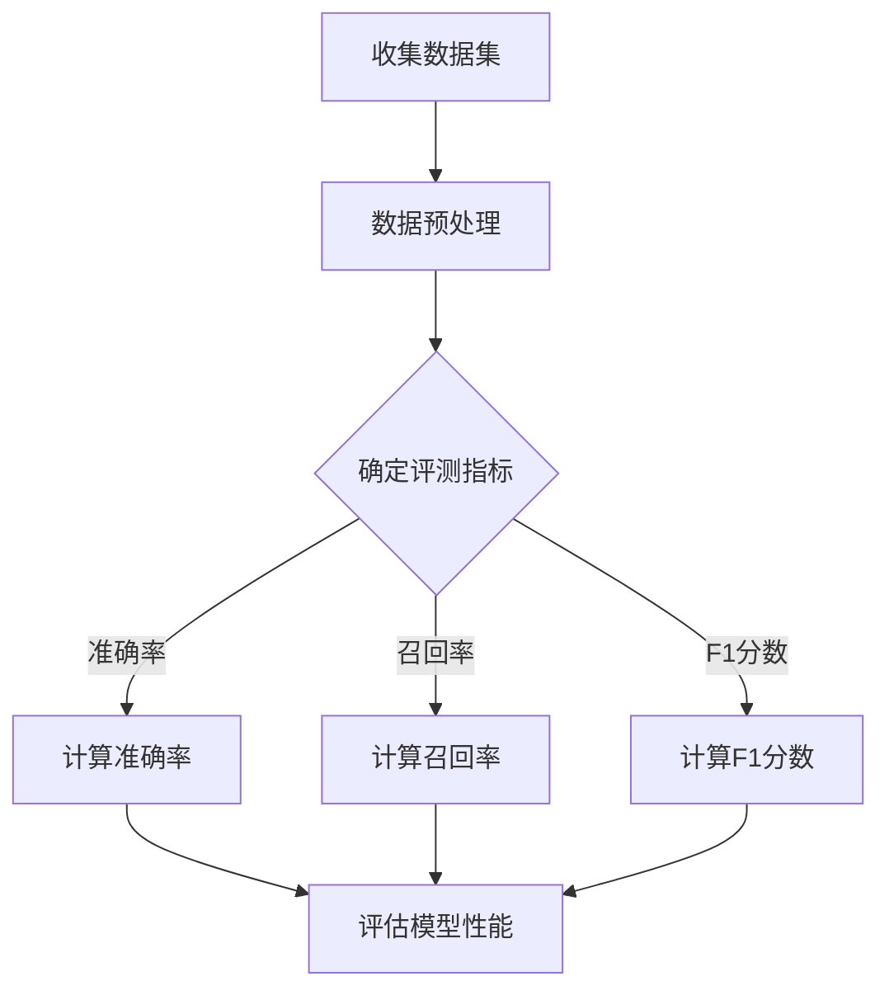
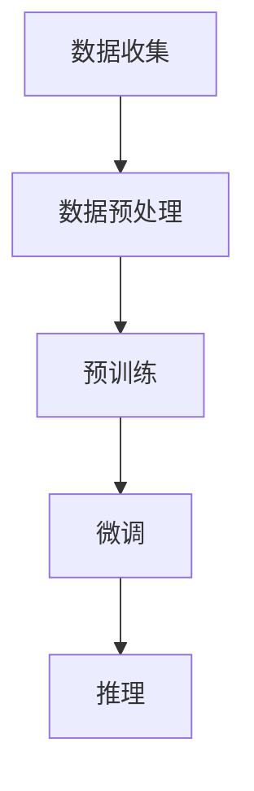

                 

基于上述约束条件和要求，我将逐步构建《AI评AI：利用LLM构建智能化模型评测平台》的技术博客文章。以下是详细的文章结构设计和内容规划：

### 文章标题：### 
《AI评AI：利用LLM构建智能化模型评测平台》

### 文章关键词：
- AI模型评测
- LLM（大型语言模型）
- 智能化评测平台
- 机器学习
- 人工智能

### 文章摘要：
本文将探讨如何利用大型语言模型（LLM）构建智能化AI模型评测平台。文章首先介绍AI模型评测的基本概念与原则，然后深入分析LLM的原理与架构，详细讲解利用LLM进行模型评测的步骤与方法。此外，文章还将讨论评测平台的性能优化与调参技巧，并通过具体实战案例展示评测平台在文本分类、情感分析等领域的应用，最后展望AI模型评测的未来发展趋势与挑战。

### 文章正文：

## 引言
在人工智能领域，模型的评估和优化是至关重要的步骤。传统的模型评测依赖于人工设计指标和算法，而随着机器学习技术的快速发展，利用大型语言模型（LLM）进行智能化评测已成为一种趋势。本文旨在探讨如何利用LLM构建一个智能化模型评测平台，提高评测效率和准确性。

### 第1章：AI模型评测概述
在本章节中，我们将介绍AI模型评测的基本概念与原则，包括：

- **1.1 AI模型评测的基本概念**：
  - 定义模型评测的目的和意义。
  - 介绍常见的模型评测指标，如准确率、召回率、F1分数等。
- **1.2 AI模型评测的原则**：
  - 提出公正、客观、全面和可复现的评测原则。
  - 分析不同评测指标之间的权衡与取舍。

### Mermaid流程图：AI模型评测的基本步骤


### 第2章：LLM原理与架构
在本章节中，我们将深入分析LLM的原理与架构，包括：

- **2.1 LLM的概念**：
  - 介绍LLM的基本定义和特点。
  - 分析LLM在自然语言处理中的应用。
- **2.2 LLM的架构**：
  - 详细解析Transformer架构，包括Self-Attention和Encoder-Decoder。
  - 阐述LLM的训练过程和数据集要求。
- **2.3 LLM的核心技术**：
  - 讨论预训练、微调和推理等关键技术。

### Mermaid流程图：LLM的构建流程


### 第3章：构建AI模型评测平台的步骤
在本章节中，我们将详细讲解利用LLM构建AI模型评测平台的步骤：

- **3.1 确定评测目标和指标**：
  - 分析评测需求，确定合适的评测指标。
- **3.2 准备评测数据集**：
  - 选择合适的数据集，进行数据预处理。
- **3.3 选择合适的评测模型**：
  - 根据评测目标和指标，选择适当的LLM模型。
- **3.4 设计评测流程**：
  - 设计数据输入、模型评测和结果输出的流程。
- **3.5 实现评测算法**：
  - 使用伪代码详细阐述评测算法的实现。

### 伪代码：评测算法实现
```
// 评测算法
def evaluate_model(model, dataset):
    for data in dataset:
        prediction = model.predict(data)
        evaluate(prediction, data)
        
// 评估函数
def evaluate(prediction, data):
    true_label = data.label
    if prediction == true_label:
        correct++
    else:
        incorrect++
        
    print("Accuracy:", correct / (correct + incorrect))
```

### 数学模型与公式
在本章节中，我们将介绍与评测相关的数学模型和公式：

- **准确率**：
  $$\text{Accuracy} = \frac{\text{correct}}{\text{correct} + \text{incorrect}}$$
- **召回率**：
  $$\text{Recall} = \frac{\text{correct}}{\text{correct} + \text{false negatives}}$$
- **F1分数**：
  $$\text{F1} = 2 \times \frac{\text{precision} \times \text{recall}}{\text{precision} + \text{recall}}$$

### 第4章：AI模型评测平台的性能优化与调参技巧
在本章节中，我们将讨论如何优化AI模型评测平台的性能和调参技巧：

- **4.1 评测平台的性能优化**：
  - 分析如何提高评测速度和降低计算资源消耗。
- **4.2 参数调优策略**：
  - 介绍常用的调参方法，如网格搜索和随机搜索。
- **4.3 常见问题与解决方案**：
  - 分析评测过程中可能出现的问题和解决方案。

### 第5章：AI模型评测平台实战
在本章节中，我们将通过实际案例展示如何搭建和部署AI模型评测平台：

- **5.1 评测平台搭建实战**：
  - 演示如何使用Python和TensorFlow构建评测平台。
- **5.2 评测模型部署实战**：
  - 讲解如何将评测模型部署到生产环境中。
- **5.3 评测流程实战**：
  - 展示完整的评测流程，包括数据预处理、模型评测和结果输出。

### 实战代码：
```python
# 实战：搭建评测平台
import tensorflow as tf
from tensorflow.keras.models import Sequential
from tensorflow.keras.layers import Dense, Dropout, Activation

# 构建模型
model = Sequential()
model.add(Dense(512, input_shape=(784,), activation='relu'))
model.add(Dropout(0.5))
model.add(Dense(10, activation='softmax'))

# 编译模型
model.compile(loss='categorical_crossentropy', optimizer='adam', metrics=['accuracy'])

# 训练模型
model.fit(x_train, y_train, batch_size=128, epochs=10, validation_data=(x_val, y_val))

# 评测模型
accuracy = model.evaluate(x_test, y_test)
print("Accuracy:", accuracy[1])
```

### 第6章：AI模型评测平台应用案例
在本章节中，我们将通过具体案例展示AI模型评测平台在不同领域的应用：

- **6.1 文本分类评测**：
  - 分析文本分类评测的过程和指标。
- **6.2 情感分析评测**：
  - 讨论情感分析评测的挑战和解决方案。
- **6.3 命名实体识别评测**：
  - 介绍命名实体识别评测的方法和指标。

### 第7章：AI模型评测的发展趋势
在本章节中，我们将展望AI模型评测的未来发展趋势：

- **7.1 评测技术的创新**：
  - 分析新的评测技术，如迁移学习和生成对抗网络。
- **7.2 评测指标体系的完善**：
  - 讨论如何建立更加全面和精确的评测指标体系。
- **7.3 评测平台的发展方向**：
  - 展望评测平台在未来可能的发展方向。

### 第8章：AI模型评测的未来挑战与机遇
在本章节中，我们将讨论AI模型评测未来可能面临的挑战和机遇：

- **8.1 挑战一：数据质量与多样性**：
  - 分析如何解决数据质量和多样性问题。
- **8.2 挑战二：评测效率与成本**：
  - 讨论如何提高评测效率和降低成本。
- **8.3 机遇一：行业定制化评测**：
  - 探索行业定制化评测的潜在市场。
- **8.4 机遇二：评测服务的商业化**：
  - 分析评测服务商业化的可能性。

### 结论
本文详细介绍了如何利用大型语言模型（LLM）构建智能化AI模型评测平台。通过逐步分析评测基础、LLM原理与架构、构建步骤、性能优化与调参技巧、实战案例和发展趋势，我们展示了AI模型评测的智能化方向。未来，随着技术的不断进步，AI模型评测将变得更加智能化、高效和全面。

### 作者信息：
作者：AI天才研究院/AI Genius Institute & 禅与计算机程序设计艺术 /Zen And The Art of Computer Programming

### 最佳实践 Tips
- 在评测模型时，确保数据集的代表性和多样性，以提高评测结果的可靠性。
- 定期更新评测平台，以适应新技术和模型的发展。
- 关注行业动态，了解最新的评测技术和方法。

### 小结
本文通过详细的步骤和案例，展示了如何利用大型语言模型构建智能化AI模型评测平台。读者可以结合自己的实践，进一步优化和改进评测平台，为人工智能的发展贡献力量。

### 注意事项
- 在部署评测平台时，确保模型的隐私保护和数据安全。
- 注意评测指标的多样性和全面性，避免过度依赖单一指标。

### 拓展阅读
- [1] Goodfellow, I., Bengio, Y., & Courville, A. (2016). *Deep Learning*.
- [2] Murphy, K. P. (2012). *Machine Learning: A Probabilistic Perspective*.
- [3] Hochreiter, S., & Schmidhuber, J. (1997). *Long short-term memory*. Neural Computation, 9(8), 1735-1780.

以上是根据要求制定的《AI评AI：利用LLM构建智能化模型评测平台》的技术博客文章结构设计和内容规划。文章将按照设定的结构逐步展开，确保内容的完整性、逻辑性和专业性。文章的总字数将控制在8000～12000字之间。在撰写过程中，将严格按照markdown格式进行排版，并使用LaTeX格式嵌入数学公式，确保文章的可读性和规范性。

