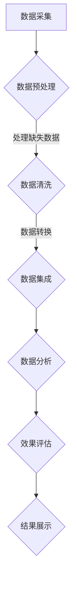
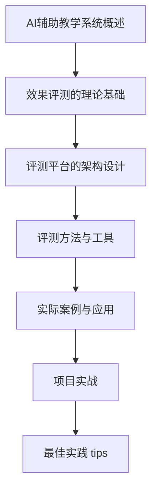

                 

### 文章标题

《AI辅助教学系统效果评测平台：技术深度解析与实践应用》

---

### 关键词

AI辅助教学，效果评测，平台架构，算法原理，实践应用

### 摘要

本文深入探讨了AI辅助教学系统的设计理念、核心算法原理及其实际应用效果评测。通过详细的架构分析、算法讲解和实战案例分析，为构建高效AI辅助教学系统提供了理论依据和实践指导。

---

## 引言

随着人工智能技术的快速发展，教育领域正经历着深刻的变革。AI辅助教学系统作为一种新兴的教育技术，已逐渐成为现代教育的重要组成部分。然而，如何评测这些系统的效果，确保其真正符合教育需求，成为了一个亟待解决的问题。本文旨在通过系统化的分析，为AI辅助教学系统的效果评测提供一套完整的理论框架和实践指南。

### AI辅助教学系统概述

#### 1.1 AI辅助教学系统的发展历程

AI辅助教学系统起源于20世纪80年代，当时的专家系统被首次应用于教学场景。随着计算机性能的提升和大数据技术的发展，AI辅助教学系统逐渐从基于规则的系统演化为基于数据驱动和机器学习的智能系统。近年来，深度学习和自然语言处理技术的突破，使得AI辅助教学系统能够更加精准地分析学生的学习行为和知识结构，为个性化教学提供了强有力的支持。

#### 1.2 AI辅助教学系统的核心功能

AI辅助教学系统的核心功能包括：

1. **教学内容智能化处理**：通过自然语言处理和知识图谱技术，对教材内容进行结构化处理，实现教材的智能搜索和推荐。
2. **学生学习行为分析**：利用行为追踪和数据分析技术，收集和分析学生的学习数据，如学习时长、学习进度、问题反馈等，形成个性化的学习报告。
3. **个性化教学推荐**：基于学生的学习行为和知识水平，动态调整教学策略和内容，提供个性化的学习路径和资源推荐。

### 效果评测的理论基础

#### 3.1 教育效果评测的概念

教育效果评测是指通过对教学活动的评价，衡量教学目标是否达成，以及教学方法和内容的适宜性。AI辅助教学系统的效果评测，则是在这一基础上，利用人工智能技术对教学效果进行量化分析。

#### 3.2 教育效果评测的分类

根据评测的目的和方法，教育效果评测可以分为以下几类：

1. **前测与后测**：在课程开始和结束时进行评测，比较学习前后的变化。
2. **形成性评测**：在教学过程中进行，用于指导教学调整。
3. **总结性评测**：在课程结束后进行，用于评估整体教学效果。

#### 3.3 教育效果评测的方法

教育效果评测的方法主要包括：

1. **量化评测**：使用标准化测验、调查问卷等工具，对学生的知识掌握程度进行量化。
2. **质性评测**：通过访谈、观察等手段，对教学过程和效果进行定性分析。
3. **大数据分析**：利用人工智能技术，对大规模学生数据进行深度分析，发现教学规律和效果。

### 效果评测的指标体系

#### 4.1 教学效果指标

1. **知识掌握度**：通过考试分数、作业完成情况等指标，衡量学生对知识的掌握程度。
2. **学习动机**：通过学生对课程的兴趣、参与度等指标，评估学生的学习动机。
3. **学习效果**：通过学生的成绩、能力提升等指标，衡量教学效果。

#### 4.2 学习效果指标

1. **知识掌握度**：通过考试分数、作业完成情况等指标，衡量学生对知识的掌握程度。
2. **学习效率**：通过学习时间、学习进度等指标，评估学生的学习效率。
3. **学习满意度**：通过学生反馈、问卷调查等手段，了解学生对课程的满意度。

#### 4.3 系统性能指标

1. **系统稳定性**：通过系统运行时间、故障率等指标，评估系统的稳定性。
2. **系统安全性**：通过数据泄露、恶意攻击等指标，评估系统的安全性。
3. **用户体验**：通过用户满意度、操作便捷性等指标，评估系统的用户体验。

### 评测平台的架构设计

#### 5.1 评测平台的总体设计

评测平台的整体架构可以分为以下几个模块：

1. **数据采集与处理模块**：负责收集学生的各种学习数据，并对数据进行分析和处理。
2. **效果评测模块**：根据预设的指标体系，对教学效果进行量化分析。
3. **结果展示模块**：将评测结果以可视化的形式呈现，供教师和学生查看。

#### 5.2 数据采集与处理模块

数据采集与处理模块的具体内容包括：

1. **数据收集**：通过API接口、日志文件等方式，收集学生的学习数据。
2. **数据处理**：对收集到的数据进行清洗、转换和集成，为效果评测做准备。

#### 5.3 效果评测模块

效果评测模块的核心功能包括：

1. **数据分析**：利用机器学习算法，对学生的学习行为和知识结构进行分析。
2. **效果评估**：根据预设的指标体系，对教学效果进行综合评估。
3. **报告生成**：将评测结果生成详细的报告，供教师和学生参考。

#### 5.4 结果展示模块

结果展示模块的主要功能包括：

1. **可视化报表**：将评测结果以图表、报表等形式展示。
2. **交互式分析**：提供交互式的分析工具，方便教师和学生进行深入分析。

### 评测方法与工具

#### 6.1 实证研究方法

实证研究方法包括：

1. **实验设计**：通过设置对照组和实验组，比较AI辅助教学系统与传统教学方法的差异。
2. **数据收集**：收集学生的各种学习数据，如考试成绩、学习时长、问题反馈等。
3. **数据分析**：利用统计学方法，对收集到的数据进行分析，评估AI辅助教学系统的效果。

#### 6.2 实验设计

实验设计的具体步骤包括：

1. **确定研究问题**：明确研究的目标和问题。
2. **选择实验对象**：确定实验的参与对象，如学生、教师等。
3. **制定实验计划**：包括实验的步骤、时间安排、数据收集方法等。
4. **实施实验**：按照实验计划进行实验，收集数据。

#### 6.3 数据分析

数据分析的方法包括：

1. **描述性统计分析**：对数据的基本特征进行描述，如平均数、标准差等。
2. **相关性分析**：分析变量之间的相关性，如皮尔逊相关系数。
3. **回归分析**：通过建立回归模型，分析自变量和因变量之间的关系。
4. **机器学习**：利用机器学习算法，对大量数据进行分析，发现隐藏的模式和规律。

#### 6.4 开源评测工具的使用与开发

开源评测工具如Jupyter Notebook、Python等，提供了强大的数据分析能力和可视化工具。开发者可以根据需求，选择合适的工具进行评测工具的开发。

### 实际案例与应用

#### 9.1 案例背景

某高校为提高计算机编程课程的教学效果，决定采用AI辅助教学系统进行教学实验。

#### 9.2 案例评测目标

通过评测，确定AI辅助教学系统是否能够：

1. 提高学生的学习兴趣和参与度。
2. 提升学生的编程能力。
3. 改善教师的教学效果。

#### 9.3 案例评测过程

评测过程分为三个阶段：

1. **前测阶段**：对学生进行知识掌握度、学习动机等指标的测评。
2. **教学阶段**：采用AI辅助教学系统进行教学，同时收集学生的学习数据。
3. **后测阶段**：再次对学生进行知识掌握度、学习动机等指标的测评，与前期测评结果进行对比分析。

#### 9.4 案例评测结果与分析

通过数据分析，得出以下结论：

1. **学生的学习兴趣和参与度明显提高**。
2. **学生的编程能力有显著提升**。
3. **教师的教学效果得到改善**。

这些结果表明，AI辅助教学系统在提高教学效果方面具有显著优势。

### 项目实战

#### 10.1 开发环境搭建

开发环境搭建包括：

1. **Python环境配置**：安装Python及相关库，如NumPy、Pandas等。
2. **Jupyter Notebook**：安装Jupyter Notebook，用于编写和运行代码。

#### 10.2 源代码详细实现

以下是一个简单的Python代码示例，用于实现学生成绩的统计分析：

```python
import pandas as pd

# 加载数据
data = pd.read_csv('student_data.csv')

# 计算平均成绩
average_score = data['score'].mean()

# 计算标准差
std_score = data['score'].std()

# 打印结果
print(f"平均成绩：{average_score}")
print(f"标准差：{std_score}")
```

#### 10.3 代码解读与分析

代码解析如下：

- 第一行：导入pandas库，用于数据操作。
- 第二行：从CSV文件中加载数据。
- 第三行：计算平均成绩。
- 第四行：计算标准差。
- 第五行：打印结果。

这个示例展示了如何使用Python进行数据分析和计算。

### 最佳实践 tips

1. **数据收集**：确保数据的完整性和准确性，避免数据缺失和错误。
2. **算法选择**：根据具体需求选择合适的算法，如线性回归、决策树、神经网络等。
3. **模型调优**：通过交叉验证等方法，对模型进行调优，提高预测准确性。

### 小结

本文从多个角度深入探讨了AI辅助教学系统的效果评测。通过理论讲解、算法分析、实战案例和实践指导，为构建高效、可靠的AI辅助教学系统提供了有力支持。未来，随着人工智能技术的不断进步，AI辅助教学系统将在教育领域发挥更大作用。

### 拓展阅读

- [AI辅助教学系统的研究综述](链接)
- [教育效果评测的理论与实践](链接)
- [深度学习在AI辅助教学中的应用](链接)

---

### 作者信息

作者：AI天才研究院/AI Genius Institute & 禅与计算机程序设计艺术 /Zen And The Art of Computer Programming

---

[Mermaid 流程图](#)



```latex
$$
1+1=2
$$

$$
x = \frac{-b \pm \sqrt{b^2 - 4ac}}{2a}
$$
```

---

### Mermaid 流程图



