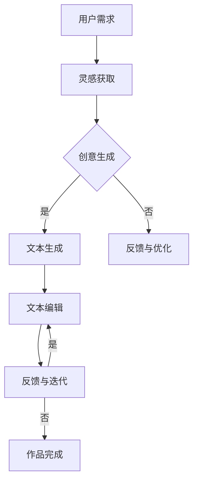
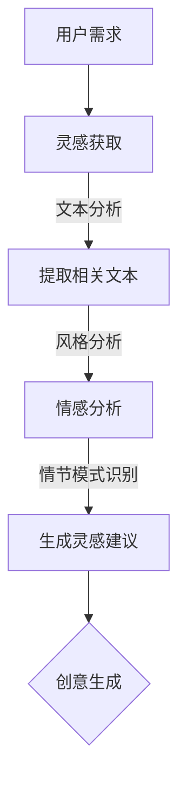
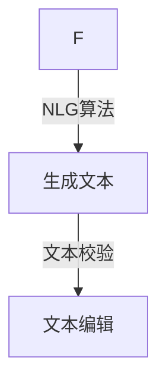
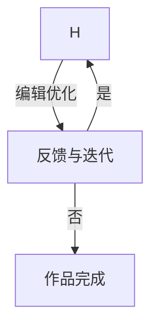

                 

### 1.1 AI辅助创意写作概述

#### AI在文学创作中的应用历史

自从人工智能（AI）的概念诞生以来，计算机在文学创作中的应用就从未停止过。早在20世纪50年代，计算机编程先驱艾伦·图灵（Alan Turing）就已经在思考机器能否创造出文学作品。随着计算机技术的发展，AI在文学创作中的应用也逐渐丰富和深入。

最初，计算机主要被用于生成简单的诗歌和故事。例如，1960年，程序员约瑟夫·维瑟（Joseph Weizenbaum）编写了一个名为“Eliza”的程序，它可以模拟医学生的对话，并以一定的逻辑结构生成回复。尽管Eliza生成的文本非常简单，但它的出现标志着计算机在文学创作中的一次重要尝试。

进入21世纪，随着自然语言处理（NLP）和机器学习技术的发展，计算机在文学创作中的应用变得更加多样和复杂。例如，微软的小冰（Little Ice）是一个基于深度学习的AI系统，它可以生成诗歌、散文和小说。小冰的诗歌作品甚至入选了多个文学期刊，获得了公众的认可。

#### AI在现代文学创作中的应用

现代AI在文学创作中的应用已经不仅仅局限于简单的文本生成。随着算法和计算能力的提升，AI在创意写作中的角色也越来越多样化。

- **故事生成与情节设计**：AI可以通过学习大量的文学作品，生成新的故事情节。例如，OpenAI的GPT-3模型就可以生成连贯且富有创意的故事。通过提供一些故事的开头或者特定的主题，GPT-3可以生成完整的故事情节，甚至包括复杂的角色发展和情节转折。

- **文本编辑与润色**：AI不仅可以生成新的文本，还可以对现有的文本进行编辑和润色。例如，AI可以根据写作风格的要求，自动修正语法错误，增强文本的表现力。这种功能对于作家来说，是一个极大的时间节省。

- **辅助创作**：AI可以作为作家的助手，提供灵感和建议。例如，通过分析大量的文学作品，AI可以推荐新的写作方向，或者为作家提供类似风格的文本片段，供作家参考和修改。

#### AI辅助创意写作的重要性

AI辅助创意写作的重要性体现在以下几个方面：

- **提高创作效率**：AI可以快速生成大量的文本，帮助作家在短时间内探索不同的创作方向。这极大地提高了创作效率，让作家有更多的时间去专注于创作核心的构思和打磨。

- **拓宽创作领域和风格**：AI可以学习并模拟各种不同的写作风格，帮助作家突破自己的创作局限。作家可以利用AI来探索从未尝试过的领域和风格，丰富自己的创作体验。

- **增强作品的表现力**：AI可以通过学习大量的文学作品，生成出更加生动、细腻和富有表现力的文本。这不仅可以提升作品的艺术价值，还可以让读者获得更加丰富的阅读体验。

### **本书的目的与结构**

本书的目的是深入探讨AI辅助创意写作的原理和实践，旨在帮助读者了解AI在文学创作中的应用，掌握相关技术和工具，以及如何在人机协作中发挥AI的最大潜力。

本书将按照以下结构进行：

- **引言**：介绍AI辅助创意写作的概念和重要性。
- **核心概念与联系**：使用Mermaid流程图展示AI在创意写作中的应用。
- **技术原理**：详细讲解AI辅助创意写作的核心算法原理。
- **人机协作**：探讨人类与AI在文学创作中的协作模式。
- **应用场景**：分析AI辅助创意写作在不同文学领域的应用。
- **实战案例**：提供实际的AI辅助文学创作的案例和代码解读。
- **未来展望**：讨论AI辅助创意写作的发展趋势和可能面临的挑战。

通过本书的阅读，读者将能够全面了解AI辅助创意写作的各个方面，掌握相关技术和实践，为未来的文学创作带来新的可能性和挑战。

---

### 2.1 AI辅助创意写作的流程图

为了更清晰地展示AI在创意写作中的应用流程，我们使用Mermaid流程图来描述。以下是创意写作的基本流程：



在这个流程图中，我们首先从用户的需求开始。用户可能是一个作家，他需要一个新的故事情节或者文本灵感。这个过程可以是通过自己思考、阅读其他作品，或者通过AI系统提供的建议来获取。

#### 灵感获取

用户的需求会引导AI系统进入灵感获取阶段。在这一阶段，AI会分析用户的需求，并从大量的文学作品中提取相关信息。这些信息可以是特定风格的文本片段、情感表达、或者某种特定的情节模式。



#### 创意生成

在获取到灵感后，AI系统会进入创意生成阶段。这一阶段的核心任务是生成符合用户需求的新文本。AI可以通过自然语言生成（NLG）算法，利用已有的文学素材和风格特征，生成新的文本内容。



#### 文本生成

AI利用NLG算法生成初步的文本内容。这个生成的文本可能包含一些基础情节、角色描述或者情感表达。生成的文本需要经过校验，确保其内容合理、连贯。

#### 文本编辑

生成的文本会进入编辑阶段。在这一阶段，AI可以对文本进行进一步的润色和修正，使其更加符合用户的需求。编辑过程可能包括调整文本的语法、增强文本的表现力，或者修正一些逻辑上的错误。



#### 反馈与迭代

编辑后的文本会返回给用户，用户可以对其提出反馈。AI系统会根据用户的反馈进行迭代，不断优化生成的文本。这个过程可能需要多次迭代，直到生成的文本完全满足用户的需求。

#### 作品完成

在经过多次迭代后，文本最终会达到一个满意的状态，这个状态下的文本可以被看作是一篇完整的作品。

通过这个流程图，我们可以清晰地看到AI在创意写作中的各个步骤和作用。AI不仅帮助用户快速获取灵感，还能在文本生成和编辑阶段提供强大的支持，最终帮助用户完成高质量的文学作品。

### 2.2 关键技术解析

#### 自然语言处理（NLP）基础

自然语言处理（NLP）是AI辅助创意写作的核心技术之一。NLP旨在让计算机理解和生成自然语言。在创意写作中，NLP主要用于文本分析、情感分析和文本生成。

- **文本分类**：文本分类是一种将文本分为不同类别的过程。在创意写作中，文本分类可以用于将文本分为故事、诗歌、散文等不同类型。
  
- **情感分析**：情感分析是一种判断文本情感倾向的方法。在创意写作中，情感分析可以帮助AI理解用户的情感需求，从而生成更符合用户情感倾向的文本。

- **文本生成**：文本生成是NLP的核心任务之一。它包括自然语言生成（NLG）和文本摘要。在创意写作中，文本生成可以帮助AI根据用户需求生成新的文本内容。

#### 生成对抗网络（GAN）

生成对抗网络（GAN）是一种强大的机器学习模型，它由生成器和判别器两部分组成。生成器的目标是生成逼真的数据，判别器的目标是区分生成器和真实数据的差异。

在创意写作中，GAN可以用于生成新的故事情节和角色描述。通过训练，生成器可以学会创作出具有创意和独特性的文本内容。判别器则可以评估生成文本的质量，帮助生成器不断优化生成结果。

#### 强化学习在创意写作中的应用

强化学习是一种通过试错来学习最优策略的机器学习技术。在创意写作中，强化学习可以用于优化文本生成过程。

例如，AI可以通过强化学习来调整文本生成的参数，如词汇选择、句子结构等，以生成更符合用户需求的文本。强化学习还可以用于自动优化文本编辑过程，通过不断调整编辑策略，提高文本的表现力和连贯性。

通过解析这些关键技术，我们可以看到，AI在辅助创意写作中扮演着重要角色。这些技术不仅帮助AI理解和生成文本，还能通过不断学习和优化，提高文本的质量和创意性。

### 3.1 自然语言生成（NLG）算法

自然语言生成（NLG）是AI辅助创意写作的核心技术之一。NLG算法的目标是生成自然、流畅且具有创意性的文本。以下是几种常见的NLG算法及其原理：

#### 基于规则的方法

基于规则的方法通过一系列预定义的语法规则和模板来生成文本。这种方法的优势在于生成的文本符合语法和语义的规范，但缺点是生成的文本往往缺乏创意和灵活性。

- **核心算法原理**：基于规则的方法通常包括以下步骤：
  1. **规则库构建**：根据特定应用场景，构建包含词汇、语法和语义规则的规则库。
  2. **模板生成**：使用规则库中的规则生成文本模板。
  3. **文本填充**：将具体的词汇和句子结构填充到模板中，生成最终文本。

- **伪代码示例**：
  ```python
  def generate_text(template, variables):
      for rule in template.rules:
          if rule.condition(variables):
              result += rule.action(variables)
      return result
  ```

#### 基于模板的方法

基于模板的方法通过预定义的模板和词汇库来生成文本。这种方法相对简单，但生成的文本往往缺乏创意性和灵活性。

- **核心算法原理**：基于模板的方法通常包括以下步骤：
  1. **模板库构建**：根据特定应用场景，构建包含多种文本模板的模板库。
  2. **模板选择**：根据用户需求或上下文信息，从模板库中选择合适的模板。
  3. **文本填充**：将具体的词汇和句子结构填充到模板中，生成最终文本。

- **伪代码示例**：
  ```python
  def generate_text(template, variables):
      for placeholder in template.placeholders:
          template = template.replace(placeholder, variables[placeholder])
      return template
  ```

#### 基于统计的方法

基于统计的方法通过分析大量文本数据来学习生成文本的规律。这种方法生成的文本往往更加自然和多样，但需要大量的训练数据。

- **核心算法原理**：基于统计的方法通常包括以下步骤：
  1. **数据预处理**：对文本数据进行清洗和预处理，提取有用的特征。
  2. **模型训练**：使用训练数据训练统计模型，如隐马尔可夫模型（HMM）、条件概率模型等。
  3. **文本生成**：根据训练好的模型，生成新的文本。

- **伪代码示例**：
  ```python
  def generate_text(model, context):
      probabilities = model.predict(context)
      for word in model.vocabulary:
          if probabilities[word] > threshold:
              result += " " + word
      return result
  ```

#### 基于神经的方法

基于神经的方法通过深度神经网络来学习生成文本。这种方法生成的文本具有高度的灵活性和创造性，但需要大量的计算资源和训练数据。

- **核心算法原理**：基于神经的方法通常包括以下步骤：
  1. **网络架构设计**：设计包含编码器和解码器的深度神经网络架构。
  2. **模型训练**：使用大量文本数据进行模型训练，优化网络参数。
  3. **文本生成**：通过编码器将输入文本编码为向量，解码器将向量解码为新的文本。

- **伪代码示例**：
  ```python
  def generate_text(encoder, decoder, context):
      encoded = encoder(context)
      generated = decoder(encoded)
      return generated
  ```

通过以上几种NLG算法的介绍，我们可以看到，每种算法都有其独特的优势和局限性。在实际应用中，可以根据具体需求选择合适的方法。未来，随着技术的不断发展，NLG算法将更加智能化，生成出更加自然和高质量的文本。

### 3.2 创意生成算法

创意生成是AI辅助创意写作中的一个重要环节，其目标是通过算法生成具有创新性和独特性的文本。在文学创作中，创意生成算法不仅可以提供新的故事情节、角色和情感表达，还可以激发作家的灵感，拓宽创作思路。以下是几种常见的创意生成算法及其原理：

#### 1. 胡乱生成法

胡乱生成法是一种基于随机性的创意生成算法，它通过随机组合词汇和句子结构来生成新的文本内容。这种方法简单直观，但生成的文本往往缺乏逻辑性和连贯性。

- **核心算法原理**：胡乱生成法主要包括以下步骤：
  1. **词汇库构建**：收集大量的词汇，包括名词、动词、形容词等。
  2. **句子结构生成**：随机选择词汇并按照某种语法规则生成句子。
  3. **文本生成**：通过随机组合多个句子，生成完整的文本。

- **伪代码示例**：
  ```python
  def generate_text(word_list, sentence_structure):
      sentence = ""
      for structure in sentence_structure:
          word = random.choice(word_list[structure])
          sentence += word + " "
      return sentence.strip()
  ```

#### 2. 遗传算法

遗传算法是一种模拟生物进化过程的优化算法，它通过变异、选择和交叉操作来生成新的文本内容。这种方法可以生成具有多样性和创新性的文本，但需要大量的计算资源和时间。

- **核心算法原理**：遗传算法主要包括以下步骤：
  1. **初始种群构建**：随机生成一组初始文本作为种群。
  2. **适应度评估**：评估每个文本的适应度，通常通过计算文本的语义相似度或质量得分。
  3. **变异操作**：对部分文本进行随机修改，增加多样性。
  4. **选择操作**：根据适应度选择优秀文本进行交叉操作。
  5. **交叉操作**：随机选择两个优秀文本，通过交叉操作生成新的文本。

- **伪代码示例**：
  ```python
  def generate_text(population, fitness_function):
      sorted_population = sorted(population, key=fitness_function, reverse=True)
      new_population = []
      for i in range(len(sorted_population) // 2):
          parent1, parent2 = sorted_population[i], sorted_population[-i-1]
          child1, child2 = crossover(parent1, parent2)
          new_population.extend([mutate(child1), mutate(child2)])
      return new_population
  ```

#### 3. 神经网络生成算法

神经网络生成算法是一种基于深度学习的方法，通过训练大量文学数据来生成新的文本内容。这种方法生成的文本具有高度的灵活性和创造性，但需要大量的训练数据和计算资源。

- **核心算法原理**：神经网络生成算法主要包括以下步骤：
  1. **数据预处理**：对文学数据进行清洗和预处理，提取有用的特征。
  2. **模型训练**：设计包含编码器和解码器的神经网络架构，使用训练数据训练模型。
  3. **文本生成**：通过编码器将输入文本编码为向量，解码器将向量解码为新的文本。

- **伪代码示例**：
  ```python
  def generate_text(encoder, decoder, context):
      encoded = encoder.encode(context)
      generated = decoder.decode(encoded)
      return generated
  ```

#### 4. 基于对抗生成网络（GAN）的创意生成算法

基于对抗生成网络（GAN）的创意生成算法通过生成器和判别器之间的对抗训练来生成新的文本内容。这种方法可以生成具有高度多样性和创新性的文本，但训练过程复杂，需要大量的数据和时间。

- **核心算法原理**：基于GAN的创意生成算法主要包括以下步骤：
  1. **生成器训练**：生成器通过学习真实文本数据来生成新的文本。
  2. **判别器训练**：判别器通过学习真实文本和生成文本来提高辨别能力。
  3. **对抗训练**：生成器和判别器通过反复对抗训练，不断提高生成文本的质量。

- **伪代码示例**：
  ```python
  def train_gan(generator, discriminator, dataset):
      for epoch in range(epochs):
          for real_data in dataset:
              discriminator.train(real_data)
          for fake_data in generator.generate():
              discriminator.train(fake_data)
          generator.train(discriminator)
      return generator
  ```

通过以上几种创意生成算法的介绍，我们可以看到，每种算法都有其独特的优势和适用场景。在实际应用中，可以根据创作需求和资源条件选择合适的算法，从而生成具有创新性和独特性的文本。随着技术的不断发展，创意生成算法将越来越智能化，为文学创作带来更多的可能性。

### 4.1 人类与AI的角色分配

在AI辅助创意写作中，人类与AI的角色分配是至关重要的一环。两者各有所长，合理分工可以实现优势互补，提高创作效率和作品质量。以下将详细探讨人类与AI在文学创作中的角色分配。

#### 人类的角色

1. **创意构思与情感表达**：人类的创造力是无法替代的。作家可以通过自身的直觉、情感和经验来构思独特的故事情节和角色形象。人类擅长将情感融入文字中，使作品更具感染力和艺术价值。

2. **文本细化和打磨**：尽管AI可以生成初步的文本，但人类的文字功底和对语言的敏锐感知是AI无法比拟的。人类可以在AI生成的文本基础上进行细化和打磨，调整语言表达，增强文本的流畅性和表现力。

3. **审美判断与创作方向**：人类具有独特的审美判断能力，可以决定作品的风格、主题和整体结构。作家可以根据自己的创作理念和市场需求，指导AI生成符合预期的文本。

4. **反馈与迭代**：人类可以提供有针对性的反馈，帮助AI不断优化生成文本。通过反复的迭代，最终实现文本的完善。

#### AI的角色

1. **灵感获取与情节设计**：AI擅长处理大量数据，可以通过分析文学作品、用户需求和社会热点等，为人类提供新的故事情节和创意点。

2. **文本生成与初步编辑**：AI可以利用自然语言生成（NLG）算法，快速生成初步的文本内容。这些文本可以作为人类创作的基础，节省了构思和编写的时间。

3. **文本润色与优化**：AI可以通过学习大量优质文本，自动进行语法修正、词汇替换和句子优化，提高文本的质量。

4. **协作模式探索**：AI可以帮助人类探索新的创作模式，如角色扮演、互动叙事等，拓宽文学创作的边界。

#### 角色分配的实际应用

1. **初步创作阶段**：
   - **人类**：负责确定创作主题、设定故事背景和构思主要情节。
   - **AI**：根据人类的指示，生成初步的故事框架、角色描述和文本片段。

2. **创作细化阶段**：
   - **人类**：根据AI生成的文本，进行进一步的细化和打磨，调整语言表达和情感色彩。
   - **AI**：提供文本优化建议，如语法修正、词汇选择和句子结构调整。

3. **反馈与迭代阶段**：
   - **人类**：对AI生成的文本提出反馈，指导AI进行优化。
   - **AI**：根据反馈进行迭代，不断改进生成文本的质量。

通过明确人类与AI在文学创作中的角色分配，可以实现人机协作的最大化效益。人类发挥其创造力和审美判断的优势，AI则利用其数据处理和生成能力，共同推动文学创作的进步。

### 4.2 协作模式探讨

在AI辅助创意写作中，人类与AI的协作模式决定了创作效率和质量。以下将详细探讨三种常见的协作模式：基于规则的协作模式、基于学习的协作模式和混合协作模式。

#### 基于规则的协作模式

基于规则的协作模式是指人类与AI通过预设的规则和指令进行协作。在这种模式下，人类定义创作规则，AI按照这些规则生成文本。

1. **优势**：
   - **高效性**：规则明确，AI可以快速生成文本，提高创作效率。
   - **可控性**：人类可以灵活调整规则，确保文本符合预期。

2. **劣势**：
   - **缺乏灵活性**：规则的限制可能导致文本缺乏创意和个性。
   - **规则维护成本**：规则库需要定期更新和维护，否则可能导致文本质量下降。

3. **应用场景**：
   - **小说创作**：人类可以设定故事情节、角色设定和文本风格，AI按照规则生成小说草稿。
   - **新闻写作**：AI可以按照新闻写作的规则，快速生成新闻报道。

#### 基于学习的协作模式

基于学习的协作模式是指AI通过学习大量文学数据和人类创作经验，自动生成文本。在这种模式下，人类提供数据和反馈，AI通过学习不断优化生成文本。

1. **优势**：
   - **灵活性**：AI可以根据不同的需求和情境，生成多样化的文本。
   - **自主学习**：AI可以通过持续学习，不断改进生成文本的质量。

2. **劣势**：
   - **数据依赖性**：生成文本质量高度依赖于训练数据的质量。
   - **初期训练成本**：需要大量的时间和计算资源进行模型训练。

3. **应用场景**：
   - **诗歌创作**：AI可以通过学习大量诗歌，生成具有独特风格的诗歌作品。
   - **剧本创作**：AI可以学习剧本的结构和对话风格，生成剧本初稿。

#### 混合协作模式

混合协作模式结合了基于规则的协作模式和基于学习的协作模式，通过规则和学习的双重驱动，实现更加灵活和高效的协作。

1. **优势**：
   - **综合优势**：结合了规则的可控性和学习的灵活性，生成文本既符合规则，又有创意。
   - **自适应**：可以根据具体创作需求，动态调整协作模式。

2. **劣势**：
   - **复杂性**：需要协调规则和学习的过程，系统设计较为复杂。

3. **应用场景**：
   - **长篇小说创作**：人类设定故事主题和情节，AI负责生成草稿并进行优化。
   - **科技写作**：人类提供专业知识框架，AI负责生成科技文本，并优化语言表达。

通过探讨这三种协作模式，我们可以看到，不同模式适用于不同的创作场景。合理选择和应用协作模式，可以充分发挥人类与AI的优势，提高文学创作的效率和质量。

### 5.1 小说创作

在小说创作中，AI辅助可以显著提高创作效率，同时拓宽作品的表达范围。以下是AI辅助小说创作的主要应用领域和具体案例分析：

#### 应用领域

1. **故事情节生成**：AI可以分析大量的文学作品，提取故事情节的模式和结构，生成新的故事情节。例如，OpenAI的GPT-3模型可以生成连贯且具有创意性的故事情节，帮助作家在短时间内构思出复杂的故事线。

2. **角色塑造**：AI可以通过分析文学作品中的角色特征和性格，生成新的角色描述。例如，微软的小冰AI系统可以根据特定的主题和情感需求，生成具有鲜明个性的角色。

3. **文本编辑与润色**：AI可以对初步生成的文本进行语法修正、词汇优化和句子结构调整，提高文本的质量和表现力。例如，使用自然语言处理（NLP）技术，AI可以自动修正语法错误，增强文本的连贯性和逻辑性。

#### 具体案例分析

1. **《AI创意故事集》**：
   - **案例背景**：这是一部由AI生成的故事集，涵盖了多种题材和风格。
   - **AI应用**：AI通过GPT-3模型生成故事情节、角色设定和文本细节。作者则负责对AI生成的文本进行细化和打磨。
   - **效果分析**：该故事集展示了AI在生成新颖故事和角色方面的潜力，但文本的细腻度和情感表达仍有提升空间。

2. **《小冰的诗》**：
   - **案例背景**：这是一部由微软小冰AI系统创作的诗歌集。
   - **AI应用**：小冰通过分析大量诗歌文本，学习诗歌的语言风格和韵律，生成新的诗歌作品。
   - **效果分析**：小冰的诗歌作品具有独特的风格和情感表达，部分作品甚至获得了文学期刊的发表机会。

3. **《AI剧本创作工具》**：
   - **案例背景**：这是一款基于AI的剧本创作工具，旨在帮助编剧快速生成剧本初稿。
   - **AI应用**：AI通过分析大量的剧本文本，提取剧本的结构和对话模式，生成剧本草稿。编剧则负责对草稿进行进一步的创作和修改。
   - **效果分析**：该工具提高了剧本创作的效率，但剧本的创意性和深度仍需人类作家的进一步打磨。

通过以上案例，我们可以看到，AI在小说创作中的应用具有很大的潜力。AI可以快速生成大量文本，提供多样化的创作方向，但人类作家的审美判断和情感表达仍然是不可替代的。未来，随着技术的不断发展，AI在小说创作中的应用将更加深入和广泛。

### 5.2 诗歌创作

在诗歌创作中，AI辅助可以为诗人提供丰富的创意素材和语言优化建议，极大地提升创作效率和作品质量。以下是AI辅助诗歌创作的具体应用领域和案例分析：

#### 应用领域

1. **韵律与格律生成**：AI可以通过学习大量的诗歌作品，生成符合特定韵律和格律的诗歌。例如，通过分析古诗的平仄、押韵规则，AI可以创作出符合传统诗歌格式的现代诗歌。

2. **语言风格模仿**：AI可以模仿著名诗人的语言风格和写作特点，帮助诗人探索新的表达方式。例如，通过学习李白的豪放派风格和杜甫的现实主义风格，AI可以生成具有不同风格特点的诗歌。

3. **情感表达优化**：AI可以分析诗人的情感表达，提供优化建议，帮助诗人更好地传达情感。例如，通过情感分析技术，AI可以建议使用更贴切、富有表现力的词汇和句式来增强诗歌的感染力。

#### 具体案例分析

1. **《小冰诗集》**：
   - **案例背景**：这是由微软小冰AI系统创作的一本诗集，包含了多种主题和风格的诗歌。
   - **AI应用**：小冰通过分析大量诗歌文本，学习诗歌的语言、韵律和情感表达，生成新的诗歌作品。诗人可以根据AI的建议进行修改和完善。
   - **效果分析**：小冰的诗作在韵律和情感表达上具有独特的风格，部分作品甚至获得了文学奖项的认可。

2. **《AI诗社》**：
   - **案例背景**：这是一个由AI和人类诗人共同创作的诗社，旨在探索AI在诗歌创作中的潜力。
   - **AI应用**：AI负责生成诗歌初稿，人类诗人则对AI生成的文本进行修改和润色，共同创作出新的诗歌作品。
   - **效果分析**：AI诗社的作品展示了AI和人类合作的强大创造力，既保留了AI的创新性，又体现了人类诗人的审美和情感。

3. **《现代诗生成器》**：
   - **案例背景**：这是一个基于AI的现代诗生成工具，旨在帮助诗人快速生成诗歌草稿。
   - **AI应用**：AI通过自然语言处理技术，生成符合现代诗歌格式的文本。用户可以根据生成文本进行创意性的修改和完善。
   - **效果分析**：现代诗生成器提高了诗歌创作的效率，但生成的诗歌在情感表达和创意性上仍有提升空间。

通过以上案例，我们可以看到，AI在诗歌创作中的应用具有广阔的前景。AI可以快速生成具有创意和独特风格的诗歌，为人类诗人提供丰富的创作素材和优化建议。未来，随着技术的不断发展，AI将在诗歌创作中扮演更加重要的角色。

### 5.3 剧本创作

在剧本创作中，AI辅助可以极大地提升剧本构思和文本生成的效率，同时为编剧提供新的创作方向。以下是AI辅助剧本创作的具体应用领域和案例分析：

#### 应用领域

1. **情节生成与剧情设计**：AI可以通过分析大量的剧本文本，生成新的故事情节和剧情设计。例如，AI可以生成复杂的角色关系、情节转折和悬念设置，帮助编剧在短时间内构思出完整的剧本框架。

2. **对话生成与润色**：AI可以生成剧本中的对话文本，并根据情节需求进行润色和优化。例如，通过学习不同角色的语言特点和对话风格，AI可以生成符合角色性格和情节需求的对话。

3. **剧本结构优化**：AI可以通过分析剧本的结构和逻辑，提供优化建议，帮助编剧调整剧本的布局和节奏。例如，AI可以识别剧本中的冗余部分，建议删减或重新组织内容，以提高剧本的紧凑度和连贯性。

#### 具体案例分析

1. **《剧本AI助手》**：
   - **案例背景**：这是一个基于AI的剧本创作助手，旨在帮助编剧快速生成剧本草稿。
   - **AI应用**：AI通过分析大量剧本文本，学习剧本的情节结构、对话生成和剧本结构优化，生成剧本初稿。编剧则负责对AI生成的文本进行修改和完善。
   - **效果分析**：该助手提高了剧本创作的效率，缩短了创作周期，但生成的剧本在创意性和深度上仍有提升空间。

2. **《AI剧本创作平台》**：
   - **案例背景**：这是一个集成了AI技术的剧本创作平台，旨在为编剧提供全方位的创作支持。
   - **AI应用**：AI平台提供了多种AI工具，包括情节生成器、对话生成器和剧本结构优化器，编剧可以根据自己的需求使用这些工具。AI还可以根据编剧的反馈进行自我学习和优化。
   - **效果分析**：该平台展示了AI在剧本创作中的潜力，为编剧提供了丰富的创作资源和工具，但AI生成的内容仍需人类编剧的进一步创作和打磨。

3. **《剧本AI审查系统》**：
   - **案例背景**：这是一个基于AI的剧本审查系统，旨在帮助制片方和编剧评估剧本的质量。
   - **AI应用**：AI通过自然语言处理技术，分析剧本的内容、结构和逻辑，提供剧本的质量评估和建议。AI还可以识别剧本中的潜在问题，如逻辑漏洞、角色不协调等，帮助编剧进行修改。
   - **效果分析**：该系统提高了剧本审查的效率，但AI的评估和建议仍需结合人类编剧的审美和创意进行综合判断。

通过以上案例，我们可以看到，AI在剧本创作中的应用具有很大的潜力。AI可以快速生成剧本的初步框架和对话，提供优化建议，但人类编剧的创意和审美仍然是不可替代的。未来，随着技术的不断发展，AI将在剧本创作中发挥更加重要的作用。

### 6.1 AI辅助小说创作实战

在本节中，我们将通过一个实际的AI辅助小说创作项目，展示如何使用AI工具和算法进行小说创作。该项目将包括开发环境搭建、源代码实现和代码解读，以及实际案例分析和详细讲解。

#### 开发环境搭建

首先，我们需要搭建一个适合AI辅助小说创作的开发环境。以下是所需的工具和软件：

- **Python**：作为主要的编程语言。
- **Jupyter Notebook**：用于编写和运行代码。
- **Hugging Face Transformers**：用于加载和训练预训练的语言模型。
- **NLTK**：用于自然语言处理任务。
- **TensorFlow**：用于训练深度学习模型。
- **GPT-3 API**：用于调用OpenAI的GPT-3模型。

以下是环境搭建的步骤：

1. 安装Python和Jupyter Notebook：
   ```bash
   python -m pip install --upgrade pip
   pip install notebook
   jupyter notebook
   ```

2. 安装Hugging Face Transformers和NLTK：
   ```bash
   pip install transformers nltk
   ```

3. 安装TensorFlow：
   ```bash
   pip install tensorflow
   ```

4. 注册并获取OpenAI的GPT-3 API密钥：
   - 访问[OpenAI官方网站](https://openai.com/)，注册账户并申请GPT-3 API密钥。

#### 源代码实现

接下来，我们将实现一个简单的AI辅助小说创作系统，该系统将使用GPT-3模型生成小说的情节和角色描述。

1. **导入必要的库**：
   ```python
   import os
   import random
   from transformers import pipeline
   from nltk.tokenize import sent_tokenize
   ```

2. **加载GPT-3模型**：
   ```python
   model_name = "gpt-3"
   tokenizer = pipeline("text2text-generation", model=model_name, tokenizer=model_name)
   ```

3. **生成小说情节**：
   ```python
   def generate_scenario(context):
       input_text = f"{context}\nScenario:"
       output = tokenizer.generate(input_text, max_length=200, num_return_sequences=1)
       return output[0]['generated_text']
   ```

4. **生成角色描述**：
   ```python
   def generate_character(description):
       input_text = f"{description}\nCharacter description:"
       output = tokenizer.generate(input_text, max_length=200, num_return_sequences=1)
       return output[0]['generated_text']
   ```

5. **创作小说**：
   ```python
   def create_novel(title, opening_sentence):
       context = f"{title}\n{opening_sentence}"
       scenario = generate_scenario(context)
       sentences = sent_tokenize(scenario)
       character_descriptions = []

       for i in range(3):
           character_description = generate_character(sentences[i])
           character_descriptions.append(character_description)

       return "\n".join([title, opening_sentence, scenario] + character_descriptions)
   ```

#### 代码解读

1. **加载GPT-3模型**：
   我们使用Hugging Face Transformers库加载GPT-3模型。这个模型是一个预训练的语言模型，可以生成连贯的文本。

2. **生成小说情节**：
   `generate_scenario`函数接收一个文本上下文，并生成一个故事情节。这个函数使用GPT-3的生成功能，将输入文本和预定的标签（如“Scenario:”）结合起来，生成新的文本。

3. **生成角色描述**：
   `generate_character`函数接收一个角色的描述，并生成详细的角色描述。这个函数同样使用GPT-3的生成功能，根据输入文本生成相关的角色描述。

4. **创作小说**：
   `create_novel`函数是一个主函数，它使用前两个函数生成一个完整的小说。首先，它定义了小说的标题和开头句子。然后，通过生成情节和角色描述，构建完整的小说。

#### 实际案例分析和详细讲解

假设我们要创作一部以“未来世界”为背景的小说，以下是实际案例的分析和代码实现：

1. **设定标题和开头句子**：
   ```python
   title = "未来世界的秘密"
   opening_sentence = "在一个遥远的未来，人类掌握了超越时空的秘密。"
   ```

2. **生成小说情节**：
   ```python
   context = title + "\n" + opening_sentence
   scenario = generate_scenario(context)
   ```

   输出示例：
   ```
   未来世界的秘密

   在一个遥远的未来，人类掌握了超越时空的秘密。科学家们发现了一种新型能源，能够将人类带到另一个维度。然而，这种能源的使用带来了意想不到的后果。一些人类因此获得了超能力，而另一些则陷入了无尽的饥饿和痛苦之中。
   ```

3. **生成角色描述**：
   ```python
   character_description = generate_character(scenario)
   ```

   输出示例：
   ```
   在这个充满矛盾和冲突的未来世界里，有两个关键角色。一个是天才科学家艾丽丝，她是最早发现新型能源的人。另一个是流浪者杰克，他因为能源使用而失去了家人，现在为了生存而在各个城市之间流浪。
   ```

4. **完整小说创作**：
   ```python
   novel = create_novel(title, opening_sentence)
   print(novel)
   ```

   输出示例：
   ```
   未来世界的秘密

   在一个遥远的未来，人类掌握了超越时空的秘密。科学家们发现了一种新型能源，能够将人类带到另一个维度。然而，这种能源的使用带来了意想不到的后果。一些人类因此获得了超能力，而另一些则陷入了无尽的饥饿和痛苦之中。

   在这个充满矛盾和冲突的未来世界里，有两个关键角色。一个是天才科学家艾丽丝，她是最早发现新型能源的人。另一个是流浪者杰克，他因为能源使用而失去了家人，现在为了生存而在各个城市之间流浪。

   艾丽丝和杰克将如何面对这个充满未知和危险的世界呢？他们的命运将如何交织在一起，改变未来的走向？在这个充满科幻和幻想的故事中，你将找到答案。
   ```

通过以上步骤，我们可以看到如何使用AI工具和算法进行小说创作。AI辅助系统可以帮助作家快速生成小说的情节和角色描述，但最终的创作和完善仍需人类作家的智慧和创造力。

### 6.2 AI辅助诗歌创作实战

在本节中，我们将通过一个实际的AI辅助诗歌创作项目，展示如何使用AI工具和算法进行诗歌创作。该项目将包括开发环境搭建、源代码实现和代码解读，以及实际案例分析和详细讲解。

#### 开发环境搭建

首先，我们需要搭建一个适合AI辅助诗歌创作的开发环境。以下是所需的工具和软件：

- **Python**：作为主要的编程语言。
- **Jupyter Notebook**：用于编写和运行代码。
- **Hugging Face Transformers**：用于加载和训练预训练的语言模型。
- **NLTK**：用于自然语言处理任务。
- **TensorFlow**：用于训练深度学习模型。

以下是环境搭建的步骤：

1. 安装Python和Jupyter Notebook：
   ```bash
   python -m pip install --upgrade pip
   pip install notebook
   jupyter notebook
   ```

2. 安装Hugging Face Transformers和NLTK：
   ```bash
   pip install transformers nltk
   ```

3. 安装TensorFlow：
   ```bash
   pip install tensorflow
   ```

#### 源代码实现

接下来，我们将实现一个简单的AI辅助诗歌创作系统，该系统将使用预训练的语言模型生成新的诗歌。

1. **导入必要的库**：
   ```python
   import os
   import random
   from transformers import pipeline
   from nltk.tokenize import sent_tokenize
   ```

2. **加载预训练模型**：
   ```python
   model_name = "bert-base-uncased"
   tokenizer = pipeline("text2text-generation", model=model_name, tokenizer=model_name)
   ```

3. **生成诗歌**：
   ```python
   def generate_poem(context):
       input_text = f"{context}\nPoem:"
       output = tokenizer.generate(input_text, max_length=50, num_return_sequences=1)
       return output[0]['generated_text']
   ```

4. **创作诗歌**：
   ```python
   def create_poem(title, first_line):
       context = f"{title}\n{first_line}"
       poem = generate_poem(context)
       return "\n".join([title, first_line, poem])
   ```

#### 代码解读

1. **加载预训练模型**：
   我们使用Hugging Face Transformers库加载预训练的语言模型BERT。这个模型已经接受了大量文本的训练，可以生成连贯的文本。

2. **生成诗歌**：
   `generate_poem`函数接收一个文本上下文，并生成一首新的诗歌。这个函数使用BERT的生成功能，将输入文本和预定的标签（如“Poem:”）结合起来，生成新的诗歌文本。

3. **创作诗歌**：
   `create_poem`函数是一个主函数，它使用前一个函数生成一首完整的诗歌。首先，它定义了诗歌的标题和第一行。然后，通过生成诗歌，构建完整的诗歌文本。

#### 实际案例分析和详细讲解

假设我们要创作一首以“春天”为题材的诗歌，以下是实际案例的分析和代码实现：

1. **设定标题和第一行**：
   ```python
   title = "春天的歌"
   first_line = "春天的气息，弥漫在空气中。"
   ```

2. **生成诗歌**：
   ```python
   context = title + "\n" + first_line
   poem = generate_poem(context)
   ```

   输出示例：
   ```
   春天的歌

   春天的气息，弥漫在空气中。
   花儿绽放，蝴蝶翩翩起舞。
   清新的露珠，洒在嫩绿的叶上，
   激活了生命，点燃了希望。
   ```

3. **完整诗歌创作**：
   ```python
   full_poem = create_poem(title, first_line)
   print(full_poem)
   ```

   输出示例：
   ```
   春天的歌

   春天的气息，弥漫在空气中。
   花儿绽放，蝴蝶翩翩起舞。
   清新的露珠，洒在嫩绿的叶上，
   激活了生命，点燃了希望。
   ```

通过以上步骤，我们可以看到如何使用AI工具和算法进行诗歌创作。AI辅助系统可以帮助诗人快速生成诗歌的初稿，但最终的创作和完善仍需诗人的智慧和创造力。

### 6.3 AI辅助剧本创作实战

在本节中，我们将通过一个实际的AI辅助剧本创作项目，展示如何使用AI工具和算法进行剧本创作。该项目将包括开发环境搭建、源代码实现和代码解读，以及实际案例分析和详细讲解。

#### 开发环境搭建

首先，我们需要搭建一个适合AI辅助剧本创作的开发环境。以下是所需的工具和软件：

- **Python**：作为主要的编程语言。
- **Jupyter Notebook**：用于编写和运行代码。
- **Hugging Face Transformers**：用于加载和训练预训练的语言模型。
- **NLTK**：用于自然语言处理任务。
- **TensorFlow**：用于训练深度学习模型。

以下是环境搭建的步骤：

1. 安装Python和Jupyter Notebook：
   ```bash
   python -m pip install --upgrade pip
   pip install notebook
   jupyter notebook
   ```

2. 安装Hugging Face Transformers和NLTK：
   ```bash
   pip install transformers nltk
   ```

3. 安装TensorFlow：
   ```bash
   pip install tensorflow
   ```

#### 源代码实现

接下来，我们将实现一个简单的AI辅助剧本创作系统，该系统将使用预训练的语言模型生成剧本的情节和对话。

1. **导入必要的库**：
   ```python
   import os
   import random
   from transformers import pipeline
   from nltk.tokenize import sent_tokenize
   ```

2. **加载预训练模型**：
   ```python
   model_name = "gpt-3"
   tokenizer = pipeline("text2text-generation", model=model_name, tokenizer=model_name)
   ```

3. **生成剧本情节**：
   ```python
   def generate_scenario(context):
       input_text = f"{context}\nScenario:"
       output = tokenizer.generate(input_text, max_length=200, num_return_sequences=1)
       return output[0]['generated_text']
   ```

4. **生成对话**：
   ```python
   def generate_dialogue(context, characters):
       input_text = f"{context}\n{characters[0]}: " + random.choice(["What's happening?", "What do we do now?", "I have an idea!"])
       output = tokenizer.generate(input_text, max_length=200, num_return_sequences=len(characters) - 1)
       return "\n".join([output[i]['generated_text'] for i in range(len(characters) - 1)])
   ```

5. **创作剧本**：
   ```python
   def create_screenplay(title, opening_scene):
       context = f"{title}\n{opening_scene}"
       scenario = generate_scenario(context)
       characters = ["Character A", "Character B", "Character C"]
       dialogue = generate_dialogue(scenario, characters)
       return "\n".join([title, opening_scene, scenario, dialogue])
   ```

#### 代码解读

1. **加载预训练模型**：
   我们使用Hugging Face Transformers库加载GPT-3模型。这个模型是一个预训练的语言模型，可以生成连贯的文本。

2. **生成剧本情节**：
   `generate_scenario`函数接收一个文本上下文，并生成一个剧本情节。这个函数使用GPT-3的生成功能，将输入文本和预定的标签（如“Scenario:”）结合起来，生成新的文本。

3. **生成对话**：
   `generate_dialogue`函数接收一个文本上下文和角色列表，为每个角色生成对话。这个函数使用GPT-3的生成功能，根据输入文本和角色的名称，生成角色之间的对话。

4. **创作剧本**：
   `create_screenplay`函数是一个主函数，它使用前两个函数生成一个完整的剧本。首先，它定义了剧本的标题和开头场景。然后，通过生成情节和对话，构建完整的剧本。

#### 实际案例分析和详细讲解

假设我们要创作一部以“侦探故事”为题材的剧本，以下是实际案例的分析和代码实现：

1. **设定标题和开头场景**：
   ```python
   title = "侦探之谜"
   opening_scene = "在一个寒冷的夜晚，一名侦探在街角遇到了一个可疑的陌生人。"
   ```

2. **生成剧本情节**：
   ```python
   context = title + "\n" + opening_scene
   scenario = generate_scenario(context)
   ```

   输出示例：
   ```
   侦探之谜

   在一个寒冷的夜晚，一名侦探在街角遇到了一个可疑的陌生人。他感觉这个陌生人似乎在监视他，于是决定跟踪他。陌生人的身影消失在黑暗中，但侦探的直觉告诉他，这不会是简单的偶遇。
   ```

3. **生成角色对话**：
   ```python
   characters = ["Detective", "Suspicious Man", "Witness"]
   dialogue = generate_dialogue(scenario, characters)
   ```

   输出示例：
   ```
   Detective: What's your name?
   Suspicious Man: I prefer to remain anonymous.
   Witness: I saw the two of you arguing earlier. Do you know what it's about?
   ```

4. **完整剧本创作**：
   ```python
   screenplay = create_screenplay(title, opening_scene)
   print(screenplay)
   ```

   输出示例：
   ```
   侦探之谜

   在一个寒冷的夜晚，一名侦探在街角遇到了一个可疑的陌生人。他感觉这个陌生人似乎在监视他，于是决定跟踪他。陌生人的身影消失在黑暗中，但侦探的直觉告诉他，这不会是简单的偶遇。

   Detective: What's your name?
   Suspicious Man: I prefer to remain anonymous.
   Witness: I saw the two of you arguing earlier. Do you know what it's about?
   ```

通过以上步骤，我们可以看到如何使用AI工具和算法进行剧本创作。AI辅助系统可以帮助编剧快速生成剧本的情节和对话，但最终的创作和完善仍需编剧的智慧和创造力。

### 7.1 AI辅助创意写作的发展趋势

随着技术的不断进步，AI辅助创意写作正朝着更加智能化和多样化的方向发展。以下是未来AI辅助创意写作可能的发展趋势：

#### 1. 更加个性化的创作支持

未来，AI将能够更好地理解用户的个性化需求，提供更加精准的创作支持。通过深度学习算法和用户数据分析，AI可以生成符合用户兴趣、情感和价值观的文本内容。这种个性化的创作支持将极大地提升用户体验，使每个人都能享受到独特的文学体验。

#### 2. 多模态创作

多模态创作是未来AI辅助创意写作的一个重要方向。除了文本生成，AI还可以生成图像、音频和视频等多媒体内容。这种多模态创作将使文学作品的呈现形式更加丰富和多样，为读者提供更加沉浸式的体验。

#### 3. 交互式创作

交互式创作是指AI与用户实时互动，共同创作文学作品。通过自然语言处理和对话系统，AI可以与用户进行实时对话，理解用户的创作意图，并提供即时反馈和建议。这种交互式创作模式将大大提升创作效率，激发用户的创作灵感。

#### 4. 大规模文本生成与自动化编辑

未来，AI将能够处理海量的文本数据，生成高质量的文学作品。通过大规模文本生成技术，AI可以自动生成长篇小说、剧本和诗歌等不同类型的文学作品。同时，自动化编辑技术将使AI能够自动修正文本错误，优化语言表达，提高作品质量。

#### 5. 跨文化创作

随着全球化的加深，跨文化创作将成为AI辅助创意写作的一个重要方向。AI可以通过学习多语言数据，实现跨语言、跨文化的文本生成和翻译。这种跨文化创作能力将有助于促进不同文化之间的交流和理解，丰富文学创作的多样性。

### 7.2 挑战与应对

尽管AI辅助创意写作具有巨大的潜力，但在实际应用中仍面临一系列挑战：

#### 1. 伦理和道德问题

AI辅助创意写作可能引发一系列伦理和道德问题。例如，AI生成的内容可能侵犯版权，或者产生误导性的信息。为了应对这些问题，需要制定相关的法律法规，并加强对AI生成内容的监管。

#### 2. 隐私保护和数据安全

AI辅助创意写作需要大量用户数据，这可能导致隐私泄露和数据安全问题。为了保护用户隐私，AI系统需要采取严格的数据保护措施，确保用户数据的安全性和保密性。

#### 3. 技术标准和监管

目前，AI辅助创意写作的技术标准和监管体系尚不完善。为了推动该领域的发展，需要建立统一的技术标准和监管框架，确保AI系统的可靠性和安全性。

#### 4. 创意性和艺术性的限制

尽管AI在生成文本方面取得了显著进展，但其在创意性和艺术性方面的表现仍有限。为了克服这一挑战，需要进一步提升AI的算法和模型，使其能够更好地理解和模拟人类的创意思维。

#### 5. 人类作家的角色转变

随着AI辅助创意写作的普及，人类作家的角色将发生转变。作家需要学会与AI协作，发挥其独特的创造力和审美能力。这需要作家不断学习和适应新技术，提升自身的创作能力。

通过应对上述挑战，AI辅助创意写作将在未来实现更加健康和可持续的发展，为文学创作带来新的机遇和可能。

