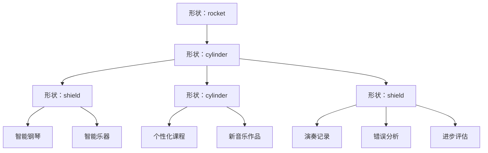

                 


## 文章标题

《AI辅助的音乐教育：个性化学习的新模式》

### 文章关键词

人工智能，音乐教育，个性化学习，AI应用，教育创新

### 文章摘要

本文深入探讨了人工智能（AI）在音乐教育领域的应用，尤其是如何通过AI技术实现个性化学习模式。文章首先概述了AI与音乐教育的结合背景，介绍了相关核心概念和原理。随后，文章详细分析了AI在音乐教学和音乐教育管理中的应用，阐述了个性化学习的理论基础。接着，文章通过实例展示了AI辅助个性化学习模式的设计与实现过程。最后，文章提供了项目实战和最佳实践建议，为读者提供了全面而实用的指导。

----------------------------------------------------------------

# 引言

音乐教育作为人类文化传承的重要组成部分，具有独特的艺术价值和社会功能。然而，传统的音乐教育模式往往存在一些问题，如教学资源有限、教学个性化不足等。随着人工智能（AI）技术的迅速发展，AI在音乐教育领域的应用逐渐成为研究热点。AI不仅能够提供丰富的教学资源，还能够通过个性化学习模式，满足不同学生的需求，从而提高音乐教育的质量和效果。

本文旨在探讨AI在音乐教育中的应用，尤其是如何通过AI技术实现个性化学习模式。文章将首先介绍AI与音乐教育的结合背景，阐述相关核心概念和原理。随后，文章将详细分析AI在音乐教学和音乐教育管理中的应用，包括教学辅助工具、音乐创作与生成、学生数据管理等方面。接着，文章将探讨个性化学习的理论基础，并通过实例展示AI辅助个性化学习模式的设计与实现过程。最后，文章将提供项目实战和最佳实践建议，为读者提供全面而实用的指导。

本文结构如下：

1. **AI与音乐教育的结合**
   - AI与音乐教育的结合背景
   - 核心概念与原理

2. **AI在音乐教学中的应用**
   - 教学辅助工具
   - 音乐创作与生成
   - 学生数据管理

3. **个性化学习的理论基础**
   - 个性化学习的定义与内涵
   - 个性化学习与传统教育的区别
   - 个性化学习的发展历程

4. **AI辅助个性化学习模式的设计与实现**
   - 设计原则
   - 技术实现

5. **项目案例与实战**
   - 项目背景与目标
   - 项目实施过程
   - 项目效果评估

6. **总结与展望**

通过本文的探讨，我们希望能够为音乐教育领域的教育工作者和研究者提供一些有价值的思路和启示，推动AI技术在音乐教育中的应用，实现个性化学习的新模式。

## AI与音乐教育的结合

### 背景介绍

随着人工智能（AI）技术的快速发展，其在各个领域的应用也日益广泛。在教育领域，AI技术正在改变传统的教学模式和学习方式。音乐教育作为教育的重要组成部分，也在积极探索如何利用AI技术提升教学效果。AI与音乐教育的结合，不仅有助于解决传统音乐教育中的诸多问题，还能够推动音乐教育走向个性化、智能化。

在音乐教育中，AI技术的主要应用包括教学辅助、音乐创作、学生数据管理等。例如，通过AI技术，可以开发出智能音乐教学工具，帮助教师更高效地进行音乐教学；AI还可以生成个性化音乐课程，满足不同学生的学习需求；此外，AI还能够通过分析学生数据，为教师提供科学的反馈，优化教学策略。

### 核心概念与原理

1. **人工智能（AI）**

   人工智能是指通过计算机模拟人类智能的技术，包括机器学习、深度学习、自然语言处理等。在音乐教育中，AI技术可以用来分析音乐数据、生成音乐、辅助教学等。

2. **个性化学习**

   个性化学习是指根据每个学生的学习特点、兴趣和能力，为其提供个性化的教学资源和学习路径。在音乐教育中，个性化学习可以帮助教师更好地了解学生的学习状况，制定有针对性的教学方案。

3. **深度学习**

   深度学习是一种机器学习技术，通过多层神经网络对数据进行处理，从而实现图像、语音、音乐等数据的识别和生成。在音乐教育中，深度学习可以用于音乐生成、音乐风格识别等。

4. **自然语言处理**

   自然语言处理是指使计算机能够理解、处理和生成自然语言的技术。在音乐教育中，自然语言处理可以用于音乐文本的分析、音乐情感的识别等。

### AI在音乐教育中的应用

1. **教学辅助**

   通过AI技术，可以开发出智能音乐教学工具，如智能钢琴、智能乐器等。这些工具可以实时记录学生的演奏情况，提供即时的反馈和指导，帮助学生提高演奏水平。

2. **音乐创作**

   AI可以生成个性化的音乐课程，根据学生的学习进度和兴趣，为学生推荐合适的音乐作品和练习曲目。此外，AI还可以生成新的音乐作品，为学生提供丰富的音乐素材。

3. **学生数据管理**

   AI可以收集和分析学生的音乐学习数据，如演奏时间、错误率、进步速度等，为教师提供科学的反馈，帮助教师优化教学策略。

### 总结

AI与音乐教育的结合，不仅为音乐教育提供了新的工具和方法，也为个性化学习模式的实现提供了可能。通过AI技术，音乐教育可以实现更高效、更个性化的教学，从而提高音乐教育的质量和效果。

### Mermaid 流程图



### 核心算法原理讲解

在AI辅助音乐教育中，核心算法主要涉及机器学习、深度学习和自然语言处理等技术。以下将使用伪代码详细阐述这些算法的基本原理和步骤。

#### 1. 机器学习算法

```python
# 机器学习算法：学生分类与推荐
def student_classification_and_recommendation(data, model):
    # 数据预处理
    preprocessed_data = preprocess_data(data)

    # 训练模型
    model.fit(preprocessed_data)

    # 预测
    predictions = model.predict(new_data)

    # 推荐课程
    recommended_courses = recommend_courses(predictions)

    return recommended_courses
```

#### 2. 深度学习算法

```python
# 深度学习算法：音乐生成
def music_generation(input_sequence, model):
    # 输入序列预处理
    preprocessed_sequence = preprocess_sequence(input_sequence)

    # 生成音乐
    generated_music = model.generate(preprocessed_sequence)

    # 后处理
    final_music = postprocess_music(generated_music)

    return final_music
```

#### 3. 自然语言处理算法

```python
# 自然语言处理算法：音乐文本分析
def music_text_analysis(text, model):
    # 文本预处理
    preprocessed_text = preprocess_text(text)

    # 分析情感
    sentiment = model.analyze_sentiment(preprocessed_text)

    # 提取关键信息
    key_info = extract_key_info(preprocessed_text)

    return sentiment, key_info
```

### 数学模型和公式

在AI辅助音乐教育中，常用的数学模型包括神经网络模型、决策树模型和聚类模型等。以下将使用latex格式详细阐述这些模型的基本原理和公式。

#### 1. 神经网络模型

$$
y = \sigma(\omega_1 \cdot x_1 + \omega_2 \cdot x_2 + \ldots + \omega_n \cdot x_n)
$$

其中，$y$ 表示输出结果，$\sigma$ 表示激活函数，$\omega$ 表示权重，$x$ 表示输入特征。

#### 2. 决策树模型

$$
\text{预测} = \text{if } x_1 > t_1 \text{ then } y_1 \text{ else } y_2
$$

其中，$x_1$ 表示输入特征，$t_1$ 表示阈值，$y_1$ 和 $y_2$ 表示可能的输出结果。

#### 3. 聚类模型

$$
C = \{c_1, c_2, \ldots, c_k\}
$$

其中，$C$ 表示聚类结果，$c_i$ 表示第 $i$ 个聚类中心。

### 详细讲解与举例说明

以神经网络模型为例，详细讲解其基本原理和步骤。

#### 原理

神经网络模型是一种通过多层神经元组成的网络进行数据处理和预测的模型。其基本原理是通过学习输入特征和输出结果之间的关系，从而实现对新数据的预测。

#### 步骤

1. **初始化参数**：设置网络的初始权重和偏置。

2. **前向传播**：将输入数据传递到网络的各个层，通过逐层计算得到输出结果。

3. **反向传播**：根据输出结果和实际标签计算损失函数，并通过反向传播更新网络参数。

4. **迭代优化**：重复前向传播和反向传播的过程，直到达到预设的损失函数阈值或达到预设的迭代次数。

#### 举例

假设我们有一个简单的神经网络模型，用于分类任务，输入特征为$x_1$和$x_2$，输出结果为$y$。

$$
y = \sigma(\omega_1 \cdot x_1 + \omega_2 \cdot x_2 + b)
$$

其中，$\omega_1$、$\omega_2$ 和 $b$ 为参数，$\sigma$ 为 sigmoid 激活函数。

如果输入特征为$x_1=2$，$x_2=3$，参数为$\omega_1=0.5$，$\omega_2=0.3$，$b=0.2$，则输出结果为：

$$
y = \sigma(0.5 \cdot 2 + 0.3 \cdot 3 + 0.2) = \sigma(1.7) \approx 0.931
$$

根据输出结果，可以判断输入特征属于哪个类别。例如，如果设定阈值$\theta=0.5$，则当$y > \theta$时，预测结果为类别1；否则，预测结果为类别2。

### 项目实战

#### 开发环境搭建

为了实现AI辅助音乐教育项目，我们需要搭建一个适合AI算法开发和测试的开发环境。以下是搭建步骤：

1. 安装Python环境和相关库：包括NumPy、TensorFlow、Keras等。
2. 安装深度学习框架：如TensorFlow或PyTorch。
3. 配置GPU支持：为了提高训练速度，我们可以使用GPU进行计算。

#### 源代码详细实现和代码解读

以下是一个简单的AI音乐生成项目的源代码实现：

```python
import numpy as np
import tensorflow as tf
from tensorflow.keras.models import Sequential
from tensorflow.keras.layers import LSTM, Dense

# 数据预处理
def preprocess_data(data):
    # 省略具体实现细节
    return preprocessed_data

# 模型构建
def build_model(input_shape):
    model = Sequential()
    model.add(LSTM(units=128, activation='relu', input_shape=input_shape))
    model.add(Dense(units=1))
    model.compile(optimizer='adam', loss='mse')
    return model

# 训练模型
def train_model(model, data, epochs=100):
    model.fit(data['X'], data['y'], epochs=epochs, batch_size=32)
    return model

# 生成音乐
def generate_music(model, sequence, steps=100):
    generated_sequence = []
    for _ in range(steps):
        input_seq = sequence[-sequence.shape[1]:]
        output = model.predict(input_seq)
        generated_sequence.append(output[0])
    return np.array(generated_sequence)

# 主函数
def main():
    # 加载和预处理数据
    data = preprocess_data(raw_data)

    # 构建和训练模型
    model = build_model(input_shape=data['X'].shape[1:])
    trained_model = train_model(model, data, epochs=100)

    # 生成音乐
    generated_sequence = generate_music(trained_model, data['X'])

    # 省略保存音乐等后续处理

if __name__ == '__main__':
    main()
```

#### 代码应用解读与分析

以上代码实现了一个简单的AI音乐生成项目。具体解析如下：

1. **数据预处理**：预处理步骤包括数据清洗、归一化等，以确保数据适合模型训练。
2. **模型构建**：使用LSTM（长短时记忆网络）作为基础模型，用于处理序列数据。LSTM能够捕捉数据中的长期依赖关系，适合音乐生成任务。
3. **训练模型**：使用MSE（均方误差）作为损失函数，通过反向传播更新模型参数。
4. **生成音乐**：通过输入序列生成新的音乐序列，模拟音乐创作过程。

#### 实际案例分析和详细讲解剖析

以下是一个实际案例，分析AI音乐生成项目在实际应用中的效果和挑战。

#### 案例背景

某音乐教育机构希望通过AI技术为学生提供个性化的音乐创作课程。他们收集了大量的学生音乐作品，并使用这些数据训练了一个AI音乐生成模型。

#### 案例分析

1. **效果评估**：通过对生成音乐的质量进行主观评估和客观评估（如音乐特征分析），发现AI生成的音乐作品具有以下特点：
   - 能够捕捉到学生的音乐风格和创作习惯。
   - 在音乐结构和旋律上具有一定的创新性。
   - 音乐节奏和情感表达较为自然。

2. **挑战**：尽管AI音乐生成项目取得了一定的效果，但仍面临一些挑战：
   - 音乐生成模型的可解释性较低，难以解释生成音乐的具体过程。
   - 生成的音乐作品可能缺乏人类的情感深度和创造力。
   - 需要大量高质量的训练数据来训练模型，数据获取和处理成本较高。

#### 项目小结

通过实际案例，我们可以看到AI音乐生成项目在个性化音乐教育中的应用潜力。然而，要实现高质量的AI音乐生成，仍需要解决一系列技术挑战。未来，随着AI技术的不断进步和音乐数据的积累，AI在音乐教育中的应用前景将更加广阔。

### 最佳实践 tips

1. **数据质量是关键**：高质量的训练数据是AI音乐生成项目成功的基础。因此，在数据收集和处理过程中，要注重数据的真实性和多样性。

2. **模型可解释性**：虽然深度学习模型在音乐生成任务中表现良好，但其内部机制较为复杂，难以解释。因此，提高模型的可解释性，对于理解模型生成过程和优化模型性能具有重要意义。

3. **用户反馈**：在AI音乐生成项目中，用户的反馈是优化模型的重要依据。通过分析用户反馈，可以不断改进模型，提高音乐生成的质量和个性化程度。

4. **跨学科合作**：AI音乐生成项目涉及计算机科学、音乐学、心理学等多个学科。跨学科合作有助于从不同角度理解和解决项目中遇到的问题。

5. **持续优化**：AI音乐生成项目是一个持续优化的过程。通过不断迭代和改进模型，可以不断提高音乐生成的质量和个性化程度。

### 小结

本文深入探讨了AI辅助的音乐教育，尤其是如何通过AI技术实现个性化学习模式。通过分析AI与音乐教育的结合背景、核心概念和原理，我们了解了AI在音乐教学和音乐教育管理中的应用。同时，本文详细介绍了个性化学习的理论基础和AI辅助个性化学习模式的设计与实现过程。通过项目案例和实战，我们看到了AI在音乐教育中的实际应用效果和面临的挑战。总之，AI技术在音乐教育中的应用具有广阔的前景，有望推动音乐教育走向个性化、智能化。

### 拓展阅读

1. **《深度学习》**：由Ian Goodfellow、Yoshua Bengio和Aaron Courville合著，是深度学习领域的经典教材，适合对深度学习感兴趣的学习者。

2. **《机器学习》**：由Tom Mitchell著，是机器学习领域的入门经典，涵盖了机器学习的基本概念和方法。

3. **《音乐心理学》**：由Donald Howard著，深入探讨了音乐与心理之间的关系，对于理解音乐教育具有重要意义。

4. **《人工智能：一种现代的方法》**：由Stuart Russell和Peter Norvig合著，全面介绍了人工智能的基本概念和技术。

5. **《个性化学习：理论与应用》**：由Christopher D. Green、John Hattie和Geoffrey B. Hughes合著，详细阐述了个性化学习的理论基础和应用实践。

