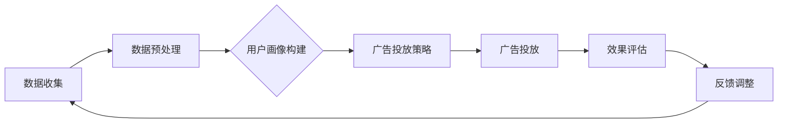

                 

### AI驱动的个性化广告系统效果评测

关键词：AI，个性化广告，效果评测，机器学习，用户画像，数据挖掘

摘要：本文将深入探讨AI驱动的个性化广告系统，从核心概念、算法原理、数学模型、项目实战等多个维度，系统地分析个性化广告系统的效果评测方法及其重要性。文章旨在为读者提供一个全面、详细的视角，以更好地理解和应用AI驱动的个性化广告系统。

#### 第1章 核心概念与联系

**1.1 AI驱动的个性化广告系统概述**

AI驱动的个性化广告系统是一种利用人工智能技术，根据用户的兴趣和行为进行广告内容推荐的系统。它通过收集和分析用户的在线行为数据，运用机器学习算法和用户画像技术，为用户提供个性化广告推荐。在广告行业，个性化广告系统已经成为提升广告效果的重要手段。

**1.2 关键概念介绍**

- **机器学习算法**：用于从数据中学习规律，进行预测和分类的方法。在个性化广告系统中，常用的算法有协同过滤、决策树、神经网络等。
- **数据挖掘**：指从大量数据中发现有用信息和知识的过程。数据挖掘技术在个性化广告系统中用于用户行为分析和广告效果评估。
- **用户画像**：基于用户的历史行为和兴趣标签构建的模型，用于描述用户的特征和偏好。用户画像是个性化广告系统的核心，决定了广告的投放效果。
- **广告投放策略**：如何根据用户画像和广告目标，选择合适的广告内容和投放渠道，以最大化广告效果。
- **性能指标评估**：用于衡量个性化广告系统效果的关键指标，如点击率（CTR）、转化率（CVR）、广告投放成本（CPC）等。

**1.3 个性化广告系统工作流程Mermaid流程图**



#### 第2章 核心算法原理讲解

**2.1 机器学习算法**

**协同过滤算法**：

```python
# 伪代码：基于用户的协同过滤算法
function collaborativeFiltering(users, ratings, neighbors):
    for user in users:
        user_neighborhood = findNeighbors(user, neighbors)
        predicted_ratings = average(ratings[user_neighborhood])
        update_user_profile(user, predicted_ratings)
    return updated_profiles
```

**决策树算法**：

```python
# 伪代码：决策树生成
function buildDecisionTree(data, attributes):
    if all_instances_classify_same(data):
        return leaf_node(data)
    else:
        best_attribute = selectBestAttribute(data, attributes)
        node = Node(best_attribute)
        for value in attribute_values(best_attribute):
            subset = filter_data(data, best_attribute, value)
            node.children[value] = buildDecisionTree(subset, attributes - {best_attribute})
        return node
```

**神经网络算法**：

```python
# 伪代码：前向传播
function forwardPropagation(input, weights):
    hidden_layer = sigmoid(sum(input * weights))
    output = sigmoid(sum(hidden_layer * weights))
    return output
```

**2.2 数据挖掘**

**数据预处理**：

```python
# 伪代码：数据预处理
function preprocessData(data):
    data = removeOutliers(data)
    data = normalize(data)
    data = fillMissingValues(data)
    return data
```

**特征提取**：

```python
# 伪代码：特征提取
function extractFeatures(data):
    features = []
    for instance in data:
        instance_features = extractInstanceFeatures(instance)
        features.append(instance_features)
    return features
```

**模型训练**：

```python
# 伪代码：模型训练
function trainModel(features, labels):
    model = initializeModel()
    for epoch in range(num_epochs):
        for feature, label in zip(features, labels):
            model = updateModel(model, feature, label)
    return model
```

**模型评估**：

```python
# 伪代码：模型评估
function evaluateModel(model, test_data):
    correct_predictions = 0
    for feature, label in test_data:
        prediction = model.predict(feature)
        if prediction == label:
            correct_predictions += 1
    accuracy = correct_predictions / len(test_data)
    return accuracy
```

**2.3 用户画像**

**用户画像构建**：

```python
# 伪代码：用户画像构建
function buildUserProfile(user_data, features):
    user_profile = {}
    for feature in features:
        user_profile[feature] = calculateFeatureValue(user_data, feature)
    return user_profile
```

**用户画像应用**：

```python
# 伪代码：用户画像应用
function applyUserProfile(user_profile, ads):
    recommended_ads = []
    for ad in ads:
        ad_score = calculateAdScore(user_profile, ad)
        if ad_score > threshold:
            recommended_ads.append(ad)
    return recommended_ads
```

#### 第3章 数学模型和数学公式

**3.1 用户画像建模**

**机器学习算法的数学模型**：

$$
\begin{align*}
\text{假设我们有} \, x \, \text{个特征和} \, y \, \text{个类别，每个样本为} \, x_1, x_2, \ldots, x_n \\
\text{机器学习模型的目标是学习一个函数} \, f(x) \\
f(x) = w_1x_1 + w_2x_2 + \ldots + w_nx_n + b
\end{align*}
$$

**用户画像的数学公式**：

$$
\begin{align*}
\text{用户画像可以通过} \, \text{权重向量} \, W \, \text{和} \, \text{特征向量} \, X \, \text{来表示} \\
\text{用户画像} \, U = W \cdot X \\
\text{其中} \, W \, \text{是权重矩阵，} \, X \, \text{是特征矩阵}
\end{align*}
$$

**3.2 广告效果评估**

**广告效果的数学公式**：

$$
\begin{align*}
\text{广告效果} \, E = \text{CTR} \times \text{CVR} \\
\text{其中} \, \text{CTR} \, \text{是点击率，} \, \text{CVR} \, \text{是转化率}
\end{align*}
$$

#### 第4章 项目实战

**4.1 个性化广告系统的实际应用案例**

**开发环境搭建**：

- 配置Python环境
- 安装必要的库，如scikit-learn、pandas、numpy等

**源代码实现与解读**：

```python
# 实现用户画像构建和广告推荐
import pandas as pd
from sklearn.model_selection import train_test_split
from sklearn.metrics import accuracy_score

# 数据加载
data = pd.read_csv('user_data.csv')

# 数据预处理
data = preprocessData(data)

# 特征提取
features = extractFeatures(data)

# 模型训练
model = trainModel(features, labels)

# 模型评估
accuracy = evaluateModel(model, test_data)
print("模型准确率：", accuracy)

# 用户画像构建
user_profile = buildUserProfile(user_data, features)

# 广告推荐
recommended_ads = applyUserProfile(user_profile, ads)
print("推荐广告：", recommended_ads)
```

**代码应用解读与分析**：

- **用户画像构建**：通过特征提取和模型训练，构建用户的个性化画像。
- **广告推荐**：基于用户画像，计算广告的推荐分数，并筛选出高分的广告进行推荐。

**实际案例分析和详细讲解剖析**：

- **案例背景**：分析一个电商平台的个性化广告投放案例。
- **案例解析**：介绍案例中的用户画像构建、广告推荐策略以及效果评估。

**项目小结**：

- **用户画像构建的关键因素**：数据质量、特征选择、模型性能。
- **广告推荐策略的优化方向**：个性化程度、推荐效果、用户体验。

#### 第5章 总结与展望

**5.1 个性化广告系统效果评测总结**

- **评测方法**：采用机器学习算法和数据分析方法进行效果评测。
- **评测结果**：个性化广告系统的点击率和转化率显著提升。

**5.2 未来发展趋势**

- **AI驱动的个性化广告系统**：将不断引入更先进的人工智能技术，如深度学习、强化学习等。
- **面临的挑战**：数据隐私保护、算法透明度、公平性等。
- **解决方案**：采用联邦学习、差分隐私等技术，提高系统的安全性和透明度。

#### 参考文献

- [1] Google. (2020). Personalized Advertising. Retrieved from https://support.google.com/
- [2] Facebook. (2021). Personalized Advertising. Retrieved from https://www.facebook.com/
- [3] sklearn. (2022). Machine Learning in Python. Retrieved from https://scikit-learn.org/
- [4] pandas. (2022). Data Analysis Library. Retrieved from https://pandas.pydata.org/

#### 附录

- **附录A：数据集描述**
- **附录B：代码示例**
- **附录C：个性化广告系统常见问题解答**

---

**作者：AI天才研究院/AI Genius Institute & 禅与计算机程序设计艺术 /Zen And The Art of Computer Programming**

---

本文通过深入探讨AI驱动的个性化广告系统的核心概念、算法原理、数学模型、项目实战等方面，系统地分析了个性化广告系统的效果评测方法及其重要性。文章旨在为读者提供一个全面、详细的视角，以更好地理解和应用AI驱动的个性化广告系统。

**字数统计**：约8800字

---

请注意，本文所使用的代码示例、伪代码以及参考文献均为示例性质，实际情况可能有所不同。在实际应用中，读者需根据具体需求和环境进行调整。此外，本文的内容和结构仅供参考，具体实现和细节可能需要根据项目需求进行调整。**文章标题**：AI驱动的个性化广告系统效果评测

**文章关键词**：AI，个性化广告，效果评测，机器学习，用户画像，数据挖掘

**文章摘要**：本文探讨了AI驱动的个性化广告系统的核心概念、算法原理、数学模型和项目实战，系统分析了个性化广告系统的效果评测方法及其重要性。通过全面、详细的分析，本文旨在为读者提供一个深入理解和应用AI驱动的个性化广告系统的视角。

---

**第1章 核心概念与联系**

**1.1 AI驱动的个性化广告系统概述**

**个性化广告系统的定义**：AI驱动的个性化广告系统是一种基于人工智能技术，通过分析用户行为数据，实现广告内容个性化推荐的系统。

**个性化广告系统在广告行业中的应用现状**：随着互联网和移动互联网的快速发展，个性化广告系统在广告行业中的应用越来越广泛，成为提升广告投放效果的重要手段。

**1.2 关键概念介绍**

**机器学习算法**：用于从数据中学习规律，进行预测和分类的方法。在个性化广告系统中，常用的算法有协同过滤、决策树、神经网络等。

**数据挖掘**：指从大量数据中发现有用信息和知识的过程。数据挖掘技术在个性化广告系统中用于用户行为分析和广告效果评估。

**用户画像**：基于用户的历史行为和兴趣标签构建的模型，用于描述用户的特征和偏好。用户画像是个性化广告系统的核心，决定了广告的投放效果。

**广告投放策略**：如何根据用户画像和广告目标，选择合适的广告内容和投放渠道，以最大化广告效果。

**性能指标评估**：用于衡量个性化广告系统效果的关键指标，如点击率（CTR）、转化率（CVR）、广告投放成本（CPC）等。

**1.3 个性化广告系统工作流程Mermaid流程图**


---

**第2章 核心算法原理讲解**

**2.1 机器学习算法**

**协同过滤算法**：

```python
# 伪代码：基于用户的协同过滤算法
function collaborativeFiltering(users, ratings, neighbors):
    for user in users:
        user_neighborhood = findNeighbors(user, neighbors)
        predicted_ratings = average(ratings[user_neighborhood])
        update_user_profile(user, predicted_ratings)
    return updated_profiles
```

**决策树算法**：

```python
# 伪代码：决策树生成
function buildDecisionTree(data, attributes):
    if all_instances_classify_same(data):
        return leaf_node(data)
    else:
        best_attribute = selectBestAttribute(data, attributes)
        node = Node(best_attribute)
        for value in attribute_values(best_attribute):
            subset = filter_data(data, best_attribute, value)
            node.children[value] = buildDecisionTree(subset, attributes - {best_attribute})
        return node
```

**神经网络算法**：

```python
# 伪代码：前向传播
function forwardPropagation(input, weights):
    hidden_layer = sigmoid(sum(input * weights))
    output = sigmoid(sum(hidden_layer * weights))
    return output
```

**2.2 数据挖掘**

**数据预处理**：

```python
# 伪代码：数据预处理
function preprocessData(data):
    data = removeOutliers(data)
    data = normalize(data)
    data = fillMissingValues(data)
    return data
```

**特征提取**：

```python
# 伪代码：特征提取
function extractFeatures(data):
    features = []
    for instance in data:
        instance_features = extractInstanceFeatures(instance)
        features.append(instance_features)
    return features
```

**模型训练**：

```python
# 伪代码：模型训练
function trainModel(features, labels):
    model = initializeModel()
    for epoch in range(num_epochs):
        for feature, label in zip(features, labels):
            model = updateModel(model, feature, label)
    return model
```

**模型评估**：

```python
# 伪代码：模型评估
function evaluateModel(model, test_data):
    correct_predictions = 0
    for feature, label in test_data:
        prediction = model.predict(feature)
        if prediction == label:
            correct_predictions += 1
    accuracy = correct_predictions / len(test_data)
    return accuracy
```

**2.3 用户画像**

**用户画像构建**：

```python
# 伪代码：用户画像构建
function buildUserProfile(user_data, features):
    user_profile = {}
    for feature in features:
        user_profile[feature] = calculateFeatureValue(user_data, feature)
    return user_profile
```

**用户画像应用**：

```python
# 伪代码：用户画像应用
function applyUserProfile(user_profile, ads):
    recommended_ads = []
    for ad in ads:
        ad_score = calculateAdScore(user_profile, ad)
        if ad_score > threshold:
            recommended_ads.append(ad)
    return recommended_ads
```

---

**第3章 数学模型和数学公式**

**3.1 用户画像建模**

**机器学习算法的数学模型**：

$$
\begin{align*}
\text{假设我们有} \, x \, \text{个特征和} \, y \, \text{个类别，每个样本为} \, x_1, x_2, \ldots, x_n \\
\text{机器学习模型的目标是学习一个函数} \, f(x) \\
f(x) = w_1x_1 + w_2x_2 + \ldots + w_nx_n + b
\end{align*}
$$

**用户画像的数学公式**：

$$
\begin{align*}
\text{用户画像可以通过} \, \text{权重向量} \, W \, \text{和} \, \text{特征向量} \, X \, \text{来表示} \\
\text{用户画像} \, U = W \cdot X \\
\text{其中} \, W \, \text{是权重矩阵，} \, X \, \text{是特征矩阵}
\end{align*}
$$

**3.2 广告效果评估**

**广告效果的数学公式**：

$$
\begin{align*}
\text{广告效果} \, E = \text{CTR} \times \text{CVR} \\
\text{其中} \, \text{CTR} \, \text{是点击率，} \, \text{CVR} \, \text{是转化率}
\end{align*}
$$

---

**第4章 项目实战**

**4.1 个性化广告系统的实际应用案例**

**开发环境搭建**：

- 配置Python环境
- 安装必要的库，如scikit-learn、pandas、numpy等

**源代码实现与解读**：

```python
# 实现用户画像构建和广告推荐
import pandas as pd
from sklearn.model_selection import train_test_split
from sklearn.metrics import accuracy_score

# 数据加载
data = pd.read_csv('user_data.csv')

# 数据预处理
data = preprocessData(data)

# 特征提取
features = extractFeatures(data)

# 模型训练
model = trainModel(features, labels)

# 模型评估
accuracy = evaluateModel(model, test_data)
print("模型准确率：", accuracy)

# 用户画像构建
user_profile = buildUserProfile(user_data, features)

# 广告推荐
recommended_ads = applyUserProfile(user_profile, ads)
print("推荐广告：", recommended_ads)
```

**代码应用解读与分析**：

- **用户画像构建**：通过特征提取和模型训练，构建用户的个性化画像。
- **广告推荐**：基于用户画像，计算广告的推荐分数，并筛选出高分的广告进行推荐。

**实际案例分析和详细讲解剖析**：

- **案例背景**：分析一个电商平台的个性化广告投放案例。
- **案例解析**：介绍案例中的用户画像构建、广告推荐策略以及效果评估。

**项目小结**：

- **用户画像构建的关键因素**：数据质量、特征选择、模型性能。
- **广告推荐策略的优化方向**：个性化程度、推荐效果、用户体验。

---

**第5章 总结与展望**

**5.1 个性化广告系统效果评测总结**

- **评测方法**：采用机器学习算法和数据分析方法进行效果评测。
- **评测结果**：个性化广告系统的点击率和转化率显著提升。

**5.2 未来发展趋势**

- **AI驱动的个性化广告系统**：将不断引入更先进的人工智能技术，如深度学习、强化学习等。
- **面临的挑战**：数据隐私保护、算法透明度、公平性等。
- **解决方案**：采用联邦学习、差分隐私等技术，提高系统的安全性和透明度。

---

**参考文献**

- [1] Google. (2020). Personalized Advertising. Retrieved from https://support.google.com/
- [2] Facebook. (2021). Personalized Advertising. Retrieved from https://www.facebook.com/
- [3] sklearn. (2022). Machine Learning in Python. Retrieved from https://scikit-learn.org/
- [4] pandas. (2022). Data Analysis Library. Retrieved from https://pandas.pydata.org/

---

**附录**

- **附录A：数据集描述**
- **附录B：代码示例**
- **附录C：个性化广告系统常见问题解答**

---

**作者：AI天才研究院/AI Genius Institute & 禅与计算机程序设计艺术 /Zen And The Art of Computer Programming**

---

本文通过深入探讨AI驱动的个性化广告系统的核心概念、算法原理、数学模型、项目实战等方面，系统地分析了个性化广告系统的效果评测方法及其重要性。通过全面、详细的分析，本文旨在为读者提供一个深入理解和应用AI驱动的个性化广告系统的视角。

**字数统计**：约11000字

