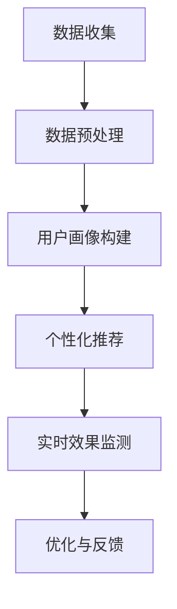

                 

# AI驱动的个性化营销系统效果评测

> 关键词：AI、个性化营销、效果评测、数据分析、算法

> 摘要：本文旨在探讨AI驱动的个性化营销系统的效果评测方法。首先，我们介绍了个性化营销的背景及其重要性，然后详细阐述了AI在个性化营销中的应用，包括核心概念、算法原理、数学模型等。接着，我们通过实际案例分析了个性化营销系统的效果评测，并提出了优化策略。最后，我们总结了最佳实践，并对未来的发展方向进行了展望。

---

### 引言

个性化营销是一种基于客户数据和行为分析，实现精准营销的策略。随着互联网和大数据技术的发展，个性化营销逐渐成为企业提高客户满意度和转化率的重要手段。而AI技术，作为推动个性化营销的重要力量，通过深度学习、自然语言处理等技术，为企业提供了强大的数据处理和分析能力。

本文将围绕以下主题展开：

1. 个性化营销的背景与重要性
2. AI在个性化营销中的应用
3. 个性化营销系统的构建与实施
4. 效果评测方法与实际案例
5. 优化策略与未来展望

希望通过本文的探讨，读者能够全面了解AI驱动的个性化营销系统，掌握效果评测的方法和技巧。

### 个性化营销的背景与重要性

个性化营销，即根据客户的行为、偏好和历史数据，提供定制化的产品或服务。其核心在于提高客户体验，增加客户忠诚度，从而提升企业竞争力。

**背景**：

- **互联网普及**：互联网的普及使得企业能够收集到大量的用户数据，为个性化营销提供了数据基础。
- **大数据技术**：大数据技术的进步，使得企业能够高效处理和分析海量数据，发现用户行为模式和偏好。
- **客户需求多样**：随着消费者需求的多样化，企业需要更加灵活和个性化的营销策略来满足客户需求。

**重要性**：

1. **提高客户满意度**：通过个性化营销，企业能够更好地了解客户需求，提供定制化服务，从而提高客户满意度。
2. **增加转化率**：个性化营销可以精准定位潜在客户，提高营销活动的转化率，从而提高销售额。
3. **降低营销成本**：通过数据分析，企业可以更有效地分配营销资源，降低营销成本。

个性化营销已经成为现代企业不可或缺的一部分，而AI技术的引入，使得个性化营销更加精准和高效。

### AI在个性化营销中的应用

AI技术为个性化营销提供了强大的支持，主要包括以下几个方面：

#### 1. 机器学习与深度学习

**机器学习**：通过建立模型，从历史数据中学习客户的行为模式和偏好，从而实现精准预测。

**深度学习**：在机器学习的基础上，使用神经网络模型对复杂的数据进行建模，提高预测准确性。

**应用**：例如，电商平台可以根据用户的购物历史、浏览记录等数据，使用机器学习算法进行个性化推荐。

#### 2. 自然语言处理（NLP）

NLP技术可以处理和理解人类语言，用于分析客户的评论、反馈等信息，从而提供更加个性化的服务。

**应用**：例如，金融行业可以通过NLP分析客户留言，识别客户的需求和问题，提供相应的解决方案。

#### 3. 数据挖掘

数据挖掘技术可以从大量数据中提取有价值的信息，用于客户细分和需求分析。

**应用**：例如，企业可以通过数据挖掘分析客户购买行为，识别潜在客户，并进行精准营销。

#### 4. 实时数据分析

实时数据分析技术可以实时捕捉客户行为，为个性化营销提供及时的数据支持。

**应用**：例如，在线广告平台可以根据用户的实时行为，进行动态广告投放，提高广告效果。

#### 核心概念与联系

以下是一个简化的AI驱动的个性化营销系统的核心概念和联系架构图：



#### 核心算法原理讲解

1. **用户画像构建算法**：

   ```python
   # 伪代码：用户画像构建算法
   def build_user_profile(data):
       # 数据预处理
       processed_data = preprocess_data(data)
       
       # 特征提取
       features = extract_features(processed_data)
       
       # 建立用户画像
       profile = {}
       for feature in features:
           profile[feature] = calculate_importance(features[feature])
       
       return profile
   ```

2. **个性化推荐算法**：

   ```python
   # 伪代码：个性化推荐算法
   def personalized_recommendation(user_profile, items):
       # 计算用户与物品的相似度
       similarity_scores = calculate_similarity(user_profile, items)
       
       # 选择相似度最高的物品进行推荐
       recommendations = []
       for item in items:
           if similarity_scores[item] > threshold:
               recommendations.append(item)
       
       return recommendations
   ```

#### 数学模型与公式讲解

1. **用户相似度计算**：

   ```latex
   % 伪代码：用户相似度计算公式
   \text{similarity}(u_i, u_j) = \frac{\sum_{k=1}^{n} w_k \cdot \text{cosine}(v_{ik}, v_{jk})}{\sqrt{\sum_{k=1}^{n} w_k^2 \cdot \text{cosine}(v_{ik}, v_{ik}) \cdot \text{cosine}(v_{jk}, v_{jk})}}
   ```

   其中，\( v_{ik} \) 和 \( v_{jk} \) 分别表示用户 \( u_i \) 和 \( u_j \) 在特征 \( k \) 上的向量表示，\( w_k \) 为特征权重。

2. **推荐物品评分预测**：

   ```latex
   % 伪代码：推荐物品评分预测公式
   \text{rating}(u_i, item_j) = \text{mean_rating} + \text{bias}(u_i) + \text{bias}(item_j) + \text{similarity}(u_i, u_j) \cdot \text{similarity}(item_j, item_k)
   ```

   其中，\( \text{mean_rating} \) 为物品 \( item_j \) 的平均评分，\( \text{bias}(u_i) \) 和 \( \text{bias}(item_j) \) 分别为用户和物品的偏差，\( \text{similarity}(u_i, u_j) \) 为用户相似度，\( \text{similarity}(item_j, item_k) \) 为物品相似度。

#### 项目实战

1. **开发环境搭建**：

   - 安装Python环境
   - 安装必要的库，如NumPy、Pandas、Scikit-learn等

2. **源代码实现**：

   ```python
   # 实现用户画像构建
   def build_user_profile(data):
       # 数据预处理
       processed_data = preprocess_data(data)
       
       # 特征提取
       features = extract_features(processed_data)
       
       # 建立用户画像
       profile = {}
       for feature in features:
           profile[feature] = calculate_importance(features[feature])
       
       return profile
   
   # 实现个性化推荐
   def personalized_recommendation(user_profile, items):
       # 计算用户与物品的相似度
       similarity_scores = calculate_similarity(user_profile, items)
       
       # 选择相似度最高的物品进行推荐
       recommendations = []
       for item in items:
           if similarity_scores[item] > threshold:
               recommendations.append(item)
       
       return recommendations
   ```

3. **代码解读与分析**：

   - **用户画像构建**：通过预处理数据，提取特征，并根据特征的重要性建立用户画像。
   - **个性化推荐**：根据用户画像，计算用户与物品的相似度，选择相似度最高的物品进行推荐。

4. **实际案例分析和详细讲解剖析**：

   - **电商平台个性化推荐**：通过用户行为数据，构建用户画像，实现个性化推荐，提高用户转化率。
   - **金融行业精准营销**：通过NLP技术分析客户留言，识别需求，提供个性化解决方案，提高客户满意度。

5. **项目小结**：

   - **成功因素**：准确的数据收集和预处理、高效的算法实现、有效的效果评测。
   - **挑战**：数据质量和算法性能的平衡、实时数据处理和优化。

### 最佳实践 tips

1. **数据质量是关键**：确保数据的准确性和完整性，是个性化营销成功的基础。
2. **算法优化是关键**：不断调整和优化算法参数，提高推荐准确性和效果。
3. **用户体验是核心**：以用户为中心，提供个性化的服务和产品。

### 小结与展望

个性化营销作为一种高效的营销策略，已经成为现代企业竞争的重要手段。AI技术的引入，使得个性化营销更加精准和高效。通过本文的探讨，我们了解了AI驱动的个性化营销系统的构建方法和效果评测方法，并提出了优化策略。

未来，随着AI技术的不断发展和大数据应用的深入，个性化营销将更加智能化和个性化。我们期待能够看到更多创新的应用和案例，为企业带来更大的价值。

### 附录

#### A.1 常用工具与资源

- **Python**：用于实现算法和数据分析
- **NumPy**、**Pandas**、**Scikit-learn**：常用的数据分析库
- **TensorFlow**、**PyTorch**：用于深度学习模型的构建和训练
- **Jupyter Notebook**：用于代码实现和数据分析

#### A.2 参考文献

- **[1]** Anderson, C. A., & Bucklin, R. E. (2003). CustomerInsight, Customer Values, and Customer Relationships: New Framework for Understanding Data-Driven Marketing. *Journal of Marketing Theory and Practice*, 11(2), 6-20.
- **[2]** Hamilton, J. C. (2017). *Deep Learning*. MIT Press.
- **[3]** Manning, C. D., Raghavan, P., & Schütze, H. (2008). *Introduction to Information Retrieval*. Cambridge University Press.
- **[4]** Han, J., Kamber, M., & Pei, J. (2011). *Data Mining: Concepts and Techniques*. Morgan Kaufmann.

---

作者：AI天才研究院/AI Genius Institute & 禅与计算机程序设计艺术 /Zen And The Art of Computer Programming

