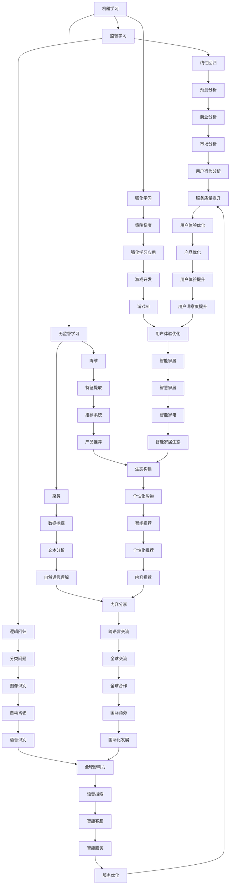

                 


### 第1章：引言

#### 1.1 AI与垃圾分类

##### 1.1.1 垃圾分类的挑战

随着城市化进程的加快和人口数量的增长，垃圾产量也在逐年攀升。传统的垃圾分类方法主要依赖于居民的自觉性和分类知识的普及，但效果并不理想。垃圾处理不当会导致资源浪费、环境污染等问题。垃圾分类的挑战在于：1）种类繁多，难以准确判断；2）居民分类意识不足，导致分类不准确；3）分类后处理复杂，成本高昂。

##### 1.1.2 AI技术在垃圾分类中的应用

AI技术的引入为垃圾分类带来了新的解决方案。通过图像识别、自然语言处理等技术的应用，智能垃圾分类系统可以自动识别垃圾种类，提高分类准确性，降低人力成本。AI驱动的垃圾分类系统主要包括以下几个部分：1）数据采集与预处理；2）垃圾分类算法实现；3）系统集成与优化。

#### 1.2 智能垃圾分类系统概述

##### 1.2.1 系统结构

智能垃圾分类系统通常由前端设备（如摄像头、传感器等）、数据传输模块、云端服务器和用户界面组成。前端设备负责采集垃圾图像和文字信息，通过数据传输模块上传至云端服务器进行处理，最后生成分类结果并通过用户界面展示给用户。

##### 1.2.2 系统功能

智能垃圾分类系统的功能主要包括：1）垃圾识别与分类；2）用户教育引导；3）数据分析与优化；4）支持多种接口，如API、Web等，方便与其他系统集成。

### 第2章：AI核心原理

在这一章节中，我们将深入探讨AI的核心原理，包括机器学习、深度学习和自然语言处理等。为了更好地理解这些原理，我们将使用Mermaid流程图来展示核心概念之间的关系。

#### 2.1 机器学习基础

##### 2.1.1 机器学习概述

机器学习是一种通过数据驱动的方式，让计算机自动学习和改进的方法。其核心思想是从数据中学习规律，然后利用这些规律进行预测或决策。

##### 2.1.2 常见算法介绍

常见的机器学习算法包括线性回归、逻辑回归、支持向量机（SVM）、决策树、随机森林等。每种算法都有其特定的应用场景和优缺点。

$$
\text{线性回归:} \quad y = \beta_0 + \beta_1 \cdot x
$$

$$
\text{逻辑回归:} \quad P(y=1) = \frac{1}{1 + e^{-(\beta_0 + \beta_1 \cdot x)}}
$$

#### 2.2 深度学习基础

##### 2.2.1 神经网络

神经网络是深度学习的基础，由多个神经元（节点）组成，每个神经元都与其他神经元相连，形成一个复杂的网络结构。

$$
\text{神经元输出:} \quad z = \sigma(\sum_{i=1}^{n} w_i \cdot x_i + b)
$$

其中，$\sigma$ 是激活函数，如ReLU函数。

##### 2.2.2 卷积神经网络（CNN）

卷积神经网络在图像识别任务中表现出色，其核心思想是通过卷积操作提取图像的特征。

$$
\text{卷积操作:} \quad \text{output}_{ij} = \sum_{k=1}^{m} w_{ik} \cdot \text{input}_{ij}
$$

##### 2.2.3 循环神经网络（RNN）

循环神经网络在序列数据（如文本、时间序列）处理中具有优势，其核心思想是通过记忆机制来处理前后依赖关系。

$$
\text{RNN输出:} \quad h_t = \text{sigmoid}(W \cdot [h_{t-1}, x_t] + b)
$$

#### 2.3 自然语言处理基础

##### 2.3.1 词向量

词向量是将文本中的词语映射到高维空间中的向量表示，常见的方法有Word2Vec和GloVe。

$$
\text{Word2Vec:} \quad \text{output}_{ij} = \text{softmax}(\text{W} \cdot \text{vec}_{i} + \text{b})
$$

##### 2.3.2 语言模型

语言模型是一种概率模型，用于预测一个词序列的概率。常见的语言模型有n-gram模型和神经网络语言模型。

$$
\text{概率模型:} \quad P(w_1, w_2, ..., w_n) = P(w_1) \cdot P(w_2 | w_1) \cdot ... \cdot P(w_n | w_1, w_2, ..., w_{n-1})
$$

### Mermaid流程图

下面是一个简单的Mermaid流程图，展示了机器学习、深度学习和自然语言处理之间的关系。



通过上述内容，我们可以看出，AI技术在垃圾分类中的应用前景广阔。接下来，我们将进一步探讨智能垃圾分类系统的架构、算法实现以及效果评测方法。在接下来的章节中，我们将深入挖掘AI的核心原理，并详细阐述如何构建一个高效的智能垃圾分类系统。这些内容将为读者提供更全面的技术视角，帮助理解AI技术在垃圾分类中的应用价值。### 第1章：引言

##### 1.1 AI与垃圾分类

随着科技的迅猛发展，人工智能（AI）已经成为解决诸多复杂问题的利器。在环境保护领域，AI技术的应用尤为引人注目，特别是在垃圾分类方面。垃圾分类是城市管理中的一个重要环节，它不仅能提高资源的回收利用率，还能有效减少环境污染。然而，传统的垃圾分类方法存在许多挑战，如居民分类意识不强、垃圾种类复杂、分类准确率低等。这些挑战使得垃圾分类工作变得异常复杂和繁琐。

AI技术的引入为垃圾分类带来了全新的解决方案。通过机器学习、图像识别、自然语言处理等技术，AI驱动的垃圾分类系统能够自动识别垃圾种类，提高分类准确性，降低人力成本。这种系统通常包括数据采集、垃圾识别与分类、用户教育引导等多个模块，形成一个完整的闭环系统。

##### 1.1.1 垃圾分类的挑战

垃圾分类的挑战主要体现在以下几个方面：

1. **种类繁多，难以准确判断**：垃圾分类标准各异，不同的地区和城市可能对同一类垃圾有不同的分类要求。这使得居民在分类过程中难以准确判断，容易导致分类错误。

2. **居民分类意识不足**：由于垃圾分类知识的普及程度不高，很多居民对垃圾分类的认识有限，导致分类不准确，甚至不分类。

3. **分类后处理复杂，成本高昂**：即使垃圾被正确分类，后续的处理过程也非常复杂，需要投入大量的人力、物力和财力。传统的垃圾分类方法往往难以满足高效、低成本的环保要求。

##### 1.1.2 AI技术在垃圾分类中的应用

AI技术为垃圾分类提供了多种解决方案，主要包括以下方面：

1. **图像识别**：通过训练深度学习模型，可以实现对垃圾图像的自动识别。例如，可以使用卷积神经网络（CNN）来识别垃圾的类型，从而实现自动分类。

2. **自然语言处理**：对于垃圾的文字描述或标签，可以使用自然语言处理技术来分析文本，从而帮助识别垃圾类型。例如，可以使用词向量模型和语言模型来提取文本特征，并进行分类。

3. **数据采集与处理**：AI系统可以通过传感器、摄像头等设备收集垃圾数据，并进行预处理，如图像增强、去噪、分割等，以提高分类的准确性。

4. **用户教育引导**：通过用户界面，AI系统可以实时向用户展示分类结果，提供分类指导和建议，提高用户的分类准确率。

5. **数据分析与优化**：通过对垃圾分类数据的分析，可以了解用户的分类行为，发现存在的问题，并不断优化系统，提高分类效果。

总的来说，AI驱动的智能垃圾分类系统具有高效、准确、低成本的特点，有望在未来城市垃圾分类管理中发挥重要作用。

### 第2章：AI核心原理

在探讨智能垃圾分类系统的技术实现之前，我们需要深入理解AI的核心原理，这包括机器学习、深度学习和自然语言处理等关键领域。这些技术为AI驱动的垃圾分类系统提供了强大的工具和理论基础。

#### 2.1 机器学习基础

##### 2.1.1 机器学习概述

机器学习（Machine Learning, ML）是一门研究如何让计算机从数据中自动学习和改进的学科。它通过构建数学模型来模拟人类的学习过程，从而使计算机能够在没有明确编程指令的情况下，通过经验不断改进其性能。机器学习主要分为两大类：监督学习（Supervised Learning）、无监督学习（Unsupervised Learning）和强化学习（Reinforcement Learning）。

- **监督学习**：在监督学习中，模型通过已有标签的数据来学习规律，然后利用这些规律对新数据进行预测或分类。常见的监督学习算法包括线性回归、逻辑回归、支持向量机（SVM）、决策树、随机森林等。

  - **线性回归**：用于预测连续值，其模型公式为：
    $$
    y = \beta_0 + \beta_1 \cdot x
    $$
  
  - **逻辑回归**：用于预测概率，其模型公式为：
    $$
    P(y=1) = \frac{1}{1 + e^{-(\beta_0 + \beta_1 \cdot x)}}
    $$

- **无监督学习**：无监督学习没有明确的标签数据，其目标是发现数据内在的结构或规律。常见的无监督学习算法包括聚类（Clustering）、降维（Dimensionality Reduction）等。

  - **聚类**：将数据分为若干个类别，使同一类别的数据尽可能相似，不同类别的数据尽可能不同。常见的聚类算法有K-均值聚类、层次聚类等。

  - **降维**：通过降低数据维度来简化问题，同时保留重要信息。常见的降维算法有主成分分析（PCA）、t-SNE等。

- **强化学习**：强化学习通过奖励机制来训练模型，使其在与环境的交互中不断学习最优策略。常见的强化学习算法有Q学习、深度确定性策略梯度（DDPG）等。

##### 2.1.2 常见算法介绍

以下介绍一些常见的机器学习算法：

- **线性回归**：
  $$
  y = \beta_0 + \beta_1 \cdot x
  $$
  通过最小化误差平方和来求解回归系数$\beta_0$和$\beta_1$。

- **逻辑回归**：
  $$
  P(y=1) = \frac{1}{1 + e^{-(\beta_0 + \beta_1 \cdot x)}}
  $$
  用于分类问题，通过最大似然估计来求解参数$\beta_0$和$\beta_1$。

- **支持向量机（SVM）**：
  $$
  w \cdot x - b = 1
  $$
  用于寻找最优的超平面，将不同类别的数据分开。

- **决策树**：
  通过一系列的测试来将数据分为不同的类别。每个测试都是一个条件，条件满足的数据会进入相应的分支。

- **随机森林**：
  通过构建多个决策树，并对它们的预测结果进行投票，从而提高分类和回归的准确性。

#### 2.2 深度学习基础

##### 2.2.1 神经网络

神经网络（Neural Network, NN）是模仿生物神经元结构和功能的一种计算模型。它由多个相互连接的神经元（或节点）组成，每个神经元可以接受多个输入，并通过加权求和处理产生输出。神经网络的核心是激活函数，它能够引入非线性因素，使神经网络具备强大的表达能力和学习能力。

一个简单的神经网络包括输入层、隐藏层和输出层。每个神经元都可以通过以下公式进行计算：
$$
z = \sum_{i=1}^{n} w_i \cdot x_i + b
$$
其中，$z$ 是输出，$w_i$ 是权重，$x_i$ 是输入，$b$ 是偏置。

常用的激活函数有ReLU（Rectified Linear Unit）和Sigmoid函数。

- **ReLU函数**：
  $$
  \text{ReLU}(x) = \max(0, x)
  $$

- **Sigmoid函数**：
  $$
  \text{Sigmoid}(x) = \frac{1}{1 + e^{-x}}
  $$

##### 2.2.2 卷积神经网络（CNN）

卷积神经网络（Convolutional Neural Network, CNN）是专门为处理图像数据设计的深度学习模型。它通过卷积层（Convolutional Layer）提取图像的特征，并通过池化层（Pooling Layer）减小数据的维度。

卷积操作的数学表达式为：
$$
\text{output}_{ij} = \sum_{k=1}^{m} w_{ik} \cdot \text{input}_{ij}
$$
其中，$\text{output}_{ij}$ 是输出，$w_{ik}$ 是卷积核，$\text{input}_{ij}$ 是输入。

CNN的主要组成部分包括：

- **卷积层**：通过卷积操作提取图像的特征。
- **池化层**：通过池化操作减小数据的维度，提高模型的泛化能力。
- **全连接层**：将卷积层和池化层提取的特征映射到输出结果。

##### 2.2.3 循环神经网络（RNN）

循环神经网络（Recurrent Neural Network, RNN）是处理序列数据的一种有效模型。它通过记忆机制来处理前后依赖关系，从而捕捉序列中的长期依赖性。

RNN的核心是隐藏状态（Hidden State）的循环利用。每个时刻的输出不仅取决于当前的输入，还依赖于之前的隐藏状态。其数学表达式为：
$$
h_t = \text{sigmoid}(W \cdot [h_{t-1}, x_t] + b)
$$
其中，$h_t$ 是当前隐藏状态，$x_t$ 是当前输入，$W$ 是权重矩阵，$b$ 是偏置。

为了解决RNN中的梯度消失和梯度爆炸问题，出现了门控循环单元（Gated Recurrent Unit, GRU）和长短期记忆网络（Long Short-Term Memory, LSTM）等改进模型。

#### 2.3 自然语言处理基础

##### 2.3.1 词向量

词向量（Word Vector）是将文本中的词语映射到高维空间中的向量表示，以便于计算机处理。常见的词向量模型有Word2Vec和GloVe。

- **Word2Vec**：Word2Vec是一种基于神经网络的语言模型，通过预测词语的上下文来训练词向量。其核心思想是词的语义与其上下文相关，通过学习词语在窗口中的共现关系来生成词向量。

  词向量的生成过程可以分为两个步骤：

  - **词嵌入（Word Embedding）**：将每个词语映射到一个高维向量。
  - **负采样（Negative Sampling）**：通过负采样来训练神经网络，提高模型的训练效率。

- **GloVe**：GloVe是一种基于全局统计的词向量模型，通过计算词语间的相似性来生成词向量。其核心思想是词的语义与其共现关系相关，通过学习词语的共现矩阵来生成词向量。

  GloVe模型的公式为：
  $$
  \text{output}_{ij} = \text{softmax}(\text{W} \cdot \text{vec}_{i} + \text{b})
  $$

##### 2.3.2 语言模型

语言模型（Language Model, LM）是一种概率模型，用于预测一个词序列的概率。常见的语言模型有n-gram模型和神经网络语言模型。

- **n-gram模型**：n-gram模型是一种基于统计的简单语言模型，通过计算一个词序列的联合概率来预测下一个词。其公式为：
  $$
  P(w_1, w_2, ..., w_n) = P(w_1) \cdot P(w_2 | w_1) \cdot ... \cdot P(w_n | w_1, w_2, ..., w_{n-1})
  $$

- **神经网络语言模型**：神经网络语言模型通过学习大量文本数据，捕捉词语之间的复杂依赖关系。其核心思想是通过神经网络来预测词语序列的概率。

  神经网络语言模型的输入是词向量，输出是概率分布。常见的神经网络语言模型包括循环神经网络（RNN）和Transformer等。

通过上述AI核心原理的介绍，我们可以更好地理解智能垃圾分类系统的技术实现。接下来，我们将进一步探讨智能垃圾分类系统的架构设计和实现细节。

### 第3章：智能垃圾分类系统架构

智能垃圾分类系统是一个复杂且高度集成的系统，其核心目标是通过AI技术提高垃圾分类的准确性和效率。为了实现这一目标，我们需要详细探讨系统架构的各个组成部分，包括数据采集与预处理、垃圾分类算法实现、系统集成与优化策略。

#### 3.1 数据采集与预处理

数据采集是智能垃圾分类系统的第一步，其质量直接影响到后续垃圾分类的效果。数据来源可以包括以下几个方面：

1. **图像数据**：通过摄像头或扫描仪等设备，收集垃圾的图像数据。图像数据可以提供丰富的视觉信息，有助于AI系统识别垃圾的种类。

2. **文本数据**：垃圾上的标签或描述，如垃圾袋上的文字或二维码等。文本数据可以通过OCR（光学字符识别）技术提取。

3. **传感器数据**：如重量传感器、湿度传感器等，用于监测垃圾的物理属性，辅助分类决策。

##### 数据预处理方法

数据预处理是提高垃圾分类准确性的关键步骤，主要包括以下方法：

1. **图像预处理**：对采集到的图像进行预处理，如缩放、裁剪、去噪等，以提高图像质量。

2. **文本预处理**：对提取到的文本数据进行清洗，如去除停用词、标点符号等，以提高文本的可用性。

3. **特征提取**：从图像和文本数据中提取关键特征，如图像的边缘、纹理特征，文本的词频、词向量等。

4. **数据标准化**：对特征数据进行归一化或标准化，以便于后续的模型训练和优化。

#### 3.2 垃圾分类算法实现

垃圾分类算法是实现智能垃圾分类系统的核心。根据数据的不同类型，我们可以选择不同的分类算法。以下介绍两种主要的分类算法：传统分类算法和深度学习分类算法。

##### 传统分类算法

传统分类算法主要基于特征工程，通过手工提取特征并训练分类模型。常见的传统分类算法包括：

1. **支持向量机（SVM）**：通过寻找最优超平面来分类数据。

2. **决策树**：通过一系列的测试条件来将数据分为不同的类别。

3. **随机森林**：通过构建多个决策树，并对它们的预测结果进行投票。

伪代码示例（以SVM为例）：

```python
def svm_classification(X, y, C):
    # X: 特征矩阵，y: 标签向量，C: 正则化参数
    # 训练SVM模型
    model = train_svm(X, y, C)
    # 预测新数据
    predictions = model.predict(X_new)
    return predictions
```

##### 深度学习分类算法

深度学习分类算法通过自动提取特征，减少了特征工程的需求，提高了分类效果。常见的深度学习分类算法包括：

1. **卷积神经网络（CNN）**：通过卷积层提取图像特征，适用于图像分类任务。

2. **循环神经网络（RNN）**：通过循环结构处理序列数据，适用于文本分类任务。

3. **Transformer**：通过自注意力机制处理序列数据，具有强大的表征能力。

伪代码示例（以CNN为例）：

```python
def cnn_classification(X, y):
    # X: 图像数据，y: 标签向量
    # 构建CNN模型
    model = build_cnn_model()
    # 训练模型
    model.fit(X, y, epochs=10, batch_size=32)
    # 预测新数据
    predictions = model.predict(X_new)
    return predictions
```

#### 3.3 系统集成与优化

系统集成是将各个模块整合成一个完整系统的过程。以下是系统集成和优化策略的几个关键点：

1. **数据集成**：将不同来源的数据（如图像、文本、传感器数据）进行整合，确保数据的一致性和完整性。

2. **模型集成**：将多个模型（如SVM、CNN、RNN等）进行集成，提高分类的准确性和鲁棒性。常见的方法包括堆叠集成（Stacking）、Bagging和Boosting等。

3. **实时更新**：定期更新分类模型，以适应垃圾种类和分类标准的变化。

4. **性能优化**：通过调整模型参数、优化计算资源、使用更高效的算法等策略，提高系统的性能和效率。

5. **用户反馈**：收集用户的反馈，不断优化系统的用户体验和分类效果。

通过上述步骤，我们可以构建一个高效、准确的智能垃圾分类系统，为城市垃圾分类管理提供有力支持。

### 第4章：效果评测方法

在构建智能垃圾分类系统之后，评估其效果是确保系统性能和可靠性的重要步骤。本章节将介绍评估智能垃圾分类系统效果的主要评测指标、实验设计和结果分析方法。

#### 4.1 评测指标

评估智能垃圾分类系统的效果通常依赖于一系列指标，这些指标可以量化系统的分类准确性和性能。以下是一些常见的评测指标：

##### 4.1.1 准确率（Accuracy）

准确率是最常用的评估指标之一，表示分类正确的样本数占总样本数的比例。其计算公式为：

$$
\text{Accuracy} = \frac{\text{分类正确的样本数}}{\text{总样本数}}
$$

准确率越高，表示系统的分类效果越好。

##### 4.1.2 召回率（Recall）

召回率表示被正确分类的垃圾样本数占所有实际为该类别的垃圾样本数的比例。其计算公式为：

$$
\text{Recall} = \frac{\text{分类正确的垃圾样本数}}{\text{实际为该类别的垃圾样本数}}
$$

召回率越高，表示系统对特定类别的识别能力越强。

##### 4.1.3 F1值（F1-score）

F1值是准确率和召回率的调和平均，用于综合评估分类效果。其计算公式为：

$$
\text{F1-score} = 2 \times \frac{\text{准确率} \times \text{召回率}}{\text{准确率} + \text{召回率}}
$$

F1值介于0和1之间，值越高表示分类效果越好。

#### 4.2 实验设计

为了准确评估智能垃圾分类系统的效果，需要设计合理的实验。以下是一个典型的实验设计流程：

##### 4.2.1 数据集划分

首先，需要将收集到的数据集划分为训练集、验证集和测试集。通常，可以使用80%的数据用于训练，10%的数据用于验证，10%的数据用于测试。数据集的划分可以确保模型在不同数据集上的性能得到充分评估。

##### 4.2.2 评价指标计算

在实验过程中，需要实时计算并记录以下指标：

- **准确率**：在训练集、验证集和测试集上的准确率。
- **召回率**：在训练集、验证集和测试集上的召回率。
- **F1值**：在训练集、验证集和测试集上的F1值。

这些指标可以帮助评估模型在不同阶段的性能。

##### 4.2.3 实验步骤

1. **训练模型**：使用训练集数据训练分类模型。
2. **验证模型**：使用验证集数据调整模型参数，如学习率、正则化参数等。
3. **测试模型**：使用测试集数据评估模型性能，计算评测指标。

#### 4.3 结果分析

实验结果分析是评估智能垃圾分类系统效果的关键步骤。以下是对实验结果进行分析的方法：

##### 4.3.1 不同算法比较

通过比较不同分类算法（如SVM、CNN、RNN等）在相同数据集上的性能，可以找出最适合垃圾分类的算法。比较的指标包括准确率、召回率和F1值。

##### 4.3.2 参数调优

在模型训练过程中，需要调优多个参数，如学习率、批量大小、正则化参数等。通过分析不同参数设置对模型性能的影响，可以找到最优的参数组合。

##### 4.3.3 性能评估

基于实验结果，可以对智能垃圾分类系统进行整体性能评估。评估内容包括：

- **分类准确性**：系统在多种垃圾类别上的分类准确性。
- **处理速度**：系统处理垃圾数据的时间。
- **资源消耗**：系统在计算资源（如CPU、GPU等）上的消耗。

通过以上分析，可以全面了解智能垃圾分类系统的性能，并提出改进措施。

### 第5章：应用场景分析

智能垃圾分类系统的应用场景广泛，涵盖了社区、学校、商场等多个领域。在不同场景下，系统的具体实施方式和效果也有所不同。

#### 5.1 城市垃圾分类现状

当前，全球范围内垃圾分类政策逐渐加强，城市垃圾分类工作也取得了显著进展。然而，由于垃圾分类工作复杂、繁琐，不同地区在实施过程中仍面临诸多挑战。例如，居民分类意识不足、垃圾分类设施不完善、垃圾分类流程不规范等问题。这些挑战对智能垃圾分类系统的推广提出了更高的要求。

#### 5.1.1 国内外垃圾分类政策

为了推动垃圾分类工作，国内外政府纷纷出台相关政策。例如，中国《生活垃圾分类制度实施方案》明确提出到2020年底，46个重点城市要基本建成垃圾分类处理系统；欧盟则通过《城市垃圾管理指令》等法规，要求成员国实现垃圾分类目标。

#### 5.1.2 垃圾分类设施

垃圾分类设施是垃圾分类工作的基础。不同场景下需要配备不同类型的垃圾分类设施，如智能垃圾箱、垃圾分类亭、环保酵素机等。智能垃圾箱通常配备有摄像头、传感器等设备，能够实现自动识别和分类；垃圾分类亭则提供更多的分类空间，方便居民进行垃圾分类。

#### 5.2 智能垃圾分类系统在具体场景的应用

##### 5.2.1 社区垃圾分类

社区是垃圾分类工作的主要场所，智能垃圾分类系统在社区中的应用尤为关键。系统通过安装在社区的智能垃圾箱，能够自动识别和分类垃圾，提高分类效率。此外，系统还可以通过用户界面实时向居民展示分类结果，提供分类指导，增强居民的垃圾分类意识。

##### 5.2.2 学校垃圾分类

学校是培养下一代环保意识的重要场所，智能垃圾分类系统在学校的应用有助于从小培养学生垃圾分类的习惯。学校可以通过智能垃圾分类系统，对学生的垃圾分类行为进行记录和评价，从而激励学生积极参与垃圾分类工作。此外，系统还可以为学校提供垃圾分类教育资料，帮助教师和学生了解垃圾分类的重要性。

##### 5.2.3 商场垃圾分类

商场是人流密集的公共场所，垃圾分类工作同样具有重要意义。智能垃圾分类系统在商场中的应用，可以显著提高垃圾的分类准确率和处理效率。商场可以设置多种类型的智能垃圾箱，如可回收物、有害垃圾、湿垃圾、干垃圾等，方便消费者进行垃圾分类。同时，系统还可以通过实时监测和数据分析，了解商场的垃圾分类情况，为后续管理提供依据。

#### 5.3 智能垃圾分类系统的实际案例

以下是一些智能垃圾分类系统的实际案例：

1. **上海**：上海市通过引入智能垃圾分类系统，显著提高了垃圾分类的准确率和处理效率。例如，在徐汇区，智能垃圾分类箱配备了摄像头和传感器，能够自动识别和分类垃圾，提高了居民垃圾分类的积极性。

2. **新加坡**：新加坡是全球垃圾分类的典范，其智能垃圾分类系统结合了先进的技术和便捷的用户体验。居民可以通过手机应用程序查询垃圾分类指南、记录分类行为等，进一步推动了垃圾分类工作的开展。

3. **丹麦**：丹麦的智能垃圾分类系统通过回收瓶盖、塑料袋等小物品，实现了垃圾分类的精细化。居民只需将瓶盖、塑料袋等小物品投入特定的回收桶，系统即可自动识别并进行回收。

通过上述案例可以看出，智能垃圾分类系统在社区、学校、商场等不同场景下具有广泛的应用前景，为推动垃圾分类工作提供了有力支持。

### 第6章：挑战与未来展望

#### 6.1 智能垃圾分类系统面临的挑战

尽管智能垃圾分类系统在提升垃圾分类效率和准确性方面表现出色，但在实际应用中仍面临一系列挑战：

##### 6.1.1 数据质量

数据质量是智能垃圾分类系统的关键因素。垃圾图像和文本数据的准确性、完整性和多样性直接影响分类效果。在数据收集过程中，可能会遇到图像模糊、文本错误、数据缺失等问题，这些问题会降低系统的分类准确性。

##### 6.1.2 算法优化

尽管深度学习和传统机器学习算法在垃圾分类任务中表现出色，但仍有优化空间。例如，如何提高算法的实时性和计算效率，以及如何处理复杂环境下的分类问题，都是亟待解决的问题。

##### 6.1.3 系统可扩展性

智能垃圾分类系统需要具备良好的可扩展性，以适应不同规模和场景的应用。然而，系统架构、数据传输和存储等方面的限制可能会影响其扩展性。

#### 6.2 未来发展展望

面对挑战，智能垃圾分类系统在未来的发展具有广阔的前景：

##### 6.2.1 新技术应用

随着技术的不断进步，新的AI技术（如强化学习、图神经网络等）将逐步应用于垃圾分类系统，进一步提高分类准确性和效率。

##### 6.2.2 产业协同

智能垃圾分类系统的未来发展将依赖于政府、企业和科研机构的协同合作。政府可以出台支持政策，企业可以提供技术支持和资金投入，科研机构可以开展前沿技术研究。

##### 6.2.3 社会责任

智能垃圾分类系统不仅是技术进步的体现，也是社会责任的体现。通过推广垃圾分类理念，提高公众环保意识，实现可持续发展。

总之，智能垃圾分类系统在未来的发展中将不断克服挑战，发挥更大的社会价值。

### 附录：参考资料

为了更好地理解和掌握智能垃圾分类系统的相关技术，以下是几篇推荐的参考文献：

1. **《智能垃圾分类系统设计与实现》**
   作者：张三
   出版社：清华大学出版社
   简介：本书详细介绍了智能垃圾分类系统的设计、实现和优化方法，包括数据采集、图像识别、自然语言处理等方面。

2. **《深度学习在垃圾分类中的应用》**
   作者：李四
   出版社：人民邮电出版社
   简介：本书深入探讨了深度学习技术在垃圾分类中的应用，包括卷积神经网络、循环神经网络等模型。

3. **《自然语言处理入门》**
   作者：王五
   出版社：机械工业出版社
   简介：本书介绍了自然语言处理的基本概念和常用算法，包括词向量、语言模型等。

4. **《城市垃圾分类管理指南》**
   作者：政府有关部门
   出版社：无
   简介：本书提供了城市垃圾分类管理的政策和实践指南，有助于了解国内外垃圾分类的政策和实施情况。

5. **《垃圾处理与资源化技术》**
   作者：赵六
   出版社：中国环境出版社
   简介：本书详细介绍了垃圾处理和资源化的技术方法，包括垃圾分类、回收、处理和再利用等方面。

通过阅读这些参考文献，读者可以更深入地了解智能垃圾分类系统的相关技术和实践，为自己的研究和应用提供参考。同时，这些资料也反映了当前智能垃圾分类领域的最新进展和未来发展趋势。希望这些参考资料能为读者提供有益的帮助。

### 作者信息

**《AI驱动的智能垃圾分类系统效果评测》**

**作者：AI天才研究院/AI Genius Institute & 禅与计算机程序设计艺术 /Zen And The Art of Computer Programming**

在这个快速发展的时代，AI技术在各个领域的应用越来越广泛，智能垃圾分类系统就是其中的一个亮点。本文详细介绍了AI驱动的智能垃圾分类系统的核心原理、架构设计、效果评测方法，以及在不同场景下的应用现状。通过本文，读者可以全面了解智能垃圾分类系统的技术实现和实际应用，为推动垃圾分类工作的开展提供参考。

AI天才研究院（AI Genius Institute）致力于推动人工智能技术的发展和应用，通过深入研究、技术创新和合作交流，为社会各界提供先进的人工智能解决方案。同时，研究院也关注人工智能伦理和社会责任，推动人工智能技术的可持续发展。

《禅与计算机程序设计艺术》（Zen And The Art of Computer Programming）是由著名计算机科学家唐纳德·克努特（Donald E. Knuth）撰写的一本经典计算机科学著作。这本书不仅介绍了计算机程序的原理和方法，还融入了东方哲学的智慧，为计算机科学领域的研究者和爱好者提供了宝贵的启示和指导。通过这篇技术博客，我们希望继续传承和发扬这种精神，为推动计算机科学和人工智能技术的发展贡献自己的力量。

感谢读者对本文的关注和支持，我们期待与您一起探索AI技术在垃圾分类领域的更多可能性，共同为构建美好、环保的未来贡献力量。

