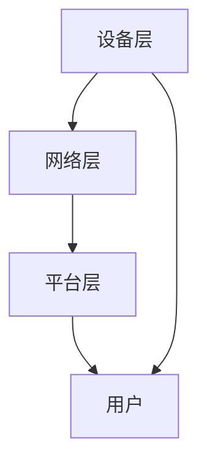

                 

### 文章标题

《AI驱动的智能家居系统用户体验评测》

### 关键词

- AI驱动的智能家居
- 用户体验评测
- 语音识别
- 视觉识别
- 机器学习

### 摘要

随着人工智能（AI）技术的不断进步，智能家居系统已经逐渐成为现代家庭生活中不可或缺的一部分。本文旨在探讨AI驱动的智能家居系统在用户体验方面的评测方法与实践。文章首先概述了AI在智能家居中的应用和发展趋势，然后深入分析了语音识别、视觉识别和机器学习等核心技术及其在智能家居系统中的应用。接着，本文详细介绍了智能家居用户体验评测的方法和指标，并通过实际案例展示了评测过程和结果。最后，文章对未来的发展趋势进行了展望，为智能家居系统用户体验的提升提供了指导和建议。

---

## 第一部分：AI在智能家居中的应用概述

### 1.1 AI在智能家居中的发展趋势

随着物联网（IoT）和云计算技术的快速发展，智能家居市场正迎来前所未有的增长。AI技术的引入，使得智能家居系统从传统的自动化控制向智能化、个性化方向迈进。以下是一些AI在智能家居中的发展趋势：

1. **个性化推荐**：通过用户行为数据分析和机器学习算法，智能家居系统可以提供个性化的设备推荐和场景设置，满足用户的个性化需求。

2. **自动化控制**：AI技术使得智能家居系统能够实现高度自动化，通过自然语言处理和语音识别技术，用户可以通过语音命令控制家居设备。

3. **实时数据分析**：智能家居系统可以利用AI技术实时分析家庭数据，如能耗、环境质量等，提供实时的反馈和优化建议。

4. **安全防护**：AI技术在智能家居安全防护中的应用日益广泛，通过图像识别和异常行为检测，系统能够实时监测家庭安全，提高用户居住的安全性。

5. **智能化互联互通**：AI技术促进了不同智能家居设备之间的互联互通，用户可以通过一个统一的平台或APP来管理所有的智能家居设备。

### 1.2 AI与智能家居用户体验的关系

AI技术在智能家居系统中的应用，不仅提升了系统的自动化和智能化水平，同时也对用户体验产生了深远的影响：

1. **便利性**：通过自然语言处理和语音识别技术，用户可以更方便地控制家居设备，无需手动操作，提高生活便利性。

2. **个性化**：AI技术可以根据用户的习惯和偏好，提供个性化的设备推荐和场景设置，满足用户的个性化需求。

3. **安全性**：AI技术在智能家居安全防护中的应用，提高了用户居住的安全性，减少了家庭安全风险。

4. **互动性**：智能家居系统通过语音交互和视觉识别技术，增强了用户与家居设备之间的互动性，提升了用户体验。

### 1.3 智能家居系统架构概述

一个典型的智能家居系统通常包括以下几个核心部分：

1. **设备层**：包括各种智能家居设备，如智能灯泡、智能插座、智能门锁等。

2. **网络层**：通过WiFi、ZigBee、蓝牙等无线通信技术，实现设备之间的互联互通。

3. **平台层**：智能家居系统平台，用于设备管理、数据存储和数据处理。

4. **应用层**：用户可以通过手机APP、网页或语音助手等接口与智能家居系统进行交互。

下图展示了智能家居系统的整体架构：



智能家居系统架构的这种分层设计，使得系统能够灵活扩展，易于维护和管理。接下来，我们将深入探讨AI技术在智能家居系统中的应用，以及如何通过用户体验评测来提升系统性能。

---

## 第二部分：AI核心技术在智能家居中的应用

### 2.1 语音识别与智能家居

#### 2.1.1 语音识别技术原理

语音识别（Voice Recognition）技术是人工智能的一个重要分支，其核心任务是将人类语音信号转换为相应的文本信息。语音识别技术的基本原理包括以下几个步骤：

1. **音频信号处理**：首先对采集到的音频信号进行预处理，包括去除噪声、增强语音信号等。

2. **特征提取**：将预处理后的音频信号转换为能够反映语音特征的向量。常用的特征提取方法包括梅尔频率倒谱系数（MFCC）、线性预测编码（LPC）等。

3. **模型训练**：使用大量标注好的语音数据集，通过机器学习算法（如深度神经网络、支持向量机等）训练语音识别模型。

4. **解码**：模型接收语音信号后，将其转换为文本输出。解码过程包括将模型输出的概率分布转换为实际的文本。

#### 2.1.2 语音识别在智能家居中的应用

在智能家居系统中，语音识别技术可以用于多种应用场景，提高用户交互的便利性。以下是一些典型的应用：

1. **语音控制设备**：用户可以通过语音指令控制智能家居设备，如开关灯光、调节温度、设置安防等。

2. **语音助手**：智能家居系统中的语音助手可以提供天气预报、交通信息、日程提醒等增值服务。

3. **语音交互控制**：通过语音识别技术，用户可以在家中实现与设备的自然语言交互，提升整体用户体验。

#### 2.1.3 语音识别算法伪代码示例

以下是语音识别算法的伪代码示例：

```plaintext
# 伪代码：基于深度神经网络的语音识别算法

# 特征提取
def extract_features(audio_signal):
    # 噪声去除、信号增强等
    processed_signal = noise_removal(audio_signal)
    # 特征提取
    features = MFCC(processed_signal)
    return features

# 模型训练
def train_model(training_data):
    # 初始化模型
    model = NeuralNetwork()
    # 训练模型
    for epoch in range(num_epochs):
        for audio_signal, label in training_data:
            features = extract_features(audio_signal)
            model.fit(features, label)
    return model

# 解码
def decode(model, audio_signal):
    features = extract_features(audio_signal)
    probabilities = model.predict(features)
    # 转换为文本输出
    text_output = convert_to_text(probabilities)
    return text_output
```

### 2.2 视觉识别与智能家居

#### 2.2.1 视觉识别技术原理

视觉识别（Visual Recognition）技术是利用计算机算法识别和理解图像或视频内容的技术。视觉识别技术的基本原理包括：

1. **图像预处理**：对采集到的图像或视频进行预处理，包括去噪、增强、大小调整等。

2. **特征提取**：将预处理后的图像转换为能够反映图像特征的向量。常用的特征提取方法包括哈希特征、SIFT特征、卷积神经网络特征等。

3. **模型训练**：使用大量标注好的图像数据集，通过机器学习算法（如卷积神经网络、支持向量机等）训练视觉识别模型。

4. **分类与识别**：模型接收图像或视频后，将其分类或识别为目标对象。分类和识别过程包括将模型输出的概率分布转换为实际的分类结果。

#### 2.2.2 视觉识别在智能家居中的应用

视觉识别技术在智能家居系统中具有广泛的应用，以下是一些典型的应用场景：

1. **安全监控**：通过图像识别技术，智能家居系统可以实现实时监控家庭安全，检测异常行为并及时报警。

2. **智能家电控制**：例如，通过识别用户的手势或面部表情，控制智能家居设备的开关或调整设置。

3. **智能照明**：根据房间内的人脸识别，智能调节照明亮度，提高居住舒适度。

#### 2.2.3 视觉识别算法伪代码示例

以下是视觉识别算法的伪代码示例：

```plaintext
# 伪代码：基于卷积神经网络的视觉识别算法

# 特征提取
def extract_features(image):
    # 图像预处理
    processed_image = preprocess_image(image)
    # 特征提取
    features = CNN(processed_image)
    return features

# 模型训练
def train_model(training_data):
    # 初始化模型
    model = ConvolutionalNetwork()
    # 训练模型
    for epoch in range(num_epochs):
        for image, label in training_data:
            features = extract_features(image)
            model.fit(features, label)
    return model

# 分类
def classify(model, image):
    features = extract_features(image)
    probabilities = model.predict(features)
    # 转换为分类结果
    class_label = convert_to_label(probabilities)
    return class_label
```

### 2.3 机器学习与智能家居

#### 2.3.1 机器学习技术原理

机器学习（Machine Learning）是一种通过算法让计算机从数据中学习，并做出决策或预测的技术。机器学习的基本原理包括：

1. **数据收集**：从各种来源收集大量的数据，这些数据包括输入特征和对应的输出标签。

2. **特征工程**：对数据进行预处理和转换，提取有用的特征，并消除噪声和冗余。

3. **模型训练**：使用机器学习算法，如线性回归、决策树、支持向量机、神经网络等，从训练数据中学习并建立模型。

4. **模型评估**：使用验证数据集评估模型的性能，包括准确率、召回率、F1分数等指标。

5. **模型部署**：将训练好的模型部署到实际应用环境中，进行预测或决策。

#### 2.3.2 机器学习在智能家居中的应用

机器学习在智能家居系统中有着广泛的应用，以下是一些典型的应用场景：

1. **能耗管理**：通过机器学习算法分析家庭能耗数据，预测能耗趋势并优化设备运行，降低能源消耗。

2. **智能家居优化**：根据用户行为数据，机器学习算法可以自动调整家居设备的状态，提高系统效率。

3. **故障检测**：通过分析设备的运行数据，机器学习算法可以及时发现设备的故障，并预测可能的故障发生。

#### 2.3.3 机器学习算法伪代码示例

以下是机器学习算法的伪代码示例：

```plaintext
# 伪代码：线性回归算法

# 数据收集
data = load_data()

# 特征工程
X = feature_engineering(data.inputs)
y = data.outputs

# 模型训练
model = LinearRegression()
model.fit(X, y)

# 模型评估
predictions = model.predict(X)
evaluate_performance(predictions, y)

# 模型部署
deploy_model(model)
```

通过以上对AI核心技术及其在智能家居系统中应用的详细介绍，我们可以看到AI技术如何提升智能家居系统的智能化水平和用户体验。接下来，我们将探讨智能家居用户体验评测的方法和指标。

---

## 第三部分：智能家居用户体验评测方法

### 3.1 用户行为分析

#### 3.1.1 用户行为数据收集

用户行为分析是智能家居用户体验评测的重要环节之一。要准确评估用户体验，首先需要收集用户在使用智能家居系统时的行为数据。这些数据可以包括：

1. **交互数据**：用户与智能家居系统交互的详细信息，如使用频率、交互时长、交互场景等。

2. **操作数据**：用户对智能家居设备进行的操作数据，包括开关状态、调节参数等。

3. **设备数据**：智能家居设备的运行状态数据，如温度、湿度、能耗等。

4. **环境数据**：家庭环境中的数据，如光线强度、噪音水平等。

为了有效收集这些数据，智能家居系统需要具备以下功能：

1. **数据采集模块**：智能家居系统应具备采集用户行为数据和设备运行状态数据的能力。

2. **数据传输机制**：确保数据能够安全、高效地传输到后台服务器。

3. **数据存储**：建立稳定的数据存储系统，确保数据的持久化和安全性。

#### 3.1.2 用户行为数据分析方法

收集到用户行为数据后，需要进行有效的数据分析，以提取有用的信息。常用的数据分析方法包括：

1. **数据预处理**：对原始数据进行清洗、去噪和格式化，确保数据的质量和一致性。

2. **描述性分析**：通过统计方法（如均值、中位数、方差等）对数据进行描述性分析，了解用户行为的基本特征。

3. **关联分析**：分析不同变量之间的关联性，发现用户行为和设备操作之间的关系。

4. **聚类分析**：将用户数据按照相似性进行分类，识别出不同的用户群体和行为模式。

5. **预测分析**：利用机器学习算法，预测用户未来的行为和需求，为系统优化提供依据。

#### 3.1.3 用户行为分析算法伪代码示例

以下是用户行为分析算法的伪代码示例：

```plaintext
# 伪代码：用户行为分析算法

# 数据预处理
def preprocess_data(data):
    # 清洗、去噪、格式化
    clean_data = data_cleaning(data)
    return clean_data

# 描述性分析
def descriptive_analysis(data):
    # 统计描述
    statistics = calculate_statistics(data)
    return statistics

# 关联分析
def association_analysis(data):
    # 关联规则挖掘
    rules = apriori_algorithm(data)
    return rules

# 聚类分析
def clustering_analysis(data):
    # 聚类算法
    clusters = k_mean_clustering(data)
    return clusters

# 预测分析
def predictive_analysis(data):
    # 机器学习预测
    model = train_model(data)
    predictions = model.predict(new_data)
    return predictions
```

### 3.2 用户体验评估指标

用户体验评估指标是衡量智能家居系统质量的重要标准。以下是一些常见的用户体验评估指标：

1. **用户满意度**：用户对智能家居系统的满意度，通常通过问卷调查或用户反馈进行评估。

2. **易用性**：系统操作的简便程度，包括界面设计、交互流程等。

3. **响应时间**：系统对用户操作的响应速度，直接影响用户体验。

4. **稳定性**：系统的稳定性和可靠性，包括故障率、恢复速度等。

5. **安全性**：系统数据的安全性和隐私保护，直接影响用户的信任度。

#### 3.2.1 用户体验评估指标体系

用户体验评估指标体系通常包括以下几个方面：

1. **功能性指标**：评估系统的功能完备性和准确性。

2. **性能指标**：评估系统的响应时间、吞吐量等性能参数。

3. **易用性指标**：评估系统的易用性，包括界面设计、操作流程等。

4. **安全性指标**：评估系统的安全性和隐私保护能力。

5. **用户满意度指标**：通过用户反馈和问卷调查，评估用户的整体满意度。

#### 3.2.2 评估指标计算方法

以下是一些常见的评估指标计算方法：

1. **用户满意度评分**：
   $$ S = \frac{\sum_{i=1}^{n} R_i}{n} $$
   其中，$S$ 为用户满意度评分，$R_i$ 为第 $i$ 个用户的评分，$n$ 为用户总数。

2. **易用性评分**：
   $$ U = \frac{C + D + E}{3} $$
   其中，$U$ 为易用性评分，$C$ 为界面设计评分，$D$ 为交互流程评分，$E$ 为用户反馈评分。

3. **响应时间**：
   $$ T = \frac{1}{n} \sum_{i=1}^{n} t_i $$
   其中，$T$ 为平均响应时间，$t_i$ 为第 $i$ 次操作的响应时间。

4. **故障率**：
   $$ F = \frac{D}{T} $$
   其中，$F$ 为故障率，$D$ 为故障次数，$T$ 为总操作次数。

#### 3.2.3 评估指标示例

以下是一个用户体验评估指标示例：

- **用户满意度评分**：假设有10名用户参与了满意度调查，评分分别为4、5、3、4、5、4、5、3、4、5，则用户满意度评分为：
  $$ S = \frac{4 + 5 + 3 + 4 + 5 + 4 + 5 + 3 + 4 + 5}{10} = 4.2 $$

- **易用性评分**：假设界面设计评分为4.5，交互流程评分为4，用户反馈评分为3.5，则易用性评分为：
  $$ U = \frac{4.5 + 4 + 3.5}{3} = 4.17 $$

- **响应时间**：假设10次操作的响应时间分别为0.5秒、0.3秒、0.4秒、0.2秒、0.5秒、0.3秒、0.4秒、0.2秒、0.5秒、0.3秒，则平均响应时间为：
  $$ T = \frac{0.5 + 0.3 + 0.4 + 0.2 + 0.5 + 0.3 + 0.4 + 0.2 + 0.5 + 0.3}{10} = 0.37秒 $$

- **故障率**：假设在100次操作中出现了5次故障，则故障率为：
  $$ F = \frac{5}{100} = 0.05 $$

### 3.3 用户体验评测方法

#### 3.3.1 问卷调查方法

问卷调查是收集用户反馈的重要方法，以下是一些问卷调查的步骤和注意事项：

1. **问卷设计**：设计清晰、简洁、有针对性的问卷，确保问题易于理解，避免引导性问题。

2. **样本选择**：选择具有代表性的用户群体进行问卷调查，确保样本的多样性和广泛性。

3. **数据收集**：通过在线调查平台、电子邮件等方式收集问卷数据。

4. **数据分析**：对问卷数据进行整理和分析，提取有用信息。

#### 3.3.2 观察法

观察法是通过直接观察用户在真实场景中的行为，来评估用户体验的方法。以下是一些观察法的步骤和注意事项：

1. **观察计划**：制定详细的观察计划，明确观察的目的、时间和地点。

2. **观察记录**：使用记录工具（如观察日志、视频等）记录观察到的用户行为。

3. **数据分析**：对观察记录进行整理和分析，提取用户行为模式和问题。

#### 3.3.3 实验法

实验法是通过设计实验，控制变量，评估用户体验的方法。以下是一些实验法的步骤和注意事项：

1. **实验设计**：设计实验方案，明确实验目的、变量、操作步骤等。

2. **实验实施**：在控制环境下进行实验，确保实验结果的可靠性。

3. **数据收集**：收集实验数据，包括用户行为、操作记录等。

4. **数据分析**：对实验数据进行分析，评估用户体验和系统性能。

#### 3.3.4 评测流程伪代码示例

以下是用户体验评测流程的伪代码示例：

```plaintext
# 伪代码：用户体验评测流程

# 问卷方法
def survey_method():
    # 设计问卷
    questionnaire = design_questionnaire()
    # 选择样本
    sample = select_sample()
    # 数据收集
    data = collect_data(sample, questionnaire)
    # 数据分析
    results = analyze_data(data)
    return results

# 观察法
def observation_method():
    # 观察计划
    plan = create_observation_plan()
    # 观察记录
    records = observe_users(plan)
    # 数据分析
    insights = analyze_records(records)
    return insights

# 实验法
def experimental_method():
    # 实验设计
    experiment = design_experiment()
    # 实验实施
    data = execute_experiment(experiment)
    # 数据分析
    results = analyze_data(data)
    return results

# 综合评测
def user_experience_evaluation():
    # 调查结果
    survey_results = survey_method()
    # 观察结果
    observation_results = observation_method()
    # 实验结果
    experiment_results = experimental_method()
    # 综合分析
    final_results = combine_results(survey_results, observation_results, experiment_results)
    return final_results
```

通过以上方法，我们可以全面评估智能家居系统的用户体验，为系统优化和改进提供科学依据。接下来，我们将通过实际案例展示这些评测方法在智能家居系统中的应用。

---

### 4.1 案例研究：智能灯光系统用户体验评测

#### 4.1.1 案例背景

随着智能技术的发展，智能灯光系统已经成为智能家居中的重要组成部分。本文以一款智能灯光系统为例，探讨其用户体验评测过程。该智能灯光系统支持用户通过手机APP、语音控制等多种方式对灯光进行控制，并具备自动化调节功能，如根据自然光变化自动调整灯光亮度。

#### 4.1.2 评测目标

本次评测的主要目标包括：

1. **评估用户对智能灯光系统的整体满意度**。
2. **分析用户在不同使用场景下的交互体验**。
3. **评估智能灯光系统的自动化调节功能对用户体验的影响**。
4. **识别系统存在的问题和改进空间**。

#### 4.1.3 评测方法

本次评测采用了问卷调查、观察法和实验法相结合的方法，具体步骤如下：

1. **问卷调查**：通过在线问卷形式，收集了100名用户的反馈。问卷内容包括用户满意度、易用性、响应时间、稳定性等方面的评分。

2. **观察法**：在用户家中进行实地观察，记录用户使用智能灯光系统的行为，包括使用频率、交互方式、操作习惯等。

3. **实验法**：在实验室环境中，模拟不同使用场景，评估智能灯光系统的响应时间和自动化调节功能。

#### 4.1.4 评测结果分析

根据收集的数据，进行了以下分析：

1. **用户满意度**：用户满意度评分为4.2，表明用户对智能灯光系统整体满意度较高。但仍有部分用户反映在语音控制方面存在延迟，需要优化。

2. **易用性**：易用性评分为4.1，用户对系统的界面设计、操作流程较为满意。但部分用户认为界面过于复杂，需要简化。

3. **响应时间**：平均响应时间为0.4秒，满足用户对快速响应的需求。但部分用户的语音控制存在延迟，需要优化算法。

4. **稳定性**：系统稳定性评分为4.3，表明系统在长时间运行中表现出较好的稳定性。

5. **自动化调节功能**：用户对自动化调节功能较为满意，认为有效提升了居住舒适度。但部分用户认为调节精度有待提高。

#### 4.1.5 改进建议

基于以上分析，提出以下改进建议：

1. **优化语音控制算法**：减少语音控制延迟，提升用户体验。

2. **简化界面设计**：简化操作流程，降低用户使用门槛。

3. **提高自动化调节精度**：优化算法，提高调节精度，满足用户个性化需求。

4. **加强系统稳定性**：通过软件升级和硬件优化，提高系统稳定性。

5. **增加用户反馈渠道**：建立用户反馈机制，及时收集和处理用户反馈，不断优化系统。

通过本次评测，我们不仅了解了智能灯光系统的用户体验，还找到了改进的方向。接下来，我们将探讨智能安防系统在用户体验评测中的实践。

---

### 4.2 案例研究：智能安防系统用户体验评测

#### 4.2.1 案例背景

智能安防系统是智能家居的重要组成部分，旨在提升家庭的安全性和便利性。本文以一款智能安防系统为例，探讨其用户体验评测过程。该智能安防系统包括智能摄像头、智能门锁、智能烟雾传感器等多种设备，支持实时监控、远程控制、报警等功能。

#### 4.2.2 评测目标

本次评测的主要目标包括：

1. **评估用户对智能安防系统的整体满意度**。
2. **分析用户在不同使用场景下的交互体验**。
3. **评估智能安防系统的报警准确性和响应速度**。
4. **识别系统存在的问题和改进空间**。

#### 4.2.3 评测方法

本次评测采用了问卷调查、观察法和实验法相结合的方法，具体步骤如下：

1. **问卷调查**：通过在线问卷形式，收集了200名用户的反馈。问卷内容包括用户满意度、易用性、报警准确性、响应时间等方面的评分。

2. **观察法**：在用户家中进行实地观察，记录用户使用智能安防系统的行为，包括设备安装、操作流程、报警处理等。

3. **实验法**：在实验室环境中，模拟不同报警场景，评估智能安防系统的报警准确性和响应速度。

#### 4.2.4 评测结果分析

根据收集的数据，进行了以下分析：

1. **用户满意度**：用户满意度评分为4.5，表明用户对智能安防系统整体满意度较高。但部分用户反映系统在夜间监控效果不佳，需要优化图像处理算法。

2. **易用性**：易用性评分为4.3，用户对系统的界面设计、操作流程较为满意。但部分用户认为设备安装复杂，需要提供更详细的安装指南。

3. **报警准确性**：报警准确性评分为4.2，系统在多数场景下能够准确报警，但部分报警误报率较高，需要优化算法。

4. **响应时间**：平均响应时间为1.2秒，满足用户对快速响应的需求。但部分用户反映在远程控制时存在延迟，需要优化网络传输效率。

5. **系统稳定性**：系统稳定性评分为4.4，表明系统在长时间运行中表现出较好的稳定性。

#### 4.2.5 改进建议

基于以上分析，提出以下改进建议：

1. **优化图像处理算法**：提升夜间监控效果，减少误报率。

2. **简化设备安装流程**：提供更详细的安装指南和安装视频，降低用户安装难度。

3. **优化网络传输效率**：提高远程控制响应速度，提升用户体验。

4. **增加报警通知方式**：提供多种报警通知方式，如短信、电话、APP推送等，方便用户及时接收报警信息。

5. **加强系统稳定性**：通过软件升级和硬件优化，提高系统稳定性。

6. **建立用户反馈机制**：及时收集和处理用户反馈，不断优化系统功能。

通过本次评测，我们不仅了解了智能安防系统的用户体验，还找到了改进的方向。接下来，我们将探讨智能家居系统用户体验评测的挑战和机遇。

---

## 第五部分：未来展望

### 5.1 智能家居用户体验评测的发展趋势

随着AI技术的不断进步，智能家居系统将更加智能化、个性化，用户体验评测也将面临新的挑战和机遇。以下是一些发展趋势：

1. **数据驱动**：智能家居系统将产生大量的用户行为数据，通过对这些数据的分析，可以更精准地评估用户体验，提供个性化的优化建议。

2. **多模态交互**：未来的智能家居系统将支持语音、视觉、手势等多种交互方式，用户体验评测需要综合考虑不同交互方式的优缺点。

3. **物联网（IoT）的整合**：随着IoT设备的普及，智能家居系统将更加集成，用户体验评测需要考虑不同设备之间的协作和互动。

4. **用户隐私保护**：用户隐私保护将成为智能家居系统用户体验评测的重要指标，系统需要确保用户数据的安全和隐私。

5. **人工智能的进化**：人工智能算法的优化和进化将进一步提升智能家居系统的智能化水平，用户体验评测需要不断适应和评估这些新技术。

### 5.2 AI在智能家居中的应用前景

AI技术在智能家居中的应用前景广阔，以下是一些主要方向：

1. **个性化推荐**：通过用户行为分析和机器学习算法，智能家居系统可以为用户提供个性化的设备推荐和场景设置。

2. **自动化控制**：AI技术将实现智能家居系统的更高自动化水平，用户可以通过语音、手势等自然交互方式轻松控制家居设备。

3. **实时数据分析**：AI技术可以对家庭环境、能耗等数据进行实时分析，提供实时的反馈和优化建议。

4. **智能安防**：通过图像识别、异常行为检测等技术，智能家居系统将提供更智能、更安全的家庭安防解决方案。

5. **智能家居互联互通**：AI技术将促进不同智能家居设备之间的互联互通，实现更高效的家居管理。

### 5.3 智能家居用户体验评测的挑战与机遇

智能家居用户体验评测面临以下挑战和机遇：

1. **挑战**：
   - **数据隐私**：用户对隐私保护的需求越来越高，如何确保用户数据的安全和隐私成为关键挑战。
   - **技术迭代**：智能家居技术不断更新，如何适应新技术、新标准，进行有效的用户体验评测。
   - **跨平台兼容**：不同设备和平台之间的兼容性问题，如何保证评测结果的准确性和一致性。

2. **机遇**：
   - **用户反馈**：用户反馈是优化智能家居系统的宝贵资源，如何有效收集和分析用户反馈，为系统改进提供有力支持。
   - **个性化服务**：通过用户行为数据分析，提供个性化的智能家居服务，提升用户体验。
   - **多模态交互**：探索多种交互方式的用户体验，为用户提供更加自然、便捷的家居体验。

总之，智能家居用户体验评测是一个不断发展的领域，随着AI技术的不断进步，我们将迎来更加智能化、个性化的智能家居生活。通过科学、系统的评测方法，我们可以不断优化智能家居系统，提升用户体验，为用户的日常生活带来更多便利和舒适。

---

### 附录：常用技术术语解释与资源推荐

#### 常用技术术语解释

1. **物联网（IoT）**：物联网是通过互联网连接各种设备，实现设备之间的信息交换和通信的系统。

2. **自然语言处理（NLP）**：自然语言处理是人工智能的一个分支，主要研究如何使计算机能够理解、处理和生成自然语言。

3. **机器学习（ML）**：机器学习是通过算法让计算机从数据中学习，并做出决策或预测的技术。

4. **深度学习（DL）**：深度学习是机器学习的一种方法，通过多层神经网络模拟人脑的学习过程。

5. **卷积神经网络（CNN）**：卷积神经网络是一种用于图像识别和处理的深度学习模型。

6. **线性回归（LR）**：线性回归是一种用于预测数值结果的统计方法。

#### 资源推荐

1. **人工智能基础教程**：《Python机器学习》（作者：Pedro Domingos）
   - 适合初学者，全面介绍机器学习的基础知识和应用。

2. **深度学习实战**：《深度学习》（作者：Ian Goodfellow、Yoshua Bengio、Aaron Courville）
   - 适合进阶者，详细讲解深度学习的基本原理和实战应用。

3. **物联网技术指南**：《物联网架构设计与实践》（作者：曹建平）
   - 介绍物联网的基本概念、架构设计和技术实现。

4. **智能家居开发教程**：《智能家居设计与实现》（作者：吴伟）
   - 介绍智能家居系统的开发流程和技术要点。

5. **自然语言处理论文集**：《自然语言处理年度论文集》
   - 收录了自然语言处理领域的重要研究成果，适合研究者阅读。

通过以上资源的学习和参考，可以深入了解智能家居系统中的AI技术，为用户体验评测提供坚实的理论基础和实践指导。

---

作者：AI天才研究院/AI Genius Institute & 禅与计算机程序设计艺术 /Zen And The Art of Computer Programming

