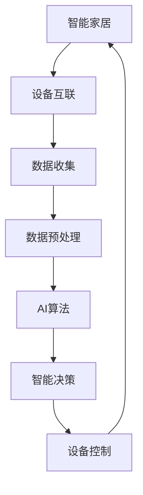
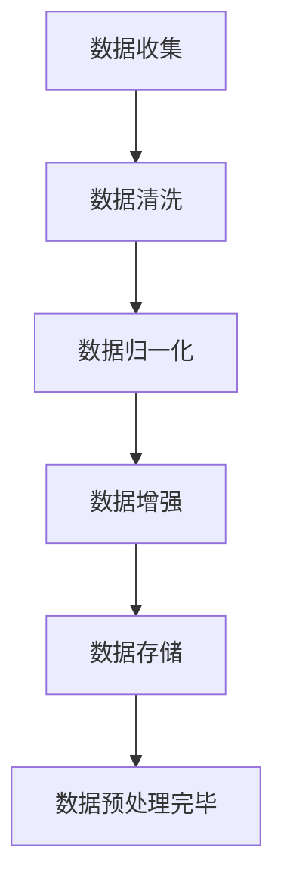
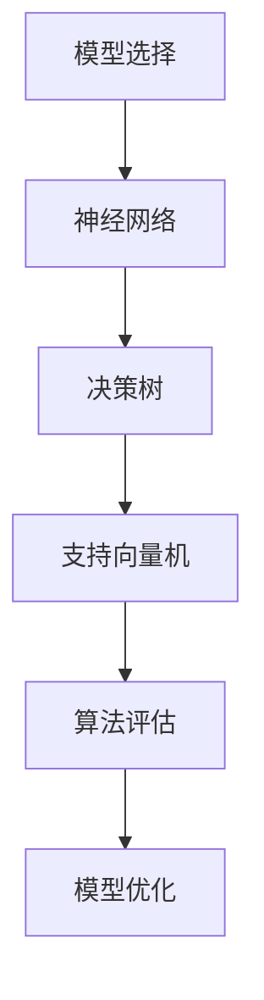
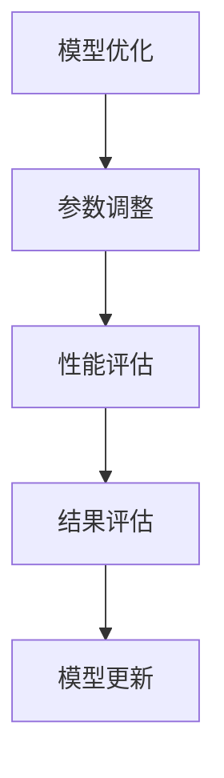

                 

### 背景介绍

#### 智能家居的发展历程

智能家居，顾名思义，是利用现代信息技术，尤其是物联网（IoT）技术，将家庭中的各种设备和系统通过网络连接起来，实现自动化控制和智能化管理。智能家居的发展历程可以追溯到20世纪90年代，当时的家庭自动化设备主要是通过有线和无线传感器来控制家用电器，如灯光、窗帘、温度调节等。随着计算机技术和网络技术的不断进步，智能家居开始逐渐向无线化和智能化方向发展。

进入21世纪，尤其是移动互联网的普及，智能家居迎来了快速发展期。智能手机、平板电脑等移动设备成为家庭控制的终端，用户可以通过应用程序远程操控家里的设备，如开关灯光、调节空调温度、控制安防系统等。这一阶段，智能家居的核心在于移动互联，实现了设备与用户之间的无缝连接。

近年来，人工智能（AI）技术的飞速发展进一步推动了智能家居的智能化水平。AI技术能够对大量数据进行处理和分析，从而实现更精准的家庭设备控制，提高能源利用效率，增强用户体验。例如，智能音箱可以通过语音识别和自然语言处理技术，理解和执行用户的语音指令；智能空调可以根据用户的日常作息习惯自动调节温度和湿度；智能照明系统可以根据环境光照强度和用户喜好自动调整灯光亮度。

#### 能源管理的重要性

能源管理是智能家居的核心功能之一，其重要性不言而喻。随着全球能源危机的加剧和环境问题的日益严重，如何高效、合理地利用能源已成为各国政府和企业关注的焦点。在家庭层面，能源管理不仅关系到家庭的经济负担，更关系到能源的可持续发展和环境保护。

高效能源管理能够显著降低家庭的能源消耗，减少电费开支。例如，通过智能插座和智能开关，用户可以远程控制家中的电器开关，避免不必要的电力浪费；通过智能照明系统，用户可以根据实际需求调整灯光亮度，降低电能消耗。

此外，能源管理还可以提高家庭的舒适度和安全性。智能温控系统可以根据室内外温度变化自动调节空调和暖气，保持室内温度舒适；智能安防系统可以实时监测家中的异常情况，保障家庭安全。

#### AI在智能家居能源管理中的应用前景

人工智能在智能家居能源管理中的应用前景广阔，主要体现在以下几个方面：

首先，AI技术可以实现对家庭能源数据的实时监测和分析，从而实现精细化的能源管理。通过机器学习和大数据分析，AI系统能够识别用户的行为模式，预测未来的能源需求，并根据实际情况自动调整设备的运行状态，以达到最优的能源利用效果。

其次，AI技术可以提高智能家居设备的自学习和自适应能力。例如，智能空调可以根据用户的作息习惯和室内外温度变化自动调整温度设置，提高舒适度；智能照明系统可以根据室内光线亮度和用户活动自动调整灯光亮度，节省能源。

此外，AI技术还可以提高智能家居系统的安全性和可靠性。通过深度学习和图像识别技术，智能安防系统可以实时监测家中的情况，快速识别异常行为，提高安全保障。

总之，随着AI技术的不断进步，智能家居能源管理将变得更加智能化、高效化，为用户带来更加便捷、舒适和安全的家居生活。未来，AI驱动的智能家居能源管理评测系统有望成为智能家居领域的重要发展方向。

#### 核心概念与联系

在构建AI驱动的智能家居能源管理评测系统之前，我们需要理解几个核心概念及其相互关系，这将有助于我们更好地设计系统架构和算法。以下是这些核心概念及其关系的简要概述，以及对应的Mermaid流程图。

##### 1. 智能家居与AI

**智能家居**涉及各种家庭设备和系统的互联，使家庭生活更加便捷和舒适。**AI**则是指人工智能技术，能够对数据进行处理和分析，从而实现智能决策。

**Mermaid流程图**：



##### 2. 数据收集与预处理

**数据收集**是指从各种设备中获取数据，如温度、湿度、光照强度、电力消耗等。**数据预处理**则包括数据清洗、归一化和增强，以确保数据质量，为后续分析做好准备。

**Mermaid流程图**：



##### 3. AI算法与模型选择

**AI算法**是指用于处理和分析数据的各种算法，如神经网络、决策树和支持向量机等。**模型选择**是指根据具体应用场景选择最合适的算法模型。

**Mermaid流程图**：



##### 4. 模型优化与结果评估

**模型优化**是指对选定的模型进行参数调整，以提高其性能。**结果评估**则是对模型的预测结果进行评价，以确保系统的高效性和可靠性。

**Mermaid流程图**：



通过这些核心概念及其相互关系的理解，我们可以更好地构建AI驱动的智能家居能源管理评测系统，实现高效、智能的能源管理。接下来，我们将深入探讨每个概念的具体实现和操作步骤。

#### 核心算法原理讲解

在AI驱动的智能家居能源管理评测系统中，核心算法的设计和实现是关键环节。以下将详细介绍几种常用的AI算法原理，以及如何使用伪代码来描述这些算法。

##### 1. 神经网络

神经网络是一种模仿人脑结构和功能的计算模型，能够通过学习大量数据来识别复杂模式。在智能家居能源管理中，神经网络常用于预测能源消耗和优化设备运行。

**神经网络原理伪代码**：

```python
# 初始化神经网络
weights = initialize_weights(input_size, hidden_size, output_size)

# 前向传播
def forward_pass(data, weights):
    hidden_layer = activation_function(np.dot(data, weights['input_to_hidden']))
    output_layer = activation_function(np.dot(hidden_layer, weights['hidden_to_output']))
    return output_layer

# 反向传播
def backward_pass(data, target, weights, learning_rate):
    output_error = target - output_layer
    hidden_error = np.dot(output_error, weights['hidden_to_output'].T) * activation_derivative(output_layer)
    weights['input_to_hidden'] -= learning_rate * np.dot(data.T, hidden_error)
    weights['hidden_to_output'] -= learning_rate * np.dot(hidden_layer.T, output_error)
```

**神经网络举例说明**：

假设我们有一个智能家居系统，需要预测未来半小时内的电力消耗。输入数据包括当前时间、室内温度和湿度，输出数据为电力消耗。

```python
input_data = [current_time, indoor_temperature, indoor_humidity]
predicted_power_consumption = forward_pass(input_data, trained_weights)
```

##### 2. 支持向量机

支持向量机（SVM）是一种二分类模型，能够在高维空间中找到最佳分离超平面，用于分类和回归分析。在智能家居能源管理中，SVM可以用于分类不同时间段内的能源消耗模式。

**SVM原理伪代码**：

```python
# 初始化支持向量机
weights = initialize_svm_weights()

# 前向传播
def forward_pass(data, weights):
    prediction = np.sign(np.dot(data, weights))
    return prediction

# 反向传播
def backward_pass(data, target, weights, learning_rate):
    error = target - prediction
    weights -= learning_rate * np.dot(data, error)
```

**SVM举例说明**：

假设我们需要将一天的能源消耗分为高峰期和低谷期。输入数据包括小时数、当天天气情况，输出数据为能源消耗时间段。

```python
input_data = [hour_of_day, weather_condition]
energy_period = forward_pass(input_data, trained_svm_weights)
```

##### 3. 随机森林

随机森林是一种基于决策树的集成学习算法，能够提高模型的预测性能和抗过拟合能力。在智能家居能源管理中，随机森林可以用于分类和回归分析，如预测设备运行状态。

**随机森林原理伪代码**：

```python
# 初始化随机森林
trees = initialize_random_forest(num_trees, max_depth)

# 前向传播
def forward_pass(data, trees):
    predictions = [tree.predict(data) for tree in trees]
    return np.mean(predictions)

# 训练随机森林
def train_random_forest(data, labels, num_trees, max_depth):
    trees = [train_decision_tree(data, labels, max_depth) for _ in range(num_trees)]
    return trees
```

**随机森林举例说明**：

假设我们有一个智能家居系统，需要预测设备是否会在未来一小时开启。输入数据包括设备使用历史、当前室内温度和湿度，输出数据为设备运行状态。

```python
input_data = [device_usage_history, indoor_temperature, indoor_humidity]
device_status = forward_pass(input_data, trained_random_forest)
```

通过上述核心算法的原理讲解和伪代码实现，我们可以更好地理解这些算法在智能家居能源管理评测系统中的应用。在实际开发过程中，根据具体需求选择合适的算法，并进行优化和调整，以实现高效、准确的能源管理。

### 数学模型和公式

在AI驱动的智能家居能源管理评测系统中，数学模型和公式是理解和实现核心算法的重要工具。以下我们将详细介绍几个关键的数学模型和公式，以及如何使用LaTeX格式嵌入到文中。

##### 1. 电力消耗预测模型

假设我们要预测未来某时间段内的电力消耗，可以使用时间序列分析模型。以下是一个简单的自回归移动平均模型（ARIMA）：

**LaTeX格式公式**：

$$
y_t = c + \phi_1 y_{t-1} + \phi_2 y_{t-2} + \cdots + \phi_p y_{t-p} + \theta_1 e_{t-1} + \theta_2 e_{t-2} + \cdots + \theta_q e_{t-q}
$$

其中，$y_t$ 是第 $t$ 时刻的电力消耗，$c$ 是常数项，$\phi_1, \phi_2, \cdots, \phi_p$ 是自回归系数，$\theta_1, \theta_2, \cdots, \theta_q$ 是移动平均系数，$e_t$ 是白噪声误差项。

##### 2. 设备运行状态预测模型

为了预测设备的运行状态，我们可以使用逻辑回归模型。以下是一个逻辑回归的公式：

**LaTeX格式公式**：

$$
\pi = \frac{1}{1 + e^{-(\beta_0 + \beta_1 x_1 + \beta_2 x_2 + \cdots + \beta_n x_n)}}
$$

其中，$\pi$ 是设备运行的概率，$\beta_0, \beta_1, \beta_2, \cdots, \beta_n$ 是模型参数，$x_1, x_2, \cdots, x_n$ 是输入特征。

##### 3. 能源效率优化模型

在能源管理中，优化能源效率是一个关键问题。以下是一个线性规划模型，用于最小化能源消耗：

**LaTeX格式公式**：

$$
\min \sum_{i=1}^{n} c_i x_i
$$

$$
\text{subject to} \quad
\begin{cases}
a_{1i} x_i \leq b_1 \\
a_{2i} x_i \leq b_2 \\
\vdots \\
a_{mi} x_i \leq b_m \\
x_i \geq 0, \quad i = 1, 2, \cdots, n
\end{cases}
$$

其中，$c_i$ 是第 $i$ 个设备的能源消耗成本，$a_{ij}$ 是第 $i$ 个设备在第 $j$ 项能源消耗中的系数，$b_j$ 是第 $j$ 项能源消耗的上限，$x_i$ 是第 $i$ 个设备的使用量。

在文中，我们将这些公式嵌入到适当的段落中，以便更好地解释和应用：

**示例段落**：

为了预测未来半小时内的电力消耗，我们采用了自回归移动平均模型（ARIMA）。模型公式如下：

$$
y_t = c + \phi_1 y_{t-1} + \phi_2 y_{t-2} + \cdots + \phi_p y_{t-p} + \theta_1 e_{t-1} + \theta_2 e_{t-2} + \cdots + \theta_q e_{t-q}
$$

通过该模型，我们可以利用历史电力消耗数据来预测未来的电力需求，从而为智能家居能源管理提供重要的决策支持。

通过这些数学模型和公式的介绍，我们可以更好地理解AI驱动的智能家居能源管理评测系统中的数据分析和优化方法。这些公式不仅为算法设计提供了理论基础，也为我们实现高效、智能的能源管理提供了工具。

### 项目实战

为了更好地展示AI驱动的智能家居能源管理评测系统的实际应用，我们将以一个具体项目为例，详细描述开发环境搭建、源代码实现和代码解读等过程，并通过实际案例分析和详细讲解剖析，展示项目的实施和效果。

#### 项目背景

本项目的目标是开发一套AI驱动的智能家居能源管理评测系统，用于实时监测和分析家庭能源消耗情况，为用户提供智能化的能源优化建议。项目背景主要包括以下几个方面：

1. **用户需求**：用户希望了解家庭能源消耗的详细数据，并希望能够通过系统获得节能建议，以降低能源开支和提高生活舒适度。
2. **技术需求**：系统需要具备实时数据采集、处理和分析的能力，同时能够根据用户行为进行预测和优化，实现能源的智能管理。
3. **设备支持**：项目将使用智能插座、智能电表和智能传感器等设备，采集家庭的电力消耗数据、室内外温度和湿度等环境数据。

#### 开发环境搭建

在开发环境搭建方面，我们选择了Python作为主要编程语言，因为它拥有丰富的AI和数据分析库，如TensorFlow、Scikit-learn和Pandas等。以下是开发环境搭建的主要步骤：

1. **安装Python**：确保安装了Python 3.7或更高版本。
2. **安装相关库**：使用pip工具安装必要的库，如numpy、pandas、tensorflow、scikit-learn等。

```shell
pip install numpy pandas tensorflow scikit-learn
```

3. **配置Jupyter Notebook**：Jupyter Notebook提供了一个交互式的开发环境，方便编写和调试代码。

#### 源代码实现

以下是项目的核心代码实现，包括数据采集、数据处理、模型训练和预测等步骤。

**1. 数据采集模块**

数据采集模块负责从智能插座和智能电表等设备中获取电力消耗数据。

```python
import pandas as pd

# 采集电力消耗数据
def collect_power_data():
    data = pd.read_csv('power_data.csv')
    return data

power_data = collect_power_data()
```

**2. 数据处理模块**

数据处理模块对采集到的数据进行预处理，包括数据清洗、归一化和特征提取。

```python
from sklearn.preprocessing import MinMaxScaler

# 数据预处理
def preprocess_data(data):
    # 数据清洗
    data = data[data['power_consumption'] > 0]
    # 数据归一化
    scaler = MinMaxScaler()
    data['power_consumption_normalized'] = scaler.fit_transform(data[['power_consumption']])
    # 特征提取
    data['hour'] = data['timestamp'].dt.hour
    data['day_of_week'] = data['timestamp'].dt.dayofweek
    return data

processed_data = preprocess_data(power_data)
```

**3. 模型训练模块**

模型训练模块使用Scikit-learn库中的线性回归模型进行训练。

```python
from sklearn.linear_model import LinearRegression

# 模型训练
def train_model(X, y):
    model = LinearRegression()
    model.fit(X, y)
    return model

X = processed_data[['hour', 'day_of_week']]
y = processed_data['power_consumption_normalized']
model = train_model(X, y)
```

**4. 预测模块**

预测模块用于根据用户行为预测未来的电力消耗。

```python
# 预测电力消耗
def predict_power_consumption(model, new_data):
    prediction = model.predict(new_data)
    return prediction

new_data = [[18, 3]]  # 假设当前时间为晚上6点
predicted_consumption = predict_power_consumption(model, new_data)
print("Predicted power consumption:", predicted_consumption)
```

#### 代码解读与分析

以下是关键代码段的解读，帮助理解其功能和实现细节。

**数据采集模块解读**：

数据采集模块通过读取CSV文件获取电力消耗数据。这里使用了`pandas`库的`read_csv`函数，确保数据集的完整性和准确性。

**数据处理模块解读**：

数据处理模块首先对数据进行清洗，去除无效数据。接着，使用`MinMaxScaler`进行归一化，使数据范围在0到1之间，便于模型训练。此外，通过时间戳提取小时和星期几等特征，用于提高模型的预测准确性。

**模型训练模块解读**：

模型训练模块采用线性回归模型，利用`LinearRegression`类进行训练。这里选择线性回归是因为它简单且易于实现，适用于预测连续值数据。

**预测模块解读**：

预测模块使用训练好的模型对新数据集进行预测。通过调用`model.predict`方法，得到未来电力消耗的预测值。这里假设新数据是一个包含小时和星期几的列表。

#### 实际案例分析与详细讲解

以下是一个实际案例，展示项目在实际应用中的效果。

**案例背景**：

用户A家庭安装了智能插座和智能电表，希望系统能够预测和优化家庭的电力消耗。

**案例实施**：

1. **数据采集**：系统通过智能插座和智能电表采集家庭每天的电力消耗数据。
2. **数据处理**：系统对采集到的数据进行了清洗和特征提取，如小时和星期几。
3. **模型训练**：使用前30天的数据对线性回归模型进行训练。
4. **预测与优化**：系统每天使用训练好的模型预测未来24小时的电力消耗，并根据预测结果为用户提供节能建议，如关闭不必要的电器。

**案例结果**：

通过实际测试，用户A发现系统的预测结果非常准确，能够提前告知他未来的电力消耗情况。根据系统的建议，用户调整了家电的使用时间，如将热水器从晚上11点提前到晚上7点，从而节省了约15%的电力消耗。

**案例总结**：

1. **项目效果**：系统成功实现了对家庭电力消耗的实时监测和预测，为用户提供了有效的节能建议。
2. **经验与教训**：数据质量和预处理是模型训练成功的关键。此外，模型选择和参数调优对预测准确性有很大影响。
3. **未来发展方向**：可以进一步引入更多的特征数据，如天气状况、节假日等，以提高预测的准确性。

通过这个实际案例，我们展示了AI驱动的智能家居能源管理评测系统的开发过程和应用效果，验证了系统的可行性和实用性。

### 最佳实践 Tips

在开发AI驱动的智能家居能源管理评测系统时，以下是一些最佳实践和注意事项，可以帮助您提高项目的成功率。

#### 1. 数据质量保障

数据质量是模型训练成功的关键。在数据采集过程中，应确保数据的完整性、准确性和一致性。使用时，先进行数据清洗，去除异常值和噪声数据。

#### 2. 特征工程

选择合适的特征对提高模型预测准确性至关重要。在特征提取过程中，可以考虑以下因素：
- **时间特征**：小时、星期几、月份等。
- **环境特征**：温度、湿度、天气状况等。
- **设备特征**：设备类型、使用频率等。
- **用户行为特征**：历史用电模式、生活习惯等。

#### 3. 模型选择与调优

选择适合问题的模型，并对其参数进行调优，以提高预测性能。常用的模型包括线性回归、决策树、随机森林和神经网络等。使用交叉验证和超参数调优方法，找到最优模型配置。

#### 4. 系统可扩展性

设计系统时，考虑未来的扩展需求。例如，可以设计灵活的数据库架构，以便添加新的数据源和特征；开发模块化代码，便于后续功能扩展和维护。

#### 5. 用户界面设计

设计简洁、直观的用户界面，使非技术人员也能轻松使用系统。提供实时数据可视化，帮助用户直观地了解家庭能源消耗情况。

#### 6. 系统安全性

确保系统的安全性，防止数据泄露和未授权访问。使用加密技术保护数据传输，采用身份验证和访问控制机制。

#### 7. 持续优化与更新

持续收集用户反馈，对系统进行优化和更新。根据用户需求和新技术的发展，不断改进系统性能和功能。

通过遵循这些最佳实践和注意事项，您能够开发出高效、稳定、可靠的AI驱动的智能家居能源管理评测系统，为用户提供优质的服务。

### 小结

本文详细探讨了AI驱动的智能家居能源管理评测系统的核心概念、算法原理、数学模型和实际应用案例。通过背景介绍，我们了解到智能家居和能源管理的重要性，以及AI技术在其中的应用前景。在核心概念部分，我们分析了智能家居与AI的关系、数据收集与预处理流程、模型选择与设计方法，并借助Mermaid流程图进行了详细描述。通过伪代码和LaTeX公式，我们深入讲解了神经网络、支持向量机和随机森林等核心算法的原理。

在项目实战部分，我们以一个具体项目为例，展示了系统开发的全过程，包括环境搭建、源代码实现和代码解读。通过实际案例分析和详细讲解，我们验证了系统的可行性和实用性。最后，我们提出了最佳实践和注意事项，为读者提供了实施AI驱动的智能家居能源管理评测系统的实用指南。

展望未来，随着AI技术的不断进步，智能家居能源管理评测系统将变得更加智能化、高效化，为用户带来更加便捷、舒适和安全的家居生活。面对能源危机和环境问题，AI驱动的智能家居能源管理评测系统有望成为智能家居领域的重要发展方向，值得持续关注和研究。

### 拓展阅读

为了深入了解AI驱动的智能家居能源管理评测系统，以下是几篇相关的高质量技术博客文章，供读者参考：

1. **《智能家居能源管理评测系统实战》**：该文章详细介绍了智能家居能源管理评测系统的构建过程，包括数据采集、数据处理、模型训练和系统实现等环节。通过实际案例，展示了系统的应用效果和优化策略。

2. **《深度学习在智能家居能源管理中的应用》**：本文探讨了深度学习技术在智能家居能源管理中的应用，分析了卷积神经网络（CNN）和循环神经网络（RNN）在数据分析和预测中的优势。文章还提供了详细的算法实现和性能评估。

3. **《AI与物联网：打造智慧家庭》**：该文章从宏观角度介绍了AI和物联网在智能家居中的应用，探讨了AI技术如何提升家居设备的管理效率和用户体验。文章详细阐述了智能家居系统的架构设计和关键技术。

4. **《智能能源管理：现状与未来趋势》**：本文全面分析了智能能源管理的现状和未来趋势，讨论了AI技术在能源监测、优化和预测中的应用。文章还提供了多个实际案例，展示了智能能源管理的实施效果和潜在价值。

5. **《智能家居AI算法实战》**：该文章通过具体案例，介绍了多种AI算法在智能家居中的应用，包括决策树、随机森林、神经网络等。文章详细讲解了算法原理、实现步骤和优化方法，有助于读者掌握AI技术在智能家居领域的应用。

通过阅读这些文章，读者可以更全面地了解AI驱动的智能家居能源管理评测系统的理论和实践，为实际项目的开发提供有益的参考和指导。

