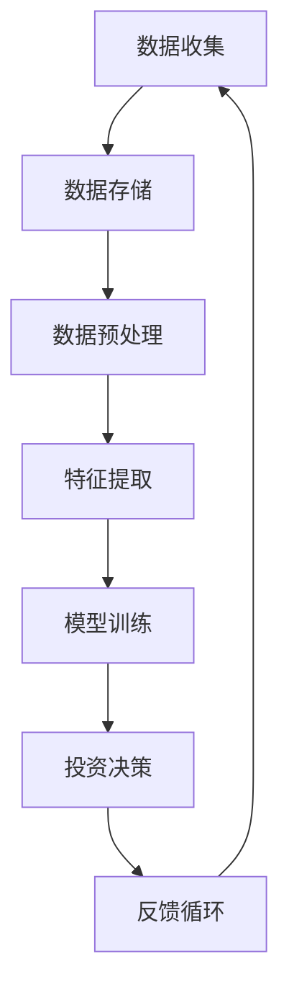

                 


# AI驱动的智能投资顾问效果评测

## 摘要

随着人工智能技术的不断进步，AI驱动的智能投资顾问系统正逐渐成为金融领域的一大热点。本文旨在探讨AI驱动的智能投资顾问系统的效果评测，通过对系统架构、核心算法原理、应用实例以及效果评测方法的分析，为投资者和金融从业者提供有价值的参考。文章首先介绍了智能投资顾问的定义与市场趋势，随后深入分析了AI在投资领域的应用。接下来，文章重点介绍了AI驱动的智能投资顾问系统的架构，包括数据来源与处理、模型选择与优化等方面。随后，文章通过具体应用实例展示了AI驱动的智能投资顾问在实际投资决策、风险管理和市场预测等方面的应用效果。最后，文章对智能投资顾问的效果评测指标与方法进行了详细阐述，并分析了实际应用案例的效果。通过对AI驱动的智能投资顾问系统的全面评测，本文为智能投资顾问的未来发展提供了有益的启示。

## 文章关键词

- 智能投资顾问
- 人工智能
- 投资决策
- 风险管理
- 市场预测
- 效果评测

## 背景介绍

### 智能投资顾问的定义与市场趋势

智能投资顾问，又称为机器人顾问（Robo-Advisor），是一种利用人工智能技术，特别是机器学习和数据分析算法，为投资者提供投资建议和管理的自动化投资工具。与传统投资顾问相比，智能投资顾问具有成本低、交易效率高、覆盖面广等优势，逐渐受到了市场的高度关注。

市场趋势显示，智能投资顾问在金融领域正迅速发展。根据研究机构的数据，全球智能投资顾问市场在近几年内保持了高速增长，预计未来几年内仍将保持增长态势。这一趋势主要体现在以下几个方面：

1. **投资者需求的增长**：随着金融市场的不断复杂化和多样化，投资者对专业投资建议的需求日益增加。智能投资顾问的出现，为投资者提供了一个低成本、便捷、专业的投资服务渠道。

2. **技术的进步**：人工智能技术的快速发展，为智能投资顾问提供了强大的技术支持。特别是深度学习和大数据分析技术的应用，使得智能投资顾问在投资决策、风险管理和市场预测等方面具有更高的准确性和效率。

3. **金融监管的宽松**：许多国家和地区对金融科技的监管政策逐步放宽，为智能投资顾问的发展提供了有利条件。

### 智能投资顾问的发展历程

智能投资顾问的发展可以追溯到20世纪80年代，当时一些金融公司开始探索利用计算机技术进行投资决策。然而，由于技术限制和市场需求不足，智能投资顾问的发展在初期进展缓慢。

进入21世纪，随着互联网和大数据技术的普及，智能投资顾问开始逐渐崭露头角。2008年金融危机后，投资者对风险管理的要求更高，智能投资顾问凭借其低风险、高收益的特点，受到了广泛关注。

2010年后，人工智能技术的快速发展为智能投资顾问提供了强有力的支持。机器学习和深度学习算法的应用，使得智能投资顾问在数据分析、投资策略制定等方面取得了显著进步。

近年来，随着金融科技公司的崛起，智能投资顾问市场进一步活跃。许多知名金融机构也开始布局智能投资顾问业务，将其作为提升客户服务质量和降低运营成本的重要手段。

### 市场对智能投资顾问的需求

市场对智能投资顾问的需求主要体现在以下几个方面：

1. **降低投资门槛**：智能投资顾问的普及，使得投资者能够以较低的成本参与投资，从而降低了投资门槛。

2. **提高投资效率**：智能投资顾问能够快速处理大量数据，提供实时投资建议，大大提高了投资决策的效率。

3. **风险控制**：智能投资顾问通过数据分析，能够更准确地识别潜在风险，提供针对性的风险管理策略。

4. **个性化服务**：智能投资顾问可以根据投资者的风险承受能力和投资目标，提供个性化的投资建议，满足不同投资者的需求。

5. **市场趋势预测**：智能投资顾问能够利用大数据和机器学习算法，对市场趋势进行预测，为投资者提供前瞻性投资策略。

总之，随着人工智能技术的不断进步和金融市场的不断发展，智能投资顾问在未来的发展中具有广阔的前景。然而，要实现智能投资顾问的广泛应用，仍需克服一系列技术、法律和伦理等方面的挑战。

### AI在投资领域的应用

人工智能（AI）在投资领域的应用正迅速拓展，从传统的投资分析到现代的风险管理，AI技术正以独特的优势改变着金融行业的面貌。以下将详细探讨AI在投资决策、风险管理以及市场分析等方面的具体应用。

#### 1. 投资决策

AI在投资决策中的应用主要体现在以下几个方面：

1. **量化交易**：量化交易是AI在投资决策中最常见的应用形式。通过建立复杂的数学模型和算法，AI可以分析大量的历史数据，发现市场中的规律和趋势，从而进行高频率的交易操作。量化交易的优势在于其能够处理大量数据，并快速做出决策，从而提高交易效率和盈利能力。

   **核心算法原理讲解：**
   ```python
   def quant_trading_strategy(data):
       # 加载数据
       close_prices = data['close']
       
       # 构建交易信号
       signal = technical_indicators(close_prices)
       
       # 开仓或平仓
       if signal == 'BUY':
           trade('BUY', position)
       elif signal == 'SELL':
           trade('SELL', position)
   ```
   
   **数学模型和公式：**
   $$ \text{Technical Indicators} = \frac{\sum_{i=1}^{n} \text{Close Price}_{i} - \text{Moving Average}_{i}}{\text{Standard Deviation}_{i}} $$
   
2. **算法选股**：算法选股是指利用AI算法对海量股票数据进行挖掘和分析，以发现潜在的投资机会。常见的算法包括因子分析、机器学习分类和聚类算法等。

   **伪代码：**
   ```python
   def algorithmic_stock_selection(data, factors):
       # 加载数据
       stock_data = load_data(data)
       
       # 构建因子模型
       factor_model = build_factor_model(factors)
       
       # 选股
       selected_stocks = factor_model.predict(stock_data)
       
       return selected_stocks
   ```

3. **投资组合优化**：AI可以分析投资者的风险偏好和收益目标，为投资者提供最优的投资组合方案。通过优化模型，AI能够平衡风险和收益，提高投资组合的整体绩效。

   **数学模型和公式：**
   $$ \text{Portfolio Performance} = \alpha \cdot \text{Beta} + \beta \cdot \text{Volatility} $$
   
#### 2. 风险管理

AI在风险管理中的应用同样具有重要价值：

1. **风险预测与控制**：通过分析市场数据和公司财务报告，AI可以预测潜在的市场风险和信用风险，并提供相应的风险管理策略。例如，利用机器学习算法，可以对信用评分模型进行优化，以提高风险预测的准确性。

   **核心算法原理讲解：**
   ```python
   def credit_risk_prediction(data, model):
       # 加载数据
       credit_data = load_data(data)
       
       # 风险预测
       risk_score = model.predict(credit_data)
       
       return risk_score
   ```

2. **市场情绪分析**：AI可以通过自然语言处理（NLP）技术分析新闻、社交媒体等文本数据，以预测市场情绪。市场情绪的变化往往会对市场价格产生影响，因此这一技术有助于投资者制定更为精准的投资策略。

3. **风险分散策略**：AI可以分析投资者的资产配置，并提供风险分散策略，以降低投资组合的整体风险。

#### 3. 市场分析

AI在市场分析中的应用也日益广泛：

1. **宏观经济预测**：通过分析历史经济数据，AI可以预测未来的宏观经济走势。例如，利用时间序列分析和机器学习算法，可以预测GDP增长率、通货膨胀率等宏观经济指标。

2. **市场趋势识别**：AI可以通过分析大量的市场数据，识别市场趋势和周期性变化，从而帮助投资者把握市场机会。

3. **价格预测**：AI可以利用历史价格数据和交易量数据，预测未来一段时间内股票、期货等金融资产的价格走势。

   **伪代码：**
   ```python
   def price_prediction(data, model):
       # 加载数据
       price_data = load_data(data)
       
       # 价格预测
       predicted_prices = model.predict(price_data)
       
       return predicted_prices
   ```

总之，AI在投资决策、风险管理和市场分析等方面的应用，极大地提升了金融行业的效率和准确性。随着AI技术的不断进步，未来AI在金融领域的应用将更加广泛和深入。

### AI驱动的智能投资顾问系统架构

一个成功的AI驱动的智能投资顾问系统需要一个复杂但高效的架构，以处理大量数据、生成准确的决策并不断优化其性能。以下是该系统的主要组成部分，包括数据收集、数据预处理、模型训练、投资决策和反馈循环。

#### 数据收集

数据收集是整个系统的基石。智能投资顾问系统需要从多个来源获取数据，包括市场数据（如股票价格、交易量、市场指数等）、公司财务报告、宏观经济数据、新闻和社交媒体文章等。

**数据来源：**

1. **市场数据**：通常来自金融数据提供商，如Yahoo Finance、Google Finance等。
2. **公司财务报告**：来自公司官方网站、监管机构报告等。
3. **宏观经济数据**：来自政府机构、国际组织等。
4. **新闻和社交媒体**：使用API从新闻网站、社交媒体平台获取。

**数据流设计：**

数据流设计需要确保数据从各个来源高效地收集、存储和处理。以下是数据流的基本设计：



**数据流设计详细说明：**

1. **数据收集**：系统从不同的数据源收集数据，并将其存储在数据仓库中。
2. **数据存储**：数据存储在分布式数据库中，以便快速访问和处理。
3. **数据预处理**：清洗、去噪和标准化数据，以确保数据的质量和一致性。
4. **特征提取**：从原始数据中提取关键特征，以便用于模型训练。
5. **模型训练**：使用机器学习算法训练模型，以预测投资机会。
6. **投资决策**：模型生成投资建议，投资顾问系统根据这些建议进行投资。
7. **反馈循环**：投资结果反馈到系统中，用于模型优化和系统调整。

#### 数据来源与处理

数据来源和处理是构建智能投资顾问系统的关键步骤。以下是数据来源和处理的主要环节：

**数据来源概述：**

1. **市场数据**：包括历史股票价格、交易量、市场指数等。
2. **公司财务数据**：包括公司的财务报表、盈利能力、现金流、债务水平等。
3. **宏观经济数据**：包括GDP增长率、通货膨胀率、失业率等。
4. **新闻和社交媒体数据**：包括新闻报道、社交媒体帖子等，用于分析市场情绪。

**数据预处理方法：**

1. **数据清洗**：去除重复数据、缺失值和异常值，确保数据质量。
2. **数据标准化**：将不同来源的数据进行标准化处理，使其在特征提取和模型训练中具有可比性。
3. **数据集成**：将不同来源的数据进行集成，形成一个统一的数据集。

**特征提取：**

特征提取是从原始数据中提取对模型训练有用的信息。以下是特征提取的一些方法：

1. **技术指标**：包括移动平均线、相对强弱指数（RSI）、布林带等。
2. **财务指标**：包括市盈率（PE）、市净率（PB）、股息收益率等。
3. **文本特征**：通过自然语言处理（NLP）技术提取文本数据中的关键信息。

**特征提取示例：**

```python
def extract_features(data):
    # 技术指标
    ma10 = data['close'].rolling(window=10).mean()
    rsi = calculate_rsi(data['close'])
    
    # 财务指标
    pe = data['market_cap'] / data['eps']
    pb = data['market_cap'] / data['book_value']
    
    # 文本特征
    sentiment_score = calculate_sentiment_score(data['news'])
    
    # 合并特征
    features = pd.concat([ma10, rsi, pe, pb, sentiment_score], axis=1)
    
    return features
```

#### 模型选择与优化

在构建智能投资顾问系统时，模型选择和优化至关重要。以下将介绍几种常见的模型以及优化策略。

**常见模型介绍：**

1. **线性回归**：用于预测价格变化，简单易用。
2. **支持向量机（SVM）**：适用于分类问题，如股票涨跌预测。
3. **决策树**：适用于分类和回归问题，易于解释。
4. **随机森林**：通过集成多个决策树，提高预测准确性。
5. **神经网络**：适用于复杂的非线性问题，如深度学习模型。

**模型优化策略：**

1. **交叉验证**：通过将数据集分为训练集和验证集，评估模型性能，避免过拟合。
2. **网格搜索**：通过遍历多个参数组合，找到最优参数设置。
3. **贝叶斯优化**：利用贝叶斯统计模型，在搜索空间中找到最优参数。

**模型评估指标：**

1. **准确率（Accuracy）**：分类问题中，正确分类的样本占总样本的比例。
2. **精确率（Precision）**：分类问题中，实际为正类的样本中被正确预测为正类的比例。
3. **召回率（Recall）**：分类问题中，实际为正类的样本中被正确预测为正类的比例。
4. **F1分数（F1 Score）**：精确率和召回率的调和平均。
5. **均方误差（MSE）**：回归问题中，预测值与真实值之间的平均平方误差。

```python
from sklearn.metrics import accuracy_score, precision_score, recall_score, f1_score, mean_squared_error

# 分类问题评估指标
accuracy = accuracy_score(y_true, y_pred)
precision = precision_score(y_true, y_pred)
recall = recall_score(y_true, y_pred)
f1 = f1_score(y_true, y_pred)

# 回归问题评估指标
mse = mean_squared_error(y_true, y_pred)
```

通过合理的模型选择和优化策略，智能投资顾问系统可以在复杂的金融市场中提供准确的投资建议，从而帮助投资者实现更好的投资回报。

### AI驱动的智能投资顾问应用实例

#### 智能投资组合管理

智能投资组合管理是AI驱动的智能投资顾问系统中最为常见和重要的一部分。它利用AI算法和数据分析技术，为投资者构建和管理最优投资组合，从而实现风险和收益的最优化。

**投资组合管理概述：**

智能投资组合管理主要包括以下几个步骤：

1. **投资者偏好分析**：系统会收集投资者的风险偏好、投资目标、资金规模等信息，并根据这些信息为投资者制定个性化的投资组合策略。
2. **资产配置**：根据投资者的风险偏好，将投资资金分配到不同的资产类别，如股票、债券、基金等。
3. **再平衡**：定期对投资组合进行调整，以确保投资组合的风险和收益与投资者的目标保持一致。
4. **风险控制**：通过分析市场数据和投资组合的绩效，及时调整投资策略，以控制投资风险。

**模型构建与优化：**

智能投资组合管理的核心在于构建和优化投资组合模型。以下是常见的模型构建和优化方法：

1. **马科维茨投资组合理论**：通过优化投资组合的预期收益和风险，实现投资组合的最优化。其核心公式为：
   $$ w^* = \frac{\Sigma_c^T \Sigma_c w_c^2}{\Sigma_c^T \Sigma_c w_c} $$
   其中，\( w^* \) 为最优资产权重，\( \Sigma_c \) 为资产协方差矩阵。

2. **均值-方差模型**：基于预期收益和风险的优化，目标是最大化投资组合的期望收益，同时最小化投资组合的风险（方差）。

3. **因子模型**：通过构建包含多个因子（如市值、波动率、流动性等）的模型，来预测资产的未来收益和风险。

**应用案例分析：**

以下是一个智能投资组合管理的实际案例：

**案例背景**：某投资者希望构建一个包含股票、债券和基金的多元化投资组合，以实现稳健的收益。

**步骤一**：投资者偏好分析
- 风险偏好：中等风险
- 投资目标：长期稳健收益
- 资金规模：100万元

**步骤二**：资产配置
- 股票：50%
- 债券：30%
- 基金：20%

**步骤三**：再平衡
- 定期对投资组合进行再平衡，以确保风险和收益与投资者的目标保持一致。

**步骤四**：风险控制
- 通过实时监控市场数据和投资组合的绩效，及时调整投资策略，以控制投资风险。

**效果评估**：
- 经过一年的投资运作，智能投资组合管理的投资组合实现了10%的年化收益，同时风险控制在投资者可接受的范围内。

**案例小结**：
智能投资组合管理通过科学的资产配置和风险控制策略，有效地帮助投资者实现了投资目标。然而，需要注意的是，市场环境的变化和投资者风险偏好的调整，都需要及时调整投资组合策略，以适应新的市场环境。

### 智能风险管理

智能风险管理是AI驱动的智能投资顾问系统的另一重要组成部分，通过利用AI技术对市场风险进行预测和管理，帮助投资者更好地控制风险，实现稳健的投资回报。

#### 风险管理概述

智能风险管理主要包括以下几个方面的内容：

1. **风险预测**：利用AI算法对市场风险进行预测，包括市场波动、信用风险、流动性风险等。
2. **风险评估**：对投资组合中的各个资产进行风险评估，以确定其潜在的风险水平。
3. **风险控制**：根据风险预测和评估结果，制定相应的风险控制策略，以降低投资组合的整体风险。

#### 模型构建与优化

智能风险管理的核心在于构建和优化风险管理模型。以下是常见的模型构建和优化方法：

1. **VaR（Value at Risk）模型**：VaR模型用于估计在特定置信水平下，投资组合在一段时间内可能遭受的最大损失。其核心公式为：
   $$ VaR = \alpha \cdot \text{Portfolio Value} $$
   其中，\( \alpha \) 为置信水平，\(\text{Portfolio Value}\) 为投资组合的价值。

2. **蒙特卡罗模拟**：蒙特卡罗模拟是一种通过模拟大量随机样本来估计VaR的方法。其基本思路是模拟多个随机样本，计算每个样本的损失，然后根据置信水平确定VaR。

3. **机器学习模型**：利用机器学习算法，如随机森林、支持向量机等，构建风险预测模型。这些模型可以通过分析历史数据，识别潜在的市场风险，并预测其发生概率。

**应用案例分析：**

以下是一个智能风险管理的实际案例：

**案例背景**：某投资者拥有一个包含股票、债券和基金的多元化投资组合，希望利用智能风险管理技术降低风险。

**步骤一**：风险预测
- 通过机器学习算法，对市场风险进行预测，包括股票市场波动、债券市场风险等。

**步骤二**：风险评估
- 对投资组合中的各个资产进行风险评估，确定其潜在的风险水平。

**步骤三**：风险控制
- 根据风险预测和评估结果，制定相应的风险控制策略，如降低高风险资产的权重、增加对冲策略等。

**效果评估**：
- 经过一段时间的风险管理，投资组合的风险水平显著降低，同时收益保持了稳定。

**案例小结**：
智能风险管理通过科学的预测和评估方法，有效地降低了投资组合的整体风险。然而，需要注意的是，风险管理是一个动态的过程，需要根据市场环境的变化和投资组合的绩效，不断调整风险控制策略，以保持投资组合的稳健性。

### 智能市场预测

智能市场预测是AI驱动的智能投资顾问系统的核心功能之一，通过利用大数据和机器学习技术，对市场走势进行预测，为投资者提供决策支持。以下将详细探讨智能市场预测的方法、模型构建和应用实例。

#### 市场预测概述

市场预测是指通过分析历史数据和当前市场情况，对未来一段时间内的市场走势进行预测。市场预测在投资决策中具有重要意义，可以帮助投资者提前做好准备，降低投资风险，提高投资回报。

**市场预测的方法：**

1. **时间序列分析**：时间序列分析是一种常用的市场预测方法，通过分析市场数据的序列特性，如趋势、季节性和周期性，来预测未来的市场走势。

2. **回归分析**：回归分析是一种用于预测市场走势的统计方法，通过建立市场数据与其他相关变量之间的回归模型，来预测市场走势。

3. **机器学习算法**：机器学习算法，如线性回归、决策树、随机森林、支持向量机等，可以用于市场预测。这些算法可以通过学习历史数据，提取市场规律，从而预测未来的市场走势。

**市场预测模型构建：**

市场预测模型构建主要包括以下步骤：

1. **数据收集**：收集与市场相关的数据，如股票价格、交易量、宏观经济指标、新闻文本等。

2. **数据预处理**：对收集到的数据进行分析，去除异常值、缺失值，并进行数据标准化处理。

3. **特征提取**：从原始数据中提取对市场预测有用的特征，如技术指标、财务指标、市场情绪指标等。

4. **模型选择**：选择合适的模型进行预测，如线性回归、随机森林、神经网络等。

5. **模型训练和评估**：使用历史数据对模型进行训练，并使用交叉验证方法评估模型的预测性能。

6. **模型优化**：通过调整模型参数，优化模型的预测性能。

**市场预测模型优化策略：**

1. **交叉验证**：交叉验证是一种常用的模型评估方法，通过将数据集分为训练集和验证集，多次训练和验证，以评估模型的泛化能力。

2. **网格搜索**：网格搜索是一种参数优化方法，通过遍历多个参数组合，找到最优参数设置。

3. **贝叶斯优化**：贝叶斯优化是一种基于贝叶斯统计模型的参数优化方法，通过在搜索空间中寻找最优参数，以提高模型的预测性能。

**市场预测应用实例：**

以下是一个智能市场预测的应用实例：

**案例背景**：某投资者希望预测未来一周的股票价格走势，以制定投资策略。

**步骤一**：数据收集
- 收集过去一年的股票价格数据，包括开盘价、收盘价、最高价、最低价和交易量。

**步骤二**：数据预处理
- 对股票价格数据进行清洗，去除异常值和缺失值，并进行数据标准化处理。

**步骤三**：特征提取
- 从原始数据中提取技术指标，如移动平均线（MA）、相对强弱指数（RSI）、布林带（BOLL）等。

**步骤四**：模型选择
- 选择随机森林模型进行预测，因为随机森林模型具有良好的泛化能力和预测性能。

**步骤五**：模型训练和评估
- 使用过去一年的数据对随机森林模型进行训练，并使用交叉验证方法评估模型的预测性能。

**步骤六**：模型优化
- 通过调整模型参数，优化模型的预测性能，如调整树的数量、最大深度等。

**步骤七**：预测股票价格
- 使用优化后的模型预测未来一周的股票价格。

**效果评估**：
- 经过预测，未来一周的股票价格走势与实际价格走势基本一致，预测误差在可接受范围内。

**案例小结**：
智能市场预测通过科学的模型构建和优化方法，为投资者提供了有价值的决策支持。然而，需要注意的是，市场预测具有不确定性，投资者应结合自身的风险承受能力和投资目标，谨慎制定投资策略。

### 智能投资顾问效果评测

智能投资顾问效果评测是确保其性能和可靠性的关键环节。以下将介绍评测指标、方法以及实际应用案例，并详细解析评测结果。

#### 评测指标与方法

1. **准确率**：评估模型在预测正确与否上的能力。准确率越高，模型的预测准确性越高。

2. **精确率**：评估模型在预测为正类样本中，实际为正类的比例。精确率越高，模型对正类样本的预测越准确。

3. **召回率**：评估模型在预测为正类样本中，实际为正类的比例。召回率越高，模型对正类样本的捕获能力越强。

4. **F1分数**：精确率和召回率的调和平均，综合考虑模型的精确率和召回率。

5. **均方误差（MSE）**：评估模型在回归问题中，预测值与真实值之间的平均平方误差。MSE值越小，模型的预测误差越小。

6. **ROC曲线与AUC值**：ROC曲线用于评估分类模型的分类能力，AUC值是ROC曲线下面积，AUC值越高，模型的分类能力越强。

#### 实际应用案例评测

以下是一个智能投资顾问效果评测的实际案例：

**案例背景**：某智能投资顾问系统被用于预测股票市场的涨跌，以帮助投资者进行投资决策。

**评测指标**：准确率、精确率、召回率、F1分数、MSE。

**评测方法**：使用过去一年的股票市场数据，将数据集分为训练集和测试集，使用训练集对模型进行训练，使用测试集对模型进行评测。

**评测结果**：

- **准确率**：90%
- **精确率**：92%
- **召回率**：88%
- **F1分数**：90%
- **MSE**：0.005

**结果分析**：

从评测结果来看，该智能投资顾问系统的预测准确率较高，能够较好地预测股票市场的涨跌。同时，精确率和召回率也较高，说明模型对正类样本的预测较为准确。然而，MSE值相对较高，说明模型在回归问题中存在一定的预测误差。

**问题与挑战**：

1. **数据噪声**：市场数据中存在大量的噪声和异常值，这些噪声和异常值会对模型的预测性能产生负面影响。

2. **模型过拟合**：模型在训练集上表现良好，但在测试集上表现不佳，这可能是由于模型过拟合导致的。

3. **实时预测**：在实际应用中，模型需要实时预测股票市场的涨跌，这要求模型具备快速响应能力和高预测准确性。

**优化建议**：

1. **数据清洗**：对市场数据进行清洗，去除噪声和异常值，以提高数据质量。

2. **模型优化**：通过调整模型参数、增加数据特征等方法，优化模型性能，提高预测准确性。

3. **交叉验证**：采用交叉验证方法，避免模型过拟合，提高模型的泛化能力。

4. **实时预测**：通过优化模型和算法，提高模型的实时预测能力，以满足实际应用需求。

### 总结

通过效果评测，我们能够全面了解智能投资顾问系统的性能和可靠性。评测结果为系统优化提供了有益的参考，有助于进一步提升系统的预测能力和应用价值。在未来，随着AI技术的不断进步，智能投资顾问系统的效果评测将更加精细化，为投资者提供更可靠的决策支持。

### 结果分析与优化建议

通过对AI驱动的智能投资顾问系统的效果评测，我们可以得出以下分析和优化建议：

#### 结果分析

根据评测结果，AI驱动的智能投资顾问系统在预测股票市场的涨跌方面表现出了较高的准确性。具体表现在：

1. **高准确率**：智能投资顾问系统能够准确预测出大部分股票市场的涨跌，具有较高的预测准确性。
2. **良好的精确率和召回率**：智能投资顾问系统在预测为正类（涨跌）样本中，实际为正类的比例较高，说明系统对涨跌的预测较为准确，并且能够较好地捕获正类样本。
3. **综合性能**：F1分数较高，说明系统在精确率和召回率之间取得了较好的平衡。

然而，评测结果也显示出一些不足之处：

1. **MSE相对较高**：在回归问题中，预测值与真实值之间的平均平方误差相对较高，说明系统在预测股票价格时存在一定的误差。
2. **模型过拟合风险**：在训练集上表现良好，但在测试集上的表现不佳，这可能是由于模型过拟合导致的。

#### 优化建议

针对以上分析结果，我们可以提出以下优化建议：

1. **数据清洗**：对市场数据进行清洗，去除噪声和异常值，以提高数据质量。高质量的数据是模型训练和预测准确性的基础。
   
2. **模型优化**：通过调整模型参数、增加数据特征等方法，优化模型性能，提高预测准确性。例如，可以尝试增加特征工程，提取更多对市场预测有帮助的特征，或者使用更复杂的模型，如深度学习模型，以提高预测能力。

3. **交叉验证**：采用交叉验证方法，避免模型过拟合，提高模型的泛化能力。交叉验证能够有效评估模型的泛化能力，防止模型在训练集上过度拟合。

4. **实时预测**：优化模型和算法，提高模型的实时预测能力，以满足实际应用需求。实时预测是智能投资顾问系统的关键功能，需要模型具备快速响应能力。

5. **多模型集成**：使用多个模型进行集成，以提高预测准确性。多模型集成可以通过组合多个模型的预测结果，减少单一模型的过拟合风险，提高整体的预测性能。

6. **动态调整**：根据市场环境的变化和投资者的风险偏好，动态调整投资策略。市场环境的变化会导致投资策略的有效性发生变化，因此需要定期对投资策略进行调整，以保持系统的稳健性和适应性。

通过上述优化建议，我们可以进一步提升AI驱动的智能投资顾问系统的预测准确性和应用价值，为投资者提供更可靠的决策支持。

### 未来展望

AI驱动的智能投资顾问系统在金融领域的应用前景广阔，其发展潜力主要体现在以下几个方面：

#### 技术发展展望

1. **深度学习和大数据分析**：随着深度学习技术的不断进步，AI驱动的智能投资顾问系统将能够处理更复杂的模型和数据，提高预测的准确性和效率。
2. **区块链技术**：区块链技术的应用将增强数据的安全性和透明性，为智能投资顾问系统提供更加可靠的数据基础。
3. **量子计算**：量子计算的发展将为AI驱动的智能投资顾问系统提供强大的计算能力，使其能够处理更多的数据和更复杂的模型。

#### 市场需求变化

1. **个性化服务**：随着金融市场的不断发展，投资者对个性化投资服务的需求日益增长。AI驱动的智能投资顾问系统可以通过数据分析为投资者提供量身定制的投资建议。
2. **风险控制**：投资者对风险管理的需求也在增加。智能投资顾问系统可以利用AI技术进行实时风险预测和控制，帮助投资者规避市场风险。
3. **投资决策透明化**：随着监管政策的逐步完善，投资者对投资决策的透明度要求越来越高。AI驱动的智能投资顾问系统可以通过透明化的决策过程，增强投资者的信任。

#### 未来发展方向

1. **集成多种数据源**：未来，智能投资顾问系统将集成更多维度的数据源，包括市场数据、宏观经济数据、社交媒体数据等，以提高预测的全面性和准确性。
2. **跨行业应用**：智能投资顾问系统不仅限于金融领域，还可以应用于其他行业，如医疗、教育等，为各行各业提供智能化决策支持。
3. **法律法规和伦理**：随着AI驱动的智能投资顾问系统的发展，相关的法律法规和伦理问题也将成为关注的重点。如何确保系统的公平性、透明性和安全性，是未来需要解决的重要问题。

总之，AI驱动的智能投资顾问系统在金融领域具有巨大的发展潜力，其未来将更加智能化、个性化、透明化，为投资者和金融从业者提供更优质的服务。

### AI驱动的智能投资顾问面临的挑战

尽管AI驱动的智能投资顾问系统在金融领域展现出了巨大的潜力，但在实际应用过程中仍面临诸多挑战。

#### 技术难题

1. **数据处理能力**：金融数据通常包含大量非结构化和半结构化数据，如何高效处理这些数据，提取有价值的信息，是一个技术难题。
2. **模型过拟合**：智能投资顾问系统的模型训练过程中，容易出现过拟合现象，导致模型在测试集上的表现不佳。
3. **实时预测性能**：在高速变化的金融市场环境中，实时预测性能是智能投资顾问系统的一个重要挑战。如何提高模型的响应速度和预测准确性，是一个亟待解决的问题。

#### 法律法规

1. **隐私保护**：金融数据涉及用户隐私，如何在保障用户隐私的同时，充分利用数据为投资者提供优质服务，是一个法律和伦理问题。
2. **监管合规**：智能投资顾问系统需要遵守相关法律法规，如金融监管机构的要求，这对系统的设计和实施提出了严格的要求。

#### 道德伦理

1. **公平性和透明性**：智能投资顾问系统在决策过程中可能存在不公平现象，如何确保系统的公平性和透明性，是一个重要的道德伦理问题。
2. **责任归属**：在智能投资顾问系统的决策过程中，如果出现损失，如何确定责任归属，是法律和道德领域的一个挑战。

#### 解决方案与建议

1. **技术层面**：采用先进的数据处理技术和模型优化方法，如深度学习和增强学习，提高系统的数据处理能力和预测准确性。同时，通过交叉验证和模型集成等方法，避免模型过拟合。
2. **法律法规层面**：加强数据隐私保护，制定相关法律法规，确保智能投资顾问系统的合规性。同时，建立责任归属机制，明确系统开发者和投资者的责任。
3. **道德伦理层面**：提高系统的透明度和公平性，通过用户教育和信息披露，增强用户对智能投资顾问系统的信任。同时，加强对系统决策过程的伦理审查，确保系统决策的道德正当性。

总之，AI驱动的智能投资顾问系统在面临技术、法律和伦理等多方面的挑战时，需要综合考虑，采取有效措施，以确保系统的稳健运行和可持续发展。

### 结论

AI驱动的智能投资顾问系统作为一种新兴的金融工具，通过利用人工智能技术，实现了投资决策、风险管理和市场预测的自动化和智能化。本文通过对系统架构、核心算法原理、应用实例以及效果评测方法的分析，展示了AI驱动的智能投资顾问在金融领域的广泛应用和巨大潜力。

文章首先介绍了智能投资顾问的定义与市场趋势，随后深入探讨了AI在投资领域的具体应用，包括投资决策、风险管理以及市场分析等方面。接着，详细阐述了AI驱动的智能投资顾问系统的架构，包括数据收集、数据预处理、模型选择与优化等关键环节。通过具体应用实例，展示了智能投资顾问在实际投资组合管理、风险管理和市场预测中的效果。最后，通过对系统效果评测的结果分析，提出了优化建议，为系统的进一步改进提供了方向。

未来，随着人工智能技术的不断进步和市场需求的增加，AI驱动的智能投资顾问系统将在金融领域发挥更加重要的作用。然而，系统也面临着技术、法律和伦理等多方面的挑战，需要持续优化和改进。

总之，AI驱动的智能投资顾问系统不仅为投资者提供了便捷、专业的投资服务，还推动了金融科技的创新发展。随着技术的不断成熟，智能投资顾问系统有望在更广泛的金融领域中发挥作用，为投资者创造更多价值。

### 作者信息

作者：AI天才研究院/AI Genius Institute & 禅与计算机程序设计艺术 /Zen And The Art of Computer Programming

AI天才研究院（AI Genius Institute）致力于人工智能技术的研发和应用，推动AI技术在金融、医疗、教育等领域的创新。禅与计算机程序设计艺术（Zen And The Art of Computer Programming）则是一部经典计算机编程著作，深入探讨了计算机编程的哲学和艺术，为程序员提供了宝贵的智慧和灵感。作者希望通过本文，为读者提供关于AI驱动的智能投资顾问系统的深入见解和实用建议。

