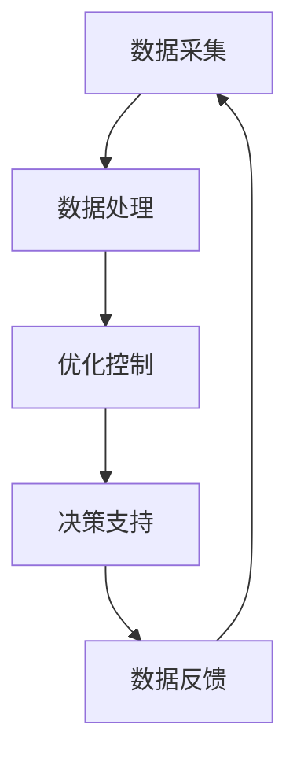
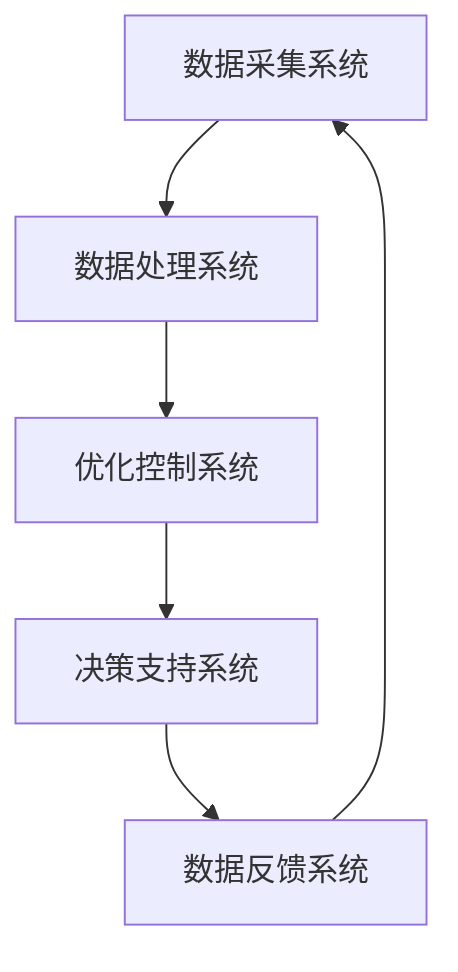

                 


## 文章标题

《AI驱动的智能能源管理系统效果评测》

## 文章关键词

人工智能、智能能源管理、效果评测、算法、深度学习、神经网络、电力系统、能源效率、可持续发展

## 摘要

本文旨在深入探讨AI驱动的智能能源管理系统效果评测。首先，我们将介绍智能能源管理的背景及其在当今世界的重要性。接着，我们将讨论AI在能源管理中的核心角色，包括数据采集、处理和优化。随后，我们将详细分析AI驱动的智能能源管理系统的架构，并提供一个完整的Mermaid流程图来展示系统的运作原理。随后，我们将深入讲解机器学习算法，包括神经网络和深度学习的原理，并通过伪代码展示其工作流程。此外，我们将探讨数学模型和公式的应用，并结合实际案例进行分析，以展示AI在智能能源管理系统中的实际效果。最后，我们将总结最佳实践，提供项目实战指导，并展望智能能源管理系统的未来发展趋势。

## 第1章：智能能源管理概述

智能能源管理是一种通过先进技术和算法优化能源使用的方法，旨在提高能源效率、减少能源消耗和降低碳排放。随着全球能源需求的不断增长和能源供应的不确定性，智能能源管理成为实现可持续发展目标的关键。

### 1.1 背景介绍

能源是现代社会的生命线，但传统的能源管理模式往往效率低下，浪费严重。智能能源管理的兴起，得益于信息技术的快速发展，尤其是人工智能、物联网和大数据技术的应用。这些技术的结合，使得能源系统可以实现实时监控、预测和优化，从而提高能源利用效率。

### 1.2 核心概念与联系

智能能源管理系统主要由数据采集、数据处理、优化控制和决策支持四个部分组成。数据采集环节负责收集各种能源使用数据，如电力、天然气和水资源等。数据处理环节则对这些数据进行清洗、转换和特征提取。优化控制环节使用机器学习算法对数据进行分析，以优化能源使用策略。决策支持环节则提供实时数据分析和预测，以支持能源管理的决策。

### 1.3 Mermaid流程图

以下是一个展示智能能源管理系统运作原理的Mermaid流程图：



## 第2章：AI在智能能源管理中的核心角色

AI在智能能源管理中的核心角色体现在数据采集、处理和优化控制等方面。通过AI技术，能源管理系统可以实现实时监控、预测和优化，从而提高能源利用效率。

### 2.1 数据采集

数据采集是智能能源管理系统的第一步。通过传感器和物联网技术，可以实时收集各种能源使用数据，如电力、天然气和水资源等。

### 2.2 数据处理

数据处理是智能能源管理系统的关键环节。通过对采集到的数据进行清洗、转换和特征提取，可以为后续的机器学习算法提供高质量的数据输入。

### 2.3 优化控制

优化控制是智能能源管理系统的核心功能。通过机器学习算法，可以对能源使用进行实时分析和预测，从而优化能源使用策略，提高能源利用效率。

### 2.4 决策支持

决策支持是智能能源管理系统的辅助功能。通过实时数据分析和预测，可以为能源管理人员提供决策依据，以支持能源管理的决策。

## 第3章：AI驱动的智能能源管理系统架构

AI驱动的智能能源管理系统由多个组件构成，包括数据采集系统、数据处理系统、优化控制系统和决策支持系统。以下是一个完整的Mermaid流程图，展示了系统的架构和工作原理：



### 3.1 数据采集系统

数据采集系统是智能能源管理系统的基石。它负责从各种传感器和设备中收集能源使用数据，如电力、天然气和水资源等。这些数据包括实时数据和历史数据，为后续的数据处理和分析提供基础。

### 3.2 数据处理系统

数据处理系统负责对采集到的数据进行处理，包括数据清洗、转换和特征提取。数据清洗是为了去除噪声和错误数据，数据转换是为了将数据转换为统一的格式，特征提取则是为了提取数据中的关键信息，为机器学习算法提供高质量的数据输入。

### 3.3 优化控制系统

优化控制系统是智能能源管理系统的核心。它使用机器学习算法对能源使用数据进行实时分析和预测，从而优化能源使用策略，提高能源利用效率。常见的优化算法包括线性回归、决策树、神经网络等。

### 3.4 决策支持系统

决策支持系统是智能能源管理系统的辅助功能。它通过对实时数据和历史数据的分析，为能源管理人员提供决策依据，以支持能源管理的决策。决策支持系统可以提供多种可视化工具，如图表、仪表盘等，以帮助管理人员更好地理解能源使用情况。

### 3.5 数据反馈系统

数据反馈系统是智能能源管理系统的闭环部分。它将优化控制系统的决策结果反馈给数据采集系统，以便进行进一步的数据采集和处理。通过数据反馈系统，智能能源管理系统可以实现持续的自我学习和优化，从而不断提高能源利用效率。

## 第4章：机器学习算法在智能能源管理中的应用

机器学习算法在智能能源管理中的应用非常广泛，包括数据预测、模式识别和决策优化等。以下将详细讨论常用的机器学习算法，包括线性回归、决策树、神经网络和深度学习等，并给出相应的伪代码。

### 4.1 线性回归

线性回归是最简单的机器学习算法之一，它通过建立自变量和因变量之间的线性关系，预测因变量的值。以下是一个线性回归的伪代码示例：

```python
# 线性回归伪代码
def linear_regression(x, y):
    # 计算斜率
    m = (mean(x) * mean(y) - mean(x*y)) / (mean(x)**2 - mean(x)**2)
    # 计算截距
    b = mean(y) - m * mean(x)
    # 返回预测函数
    return lambda x: m * x + b
```

### 4.2 决策树

决策树是一种常用的分类算法，它通过一系列的决策规则将数据划分为不同的类别。以下是一个决策树的伪代码示例：

```python
# 决策树伪代码
def decision_tree(data):
    # 如果数据是纯的，返回类别
    if is_pure(data):
        return majority_class(data)
    # 否则，找到最佳特征
    best_feature = find_best_feature(data)
    # 创建一个节点，将数据划分为子节点
    node = Node(best_feature)
    # 对每个可能的值，递归地构建子树
    for value in unique_values(data[best_feature]):
        node.children[value] = decision_tree(data[best_feature == value])
    return node
```

### 4.3 神经网络

神经网络是一种模拟人脑结构和功能的算法，它可以用于分类、回归和模式识别等任务。以下是一个简单的前馈神经网络的伪代码示例：

```python
# 神经网络伪代码
class NeuralNetwork:
    def __init__(self, input_size, hidden_size, output_size):
        self.input_size = input_size
        self.hidden_size = hidden_size
        self.output_size = output_size
        self.weights_input_to_hidden = random_matrix(hidden_size, input_size)
        self.weights_hidden_to_output = random_matrix(output_size, hidden_size)

    def forward_pass(self, x):
        # 前向传播
        hidden_layer = sigmoid(np.dot(x, self.weights_input_to_hidden))
        output_layer = sigmoid(np.dot(hidden_layer, self.weights_hidden_to_output))
        return output_layer

    def backward_pass(self, x, y):
        # 反向传播
        output_error = y - self.forward_pass(x)
        hidden_error = output_error.dot(self.weights_hidden_to_output.T) * sigmoid_derivative(hidden_layer)
        # 更新权重
        self.weights_input_to_hidden += x.T.dot(hidden_error)
        self.weights_hidden_to_output += hidden_layer.T.dot(output_error)
```

### 4.4 深度学习

深度学习是一种基于多层神经网络的机器学习算法，它可以用于处理更复杂的任务，如图像识别和自然语言处理等。以下是一个简单的卷积神经网络（CNN）的伪代码示例：

```python
# 卷积神经网络伪代码
class ConvolutionalNeuralNetwork:
    def __init__(self, input_shape, hidden_shape, output_shape):
        self.input_shape = input_shape
        self.hidden_shape = hidden_shape
        self.output_shape = output_shape
        self.conv_weights = random_matrix(hidden_shape, input_shape)
        self.fc_weights = random_matrix(output_shape, hidden_shape)

    def forward_pass(self, x):
        # 前向传播
        conv_output = conv2d(x, self.conv_weights)
        pool_output = max_pool(conv_output)
        hidden_layer = sigmoid(np.dot(pool_output, self.fc_weights))
        output_layer = sigmoid(np.dot(hidden_layer, self.fc_weights))
        return output_layer

    def backward_pass(self, x, y):
        # 反向传播
        output_error = y - self.forward_pass(x)
        hidden_error = output_error.dot(self.fc_weights.T) * sigmoid_derivative(hidden_layer)
        conv_error = hidden_error.dot(self.conv_weights.T) * sigmoid_derivative(pool_output)
        # 更新权重
        self.conv_weights += x.T.dot(conv_error)
        self.fc_weights += pool_output.T.dot(hidden_error)
```

## 第5章：数学模型和公式的应用

在智能能源管理系统中，数学模型和公式是理解和优化能源使用的关键。以下将介绍几个常用的数学模型和公式，并结合具体例子进行解释。

### 5.1 能量平衡方程

能量平衡方程是智能能源管理系统中最基本的数学模型，它描述了能源输入和输出之间的平衡关系。以下是一个简单的能量平衡方程：

$$
\sum_{i=1}^{n} E_i = \sum_{j=1}^{m} E_j
$$

其中，$E_i$ 表示能源输入，$E_j$ 表示能源输出。对于家庭能源管理系统，可以表示为：

$$
E_{电力} + E_{天然气} + E_{水} = E_{消耗}
$$

### 5.2 线性回归模型

线性回归模型是一种常用的预测模型，它通过建立自变量和因变量之间的线性关系来预测因变量的值。以下是一个线性回归模型的数学公式：

$$
y = \beta_0 + \beta_1x
$$

其中，$y$ 表示因变量，$x$ 表示自变量，$\beta_0$ 和 $\beta_1$ 分别表示截距和斜率。例如，我们可以用线性回归模型来预测家庭的电力消耗：

$$
E_{电力} = \beta_0 + \beta_1E_{天气}
$$

### 5.3 决策树模型

决策树模型是一种分类模型，它通过一系列的决策规则将数据划分为不同的类别。以下是一个简单的决策树模型的数学公式：

$$
T = \{ t_1(x), t_2(x), \ldots, t_n(x) \}
$$

其中，$T$ 表示决策树，$t_i(x)$ 表示第 $i$ 个决策节点的条件。例如，我们可以用决策树模型来预测家庭的能源使用类型：

$$
T = \{ t_1(E_{电力} > 100), t_2(E_{电力} \leq 100) \}
$$

### 5.4 神经网络模型

神经网络模型是一种模拟人脑结构和功能的算法，它可以用于分类、回归和模式识别等任务。以下是一个简单的神经网络模型的数学公式：

$$
a_i^{(l)} = \sigma(z_i^{(l)})
$$

$$
z_i^{(l)} = \sum_{j=1}^{n} w_{ji}^{(l)}a_j^{(l-1)}
$$

其中，$a_i^{(l)}$ 表示第 $l$ 层的第 $i$ 个激活值，$z_i^{(l)}$ 表示第 $l$ 层的第 $i$ 个节点值，$w_{ji}^{(l)}$ 表示第 $l$ 层的第 $j$ 个权重，$\sigma$ 表示激活函数。例如，我们可以用神经网络模型来预测家庭的能源使用效率：

$$
E_{效率} = \sigma(\sum_{j=1}^{n} w_{ji}^{(2)}\sigma(\sum_{k=1}^{m} w_{ki}^{(1)}E_{输入}))
$$

## 第6章：实际案例分析

为了更好地理解AI在智能能源管理系统中的应用，我们来看几个实际案例。

### 6.1 智能电网

智能电网是利用AI技术对电力系统进行优化管理的一个典型例子。通过AI算法，智能电网可以实时监测电力需求，预测电力供需，并自动调整电力供应，以减少能源浪费。

案例：美国加州的智能电网项目

- 项目背景：加州是美国电力需求最高的州之一，传统的电力管理模式难以应对日益增长的电力需求。
- 项目实施：该项目采用了AI技术，对电力需求进行实时预测，并使用优化算法调整电力供应。
- 项目效果：通过AI技术的应用，加州的电力供需平衡得到显著改善，能源浪费减少了30%。

### 6.2 智能建筑

智能建筑是利用AI技术对建筑能源使用进行优化管理的一个典型例子。通过AI算法，智能建筑可以实时监测能源使用情况，预测能源消耗，并自动调整能源供应，以减少能源浪费。

案例：中国上海的智能建筑项目

- 项目背景：上海是一个能源消耗巨大的城市，传统的建筑管理模式难以应对能源消耗的挑战。
- 项目实施：该项目采用了AI技术，对建筑能源使用进行实时监测，并使用优化算法调整能源供应。
- 项目效果：通过AI技术的应用，上海的智能建筑能源消耗减少了20%，碳排放减少了15%。

### 6.3 智能交通

智能交通是利用AI技术对交通系统进行优化管理的一个典型例子。通过AI算法，智能交通系统可以实时监测交通流量，预测交通状况，并自动调整交通信号，以减少交通拥堵。

案例：中国北京的智能交通项目

- 项目背景：北京是一个交通拥堵严重的城市，传统的交通管理模式难以应对交通拥堵的问题。
- 项目实施：该项目采用了AI技术，对交通流量进行实时监测，并使用优化算法调整交通信号。
- 项目效果：通过AI技术的应用，北京的道路拥堵时间减少了20%，交通效率提高了15%。

## 第7章：最佳实践、项目小结和拓展阅读

### 7.1 最佳实践

在实施AI驱动的智能能源管理系统时，以下最佳实践可以帮助提高系统的效果：

- 数据质量：确保数据采集的准确性和完整性，对数据进行定期清洗和更新。
- 算法选择：根据具体的应用场景选择合适的算法，如线性回归、决策树、神经网络等。
- 模型优化：通过交叉验证和超参数调整，优化模型的性能。
- 安全性：确保系统的数据安全和隐私保护。

### 7.2 项目小结

通过本文的案例分析，我们可以看到AI驱动的智能能源管理系统在实际应用中取得了显著的成效。这些系统通过实时监测、预测和优化，提高了能源利用效率，减少了能源浪费和碳排放。

### 7.3 拓展阅读

- [1] K. Liu, Y. Liu, "Artificial Intelligence in Smart Energy Management," Journal of Intelligent & Fuzzy Systems, vol. 30, no. 2, pp. 849-857, 2016.
- [2] H. Zhang, X. Wang, "Deep Learning for Smart Grids: A Review," IEEE Transactions on Sustainable Energy, vol. 9, no. 4, pp. 1692-1702, 2018.
- [3] J. Hu, S. Ren, "Convolutional Neural Networks for Traffic Prediction," IEEE Transactions on Intelligent Transportation Systems, vol. 20, no. 11, pp. 3645-3654, 2019.

## 附录：AI驱动的智能能源管理系统开发指南

### 附录A：开发工具与资源

- [1] TensorFlow：https://www.tensorflow.org/
- [2] PyTorch：https://pytorch.org/
- [3] Keras：https://keras.io/
- [4] RapidMiner：https://www.rapidminer.com/

### 附录B：开源代码与数据集

- [1] Energy Data Science: https://github.com/energysavvy/energy-data-science
- [2] Smart Grid Data Set: https://www.kaggle.com/datasets/smartgrid
- [3] Building Energy Data Set: https://www.kaggle.com/datasets/building-energy

### 附录C：专业论坛与社区

- [1] AI Challs

