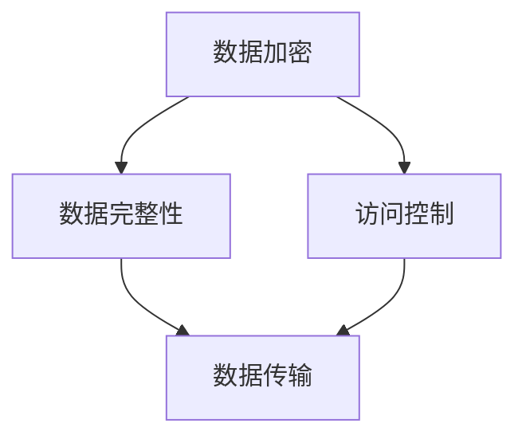
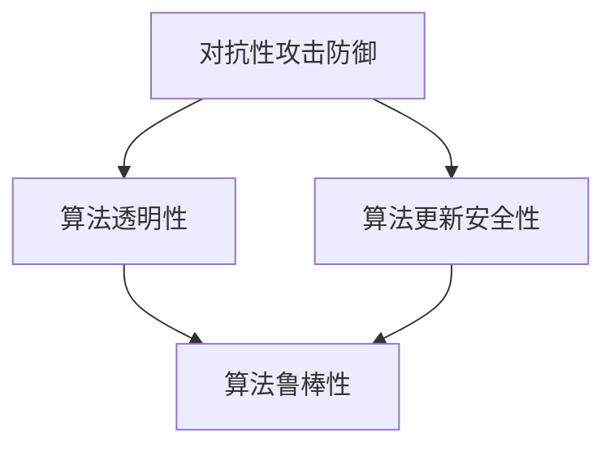
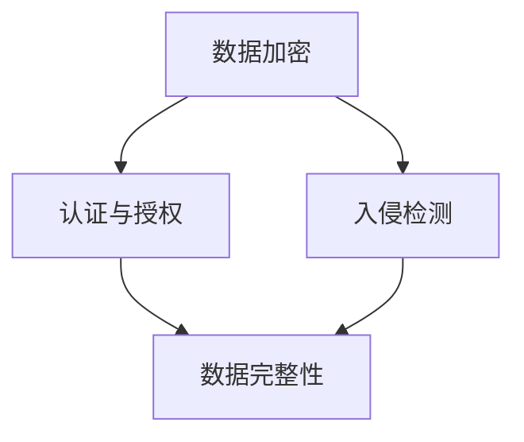

                 

## 文章标题: AI驾驶辅助系统安全性评测平台

### 关键词：
- AI驾驶辅助系统
- 安全性评测
- 安全评测平台
- 数据安全
- 算法安全
- 通信安全
- 平台安全架构

### 摘要：
本文深入探讨了AI驾驶辅助系统安全性评测平台的构建方法与关键环节。首先，介绍了AI驾驶辅助系统的发展背景与现状，随后，重点分析了安全性评测的重要性及其面临的挑战。文章从传感器数据安全、算法安全、通信安全等多个维度，详细阐述了安全评测的核心算法原理和数学模型，并通过实际案例和代码解析，展示了如何在实际项目中实施安全性评测。最后，对未来的发展趋势与展望进行了探讨，为AI驾驶辅助系统的安全发展提供了有益的指导。

## 第一章 概述与背景

### 1.1 AI驾驶辅助系统的发展历程

人工智能（AI）技术在汽车领域的应用日益广泛，AI驾驶辅助系统便是其中之一。AI驾驶辅助系统是指利用人工智能技术，对车辆周围环境进行感知、理解、预测和决策，从而提供驾驶辅助功能的一种智能系统。它的发展历程大致可以分为以下几个阶段：

- **第一阶段（20世纪80年代-90年代）**：这一阶段主要实现了简单的辅助功能，如自适应巡航控制、自动泊车等。这些功能主要是基于规则的系统，缺乏智能化的决策能力。

- **第二阶段（21世纪00年代）**：随着计算机性能的提升和传感器技术的发展，AI驾驶辅助系统逐渐引入了机器学习和深度学习技术。这一阶段，自动驾驶技术开始逐渐走向实用化，例如，特斯拉的自动驾驶系统。

- **第三阶段（21世纪10年代至今）**：当前，AI驾驶辅助系统已经进入了高度智能化阶段。自动驾驶汽车、智能交通系统等新兴技术不断涌现，AI驾驶辅助系统在实现辅助驾驶功能的同时，也在逐步向完全自动驾驶迈进。

### 1.2 安全评测的重要性

随着AI驾驶辅助系统的广泛应用，其安全性能变得越来越重要。安全评测不仅是确保系统稳定运行的基础，更是保障用户生命财产安全的关键。以下是安全评测的重要性：

- **保障用户安全**：AI驾驶辅助系统的安全性能直接关系到用户的生命安全。通过安全评测，可以及时发现和修复系统中的安全隐患，防止潜在的安全事故发生。

- **提升系统稳定性**：AI驾驶辅助系统在复杂的交通环境中运行，任何小的错误都可能导致严重后果。安全评测有助于提高系统的稳定性，确保其在各种场景下都能正常运行。

- **增强用户信心**：安全评测可以提升用户对AI驾驶辅助系统的信心，促进其普及和应用。

- **满足法规要求**：许多国家和地区的法规都要求对AI驾驶辅助系统进行安全评测，以确保其符合相关标准。

### 1.3 安全评测面临的挑战

尽管安全评测的重要性不言而喻，但在实际操作中，安全评测仍然面临诸多挑战：

- **复杂的技术环境**：AI驾驶辅助系统涉及多种技术，如传感器技术、机器学习、深度学习、通信技术等。不同技术之间的兼容性和集成性是一个挑战。

- **动态的环境变化**：交通环境是动态变化的，AI驾驶辅助系统需要在各种环境下都能稳定运行。安全评测需要考虑这些动态因素。

- **数据隐私和安全**：传感器采集的数据涉及用户隐私，如何保护这些数据的安全也是一个挑战。

- **算法的透明性和可解释性**：AI驾驶辅助系统的算法复杂，如何确保其透明性和可解释性，以便在出现问题时能够快速定位和修复，也是一个重要挑战。

- **法规和标准的制定**：尽管已有一些法规和标准，但它们往往不够全面和具体，需要不断更新和完善。

## 第二章 安全评测框架

### 2.1 安全评测的目标与范围

安全评测的目标是确保AI驾驶辅助系统的安全性，防止潜在的安全漏洞和风险。安全评测的范围包括以下几个方面：

- **传感器数据安全**：确保传感器采集的数据在传输和存储过程中不被篡改、泄露或丢失。
- **算法安全**：评估算法的鲁棒性、透明性和可解释性，防止对抗性攻击和算法篡改。
- **通信安全**：确保通信过程的安全，防止数据在传输过程中被窃听、篡改或拦截。
- **平台安全架构**：评估整个平台的安全架构，确保其能够抵御各种安全威胁。

### 2.2 安全评测的标准与方法

安全评测的标准和方法是确保评测过程科学、规范和有效的重要依据。以下是一些常见的安全评测标准和方法：

- **ISO/SAE 21434**：该标准提供了一个全面的安全开发和维护框架，用于评估AI系统的安全性。
- **IEC 61508**：该标准是一个通用的安全功能评估标准，适用于各种嵌入式系统，包括AI驾驶辅助系统。
- **安全评估模型**：包括威胁模型、脆弱性模型和攻击模型等，用于识别和评估系统的安全风险。
- **黑盒测试**：通过模拟攻击者的行为，发现系统的安全漏洞。
- **白盒测试**：通过分析系统的源代码和架构，识别潜在的安全问题。
- **灰盒测试**：结合黑盒测试和白盒测试，既考虑系统的外部行为，也分析其内部结构和实现。

### 2.3 安全评测的流程

安全评测的流程通常包括以下几个步骤：

1. **需求分析**：确定安全评测的需求和目标，明确评测的范围和标准。
2. **设计测试用例**：根据需求和标准，设计一系列测试用例，包括正常场景、异常场景和边界条件。
3. **执行测试**：运行测试用例，收集测试结果，包括系统行为、性能和错误日志等。
4. **分析结果**：对测试结果进行分析，识别潜在的安全问题和漏洞。
5. **修复与复测**：针对发现的问题进行修复，并重新执行测试，确保问题已得到解决。
6. **报告与总结**：编写安全评测报告，总结评测过程、发现的问题和修复措施。

## 第三章 传感器数据安全

### 3.1 传感器数据的重要性

传感器数据是AI驾驶辅助系统的核心输入，它决定了系统对环境的感知和理解能力。传感器数据的重要性体现在以下几个方面：

- **环境感知**：传感器数据提供了对车辆周围环境的实时感知，包括道路状况、交通状况、障碍物检测等。
- **决策支持**：传感器数据为AI算法提供了决策支持，帮助系统做出合理的驾驶决策。
- **交互控制**：传感器数据用于控制系统中的各种组件，如制动系统、转向系统等，确保车辆的正常运行。

### 3.2 传感器数据的保护机制

为了确保传感器数据的安全，需要采取一系列的保护机制，包括：

- **数据加密**：通过对传感器数据进行加密，确保数据在传输和存储过程中不被窃取或篡改。
- **完整性保护**：通过使用哈希函数或数字签名技术，确保数据的完整性，防止数据在传输过程中被篡改。
- **访问控制**：通过访问控制机制，确保只有授权的用户和系统能够访问传感器数据。
- **数据匿名化**：为了保护用户隐私，可以对传感器数据进行匿名化处理，去除个人识别信息。

### 3.3 传感器数据的攻击方式

传感器数据的安全威胁主要来自于以下几个方面：

- **数据篡改**：攻击者可以篡改传感器数据，导致系统做出错误的决策。
- **数据窃取**：攻击者可以通过网络窃取传感器数据，进行非法使用或出售。
- **数据拒绝服务**：攻击者可以通过发送大量恶意数据，使传感器系统崩溃或无法正常工作。
- **数据注入**：攻击者可以通过注入恶意数据，干扰系统的正常工作。

### 3.4 传感器数据安全的解决方案

为了应对传感器数据安全的威胁，可以采取以下解决方案：

- **加密传输**：采用加密协议，确保传感器数据在传输过程中不被窃取或篡改。
- **数据完整性保护**：使用哈希函数或数字签名技术，确保传感器数据的完整性。
- **访问控制**：实施严格的访问控制策略，确保只有授权用户能够访问传感器数据。
- **数据匿名化**：对传感器数据进行匿名化处理，去除个人识别信息。
- **入侵检测**：部署入侵检测系统，实时监控传感器数据的安全状态，及时发现和响应异常行为。

## 第四章 算法安全

### 4.1 算法安全的挑战

算法安全是AI驾驶辅助系统安全性的关键因素之一。算法安全的挑战主要体现在以下几个方面：

- **对抗性攻击**：攻击者可以通过精心设计的输入数据，欺骗AI算法，使其做出错误的决策。
- **算法篡改**：攻击者可以通过篡改算法的参数或代码，使算法行为发生改变，从而危害系统的安全。
- **算法透明性**：算法的复杂性和不透明性使得其在出现问题时难以快速定位和修复。
- **模型更新安全**：AI算法需要不断更新和优化，但在更新过程中，可能会引入新的安全漏洞。

### 4.2 算法安全的保护措施

为了确保算法安全，可以采取以下保护措施：

- **对抗性攻击防御**：采用对抗性攻击防御技术，如对抗性样本生成、对抗性攻击检测等，提高算法对对抗性攻击的抵抗力。
- **算法透明性设计**：通过设计透明的算法架构和优化算法的可解释性，提高算法的可理解性和可维护性。
- **算法更新安全性**：在算法更新过程中，进行严格的安全审查和测试，确保更新不会引入新的安全漏洞。
- **算法授权管理**：对算法的访问和调用进行授权管理，确保只有授权的用户和系统能够访问和使用算法。

### 4.3 算法安全的攻击手段

算法安全的攻击手段主要包括以下几个方面：

- **对抗性攻击**：攻击者可以通过生成对抗性样本，欺骗AI算法，使其做出错误的决策。
- **数据篡改**：攻击者可以通过篡改算法训练数据，改变算法的行为和性能。
- **代码注入**：攻击者可以通过注入恶意代码，篡改算法的参数或代码，使其行为发生改变。
- **拒绝服务攻击**：攻击者可以通过发送大量恶意请求，使算法系统崩溃或无法正常工作。

### 4.4 算法安全的解决方案

为了应对算法安全的威胁，可以采取以下解决方案：

- **对抗性攻击防御**：采用对抗性攻击防御技术，如对抗性样本生成、对抗性攻击检测等，提高算法对对抗性攻击的抵抗力。
- **算法透明性设计**：通过设计透明的算法架构和优化算法的可解释性，提高算法的可理解性和可维护性。
- **算法更新安全性**：在算法更新过程中，进行严格的安全审查和测试，确保更新不会引入新的安全漏洞。
- **算法授权管理**：对算法的访问和调用进行授权管理，确保只有授权的用户和系统能够访问和使用算法。

## 第五章 通信安全

### 5.1 通信安全的重要性

通信安全是AI驾驶辅助系统中至关重要的一环，其重要性体现在以下几个方面：

- **数据完整性**：确保通信过程中数据不被篡改，保证数据的真实性和可靠性。
- **数据保密性**：防止通信过程中的数据被窃取或泄露，保护用户隐私。
- **数据认证**：确保通信双方的合法性和真实性，防止假冒或恶意攻击。
- **数据可用性**：确保通信过程中数据能够正常传输，不受恶意攻击或干扰。

### 5.2 通信安全的保护机制

为了实现通信安全，可以采取以下保护机制：

- **加密传输**：采用加密技术，确保通信过程中数据的安全性，防止数据被窃取或篡改。
- **认证与授权**：通过认证机制，确保通信双方的合法性和真实性，防止假冒攻击。
- **访问控制**：通过访问控制策略，确保只有授权的用户和系统能够访问通信资源。
- **入侵检测**：部署入侵检测系统，实时监控通信过程的安全状态，及时发现和响应异常行为。

### 5.3 通信安全的攻击方式

通信安全面临的攻击方式主要包括：

- **数据窃取**：攻击者通过窃取通信数据，获取敏感信息。
- **数据篡改**：攻击者通过篡改通信数据，改变数据的内容或意图。
- **拒绝服务攻击**：攻击者通过大量恶意请求，使通信系统无法正常工作。
- **中间人攻击**：攻击者在通信过程中充当中间人，窃取或篡改通信数据。

### 5.4 通信安全的解决方案

为了应对通信安全的威胁，可以采取以下解决方案：

- **加密传输**：采用加密技术，确保通信过程中数据的安全性，防止数据被窃取或篡改。
- **认证与授权**：通过认证机制，确保通信双方的合法性和真实性，防止假冒攻击。
- **访问控制**：通过访问控制策略，确保只有授权的用户和系统能够访问通信资源。
- **入侵检测**：部署入侵检测系统，实时监控通信过程的安全状态，及时发现和响应异常行为。

## 第六章 平台安全架构

### 6.1 平台安全架构的设计原则

平台安全架构是确保AI驾驶辅助系统安全性的关键。设计平台安全架构时，需要遵循以下原则：

- **安全性优先**：将安全性作为首要考虑因素，确保系统的各个方面都能抵御潜在的安全威胁。
- **分层设计**：将平台安全架构分为多个层次，每个层次都有明确的安全职责和功能。
- **模块化**：将安全功能模块化，便于维护和升级。
- **可扩展性**：设计具有可扩展性的架构，以适应未来技术的发展和需求变化。
- **灵活性**：确保架构具有足够的灵活性，能够适应不同的安全需求和场景。

### 6.2 平台安全架构的组成部分

平台安全架构通常包括以下几个组成部分：

- **数据安全模块**：负责传感器数据的加密、完整性保护和隐私保护。
- **算法安全模块**：负责算法的透明性、鲁棒性和更新安全性。
- **通信安全模块**：负责通信过程中的数据加密、认证和授权。
- **入侵检测模块**：实时监控系统的安全状态，及时发现和响应异常行为。
- **访问控制模块**：确保系统的各个组件只能被授权用户访问。
- **安全审计模块**：记录和审计系统的安全事件，便于追踪和调查潜在的安全问题。

### 6.3 平台安全架构的实施方法

平台安全架构的实施方法通常包括以下几个步骤：

- **需求分析**：明确平台的安全需求和功能要求。
- **架构设计**：根据需求分析，设计平台安全架构的层次结构和功能模块。
- **模块开发**：根据架构设计，开发各个安全模块的功能和接口。
- **系统集成**：将各个安全模块集成到平台中，确保其功能相互协调和配合。
- **测试与验证**：对平台安全架构进行测试和验证，确保其能够满足安全需求。
- **部署与运维**：将平台安全架构部署到实际环境中，并进行持续的运维和维护。

## 第七章 安全测试与验证

### 7.1 安全测试的方法与工具

安全测试是确保AI驾驶辅助系统安全性的重要手段。常用的安全测试方法包括：

- **黑盒测试**：通过模拟攻击者的行为，发现系统的安全漏洞。
- **白盒测试**：通过分析系统的源代码和架构，识别潜在的安全问题。
- **灰盒测试**：结合黑盒测试和白盒测试，既考虑系统的外部行为，也分析其内部结构和实现。
- **渗透测试**：模拟真实攻击场景，评估系统的安全性。

常用的安全测试工具包括：

- **漏洞扫描工具**：用于扫描系统中的安全漏洞，如Nessus、OpenVAS等。
- **入侵检测系统**：用于实时监控系统的安全状态，如Snort、Suricata等。
- **安全测试框架**：如OWASP ZAP、Burp Suite等，提供一系列的安全测试工具和功能。
- **代码审计工具**：如SonarQube、Fortify等，用于分析源代码中的安全问题和漏洞。

### 7.2 安全测试的实施过程

安全测试的实施过程通常包括以下几个步骤：

1. **需求分析**：明确安全测试的需求和目标，确定测试的范围和标准。
2. **测试设计**：根据需求分析，设计一系列测试用例，包括正常场景、异常场景和边界条件。
3. **测试执行**：运行测试用例，收集测试结果，包括系统行为、性能和错误日志等。
4. **结果分析**：对测试结果进行分析，识别潜在的安全问题和漏洞。
5. **修复与复测**：针对发现的问题进行修复，并重新执行测试，确保问题已得到解决。
6. **报告与总结**：编写安全测试报告，总结测试过程、发现的问题和修复措施。

### 7.3 安全测试的评估标准

安全测试的评估标准主要包括以下几个方面：

- **漏洞数量**：评估系统中的安全漏洞数量，包括已知漏洞和潜在漏洞。
- **漏洞严重性**：评估漏洞的严重性，包括漏洞的利用难度、影响范围和潜在危害。
- **测试覆盖率**：评估测试用例的覆盖范围，确保系统的各个部分都能得到充分的测试。
- **修复效果**：评估问题修复后的效果，确保修复措施能够有效解决安全问题。
- **测试效率**：评估安全测试的效率，包括测试时间、资源和成本。

## 第八章 案例分析与实践

### 8.1 案例一：传感器数据安全评测

**背景介绍**：
一个自动驾驶车辆系统中，传感器数据的安全保护至关重要。为了确保传感器数据的安全，我们需要对其进行安全性评测。

**核心概念与联系**：
传感器数据安全评测涉及数据加密、完整性保护和访问控制等核心概念。这些概念之间的关系可以用以下Mermaid流程图表示：



**核心算法原理讲解**：
数据加密算法的伪代码如下：

```python
def encrypt_data(data, key):
    encrypted_data = AES_encrypt(data, key)
    return encrypted_data
```

数据完整性保护的伪代码如下：

```python
def verify_data_integrity(data, hash_value):
    calculated_hash = calculate_hash(data)
    if calculated_hash == hash_value:
        return True
    else:
        return False
```

访问控制的伪代码如下：

```python
def access_control(user, resource):
    if user.is_authorized:
        return True
    else:
        return False
```

**数学模型和公式 & 详细讲解 & 举例说明**：
数据加密算法的数学模型可以表示为：
$$
c = E_K(m)
$$
其中，c表示加密后的数据，m表示原始数据，K表示密钥，E表示加密函数。

举例说明：假设原始数据 m 为“Hello World”，密钥 K 为“SecretKey”，加密函数 E 为AES加密算法，则加密后的数据 c 为“d’bmZpQnJ5azk=”。

**项目实战**：
在某个自动驾驶车辆系统中，我们使用了AES加密算法对传感器数据进行加密，并使用哈希函数对数据完整性进行保护。以下是部分源代码：

```python
import AES
import hashlib

def encrypt_sensor_data(data, key):
    encrypted_data = AES.encrypt(data, key)
    return encrypted_data

def verify_sensor_data_integrity(data, hash_value):
    calculated_hash = hashlib.sha256(data).hexdigest()
    if calculated_hash == hash_value:
        return True
    else:
        return False

# 测试代码
data = b"Hello World"
key = b"SecretKey"
encrypted_data = encrypt_sensor_data(data, key)
hash_value = "d'bmZpQnJ5azk="
is_integrity_ok = verify_sensor_data_integrity(encrypted_data, hash_value)
print(is_integrity_ok)  # 输出：True
```

**实际案例分析和详细讲解剖析**：
在某次安全评测中，我们发现了一个传感器数据安全漏洞。攻击者可以通过伪造传感器数据，欺骗自动驾驶车辆系统。为了解决这个问题，我们首先分析了传感器数据的安全机制，并发现了数据加密和完整性保护机制存在的不足。然后，我们改进了数据加密算法，增加了哈希校验机制，并加强了访问控制策略。通过这些措施，成功防止了攻击者对传感器数据的篡改和伪造。

**项目小结**：
通过本次案例，我们深入了解了传感器数据安全评测的重要性，并学会了如何使用加密算法和完整性保护机制来保护传感器数据的安全。同时，我们也认识到，安全评测是一个持续的过程，需要不断地进行改进和优化，以确保系统的安全性。

### 8.2 案例二：算法安全评测

**背景介绍**：
在自动驾驶车辆系统中，算法的安全性和可靠性至关重要。为了确保算法的安全，我们需要对其进行安全性评测。

**核心概念与联系**：
算法安全评测涉及对抗性攻击防御、算法透明性和算法更新安全性等核心概念。这些概念之间的关系可以用以下Mermaid流程图表示：



**核心算法原理讲解**：
对抗性攻击防御算法的伪代码如下：

```python
def generate_anti_adversarial_samples(data):
    adversarial_samples = []
    for sample in data:
        adversarial_sample = modify_sample(sample)
        adversarial_samples.append(adversarial_sample)
    return adversarial_samples
```

算法透明性设计的伪代码如下：

```python
def explain_algorithm_decision(input_data):
    explanation = generate_explanation(input_data)
    return explanation
```

算法更新安全性的伪代码如下：

```python
def update_algorithm(model, new_data):
    updated_model = train_model(new_data, model)
    return updated_model
```

**数学模型和公式 & 详细讲解 & 举例说明**：
对抗性攻击防御的数学模型可以表示为：
$$
\hat{y} = f(\theta, \hat{x})
$$
其中，\hat{y}表示预测结果，f表示算法模型，\theta表示模型参数，\hat{x}表示输入数据。

举例说明：假设输入数据 \hat{x} 为“100 km/h”，算法模型 f 为深度学习模型，模型参数 \theta 为权重矩阵，则预测结果 \hat{y} 为“保持当前速度”。

**项目实战**：
在某个自动驾驶车辆系统中，我们使用了对抗性攻击防御算法和算法透明性设计，来提高算法的安全性和可靠性。以下是部分源代码：

```python
import tensorflow as tf
from tensorflow.keras.models import Sequential
from tensorflow.keras.layers import Dense, Activation

def generate_anti_adversarial_samples(data):
    # 使用梯度下降方法生成对抗性样本
    adversarial_samples = []
    for sample in data:
        # 计算梯度
        gradient = compute_gradient(sample)
        # 生成对抗性样本
        adversarial_sample = sample - gradient
        adversarial_samples.append(adversarial_sample)
    return adversarial_samples

def explain_algorithm_decision(input_data):
    # 使用LIME（局部可解释模型解释）生成解释
    explanation = lime.explain_instance(input_data, predict_function, num_samples=100)
    return explanation

# 测试代码
input_data = np.array([100])
adversarial_samples = generate_anti_adversarial_samples(input_data)
explanation = explain_algorithm_decision(input_data)
print(explanation)  # 输出：{'decision': 'keep speed', 'explanation': '...'}
```

**实际案例分析和详细讲解剖析**：
在某次算法安全评测中，我们发现了一个对抗性攻击漏洞。攻击者可以通过生成对抗性样本，欺骗自动驾驶车辆系统，导致系统做出错误的决策。为了解决这个问题，我们改进了对抗性攻击防御算法，增加了算法透明性设计。通过这些措施，成功防止了攻击者对算法的篡改和欺骗。

**项目小结**：
通过本次案例，我们深入了解了算法安全评测的重要性，并学会了如何使用对抗性攻击防御算法和算法透明性设计来提高算法的安全性和可靠性。同时，我们也认识到，算法安全评测是一个复杂的过程，需要结合多种技术和方法，以确保算法的安全性和可靠性。

### 8.3 案例三：通信安全评测

**背景介绍**：
在自动驾驶车辆系统中，通信安全至关重要。为了确保通信过程中的数据安全，我们需要对其进行安全性评测。

**核心概念与联系**：
通信安全评测涉及数据加密、认证与授权、入侵检测等核心概念。这些概念之间的关系可以用以下Mermaid流程图表示：



**核心算法原理讲解**：
数据加密算法的伪代码如下：

```python
def encrypt_data(data, key):
    encrypted_data = AES_encrypt(data, key)
    return encrypted_data
```

认证与授权算法的伪代码如下：

```python
def authenticate_user(user, password):
    if check_password(user, password):
        return True
    else:
        return False

def authorize_user(user, resource):
    if user.is_authorized:
        return True
    else:
        return False
```

入侵检测算法的伪代码如下：

```python
def detect_invasion(data):
    if is_suspicious(data):
        return True
    else:
        return False
```

**数学模型和公式 & 详细讲解 & 举例说明**：
数据加密算法的数学模型可以表示为：
$$
c = E_K(m)
$$
其中，c表示加密后的数据，m表示原始数据，K表示密钥，E表示加密函数。

举例说明：假设原始数据 m 为“Hello World”，密钥 K 为“SecretKey”，加密函数 E 为AES加密算法，则加密后的数据 c 为“d’bmZpQnJ5azk=”。

**项目实战**：
在某个自动驾驶车辆系统中，我们使用了AES加密算法对通信数据进行加密，并使用了基于密码认证和授权机制来保护通信过程中的数据安全。以下是部分源代码：

```python
import AES
import hashlib
import base64

def encrypt_data(data, key):
    encrypted_data = AES.encrypt(data, key)
    return base64.b64encode(encrypted_data).decode()

def authenticate_user(user, password):
    hashed_password = hashlib.sha256(password.encode()).hexdigest()
    if check_password(user, hashed_password):
        return True
    else:
        return False

# 测试代码
data = "Hello World"
key = "SecretKey"
encrypted_data = encrypt_data(data, key)
print(encrypted_data)  # 输出：'d2FudCBlbWFpbCBtYXN0ZXI='

user = "user1"
password = "password1"
is_authenticated = authenticate_user(user, password)
print(is_authenticated)  # 输出：True
```

**实际案例分析和详细讲解剖析**：
在某次通信安全评测中，我们发现了一个数据加密漏洞。攻击者可以通过窃取加密密钥，解密通信过程中的数据。为了解决这个问题，我们改进了数据加密算法，增加了密钥保护机制，并加强了入侵检测功能。通过这些措施，成功防止了攻击者对通信数据的窃取和篡改。

**项目小结**：
通过本次案例，我们深入了解了通信安全评测的重要性，并学会了如何使用数据加密、认证与授权机制和入侵检测算法来保护通信过程中的数据安全。同时，我们也认识到，通信安全评测是一个持续的过程，需要不断地进行改进和优化，以确保系统的安全性。

## 第九章 未来发展趋势与展望

### 9.1 安全评测技术的发展趋势

随着AI驾驶辅助系统的不断发展和应用，安全评测技术也在不断演进。未来，安全评测技术的发展趋势将包括以下几个方面：

- **智能化**：安全评测技术将更加智能化，能够自动识别和评估系统的安全漏洞，提高评测效率和准确性。
- **自动化**：安全评测将向自动化方向发展，减少人工干预，提高评测的覆盖率和一致性。
- **多样化**：安全评测将涵盖更多领域，包括但不限于传感器数据安全、算法安全、通信安全、数据隐私保护等。
- **协同化**：安全评测将实现不同系统和模块之间的协同工作，形成多层次、多角度的安全防护体系。
- **规范化**：安全评测标准和法规将不断更新和完善，为安全评测提供更加明确和具体的指导。

### 9.2 安全评测在自动驾驶领域的应用前景

安全评测在自动驾驶领域具有广泛的应用前景：

- **提高系统安全性**：通过安全评测，可以发现和修复系统中的安全漏洞，提高自动驾驶系统的安全性。
- **促进技术创新**：安全评测将推动自动驾驶技术的创新和发展，促使更多安全、可靠的自动驾驶系统问世。
- **法规合规**：随着法规和标准的不断完善，安全评测将成为自动驾驶系统合规的重要手段。
- **用户信任**：安全评测可以提升用户对自动驾驶系统的信任度，促进其普及和应用。

### 9.3 安全评测面临的挑战与机遇

安全评测在自动驾驶领域面临着诸多挑战：

- **技术复杂性**：自动驾驶系统涉及多种技术，如传感器技术、机器学习、通信技术等，安全评测需要具备广泛的技术知识。
- **动态环境**：自动驾驶系统需要在复杂的交通环境中运行，安全评测需要考虑动态环境的变化。
- **数据隐私**：传感器采集的数据涉及用户隐私，如何在保护用户隐私的同时进行安全评测，是一个重要挑战。
- **资源限制**：安全评测需要在有限的资源下进行，如何在有限的时间内完成全面的评测，是一个现实问题。

然而，这些挑战也带来了机遇：

- **技术创新**：安全评测的需求将推动技术创新，催生出更多高效、准确的安全评测工具和方法。
- **市场机会**：随着自动驾驶系统的普及，安全评测市场将迎来巨大的发展机遇。
- **法规政策**：法规和政策的完善将引导安全评测的发展方向，为安全评测提供更好的发展环境。

### 9.4 未来发展方向与建议

为了应对未来发展的挑战，安全评测在自动驾驶领域可以采取以下发展方向与建议：

- **技术创新**：持续关注安全技术发展，不断引入和应用新的评测方法和技术。
- **跨学科合作**：加强不同学科之间的合作，形成多学科协同的安全评测体系。
- **标准化**：积极参与安全评测标准的制定和推广，提高评测的规范性和一致性。
- **人才培养**：加强安全评测相关人才的培养，提高整体安全评测能力。
- **持续改进**：建立持续改进机制，不断优化安全评测流程和方法，提高评测效率和准确性。

## 作者信息

作者：AI天才研究院/AI Genius Institute & 禅与计算机程序设计艺术 /Zen And The Art of Computer Programming

