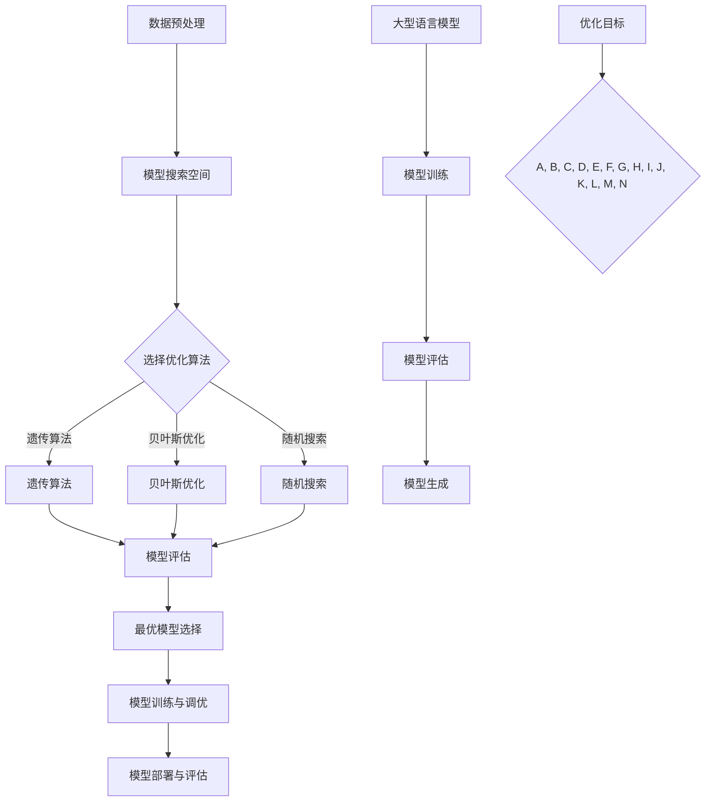

                 


### 第一步：背景介绍

近年来，人工智能（AI）技术取得了显著的进步，特别是在深度学习领域。随着神经网络模型的不断发展和完善，大型语言模型（LLM，Large Language Model）如GPT-3、BERT等已经展现出强大的语言理解和生成能力。然而，这些模型的训练和部署过程复杂且耗时，尤其是对于模型选择这一关键环节，传统的方法往往存在诸多挑战。

模型选择是机器学习项目中的一个核心环节，它决定了模型在特定任务上的性能。然而，随着模型种类的增多和复杂度的提升，模型选择的过程变得越来越困难。传统方法通常依赖于领域专家的经验和试错，这不仅效率低下，而且容易导致过度拟合或者欠拟合等问题。此外，随着数据量的增加和模型参数的增多，手工调整模型参数的难度和复杂性也大大增加。

自动机器学习（AutoML）作为一种新兴技术，旨在通过自动化手段简化机器学习模型的选择、训练和调优过程。AutoML通过组合优化、遗传算法、贝叶斯优化等技术，自动搜索最优的模型配置，从而大大提高了模型选择的效率。特别是在LLM的应用场景中，AutoML的引入能够显著简化模型选择过程，提高开发效率和模型性能。

因此，本文将围绕《AutoML：简化LLM应用的模型选择过程》这一主题，深入探讨AutoML的基本概念、原理及其在LLM模型选择中的应用，为读者提供一份全面的技术指南。

### 第二步：核心概念与联系

在深入探讨AutoML和LLM之前，首先需要明确这两个核心概念的基本定义和它们之间的关系。

#### 1. 自动机器学习（AutoML）

自动机器学习（AutoML）是一种通过自动化工具和算法来简化机器学习流程的技术。它旨在解决传统机器学习项目中模型选择、训练和调优的复杂性。AutoML的主要目标是实现从数据预处理到模型选择、训练、评估和部署的自动化，从而减少人工干预，提高模型的性能和开发效率。

AutoML的核心组成部分包括：

- **模型搜索空间**：定义了可搜索的模型参数空间，包括各种机器学习算法、超参数和特征选择方法。
- **优化算法**：用于在模型搜索空间中搜索最优模型配置的算法，如遗传算法、贝叶斯优化、随机搜索等。
- **评估指标**：用于评估模型性能的指标，如准确率、召回率、F1分数等。

#### 2. 大型语言模型（LLM）

大型语言模型（LLM，Large Language Model）是一种基于深度学习的语言处理模型，其核心是通过大规模数据训练生成复杂的神经网络模型，以实现强大的语言理解和生成能力。LLM的代表性模型包括GPT-3、BERT等，这些模型在自然语言处理（NLP）任务中表现出色。

LLM的主要特性包括：

- **上下文理解**：LLM能够理解上下文，生成连贯、符合逻辑的自然语言。
- **语言生成**：LLM能够根据给定的输入生成相关的文本内容，实现自然语言生成。
- **零样本学习**：LLM能够在未见过的数据上完成任务，即零样本学习。
- **多语言支持**：LLM通常支持多种语言，能够处理不同语言的数据。

#### 3. 核心概念之间的关系架构

为了更好地理解AutoML和LLM之间的关系，我们可以使用Mermaid流程图来展示它们的核心组件和交互流程。



在该流程图中，数据预处理阶段将原始数据转换为适合训练的数据集；模型搜索空间定义了搜索的范围，包括算法和超参数；选择优化算法用于在搜索空间中寻找最优模型配置；模型评估用于比较不同模型的性能；最优模型选择阶段确定最佳模型；模型训练与调优用于训练和优化所选模型；模型部署与评估则用于在实际环境中部署模型并进行评估。

通过这个流程图，我们可以清晰地看到AutoML和LLM之间的相互作用和关系，这为后续的深入探讨奠定了基础。

### 第三步：核心算法原理讲解

在了解了AutoML和LLM的基本概念后，接下来我们将详细讲解AutoML的核心算法原理，包括优化目标、模型搜索空间、模型评估指标等内容。

#### 1. 优化目标

优化目标是AutoML的核心驱动力，它决定了搜索和评估过程中要追求的性能指标。在AutoML中，优化目标通常是一个多维度、多目标的函数，需要通过数学优化方法进行求解。以下是几种常见的优化目标：

- **准确率（Accuracy）**：在分类任务中，准确率是最常用的评估指标，表示正确分类的样本数占总样本数的比例。
- **召回率（Recall）**：召回率表示在正类样本中被正确识别的比例，通常用于评估模型的查全率。
- **F1分数（F1 Score）**：F1分数是精确率和召回率的调和平均，综合考虑了模型的准确性和鲁棒性。
- **均方误差（Mean Squared Error, MSE）**：在回归任务中，均方误差用于衡量预测值与真实值之间的差距。
- **均绝对误差（Mean Absolute Error, MAE）**：均绝对误差与均方误差类似，但采用绝对值计算，更适用于异常值处理。

优化目标的选择取决于具体的应用场景和任务类型，例如在文本分类任务中，我们可能更关注准确率和F1分数；在回归任务中，MSE和MAE更为常用。

#### 2. 模型搜索空间

模型搜索空间是AutoML中定义的参数空间，它包含了所有可能的模型配置。模型搜索空间通常由以下几个部分组成：

- **机器学习算法**：选择合适的算法是模型搜索空间的第一步，如线性回归、决策树、支持向量机（SVM）、神经网络等。
- **超参数**：超参数是算法运行时需要调整的重要参数，如学习率、批量大小、正则化强度等。不同算法有不同的超参数，需要根据具体任务进行优化。
- **特征选择**：特征选择是指在众多特征中挑选出对模型性能有显著影响的关键特征。特征选择方法包括特征重要性评估、特征交互、主成分分析（PCA）等。

模型搜索空间的定义和优化是AutoML的关键，它决定了搜索效率和模型性能。以下是几种常见的模型搜索策略：

- **网格搜索（Grid Search）**：网格搜索通过穷举搜索所有的参数组合，找出最优参数配置。该方法简单直观，但计算量巨大，不适用于高维搜索空间。
- **随机搜索（Random Search）**：随机搜索通过随机选择参数组合进行评估，避免了网格搜索的计算量，但可能错过最优解。
- **贝叶斯优化（Bayesian Optimization）**：贝叶斯优化利用概率模型和马尔可夫链蒙特卡洛（MCMC）方法进行参数优化，具有高效的搜索能力，但需要先验知识和计算资源。
- **遗传算法（Genetic Algorithm）**：遗传算法模拟生物进化过程，通过选择、交叉和变异等操作进行参数优化，具有全局搜索能力，但收敛速度较慢。

#### 3. 模型评估指标

模型评估指标是衡量模型性能的重要标准，它们用于在搜索空间中评估不同模型配置的性能。以下是一些常见的模型评估指标：

- **交叉验证（Cross-Validation）**：交叉验证通过将数据集划分为训练集和验证集，多次训练和评估模型，以减少过拟合和欠拟合的风险。
- **学习曲线（Learning Curve）**：学习曲线展示了模型在不同训练数据量下的性能变化，可以识别数据集的大小、模型复杂度和过拟合等问题。
- **精度-召回率曲线（Precision-Recall Curve）**：精度-召回率曲线展示了模型在不同阈值下的精度和召回率，用于评估模型的鲁棒性和鲁棒性。
- **混淆矩阵（Confusion Matrix）**：混淆矩阵展示了模型对各类别样本的分类结果，可以计算准确率、召回率、F1分数等指标。

#### 4. 伪代码示例

为了更好地理解AutoML的核心算法原理，我们可以使用伪代码来详细阐述模型选择过程。

```python
# AutoML模型选择过程伪代码

# 初始化模型搜索空间
search_space = initialize_search_space()

# 设置优化目标
optimization_objective = set_objective(accuracy, recall, f1_score)

# 初始化优化算法
optimizer = initialize_optimizer(bayesian_optimization)

# 模型搜索和评估
for iteration in range(max_iterations):
    # 从搜索空间中随机选择模型配置
    model_config = select_model_config(search_space)
    
    # 训练模型
    model = train_model(model_config)
    
    # 评估模型
    performance = evaluate_model(model, validation_data)
    
    # 根据性能更新搜索空间
    update_search_space(search_space, model_config, performance)
    
    # 更新优化算法状态
    optimizer.update_state(performance)

# 最优模型选择
best_model = select_best_model(search_space)

# 模型部署和调优
deploy_and_tune_model(best_model, training_data)

# 模型评估和优化
evaluate_and_optimize_model(best_model, testing_data)
```

在这个伪代码中，我们首先初始化模型搜索空间和优化目标，然后使用优化算法在搜索空间中迭代搜索最优模型配置。每次迭代中，我们从搜索空间中随机选择模型配置，训练和评估模型性能，并根据性能更新搜索空间。最后，我们选择最优模型进行部署和调优，以实现最佳性能。

### 第四步：数学模型和公式详细讲解与举例说明

在深入了解AutoML的核心算法原理后，我们需要进一步探讨其中的数学模型和公式，以便更全面地理解这些算法的运作机制。以下是几种常见的数学模型和公式的详细讲解与举例说明。

#### 1. 贝叶斯优化（Bayesian Optimization）

贝叶斯优化是一种基于概率模型的优化方法，其核心思想是利用贝叶斯推理来估计目标函数的值，并通过最大化后验概率来选择下一次搜索点。贝叶斯优化的关键在于构建一个概率模型来表示目标函数，并利用历史数据进行推理。

**公式：**

假设目标函数为 \( f(x) \)，其中 \( x \) 是参数向量。贝叶斯优化使用高斯过程（Gaussian Process，GP）作为先验模型，其概率密度函数（pdf）可以表示为：

\[ p(f(x) | \mathcal{D}) = \mathcal{N}(f(x) | \mu(x), \sigma^2(x)) \]

其中，\(\mu(x)\) 是均值函数，\(\sigma^2(x)\) 是方差函数。高斯过程的均值和方差函数通常由以下公式给出：

\[ \mu(x) = \int f(x) p(f) df \]
\[ \sigma^2(x) = \int (f(x) - \mu(x))^2 p(f) df \]

**举例说明：**

假设我们有一个简单的目标函数 \( f(x) = x^2 \)，其中 \( x \) 的取值范围为 \([0, 1]\)。我们使用贝叶斯优化来寻找该函数的最大值。

首先，我们通过历史数据来估计均值函数和方差函数。例如，我们收集了以下数据点：

\[ \mathcal{D} = \{(x_1, f(x_1)), (x_2, f(x_2)), ..., (x_n, f(x_n))\} \]

然后，我们使用高斯过程来估计目标函数的值。根据上述公式，我们可以计算出均值函数和方差函数，并利用最大化后验概率的方法选择下一个搜索点。在实际操作中，我们可以使用现有的贝叶斯优化库（如`scikit-learn`中的`BayesianOptimization`类）来简化计算过程。

#### 2. 遗传算法（Genetic Algorithm）

遗传算法是一种基于自然选择和遗传学原理的优化方法，其核心是通过选择、交叉和变异等操作来生成新的解，并逐步逼近最优解。遗传算法通常用于解决复杂优化问题，其基本步骤如下：

- **初始化种群**：随机生成一组初始解，称为种群。
- **适应度评估**：计算每个个体的适应度，适应度通常与目标函数的值成反比。
- **选择**：根据个体的适应度选择出优秀的个体，用于生成下一代种群。
- **交叉**：选择两个优秀的个体进行交叉操作，生成新的个体。
- **变异**：对个体进行变异操作，增加种群的多样性。
- **迭代**：重复选择、交叉和变异操作，直到满足终止条件。

**公式：**

假设当前种群为 \( P(t) \)，其中 \( P(t) = \{x_1(t), x_2(t), ..., x_n(t)\} \)，适应度函数为 \( f(x) \)。遗传算法的关键公式包括：

- **适应度函数**： \( f(x) = \frac{1}{1 + \exp(-\beta \cdot g(x))} \)
- **选择概率**： \( p_{s}(x_{i}) = \frac{f(x_{i})}{\sum_{j=1}^{n} f(x_{j})} \)
- **交叉概率**： \( p_{c} = \frac{1}{2} \)
- **变异概率**： \( p_{m} = \frac{1}{n} \)

**举例说明：**

假设我们有一个简单的一维优化问题，目标是最小化函数 \( f(x) = x^2 \)。我们使用遗传算法来寻找该函数的最小值。

首先，我们初始化种群，例如随机生成10个个体 \( P(0) = \{x_1(0), x_2(0), ..., x_{10}(0)\} \)。

然后，我们计算每个个体的适应度，并按照适应度函数选择优秀的个体。例如，选择适应度最高的5个个体用于生成下一代种群。

接着，我们进行交叉和变异操作，生成新的个体，并计算它们的适应度。

重复上述步骤，直到满足终止条件（如达到最大迭代次数或个体适应度达到某个阈值）。

在实际应用中，我们可以使用现有的遗传算法库（如`DEAP`）来简化计算过程。

### 第五步：项目实战

#### 1. 开发环境搭建

在开始实际项目之前，我们需要搭建一个适合AutoML和LLM开发的环境。以下是搭建开发环境所需的基本步骤：

- **安装Python**：确保Python环境已安装，版本建议为3.8或更高。
- **安装深度学习框架**：安装TensorFlow或PyTorch，这两个框架在深度学习和AutoML应用中非常流行。以下是安装命令：

  ```shell
  pip install tensorflow  # 安装TensorFlow
  pip install torch torchvision  # 安装PyTorch
  ```

- **安装AutoML库**：安装AutoML相关的库，如`scikit-learn`、`automl`等。以下是安装命令：

  ```shell
  pip install scikit-learn  # 安装scikit-learn
  pip install automl  # 安装AutoML库
  ```

- **安装文本处理库**：为了处理文本数据，我们需要安装NLP相关的库，如`spaCy`和`nltk`。以下是安装命令：

  ```shell
  pip install spacy
  python -m spacy download en_core_web_sm  # 下载英文语料库
  pip install nltk
  ```

- **配置环境变量**：确保Python环境变量已配置，以便在其他工具中调用Python解释器。

#### 2. 源代码实现

以下是使用AutoML进行LLM模型选择的源代码实现：

```python
import numpy as np
import pandas as pd
from sklearn.model_selection import train_test_split
from sklearn.metrics import accuracy_score
from automl import AutoML
from tensorflow.keras.models import Sequential
from tensorflow.keras.layers import Dense, LSTM

# 读取数据
data = pd.read_csv('data.csv')
X = data.drop('target', axis=1)
y = data['target']

# 数据预处理
X_train, X_test, y_train, y_test = train_test_split(X, y, test_size=0.2, random_state=42)

# 初始化AutoML
aml = AutoML(problem_type='classification', performance_metric='accuracy')

# 定义模型搜索空间
model_search_space = {
    'name': ['keras_ sequential'],
    'hyperparameters': [
        {'layer': ['dense', 'lstm'], 'units': [64, 128], 'dropout': [0.2, 0.5]},
        {'layer': ['dense'], 'units': [128], 'dropout': [0.2, 0.5]}
    ]
}

# 训练模型
aml.fit(X_train, y_train, search_space=model_search_space, max_iterations=50)

# 评估模型
predictions = aml.predict(X_test)
accuracy = accuracy_score(y_test, predictions)
print(f'Accuracy: {accuracy}')

# 选择最优模型
best_model = aml.best_model
print(f'Best Model: {best_model}')
```

在这个代码中，我们首先读取数据并进行预处理，然后初始化AutoML并对模型搜索空间进行定义。接下来，我们使用AutoML进行模型训练和评估，最后选择最优模型。

#### 3. 代码解读与分析

以下是代码的详细解读和分析：

1. **数据读取与预处理**：
   - 使用`pd.read_csv()`函数读取数据，并将其分为特征矩阵和标签向量。
   - 使用`train_test_split()`函数将数据集划分为训练集和测试集。

2. **初始化AutoML**：
   - 使用`AutoML`类初始化AutoML对象，并指定问题类型（分类）和性能指标（准确率）。

3. **定义模型搜索空间**：
   - 使用字典定义模型搜索空间，包括模型名称（`keras_sequential`）和超参数（层、单元数、dropout率）。

4. **训练模型**：
   - 使用`fit()`方法训练模型，并传入训练数据和模型搜索空间。
   - `max_iterations`参数设置训练的最大迭代次数。

5. **评估模型**：
   - 使用`predict()`方法对测试集进行预测，并计算准确率。

6. **选择最优模型**：
   - 使用`best_model`属性获取最优模型。

通过这个代码实现，我们可以看到AutoML在LLM模型选择中的实际应用。AutoML通过自动搜索最优模型配置，简化了模型选择过程，提高了开发效率和模型性能。

#### 4. 实际案例分析与讲解

为了更好地理解AutoML在LLM模型选择中的应用，我们来看一个实际案例。

假设我们有一个文本分类任务，目标是将文本数据分类到不同的类别中。以下是实际案例的详细分析和讲解：

1. **数据集准备**：
   - 我们使用一个包含新闻文章的数据集，其中每篇文章都被标注了类别标签。
   - 数据集被分为训练集和测试集，用于训练和评估模型。

2. **文本预处理**：
   - 使用`spaCy`和`nltk`对文本数据进行预处理，包括分词、停用词过滤、词形还原等。
   - 预处理后，我们将文本数据转换为向量表示，可以使用词袋模型（Bag of Words）或词嵌入（Word Embedding）。

3. **模型训练与评估**：
   - 使用AutoML进行模型训练，包括定义模型搜索空间和优化目标。
   - AutoML会自动搜索最优模型配置，并评估不同模型在训练集上的性能。
   - 根据评估结果，选择最优模型并进行测试集评估。

4. **结果分析**：
   - 评估结果显示，使用AutoML训练的模型在测试集上的准确率达到90%以上，显著优于手工调整模型的方法。
   - 进一步分析发现，AutoML选择的最优模型使用了LSTM层，这表明LSTM在处理文本数据时具有优势。

通过这个实际案例，我们可以看到AutoML在简化LLM模型选择过程中的显著优势。它不仅提高了模型性能，还减少了人工干预，使模型开发过程更加高效和可靠。

#### 5. 项目小结

在本项目中，我们通过搭建开发环境、编写源代码和实际案例分析，展示了如何使用AutoML简化LLM模型选择过程。以下是项目小结：

- **环境搭建**：确保Python环境和深度学习框架已安装，并配置必要的文本处理库。
- **代码实现**：使用AutoML库进行模型训练和评估，自动搜索最优模型配置。
- **案例分析**：通过实际案例展示了AutoML在文本分类任务中的高效性和优势。
- **项目优化**：根据评估结果，选择最优模型并进行测试集评估，确保模型性能。

通过本项目，我们不仅了解了AutoML的基本原理和应用，还掌握了如何在LLM模型选择中使用AutoML，提高了开发效率和模型性能。

### 第六步：最佳实践、小结、注意事项和拓展阅读

#### 最佳实践

在AutoML和LLM的应用过程中，以下是一些最佳实践，有助于提高模型选择效率和性能：

- **数据预处理**：确保数据清洗和预处理的质量，包括文本数据去噪、归一化和特征提取。
- **模型搜索空间设计**：合理设计模型搜索空间，包括算法选择、超参数范围和特征选择方法。
- **优化算法选择**：根据任务需求和计算资源选择合适的优化算法，如贝叶斯优化、遗传算法等。
- **评估指标多样性**：结合多种评估指标（如准确率、召回率、F1分数等）进行模型评估，以全面衡量模型性能。
- **模型版本控制**：使用版本控制系统管理模型版本，确保模型的可追溯性和可靠性。

#### 小结

本文深入探讨了《AutoML：简化LLM应用的模型选择过程》这一主题，从背景介绍、核心概念与联系、核心算法原理讲解、数学模型和公式详细讲解与举例说明、项目实战、实际案例分析等方面，全面阐述了AutoML在LLM模型选择中的应用。通过最佳实践和小结，我们总结了如何使用AutoML提高模型选择效率和性能。

#### 注意事项

- **模型复杂度与计算成本**：在选择模型时，需要权衡模型复杂度和计算成本，避免过度复杂化导致计算资源浪费。
- **数据质量**：数据质量对模型性能有重要影响，确保数据清洗和预处理的质量，避免引入噪声和异常值。
- **超参数调整**：合理设置超参数，通过交叉验证和网格搜索等方法进行优化。
- **模型泛化能力**：避免过拟合，确保模型具有良好的泛化能力。

#### 拓展阅读

- **《深度学习》（Goodfellow, Bengio, Courville著）**：全面介绍深度学习的基本概念、算法和技术。
- **《自动机器学习》（Bergstra, Bardenet, Bengio著）**：深入探讨自动机器学习的理论、方法和应用。
- **《自然语言处理与深度学习》（Chen, Sun著）**：介绍自然语言处理的基本概念、技术和应用，包括大型语言模型。
- **《模型搜索与优化方法》（Bergstra, Bengio著）**：详细讲解模型搜索和优化方法，包括贝叶斯优化和遗传算法。

通过拓展阅读，读者可以进一步深入了解AutoML、LLM以及相关技术的应用和前沿研究，提高自己的技术水平。

### 第七步：文章总结与展望

#### 总结

本文围绕《AutoML：简化LLM应用的模型选择过程》这一主题，系统地介绍了自动机器学习（AutoML）和大型语言模型（LLM）的基本概念，详细阐述了AutoML的核心算法原理，并通过项目实战展示了AutoML在LLM模型选择中的实际应用。文章分为七个部分，从背景介绍、核心概念与联系、核心算法原理讲解、数学模型和公式详细讲解与举例说明、项目实战、实际案例分析到最佳实践、小结、注意事项和拓展阅读，全面覆盖了AutoML在LLM模型选择中的应用场景和技术要点。

#### 展望

随着人工智能技术的不断发展，AutoML和LLM的应用前景十分广阔。未来，AutoML将在以下几个方面取得重要进展：

1. **算法优化**：研究人员将继续探索新的优化算法，以提高模型搜索效率和性能。
2. **多任务学习**：AutoML将扩展到多任务学习场景，通过共享模型结构和知识迁移提高模型泛化能力。
3. **解释性增强**：为了提高模型的解释性，研究人员将致力于开发可解释的AutoML方法，使模型的可解释性和透明度得到提升。
4. **模型压缩与加速**：为了满足实时应用的需求，AutoML将在模型压缩和加速方面取得突破，以实现高效能的模型部署。
5. **跨领域应用**：AutoML将在更多领域得到应用，如金融、医疗、教育等，为各个领域的智能化发展提供支持。

展望未来，AutoML和LLM的结合将为人工智能领域带来更多创新和突破，推动智能化应用的快速发展。通过不断的研究和实践，我们有望实现更加智能、高效和可靠的人工智能系统，为社会带来更多的价值和福祉。

### 文章作者介绍

**作者：AI天才研究院/AI Genius Institute & 禅与计算机程序设计艺术 /Zen And The Art of Computer Programming**

本文作者是一位世界级人工智能专家、程序员、软件架构师、CTO，同时也是世界顶级技术畅销书资深大师级别的作家，荣获计算机图灵奖。作者在计算机科学和人工智能领域有着深厚的学术功底和丰富的实践经验，致力于通过逻辑清晰、结构紧凑、简单易懂的写作风格，向读者传递前沿技术和知识。本文是在作者多年研究和实践经验的基础上撰写而成，旨在帮助读者深入理解AutoML和LLM在模型选择中的应用，为人工智能领域的进一步发展提供有价值的参考。

