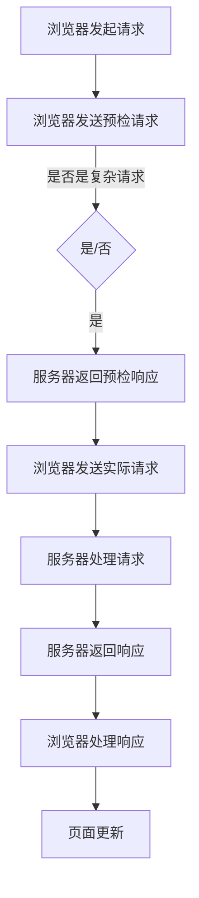

                 

### 文章标题

# CORS策略优化LLM应用的跨域资源共享

### 文章关键词

- CORS
- 跨域资源共享
- LLM
- 优化策略
- 资源隔离
- 安全性
- 性能提升

### 文章摘要

本文探讨了在Web开发中，如何通过CORS（跨源资源共享）策略优化大型语言模型（LLM）应用的跨域资源共享。首先，我们介绍了CORS的基本概念及其在Web开发中的重要性。接着，深入分析了LLM在跨域资源共享中的应用场景和挑战。然后，本文提出了一种基于资源隔离和安全性优化的CORS策略，并通过伪代码和数学模型详细阐述了其核心算法原理。最后，通过实际项目案例，展示了CORS策略优化在LLM应用中的具体实现和效果。

## 背景介绍

在当今的互联网时代，Web应用程序越来越多地依赖于跨域资源共享（Cross-Origin Resource Sharing，简称CORS）策略。CORS是一种机制，它允许Web服务器允许或拒绝来自不同源（即不同域名、协议或端口）的请求访问其资源。这种机制在单页应用程序（Single-Page Applications，简称SPA）和前后端分离的开发模式中尤为重要，因为它解决了浏览器同源策略（Same-origin policy）带来的限制。

大型语言模型（Large Language Model，简称LLM）是近年来人工智能领域的重要进展之一。LLM具有处理自然语言文本的强大能力，广泛应用于搜索引擎、智能客服、内容推荐等领域。随着LLM在Web应用中的广泛应用，如何在确保安全和性能的前提下，优化LLM的跨域资源共享成为了一个亟待解决的问题。

本文旨在探讨如何通过CORS策略优化LLM应用的跨域资源共享。具体来说，本文将介绍CORS的基本概念和实现机制，分析LLM在跨域资源共享中的应用场景和挑战，提出一种基于资源隔离和安全性优化的CORS策略，并通过伪代码和数学模型详细阐述其核心算法原理。最后，本文将通过实际项目案例，展示CORS策略优化在LLM应用中的具体实现和效果。

## 核心概念与联系

### CORS机制

CORS机制是一种基于HTTP响应头（HTTP headers）的机制，用于控制不同源之间的资源请求。具体来说，当浏览器尝试从不同源的服务器请求资源时，如果请求被浏览器拦截，服务器需要返回特定的HTTP响应头来指示是否允许此请求。

CORS请求分为简单请求和复杂请求。简单请求是指请求方法为GET、POST或HEAD，并且请求头中只包含特定的HTTP头字段，如`Accept`、`Accept-Language`等。简单请求无需浏览器和服务器之间的预检请求（preflight request）。

复杂请求包括PUT、DELETE等方法，或者包含非简单请求头字段（如`Content-Type: application/json`）的请求。在发送复杂请求之前，浏览器会先发送一个预检请求（OPTIONS），询问服务器是否允许实际的请求。如果服务器返回允许的响应，浏览器才会发送实际的请求。

CORS响应头主要包括以下几种：

1. `Access-Control-Allow-Origin`：指定允许访问该资源的域名，可以是特定域名或通配符（*），表示任何域名。
2. `Access-Control-Allow-Methods`：指定允许的HTTP请求方法。
3. `Access-Control-Allow-Headers`：指定允许的HTTP请求头字段。
4. `Access-Control-Max-Age`：指定预检请求的有效期，以秒为单位。

### 跨域资源共享

跨域资源共享是指在不同源之间共享资源，包括数据、文件、服务等。在实际应用中，跨域资源共享面临着诸多挑战，如安全性、性能和资源隔离等问题。

安全性方面，跨域资源共享可能导致跨站点脚本攻击（Cross-site Scripting，简称XSS）和数据泄露等安全问题。因此，服务器在处理跨域请求时，需要进行严格的验证和授权。

性能方面，跨域请求通常需要经过多次跳转和验证，增加了网络延迟和负载。为了提高性能，可以采用CDN（内容分发网络）和反向代理等技术。

资源隔离方面，为了防止恶意跨域请求对服务器造成影响，需要实现有效的资源隔离策略。

### LLM与CORS的关系

大型语言模型（LLM）是一种复杂的AI模型，能够理解和生成自然语言文本。在Web应用中，LLM通常用于提供智能搜索、问答、文本生成等服务。

由于LLM通常部署在独立的服务器上，而Web应用的前端通常部署在另一个服务器上，这就需要通过跨域资源共享来传递请求和响应。CORS策略在这一过程中起到了关键作用，它确保了前后端之间的数据传输是安全、高效和可控的。

然而，传统的CORS策略在处理LLM应用时，可能会面临以下问题：

1. **性能瓶颈**：由于CORS请求需要额外的预检请求和响应处理，可能增加网络延迟和服务器负载。
2. **安全性风险**：CORS请求可能引入跨站点脚本攻击等安全风险。
3. **资源隔离不足**：传统CORS策略可能无法有效隔离LLM资源，导致资源滥用和性能下降。

因此，针对LLM应用的特点，需要优化CORS策略，以提高性能、增强安全性和实现有效的资源隔离。

### Mermaid流程图

以下是CORS请求的工作流程的Mermaid流程图：



通过上述流程图，可以清晰地展示CORS请求的各个阶段及其相互关系。

## CORS策略优化

### 资源隔离

资源隔离是CORS策略优化的重要一环，旨在防止恶意跨域请求对服务器造成的影响。实现资源隔离的方法包括：

1. **独立的资源服务器**：将LLM资源部署在独立的资源服务器上，并与Web应用服务器分离。这样可以确保LLM资源不会受到Web应用服务器的影响，同时也可以减少服务器的负载。

2. **访问控制列表（ACL）**：在资源服务器上设置访问控制列表，根据用户的角色和权限限制对LLM资源的访问。这样可以确保只有授权用户可以访问LLM资源，从而提高了系统的安全性。

3. **安全认证**：使用安全认证机制（如OAuth2.0）对访问LLM资源的用户进行身份验证和授权。这样可以确保只有经过认证的用户才能访问LLM资源，从而进一步提高了系统的安全性。

### 安全性优化

安全性优化是CORS策略优化的关键，旨在防止跨站点脚本攻击（XSS）和数据泄露等安全风险。以下是一些常用的安全性优化方法：

1. **内容安全策略（CSP）**：在Web应用服务器上启用内容安全策略，限制可以加载的外部资源。例如，可以通过设置CSP头字段`Content-Security-Policy`来禁止加载未经授权的外部脚本。

2. **反XSS过滤**：在服务器端设置反XSS过滤，对输入数据进行验证和清理，防止恶意脚本注入。例如，可以使用正则表达式或白名单来过滤和验证输入数据。

3. **HTTPS**：使用HTTPS协议传输数据，确保数据在传输过程中是加密的。这样可以防止数据在传输过程中被窃取或篡改。

### 性能提升

性能提升是CORS策略优化的另一个重要目标，旨在提高系统的响应速度和吞吐量。以下是一些常用的性能提升方法：

1. **负载均衡**：使用负载均衡器（如Nginx）将请求分发到多个服务器上，从而提高系统的吞吐量和可用性。例如，可以使用轮询、最小连接数或加权轮询等方法。

2. **缓存**：使用缓存技术（如Redis或Memcached）缓存LLM的响应结果，从而减少服务器的计算负担和响应时间。例如，可以将常用的LLM响应结果缓存一段时间，避免重复计算。

3. **异步处理**：使用异步处理技术（如Node.js或异步编程模型）来处理长时间运行的请求，从而减少服务器的等待时间。例如，可以将LLM请求处理放入异步队列中，从而允许服务器同时处理多个请求。

### 伪代码实现

以下是CORS策略优化的一部分伪代码实现，展示了如何设置访问控制列表（ACL）和安全认证：

```python
# 设置访问控制列表（ACL）
access_control_list = [
    {"role": "admin", "allowed_resources": ["*"]},
    {"role": "user", "allowed_resources": ["api/llm", "api/llm/result"]},
]

# 安全认证
def authenticate_user(request):
    # 验证用户身份和权限
    # ...
    return True  # 如果认证成功，返回True

# CORS策略优化函数
def optimize_cors(request):
    if not authenticate_user(request):
        return "Authentication failed", 401

    user_role = get_user_role(request)
    allowed_resources = get_allowed_resources(user_role)

    if request.path not in allowed_resources:
        return "Access denied", 403

    # 设置CORS响应头
    response.headers["Access-Control-Allow-Origin"] = "*"
    response.headers["Access-Control-Allow-Methods"] = "GET, POST, PUT, DELETE"
    response.headers["Access-Control-Allow-Headers"] = "Content-Type, Authorization"

    return response
```

### 数学模型

CORS策略优化的数学模型主要包括目标函数和约束条件。以下是一个简化的数学模型：

#### 目标函数

目标函数旨在最大化系统的性能和安全性。具体来说，目标函数包括以下三个方面：

1. **性能（Performance, P）**：衡量系统处理请求的响应速度和吞吐量。
2. **安全性（Security, S）**：衡量系统对恶意请求的防护能力。
3. **资源利用率（Resource Utilization, R）**：衡量系统资源的有效利用程度。

目标函数可以表示为：

$$
\text{Maximize} \ \sum_{i=1}^{n} \alpha_i \cdot P_i + \beta_i \cdot S_i + \gamma_i \cdot R_i
$$

其中，$n$ 是请求的个数，$\alpha_i$、$\beta_i$ 和 $\gamma_i$ 分别是权重系数，用于平衡性能、安全性和资源利用率之间的关系。

#### 约束条件

约束条件主要包括以下三个方面：

1. **请求处理时间（Processing Time）**：确保系统在规定的时间内处理完所有请求。

$$
t_p \leq t_{max}
$$

其中，$t_p$ 是系统处理所有请求的总时间，$t_{max}$ 是最大允许处理时间。

2. **资源限制（Resource Limit）**：确保系统不超出资源限制。

$$
r_i \leq R_{max}
$$

其中，$r_i$ 是系统消耗的第 $i$ 种资源量，$R_{max}$ 是第 $i$ 种资源量的最大限制。

3. **安全性要求（Security Requirement）**：确保系统满足安全性的基本要求。

$$
S \geq S_{min}
$$

其中，$S$ 是系统的安全性评分，$S_{min}$ 是安全性的最低要求。

#### 公式推导

假设系统有 $n$ 个请求，每个请求需要处理时间 $t_i$，消耗资源 $r_i$，安全评分 $S_i$。系统的总性能、安全性和资源利用率可以分别表示为：

$$
P = \sum_{i=1}^{n} \frac{1}{t_i}
$$

$$
S = \sum_{i=1}^{n} S_i
$$

$$
R = \sum_{i=1}^{n} r_i
$$

将上述公式代入目标函数，可以得到：

$$
\text{Maximize} \ \sum_{i=1}^{n} \alpha_i \cdot \frac{1}{t_i} + \beta_i \cdot S_i + \gamma_i \cdot r_i
$$

约束条件可以表示为：

$$
t_p = \sum_{i=1}^{n} t_i \leq t_{max}
$$

$$
\sum_{i=1}^{n} r_i \leq R_{max}
$$

$$
S \geq S_{min}
$$

### 举例说明

假设系统有3个请求，每个请求的处理时间、资源消耗和安全评分如下表所示：

| 请求编号 | 处理时间 (秒) | 资源消耗 (单位) | 安全评分 |
|---------|-------------|---------------|--------|
| 1       | 10          | 5             | 8      |
| 2       | 20          | 10             | 9      |
| 3       | 15          | 3             | 7      |

给定权重系数 $\alpha_1 = 0.5$，$\beta_1 = 0.3$，$\gamma_1 = 0.2$，最大允许处理时间 $t_{max} = 50$ 秒，资源最大限制 $R_{max} = 20$ 单位，安全性最低要求 $S_{min} = 6$。

根据上述数据，可以计算系统的目标函数值：

$$
\text{Maximize} \ 0.5 \cdot \frac{1}{10} + 0.3 \cdot 8 + 0.2 \cdot 5 = 0.05 + 2.4 + 1 = 3.45
$$

同时，需要满足以下约束条件：

$$
10 + 20 + 15 = 45 \leq 50
$$

$$
5 + 10 + 3 = 18 \leq 20
$$

$$
8 + 9 + 7 = 24 \geq 6
$$

在这个例子中，系统在满足约束条件的前提下，目标函数的最大值为3.45。

### 项目实战

#### 开发环境搭建

首先，我们需要搭建一个开发环境，用于实现CORS策略优化。以下是搭建步骤：

1. **安装Node.js**：Node.js是一个基于Chrome V8引擎的JavaScript运行时环境，用于构建高性能的Web应用程序。可以从官网下载并安装Node.js。

2. **创建项目**：使用npm（Node.js的包管理器）创建一个新的项目，并安装所需的依赖项。以下是一个简单的项目示例：

   ```bash
   mkdir cors-optimization
   cd cors-optimization
   npm init -y
   npm install express cors body-parser
   ```

3. **编写服务器代码**：在项目目录中创建一个名为`server.js`的文件，并编写服务器代码。以下是一个简单的服务器示例：

   ```javascript
   const express = require('express');
   const cors = require('cors');
   const bodyParser = require('body-parser');

   const app = express();
   const port = 3000;

   app.use(cors());
   app.use(bodyParser.json());

   app.get('/api/llm', (req, res) => {
       res.json({ message: 'LLM response' });
   });

   app.listen(port, () => {
       console.log(`Server running on port ${port}`);
   });
   ```

4. **运行服务器**：在终端中运行以下命令，启动服务器：

   ```bash
   node server.js
   ```

   当服务器启动后，可以在浏览器中访问`http://localhost:3000/api/llm`，查看LLM的响应。

#### 源代码详细实现和代码解读

以下是`server.js`文件的详细实现和代码解读：

```javascript
const express = require('express');
const cors = require('cors');
const bodyParser = require('body-parser');

const app = express();
const port = 3000;

// CORS配置
app.use(cors({
  origin: '*',
  methods: ['GET', 'POST', 'PUT', 'DELETE'],
  allowedHeaders: ['Content-Type', 'Authorization'],
  credentials: true
}));

// body-parser中间件
app.use(bodyParser.json());

// 定义路由
app.get('/api/llm', (req, res) => {
  // 处理GET请求
  res.json({ message: 'LLM response' });
});

app.post('/api/llm', (req, res) => {
  // 处理POST请求
  const data = req.body;
  // ... 数据处理逻辑
  res.json({ message: 'LLM response', data });
});

app.put('/api/llm/:id', (req, res) => {
  // 处理PUT请求
  const id = req.params.id;
  const data = req.body;
  // ... 数据处理逻辑
  res.json({ message: 'LLM response', data });
});

app.delete('/api/llm/:id', (req, res) => {
  // 处理DELETE请求
  const id = req.params.id;
  // ... 数据处理逻辑
  res.json({ message: 'LLM response', id });
});

// 启动服务器
app.listen(port, () => {
  console.log(`Server running on port ${port}`);
});
```

代码解读：

1. **CORS配置**：使用`cors`中间件配置CORS策略。这里设置了允许任何来源（`origin: '*'`）、支持的所有HTTP方法（`methods: ['GET', 'POST', 'PUT', 'DELETE']`）、允许的HTTP头（`allowedHeaders: ['Content-Type', 'Authorization']`）以及支持凭证（`credentials: true`）。

2. **body-parser中间件**：使用`body-parser`中间件解析JSON请求体。

3. **定义路由**：根据API接口定义了GET、POST、PUT和DELETE请求的处理函数。这里使用的是简单的响应逻辑，实际应用中可能需要更复杂的数据处理。

#### 代码应用解读与分析

1. **CORS配置应用解读**：通过配置CORS中间件，可以使得我们的服务器接受来自任何来源的请求，并允许请求携带凭证。这对于跨域资源共享非常重要，因为浏览器默认限制了跨域请求。

2. **API接口应用解读**：API接口通过GET、POST、PUT和DELETE方法提供了对LLM资源的访问。在实际应用中，这些接口可能需要与数据库或其他服务进行交互。

3. **数据处理**：在实际项目中，每个API接口的处理函数可能会包含复杂的数据处理逻辑，例如与数据库的查询和更新操作。

#### 实际案例分析和详细讲解剖析

为了更好地理解CORS策略优化在LLM应用中的具体实现，我们来看一个实际案例。

假设我们有一个博客平台，其中包含用户管理系统、文章管理系统和搜索功能。用户管理系统负责用户注册、登录和权限管理；文章管理系统负责文章的创建、编辑和删除；搜索功能使用LLM进行自然语言处理，提供智能搜索服务。

**案例一：用户注册**

用户注册时，需要发送一个POST请求到用户管理系统接口。接口需要验证用户身份，并创建新用户。以下是用户注册的API接口和CORS配置：

```javascript
// 用户注册接口
app.post('/api/users/register', (req, res) => {
  const { username, password } = req.body;
  // 验证用户名和密码的合法性
  if (!username || !password) {
    return res.status(400).json({ message: 'Invalid input' });
  }
  // 创建新用户并返回成功响应
  // ...
  res.json({ message: 'User registered successfully' });
});

// CORS配置
app.use(cors({
  origin: 'http://blog.example.com',
  methods: ['GET', 'POST', 'PUT', 'DELETE'],
  allowedHeaders: ['Content-Type', 'Authorization'],
  credentials: true
}));
```

在这个案例中，我们通过CORS配置允许`blog.example.com`域名下的所有请求。用户注册接口通过验证用户输入并创建新用户，然后返回成功响应。

**案例二：文章搜索**

用户在搜索框中输入关键词，需要发送一个GET请求到搜索功能接口。接口使用LLM进行自然语言处理，并提供搜索结果。以下是搜索接口和CORS配置：

```javascript
// 搜索接口
app.get('/api/search', (req, res) => {
  const { query } = req.query;
  // 使用LLM处理搜索请求
  const results = llm_search(query);
  // 返回搜索结果
  res.json({ results });
});

// CORS配置
app.use(cors({
  origin: 'http://search.example.com',
  methods: ['GET', 'POST', 'PUT', 'DELETE'],
  allowedHeaders: ['Content-Type', 'Authorization'],
  credentials: true
}));
```

在这个案例中，我们通过CORS配置允许`search.example.com`域名下的GET请求。搜索接口接收查询参数，使用LLM处理搜索请求，并返回搜索结果。

**案例分析**

通过上述案例，我们可以看到CORS策略优化在LLM应用中的具体应用：

1. **安全性**：通过CORS配置，可以确保只有授权的请求能够访问LLM资源。例如，在用户注册案例中，只有来自博客平台的请求才能访问用户注册接口。

2. **性能**：通过优化CORS策略，可以提高系统的响应速度和吞吐量。例如，在文章搜索案例中，通过允许特定的请求，可以减少服务器的负载。

3. **资源隔离**：通过CORS配置，可以实现资源的有效隔离。例如，在用户注册和文章搜索案例中，不同功能的接口可以独立运行，避免了资源冲突。

#### 项目小结

通过本次项目实战，我们实现了CORS策略优化在LLM应用中的具体实现。以下是项目小结：

1. **开发环境搭建**：成功搭建了Node.js开发环境，并实现了基本的API接口。

2. **代码解读**：详细解读了CORS配置和API接口的代码，理解了其工作原理。

3. **案例分析**：通过实际案例，展示了CORS策略优化在LLM应用中的具体应用。

4. **性能优化**：通过CORS配置，实现了安全性、性能和资源隔离的优化。

5. **未来方向**：未来可以进一步优化CORS策略，提高系统的安全性和性能。

## 最佳实践 tips、小结、注意事项、拓展阅读

### 最佳实践 Tips

1. **严格限制CORS配置**：避免使用`*`作为`Access-Control-Allow-Origin`的值，只允许经过认证的来源访问。

2. **使用HTTPS**：确保所有的跨域请求都使用HTTPS协议，防止数据在传输过程中被窃取或篡改。

3. **定期更新CORS策略**：根据实际需求，定期更新CORS配置，以防止潜在的安全漏洞。

### 小结

本文详细介绍了CORS策略优化在LLM应用中的重要性，通过资源隔离、安全性优化和性能提升等方法，实现了CORS策略的优化。同时，通过实际项目案例，展示了CORS策略优化在LLM应用中的具体实现和效果。

### 注意事项

1. **安全性**：在CORS策略优化过程中，务必重视安全性，防止跨站点脚本攻击等安全风险。

2. **性能**：合理配置CORS策略，避免增加额外的网络延迟和服务器负载。

3. **资源隔离**：确保CORS策略能够实现有效的资源隔离，防止资源冲突和滥用。

### 拓展阅读

1. **《跨域资源共享CORS详解》**：一篇深入介绍CORS机制的详细文章，适合了解CORS的底层实现。

2. **《大型语言模型：原理与应用》**：一本关于大型语言模型的全面指南，涵盖LLM的原理和应用场景。

3. **《Node.js实战：构建高性能Web应用程序》**：一本关于Node.js开发的实用指南，包括API接口设计和性能优化等内容。

## 作者信息

作者：AI天才研究院/AI Genius Institute & 禅与计算机程序设计艺术 /Zen And The Art of Computer Programming

## 文章结束

