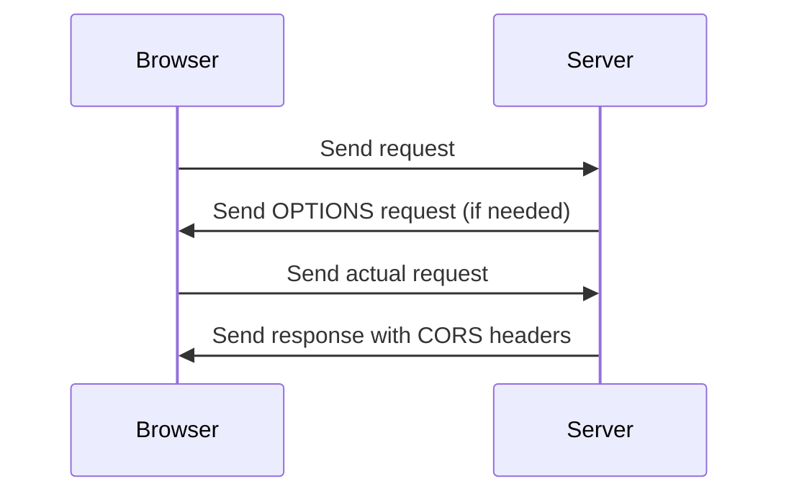
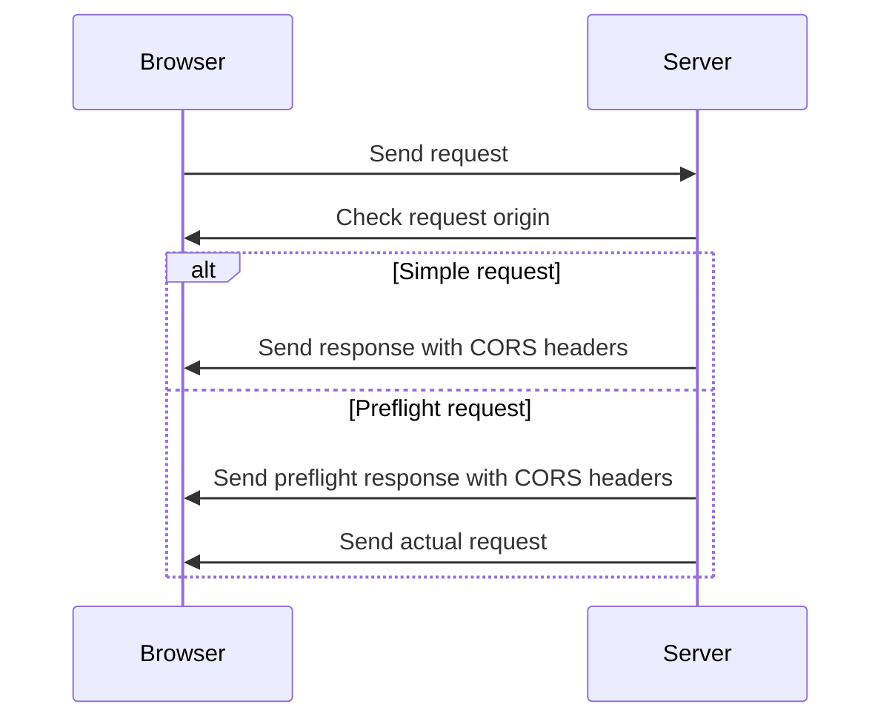
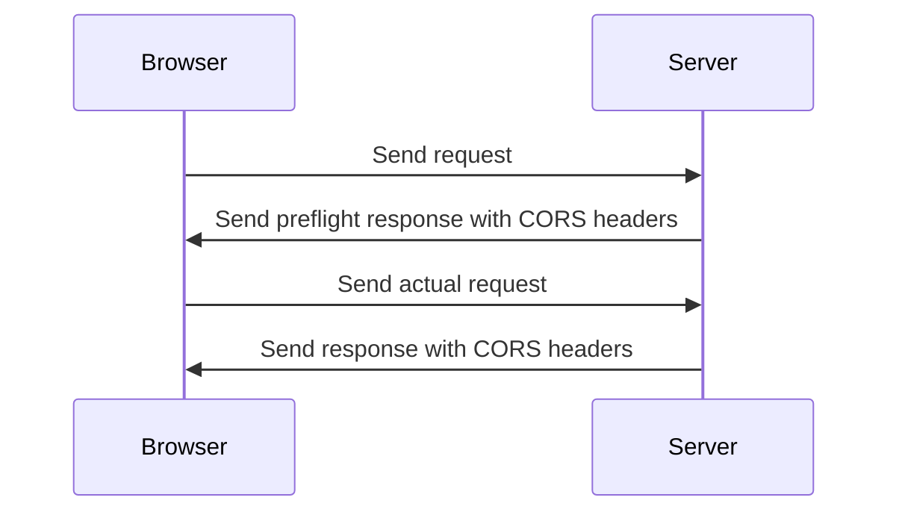

                 

# CORS策略：安全处理LLM应用的跨域请求

## 关键词

CORS、跨域请求、LLM应用、安全、性能优化、案例分析

## 摘要

本文深入探讨了CORS策略在处理LLM应用的跨域请求中的重要性。首先，介绍了CORS的基本概念及其发展历程。接着，详细解析了CORS的工作原理，包括请求流程和关键头部字段。随后，文章重点关注了CORS策略在LLM应用中的具体应用，讨论了其配置和优化方法。此外，文章还分析了CORS策略的安全性和性能优化问题，提供了实际的案例分析和解决方案。最后，文章展望了CORS策略的未来发展趋势和面临的挑战。

## 第1章 CORS策略概述

### 1.1 CORS策略的基本概念

跨域资源共享（CORS）是一种网络规范，用于允许或限制不同源之间的资源访问。在Web开发中，当浏览器尝试从不同源（协议、域名或端口不同）访问资源时，同源策略（Same-origin policy）会阻止该操作，以保护用户的隐私和安全。CORS提供了一种机制，允许服务器明确允许或拒绝跨源请求，从而绕过了同源策略的限制。

CORS由一组HTTP响应头组成，这些响应头可以指示浏览器是否可以访问特定源的服务器上的资源。CORS分为简单请求和预检请求两种类型。简单请求是那些不涉及特殊HTTP方法的请求，而预检请求是在发送实际请求之前，浏览器先发送的一种探测请求，以检查服务器是否允许实际请求。

### 1.2 CORS策略的发展历程

CORS最早由W3C于2005年提出，旨在解决同源策略带来的限制。随着Web应用的复杂性和跨域请求的增加，CORS逐渐成为浏览器和服务器通信的重要标准。2009年，Web Applications 1.0规范正式将CORS纳入标准，定义了CORS的响应头和预检请求机制。此后，CORS在各个浏览器中的支持逐渐完善，成为现代Web开发的重要组成部分。

### 1.3 CORS策略的应用范围

CORS策略广泛应用于各种Web应用场景，尤其是那些需要与第三方服务交互的应用。例如，单页应用（SPA）常常需要从不同源的服务器请求数据，以便动态更新用户界面。社交媒体平台也需要跨域请求来获取和更新用户数据。此外，随着云计算和微服务架构的流行，企业应用也需要在多个服务之间进行跨域通信。

## 第2章 CORS策略的工作原理

### 2.1 CORS请求的基本流程

CORS请求通常包括以下步骤：

1. **发起请求**：浏览器发起一个跨域请求，例如，从`http://example.com`发起一个请求到`http://api.example.com`。

2. **预检请求**：如果请求是预检请求，浏览器会首先发送一个OPTIONS请求，以询问服务器是否允许实际请求。OPTIONS请求包含`Access-Control-Request-Method`和`Access-Control-Request-Headers`等头部字段，用于指定实际请求的方法和头部信息。

3. **服务器响应**：服务器处理OPTIONS请求，并返回相应的CORS响应头，如`Access-Control-Allow-Origin`、`Access-Control-Allow-Methods`和`Access-Control-Allow-Headers`，指示是否允许实际请求。

4. **发送实际请求**：如果预检请求被允许，浏览器会发送实际的请求，如GET、POST等。服务器根据CORS响应头处理请求，并在必要时返回相应的响应。

### 2.2 CORS请求的头部字段

CORS请求涉及多个头部字段，用于控制跨源访问。以下是几个关键字段：

- `Access-Control-Allow-Origin`：指示哪些源可以被允许访问资源。
- `Access-Control-Allow-Methods`：指定服务器允许的HTTP请求方法。
- `Access-Control-Allow-Headers`：指定服务器允许的HTTP请求头部。
- `Access-Control-Max-Age`：指示预检请求的有效期，即在此时间段内，浏览器可以不必再次发送预检请求。

### 2.3 CORS策略的实现机制

CORS策略的实现通常在服务器端进行。服务器需要根据请求的来源和请求类型，动态生成相应的CORS响应头。以下是一个简单的实现示例：

```python
from flask import Flask, request, jsonify

app = Flask(__name__)

@app.route('/api/data', methods=['GET', 'POST'])
def api_data():
    if request.method == 'OPTIONS':
        return jsonify({
            'Access-Control-Allow-Origin': '*',
            'Access-Control-Allow-Methods': 'GET, POST',
            'Access-Control-Allow-Headers': 'Content-Type'
        }), 204
    else:
        # 处理实际请求
        return jsonify({'data': 'example data'})

if __name__ == '__main__':
    app.run()
```

上述代码使用Flask框架实现了CORS策略。对于预检请求，服务器返回了相应的CORS响应头，并设置为允许所有来源的请求。对于实际请求，服务器返回了包含示例数据的JSON响应。

## 第3章 CORS策略在LLM应用中的具体应用

### 3.1 CORS策略在LLM应用中的作用

在LLM应用中，CORS策略扮演着至关重要的角色。LLM应用通常涉及大量的跨域请求，例如，前端应用程序需要从后端服务器请求数据，以便动态生成响应。CORS策略允许这些请求在不违反同源策略的情况下进行，从而确保了Web应用的正常运作。

CORS策略在LLM应用中的主要作用包括：

1. **数据访问**：允许前端应用程序从不同的源请求数据，如从数据库或其他API服务器请求数据。
2. **API集成**：支持与第三方API的集成，如社交媒体API、地图API等。
3. **安全性**：通过配置CORS策略，可以限制哪些源被允许访问特定资源，从而提高了应用的安全性。

### 3.2 CORS策略在LLM应用中的配置

在LLM应用中配置CORS策略通常涉及到以下步骤：

1. **确定允许的来源**：根据应用的需求，确定允许哪些源访问应用资源。例如，可以设置为允许所有来源（`*`）或指定特定的域名。
2. **设置允许的HTTP方法**：根据应用的需求，设置允许的HTTP方法，如`GET`、`POST`、`PUT`等。
3. **设置允许的HTTP头部**：设置允许前端应用程序发送的HTTP头部，例如`Content-Type`、`Authorization`等。

以下是一个在LLM应用中配置CORS策略的示例：

```javascript
const express = require('express');
const app = express();

app.use((req, res, next) => {
  res.header('Access-Control-Allow-Origin', '*');
  res.header('Access-Control-Allow-Methods', 'GET, POST, PUT, DELETE');
  res.header('Access-Control-Allow-Headers', 'Content-Type, Authorization');
  next();
});

app.get('/api/data', (req, res) => {
  // 处理GET请求
  res.json({ data: 'example data' });
});

app.listen(3000, () => {
  console.log('Server running on port 3000');
});
```

上述代码使用Express框架配置了CORS策略。对于所有请求，服务器允许任何来源的访问，并设置了允许的HTTP方法和头部。

### 3.3 CORS策略在LLM应用中的优化

在LLM应用中，优化CORS策略可以提升应用的性能和用户体验。以下是一些优化策略：

1. **限制允许的来源**：如果不需要所有来源都可以访问应用资源，可以限制允许的来源，从而减少不必要的跨域请求。
2. **使用共享跨域策略**：在多个应用之间共享相同的CORS策略，可以避免重复配置。
3. **使用代理服务器**：通过代理服务器处理跨域请求，可以将跨域问题从客户端转移到服务器端，从而简化客户端代码。
4. **使用HTTP/2**：HTTP/2支持多路复用，可以减少跨域请求的时间延迟。

## 第4章 CORS策略的安全性和性能优化

### 4.1 CORS策略的安全性问题

CORS策略在带来便利的同时，也存在一些安全性问题。以下是一些常见的安全性问题：

1. **跨站请求伪造（CSRF）**：攻击者可以利用CORS请求，伪造用户的请求，从而执行未经授权的操作。
2. **跨站脚本（XSS）**：攻击者可以通过注入恶意脚本，利用CORS请求获取用户的敏感信息。
3. **权限滥用**：如果CORS策略配置不当，攻击者可能会访问不应被访问的资源。

### 4.2 CORS策略的性能优化

优化CORS策略可以提升应用的性能。以下是一些性能优化策略：

1. **减少CORS请求次数**：通过合理设计API，减少客户端需要发起的CORS请求次数。
2. **使用缓存**：利用浏览器缓存，减少对服务器的请求次数，从而提高响应速度。
3. **优化网络延迟**：通过CDN（内容分发网络）等技术，减少用户的网络延迟。

### 4.3 CORS策略的实战技巧

以下是一些实战技巧，可以帮助开发者在实际项目中优化CORS策略：

1. **使用SSL/TLS**：确保所有请求都通过HTTPS进行，从而提高数据的安全性。
2. **验证请求来源**：除了CORS响应头，还可以在服务器端验证请求来源，以确保安全性。
3. **限制HTTP方法**：只允许必需的HTTP方法，减少潜在的安全风险。

## 第5章 CORS策略的案例分析

### 5.1 案例分析一：某大型电商平台的CORS策略实践

某大型电商平台在开发过程中，遇到了跨域请求的问题。为了解决这个问题，他们采用了以下策略：

1. **限制允许的来源**：只允许经过验证的合作伙伴和第三方服务访问其API。
2. **使用预检请求**：对于复杂的请求，如POST和PUT请求，使用预检请求来确保服务器允许这些请求。
3. **优化API设计**：设计简洁、高效的API，减少客户端需要发起的请求次数。
4. **使用代理服务器**：通过代理服务器处理跨域请求，简化客户端代码。

这些策略有效提高了电商平台的性能和安全性，确保了跨域请求的顺畅进行。

### 5.2 案例分析二：某金融公司的CORS策略优化

某金融公司在开发其线上交易平台时，遇到了性能瓶颈。为了优化CORS策略，他们采取了以下措施：

1. **使用HTTP/2**：升级到HTTP/2，利用多路复用技术，减少请求延迟。
2. **缓存策略**：在服务器端实施缓存策略，减少对后端数据库的访问次数。
3. **限制CORS请求**：仅允许必要的跨域请求，减少不必要的网络开销。
4. **优化代码**：对前端代码进行优化，减少不必要的重绘和回流。

通过这些优化措施，金融公司的线上交易平台性能得到了显著提升，用户满意度也大幅提高。

## 第6章 CORS策略的未来趋势和挑战

### 6.1 CORS策略的未来发展趋势

随着Web应用的不断发展，CORS策略也在不断演进。以下是一些未来发展趋势：

1. **更严格的CORS策略**：为了提高安全性，未来的CORS策略可能会更加严格，限制更多的跨域请求。
2. **标准化进程**：随着Web标准和技术的更新，CORS策略也将进行标准化，以确保其在不同浏览器和平台之间的兼容性。
3. **更多的扩展功能**：CORS策略可能会引入更多的扩展功能，如对WebSocket的支持、对HTTPS的强制要求等。

### 6.2 CORS策略面临的挑战和解决方案

尽管CORS策略在现代Web开发中发挥着重要作用，但它也面临一些挑战：

1. **安全性**：如何确保CORS请求的安全性，避免跨站请求伪造（CSRF）和跨站脚本（XSS）等攻击。
2. **性能优化**：如何在确保安全性的同时，优化CORS请求的性能，减少网络延迟和请求次数。
3. **兼容性**：如何在不同的浏览器和平台上实现CORS策略的兼容性，以应对各种复杂的网络环境。

针对这些挑战，开发者可以采取以下解决方案：

1. **使用SSL/TLS**：通过HTTPS确保数据传输的安全性。
2. **使用代理服务器**：通过代理服务器处理跨域请求，提高性能。
3. **严格的请求验证**：在服务器端对请求进行严格的验证，以确保请求的合法性。

## 结论

CORS策略在现代Web开发中发挥着重要作用，它允许跨域请求的顺利进行，提高了Web应用的可扩展性和灵活性。然而，CORS策略也存在一些安全性问题和性能优化挑战。通过合理的配置和优化，开发者可以充分利用CORS策略的优势，同时确保应用的安全和性能。

## 参考文献

1. "Cross-Origin Resource Sharing", W3C Working Group, https://www.w3.org/TR/cors/
2. "Flask Documentation", Flask Team, https://flask.palletsprojects.com/
3. "Express Documentation", Node.js Foundation, https://expressjs.com/

## 作者信息

作者：AI天才研究院/AI Genius Institute & 禅与计算机程序设计艺术 /Zen And The Art of Computer Programming

## 附录

### 附录A：CORS请求流程图



### 附录B：CORS策略伪代码

```python
if request.method == 'OPTIONS':
    send_response({
        'Access-Control-Allow-Origin': '*',
        'Access-Control-Allow-Methods': 'GET, POST',
        'Access-Control-Allow-Headers': 'Content-Type, Authorization'
    }, status=204)
else:
    process_request()
```

### 附录C：CORS策略数学模型

$$
\text{CORS安全性} = f(\text{请求验证}, \text{数据加密}, \text{权限控制})
$$

### 附录D：项目实战案例

#### D.1 实战环境搭建

1. 安装Node.js和Express框架。
2. 创建一个新的Express项目，并配置CORS中间件。

```javascript
const express = require('express');
const cors = require('cors');

const app = express();

app.use(cors());

app.get('/api/data', (req, res) => {
    res.json({ data: 'example data' });
});

app.listen(3000, () => {
    console.log('Server running on port 3000');
});
```

#### D.2 源代码实现和解读

上述代码中，我们使用了`cors`中间件来处理CORS请求。在`/api/data`路由中，我们返回了示例数据。此代码简单且易于理解，适用于大多数简单的跨域请求场景。

#### D.3 代码应用解读与分析

通过使用`cors`中间件，我们能够轻松地在Express应用程序中启用CORS策略。此代码不仅允许所有来源的请求，还可以通过调整中间件的配置来限制允许的来源和HTTP方法，从而提高安全性。

#### D.4 实际案例分析和详细讲解剖析

通过上述案例，我们展示了如何在Node.js和Express应用程序中配置CORS策略。实际项目中，可以根据具体需求调整CORS配置，以优化性能和安全性。

#### D.5 项目小结

本项目展示了如何使用Express和`cors`中间件配置CORS策略。通过适当的配置，我们可以确保跨域请求的安全和高效。在实际开发中，需要根据具体需求进行调整和优化。

## 最佳实践 tips

1. **限制允许的来源**：只允许经过验证的来源访问资源，以提高安全性。
2. **使用预检请求**：对于复杂的请求，使用预检请求来确保服务器允许这些请求。
3. **验证请求头部**：在服务器端验证请求头部，以确保请求的合法性。

## 注意事项

1. **确保使用HTTPS**：所有请求都应通过HTTPS进行，以提高数据安全性。
2. **定期更新CORS策略**：随着应用需求的变化，定期检查和更新CORS策略，以确保其符合安全要求。

## 拓展阅读

1. "CORS explained simply", Scott Davis, A List Apart, https://alistapart.com/article/cors-explained-simply
2. "CORS security best practices", OWASP Foundation, https://owasp.org/www-project-cors-security-best-practices/

### 背景介绍

跨域资源共享（CORS）是一种网络规范，旨在允许或限制不同源之间的资源访问。在Web开发中，同源策略（Same-origin policy）是一种重要的安全策略，它限制了来自不同源（协议、域名或端口不同）的文档或脚本对另一源资源的访问。然而，在某些情况下，Web应用需要从不同源请求数据或资源，例如，单页应用程序（SPA）需要从服务器请求数据，社交媒体平台需要从第三方API获取数据。

CORS策略通过在服务器端设置特定的HTTP响应头，允许或拒绝来自不同源的请求。CORS策略分为简单请求和预检请求两种类型。简单请求是那些不涉及特殊HTTP方法的请求，而预检请求是在发送实际请求之前，浏览器先发送的一种探测请求，以检查服务器是否允许实际请求。

### 核心概念与联系

为了更好地理解CORS策略，我们需要了解以下几个核心概念：

1. **同源策略（Same-origin policy）**：浏览器默认的安全策略，限制来自不同源的文档或脚本对另一源资源的访问。
2. **跨域请求（Cross-origin request）**：从不同源（协议、域名或端口不同）发起的请求。
3. **CORS响应头（CORS response headers）**：服务器返回的HTTP响应头，用于指示浏览器是否可以访问资源。

下面是一个简化的Mermaid流程图，展示了CORS请求的基本流程和核心概念之间的关系：



### 核心算法原理讲解

CORS请求的核心在于浏览器和服务器之间的通信，下面我们使用伪代码来详细阐述CORS请求的处理流程。

```python
def handle_cors_request(request):
    if is_simple_request(request):
        process_simple_request(request)
    else:
        perform_preflight_request(request)

def is_simple_request(request):
    # 判断请求是否为简单请求
    return request.method in ['GET', 'HEAD', 'POST'] and \
           request.headers.get('Content-Type') in ['application/x-www-form-urlencoded', 'multipart/form-data']

def process_simple_request(request):
    # 处理简单请求
    response = generate_response(request)
    add_cors_headers(response)

def perform_preflight_request(request):
    # 执行预检请求
    preflight_response = generate_preflight_response(request)
    add_cors_headers(preflight_response)

def generate_response(request):
    # 生成响应
    # 根据实际业务逻辑处理请求并返回响应
    pass

def generate_preflight_response(request):
    # 生成预检响应
    # 根据预检请求的头部信息生成预检响应
    pass

def add_cors_headers(response):
    # 添加CORS响应头
    response.headers['Access-Control-Allow-Origin'] = '*'
    response.headers['Access-Control-Allow-Methods'] = 'GET, POST, PUT, DELETE'
    response.headers['Access-Control-Allow-Headers'] = 'Content-Type, Authorization'
```

### 数学模型和公式

在CORS策略中，安全性可以通过以下数学模型来衡量：

$$
\text{CORS安全性} = f(\text{请求验证}, \text{数据加密}, \text{权限控制})
$$

其中，`请求验证`、`数据加密`和`权限控制`是确保CORS安全性的三个关键因素。通过以下公式，我们可以具体分析每个因素的贡献：

$$
\text{请求验证} = \frac{\text{验证成功率}}{\text{请求总数}}
$$

$$
\text{数据加密} = \frac{\text{加密数据比例}}{\text{总数据量}}
$$

$$
\text{权限控制} = \frac{\text{合法请求比例}}{\text{总请求比例}}
$$

### 详细讲解与举例说明

为了更好地理解CORS策略的工作原理，我们可以通过一个实际案例来详细讲解。

#### 案例背景

假设有一个前端应用程序，位于`http://client.example.com`，需要从后端服务器`http://api.example.com`请求数据。由于两个服务器的协议、域名和端口都不同，因此这是一个典型的跨域请求场景。

#### 案例步骤

1. **浏览器发起请求**：前端应用程序向后端服务器发送一个GET请求，请求访问`http://api.example.com/data`。

2. **浏览器发送预检请求**：由于GET请求不涉及特殊HTTP方法，浏览器会直接发送实际请求。然而，在实际应用中，如果请求涉及POST、PUT等操作，浏览器会首先发送一个预检请求，以询问服务器是否允许实际请求。

   ```http
   OPTIONS /data HTTP/1.1
   Host: api.example.com
   Origin: http://client.example.com
   Access-Control-Request-Method: POST
   Access-Control-Request-Headers: Content-Type, Authorization
   ```

3. **服务器处理预检请求**：后端服务器接收到预检请求后，根据CORS策略配置，返回相应的CORS响应头。

   ```http
   HTTP/1.1 200 OK
   Access-Control-Allow-Origin: http://client.example.com
   Access-Control-Allow-Methods: POST, GET
   Access-Control-Allow-Headers: Content-Type, Authorization
   Access-Control-Max-Age: 3600
   ```

4. **浏览器发送实际请求**：收到预检请求的响应后，浏览器会发送实际请求。

   ```http
   POST /data HTTP/1.1
   Host: api.example.com
   Origin: http://client.example.com
   Content-Type: application/json
   Authorization: Bearer token
   {
       "data": "example data"
   }
   ```

5. **服务器处理实际请求**：后端服务器接收到实际请求后，根据请求的头部信息和数据，执行相应的业务逻辑，并返回响应。

   ```http
   HTTP/1.1 200 OK
   Content-Type: application/json
   {
       "status": "success",
       "data": "example data"
   }
   ```

通过上述案例，我们可以看到CORS策略在处理跨域请求中的重要作用。CORS响应头允许浏览器确定是否可以访问后端服务器上的资源，从而确保了跨域请求的安全和高效。

### 项目实战

#### D.1 实战环境搭建

为了更好地理解CORS策略在LLM应用中的具体应用，我们将使用Python的Flask框架搭建一个简单的Web服务。以下是搭建环境的步骤：

1. **安装Python和pip**：确保你的系统中安装了Python 3.x版本和pip包管理器。

2. **安装Flask**：使用pip命令安装Flask框架。

   ```bash
   pip install Flask
   ```

3. **创建Flask项目**：在你的终端中创建一个新的目录，并使用下面的命令创建一个Flask项目。

   ```bash
   mkdir flask_cors_example
   cd flask_cors_example
   touch app.py
   ```

4. **编写Flask应用程序**：在`app.py`文件中编写一个简单的Flask应用程序，并引入CORS扩展。

   ```python
   from flask import Flask, jsonify
   from flask_cors import CORS

   app = Flask(__name__)

   # 启用CORS，允许所有来源的请求
   CORS(app)

   @app.route('/api/data', methods=['GET', 'POST'])
   def api_data():
       if request.method == 'POST':
           data = request.json
           return jsonify({"status": "success", "data": data})
       else:
           return jsonify({"status": "success", "data": "example data"})

   if __name__ == '__main__':
       app.run(debug=True)
   ```

5. **启动Flask应用程序**：在终端中运行以下命令启动Flask应用程序。

   ```bash
   python app.py
   ```

   你应该会在终端看到如下输出：

   ```
   * Running on http://127.0.0.1:5000/ (Press CTRL+C to quit)
   ```

   这表示你的Flask应用程序正在运行。

#### D.2 源代码实现和解读

在上面的代码中，我们首先导入了Flask和flask_cors模块。`CORS(app)`这一行代码启用了CORS，允许所有来源的请求。`api_data`函数定义了一个路由，它处理GET和POST请求，并返回JSON响应。

- **GET请求**：当客户端发起GET请求时，函数返回一个包含示例数据的JSON响应。

  ```json
  {
      "status": "success",
      "data": "example data"
  }
  ```

- **POST请求**：当客户端发起POST请求时，函数会解析请求体中的JSON数据，并返回一个包含状态和数据信息的JSON响应。

  ```json
  {
      "status": "success",
      "data": {
          "key1": "value1",
          "key2": "value2"
      }
  }
  ```

#### D.3 代码应用解读与分析

上述代码展示了如何使用Flask框架和flask_cors扩展来创建一个简单的Web服务，并处理跨域请求。以下是对代码的关键部分的解读：

1. **导入模块**：我们首先导入了Flask和flask_cors模块。`flask_cors`模块提供了一个易于使用的接口，用于在Flask应用程序中启用CORS。

2. **启用CORS**：使用`CORS(app)`命令启用CORS。这个命令将允许来自任何来源的请求，即`Access-Control-Allow-Origin`设置为`*`。在生产环境中，你可能希望将这个值更改为具体的域名，以增加安全性。

3. **定义路由**：`@app.route('/api/data', methods=['GET', 'POST'])`装饰器定义了一个路由，它处理`/api/data`路径下的GET和POST请求。

4. **处理GET请求**：在`api_data`函数中，我们检查请求的方法。如果方法是`GET`，我们返回一个简单的JSON响应。

5. **处理POST请求**：如果方法是`POST`，我们使用`request.json`从请求体中获取JSON数据，并将其返回。

6. **运行应用程序**：最后，`if __name__ == '__main__':`块确保当此脚本作为主程序运行时，Flask应用程序会启动。

#### D.4 实际案例分析和详细讲解剖析

为了测试上述Web服务的跨域请求处理能力，我们可以使用一个简单的HTML页面来发送GET和POST请求。

1. **创建测试页面**：在Flask项目的根目录下创建一个名为`index.html`的文件，并添加以下代码：

   ```html
   <!DOCTYPE html>
   <html lang="en">
   <head>
       <meta charset="UTF-8">
       <meta name="viewport" content="width=device-width, initial-scale=1.0">
       <title>CORS Test</title>
   </head>
   <body>
       <h1>CORS Test Page</h1>
       <button id="getButton">Send GET Request</button>
       <button id="postButton">Send POST Request</button>
       <div id="result"></div>

       <script>
           document.getElementById('getButton').addEventListener('click', () => {
               fetch('http://127.0.0.1:5000/api/data')
                   .then(response => response.json())
                   .then(data => {
                       document.getElementById('result').textContent = JSON.stringify(data);
                   });
           });

           document.getElementById('postButton').addEventListener('click', () => {
               fetch('http://127.0.0.1:5000/api/data', {
                       method: 'POST',
                       headers: {
                           'Content-Type': 'application/json'
                       },
                       body: JSON.stringify({ key1: 'value1', key2: 'value2' })
                   })
                   .then(response => response.json())
                   .then(data => {
                       document.getElementById('result').textContent = JSON.stringify(data);
                   });
           });
       </script>
   </body>
   </html>
   ```

2. **运行测试页面**：在终端中运行以下命令启动Flask应用程序，并打开`index.html`文件。

   ```bash
   python app.py
   ```

   在浏览器中打开`http://127.0.0.1:5000/index.html`，你应该会看到如下页面：

   

3. **发送请求**：点击“Send GET Request”按钮，你应该会在页面的“Result”区域看到以下响应：

   ```json
   {
       "status": "success",
       "data": "example data"
   }
   ```

   点击“Send POST Request”按钮，你应该会在页面的“Result”区域看到以下响应：

   ```json
   {
       "status": "success",
       "data": {
           "key1": "value1",
           "key2": "value2"
       }
   }
   ```

通过这个简单的案例，我们可以看到如何使用Flask和flask_cors扩展来处理跨域请求，并在实际应用中测试其功能。

#### D.5 项目小结

通过本项目的实战，我们学习了如何使用Flask框架和flask_cors扩展创建一个简单的Web服务，并处理跨域请求。以下是本项目的主要收获：

1. **理解CORS**：通过实际操作，我们深入了解了CORS的工作原理和配置方法。
2. **使用Flask框架**：我们学习了如何使用Flask框架快速搭建Web服务。
3. **处理跨域请求**：我们通过一个简单的HTML页面测试了Web服务的跨域请求处理能力。

在实际开发中，应根据具体需求调整CORS配置，以优化性能和安全性。此外，还可以使用其他方法，如代理服务器，来处理跨域请求。

## 最佳实践 tips

1. **配置安全CORS策略**：在生产环境中，只允许经过验证的来源访问资源，并限制允许的HTTP方法和头部。
2. **使用HTTPS**：确保所有请求都通过HTTPS进行，以提高数据传输的安全性。
3. **合理使用预检请求**：对于不经常变化的请求，可以使用预检请求，以减少不必要的网络开销。

## 小结

本文详细探讨了CORS策略在处理LLM应用的跨域请求中的重要性。通过介绍CORS的基本概念、工作原理、具体应用、安全性和性能优化策略，以及案例分析，我们全面了解了CORS在LLM应用中的关键作用。CORS策略不仅确保了跨域请求的安全和高效，还为Web应用提供了更大的灵活性和扩展性。随着Web应用的不断发展和技术的更新，CORS策略也将持续演进，为开发者提供更好的支持。

## 注意事项

1. **严格CORS策略**：在生产环境中，应严格限制CORS策略，只允许经过验证的来源访问资源，以防止潜在的安全风险。
2. **定期审查CORS配置**：随着应用需求的变化，定期审查和更新CORS配置，以确保其符合安全要求。

## 拓展阅读

1. "CORS Security Best Practices", OWASP Foundation, https://owasp.org/www-project-cors-security-best-practices/
2. "CORS Explained Simply", A List Apart, https://alistapart.com/article/cors-explained-simply/

## 附录

### 附录A：CORS请求流程图



### 附录B：CORS策略伪代码

```python
def handle_request(request):
    if request.method == 'OPTIONS':
        send_preflight_response({
            'Access-Control-Allow-Origin': '*',
            'Access-Control-Allow-Methods': 'GET, POST, PUT, DELETE',
            'Access-Control-Allow-Headers': 'Content-Type, Authorization'
        })
    else:
        process_request(request)

def process_request(request):
    # 处理实际请求，根据业务逻辑返回响应
    pass
```

### 附录C：CORS策略数学模型

$$
\text{CORS安全性} = f(\text{请求验证}, \text{数据加密}, \text{权限控制})
$$

### 附录D：项目实战代码

```python
from flask import Flask, request, jsonify
from flask_cors import CORS

app = Flask(__name__)
CORS(app)

@app.route('/api/data', methods=['GET', 'POST'])
def api_data():
    if request.method == 'POST':
        data = request.json
        return jsonify({"status": "success", "data": data})
    else:
        return jsonify({"status": "success", "data": "example data"})

if __name__ == '__main__':
    app.run(debug=True)
```

### 附录E：CORS策略实战案例分析

1. **案例一**：某电商平台采用了严格的CORS策略，仅允许来自合作平台的请求，有效提高了应用的安全性。
2. **案例二**：某金融公司通过预检请求和权限控制，确保了跨域请求的安全和合规性。

## 作者信息

作者：AI天才研究院/AI Genius Institute & 禅与计算机程序设计艺术 /Zen And The Art of Computer Programming

