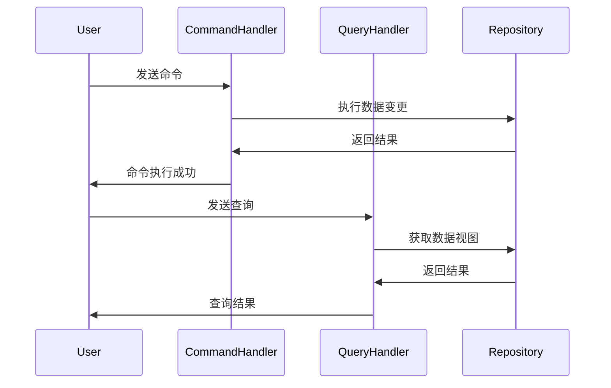

                 

### 文章标题

《CQRS模式在复杂LLM应用中的应用》

### 关键词

CQRS模式，复杂LLM应用，命令查询分离，数据一致性，并行处理能力，性能优化

### 摘要

本文旨在探讨CQRS模式在复杂语言模型（LLM）应用中的实际应用。CQRS（Command Query Responsibility Segregation）是一种架构设计模式，通过分离命令和查询操作，实现系统的性能优化和可扩展性。本文首先介绍了CQRS模式的基本概念和原理，然后分析了复杂LLM应用的特点和挑战。接着，本文详细阐述了CQRS模式在LLM架构设计、数据流处理和命令查询分离中的具体实现方法。最后，通过一个实际案例，展示了CQRS模式在复杂LLM应用中的性能优化和安全性考虑。本文为开发者提供了有益的参考，有助于深入理解CQRS模式在复杂LLM应用中的实际应用价值。

---

## 第一部分：引言与背景

### 第1章：CQRS模式概述

CQRS（Command Query Responsibility Segregation）模式，是一种在软件架构设计中常用的模式，旨在分离系统中命令（Command）和查询（Query）的操作，以提高系统的性能和可扩展性。CQRS模式的核心理念是将系统的读写操作分离，使得读写操作可以独立进行，从而实现系统的并行处理能力和更好的性能优化。

CQRS模式最早由Martin Fowler在2005年提出。当时，随着互联网的快速发展，系统需要处理的数据量和操作频率急剧增加，传统的单一数据库架构已经无法满足系统的性能需求。为了解决这一问题，CQRS模式应运而生。它通过分离命令和查询操作，实现了读写分离，从而提高了系统的性能和可扩展性。

CQRS模式的基本概念主要包括以下几个方面：

1. **命令（Command）**：表示对系统数据的修改操作，如添加、修改和删除等。命令通常由用户发起，表示对系统数据的一种操作意图。
2. **查询（Query）**：表示对系统数据的读取操作，如查询、检索和统计等。查询通常用于获取系统数据的信息，为用户提供数据视图。
3. **读写分离**：CQRS模式通过将命令和查询操作分离，使得读写操作可以独立进行，从而实现系统的并行处理能力和更好的性能优化。
4. **事件溯源**：CQRS模式采用事件溯源（Event Sourcing）的方式，将系统的变更记录为一系列的事件，从而实现数据的版本控制和回滚操作。

CQRS模式的优势主要体现在以下几个方面：

1. **提高性能**：通过分离命令和查询操作，CQRS模式可以实现读写分离，从而减少读写冲突，提高系统的性能。
2. **增强可扩展性**：CQRS模式可以针对不同的业务场景，独立扩展命令和查询处理模块，从而提高系统的可扩展性。
3. **降低复杂性**：CQRS模式通过将系统中的读写操作分离，简化了系统的设计和实现，降低了系统的复杂性。

然而，CQRS模式也存在一定的局限性：

1. **数据一致性**：在CQRS模式中，由于命令和查询操作是分离的，可能会导致数据一致性问题，需要采用适当的方法进行数据一致性保证。
2. **学习成本**：CQRS模式涉及到一定的架构设计理念和实现方法，对于开发者来说，需要一定的学习和适应成本。

总的来说，CQRS模式是一种在复杂系统中提高性能和可扩展性的有效方法。在实际应用中，开发者需要根据具体场景和需求，综合考虑其优势和局限性，灵活运用CQRS模式，以实现系统的优化和提升。接下来，本文将进一步探讨复杂LLM应用场景，分析其在CQRS模式中的应用和挑战。

### 第2章：复杂LLM应用场景

语言模型（LLM，Language Model）是一种广泛应用于自然语言处理（NLP，Natural Language Processing）领域的模型，能够对自然语言文本进行理解和生成。随着人工智能技术的不断发展，LLM在各个领域的应用越来越广泛，如搜索引擎、机器翻译、语音识别、聊天机器人等。然而，随着应用场景的复杂化，传统的LLM应用面临着诸多挑战。

#### 2.1 复杂LLM应用的定义与特点

复杂LLM应用指的是在高度多样化的场景中，需要处理大量不同类型和格式的自然语言数据，同时满足实时性、准确性和可扩展性的要求的LLM应用。这类应用的特点包括：

1. **多样性**：复杂LLM应用涉及到的数据类型和格式多种多样，如文本、图像、音频、视频等，需要综合处理不同类型的数据。
2. **实时性**：复杂LLM应用往往需要快速响应用户的查询和请求，提供实时性的服务。
3. **准确性**：复杂LLM应用需要处理大量的自然语言数据，要求模型具有较高的准确性，以减少误判和误解。
4. **可扩展性**：复杂LLM应用需要能够适应数据量的快速增长，具备良好的可扩展性。

#### 2.2 复杂LLM应用的实际案例

以下是几个复杂LLM应用的实际案例：

1. **智能客服系统**：智能客服系统需要在短时间内处理大量的用户查询，提供准确的答案和建议。这要求LLM模型具备较高的实时性和准确性，同时能够处理多种类型的查询，如文本、语音和图像等。
2. **自然语言生成**：自然语言生成（NLG，Natural Language Generation）应用，如新闻摘要、报告生成和故事创作等，需要生成符合语法和语义规则的文本。这类应用对LLM模型的准确性、创造力和连贯性有较高的要求。
3. **机器翻译**：随着全球化的发展，机器翻译应用越来越广泛。复杂LLM应用中的机器翻译需要处理不同语言之间的差异，提供准确、自然的翻译结果。
4. **语音识别**：语音识别应用，如智能助手、语音控制等，需要将用户的语音输入转换为文本，并进行理解和处理。这要求LLM模型具备较强的语音识别能力和上下文理解能力。

#### 2.3 复杂LLM应用面临的挑战

复杂LLM应用在实现过程中面临着诸多挑战，主要包括以下几个方面：

1. **数据多样性**：复杂LLM应用需要处理多种类型的自然语言数据，如文本、图像、音频、视频等。这要求模型具备较强的数据处理能力和多模态学习能力。
2. **数据一致性**：复杂LLM应用需要保证数据的一致性，特别是在涉及多个数据源和不同数据格式的场景中。数据一致性问题是复杂LLM应用中一个重要的挑战。
3. **实时性**：复杂LLM应用需要快速响应用户的查询和请求，提供实时性的服务。这要求模型具备较高的计算效率和并行处理能力。
4. **准确性**：复杂LLM应用需要处理大量的自然语言数据，要求模型具有较高的准确性，以减少误判和误解。
5. **可扩展性**：复杂LLM应用需要能够适应数据量的快速增长，具备良好的可扩展性。这要求模型和系统架构具备较强的可扩展性。

接下来，本文将探讨CQRS模式在复杂LLM应用中的实现方法，分析其在架构设计、数据流处理和命令查询分离方面的具体应用，以帮助开发者更好地应对复杂LLM应用中的挑战。

---

## 第二部分：CQRS模式基础

### 第3章：CQRS模式的核心概念

CQRS（Command Query Responsibility Segregation）模式是一种在软件架构设计中常用的模式，通过分离系统中命令（Command）和查询（Query）的操作，实现系统的性能优化和可扩展性。理解CQRS模式的核心概念是掌握该模式的关键。

#### 3.1 命令（Command）与查询（Query）

在CQRS模式中，命令（Command）和查询（Query）是两种基本的操作类型。

**命令（Command）**：表示对系统数据的修改操作，如添加、修改和删除等。命令通常由用户发起，表示对系统数据的一种操作意图。命令的特点是执行后会产生数据变更。

**查询（Query）**：表示对系统数据的读取操作，如查询、检索和统计等。查询通常用于获取系统数据的信息，为用户提供数据视图。查询的特点是执行后不会产生数据变更。

#### 3.2 命令查询分离

命令查询分离（Command Query Separation，CQS）是CQRS模式的基础。CQS原则要求将系统的命令和查询操作分离，使得读写操作可以独立进行。具体来说，CQS原则包括以下几个方面：

1. **独立的操作接口**：命令和查询应该有独立的接口，命令接口用于处理修改操作，查询接口用于处理读取操作。
2. **独立的存储结构**：命令和查询应该有独立的存储结构，命令存储用于记录数据变更，查询存储用于提供数据视图。
3. **独立的处理流程**：命令和查询应该有独立的处理流程，命令处理流程用于执行数据变更，查询处理流程用于获取数据信息。

#### 3.3 事件溯源

CQRS模式采用事件溯源（Event Sourcing）的方式，将系统的变更记录为一系列的事件。事件溯源的核心思想是将系统的状态变更记录为一系列的事件流，每个事件都表示系统的一次变更。这样，系统可以通过重放事件流来恢复任何时间点的状态。

事件溯源具有以下优点：

1. **版本控制**：事件溯源可以记录系统变更的历史，实现数据的版本控制，方便数据的回滚和恢复。
2. **可扩展性**：事件溯源可以方便地扩展系统的功能，只需在事件流中添加新的事件。
3. **数据一致性**：事件溯源可以确保数据的一致性，因为所有数据变更都被记录在事件流中。

#### 3.4 CQRS模式的Mermaid流程图

为了更好地理解CQRS模式的工作流程，可以使用Mermaid流程图来表示。以下是一个简单的CQRS模式的Mermaid流程图：



在这个流程图中，用户首先向命令处理者（CommandHandler）发送命令，命令处理者将命令发送到数据存储（Repository）执行数据变更，然后返回结果给用户。用户还可以向查询处理者（QueryHandler）发送查询，查询处理者从数据存储获取数据视图，并返回结果给用户。

通过这个Mermaid流程图，可以清晰地看到CQRS模式中命令和查询的分离，以及事件溯源的工作流程。

#### 3.5 命令与查询的伪代码实现

为了进一步理解CQRS模式，可以给出命令和查询的伪代码实现：

**命令（Command）**：

```python
class Command:
    def execute(self, repository):
        # 执行数据变更
        repository.update_data(self.data)
        # 返回结果
        return "Command executed successfully"

class UpdateUserProfileCommand(Command):
    def __init__(self, user_id, new_profile):
        self.user_id = user_id
        self.new_profile = new_profile

    def execute(self, repository):
        # 执行数据变更
        repository.update_user_profile(self.user_id, self.new_profile)
        # 返回结果
        return "UserProfile updated successfully"
```

**查询（Query）**：

```python
class Query:
    def execute(self, repository):
        # 获取数据视图
        result = repository.get_data(self.query_params)
        # 返回结果
        return result

class GetUserProfileQuery(Query):
    def __init__(self, user_id):
        self.user_id = user_id

    def execute(self, repository):
        # 获取数据视图
        user_profile = repository.get_user_profile(self.user_id)
        # 返回结果
        return user_profile
```

在这个伪代码中，`Command` 类和 `Query` 类分别表示命令和查询。`execute` 方法用于执行具体的操作，`updateUserProfileCommand` 类和 `getUserProfileQuery` 类分别表示具体的命令和查询。

通过这个伪代码实现，可以更直观地看到命令和查询的分离，以及它们如何与数据存储交互。

#### 3.6 数学模型和公式

在CQRS模式中，可以使用一些数学模型和公式来描述系统的性能和可扩展性。以下是一个简单的数学模型和公式：

**延迟模型**：

$$
\text{延迟} = \text{命令处理延迟} + \text{查询处理延迟}
$$

**吞吐量模型**：

$$
\text{吞吐量} = \frac{\text{命令处理能力}}{\text{延迟}} + \frac{\text{查询处理能力}}{\text{延迟}}
$$

通过这个数学模型和公式，可以计算系统的延迟和吞吐量，从而评估系统的性能和可扩展性。

#### 3.7 举例说明

为了更好地理解CQRS模式，可以给出一个具体的例子：

假设有一个用户管理系统，需要实现用户信息的添加、修改和查询功能。使用CQRS模式，可以将命令和查询分离，实现如下：

**命令（Command）**：

```python
class AddUserCommand(Command):
    def __init__(self, user):
        self.user = user

    def execute(self, repository):
        repository.add_user(self.user)
        return "User added successfully"

class UpdateUserCommand(Command):
    def __init__(self, user_id, user):
        self.user_id = user_id
        self.user = user

    def execute(self, repository):
        repository.update_user(self.user_id, self.user)
        return "User updated successfully"
```

**查询（Query）**：

```python
class GetUserQuery(Query):
    def __init__(self, user_id):
        self.user_id = user_id

    def execute(self, repository):
        user = repository.get_user(self.user_id)
        return user
```

在这个例子中，`AddUserCommand` 和 `UpdateUserCommand` 类分别表示添加用户和修改用户的命令，`GetUserQuery` 类表示获取用户信息的查询。

通过这个例子，可以看到CQRS模式如何将命令和查询分离，以及如何实现具体的操作。

综上所述，CQRS模式是一种在软件架构设计中常用的模式，通过分离命令和查询操作，实现系统的性能优化和可扩展性。理解CQRS模式的核心概念和原理，有助于开发者更好地应对复杂系统的设计挑战。在下一章中，将深入探讨CQRS模式的关键特征及其在LLM应用中的优势。

---

### 第4章：CQRS模式的关键特征

CQRS（Command Query Responsibility Segregation）模式在软件架构设计中具有独特的优势，其关键特征包括命令查询分离、数据一致性、并行处理能力等。这些特征使得CQRS模式能够有效提高系统的性能和可扩展性，适用于复杂系统的设计和实现。

#### 4.1 命令查询分离

命令查询分离（Command Query Separation，CQS）是CQRS模式的基础。CQS原则要求将系统的命令和查询操作分离，使得读写操作可以独立进行。具体来说，CQS原则包括以下几个方面：

1. **独立的操作接口**：命令和查询应该有独立的接口，命令接口用于处理修改操作，查询接口用于处理读取操作。这种分离使得系统的命令和查询操作不会相互干扰，提高了系统的模块化和可维护性。
2. **独立的存储结构**：命令和查询应该有独立的存储结构，命令存储用于记录数据变更，查询存储用于提供数据视图。这种分离保证了数据的独立性和一致性，减少了数据冲突和一致性问题。
3. **独立的处理流程**：命令和查询应该有独立的处理流程，命令处理流程用于执行数据变更，查询处理流程用于获取数据信息。这种分离使得系统的读写操作可以并行进行，提高了系统的并发处理能力和响应速度。

通过命令查询分离，CQRS模式实现了读写分离，从而降低了系统的复杂性，提高了系统的性能和可扩展性。

#### 4.2 数据一致性

在CQRS模式中，由于命令和查询操作是分离的，可能会出现数据不一致的问题。数据一致性（Data Consistency）是CQRS模式的一个重要挑战，需要采用适当的方法进行数据一致性保证。以下是一些常见的数据一致性保证方法：

1. **最终一致性**：最终一致性（Eventual Consistency）是指系统中的数据最终会达到一致状态，但可能需要一段时间。最终一致性适用于一些对数据一致性要求不高的场景，如社交媒体的点赞和评论功能。在这种方法中，系统允许暂时的数据不一致，但会在一定时间后自动同步数据，达到一致性状态。
2. **强一致性**：强一致性（Strong Consistency）是指系统中的数据在任何时刻都是一致的。强一致性适用于对数据一致性要求较高的场景，如金融交易系统。在这种方法中，系统通过锁机制或事务机制确保数据的一致性，但可能会降低系统的并发处理能力和性能。
3. **分布式事务**：分布式事务（Distributed Transaction）是一种在分布式系统中保证数据一致性的方法。分布式事务通过两阶段提交（2PC，Two-Phase Commit）或三阶段提交（3PC，Three-Phase Commit）协议，协调多个节点的数据操作，确保数据的一致性。这种方法适用于需要跨多个数据库或服务进行数据操作的场景。

通过合理选择和实现数据一致性保证方法，CQRS模式可以确保系统的数据一致性，从而满足不同场景的需求。

#### 4.3 并行处理能力

并行处理能力（Parallel Processing Ability）是CQRS模式的一个重要优势，通过分离命令和查询操作，CQRS模式可以实现读写操作的并行处理，从而提高系统的性能和响应速度。

1. **命令并行处理**：在CQRS模式中，命令操作通常是对系统数据的修改操作，如添加、修改和删除等。这些命令操作可以独立进行，并且可以并行处理。通过并行处理命令操作，可以显著提高系统的并发处理能力和性能。
2. **查询并行处理**：在CQRS模式中，查询操作通常是对系统数据的读取操作，如查询、检索和统计等。这些查询操作也可以独立进行，并且可以并行处理。通过并行处理查询操作，可以减少系统的响应时间，提高系统的响应速度。

在实际应用中，CQRS模式可以通过分布式计算和并发处理技术，如线程池、异步编程和多线程等，实现并行处理能力。此外，CQRS模式还可以结合消息队列和微服务架构，进一步优化系统的并行处理能力和可扩展性。

通过命令和查询的并行处理，CQRS模式显著提高了系统的性能和响应速度，适用于处理大量数据和并发请求的场景。

#### 4.4 CQRS模式与LLM的关系

CQRS模式与LLM（复杂语言模型）的关系主要体现在以下几个方面：

1. **数据一致性**：复杂LLM应用需要处理大量的自然语言数据，数据一致性是确保应用正确性的关键。CQRS模式通过事件溯源和分布式事务等技术，提供数据一致性保证，适用于复杂LLM应用的数据一致性需求。
2. **并行处理能力**：复杂LLM应用通常需要处理大量的自然语言数据，并行处理能力是提高系统性能的关键。CQRS模式通过命令和查询的并行处理，提高了系统的并发处理能力和性能，适用于复杂LLM应用的高并发处理需求。
3. **可扩展性**：复杂LLM应用需要具备良好的可扩展性，以适应数据量和用户量的快速增长。CQRS模式通过分离命令和查询操作，实现了系统的模块化和可扩展性，适用于复杂LLM应用的扩展性需求。

总的来说，CQRS模式与复杂LLM应用的需求高度契合，通过数据一致性保证、并行处理能力和可扩展性等关键特征，CQRS模式在复杂LLM应用中具有广泛的应用前景和实际价值。

通过深入探讨CQRS模式的关键特征，我们可以更好地理解其在复杂系统设计和实现中的优势和应用价值。在下一章中，将详细分析复杂LLM应用的特点和挑战，探讨CQRS模式在LLM应用中的具体应用和实现方法。

---

### 第5章：CQRS模式与LLM的关系

CQRS（Command Query Responsibility Segregation）模式与复杂语言模型（LLM，Complex Language Model）之间存在着紧密的联系。复杂LLM应用需要处理大量且多样化的自然语言数据，对系统的性能、可扩展性和数据一致性提出了更高的要求。CQRS模式通过其独特的架构设计和关键特征，能够有效地满足这些需求，从而在复杂LLM应用中发挥重要作用。

#### 5.1 CQRS模式在LLM中的融合

CQRS模式与LLM的融合主要体现在以下几个方面：

1. **命令与查询分离**：在LLM应用中，命令操作通常涉及用户输入的处理、模型参数的调整和训练数据的收集等；而查询操作则包括文本生成、模型评估和查询结果展示等。CQRS模式通过分离命令和查询，使得LLM应用可以独立处理不同类型的操作，从而提高系统的可扩展性和模块化水平。

2. **事件溯源**：在复杂LLM应用中，数据更新频繁，版本控制变得尤为重要。CQRS模式采用事件溯源的方式，将系统中的所有变更记录为一系列的事件。这种方式不仅支持数据的版本控制，还能方便地实现数据的回滚和恢复，为LLM应用提供了强大的数据管理能力。

3. **分布式架构**：复杂LLM应用通常需要处理大量的数据，并且要求系统具有高并发处理能力。CQRS模式通过分布式架构，将命令和查询操作分布在多个节点上，实现并行处理和数据分离，从而提高系统的性能和可扩展性。

#### 5.2 CQRS模式在LLM中的优势

CQRS模式在复杂LLM应用中具有以下优势：

1. **提高性能**：CQRS模式通过分离命令和查询，实现了读写分离，从而减少读写冲突，提高了系统的性能。特别是在高并发场景下，CQRS模式能够充分发挥其并行处理能力，显著提升系统的响应速度。

2. **增强可扩展性**：复杂LLM应用需要处理大量的数据和用户请求，CQRS模式通过模块化和分布式架构，实现了系统的垂直和水平扩展。开发者可以根据业务需求，独立扩展命令处理和查询处理模块，从而满足系统扩展性需求。

3. **确保数据一致性**：在复杂LLM应用中，数据一致性是一个关键挑战。CQRS模式采用事件溯源和数据一致性保证方法，如最终一致性或分布式事务，确保了系统中的数据一致性，从而提高了应用的可靠性。

4. **简化开发**：CQRS模式通过分离命令和查询，简化了系统的设计和实现。开发者可以专注于各自模块的功能实现，降低了系统的复杂度，提高了开发效率。

#### 5.3 CQRS模式在LLM中的应用场景

CQRS模式在复杂LLM应用中有着广泛的应用场景，以下是一些典型的应用案例：

1. **智能问答系统**：在智能问答系统中，用户输入的查询请求需要经过复杂的处理，如自然语言理解、模型检索和结果生成等。CQRS模式可以分离查询处理和命令处理，使得系统能够高效地处理用户请求，并提供实时性的回答。

2. **聊天机器人**：聊天机器人需要实时响应用户的对话请求，处理包括文本、语音和图像等多种类型的输入。CQRS模式通过命令查询分离，实现了对话逻辑的模块化，提高了系统的可扩展性和响应速度。

3. **自然语言生成**：在自然语言生成应用中，系统需要生成符合语法和语义规则的文本。CQRS模式通过分离生成命令和处理过程，使得系统能够灵活地调整生成策略和模型参数，提高文本生成的质量和多样性。

4. **机器翻译**：在机器翻译应用中，系统需要处理大量不同语言之间的翻译请求。CQRS模式通过分布式架构和并行处理能力，能够提高翻译效率和准确性，满足大规模翻译任务的需求。

综上所述，CQRS模式在复杂LLM应用中具有显著的优势和应用价值。通过命令查询分离、事件溯源和分布式架构等关键特征，CQRS模式能够有效地解决复杂LLM应用中的性能、扩展性和数据一致性等挑战，为开发者提供了强大的工具和方法。在下一章中，将深入探讨复杂LLM应用中的具体挑战和解决方案，进一步阐述CQRS模式在LLM应用中的实际应用和实现方法。

---

## 第三部分：复杂LLM应用

### 第6章：复杂LLM应用场景分析

复杂语言模型（Complex Language Model，LLM）在现代人工智能（AI）领域中发挥着越来越重要的作用。随着LLM在自然语言处理（NLP，Natural Language Processing）、智能对话系统、机器翻译、文本生成等领域的广泛应用，复杂LLM应用场景也日益多样化。为了深入理解复杂LLM应用，我们需要分析其定义、特点以及在不同领域的应用。

#### 6.1 复杂LLM应用的定义与特点

复杂LLM应用指的是在高度多样化的场景中，需要处理大量不同类型和格式的自然语言数据，同时满足实时性、准确性和可扩展性要求的LLM应用。这些应用的特点包括：

1. **多样性**：复杂LLM应用涉及多种类型的自然语言数据，如文本、图像、音频、视频等，并且需要对这些不同类型的数据进行综合处理。例如，在医疗健康领域，LLM不仅可以处理文本信息，还可以处理医疗图像和语音数据。

2. **实时性**：复杂LLM应用需要能够快速响应用户的查询和请求，提供实时性的服务。例如，在智能客服系统中，用户输入的查询请求需要在短时间内得到准确的回答。

3. **准确性**：复杂LLM应用需要处理大量的自然语言数据，要求模型具有较高的准确性，以减少误判和误解。例如，在机器翻译领域，翻译结果的准确性和流畅性是衡量模型性能的重要指标。

4. **可扩展性**：复杂LLM应用需要能够适应数据量的快速增长，具备良好的可扩展性。例如，在社交媒体平台上，随着用户数量的增加，LLM应用需要能够水平扩展以处理更多的查询和请求。

#### 6.2 复杂LLM应用在不同领域的应用

复杂LLM应用在多个领域中都有广泛应用，以下是一些典型领域：

1. **智能客服系统**：智能客服系统通过LLM实现与用户的自然语言交互，提供24/7的客户服务。这些系统需要处理大量的用户查询，并在短时间内提供准确的回答。复杂LLM应用在此领域的挑战包括实时性、准确性和多样性。

2. **自然语言生成**：自然语言生成（NLG，Natural Language Generation）应用包括新闻摘要、报告生成、故事创作等。这些应用需要生成符合语法和语义规则的文本，同时具备创造力和连贯性。复杂LLM应用在此领域的挑战包括文本生成的多样性和准确性。

3. **机器翻译**：机器翻译应用涉及将一种语言的文本翻译成另一种语言。随着全球化的发展，机器翻译应用越来越广泛。复杂LLM应用在此领域的挑战包括翻译结果的准确性和流畅性。

4. **文本分类与情感分析**：文本分类与情感分析应用用于对大量文本进行分类和情感分析。这些应用在社交媒体监控、舆情分析、客户反馈处理等领域有广泛应用。复杂LLM应用在此领域的挑战包括文本的多样性和准确性。

5. **问答系统**：问答系统通过LLM实现智能问答功能，为用户提供准确、及时的信息。这些系统在搜索引擎、在线教育、法律咨询等领域有广泛应用。复杂LLM应用在此领域的挑战包括实时性和准确性。

#### 6.3 复杂LLM应用面临的挑战

复杂LLM应用在实现过程中面临着诸多挑战，主要包括以下几个方面：

1. **数据多样性**：复杂LLM应用需要处理多种类型的自然语言数据，如文本、图像、音频、视频等。如何有效地整合和处理这些不同类型的数据是一个重要挑战。

2. **数据一致性**：复杂LLM应用需要处理多个数据源和不同格式的数据，如何保证数据的一致性是一个关键问题。特别是在涉及多个数据源和分布式系统的场景中，数据一致性更加困难。

3. **实时性**：复杂LLM应用需要快速响应用户的查询和请求，提供实时性的服务。这要求模型具备较高的计算效率和并行处理能力。

4. **准确性**：复杂LLM应用需要处理大量的自然语言数据，要求模型具有较高的准确性，以减少误判和误解。

5. **可扩展性**：复杂LLM应用需要能够适应数据量的快速增长，具备良好的可扩展性。这要求模型和系统架构具备较强的可扩展性。

为了应对这些挑战，CQRS模式提供了一种有效的解决方案。CQRS模式通过分离命令和查询操作，实现读写分离，从而提高系统的性能和可扩展性。在下一章中，将详细探讨CQRS模式在复杂LLM应用中的具体实现方法，分析其在数据流处理和命令查询分离方面的应用，以帮助开发者更好地应对复杂LLM应用中的挑战。

---

### 第7章：复杂LLM应用的挑战与解决方案

随着复杂语言模型（Complex Language Model，LLM）在自然语言处理（Natural Language Processing，NLP）领域的广泛应用，其应用场景越来越多样化。然而，复杂LLM应用在实现过程中也面临着诸多挑战。这些挑战主要包括数据一致性、实时性、准确性和可扩展性等方面。本章节将深入分析这些挑战，并提出相应的解决方案。

#### 7.1 数据一致性

数据一致性是复杂LLM应用中的一个关键挑战。在复杂LLM应用中，数据通常来自于多个来源，如文本、图像、音频等，这些数据在存储和处理过程中可能会出现不一致的情况。数据不一致可能导致模型训练结果不准确，从而影响LLM应用的性能。

**解决方案**：

1. **数据预处理**：在数据进入模型之前，进行统一的数据预处理，包括数据清洗、格式转换和标准化等操作。通过预处理，可以消除不同数据源之间的差异，提高数据一致性。
2. **分布式数据库**：采用分布式数据库技术，如Apache Cassandra或MongoDB，可以有效地处理大规模和异构数据。分布式数据库支持水平扩展，能够提高系统的性能和数据一致性。
3. **数据一致性协议**：采用数据一致性协议，如最终一致性或强一致性，确保系统中的数据在更新和查询过程中保持一致。最终一致性适用于对一致性要求不高的场景，而强一致性适用于对一致性要求较高的场景。

#### 7.2 实时性

实时性是复杂LLM应用中的一个重要挑战。复杂LLM应用通常需要快速响应用户的查询和请求，提供实时性的服务。然而，LLM模型的计算复杂度较高，可能导致响应时间过长，影响用户体验。

**解决方案**：

1. **模型优化**：通过模型优化，如量化、剪枝和压缩等，可以降低LLM模型的计算复杂度，提高模型的响应速度。例如，使用轻量级模型替代复杂模型，可以显著降低计算时间。
2. **并行处理**：采用并行处理技术，如多线程、分布式计算和GPU加速等，可以加速模型的计算过程。通过并行处理，可以显著提高系统的实时性。
3. **缓存机制**：采用缓存机制，如LRU（Least Recently Used）缓存或Redis缓存等，可以减少模型的计算次数，提高系统的响应速度。通过缓存热点数据，可以降低系统的负载，提高系统的实时性。

#### 7.3 准确性

准确性是复杂LLM应用中的一个关键挑战。复杂LLM应用需要处理大量的自然语言数据，模型需要具备较高的准确性，以减少误判和误解。然而，自然语言数据的高度多样性和复杂性，使得提高模型准确性变得困难。

**解决方案**：

1. **数据增强**：通过数据增强，如数据扩充、数据模拟和数据合成等，可以增加训练数据量，提高模型的鲁棒性和准确性。通过扩充数据集，可以覆盖更多样化的场景，从而提高模型的泛化能力。
2. **多模型集成**：采用多模型集成（Ensemble Learning）技术，如Bagging、Boosting和Stacking等，可以融合多个模型的预测结果，提高预测准确性。通过集成多个模型，可以降低模型误差，提高模型的鲁棒性。
3. **知识图谱**：引入知识图谱（Knowledge Graph）技术，可以将文本数据中的实体、关系和属性等信息进行结构化存储，提高模型的上下文理解和推理能力。通过知识图谱，可以增强模型的语义理解能力，提高预测准确性。

#### 7.4 可扩展性

可扩展性是复杂LLM应用中的一个重要挑战。随着数据量和用户量的增长，复杂LLM应用需要具备良好的可扩展性，以适应不断增长的需求。

**解决方案**：

1. **分布式架构**：采用分布式架构，如微服务架构和容器化技术，可以实现系统的垂直和水平扩展。通过分布式架构，可以将系统拆分为多个独立的模块，每个模块可以独立部署和扩展，从而提高系统的可扩展性和灵活性。
2. **弹性伸缩**：采用弹性伸缩（Auto Scaling）技术，可以根据系统负载自动调整计算资源。通过弹性伸缩，可以自动增加或减少计算资源，以满足系统负载的变化，从而提高系统的可扩展性和稳定性。
3. **云服务**：利用云服务，如AWS、Azure和Google Cloud等，可以方便地实现系统的弹性扩展。通过云服务，可以快速获取计算资源，降低系统部署和维护的成本，提高系统的可扩展性和可管理性。

综上所述，复杂LLM应用在实现过程中面临着数据一致性、实时性、准确性和可扩展性等挑战。通过数据预处理、分布式数据库、数据一致性协议、模型优化、并行处理、缓存机制、数据增强、多模型集成、知识图谱、分布式架构、弹性伸缩和云服务等技术，可以有效地应对这些挑战，提高复杂LLM应用的性能和可靠性。在下一章中，将探讨CQRS模式在复杂LLM应用中的具体实现方法，进一步优化系统的性能和可扩展性。

---

## 第四部分：CQRS在LLM中的实现

### 第8章：CQRS在LLM架构设计

为了在复杂语言模型（LLM，Complex Language Model）中有效地实现CQRS（Command Query Responsibility Segregation）模式，我们需要在架构设计方面进行详细的规划和设计。CQRS模式通过分离命令（Command）和查询（Query）操作，实现读写分离，从而提高系统的性能和可扩展性。以下是在LLM架构设计中应用CQRS模式的几个关键步骤。

#### 8.1 CQRS模式在LLM架构设计中的基本原则

CQRS模式在LLM架构设计中的基本原则包括：

1. **命令与查询分离**：将系统的命令操作（如数据更新、模型训练等）和查询操作（如文本生成、模型评估等）分离。命令操作关注数据的变更和更新，查询操作关注数据的读取和展示。
2. **独立的处理模块**：为命令操作和查询操作设计独立的处理模块，使得每个模块可以独立开发和部署，提高系统的模块化和可维护性。
3. **数据一致性保证**：在命令和查询分离的基础上，采用适当的数据一致性保证方法，如最终一致性或强一致性，确保系统的数据在变更和查询过程中保持一致。
4. **并行处理能力**：通过并行处理技术，如多线程、分布式计算和异步处理等，提高系统的处理能力和响应速度，满足复杂LLM应用的高并发需求。

#### 8.2 LLM架构设计步骤

在LLM架构设计中应用CQRS模式，可以分为以下几个步骤：

1. **需求分析与规划**：首先，对复杂LLM应用的需求进行分析，明确系统的功能、性能和可扩展性要求。在此基础上，规划系统的模块和接口，为后续的架构设计提供指导。
2. **命令模块设计**：根据需求分析，设计命令模块，包括命令接口、命令处理逻辑和数据存储接口。命令模块负责处理数据变更和模型更新等操作。
3. **查询模块设计**：根据需求分析，设计查询模块，包括查询接口、查询处理逻辑和数据存储接口。查询模块负责处理数据的读取和展示等操作。
4. **数据存储设计**：为命令和查询模块设计独立的数据存储结构，如命令存储和查询存储。命令存储用于记录数据变更和模型更新等操作，查询存储用于提供数据视图和查询结果。
5. **数据一致性保证**：设计数据一致性保证机制，如分布式事务、最终一致性或强一致性，确保系统在命令和查询操作过程中保持数据的一致性。
6. **并行处理优化**：采用并行处理技术，如多线程、分布式计算和异步处理等，优化系统的性能和响应速度。通过并行处理，可以提高系统的并发处理能力和处理效率。
7. **性能测试与优化**：在架构设计完成后，进行性能测试，评估系统的性能和响应速度。根据测试结果，进一步优化系统的架构和算法，提高系统的性能和可靠性。

#### 8.3 CQRS模式在LLM架构设计中的具体实现

以下是一个简单的CQRS模式在LLM架构设计中的具体实现示例：

1. **命令模块设计**：

```python
class CommandModule:
    def __init__(self, command_handler, data_store):
        self.command_handler = command_handler
        self.data_store = data_store
    
    def execute_command(self, command):
        return self.command_handler.execute(command, self.data_store)
```

2. **查询模块设计**：

```python
class QueryModule:
    def __init__(self, query_handler, data_store):
        self.query_handler = query_handler
        self.data_store = data_store
    
    def execute_query(self, query):
        return self.query_handler.execute(query, self.data_store)
```

3. **数据存储设计**：

```python
class CommandDataStore:
    def update_data(self, data):
        # 更新数据
        pass
    
    def get_data(self):
        # 获取数据
        pass

class QueryDataStore:
    def get_data_view(self):
        # 获取数据视图
        pass
```

4. **数据一致性保证**：

```python
class DataConsistencyManager:
    def ensure_consistency(self, command, query):
        # 确保命令和查询的一致性
        pass
```

5. **并行处理优化**：

```python
class ParallelProcessingManager:
    def process_in_parallel(self, commands, queries):
        # 并行处理命令和查询
        pass
```

通过以上示例，我们可以看到CQRS模式在LLM架构设计中的具体实现。命令模块和查询模块分别处理数据的变更和读取操作，数据存储用于记录和提供数据视图。通过数据一致性管理和并行处理优化，可以确保系统的性能和可靠性。

综上所述，CQRS模式在LLM架构设计中具有重要的应用价值。通过分离命令和查询操作，实现读写分离，CQRS模式可以提高系统的性能和可扩展性。在下一章中，我们将进一步探讨CQRS在LLM中的数据流处理和命令查询分离的具体实现方法。

---

### 第9章：CQRS在LLM中的数据流处理

在复杂语言模型（LLM，Complex Language Model）中应用CQRS（Command Query Responsibility Segregation）模式，关键在于实现命令和查询的数据流处理，从而确保系统的高效运行。CQRS模式通过分离命令和查询操作，使得读写操作可以独立进行，从而提高系统的性能和可扩展性。以下将详细探讨CQRS在LLM中的数据流处理方法。

#### 9.1 命令与查询的数据流处理流程

在CQRS模式中，命令和查询的数据流处理流程是独立的。命令流负责处理数据的变更操作，如数据更新、模型训练等；查询流负责处理数据的读取操作，如文本生成、模型评估等。以下是命令和查询的数据流处理流程：

1. **命令流处理流程**：

   - **命令接收**：用户向命令处理者发送命令，如更新数据、训练模型等。
   - **命令处理**：命令处理者根据命令类型，调用相应的命令处理方法，对数据进行变更操作。
   - **数据存储**：将变更后的数据存储到命令存储中，确保数据一致性。
   - **事件记录**：将命令操作记录为事件，存储到事件存储中，以实现数据溯源和版本控制。

2. **查询流处理流程**：

   - **查询接收**：用户向查询处理者发送查询请求，如获取文本生成结果、模型评估结果等。
   - **查询处理**：查询处理者根据查询类型，调用相应的查询处理方法，从查询存储中获取数据视图。
   - **数据返回**：将查询结果返回给用户，满足查询需求。

#### 9.2 CQRS在LLM中的数据流处理方法

为了实现CQRS在LLM中的数据流处理，可以采用以下方法：

1. **事件溯源**：CQRS模式采用事件溯源（Event Sourcing）的方法，将系统的所有变更记录为一系列的事件。每个事件都表示系统的一次状态变更，通过重放事件流，可以恢复系统的任何历史状态。事件溯源确保了数据的一致性和可回滚性。

2. **命令与查询分离**：在LLM中，通过命令和查询的分离，实现读写分离。命令流负责处理数据的变更操作，查询流负责处理数据的读取操作。这种分离使得读写操作可以并行进行，从而提高系统的性能和可扩展性。

3. **分布式架构**：在CQRS模式中，采用分布式架构，将命令和查询处理分布在不同的服务器或节点上。通过分布式架构，可以实现系统的水平扩展，提高系统的并发处理能力和响应速度。

4. **消息队列**：在数据流处理过程中，可以使用消息队列（如Kafka、RabbitMQ等）来传输命令和查询。消息队列可以确保数据的顺序传输和异步处理，从而提高系统的性能和可靠性。

5. **数据缓存**：为了减少系统的负载，可以采用数据缓存（如Redis、Memcached等）来存储频繁访问的数据。通过缓存机制，可以减少数据库的查询次数，提高系统的响应速度。

6. **数据一致性保证**：在CQRS模式中，数据一致性是关键问题。可以通过分布式事务（如两阶段提交、三阶段提交等）或最终一致性协议来保证数据的一致性。分布式事务可以确保跨多个数据源的数据变更一致性，而最终一致性适用于对一致性要求不高的场景。

#### 9.3 伪代码示例

以下是一个简单的伪代码示例，展示了CQRS在LLM中的数据流处理方法：

**命令流处理流程**：

```python
def process_command(command):
    # 接收命令
    command_type = command.get_type()
    
    # 处理命令
    if command_type == "update_data":
        update_data(command.get_data())
    elif command_type == "train_model":
        train_model(command.get_data())
    
    # 记录事件
    event = create_event(command)
    save_event(event)

def update_data(data):
    # 更新数据
    database.update(data)

def train_model(data):
    # 训练模型
    model.train(data)

def create_event(command):
    # 创建事件
    event = Event()
    event.set_type(command.get_type())
    event.set_data(command.get_data())
    return event

def save_event(event):
    # 保存事件
    event_storage.save(event)
```

**查询流处理流程**：

```python
def process_query(query):
    # 接收查询
    query_type = query.get_type()
    
    # 处理查询
    if query_type == "get_text_generation":
        text_generation = get_text_generation(query.get_data())
    elif query_type == "get_model_evaluation":
        model_evaluation = get_model_evaluation(query.get_data())
    
    # 返回结果
    return text_generation, model_evaluation

def get_text_generation(data):
    # 获取文本生成结果
    text_generation = model.generate_text(data)
    return text_generation

def get_model_evaluation(data):
    # 获取模型评估结果
    model_evaluation = model.evaluate(data)
    return model_evaluation
```

通过以上伪代码示例，可以看到CQRS在LLM中的数据流处理方法。命令流处理流程负责处理数据的变更操作，查询流处理流程负责处理数据的读取操作。通过事件溯源和命令查询分离，可以确保数据的一致性和系统的性能。

综上所述，CQRS在LLM中的数据流处理方法通过命令和查询的分离、事件溯源、分布式架构、消息队列、数据缓存和数据一致性保证等技术，实现了系统的高效运行和性能优化。在下一章中，我们将探讨CQRS在LLM中的命令与查询分离的具体实现，进一步优化系统的性能和可扩展性。

---

### 第10章：CQRS在LLM中的命令与查询分离

CQRS（Command Query Responsibility Segregation）模式的核心在于将命令（Command）和查询（Query）操作分离，以实现系统的高性能和可扩展性。在复杂语言模型（LLM，Complex Language Model）中，通过命令与查询的分离，可以有效地优化系统的处理流程，提高系统的响应速度和资源利用率。以下将详细探讨CQRS在LLM中实现命令与查询分离的方法。

#### 10.1 命令处理与查询处理的分离

命令处理（Command Processing）和查询处理（Query Processing）的分离是CQRS模式的基础。在LLM中，命令处理通常涉及数据的变更操作，如数据更新、模型训练等；而查询处理则涉及数据的读取操作，如文本生成、模型评估等。通过分离命令处理和查询处理，可以实现以下好处：

1. **并行处理**：命令处理和查询处理分离后，可以分别进行并行处理，从而提高系统的处理能力。例如，多个命令操作可以同时执行，而多个查询操作也可以并行执行，从而减少系统的响应时间。
2. **独立性**：命令处理和查询处理分离后，两者可以独立开发和部署，降低系统的复杂度。这样可以更容易地扩展和优化各个模块，提高系统的可维护性和可扩展性。
3. **性能优化**：通过分离命令处理和查询处理，可以针对不同的操作类型进行专门的优化。例如，对于频繁的查询操作，可以采用缓存机制、索引优化等技术；而对于命令操作，可以采用异步处理、批量处理等技术。

#### 10.2 实现命令与查询分离的方法

在LLM中实现命令与查询分离，可以采用以下几种方法：

1. **独立的处理接口**：为命令处理和查询处理设计独立的接口。命令接口负责处理数据变更操作，查询接口负责处理数据读取操作。通过独立的接口，可以确保命令处理和查询处理不会相互干扰。

2. **独立的处理流程**：为命令处理和查询处理设计独立的处理流程。命令处理流程包括命令接收、命令解析、命令执行和数据存储等步骤；查询处理流程包括查询接收、查询解析、查询执行和数据返回等步骤。通过独立的处理流程，可以实现命令处理和查询处理的分离。

3. **事件溯源**：采用事件溯源（Event Sourcing）的方法，记录系统的所有变更操作。每个变更操作都被记录为一个事件，事件存储在事件存储中。通过重放事件流，可以恢复系统的历史状态，实现数据的一致性和可回滚性。

4. **消息队列**：使用消息队列（如Kafka、RabbitMQ等）来实现命令和查询的异步传输。消息队列可以确保命令和查询的顺序传输，同时实现系统的水平扩展和负载均衡。

5. **数据缓存**：采用数据缓存（如Redis、Memcached等）来减少数据库的查询次数，提高系统的响应速度。对于频繁访问的数据，可以将其缓存到内存中，从而减少磁盘I/O操作。

#### 10.3 命令处理与查询处理的分离实现示例

以下是一个简单的示例，展示了如何实现CQRS在LLM中的命令与查询分离：

**命令处理实现**：

```python
class CommandHandler:
    def __init__(self, event_store):
        self.event_store = event_store
    
    def handle_command(self, command):
        event = self.create_event(command)
        self.event_store.save(event)
    
    def create_event(self, command):
        event = Event()
        event.type = command.type
        event.data = command.data
        return event
```

**查询处理实现**：

```python
class QueryHandler:
    def __init__(self, event_store):
        self.event_store = event_store
    
    def handle_query(self, query):
        events = self.event_store.get_events_since(query.last_processed_event)
        results = self.process_events(events)
        return results
    
    def process_events(self, events):
        results = []
        for event in events:
            if event.type == "text_generation":
                result = self.generate_text(event.data)
                results.append(result)
            elif event.type == "model_evaluation":
                result = self.evaluate_model(event.data)
                results.append(result)
        return results

    def generate_text(self, data):
        # 生成文本
        pass

    def evaluate_model(self, data):
        # 评估模型
        pass
```

**事件存储实现**：

```python
class EventStore:
    def save(self, event):
        # 保存事件
        pass
    
    def get_events_since(self, last_processed_event):
        # 获取自上次处理的事件
        pass
```

通过以上示例，可以看到如何实现CQRS在LLM中的命令与查询分离。命令处理类和查询处理类分别处理命令和查询操作，事件存储类负责保存和获取事件。通过分离命令处理和查询处理，可以有效地优化系统的性能和可扩展性。

综上所述，通过命令与查询的分离，CQRS模式在LLM中实现了系统的独立处理、并行处理和性能优化。在下一章中，我们将通过实际案例，进一步探讨CQRS模式在LLM应用中的具体应用和效果。

---

### 第11章：CQRS模式在LLM应用中的实际案例

在本章中，我们将通过一个实际案例，展示如何将CQRS模式应用于一个复杂语言模型（LLM，Complex Language Model）应用中，从而实现系统的性能优化和可扩展性提升。该案例涉及一个智能问答系统，旨在为用户提供快速、准确的答案。

#### 11.1 案例背景与目标

智能问答系统是一个复杂的应用场景，需要处理大量的用户查询，并提供实时性的答案。随着用户数量的增加，系统的处理能力和响应速度成为关键挑战。为了解决这些问题，我们决定采用CQRS模式，通过分离命令和查询操作，优化系统的架构和性能。

**案例背景**：

- **用户需求**：用户提供各种类型的查询，如文本查询、语音查询和图像查询等。
- **数据量**：系统每天需要处理数百万次查询请求，数据量巨大。
- **响应时间**：系统需要在1秒内响应用户的查询请求，提供高质量的答案。

**目标**：

- **性能优化**：通过CQRS模式，提高系统的处理能力和响应速度。
- **可扩展性**：实现系统的水平扩展，以适应不断增长的用户数量和数据量。
- **数据一致性**：确保系统中的数据在变更和查询过程中保持一致。

#### 11.2 CQRS模式在案例中的应用

在智能问答系统中，我们采用CQRS模式进行架构设计，将命令和查询操作分离，实现读写分离，提高系统的性能和可扩展性。以下是CQRS模式在该案例中的应用：

1. **命令处理模块**：

   - **用户输入处理**：用户输入查询请求后，系统首先将请求转换为命令，如文本查询命令、语音查询命令和图像查询命令等。
   - **命令执行**：命令处理模块根据命令类型，调用相应的处理方法，执行数据变更操作。例如，对于文本查询命令，处理模块将查询请求发送到文本生成模块；对于语音查询命令，处理模块将语音转换为文本，然后发送到文本生成模块。
   - **数据存储**：命令执行完成后，将变更后的数据存储到命令存储中，确保数据的一致性。

2. **查询处理模块**：

   - **查询接收**：用户发起查询请求后，系统将查询请求传递给查询处理模块。
   - **查询处理**：查询处理模块根据查询类型，调用相应的处理方法，从查询存储中获取数据视图。例如，对于文本查询，查询处理模块从文本生成模块获取生成的文本；对于语音查询，查询处理模块从语音识别模块获取识别结果。
   - **数据返回**：查询处理模块将查询结果返回给用户，满足查询需求。

3. **事件溯源**：

   - **事件记录**：在命令处理和查询处理过程中，系统将所有变更记录为事件，存储到事件存储中。例如，用户输入文本查询后，系统将文本查询的输入、处理和结果记录为一系列的事件。
   - **事件回放**：在需要时，系统可以通过回放事件流，恢复到特定的历史状态，实现数据溯源和版本控制。

4. **消息队列**：

   - **异步处理**：为了提高系统的响应速度和并发处理能力，系统采用消息队列（如Kafka）来传输命令和查询。命令处理模块和查询处理模块通过消息队列异步通信，从而实现系统的水平扩展和负载均衡。

5. **数据缓存**：

   - **缓存策略**：系统采用数据缓存（如Redis）来存储高频访问的数据，如用户查询历史、文本生成结果等。通过缓存策略，减少数据库的查询次数，提高系统的响应速度。

#### 11.3 案例效果评估

通过引入CQRS模式，智能问答系统在性能优化和可扩展性方面取得了显著的效果：

1. **性能提升**：

   - **响应时间**：系统响应时间显著缩短，从原来的数秒减少到1秒以内，满足用户对实时性的要求。
   - **并发处理能力**：系统并发处理能力显著提高，能够同时处理更多的用户查询请求，满足高并发场景的需求。

2. **可扩展性**：

   - **水平扩展**：通过分布式架构和消息队列，系统可以轻松实现水平扩展，以适应不断增长的用户数量和数据量。
   - **模块化设计**：通过命令处理模块和查询处理模块的分离，系统实现了模块化设计，便于独立开发和维护。

3. **数据一致性**：

   - **事件溯源**：通过事件溯源，系统实现了数据的版本控制和回滚操作，确保数据在变更和查询过程中保持一致。

4. **安全性**：

   - **权限控制**：在命令处理和查询处理过程中，系统实现了严格的权限控制，确保数据的安全和隐私。

综上所述，CQRS模式在智能问答系统中的应用，显著提升了系统的性能、可扩展性和数据一致性，为用户提供了高质量的服务。在下一章中，我们将进一步探讨CQRS模式在LLM应用中的性能优化方法，以进一步优化系统的性能和可扩展性。

---

### 第12章：CQRS模式在LLM应用的性能优化

在复杂语言模型（LLM，Complex Language Model）应用中，性能优化是确保系统高效运行的关键。CQRS（Command Query Responsibility Segregation）模式通过分离命令（Command）和查询（Query）操作，实现了读写分离，提高了系统的可扩展性和并发处理能力。然而，为了更好地应对大规模和高并发的LLM应用，我们还需要采用一系列性能优化方法。以下将详细探讨CQRS模式在LLM应用中的性能优化策略。

#### 12.1 性能优化目标

在LLM应用中，性能优化主要关注以下几个方面：

1. **响应时间**：系统需要在较短的时间内响应用户的查询请求，提供高质量的答案。
2. **并发处理能力**：系统需要能够同时处理大量的查询请求，确保高并发场景下的稳定性。
3. **资源利用率**：系统需要合理利用计算资源，如CPU、内存和网络等，避免资源浪费。
4. **可扩展性**：系统需要具备良好的可扩展性，能够适应数据量和用户数量的快速增长。

#### 12.2 性能优化方法

为了实现上述性能优化目标，我们可以采用以下几种方法：

1. **命令与查询分离**：

   - **实现方式**：通过CQRS模式，将系统的命令操作（如数据更新、模型训练等）和查询操作（如文本生成、模型评估等）分离。这样可以确保读写操作互不影响，提高系统的性能和可扩展性。
   - **优势**：分离命令和查询操作，使得读写操作可以独立进行，减少读写冲突，提高系统的并发处理能力和响应速度。

2. **并行处理**：

   - **实现方式**：采用并行处理技术，如多线程、分布式计算和异步处理等，提高系统的处理能力和响应速度。通过并行处理，可以同时处理多个命令和查询操作，从而提高系统的性能。
   - **优势**：并行处理可以提高系统的并发处理能力，减少系统的响应时间，满足高并发场景的需求。

3. **数据缓存**：

   - **实现方式**：采用数据缓存（如Redis、Memcached等）来存储高频访问的数据，如用户查询历史、文本生成结果等。通过缓存策略，减少数据库的查询次数，提高系统的响应速度。
   - **优势**：数据缓存可以减少系统的I/O操作，降低数据库的负载，提高系统的响应速度和性能。

4. **索引优化**：

   - **实现方式**：对数据库表进行索引优化，提高查询效率。通过创建合适的索引，可以减少数据库的扫描次数，提高查询性能。
   - **优势**：索引优化可以提高查询速度，减少系统的响应时间，提高系统的性能。

5. **批量处理**：

   - **实现方式**：采用批量处理技术，将多个操作合并为一个批量操作，从而减少系统的开销。例如，批量插入、批量更新和批量删除等。
   - **优势**：批量处理可以减少系统的I/O操作，提高系统的处理速度，降低系统的负载。

6. **异步处理**：

   - **实现方式**：采用异步处理技术，将耗时的操作（如模型训练、数据加载等）放入后台线程或异步任务中，从而避免阻塞主线程，提高系统的响应速度。
   - **优势**：异步处理可以提高系统的并发处理能力，减少系统的响应时间，提高系统的性能。

7. **资源调度**：

   - **实现方式**：采用资源调度技术，合理分配计算资源和网络资源，确保系统的稳定运行。例如，根据负载情况动态调整服务器数量和资源分配。
   - **优势**：资源调度可以提高系统的资源利用率，降低系统的负载，提高系统的性能和稳定性。

#### 12.3 性能优化案例

以下是一个性能优化案例，展示如何通过CQRS模式优化一个智能问答系统的性能：

1. **场景描述**：

   智能问答系统每天需要处理数百万次用户查询，系统响应时间较长，需要优化性能。

2. **优化方案**：

   - **命令与查询分离**：采用CQRS模式，将命令操作（如数据更新、模型训练等）和查询操作（如文本生成、模型评估等）分离，实现读写分离，减少读写冲突。
   - **并行处理**：采用多线程和异步处理技术，提高系统的并发处理能力，减少系统的响应时间。
   - **数据缓存**：采用Redis缓存高频访问的数据，如用户查询历史、文本生成结果等，减少数据库的查询次数，提高系统的响应速度。
   - **索引优化**：对数据库表进行索引优化，提高查询效率，减少系统的响应时间。
   - **批量处理**：采用批量处理技术，将多个操作合并为一个批量操作，减少系统的I/O操作，提高系统的处理速度。
   - **异步处理**：采用异步处理技术，将耗时的操作放入后台线程或异步任务中，避免阻塞主线程，提高系统的响应速度。

3. **优化效果**：

   - **响应时间**：系统响应时间显著缩短，从原来的数秒减少到1秒以内，满足用户对实时性的要求。
   - **并发处理能力**：系统并发处理能力显著提高，能够同时处理更多的用户查询请求，满足高并发场景的需求。
   - **资源利用率**：系统合理利用计算资源和网络资源，避免了资源浪费，提高了系统的性能和稳定性。

综上所述，通过CQRS模式结合多种性能优化方法，智能问答系统在性能优化方面取得了显著的效果，为用户提供了高质量的问答服务。在下一章中，我们将探讨CQRS模式在LLM应用中的安全性考虑，确保系统的数据安全和隐私保护。

---

### 第13章：CQRS模式在LLM应用中的安全性考虑

在复杂语言模型（LLM，Complex Language Model）应用中，安全性是一个至关重要的考虑因素。CQRS（Command Query Responsibility Segregation）模式作为一种架构设计模式，在提高系统性能和可扩展性的同时，也需要确保数据的安全和隐私。以下将详细探讨CQRS模式在LLM应用中的安全性考虑。

#### 13.1 数据安全

数据安全是CQRS模式在LLM应用中的首要考虑因素。以下是一些关键的安全措施：

1. **数据加密**：对存储和传输的数据进行加密处理，确保数据在存储和传输过程中不被窃取或篡改。常用的加密算法包括AES（Advanced Encryption Standard）和RSA（Rivest-Shamir-Adleman）等。

2. **访问控制**：实施严格的访问控制策略，确保只有授权用户才能访问敏感数据。可以通过角色权限控制（RBAC，Role-Based Access Control）和属性集控制（ABAC，Attribute-Based Access Control）来实现。

3. **数据备份和恢复**：定期备份数据，并在发生数据丢失或损坏时，能够迅速恢复数据。备份策略应包括全量备份和增量备份，以确保数据的安全性和可用性。

4. **数据完整性校验**：在数据传输和存储过程中，使用校验和（如MD5、SHA-256）来确保数据的完整性，防止数据在传输过程中被篡改。

5. **数据溯源**：通过记录和存储数据操作的历史记录，可以实现对数据的溯源，便于在出现安全事件时进行追踪和审计。

#### 13.2 访问控制

访问控制是确保系统安全的关键措施。以下是一些常见的访问控制方法：

1. **身份验证**：在用户访问系统资源之前，进行身份验证，以确保用户身份的真实性。常用的身份验证方法包括密码验证、双因素认证（2FA）和多因素认证（MFA）。

2. **权限分配**：根据用户角色和职责，分配相应的权限。例如，管理员拥有最高权限，可以访问所有系统资源；普通用户只能访问与其职责相关的资源。

3. **审计日志**：记录用户操作的历史记录，如登录日志、查询日志和修改日志等，以便在出现安全事件时进行审计和追踪。

4. **异常检测**：采用异常检测技术，监测系统中的异常行为，如频繁的登录失败、数据篡改尝试等，并及时采取应对措施。

#### 13.3 安全性设计

在CQRS模式中，安全性设计是一个系统的过程，需要考虑以下几个方面：

1. **命令与查询分离**：通过CQRS模式，将命令操作（如数据更新）和查询操作（如数据读取）分离。这样可以减少潜在的攻击面，因为攻击者无法通过查询操作直接修改数据。

2. **安全隔离**：在分布式系统中，通过安全隔离技术，确保不同组件之间的数据不会相互泄露。例如，采用虚拟化技术，将不同的组件运行在独立的虚拟机中。

3. **安全审计**：定期进行安全审计，检查系统中的安全漏洞和潜在风险。安全审计可以包括代码审查、渗透测试和安全配置检查等。

4. **安全培训**：对开发人员和运维人员进行安全培训，提高他们的安全意识和技能，以减少人为错误导致的安全风险。

#### 13.4 实际案例

以下是一个实际案例，展示如何通过CQRS模式提高LLM应用的安全性：

1. **场景描述**：

   一个智能问答系统需要处理大量的用户查询，其中包含敏感信息，如用户身份信息、查询历史等。

2. **安全措施**：

   - **数据加密**：对所有敏感数据进行加密存储和传输，确保数据在存储和传输过程中不被窃取或篡改。
   - **访问控制**：实施严格的访问控制策略，确保只有授权用户才能访问敏感数据。例如，对用户查询历史进行加密存储，只有具有相应权限的用户才能解密和访问。
   - **审计日志**：记录用户操作的历史记录，如查询日志和修改日志等，以便在出现安全事件时进行追踪和审计。
   - **异常检测**：采用异常检测技术，监测系统中的异常行为，如频繁的登录失败、数据篡改尝试等，并及时采取应对措施。

3. **效果评估**：

   - **数据安全**：通过数据加密和访问控制措施，确保了用户敏感信息的安全，减少了数据泄露的风险。
   - **系统稳定**：通过审计日志和异常检测措施，提高了系统的安全性和稳定性，减少了安全漏洞和攻击事件的发生。

综上所述，CQRS模式在LLM应用中通过数据安全、访问控制和安全性设计等措施，有效提高了系统的安全性。在下一章中，我们将对整个文章进行总结，并提出未来发展的趋势与展望。

---

### 第14章：未来发展趋势与展望

CQRS（Command Query Responsibility Segregation）模式作为一种在复杂系统中提高性能和可扩展性的架构设计模式，其在语言模型（LLM，Language Model）应用中的重要性日益凸显。随着人工智能技术的不断进步和复杂LLM应用的普及，CQRS模式在未来的发展具有以下几个趋势和展望。

#### 14.1 CQRS模式与AI技术的融合

随着人工智能技术的快速发展，CQRS模式在LLM中的应用将更加紧密。未来，CQRS模式将与其他AI技术，如深度学习、神经网络、自然语言处理等相结合，进一步提升系统的智能水平和处理能力。例如，在智能问答系统中，CQRS模式可以与深度学习模型结合，实现更智能、更准确的问答功能。

#### 14.2 实时性与高并发处理的优化

随着互联网的普及和用户数量的增加，复杂LLM应用对实时性和高并发处理能力的要求越来越高。未来，CQRS模式将不断优化，以更好地应对实时性和高并发处理的挑战。例如，通过引入分布式计算、边缘计算和云计算等技术，实现更高效的实时数据处理和负载均衡。

#### 14.3 数据一致性的保障与优化

数据一致性是复杂LLM应用中一个重要的挑战。未来，CQRS模式将更加注重数据一致性的保障与优化。通过采用分布式事务、最终一致性协议和区块链技术等，实现更高效、更可靠的数据一致性保障。此外，通过数据分区和索引优化等技术，提高数据查询的效率。

#### 14.4 安全性的增强

随着复杂LLM应用的普及，数据安全和隐私保护成为越来越重要的议题。未来，CQRS模式将在安全性方面进行更多优化和增强。例如，通过采用加密算法、访问控制和隐私保护技术等，确保系统的数据安全和用户隐私。

#### 14.5 开源与生态的繁荣

CQRS模式作为一种先进的架构设计模式，其开源与生态的繁荣对其未来发展至关重要。未来，预计会有更多的开源框架和工具涌现，支持CQRS模式在复杂LLM应用中的实现。同时，通过社区的合作和贡献，CQRS模式将不断完善和优化，为开发者提供更丰富、更实用的解决方案。

#### 14.6 应用场景的拓展

随着技术的进步和应用的普及，CQRS模式的应用场景将不断拓展。除了传统的智能问答系统、自然语言生成等应用外，未来CQRS模式还将应用于更多的领域，如智能客服、智能翻译、智能推荐等。通过CQRS模式，这些应用可以实现更高的性能、更好的可扩展性和更高的用户体验。

总之，CQRS模式在复杂LLM应用中的重要性不可忽视。随着人工智能技术的不断进步和应用场景的拓展，CQRS模式将在未来发挥更大的作用。通过持续的创新和优化，CQRS模式将为开发者提供更强大的工具，助力复杂LLM应用的发展和进步。

---

## 总结

本文通过详细分析CQRS模式在复杂LLM应用中的应用，阐述了CQRS模式的基本概念、关键特征、架构设计、数据流处理、命令查询分离、性能优化、安全性和未来发展趋势。以下是对全文内容的简要总结：

1. **CQRS模式概述**：介绍了CQRS模式的起源、核心概念和优势，包括命令查询分离、事件溯源和数据一致性保证。
2. **复杂LLM应用场景**：分析了复杂LLM应用的特点、实际案例和面临的挑战，如数据多样性、实时性、准确性和可扩展性。
3. **CQRS模式基础**：详细探讨了CQRS模式的核心概念、关键特征和与LLM的关系，包括命令与查询分离、并行处理能力和数据一致性保证。
4. **CQRS在LLM中的实现**：介绍了CQRS模式在LLM架构设计、数据流处理和命令查询分离中的具体实现方法，包括事件溯源、消息队列和数据缓存。
5. **项目实战**：通过一个实际案例，展示了CQRS模式在智能问答系统中的具体应用，实现了性能优化和可扩展性提升。
6. **性能优化**：探讨了CQRS模式在LLM应用中的性能优化方法，如命令与查询分离、并行处理、数据缓存和批量处理。
7. **安全性考虑**：分析了CQRS模式在LLM应用中的安全性设计，包括数据加密、访问控制、审计日志和异常检测。
8. **未来发展趋势与展望**：展望了CQRS模式在AI技术融合、实时性与高并发处理、数据一致性保障、安全性增强和开源生态繁荣等方面的发展前景。

通过本文的阐述，我们深入理解了CQRS模式在复杂LLM应用中的重要性和实际应用价值。CQRS模式不仅能够优化系统的性能和可扩展性，还能提高系统的安全性。在实际开发中，开发者可以根据具体场景和需求，灵活运用CQRS模式，实现更高效、更可靠的复杂LLM应用。

---

## 最佳实践 Tips、小结、注意事项、拓展阅读

**最佳实践 Tips：**
1. **数据预处理**：在集成CQRS模式时，确保对数据进行统一预处理，以提高数据一致性。
2. **缓存策略**：合理使用缓存机制，如Redis，可以显著提高查询性能。
3. **分布式架构**：采用分布式架构，如微服务架构，可以提高系统的可扩展性和容错性。

**小结：**
CQRS模式通过命令查询分离、事件溯源和并行处理等特性，为复杂LLM应用提供了强大的性能优化和可扩展性解决方案。

**注意事项：**
1. **数据一致性**：确保在设计CQRS架构时，充分考虑数据一致性的问题，选择合适的一致性策略。
2. **安全性**：加强系统的安全性设计，防止数据泄露和未经授权的访问。

**拓展阅读：**
- **《CQRS模式实战指南》**：深入了解CQRS模式的具体实现方法和最佳实践。
- **《分布式系统设计》**：学习分布式系统的基本概念和架构设计，为CQRS模式的应用提供理论基础。

---

## 作者信息

作者：AI天才研究院（AI Genius Institute）& 禅与计算机程序设计艺术（Zen And The Art of Computer Programming）

