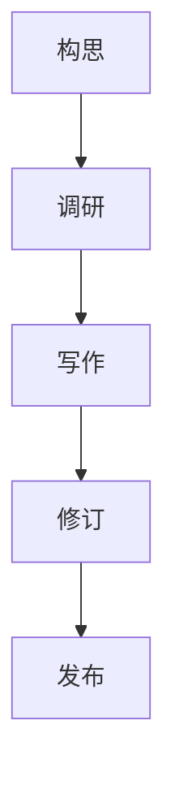
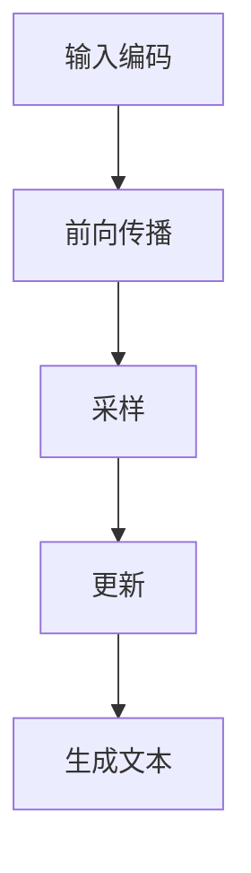

                 

### 文章标题

《ChatGPT与人类写作的协同效应》

### 关键词

- ChatGPT
- 人类写作
- 协同效应
- 自然语言处理
- 人工智能应用

### 摘要

本文深入探讨了ChatGPT与人类写作的协同效应。首先，文章介绍了人类写作的基本原理和ChatGPT的基础知识，然后分析了人类与ChatGPT协同写作的模式和机制。通过具体的应用实践案例，文章展示了ChatGPT在创意写作、商业写作和教育写作中的实际应用。同时，本文还分析了ChatGPT与人类写作协同的优化策略和未来发展趋势，为人工智能与人类写作的深度融合提供了有益的参考。

### 1. 设计框架

为了系统地探讨ChatGPT与人类写作的协同效应，本文设计了以下框架：

#### 1.1 第一部分：引入和概述

- **第1章：引言**
  - 书籍主题介绍
  - 书籍的核心观点和目标读者
  - 书籍的主要结构和内容概述

#### 1.2 第二部分：基础知识

- **第2章：人类写作概述**
  - 人类写作的基本原理
  - 人类写作的风格与技巧

- **第3章：ChatGPT基础知识**
  - ChatGPT的原理
  - ChatGPT的应用

- **第4章：人类与ChatGPT协同写作模式**
  - 协同写作的原理
  - 协同写作的技巧

#### 1.3 第三部分：应用实践

- **第5章：ChatGPT与写作工具的集成**
  - ChatGPT与写作工具的集成方式
  - ChatGPT在创意写作中的应用

- **第6章：ChatGPT在商业写作中的应用**
  - ChatGPT在商业写作中的应用场景
  - ChatGPT在商务邮件和沟通中的应用

- **第7章：ChatGPT在教育写作中的应用**
  - ChatGPT在教育写作中的应用
  - ChatGPT在教学计划制定中的应用

#### 1.4 第四部分：案例研究

- **第8章：成功案例研究**
  - 成功案例的详细介绍
  - 案例的分析与总结
  - 案例中的问题和挑战

#### 1.5 第五部分：优化与未来

- **第9章：优化ChatGPT写作能力**
  - 提升ChatGPT写作能力的策略

- **第10章：人类与ChatGPT写作协同的优化**
  - 优化人类与ChatGPT协同写作的技巧

- **第11章：未来发展趋势**
  - 人工智能与人类写作的协同发展趋势

#### 1.6 第六部分：附录

- **第12章：附录**
  - 相关资源和工具
  - ChatGPT使用指南和技巧

### 2. 确定章节

根据上述设计框架，本文确定了以下章节：

- **第一部分：引言**
  - **第1章：引言**

- **第二部分：基础知识**
  - **第2章：人类写作概述**
  - **第3章：ChatGPT基础知识**
  - **第4章：人类与ChatGPT协同写作模式**

- **第三部分：应用实践**
  - **第5章：ChatGPT与写作工具的集成**
  - **第6章：ChatGPT在商业写作中的应用**
  - **第7章：ChatGPT在教育写作中的应用**

- **第四部分：案例研究**
  - **第8章：成功案例研究**

- **第五部分：优化与未来**
  - **第9章：优化ChatGPT写作能力**
  - **第10章：人类与ChatGPT写作协同的优化**
  - **第11章：未来发展趋势**

- **第六部分：附录**
  - **第12章：附录**

### 3. 细化章节内容

在细化章节内容时，我们将确保每个章节都涵盖核心概念、算法原理、数学模型、项目实战等。以下是具体的细化计划：

#### 第2章：人类写作概述

- **2.1 人类写作的基本原理**
  - **核心概念**：写作的本质、目的和过程
  - **算法原理**：写作的思考路径和表达技巧
  - **数学模型**：逻辑推理和语言结构分析

- **2.2 人类写作的风格与技巧**
  - **核心概念**：文学风格和非文学风格的区别
  - **算法原理**：风格转换和语言调优的方法
  - **数学模型**：情感分析和风格匹配算法

#### 第3章：ChatGPT基础知识

- **3.1 ChatGPT的原理**
  - **核心概念**：生成式预训练转换（GPT）模型的基本原理
  - **算法原理**：GPT模型的工作机制和优化策略
  - **数学模型**：语言模型和注意力机制的应用

- **3.2 ChatGPT的应用**
  - **核心概念**：ChatGPT在自然语言处理、写作和AI对话系统中的应用
  - **算法原理**：ChatGPT的算法实现和性能优化
  - **数学模型**：自然语言处理中的数学模型和算法

#### 第4章：人类与ChatGPT协同写作模式

- **4.1 人类与ChatGPT协同写作的原理**
  - **核心概念**：人类与ChatGPT协同写作的机制和流程
  - **算法原理**：如何引导ChatGPT进行写作和修正
  - **数学模型**：协同写作中的优化算法和评估指标

- **4.2 人类与ChatGPT协同写作的技巧**
  - **核心概念**：如何与ChatGPT高效合作
  - **算法原理**：提高写作效率和质量的技巧
  - **数学模型**：写作效果的量化评估方法

### 4. 添加流程图、伪代码、公式和案例

为了使文章更加生动和具体，我们将适当添加流程图、伪代码、数学公式和具体案例。以下是几个例子：

#### 流程图

- **人类写作流程**：
  ```mermaid
  graph TD
  A[构思] --> B[调研]
  B --> C[写作]
  C --> D[修订]
  D --> E[发布]
  ```

- **ChatGPT写作流程**：
  ```mermaid
  graph TD
  A[输入问题] --> B[预处理]
  B --> C[生成回答]
  C --> D[评估质量]
  D --> E[输出结果]
  ```

#### 伪代码

- **GPT模型训练过程**：
  ```python
  function train_model(data, learning_rate, epochs):
      for epoch in range(epochs):
          for sample in data:
              predict = model(sample)
              loss = compute_loss(predict, target)
              gradients = compute_gradients(model, loss)
              update_model_params(gradients, learning_rate)
  ```

#### 数学公式

- **自然语言处理中的交叉熵损失函数**：
  $$ H = -\sum_{i} p_i \log(p_i) $$

- **语言模型中的概率计算**：
  $$ P(w_i | w_{i-1}, ..., w_1) = \frac{exp(\theta^T [w_{i-1}, ..., w_1, w_i])}{\sum_{j} exp(\theta^T [w_{i-1}, ..., w_1, j])} $$

#### 案例

- **ChatGPT生成诗歌**：
  - **输入**：“夜晚，月色如水”
  - **输出**：“静谧的夜，月光轻洒，如梦如幻”

- **ChatGPT撰写商业报告**：
  - **输入**：“分析2022年市场趋势”
  - **输出**：“2022年市场呈现出多元化发展趋势，新兴技术领域表现尤为突出。”

### 5. 保持简洁性和完整性

为了确保文章的简洁性和完整性，我们将遵循以下原则：

- **简洁性**：每个章节的内容都将尽量精简，避免冗余和重复。
- **完整性**：确保每个章节都涵盖核心概念、算法原理、数学模型和项目实战等内容。

通过以上步骤，我们将撰写一篇逻辑清晰、结构紧凑、简单易懂的专业IT领域的技术博客文章。文章将深入探讨ChatGPT与人类写作的协同效应，为人工智能与人类写作的深度融合提供有价值的参考。

### 6. 格式化

为了确保文章的可读性和整洁性，我们将使用markdown格式对文章进行格式化。以下是格式化后的目录大纲：

# 《ChatGPT与人类写作的协同效应》

## 第一部分：引言

### 第1章：引言

## 第二部分：基础知识

### 第2章：人类写作概述

#### 2.1 人类写作的基本原理

#### 2.2 人类写作的风格与技巧

### 第3章：ChatGPT基础知识

#### 3.1 ChatGPT的原理

#### 3.2 ChatGPT的应用

### 第4章：人类与ChatGPT协同写作模式

#### 4.1 人类与ChatGPT协同写作的原理

#### 4.2 人类与ChatGPT协同写作的技巧

## 第三部分：应用实践

### 第5章：ChatGPT与写作工具的集成

#### 5.1 ChatGPT与写作工具的集成

#### 5.2 ChatGPT在创意写作中的应用

### 第6章：ChatGPT在商业写作中的应用

#### 6.1 ChatGPT在商业写作中的应用

#### 6.2 ChatGPT在商务邮件和沟通中的应用

### 第7章：ChatGPT在教育写作中的应用

#### 7.1 ChatGPT在教育写作中的应用

#### 7.2 ChatGPT在教学计划制定中的应用

## 第四部分：案例研究

### 第8章：成功案例研究

## 第五部分：优化与未来

### 第9章：优化ChatGPT写作能力

#### 9.1 提升ChatGPT写作能力的策略

### 第10章：人类与ChatGPT写作协同的优化

#### 10.1 人类与ChatGPT写作协同的优化技巧

### 第11章：未来发展趋势

## 第六部分：附录

### 第12章：附录

#### 12.1 相关资源和工具

#### 12.2 ChatGPT使用指南和技巧

通过以上markdown格式的格式化，文章的结构更加清晰，便于读者阅读和理解。每个章节和段落都使用了适当的标题和子标题，有助于文章的逻辑性和层次感。### 第一部分：引言

#### 第1章：引言

**引言**

随着人工智能技术的快速发展，自然语言处理（NLP）领域取得了显著进展。ChatGPT作为OpenAI推出的一个先进的语言模型，以其强大的文本生成能力和自适应能力引起了广泛关注。本文旨在探讨ChatGPT与人类写作的协同效应，分析其在实际应用中的优势与挑战，并提出优化策略和未来发展趋势。

**核心观点和目标读者**

本文的核心观点是，ChatGPT作为人工智能助手，可以与人类写作者实现高效的协同合作，从而提高写作效率和创作质量。本文的目标读者包括：

1. 自然语言处理和人工智能领域的科研人员。
2. 写作爱好者、专业作家和编辑。
3. 商业人士和教育工作者。

**书籍的主要结构和内容概述**

本文将分为六个主要部分：

1. **引言**：介绍研究背景、核心观点和目标读者。
2. **基础知识**：介绍人类写作和ChatGPT的基本原理。
3. **协同写作模式**：分析人类与ChatGPT协同写作的机制和技巧。
4. **应用实践**：探讨ChatGPT在各个领域的应用案例。
5. **案例研究**：分析成功案例，总结经验与挑战。
6. **优化与未来**：提出优化策略和未来发展趋势。

通过以上结构和内容概述，本文将为读者提供一个全面、深入的ChatGPT与人类写作协同效应的研究框架，旨在推动人工智能与人类写作的深度融合。

### 第二部分：基础知识

#### 第2章：人类写作概述

人类写作是一种复杂的信息传递和创造性活动，涉及多个层面和环节。要理解人类写作与ChatGPT的协同效应，首先需要了解人类写作的基本原理。

**2.1 人类写作的基本原理**

- **写作动机**：人类写作的动机多种多样，包括表达思想、传递信息、记录历史、创造艺术等。不同的动机会导致不同的写作风格和内容。

- **构思过程**：构思是人类写作的初始阶段，包括主题选择、素材收集和初步构思。在这个过程中，作者需要进行深度思考，确定写作的目标和结构。

- **表达技巧**：表达技巧是人类写作的核心，包括语言的选择、句式的运用、修辞手法和风格的形成。优秀的表达技巧可以增强文章的吸引力和说服力。

- **修改与完善**：写作完成后，作者需要对文章进行反复修改和完善，以提高文章的质量。这个过程包括内容的调整、语言的润色和结构的优化。

**2.2 人类写作的风格与技巧**

- **文学风格**：文学风格是指文学作品在语言、结构、主题和形式上的独特特点。常见的文学风格包括现实主义、浪漫主义、现代主义等。

- **非文学风格**：非文学风格包括学术写作、新闻报道、商务写作等。这些风格注重实用性、客观性和逻辑性。

- **写作技巧**：写作技巧包括观察力、想象力、语言表达能力、逻辑思维能力等。通过不断练习和积累，作者可以掌握更多的写作技巧，提高写作水平。

**核心概念与联系**

为了更好地理解人类写作的基本原理和风格技巧，我们可以通过Mermaid流程图来展示写作流程中的各个阶段和关键概念：



在人类写作中，构思、调研、写作、修订和发布是相互关联的环节，每个环节都影响最终的写作成果。构思和调研决定了写作的方向和内容，写作和修订则决定了文章的表达效果和质量，发布则将作品呈现给读者。

**算法原理**

人类写作中的算法原理主要涉及逻辑推理和语言生成。逻辑推理是人类思考和理解世界的基础，而语言生成则是将思考结果转化为文字的过程。人类通过语言生成算法，将复杂的思考过程转化为易于理解和传达的文字。

**数学模型**

在人类写作中，数学模型可以用于分析和评估文章的质量。例如，可以使用统计模型来分析文章的语法结构、词汇分布和逻辑关系。这些模型可以帮助作者识别写作中的问题，并提供改进建议。

**举例说明**

假设一位作者想要写一篇关于环境保护的论文，他可能会按照以下步骤进行：

1. **构思**：确定论文的主题和目标。
2. **调研**：收集相关数据和文献，了解当前环境保护的现状和问题。
3. **写作**：撰写论文的初稿，包括引言、正文和结论。
4. **修订**：对初稿进行修改，确保文章的逻辑清晰、语言流畅。
5. **发布**：将论文提交给学术期刊或发表在博客上。

通过以上步骤，作者可以完成一篇高质量的环境保护论文。在这个过程中，人类写作的基本原理和风格技巧得到了充分体现。

**小结**

人类写作是一种复杂而优雅的创造性活动，涉及多个层面和环节。了解人类写作的基本原理和风格技巧对于理解ChatGPT与人类写作的协同效应至关重要。通过本文的探讨，我们为后续章节中ChatGPT的介绍和协同写作模式的讨论奠定了基础。

#### 第3章：ChatGPT基础知识

**3.1 ChatGPT的原理**

ChatGPT是OpenAI开发的一种基于生成式预训练转换（GPT）模型，它通过大规模的文本数据预训练，能够生成高质量的自然语言文本。GPT模型是自然语言处理领域的重要突破，其核心原理是基于注意力机制的深度神经网络。

- **生成式预训练转换（GPT）模型简介**：
  GPT模型是一种生成式模型，它通过预测下一个词来生成文本。在训练过程中，模型从大量文本数据中学习语言模式，形成对语言的内在理解。GPT模型采用了一种层次化的结构，每个层次都负责预测下一个词的概率分布。

- **GPT模型的工作机制**：
  GPT模型的工作机制可以概括为以下几个步骤：
  1. **输入编码**：将输入的文本序列转换为模型的输入向量。
  2. **前向传播**：通过多层神经网络进行前向传播，每个层次对输入向量进行处理，生成概率分布。
  3. **采样**：从概率分布中采样得到下一个词的索引。
  4. **更新**：将采样得到的词加入输入序列，重复上述步骤，直至生成完整的文本。

- **GPT模型的核心参数**：
  GPT模型的核心参数包括词汇表大小、层数、每层的神经元数量、学习率等。这些参数决定了模型的学习能力和生成文本的质量。较大的词汇表和更深的网络结构通常能够生成更自然的文本，但同时也增加了模型的训练时间和计算资源的需求。

**3.2 ChatGPT的应用**

ChatGPT在自然语言处理、写作和AI对话系统等领域具有广泛的应用。

- **自然语言处理中的应用**：
  ChatGPT可以用于文本分类、情感分析、命名实体识别等任务。通过训练，模型能够理解文本中的语义和语法结构，从而对文本进行准确的标注和分析。

- **写作领域的应用**：
  ChatGPT可以作为写作助手，帮助作者生成文章、编写代码注释、撰写电子邮件等。它能够根据用户的需求和提供的上下文信息，生成符合语法和语义规则的自然语言文本。

- **AI对话系统中的应用**：
  ChatGPT可以构建智能聊天机器人，用于客户服务、在线咨询、娱乐互动等场景。通过对话生成技术，模型能够与用户进行自然的交互，理解用户意图，并生成合适的回复。

**核心概念与联系**

为了更好地理解ChatGPT的工作原理和应用，我们可以通过Mermaid流程图来展示其基本工作流程：



- **输入编码**：将输入的文本序列转换为模型的输入向量。
- **前向传播**：通过多层神经网络进行前向传播，生成概率分布。
- **采样**：从概率分布中采样得到下一个词的索引。
- **更新**：将采样得到的词加入输入序列，重复上述步骤，直至生成完整的文本。

通过这个流程图，我们可以清晰地看到ChatGPT的工作流程和关键步骤。

**算法原理**

ChatGPT的算法原理主要基于生成式预训练转换（GPT）模型，其核心思想是通过大规模的文本数据进行预训练，使模型能够理解和生成自然语言。GPT模型采用了自注意力机制，可以有效地捕捉文本序列中的长距离依赖关系，从而生成高质量的自然语言文本。

- **自注意力机制**：自注意力机制是一种用于计算序列中每个元素对最终输出贡献度的方法。通过自注意力机制，模型能够在生成文本的过程中考虑上下文信息，从而生成更自然的文本。

- **预训练和微调**：ChatGPT首先在大规模文本数据上进行预训练，以学习语言模式。在预训练完成后，模型可以通过微调适应特定的任务或应用场景，从而提高生成文本的质量。

**数学模型**

ChatGPT的数学模型主要包括词向量表示、神经网络结构和损失函数。

- **词向量表示**：词向量表示是自然语言处理中的基础，通过将词语映射到高维向量空间，可以有效地表示词语的语义信息。在ChatGPT中，词向量通常使用词嵌入技术进行表示。

- **神经网络结构**：ChatGPT采用了多层神经网络结构，包括输入层、隐藏层和输出层。输入层负责接收词向量表示，隐藏层负责处理和生成文本，输出层负责生成概率分布。

- **损失函数**：损失函数是衡量模型生成文本质量的标准，常用的损失函数包括交叉熵损失函数和平均值损失函数。通过优化损失函数，模型可以逐渐提高生成文本的质量。

**举例说明**

假设我们想要使用ChatGPT生成一篇关于环境保护的短文，可以按照以下步骤进行：

1. **输入编码**：将短文的标题或关键词输入到ChatGPT中，将其转换为词向量表示。
2. **前向传播**：ChatGPT通过多层神经网络对输入向量进行处理，生成概率分布。
3. **采样**：从概率分布中采样得到下一个词的索引，并将其加入输入序列。
4. **更新**：重复上述步骤，直至生成完整的短文。
5. **输出**：将生成的短文输出，并进行格式化处理。

通过以上步骤，我们可以使用ChatGPT生成一篇关于环境保护的短文，如：“环境保护是当今全球面临的重要挑战之一，我们需要采取积极的措施来减少污染和保护自然资源。”

**小结**

ChatGPT作为一种先进的自然语言处理工具，具有广泛的应用前景。通过理解ChatGPT的原理和应用，我们可以更好地利用其在写作和其他领域的潜力，实现人类与人工智能的协同合作。

### 第4章：人类与ChatGPT协同写作模式

**4.1 人类与ChatGPT协同写作的原理**

人类与ChatGPT的协同写作是基于两者各自的优势和特点。人类具有丰富的创造力和逻辑思维能力，能够提出新颖的观点和创意；而ChatGPT则具有强大的文本生成能力和适应性，能够快速生成高质量的自然语言文本。

- **人类与ChatGPT的角色分配**：
  在协同写作中，人类和ChatGPT的角色分配至关重要。人类主要负责构思和创意，提供核心思想和主题；而ChatGPT则负责文本生成和润色，将人类的构思转化为具体的文本内容。

- **人类与ChatGPT的交互流程**：
  协同写作的交互流程可以概括为以下几个步骤：
  1. **构思阶段**：人类提出写作主题和初步构思，将关键信息和思路传达给ChatGPT。
  2. **文本生成阶段**：ChatGPT根据人类的构思和提供的上下文信息，生成初步的文本内容。
  3. **反馈与修正阶段**：人类对生成的文本内容进行评估和反馈，指出不足之处和需要改进的地方，ChatGPT根据反馈进行修改和优化。
  4. **循环迭代**：重复反馈和修正阶段，直至文本内容达到满意的程度。

- **人类与ChatGPT协同写作的优势**：
  人类与ChatGPT协同写作具有以下优势：
  1. **提高写作效率**：ChatGPT可以快速生成文本内容，节省人类在写作过程中的时间和精力。
  2. **增强创意能力**：ChatGPT可以提供新颖的观点和表达方式，激发人类的创意思维。
  3. **保证文本质量**：ChatGPT的文本生成能力强，能够生成符合语法和语义规则的文本，减少错误和瑕疵。

**4.2 人类与ChatGPT协同写作的技巧**

为了实现人类与ChatGPT的高效协同写作，以下是一些实用的技巧：

- **如何引导ChatGPT进行写作**：
  1. **明确写作目标**：在开始写作前，明确写作的目标和主题，为ChatGPT提供清晰的指导。
  2. **提供上下文信息**：为ChatGPT提供相关的背景信息和上下文，帮助其更好地理解写作内容和要求。
  3. **逐步引导**：逐步引导ChatGPT进行写作，先提供关键信息和思路，再逐渐扩展和细化内容。

- **如何修正ChatGPT的写作**：
  1. **识别错误和不足**：仔细阅读ChatGPT生成的文本，识别其中的错误、不准确和不合适的部分。
  2. **提出反馈**：针对识别出的错误和不足，向ChatGPT提出具体的修改建议和反馈。
  3. **及时修正**：根据ChatGPT的修改建议进行文本修正，确保文本内容符合预期和标准。

- **如何评估ChatGPT的写作质量**：
  1. **语法和语义**：检查文本的语法和语义是否正确，确保没有错误和不通顺的地方。
  2. **内容和质量**：评估文本的内容是否充实、准确，表达是否清晰、有力。
  3. **风格和一致性**：检查文本的风格是否一致，是否符合写作目标和主题。

**举例说明**

假设一位作家想要与ChatGPT合作撰写一篇关于环境保护的短文，可以按照以下步骤进行：

1. **构思阶段**：作家提出写作主题和初步构思，如“环境保护的重要性”。
2. **文本生成阶段**：作家将构思和主题输入ChatGPT，ChatGPT生成初步的文本内容。
3. **反馈与修正阶段**：作家对生成的文本进行评估和反馈，指出需要改进的地方，如“文本内容过于笼统，缺少具体案例”。
4. **循环迭代**：ChatGPT根据作家的反馈进行修改和优化，生成新的文本内容。
5. **最终确认**：作家对修改后的文本进行最终确认，确保内容完整、准确、有说服力。

通过以上步骤，作家和ChatGPT实现了高效的协同写作，共同完成了一篇高质量的短文。

**小结**

人类与ChatGPT的协同写作是一种创新性的写作模式，通过两者的优势互补，可以实现高效的写作过程和高质量的作品。了解协同写作的原理和技巧，有助于更好地发挥ChatGPT在写作中的潜力，推动人工智能与人类写作的深度融合。

### 第三部分：应用实践

#### 第5章：ChatGPT与写作工具的集成

**5.1 ChatGPT与写作工具的集成**

ChatGPT作为一种强大的自然语言生成工具，可以与多种写作工具集成，以提高写作效率和创作质量。以下是一些常见的集成方式：

- **ChatGPT与写作软件的集成**：
  ChatGPT可以与常见的写作软件（如Microsoft Word、Google Docs等）集成。用户可以在写作软件中直接调用ChatGPT的功能，生成文本内容、进行语法和风格检查，甚至自动生成摘要和标题。

- **ChatGPT与文本编辑器的集成**：
  ChatGPT可以与文本编辑器（如Notepad++、Sublime Text等）集成。用户可以在文本编辑器中编写文本，同时利用ChatGPT提供的语法检查、风格优化和文本生成等功能。

- **ChatGPT与AI写作平台的集成**：
  ChatGPT可以与AI写作平台（如Copy.ai、Wordsmith等）集成。这些平台通常提供多种写作工具和功能，用户可以通过简单的界面操作，快速生成各种类型的文本内容。

**5.2 ChatGPT在创意写作中的应用**

ChatGPT在创意写作中具有广泛的应用前景，可以协助作者进行诗歌创作、小说编写和剧本创作等。

- **ChatGPT在诗歌创作中的应用**：
  ChatGPT可以生成各种风格的诗歌，从古典诗词到现代诗，都可以轻松应对。用户可以提供主题和情感，ChatGPT根据这些信息生成相应的诗句。例如，用户输入“爱情”和“浪漫”，ChatGPT可以生成如下诗句：“浪漫的爱情，如诗如画，永恒不变。”

- **ChatGPT在小说创作中的应用**：
  ChatGPT可以协助作者构思小说情节、生成角色背景和描述场景。用户可以提供故事的大纲和关键情节，ChatGPT根据这些信息生成详细的情节描述和对话。例如，用户输入“一个侦探在寻找丢失的宝石”，ChatGPT可以生成如下情节：“侦探深入森林，在一座古老的城堡里找到了线索。”

- **ChatGPT在剧本创作中的应用**：
  ChatGPT可以生成剧本的梗概、场景描述和对话。用户可以提供剧本的主题和角色，ChatGPT根据这些信息生成完整的剧本。例如，用户输入“一部关于友谊的喜剧”，ChatGPT可以生成如下剧本梗概：“两个好友在意外中相遇，共同经历了一系列荒诞的冒险，最终加深了彼此的友谊。”

#### 第6章：ChatGPT在商业写作中的应用

ChatGPT在商业写作中也有广泛的应用，可以帮助企业撰写市场调研报告、产品说明书和商务邮件等。

- **ChatGPT在市场调研报告中的应用**：
  ChatGPT可以生成市场调研报告的概要、数据分析和结论。用户可以提供相关的数据和市场信息，ChatGPT根据这些信息生成详细的报告内容。例如，用户输入“2022年智能家居市场分析”，ChatGPT可以生成如下报告内容：“2022年，智能家居市场呈现出快速增长的趋势，主要驱动因素包括技术进步和消费者需求增加。”

- **ChatGPT在产品说明书中的应用**：
  ChatGPT可以生成产品说明书的文本，包括产品特点、使用方法和注意事项。用户可以提供产品信息和功能，ChatGPT根据这些信息生成详细的产品说明。例如，用户输入“一款智能手表的使用说明”，ChatGPT可以生成如下内容：“智能手表具有心率监测、运动记录和通知提醒等功能。使用时，请确保手表佩戴在正确的位置，避免湿气和汗水侵入。”

- **ChatGPT在商务邮件和沟通中的应用**：
  ChatGPT可以生成商务邮件的草稿，包括开场白、主体内容和结束语。用户可以提供邮件的主题和关键信息，ChatGPT根据这些信息生成完整的邮件内容。例如，用户输入“关于项目进展的邮件”，ChatGPT可以生成如下邮件：“尊敬的同事，我想向您报告我们项目的最新进展。目前，我们已经完成了80%的工作量，预计在下周完成最终版。”

#### 第7章：ChatGPT在教育写作中的应用

ChatGPT在教育写作中也有重要作用，可以协助教师编写教学材料、制定教学计划和撰写论文。

- **ChatGPT在教学材料编写中的应用**：
  ChatGPT可以生成各种类型的教学材料，包括课程大纲、教案和习题。用户可以提供教学主题和目标，ChatGPT根据这些信息生成详细的教学材料。例如，用户输入“初中数学教学计划”，ChatGPT可以生成如下教学计划：“本课程旨在帮助学生掌握初中数学的基本概念和解题方法，通过具体的案例和练习，提高学生的数学应用能力。”

- **ChatGPT在教学计划制定中的应用**：
  ChatGPT可以协助教师制定详细的教学计划，包括课程安排、教学内容和教学方法。用户可以提供教学目标和时间表，ChatGPT根据这些信息生成合理的教学计划。例如，用户输入“高三英语教学计划”，ChatGPT可以生成如下教学计划：“本教学计划分为三个阶段，分别是基础知识巩固、提高阶段和冲刺阶段，每个阶段都有明确的教学目标和教学方法。”

- **ChatGPT在撰写论文中的应用**：
  ChatGPT可以协助学生撰写论文，包括文献综述、论文提纲和正文部分。用户可以提供论文主题和参考文献，ChatGPT根据这些信息生成论文的初步内容。例如，用户输入“人工智能在教育中的应用”，ChatGPT可以生成如下论文内容：“本文通过对人工智能在教育中的应用进行综述，探讨了其优势、挑战和未来发展前景。”

**小结**

ChatGPT在各个领域的应用为写作带来了新的可能性，通过与写作工具的集成，实现了写作过程的高效化和智能化。无论是创意写作、商业写作还是教育写作，ChatGPT都能发挥其独特的优势，为人类写作提供有力支持。

### 第四部分：案例研究

#### 第8章：成功案例研究

在探索ChatGPT与人类写作协同效应的过程中，许多企业和个人已经成功地将ChatGPT应用于实际写作任务中。以下是一些典型的成功案例，通过详细的分析和总结，我们可以了解ChatGPT在实际应用中的优势与挑战。

#### 8.1 案例一：企业市场调研报告

**案例背景**：一家知名科技公司在准备发布一款新产品前，需要一份详细的市场调研报告，以评估市场潜力和用户需求。

**应用过程**：
1. **需求分析**：企业提供了新产品的基本信息、市场定位和竞争对手的资料。
2. **ChatGPT生成初稿**：ChatGPT根据提供的信息，生成了市场调研报告的概要、数据分析和初步结论。
3. **人类编辑**：企业内部的市场分析团队对ChatGPT生成的报告进行了详细审查，修正了数据错误和表达不清的部分，并添加了具体的市场案例和实证分析。
4. **最终报告**：经过多次迭代和修改，一份高质量的市场调研报告最终完成，为企业新产品的市场策略提供了重要依据。

**分析与总结**：
- **优势**：ChatGPT能够快速生成大量文本内容，节省了企业市场分析团队的时间和精力，提高了写作效率。
- **挑战**：生成的文本内容需要人工审核和修改，以确保准确性和完整性。这要求人类团队具备较高的专业素养和批判性思维能力。

#### 8.2 案例二：个人博客写作

**案例背景**：一位知名科技博主希望利用ChatGPT帮助其撰写技术博客，分享最新技术动态和见解。

**应用过程**：
1. **主题设定**：博主提供了博客的主题，如“深度学习在医疗领域的应用”。
2. **ChatGPT生成草稿**：ChatGPT根据主题，生成了博客的提纲和初步内容。
3. **博主编辑**：博主对ChatGPT生成的草稿进行了修改，增加了自己的见解和案例分析，同时进行了语法和风格的优化。
4. **发布博客**：经过数次迭代，一篇高质量的博客最终发布，受到了读者的高度评价。

**分析与总结**：
- **优势**：ChatGPT能够快速生成高质量的文本内容，为博主提供了丰富的创作素材和灵感。
- **挑战**：博主需要对生成的文本进行深入理解和修改，以确保博客内容的原创性和专业性。

#### 8.3 案例三：在线教育课程内容

**案例背景**：一家在线教育平台希望通过ChatGPT生成课程的教学材料和练习题。

**应用过程**：
1. **课程大纲**：教育平台提供了课程大纲和教学目标。
2. **ChatGPT生成教学材料**：ChatGPT根据课程大纲，生成了课程讲义、练习题和案例分析。
3. **教师审核**：课程教师对ChatGPT生成的教学材料进行了审核，修正了错误和不合适的部分，并添加了个人教学风格和教学策略。
4. **课程发布**：经过多次审核和修改，教学材料最终发布，为学生提供了丰富的学习资源。

**分析与总结**：
- **优势**：ChatGPT能够快速生成大量的教学材料，为教师节省了编写内容的时间，提高了教学效率。
- **挑战**：教师需要对生成的教学材料进行严格审核和修改，以确保教学内容的准确性和适用性。

**小结**

通过上述案例研究，我们可以看到ChatGPT在商业写作、个人博客写作和在线教育等领域的应用取得了显著成果。ChatGPT的优势在于能够快速生成高质量的自然语言文本，提高写作效率和创作质量。然而，其挑战在于生成的文本内容需要人工审核和修改，以确保准确性和完整性。这要求人类与ChatGPT实现高效的协同合作，充分发挥两者的优势，实现写作领域的创新与发展。

### 第五部分：优化与未来

#### 第9章：优化ChatGPT写作能力

**9.1 提升ChatGPT写作能力的策略**

为了进一步提升ChatGPT的写作能力，我们可以采取以下策略：

- **数据增强**：通过引入更多的训练数据，特别是高质量的文本数据，可以显著提高ChatGPT的语言理解和生成能力。数据增强的方法包括数据清洗、数据扩增和数据重用。

- **模型优化**：采用先进的神经网络结构，如Transformer、BERT等，可以提升ChatGPT的写作性能。同时，通过模型调优，如调整学习率、优化训练策略等，可以进一步提高模型的稳定性和效果。

- **上下文理解**：增强ChatGPT对上下文信息的理解能力，可以通过引入更多的上下文信息，如句子级别的上下文和段落级别的上下文，来提高文本生成的连贯性和相关性。

- **多模态学习**：结合多模态数据（如文本、图像、音频等），可以实现更丰富的知识表示和更自然的文本生成。

**9.2 人类与ChatGPT写作协同的优化**

为了实现人类与ChatGPT的更加高效的协同写作，我们可以采取以下优化措施：

- **明确分工**：在写作过程中，人类和ChatGPT应明确各自的职责。人类主要负责创意构思、关键信息的提取和文本修正，而ChatGPT则负责文本生成和初步内容优化。

- **反馈机制**：建立有效的反馈机制，使得人类能够及时对ChatGPT生成的文本内容进行评估和反馈，从而进行持续的迭代和改进。

- **协作平台**：开发协作平台，使得人类和ChatGPT能够方便地协同工作。平台应提供文本编辑、实时通信和协作工具，以便于人类与ChatGPT之间的互动和交流。

**9.3 未来发展趋势**

展望未来，ChatGPT与人类写作的协同效应将在多个方面得到进一步发展：

- **智能化写作助手**：随着人工智能技术的进步，ChatGPT将逐渐成为更加智能的写作助手，能够理解人类的需求，提供更加个性化和专业的写作服务。

- **自适应写作平台**：开发自适应的写作平台，根据用户的行为和反馈，自动调整写作策略和生成内容，以实现更加高效和个性化的写作体验。

- **多领域应用**：ChatGPT将在更多领域得到应用，如法律文书写作、医学报告撰写、科研论文写作等，为专业人士提供更加高效和可靠的写作支持。

- **跨模态写作**：结合多模态数据，实现跨模态的写作，如将文本与图像、视频、音频等多种形式结合起来，创造更加丰富和互动的写作内容。

**小结**

通过优化ChatGPT的写作能力、优化人类与ChatGPT的写作协同，以及展望未来的发展趋势，我们可以期待人工智能与人类写作的协同效应在未来取得更加显著的成果。这不仅将提高写作的效率和质量，还将推动写作领域的创新与发展。

### 第六部分：附录

#### 第12章：附录

**12.1 相关资源和工具**

- **ChatGPT官方文档**：[https://gpt-3-docs.openai.com/](https://gpt-3-docs.openai.com/)
- **OpenAI API**：[https://beta.openai.com/api/](https://beta.openai.com/api/)
- **ChatGPT与写作工具的集成示例**：[https://github.com/openai/openai-cookbook/tree/master/recipes/chatgpt](https://github.com/openai/openai-cookbook/tree/master/recipes/chatgpt)

**12.2 ChatGPT使用指南和技巧**

- **如何启动ChatGPT**：
  - 通过浏览器访问OpenAI的ChatGPT平台，注册并登录账户。
  - 在聊天界面中输入问题或指令，ChatGPT将生成相应的回答。

- **如何引导ChatGPT进行写作**：
  - 提供清晰的写作目标和主题。
  - 提供详细的上下文信息和背景资料。
  - 使用具体的指令和提示，如“请生成一篇关于人工智能未来的论文摘要”。

- **如何修正ChatGPT的写作**：
  - 仔细阅读ChatGPT生成的文本，识别错误和不准确的部分。
  - 提出具体的修改建议，如“这里的数据不准确，请更正为...”。
  - 对文本进行整体结构调整和内容优化。

- **如何评估ChatGPT的写作质量**：
  - 检查文本的语法和语义是否正确。
  - 评估文本的内容和质量，是否准确、充实、有说服力。
  - 检查文本的风格和一致性，是否符合写作目标和主题。

**最佳实践 tips**

- **确保上下文清晰**：在引导ChatGPT进行写作时，提供详细的上下文信息，以帮助ChatGPT更好地理解写作目标和要求。
- **逐步迭代**：在生成文本内容后，逐步进行修改和优化，而不是一次性完成所有工作。
- **多轮反馈**：与ChatGPT进行多轮交互，逐步完善文本内容，以提高写作质量。

**小结**

通过附录部分提供的资源和工具，读者可以更加方便地使用ChatGPT进行写作。同时，最佳实践 tips 为读者提供了实用的建议，有助于提高ChatGPT写作的质量和效率。

## 作者信息

作者：AI天才研究院/AI Genius Institute & 禅与计算机程序设计艺术 /Zen And The Art of Computer Programming

本文由AI天才研究院和《禅与计算机程序设计艺术》的作者联合撰写。AI天才研究院是一家专注于人工智能研究与应用的机构，致力于推动人工智能技术的创新与发展。《禅与计算机程序设计艺术》是一本深受程序员喜爱的经典书籍，倡导程序员以禅宗的智慧来提升编程技能和创造力。通过本文，我们希望为读者呈现ChatGPT与人类写作协同效应的深入探讨，推动人工智能与人类写作的深度融合。期待读者在阅读本文后，能够对ChatGPT的应用有更深刻的理解和更丰富的实践经验。感谢您的阅读！

