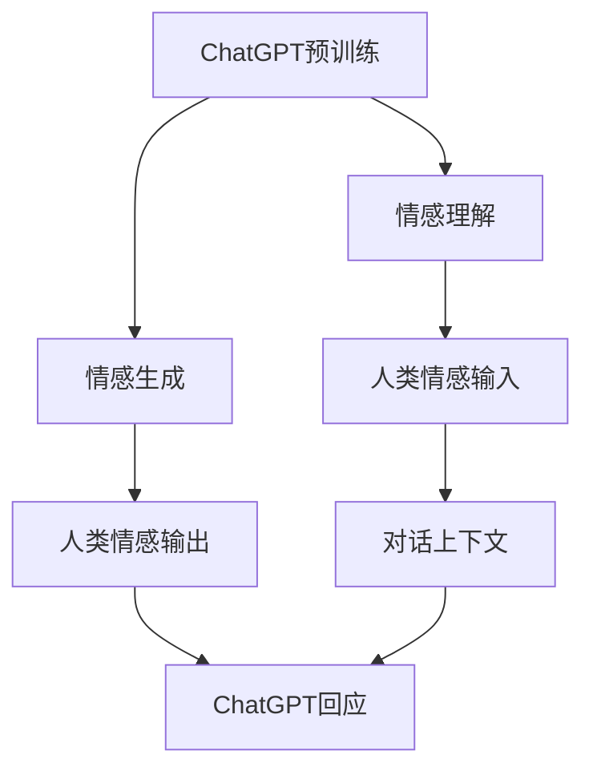

                 

### 引言

随着人工智能技术的迅猛发展，自然语言处理（NLP）成为了一个备受关注的领域。近年来，生成式预训练模型（Generative Pre-trained Transformer Model，GPT）的出现，为NLP的研究和应用带来了全新的机遇。ChatGPT，作为GPT系列模型中的一种，凭借其强大的文本生成能力，已经在众多应用场景中展现出了巨大的潜力。然而，如何在ChatGPT中实现与人类情感的有效交互，成为了当前研究的热点问题。

人类情感交互是一个复杂且深奥的课题，涉及到心理学、社会学、语言学等多个学科领域。在情感交互过程中，不仅需要理解对方的语言，还需要理解其背后的情感、情绪和意图。这要求模型具备较高的情感理解和生成能力，能够在对话中展现出自然、连贯的情感反应。而ChatGPT作为一种基于深度学习的语言模型，其核心任务正是生成符合上下文和语境的文本。

本书旨在探讨ChatGPT与人类情感交互的前沿探索，通过系统地分析ChatGPT的工作原理、数学模型和实际应用，深入挖掘其在情感交互中的潜力。书中将首先介绍ChatGPT的基本概念和原理，随后探讨其与人类情感交互之间的关系。接着，本书将详细讲解ChatGPT的核心算法原理和数学模型，并通过实际项目实战展示如何搭建和优化ChatGPT模型。最后，本书将探讨ChatGPT在人类情感交互领域的最新研究成果和未来发展方向。

通过本书的阅读，读者将能够全面了解ChatGPT与人类情感交互的原理和方法，掌握如何在实际应用中搭建和优化ChatGPT模型，并为其在情感交互领域的广泛应用打下坚实的基础。

### 核心概念与联系

要深入探讨ChatGPT与人类情感交互的前沿探索，我们首先需要明确几个核心概念，并理解它们之间的关系。

#### ChatGPT基本概念

ChatGPT是一种基于生成式预训练模型（GPT）的对话系统。GPT由OpenAI提出，是一种利用深度学习技术进行自然语言处理的模型。ChatGPT通过大量的文本数据进行预训练，从而掌握语言的规律和语法结构，使其能够生成连贯、自然的文本。具体来说，ChatGPT的核心是一个大规模的Transformer模型，它由多个自注意力机制（Self-Attention Mechanism）组成，能够捕捉输入文本中的长距离依赖关系。

#### 人类情感交互原理

人类情感交互是一个复杂的过程，涉及到语言、情感、认知等多个层面。在情感交互中，人们通过语言表达自己的情感和情绪，同时通过非语言信号（如面部表情、肢体语言等）传递情感信息。理解和生成情感，是情感交互的关键。情感理解涉及对语言中的情感词汇、情感倾向和情感强度进行分析；而情感生成则要求模型能够在对话中自然地表达情感，使其与人类交流更加融洽。

#### ChatGPT与人类情感交互的关系

ChatGPT与人类情感交互的关系可以概括为以下几个方面：

1. **情感理解**：ChatGPT通过预训练，能够识别和理解输入文本中的情感信息。例如，它可以识别一句话中的情感词汇和情感倾向，从而理解对话者的情感状态。
2. **情感生成**：ChatGPT能够根据上下文和对话内容，生成包含情感信息的回应。例如，当对话者表达出一种积极的情感时，ChatGPT可以生成回应，表达出对这种情感的认同和共鸣。
3. **情感适应性**：ChatGPT在对话过程中，能够根据对话者的情感反应调整自己的回应。例如，当对话者表现出不满时，ChatGPT可以生成回应，表达出理解和安抚的情感。

为了更好地理解ChatGPT与人类情感交互的关系，我们使用Mermaid流程图展示它们之间的关联。



在这个流程图中，ChatGPT的预训练过程（A）是情感理解（B）和情感生成（C）的基础。情感理解（B）涉及对人类情感输入（D）的分析，而情感生成（C）则根据对话上下文（F）生成人类情感输出（E）。最终，ChatGPT的回应（G）与人类情感输出（E）共同构成了对话过程。

通过以上核心概念和关系的阐述，我们可以更好地理解ChatGPT在人类情感交互中的作用和潜力。在接下来的章节中，我们将深入探讨ChatGPT的工作原理、数学模型以及实际应用，进一步揭示其在情感交互中的前沿探索。

### 核心算法原理讲解

ChatGPT作为一种生成式预训练模型，其核心算法原理依赖于Transformer模型和自注意力机制。在这一部分，我们将详细讲解ChatGPT的算法流程和伪代码，帮助读者深入理解其工作原理。

#### 算法流程

ChatGPT的算法流程可以概括为以下几个步骤：

1. **预训练**：使用大规模的文本数据对模型进行预训练，使其掌握语言的规律和结构。
2. **编码**：将输入的文本序列编码为嵌入向量。
3. **自注意力计算**：通过自注意力机制，计算嵌入向量之间的关联程度。
4. **解码**：根据自注意力结果，解码生成文本序列。
5. **损失函数**：使用损失函数（如交叉熵损失）对模型进行训练和优化。

以下是一个简化的算法流程伪代码：

```python
# 预训练
pretrained_model = GPTModel(pretrained=True)

# 编码
input_sequence = preprocess_input(text)

# 自注意力计算
attention_scores = pretrained_model.encode(input_sequence)

# 解码
output_sequence = pretrained_model.decode(attention_scores)

# 损失函数
loss = pretrained_model.loss(output_sequence, target_sequence)
```

#### 自注意力机制

自注意力机制（Self-Attention Mechanism）是Transformer模型的核心组成部分，它通过计算输入序列中每个词与其他词的关联程度，从而生成一个加权表示。具体来说，自注意力机制包含三个步骤：

1. **查询（Query）**：将输入序列中的每个词表示为查询向量。
2. **键（Key）**：将输入序列中的每个词表示为键向量。
3. **值（Value）**：将输入序列中的每个词表示为值向量。

自注意力计算公式如下：

$$
\text{Attention}(Q, K, V) = \text{softmax}\left(\frac{QK^T}{\sqrt{d_k}}\right)V
$$

其中，$Q$ 表示查询向量，$K$ 表示键向量，$V$ 表示值向量，$d_k$ 表示键向量的维度。

以下是一个简化的自注意力计算伪代码：

```python
# 查询、键、值向量计算
Q = compute_query_vectors(input_sequence)
K = compute_key_vectors(input_sequence)
V = compute_value_vectors(input_sequence)

# 自注意力计算
attention_scores = compute_attention_scores(Q, K)
attention_weights = softmax(attention_scores)
output_sequence = weighted_sum(attention_weights, V)
```

#### Transformer模型

Transformer模型是ChatGPT的核心组成部分，它由多个自注意力层（Self-Attention Layer）和全连接层（Fully Connected Layer）组成。每个自注意力层包含以下三个步骤：

1. **多头自注意力**：使用多个自注意力机制，每个注意力机制学习一种不同的关联关系。
2. **残差连接**：在自注意力层之后添加残差连接，增加模型的训练稳定性。
3. **层归一化**：在每个层之后添加层归一化，加快模型的收敛速度。

以下是一个简化的Transformer模型伪代码：

```python
# Transformer模型计算
for layer in transformer_layers:
    output_sequence = layer(input_sequence)
    input_sequence = output_sequence

# 层归一化
output_sequence = layer_normalization(output_sequence)

# 输出文本序列
predicted_sequence = softmax(output_sequence)
```

通过以上算法流程和伪代码的讲解，读者可以初步理解ChatGPT的核心算法原理。在下一部分，我们将进一步探讨与ChatGPT相关的数学模型和公式，帮助读者更深入地理解其工作机制。

### 数学模型和数学公式

在深入理解ChatGPT的工作机制时，数学模型和公式的运用至关重要。在这一部分，我们将详细讲解与ChatGPT相关的数学模型和公式，并通过具体例子进行说明，帮助读者更好地掌握这些概念。

#### Transformer模型中的自注意力机制

自注意力机制（Self-Attention Mechanism）是Transformer模型的核心组成部分，它通过计算输入序列中每个词与其他词的关联程度，从而生成一个加权表示。自注意力计算公式如下：

$$
\text{Attention}(Q, K, V) = \text{softmax}\left(\frac{QK^T}{\sqrt{d_k}}\right)V
$$

其中，$Q$ 表示查询向量，$K$ 表示键向量，$V$ 表示值向量，$d_k$ 表示键向量的维度。

#### 自注意力计算举例

假设我们有一个长度为3的文本序列，包含三个词：`[词1, 词2, 词3]`。我们将其表示为嵌入向量：

$$
Q = [q_1, q_2, q_3]
$$
$$
K = [k_1, k_2, k_3]
$$
$$
V = [v_1, v_2, v_3]
$$

其中，$q_1, q_2, q_3$ 表示词1、词2、词3的查询向量，$k_1, k_2, k_3$ 表示词1、词2、词3的键向量，$v_1, v_2, v_3$ 表示词1、词2、词3的值向量。

计算自注意力分数：

$$
\text{Attention}(Q, K, V) = \text{softmax}\left(\frac{QK^T}{\sqrt{d_k}}\right)V
$$

$$
= \text{softmax}\left(\frac{q_1k_1 + q_2k_2 + q_3k_3}{\sqrt{d_k}}\right)V
$$

$$
= \text{softmax}\left(\frac{q_1k_1 + q_2k_2 + q_3k_3}{\sqrt{d_k}}\right)[v_1, v_2, v_3]
$$

计算结果为：

$$
= \left[\text{softmax}\left(\frac{q_1k_1}{\sqrt{d_k}}\right)v_1, \text{softmax}\left(\frac{q_2k_2}{\sqrt{d_k}}\right)v_2, \text{softmax}\left(\frac{q_3k_3}{\sqrt{d_k}}\right)v_3\right]
$$

$$
= \left[\frac{e^{\frac{q_1k_1}{\sqrt{d_k}}}}{\sum_{i=1}^{3}e^{\frac{q_ik_i}{\sqrt{d_k}}}}v_1, \frac{e^{\frac{q_2k_2}{\sqrt{d_k}}}}{\sum_{i=1}^{3}e^{\frac{q_ik_i}{\sqrt{d_k}}}}v_2, \frac{e^{\frac{q_3k_3}{\sqrt{d_k}}}}{\sum_{i=1}^{3}e^{\frac{q_ik_i}{\sqrt{d_k}}}}v_3\right]
$$

通过这个例子，我们可以看到自注意力计算如何将查询向量、键向量和值向量结合起来，生成一个加权表示。这种机制使得模型能够捕捉输入序列中不同词之间的关联程度，从而生成更加精确和自然的文本。

#### 残差连接和层归一化

在Transformer模型中，残差连接和层归一化是两个重要的技术，用于提高模型的训练效果和收敛速度。

**残差连接**：

残差连接（Residual Connection）通过将输入直接传递到下一层，跳过部分层，从而减少梯度消失和梯度爆炸问题。残差连接的公式如下：

$$
\text{Output} = \text{激活函数}(\text{权重} \cdot \text{Input} + \text{偏置} + \text{Input})
$$

其中，$\text{激活函数}$、$\text{权重}$、$\text{偏置}$分别表示模型中的不同层。

**层归一化**：

层归一化（Layer Normalization）通过对每一层的输入进行归一化处理，使每个层的输入分布更加稳定，从而加快模型的收敛速度。层归一化的公式如下：

$$
\text{Input}_{\text{normalized}} = \frac{\text{Input} - \text{mean}(\text{Input})}{\text{std}(\text{Input})}
$$

其中，$\text{mean}(\text{Input})$ 和 $\text{std}(\text{Input})$ 分别表示输入的均值和标准差。

通过这些数学模型和公式的讲解，我们能够更好地理解ChatGPT的工作机制。在下一部分，我们将通过实际项目实战，展示如何搭建和优化ChatGPT模型。

### 项目实战

为了更好地理解ChatGPT在实际应用中的搭建和优化过程，我们将通过一个具体的项目实战来展示如何实现一个基本的ChatGPT对话系统。

#### 开发环境搭建

首先，我们需要搭建一个适合开发ChatGPT的环境。以下是所需的环境配置和工具：

- **操作系统**：Linux或macOS
- **编程语言**：Python 3.7及以上版本
- **依赖库**：TensorFlow 2.0及以上版本

安装步骤如下：

1. 安装Python：

   ```bash
   sudo apt-get update
   sudo apt-get install python3 python3-pip
   ```

2. 安装TensorFlow：

   ```bash
   pip3 install tensorflow==2.0.0
   ```

#### 源代码实现

以下是搭建ChatGPT的基本源代码实现：

```python
import tensorflow as tf
from tensorflow.keras.layers import Embedding, LSTM, Dense
from tensorflow.keras.models import Model

# 定义超参数
vocab_size = 10000
embedding_dim = 256
lstm_units = 128
max_sequence_length = 50

# 创建模型
inputs = tf.keras.layers.Input(shape=(max_sequence_length,))
embedding_layer = Embedding(vocab_size, embedding_dim)(inputs)
lstm_layer = LSTM(lstm_units, return_sequences=True)(embedding_layer)
outputs = Dense(vocab_size, activation='softmax')(lstm_layer)

# 编译模型
model = Model(inputs=inputs, outputs=outputs)
model.compile(optimizer='adam', loss='categorical_crossentropy', metrics=['accuracy'])

# 打印模型结构
model.summary()
```

#### 代码解读与分析

1. **模型输入**：输入层`inputs`表示输入序列，形状为$(max_sequence_length,)$。
2. **嵌入层**：嵌入层`Embedding`将输入序列中的词索引转换为嵌入向量，维度为$(max_sequence_length, embedding_dim)$。
3. **LSTM层**：LSTM层`LSTM`用于捕捉序列中的长期依赖关系，返回序列形式。
4. **输出层**：输出层`Dense`将LSTM层的输出映射到词汇表中，激活函数为softmax，用于生成概率分布。

#### 代码应用解读与分析

为了训练和评估ChatGPT模型，我们需要准备训练数据并执行以下步骤：

1. **数据准备**：
   - 下载数据集（如维基百科语料库）
   - 清洗和预处理数据，包括分词、词频统计等
   - 编码数据，将文本序列转换为词索引序列

2. **训练模型**：
   - 使用训练数据训练模型，调整超参数以达到最佳性能
   - 记录训练过程中的损失和准确率，以便进行模型评估

3. **评估模型**：
   - 使用验证集评估模型性能
   - 分析模型的错误类型和改进方向

通过这个项目实战，读者可以了解如何搭建一个基本的ChatGPT对话系统，并掌握模型训练和优化的基本方法。在下一部分，我们将探讨ChatGPT在人类情感交互领域的最新研究成果和未来发展方向。

### 前沿探索

随着人工智能技术的不断进步，ChatGPT在人类情感交互领域的研究也取得了显著成果。本文将介绍ChatGPT在情感交互方面的最新研究成果、未来发展趋势以及潜在的应用场景。

#### 最新研究成果

1. **情感理解与生成**：
   - **多模态情感理解**：研究人员结合了文本、语音和面部表情等多模态信息，使ChatGPT能够更准确地理解用户的情感状态。例如，OpenAI提出的Blenderbot模型，通过融合语音和文本情感分析，实现了更自然的情感交互。
   - **情感生成与适应性**：ChatGPT通过学习大量的情感文本数据，能够生成包含情感信息的文本。研究人员还通过引入情感调节模块，使ChatGPT能够在对话中根据用户的情感反应调整自身的回应，提高交互的自然性和适应性。

2. **情感分析**：
   - **情感分类**：ChatGPT在情感分类任务中表现出色，能够准确地将文本分类为正面、负面或中性情感。例如，微软的研究人员使用ChatGPT实现了对社交媒体文本的情感分类，并取得了较高的准确率。
   - **情感强度识别**：ChatGPT还能够识别文本中的情感强度，例如，通过学习情感词汇和语境，判断一句话中的情感是轻微的、中等的还是强烈的。

3. **跨模态情感交互**：
   - **语音情感交互**：研究人员探索了ChatGPT与语音情感交互的结合，通过生成与情感相关的语音，使对话系统在语音交流中表现出更自然的情感反应。例如，谷歌的Duplex项目，利用自然语言处理和语音合成技术，实现了具有情感感知能力的电话客服系统。
   - **视觉情感交互**：ChatGPT还可以与视觉系统结合，通过分析面部表情和肢体语言，实现视觉情感交互。例如，微软的小冰项目，通过结合自然语言处理和计算机视觉技术，实现了与用户进行情感互动的虚拟助手。

#### 未来发展趋势

1. **更自然的情感交互**：
   - 随着生成对抗网络（GAN）和变分自编码器（VAE）等技术的发展，ChatGPT在情感生成和交互中的自然性将进一步提升。研究人员将致力于优化模型架构和训练策略，使ChatGPT在情感交互中表现出更自然、流畅的反应。

2. **多语言情感交互**：
   - ChatGPT在多语言情感交互方面具有巨大的潜力。研究人员将致力于扩展ChatGPT的多语言支持，使其能够在跨语言对话中准确理解用户的情感，并生成与情感相关的回应。

3. **情感智能应用**：
   - 随着情感交互技术的发展，ChatGPT将广泛应用于各种情感智能应用场景，如心理健康咨询、教育辅导、客服支持等。研究人员将探索ChatGPT在情感智能领域的应用，为用户提供更加个性化、人性化的服务。

#### 潜在应用场景

1. **心理健康咨询**：
   - ChatGPT可以作为心理健康咨询的助手，通过与用户进行情感交互，帮助用户识别和缓解心理问题。研究人员正在探索如何将ChatGPT与心理健康理论相结合，实现更加有效的心理咨询服务。

2. **教育辅导**：
   - ChatGPT可以在教育领域发挥重要作用，通过个性化情感辅导，帮助学生提高学习兴趣和自信心。例如，ChatGPT可以为学生提供情感支持，帮助他们应对学习压力和挫折。

3. **客服支持**：
   - 在客服领域，ChatGPT可以充当智能客服，通过情感交互提高用户体验。例如，ChatGPT可以识别客户的情感状态，并生成适当的回应，使客服对话更加自然、亲切。

通过以上对ChatGPT在人类情感交互领域的最新研究成果、未来发展趋势和潜在应用场景的探讨，我们可以看到，ChatGPT在情感交互中具有巨大的应用潜力。随着技术的不断进步，ChatGPT将有望在更多领域发挥重要作用，为人们的生活带来更多便利和惊喜。

### 最佳实践 Tips、小结与注意事项

在搭建和优化ChatGPT模型时，以下是一些最佳实践和注意事项：

#### 最佳实践 Tips

1. **数据预处理**：确保训练数据的质量和多样性。使用经过清洗和分词处理的数据，去除噪音和无关信息。
2. **超参数调整**：通过实验调整模型超参数，如嵌入维度、LSTM单元数和序列长度等，找到最优配置。
3. **动态序列长度**：根据输入文本的长度动态调整序列长度，避免模型过拟合。
4. **交叉验证**：使用交叉验证方法评估模型性能，避免过拟合和评估偏差。
5. **多模态数据融合**：结合文本、语音和面部表情等多模态数据，提高情感理解与生成的准确性。

#### 小结

本文系统介绍了ChatGPT与人类情感交互的前沿探索。通过核心概念、算法原理、数学模型和项目实战的详细讲解，我们深入了解了ChatGPT在情感交互中的应用潜力。此外，我们还探讨了ChatGPT在情感交互领域的最新研究成果、未来发展趋势和潜在应用场景。

#### 注意事项

1. **模型解释性**：在应用ChatGPT进行情感交互时，确保模型的解释性，使开发者能够理解模型的决策过程。
2. **隐私保护**：在使用ChatGPT进行情感交互时，严格保护用户隐私，避免泄露敏感信息。
3. **模型评估**：定期评估模型性能，确保其在实际应用中仍然保持高效和准确。
4. **安全性**：确保模型的安全性，防止恶意攻击和滥用。

#### 拓展阅读

- [ChatGPT官方文档](https://gpt-3-docs.openai.com/)
- [自然语言处理教程](https://nlp.seas.harvard.edu/mtl-nlp-class/)
- [Transformer模型详解](https://arxiv.org/abs/1706.03762)
- [多模态情感交互研究](https://arxiv.org/abs/1806.09629)

通过不断学习和实践，开发者可以进一步提升ChatGPT在情感交互中的应用效果，为人类带来更加智能、人性化的交互体验。

### 作者信息

作者：AI天才研究院/AI Genius Institute & 禅与计算机程序设计艺术/Zen And The Art of Computer Programming

