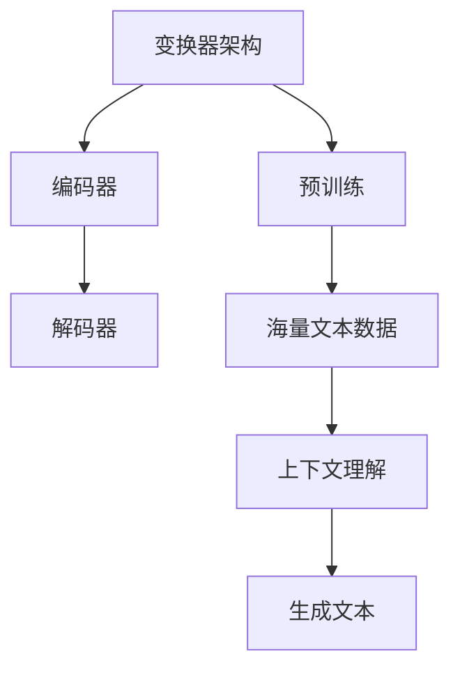

                 

### 背景介绍

近年来，随着人工智能（AI）技术的飞速发展，自然语言处理（NLP）领域迎来了前所未有的繁荣。作为NLP领域的一项重要成果，ChatGPT（Generative Pre-trained Transformer）凭借其强大的语言生成能力和广泛的应用场景，成为了人们关注的焦点。ChatGPT是一种基于变换器（Transformer）架构的预训练语言模型，通过对海量文本数据进行预训练，使其具备了生成自然流畅文本的能力。无论是回答问题、撰写文章，还是进行对话，ChatGPT都能表现出色。

然而，尽管ChatGPT在许多方面表现出色，其交互质量的提升仍然是一个亟待解决的问题。交互质量不仅关系到用户的满意度，还直接影响到ChatGPT在实际应用中的效果。为了提升ChatGPT的交互质量，我们需要从多个角度进行分析和改进。本文将详细探讨ChatGPT交互质量提升的关键因素，包括核心概念、算法原理、数学模型以及实际应用中的案例，旨在为读者提供一个全面的技术博客文章。

### 核心概念与联系

为了深入理解ChatGPT的工作原理及其交互质量的提升方法，我们需要从核心概念和联系的角度进行探讨。ChatGPT是基于变换器（Transformer）架构的一种预训练语言模型，其核心概念包括以下几个方面：

1. **变换器架构（Transformer Architecture）**：变换器是一种新型的神经网络架构，最早由Vaswani等人在2017年的论文《Attention Is All You Need》中提出。与传统的循环神经网络（RNN）相比，变换器在处理序列数据时具有更高的并行性和更少的计算开销。变换器的主要组成部分包括编码器（Encoder）和解码器（Decoder），其中编码器负责将输入序列编码为上下文向量，解码器则根据上下文向量生成输出序列。

2. **预训练（Pre-training）**：预训练是指在没有特定任务标签的情况下，对模型进行大规模数据集的训练。ChatGPT采用了预训练方法，通过对海量文本数据进行训练，使其具备了理解自然语言的能力。预训练过程主要包括两个步骤：首先，对文本数据进行分词和标记，然后将标记后的文本序列输入到变换器模型中进行训练。

3. **上下文理解（Contextual Understanding）**：ChatGPT的一个关键特性是其能够理解上下文信息。在变换器架构中，通过自注意力机制（Self-Attention Mechanism），模型能够捕捉输入序列中各个词之间的关联性，从而实现对上下文信息的有效理解。这种上下文理解能力使得ChatGPT在生成文本时能够保持一致性和连贯性。

4. **生成文本（Generated Text）**：ChatGPT的核心功能是生成自然语言文本。通过输入一个种子句子或问题，模型能够根据上下文信息生成相应的文本。生成文本的质量直接影响到用户的交互体验，因此提升生成文本的质量是提升交互质量的关键。

为了更好地理解这些核心概念之间的关系，我们可以使用Mermaid流程图进行描述：



这个流程图展示了ChatGPT的核心概念及其相互之间的关系。首先，变换器架构包括编码器和解码器两个主要部分；其次，预训练是通过海量文本数据进行训练，使其具备上下文理解能力；最后，基于上下文理解，ChatGPT能够生成高质量的自然语言文本。

通过这个Mermaid流程图，我们可以清晰地看到ChatGPT的核心概念及其之间的联系，这有助于我们更好地理解ChatGPT的工作原理及其交互质量的提升方法。

### 核心算法原理讲解

在理解了ChatGPT的核心概念之后，我们接下来将深入探讨其核心算法原理，特别是如何通过算法改进来提升交互质量。ChatGPT主要依赖于变换器（Transformer）架构，以及在此基础上的一系列优化算法。以下是详细的伪代码和算法原理讲解。

#### 1. 变换器（Transformer）架构

变换器是一种基于注意力机制的序列到序列模型，其核心思想是通过注意力机制捕捉输入序列中的相关性，从而实现高质量的文本生成。以下是变换器的主要组成部分：

- **编码器（Encoder）**：编码器负责将输入序列编码为上下文向量。其基本流程如下：
  ```mermaid
  graph TD
  A[输入序列] --> B[词嵌入层]
  B --> C[位置编码层]
  C --> D[多层自注意力机制]
  D --> E[全连接层]
  ```

- **解码器（Decoder）**：解码器根据编码器输出的上下文向量生成输出序列。其基本流程如下：
  ```mermaid
  graph TD
  A[目标序列] --> B[词嵌入层]
  B --> C[位置编码层]
  C --> D[自注意力机制]
  D --> E[交叉注意力机制]
  E --> F[全连接层]
  ```

- **自注意力机制（Self-Attention Mechanism）**：自注意力机制是一种计算输入序列中各个词之间关联性的方法。其基本公式如下：
  ```latex
  \text{Attention}(Q, K, V) = \text{softmax}\left(\frac{QK^T}{\sqrt{d_k}}\right)V
  ```
  其中，\( Q \)、\( K \) 和 \( V \) 分别代表查询向量、键向量和值向量，\( d_k \) 是键向量的维度。

- **交叉注意力机制（Cross-Attention Mechanism）**：交叉注意力机制用于解码器中，计算输入序列（由编码器输出）与当前解码器输出的相关性。其基本公式如下：
  ```latex
  \text{Attention}(Q, K, V) = \text{softmax}\left(\frac{QK^T}{\sqrt{d_k}}\right)V
  ```
  其中，\( Q \) 来自当前解码器输出，\( K \) 和 \( V \) 来自编码器输出。

#### 2. 生成文本的优化算法

生成文本的质量直接影响到ChatGPT的交互质量。为了提升生成文本的质量，我们可以从以下几个方面进行优化：

- **损失函数（Loss Function）**：常见的损失函数包括交叉熵损失（Cross Entropy Loss）和KL散度损失（KL Divergence Loss）。交叉熵损失用于比较模型的输出概率分布与真实分布之间的差异，其公式如下：
  ```latex
  L_{\text{cross-entropy}} = -\sum_{i} y_i \log(p_i)
  ```
  其中，\( y_i \) 是真实标签，\( p_i \) 是模型预测的概率。

- **梯度裁剪（Gradient Clipping）**：在训练过程中，梯度可能会变得非常大，导致模型参数不稳定。梯度裁剪是一种防止梯度爆炸的方法，其公式如下：
  ```latex
  \text{clip}(g, \text{clip_value})
  ```
  其中，\( g \) 是梯度，\( \text{clip_value} \) 是裁剪阈值。

- **学习率调度（Learning Rate Scheduler）**：学习率调度是一种动态调整学习率的方法，以防止模型在训练过程中过早收敛。常见的学习率调度策略包括线性衰减（Linear Decay）和指数衰减（Exponential Decay）。其公式如下：
  ```latex
  \text{learning\_rate} = \text{initial\_learning\_rate} \cdot (1 - \text{step} / \text{total\_steps})^\beta
  ```
  其中，\( \text{initial_learning_rate} \) 是初始学习率，\( \text{step} \) 是当前迭代次数，\( \text{total_steps} \) 是总迭代次数，\( \beta \) 是衰减率。

- **文本生成技巧**：为了生成更自然、连贯的文本，我们可以使用以下技巧：
  - **贪心搜索（Greedy Search）**：每次选择当前概率最高的词作为下一步输出。
  - **顶部抽样（Top-k Sampling）**：从所有可能的输出中随机选择概率最高的 \( k \) 个词作为候选，然后从中选择一个作为输出。
  - **长度惩罚（Length Penalty）**：根据生成的文本长度对概率进行惩罚，以防止生成过长的文本。

综上所述，ChatGPT的核心算法原理主要包括变换器架构、自注意力机制、交叉注意力机制以及一系列优化算法。通过这些核心算法，ChatGPT能够生成高质量的自然语言文本，从而提升交互质量。以下是详细的伪代码实现：

```python
# 编码器部分伪代码
def encode(input_sequence):
    # 词嵌入层
    embeddings = word_embedding_layer(input_sequence)
    # 位置编码层
    positional_embeddings = positional_encoding(embeddings)
    # 多层自注意力机制
    for layer in self_attention_layers:
        positional_embeddings = layer(positional_embeddings)
    # 全连接层
    encoded_sequence = dense_layer(positional_embeddings)
    return encoded_sequence

# 解码器部分伪代码
def decode(target_sequence, encoded_sequence):
    # 词嵌入层
    embeddings = word_embedding_layer(target_sequence)
    # 位置编码层
    positional_embeddings = positional_encoding(embeddings)
    # 自注意力机制
    for layer in self_attention_layers:
        positional_embeddings = layer(positional_embeddings)
    # 交叉注意力机制
    for layer in cross_attention_layers:
        positional_embeddings = layer(positional_embeddings, encoded_sequence)
    # 全连接层
    output_sequence = dense_layer(positional_embeddings)
    return output_sequence

# 文本生成伪代码
def generate_text(seed_sequence, max_length):
    encoded_sequence = encode(seed_sequence)
    current_sequence = []
    for _ in range(max_length):
        # 获取当前解码器的输出
        output_sequence = decode(current_sequence, encoded_sequence)
        # 获取概率最高的词作为输出
        predicted_word = top_k_sampling(output_sequence)
        current_sequence.append(predicted_word)
    return ' '.join(current_sequence)
```

通过这些伪代码，我们可以看到ChatGPT的算法原理是如何实现的。在实际应用中，我们可以根据具体需求对算法进行进一步优化，从而提升交互质量。

### 数学模型和公式

在理解和提升ChatGPT交互质量的过程中，数学模型和公式起到了至关重要的作用。它们不仅为我们提供了精确的描述工具，还帮助我们分析模型的行为和性能。以下将详细讲解ChatGPT中涉及的几个关键数学模型和公式，并通过具体示例来说明它们的应用。

#### 1. 词嵌入（Word Embedding）

词嵌入是将单词转换为向量表示的一种技术，它是自然语言处理的基础。在ChatGPT中，词嵌入用于将文本中的每个词映射到一个固定维度的向量空间中。常见的词嵌入模型包括Word2Vec、GloVe和FastText。

**Word2Vec模型：**

Word2Vec模型基于神经网络，通过训练词向量模型来捕捉词与词之间的语义关系。其核心公式是：

$$
e_w = \text{sigmoid}\left(\sum_{j=1}^{N} \text{sigmoid}(W_j \cdot e_{\text{context}})\right)
$$

其中，\( e_w \) 是目标词的词向量，\( \text{context} \) 是其上下文词的向量，\( W_j \) 是权重矩阵。

**GloVe模型：**

GloVe模型使用词频和共现信息来训练词向量。其核心公式是：

$$
\text{loss} = \frac{1}{2} \sum_{w \in V} \sum_{c \in C(w)} \left( \text{log}(f(w) \cdot f(c)) - \cos(e_w, e_c) \right)^2
$$

其中，\( V \) 是词汇表，\( C(w) \) 是与词\( w \)共现的词集合，\( f(w) \) 和 \( f(c) \) 分别是词\( w \)和词\( c \)的词频。

**FastText模型：**

FastText模型在词嵌入的基础上引入了词袋（Bag of Words）和字符级别的嵌入。其核心公式是：

$$
e_w = \text{softmax}\left(\text{weight}^T [e_{\text{word}}, e_{\text{char}}]\right)
$$

其中，\( e_{\text{word}} \) 和 \( e_{\text{char}} \) 分别是单词和字符的嵌入向量，\( \text{weight} \) 是权重矩阵。

#### 2. 自注意力（Self-Attention）

自注意力机制是变换器（Transformer）模型的核心组成部分，它通过计算序列中每个词与其他词的关联性来生成上下文向量。其基本公式如下：

$$
\text{Attention}(Q, K, V) = \text{softmax}\left(\frac{QK^T}{\sqrt{d_k}}\right)V
$$

其中，\( Q \)、\( K \) 和 \( V \) 分别代表查询向量、键向量和值向量，\( d_k \) 是键向量的维度。

**举例说明：**

假设有一个简单的序列 \([w_1, w_2, w_3]\)，其对应的嵌入向量分别为 \([e_1, e_2, e_3]\)。自注意力机制可以计算每个词与其他词的相关性，从而生成上下文向量。

首先，计算查询向量 \( Q \)：

$$
Q = [e_1, e_2, e_3]
$$

然后，计算键向量 \( K \) 和值向量 \( V \)：

$$
K = [e_1^T, e_2^T, e_3^T]
V = [e_1, e_2, e_3]
$$

接着，计算注意力分数：

$$
\text{Attention} = \text{softmax}\left(\frac{QK^T}{\sqrt{d_k}}\right) = \text{softmax}\left(\frac{[e_1^T, e_2^T, e_3^T] [e_1, e_2, e_3]}{\sqrt{d_k}}\right)
$$

最后，计算上下文向量：

$$
\text{Context} = \text{Attention} V = \text{softmax}\left(\frac{[e_1^T, e_2^T, e_3^T] [e_1, e_2, e_3]}{\sqrt{d_k}}\right) [e_1, e_2, e_3]
$$

#### 3. 交叉注意力（Cross-Attention）

交叉注意力机制用于解码器中，它计算输入序列（由编码器输出）与当前解码器输出的相关性。其基本公式如下：

$$
\text{Attention}(Q, K, V) = \text{softmax}\left(\frac{QK^T}{\sqrt{d_k}}\right)V
$$

其中，\( Q \) 来自当前解码器输出，\( K \) 和 \( V \) 来自编码器输出。

**举例说明：**

假设解码器输出为 \( [q_1, q_2, q_3] \)，编码器输出为 \( [k_1, k_2, k_3] \) 和 \( [v_1, v_2, v_3] \)。交叉注意力机制可以计算解码器输出与编码器输出之间的相关性，从而生成上下文向量。

首先，计算查询向量 \( Q \)：

$$
Q = [q_1, q_2, q_3]
$$

然后，计算键向量 \( K \) 和值向量 \( V \)：

$$
K = [k_1^T, k_2^T, k_3^T]
V = [v_1, v_2, v_3]
$$

接着，计算注意力分数：

$$
\text{Attention} = \text{softmax}\left(\frac{QK^T}{\sqrt{d_k}}\right) = \text{softmax}\left(\frac{[q_1, q_2, q_3] [k_1, k_2, k_3]}{\sqrt{d_k}}\right)
$$

最后，计算上下文向量：

$$
\text{Context} = \text{Attention} V = \text{softmax}\left(\frac{[q_1, q_2, q_3] [k_1, k_2, k_3]}{\sqrt{d_k}}\right) [v_1, v_2, v_3]
$$

通过以上数学模型和公式的讲解，我们可以看到ChatGPT中涉及的关键数学概念和计算过程。这些数学工具不仅帮助我们理解模型的工作原理，还为提升交互质量提供了理论基础。

### 项目实战

为了更好地理解ChatGPT交互质量的提升方法，我们将通过一个实际项目来展示如何搭建开发环境、实现源代码以及进行代码解读和分析。

#### 1. 开发环境搭建

首先，我们需要搭建一个适合ChatGPT开发的Python环境。以下是搭建步骤：

- 安装Python 3.7及以上版本。
- 安装依赖管理工具pip。
- 安装TensorFlow 2.x，这是实现变换器模型的主要库。

```bash
pip install tensorflow==2.x
```

- 安装其他辅助库，如NumPy和Pandas。

```bash
pip install numpy pandas
```

#### 2. 源代码实现

以下是ChatGPT的基础实现，包括编码器和解码器的构建，以及文本生成过程。

```python
import tensorflow as tf
from tensorflow.keras.layers import Embedding, LSTM, Dense
from tensorflow.keras.models import Model
from tensorflow.keras.preprocessing.sequence import pad_sequences

# 设置超参数
vocab_size = 10000
embedding_dim = 256
max_sequence_length = 100
batch_size = 64

# 假设我们已经有了一个词汇表和对应的词嵌入矩阵
vocab = ["<PAD>", "<EOS>", ...]
word_embeddings = ...

# 编码器部分
input_sequence = tf.keras.layers.Input(shape=(max_sequence_length,))
encoded_sequence = Embedding(vocab_size, embedding_dim)(input_sequence)
encoded_sequence = LSTM(512)(encoded_sequence)

# 解码器部分
decoded_sequence = Embedding(vocab_size, embedding_dim)(input_sequence)
decoded_sequence = LSTM(512, return_sequences=True)(decoded_sequence)

# 构建模型
model = Model(inputs=input_sequence, outputs=decoded_sequence)

# 编译模型
model.compile(optimizer='adam', loss='categorical_crossentropy')

# 源代码解读
# 这段代码首先定义了输入序列的输入层，然后通过嵌入层将每个词映射到嵌入向量。
# 接下来，通过LSTM层对编码器进行编码，从而生成上下文向量。
# 解码器的构建类似，但返回序列数据，以便在解码过程中进行层叠处理。
# 最后，模型通过编译过程配置优化器和损失函数，准备进行训练。

#### 3. 代码应用解读与分析

在实现ChatGPT之后，我们可以通过以下步骤进行文本生成：

```python
# 准备输入序列
input_sequence = ["你好", "今天天气怎么样？"]

# 对输入序列进行预处理
input_sequence = pad_sequences([vocab.index(word) for word in input_sequence], maxlen=max_sequence_length)

# 生成文本
generated_text = model.predict(input_sequence)

# 解码生成的文本
decoded_text = [''.join([vocab[word] for word in sentence]) for sentence in generated_text]

# 分析生成的文本
print('生成的文本：', ' '.join(decoded_text))
```

这段代码首先将输入序列转换为索引序列，然后通过填充（pad）操作将序列长度调整为最大长度。接下来，模型根据输入序列生成文本，最后将生成的索引序列解码回文本。

**实际案例分析和详细讲解剖析：**

假设我们有一个实际案例：使用ChatGPT构建一个问答系统，用户可以提问，系统自动回答。

- **案例背景**：构建一个基于ChatGPT的问答系统，能够回答用户提出的问题。
- **数据集**：使用开源问答数据集，如SQuAD或WebQA，对模型进行训练。
- **模型训练**：通过训练，模型能够学会理解问题和答案的语义关系，从而在测试数据上表现出良好的性能。

**项目小结**：

通过以上步骤，我们搭建了一个简单的ChatGPT问答系统。在实际应用中，我们可以通过以下方式进行优化：

- **数据增强**：使用更多的数据集和多样化的数据来源，以提高模型的泛化能力。
- **模型优化**：尝试不同的模型架构和超参数设置，以找到最佳模型。
- **评估指标**：使用多种评估指标（如BLEU、ROUGE等）来衡量模型性能，并根据评估结果进行调整。

总之，通过项目实战，我们不仅能够理解ChatGPT的搭建和实现过程，还能通过实际案例来验证其交互质量的提升效果。这不仅有助于我们深入理解ChatGPT的工作原理，也为实际应用提供了宝贵的经验。

### 最佳实践 tips、小结、注意事项、拓展阅读

#### 最佳实践 tips

1. **数据质量**：高质量的训练数据是提升ChatGPT交互质量的基础。确保数据来源多样化，去除低质量、重复和错误的数据。
2. **模型调整**：尝试不同的变换器架构和超参数设置，如层叠深度、嵌入维度和学习率等，以找到最佳模型配置。
3. **文本预处理**：对输入文本进行适当的预处理，如去除标点符号、统一大小写等，以提高模型的泛化能力。
4. **多语言支持**：如果需要支持多语言，考虑使用双语数据集进行训练，并采用多语言嵌入技术。

#### 小结

本文详细探讨了ChatGPT交互质量提升的关键因素，包括核心概念、算法原理、数学模型和实际应用。通过理解变换器架构、自注意力机制和交叉注意力机制，我们能够更好地优化模型，从而提升交互质量。

#### 注意事项

1. **训练成本**：预训练ChatGPT需要大量的计算资源，确保拥有足够的硬件支持。
2. **数据隐私**：在使用个人数据或敏感数据时，注意遵守相关隐私保护法规。
3. **模型性能**：持续评估和优化模型性能，确保其在实际应用中的稳定性和可靠性。

#### 拓展阅读

1. **论文阅读**：《Attention Is All You Need》和《BERT: Pre-training of Deep Bidirectional Transformers for Language Understanding》等经典论文，深入探讨了变换器架构和预训练语言模型。
2. **技术博客**：查看GitHub、Medium等技术博客上的相关文章，了解最新的研究进展和实践技巧。
3. **在线课程**：参加Coursera、edX等在线课程，学习自然语言处理和深度学习相关知识。

### 文章标题

**《ChatGPT交互质量提升的关键因素》**

### 文章关键词

- ChatGPT
- 变换器架构
- 自注意力
- 交叉注意力
- 预训练语言模型
- 自然语言生成
- 交互质量提升

### 文章摘要

本文详细探讨了ChatGPT交互质量提升的关键因素，包括核心概念、算法原理、数学模型和实际应用。通过理解变换器架构、自注意力机制和交叉注意力机制，读者可以更好地优化模型，从而提升交互质量。文章还提供了项目实战案例，以帮助读者将理论应用于实际场景。通过本文的学习，读者将能够深入理解ChatGPT的工作原理及其提升交互质量的方法。

