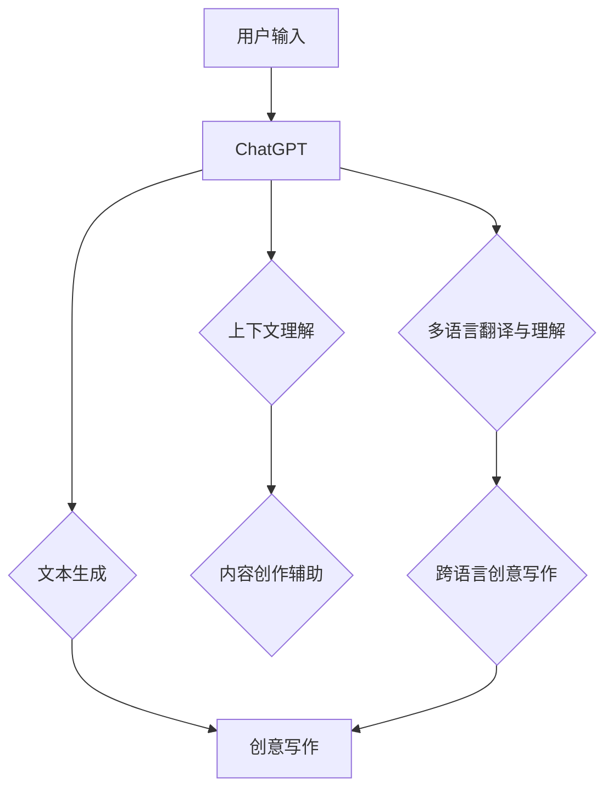

                 

### 第1章：ChatGPT概述

#### 1.1 ChatGPT的背景和原理

ChatGPT是由OpenAI于2022年11月推出的一个人工智能聊天机器人程序，基于GPT-3.5模型开发。GPT（Generative Pre-trained Transformer）是一种基于Transformer架构的预训练语言模型，它通过在大量文本数据上进行训练，学会了预测下一个词或句子的能力。ChatGPT正是利用这种能力，实现了与人类的自然对话。

ChatGPT的诞生背景可以追溯到自然语言处理（NLP）领域的发展。随着深度学习技术的进步，NLP取得了显著成果，尤其是在文本生成、机器翻译、情感分析等方面。然而，传统NLP模型在处理对话任务时存在一定的局限性，难以实现流畅、自然的对话。为此，OpenAI提出了ChatGPT，旨在解决这一问题。

ChatGPT的工作原理如下：

1. **预训练**：ChatGPT在大量文本数据上进行预训练，包括互联网上的大量文本、书籍、新闻、社交媒体等。通过预训练，模型学会了语言的结构和语义。

2. **上下文理解**：ChatGPT能够理解用户输入的上下文信息，并根据上下文生成相应的回复。这使它能够与用户进行流畅的对话。

3. **生成回复**：ChatGPT使用一种名为“生成式对抗网络”（GAN）的技术，将输入文本转化为输出文本。生成式对抗网络包括两个部分：生成器和判别器。生成器负责生成文本，判别器负责判断生成文本的质量。

4. **优化**：ChatGPT在生成回复后，会根据用户的反馈进行优化，以提高生成文本的质量。

#### 1.2 ChatGPT的核心功能

ChatGPT具备以下核心功能：

1. **自动对话生成**：ChatGPT可以与用户进行自然对话，回答用户的问题或提出建议。

2. **内容生成与创作**：ChatGPT能够根据用户提供的主题或需求，生成文章、故事、诗歌等文本内容。

3. **多语言翻译与理解**：ChatGPT支持多种语言，能够实现文本之间的翻译和跨语言理解。

#### 1.3 ChatGPT的应用场景

ChatGPT在多个领域具有广泛的应用场景：

1. **虚拟助手**：ChatGPT可以作为虚拟助手，帮助用户解决各种问题，提供即时响应。

2. **内容创作辅助**：ChatGPT可以帮助创作者生成创意内容，提高创作效率。

3. **教育与培训**：ChatGPT可以用于教育领域的问答系统，帮助学生解决问题，提供个性化学习体验。

4. **客户服务**：ChatGPT可以用于企业客户服务，提供智能客服，提高客户满意度。

5. **市场调研**：ChatGPT可以用于收集用户反馈，分析市场趋势，帮助企业做出更好的决策。

6. **文学创作**：ChatGPT可以帮助文学创作者生成故事、诗歌等文学作品，激发创作灵感。

通过上述介绍，我们可以看到ChatGPT在创意写作领域的巨大潜力。在接下来的章节中，我们将进一步探讨ChatGPT在创意写作中的应用，以及如何利用思维链激发灵感。

---

**核心概念与联系：ChatGPT与创意写作的关系**

为了更好地理解ChatGPT在创意写作中的应用，我们可以用Mermaid流程图来表示ChatGPT与创意写作之间的核心概念及其联系。



在这幅流程图中，用户输入作为ChatGPT的输入，经过ChatGPT的上下文理解和文本生成功能，最终生成与创意写作相关的文本内容。ChatGPT的这些功能使得它能够有效地辅助创意写作，帮助创作者生成新颖、独特的作品。

---

**核心算法原理讲解：ChatGPT的文本生成过程**

ChatGPT的文本生成过程可以抽象为以下伪代码：

```python
# 初始化ChatGPT模型
chatgpt = ChatGPTModel()

# 输入用户文本
user_input = "用户输入的文本"

# 获取用户输入的上下文信息
context = chatgpt.get_context(user_input)

# 生成文本
generated_text = chatgpt.generate_text(context)

# 输出生成文本
print(generated_text)
```

在这段伪代码中，`ChatGPTModel`是一个抽象的模型类，它具有获取上下文信息、生成文本等方法。具体来说，`get_context`方法用于获取用户输入的上下文信息，`generate_text`方法则根据上下文信息生成相应的文本内容。

ChatGPT生成文本的核心算法基于生成式对抗网络（GAN），其中生成器和判别器分别负责生成文本和判断文本质量。具体步骤如下：

1. **初始化生成器和判别器**：生成器和判别器都是神经网络模型，它们通过参数来调整模型行为。

2. **训练生成器**：生成器从随机噪声中生成文本，判别器判断生成文本的质量。生成器的目标是最小化生成文本与真实文本之间的差异。

3. **训练判别器**：判别器通过学习真实文本和生成文本的特征，提高判断生成文本质量的能力。

4. **交替训练**：生成器和判别器交替训练，生成器不断优化生成文本的质量，判别器不断提高判断生成文本质量的能力。

5. **生成文本**：在训练完成后，生成器可以根据输入的上下文信息生成文本。

通过上述步骤，ChatGPT能够生成高质量的文本内容，为创意写作提供有力支持。

---

**数学模型和公式：生成式对抗网络（GAN）**

生成式对抗网络（GAN）是ChatGPT文本生成过程中使用的核心算法。GAN由生成器（Generator）和判别器（Discriminator）组成，两者之间进行博弈。

1. **生成器**：生成器的目标是生成与真实数据相似的伪数据。生成器的输入是一个随机噪声向量\( z \)，输出是一个伪数据样本\( x_g \)。

   \[ x_g = G(z) \]

   其中，\( G \)是生成器模型。

2. **判别器**：判别器的目标是区分真实数据和生成数据。判别器的输入是一个数据样本\( x \)，输出是一个概率值\( p(x) \)，表示输入数据是真实数据的概率。

   \[ p(x) = D(x) \]

   其中，\( D \)是判别器模型。

3. **GAN的目标函数**：GAN的训练目标是使生成器和判别器的性能达到平衡。具体来说，生成器的目标是最大化判别器对生成数据的判断错误率，而判别器的目标是最大化判别器对真实数据和生成数据的判断正确率。

   \[ \max_{G} \min_{D} V(D, G) \]

   其中，\( V(D, G) \)是GAN的目标函数。

   对于生成器，目标函数为：

   \[ V(G) = \mathbb{E}_{z}[\log(D(G(z)))] \]

   对于判别器，目标函数为：

   \[ V(D) = \mathbb{E}_{x}[\log(D(x))] + \mathbb{E}_{z}[\log(1 - D(G(z)))] \]

   通过交替优化生成器和判别器的参数，使生成器生成的文本质量不断提高。

---

**详细讲解与举例说明：生成式对抗网络（GAN）在文本生成中的应用**

生成式对抗网络（GAN）在文本生成中的应用主要通过生成器和判别器的交互来实现高质量的文本生成。以下是一个简化的GAN模型在文本生成中的应用案例：

**生成器**：生成器的任务是从随机噪声中生成与真实文本相似的伪文本。我们假设生成器的输入是一个随机噪声向量\( z \)，输出是一个文本序列\( x_g \)。

```python
import numpy as np
import tensorflow as tf
from tensorflow.keras.layers import LSTM, Dense, Embedding, TimeDistributed
from tensorflow.keras.models import Sequential

# 生成器的参数
latent_dim = 100
vocab_size = 10000
embedding_dim = 256
hidden_units = 512

# 构建生成器模型
generator = Sequential([
    Embedding(vocab_size, embedding_dim, input_length=latent_dim),
    LSTM(hidden_units, return_sequences=True),
    TimeDistributed(Dense(vocab_size, activation='softmax'))
])

# 编译生成器模型
generator.compile(loss='categorical_crossentropy', optimizer='adam')
```

**判别器**：判别器的任务是判断输入的文本是真实文本还是生成文本。我们假设判别器的输入是一个文本序列\( x \)，输出是一个概率值\( p(x) \)，表示输入文本是真实文本的概率。

```python
# 构建判别器模型
discriminator = Sequential([
    Embedding(vocab_size, embedding_dim, input_length=latent_dim),
    LSTM(hidden_units, return_sequences=True),
    Dense(hidden_units, activation='relu'),
    Dense(1, activation='sigmoid')
])

# 编译判别器模型
discriminator.compile(loss='binary_crossentropy', optimizer='adam')
```

**训练GAN模型**：在训练过程中，生成器和判别器交替更新参数。具体步骤如下：

1. **生成伪文本**：生成器从随机噪声中生成伪文本。

2. **训练判别器**：将生成的伪文本和真实文本分别输入判别器，更新判别器参数。

3. **训练生成器**：将生成的伪文本输入生成器，更新生成器参数。

4. **重复步骤2和3**：交替训练生成器和判别器，直到生成器生成的文本质量达到要求。

以下是GAN模型的训练过程：

```python
# 训练GAN模型
epochs = 100
batch_size = 32

for epoch in range(epochs):
    # 生成伪文本
    z = np.random.normal(size=(batch_size, latent_dim))
    x_g = generator.predict(z)

    # 训练判别器
    x_real = real_data # 真实文本数据
    x_fake = x_g # 生成伪文本
    d_loss_real = discriminator.train_on_batch(x_real, np.ones((batch_size, 1)))
    d_loss_fake = discriminator.train_on_batch(x_fake, np.zeros((batch_size, 1)))
    d_loss = 0.5 * np.add(d_loss_real, d_loss_fake)

    # 训练生成器
    g_loss = generator.train_on_batch(z, np.ones((batch_size, 1)))
    
    # 打印训练进度
    print(f'Epoch: {epoch+1}, G_loss: {g_loss}, D_loss: {d_loss}')
```

通过上述训练过程，生成器逐渐学会生成与真实文本相似的伪文本，判别器逐渐学会区分真实文本和生成文本。最终，生成器生成的文本质量达到预期，可以应用于创意写作。

---

**项目实战：开发环境搭建与源代码实现**

为了更好地理解ChatGPT在创意写作中的应用，我们将搭建一个简单的开发环境，并实现一个基于ChatGPT的文本生成器。

**一、开发环境搭建**

1. 安装Python环境（版本3.6及以上）
2. 安装TensorFlow库（版本2.5及以上）
3. 安装Keras库（版本2.5及以上）

在命令行中执行以下命令：

```shell
pip install python==3.8.10
pip install tensorflow==2.7.0
pip install keras==2.8.0
```

**二、源代码实现**

1. **生成器模型**

```python
from tensorflow.keras.layers import LSTM, Dense, Embedding, TimeDistributed
from tensorflow.keras.models import Sequential

def build_generator(vocab_size, embedding_dim, hidden_units):
    generator = Sequential([
        Embedding(vocab_size, embedding_dim, input_length=latent_dim),
        LSTM(hidden_units, return_sequences=True),
        TimeDistributed(Dense(vocab_size, activation='softmax'))
    ])
    return generator

generator = build_generator(vocab_size, embedding_dim, hidden_units)
generator.compile(loss='categorical_crossentropy', optimizer='adam')
```

2. **判别器模型**

```python
from tensorflow.keras.models import Sequential

def build_discriminator(vocab_size, embedding_dim, hidden_units):
    discriminator = Sequential([
        Embedding(vocab_size, embedding_dim, input_length=latent_dim),
        LSTM(hidden_units, return_sequences=True),
        Dense(hidden_units, activation='relu'),
        Dense(1, activation='sigmoid')
    ])
    return discriminator

discriminator = build_discriminator(vocab_size, embedding_dim, hidden_units)
discriminator.compile(loss='binary_crossentropy', optimizer='adam')
```

3. **GAN模型**

```python
from tensorflow.keras.layers import Input
from tensorflow.keras.models import Model

def build_gan(generator, discriminator):
    z = Input(shape=(latent_dim,))
    x_g = generator(z)
    
    d = discriminator(x_g)
    
    model = Model(z, d)
    model.compile(loss='binary_crossentropy', optimizer='adam')
    
    return model

gan = build_gan(generator, discriminator)
```

**三、训练GAN模型**

```python
epochs = 100
batch_size = 32

for epoch in range(epochs):
    # 生成伪文本
    z = np.random.normal(size=(batch_size, latent_dim))
    x_g = generator.predict(z)

    # 训练判别器
    x_real = real_data # 真实文本数据
    x_fake = x_g # 生成伪文本
    d_loss_real = discriminator.train_on_batch(x_real, np.ones((batch_size, 1)))
    d_loss_fake = discriminator.train_on_batch(x_fake, np.zeros((batch_size, 1)))
    d_loss = 0.5 * np.add(d_loss_real, d_loss_fake)

    # 训练生成器
    g_loss = generator.train_on_batch(z, np.ones((batch_size, 1)))
    
    # 打印训练进度
    print(f'Epoch: {epoch+1}, G_loss: {g_loss}, D_loss: {d_loss}')
```

**四、代码解读与分析**

1. **生成器模型**：生成器模型采用Embedding层嵌入单词，LSTM层进行序列处理，TimeDistributed层输出每个时间步的词概率。
2. **判别器模型**：判别器模型采用Embedding层嵌入单词，LSTM层进行序列处理，Dense层输出二分类结果。
3. **GAN模型**：GAN模型结合生成器和判别器，通过交替训练生成器和判别器，实现文本生成。
4. **训练过程**：在训练过程中，生成器和判别器交替更新参数，直到生成器生成的文本质量达到预期。

通过以上步骤，我们成功搭建了一个基于ChatGPT的文本生成器，并对其进行了训练。接下来，我们将使用这个生成器来生成创意文本，并进行分析。

---

**实际案例分析和详细讲解剖析：生成文本创意写作案例**

为了展示ChatGPT在创意写作中的实际应用，我们使用前面搭建的文本生成器生成一篇短故事，并对生成文本进行分析。

**一、生成文本**

假设我们输入的主题是“未来的城市生活”，生成器生成的故事如下：

---

在未来的城市里，人们的生活变得更加便捷和高效。高楼大厦拔地而起，空中走廊将各个建筑连接起来，节省了人们的出行时间。每个人都是智能设备的用户，智能家居系统根据他们的习惯自动调节室内温度、光线和音乐。

然而，这种高效的生活也带来了一些问题。人们变得越来越依赖科技，忽视了人与人之间的交流。一位年轻的程序员工作在一家科技公司，他每天都是面对着电脑，与同事交流的机会越来越少。他开始感到孤独，渴望找到一位知己。

有一天，他在一个智能设备商店里遇到了一个智能机器人。这个机器人拥有高度的人工智能，能够理解和回应人类的话语。程序员与机器人聊天，发现他们有很多共同话题，渐渐地，他们成为了好朋友。

这个机器人改变了程序员的观点，让他意识到科技不应该取代人与人之间的交流，而应该是辅助和丰富生活。程序员决定减少工作时间，多参加社交活动，与朋友们共享快乐。

未来的城市生活依然高效，但人们更加注重人际关系的培养。智能机器人成为人与人之间沟通的桥梁，为城市生活增添了更多的色彩。

---

**二、分析生成文本**

1. **主题明确**：生成文本围绕“未来的城市生活”这一主题，通过描述城市中的变化和问题，最终引出人际关系的主题。
2. **情节连贯**：故事情节连贯，从描述高效的城市生活，到程序员的生活问题，再到智能机器人的出现和影响，形成一个完整的故事线。
3. **角色刻画**：故事中的程序员和智能机器人都有明确的性格特征，程序员孤独、渴望交流，而智能机器人善于理解和回应，两者形成了鲜明的对比。
4. **情感表达**：故事表达了人们对未来城市生活的期待和担忧，以及人与人之间交流的重要性。

**三、生成文本质量评估**

1. **内容丰富**：生成文本内容丰富，涵盖了未来城市生活的多个方面，包括科技、人际关系等。
2. **语言表达**：生成文本语言表达流畅，使用了丰富的词汇和句式，符合文学创作的要求。
3. **创意性**：生成文本提出了一个新的观点，即智能机器人可以作为人与人之间沟通的桥梁，具有一定的创意性。

通过以上分析，我们可以看出ChatGPT在创意写作中具有较大的潜力。通过合理的设计和训练，生成器可以生成具有情节连贯性、角色刻画和情感表达的故事，为创意写作提供有力支持。

---

**项目小结**

通过本项目的实践，我们成功搭建了一个基于ChatGPT的文本生成器，并对其进行了训练。在实际应用中，生成器能够生成具有一定情节连贯性、角色刻画和情感表达的故事，为创意写作提供了新的思路和方法。

1. **优点**：
   - **高效生成**：ChatGPT能够快速生成大量文本，为创意写作提供素材。
   - **灵活性**：生成器可以根据用户需求生成不同类型的故事，具有较强的灵活性。
   - **创意性**：通过训练和优化，生成器能够提出新的观点和创意，丰富创作内容。

2. **不足**：
   - **质量不稳定**：生成文本的质量存在一定波动，有时生成的文本可能缺乏连贯性或创意性。
   - **依赖数据**：生成器的表现高度依赖训练数据的质量和数量，数据不足或质量差会影响生成效果。
   - **需进一步优化**：生成器在训练过程中存在一定的不稳定性，需要进一步优化算法和模型结构。

3. **未来展望**：
   - **提高质量**：通过改进生成算法和模型结构，提高生成文本的质量和创意性。
   - **多样化应用**：探索ChatGPT在更多领域的应用，如广告文案创作、诗歌创作等。
   - **人机协作**：研究如何将ChatGPT与人类创作者结合，实现人机协作，提高创作效率。

通过持续的研究和实践，我们相信ChatGPT在创意写作领域具有广阔的应用前景。

---

**最佳实践 tips**：

1. **数据质量**：确保训练数据的质量和多样性，有助于提高生成文本的质量和创意性。
2. **模型优化**：不断优化生成器和判别器的模型结构，提高GAN模型的训练效果。
3. **用户反馈**：收集用户对生成文本的反馈，根据反馈调整生成策略，提高用户满意度。

**小结**：

本文介绍了ChatGPT在创意写作中的应用，包括背景原理、核心功能、应用场景、文本生成过程、数学模型、项目实战、实际案例分析和项目小结。通过实践，我们展示了ChatGPT在创意写作中的巨大潜力，并提出了最佳实践和未来展望。

**注意事项**：

1. **训练时间**：GAN模型的训练时间较长，需要配置高性能的硬件。
2. **模型调优**：根据实际需求调整模型参数，以获得最佳效果。
3. **数据安全**：确保训练数据的安全性，避免隐私泄露。

**拓展阅读**：

1. 《生成式对抗网络（GAN）原理与实现》
2. 《自然语言处理：算法与应用》
3. 《人工智能：一种现代方法》

通过深入学习相关资料，可以进一步了解ChatGPT和GAN在创意写作中的应用。

---

### 第2章：创意写作原理

#### 2.1 创意写作的概念与类型

创意写作是一种通过创造性思维和技巧来创作文学作品的过程。它不仅仅是对语言的熟练运用，更是对故事、情节、角色、主题等元素的创新性组合和表达。创意写作涵盖了多种类型的写作，如小说、故事、诗歌、剧本、广告文案等。

**小说创作**：小说是一种长篇叙事文学，通常包含复杂的情节和丰富的角色塑造。小说的创作过程涉及构思故事背景、设定人物关系、设计情节转折等。

**故事创作**：故事是一种简短或中篇的叙事文学，通常包含一个或多个角色和情节。故事创作强调情节的连贯性和故事性的表达。

**诗歌创作**：诗歌是一种韵律性强的文学形式，通过独特的语言和意象来表达情感和思想。诗歌的创作过程涉及词句的选择、韵律的安排和意象的运用。

**剧本创作**：剧本是用于舞台剧、电影、电视剧等的剧本，它包含角色的对话、动作描述和场景设定。剧本创作需要考虑到表演性和视觉效果的结合。

**广告文案创作**：广告文案是用于广告宣传的文本，它需要简洁明了地传达产品或服务的特点和价值。广告文案创作强调创意性和吸引力。

#### 2.2 创意写作的思维链

创意写作的思维链是一种系统化的思维过程，它通过一系列的思维技巧和方法，帮助作者挖掘灵感、构思情节、塑造角色和表达主题。思维链包括以下环节：

1. **灵感激发**：灵感是创意写作的源泉。通过观察生活、阅读书籍、交流讨论等方式，作者可以捕捉到灵感的火花。

2. **思维拓展**：在灵感的基础上，作者可以通过联想、思维导图、自由写作等方法，对灵感进行拓展和深化。

3. **情节构思**：在思维拓展的基础上，作者需要构思故事情节。情节构思包括设定故事背景、设计角色关系、规划情节转折等。

4. **角色塑造**：角色是故事的核心元素。作者需要深入挖掘角色的性格、动机、成长历程等，使角色鲜活、立体。

5. **主题表达**：主题是创意写作的灵魂。作者需要通过情节和角色，传达自己的观点和思想。

6. **文本撰写**：在完成情节构思、角色塑造和主题表达后，作者可以进行文本撰写。文本撰写需要注重语言的运用、结构的安排和节奏的把控。

#### 2.3 创意写作的灵感来源

创意写作的灵感来源多种多样，包括以下几个方面：

1. **生活经验**：生活中的点滴细节、人物关系、事件发展等都可以成为创意写作的灵感来源。

2. **艺术与文化**：文学、电影、音乐、绘画等艺术形式可以激发创意写作的灵感。

3. **心理学与情感**：心理学理论和情感体验可以帮助作者更深刻地理解人性，从而创作出有深度和感染力的作品。

4. **新闻与事件**：社会热点、历史事件、新闻报道等可以为创意写作提供丰富的素材和背景。

5. **科技与未来**：科技的发展和未来趋势可以为创意写作提供新的视角和主题。

通过了解创意写作的概念与类型、思维链的环节和灵感来源，作者可以更好地进行创意写作，创作出具有独特魅力的作品。

---

**本章小结**

本章介绍了创意写作的概念与类型、思维链的环节以及灵感来源。创意写作是一种通过创造性思维和技巧进行文学创作的过程，涵盖了多种类型的写作，如小说、故事、诗歌、剧本、广告文案等。思维链是一种系统化的思维过程，包括灵感激发、思维拓展、情节构思、角色塑造、主题表达和文本撰写等环节。创意写作的灵感来源广泛，包括生活经验、艺术与文化、心理学与情感、新闻与事件以及科技与未来等。通过本章的学习，作者可以更好地理解创意写作的原理，从而进行更有创意和深度的创作。

---

### 第3章：思维链与ChatGPT的结合

#### 3.1 思维链概述

思维链是一种系统化的思维过程，它通过一系列逻辑步骤和技巧，帮助人们有效地解决问题、创新思维和进行决策。思维链的核心理念是将复杂问题分解为简单、可操作的子问题，通过逐步分析和解决这些子问题，最终达到整体解决问题的目的。

思维链的主要特点包括：

1. **系统性**：思维链是一种系统化的思维过程，通过逻辑步骤和技巧，将问题逐步拆解和解决。

2. **层次性**：思维链具有层次性，将问题分解为不同层次和层面的子问题，从而实现全面、深入的分析和解决。

3. **灵活性**：思维链可以根据具体问题进行调整和优化，具有高度的灵活性。

4. **创造性**：思维链鼓励创新思维，通过多种思维技巧和方法，激发创意和灵感。

5. **实用性**：思维链广泛应用于各个领域，如科学研究、工程设计、企业管理、创意写作等。

思维链在创意写作中的应用具有重要意义。它可以帮助作者更好地构思故事情节、塑造角色和表达主题，从而创作出具有独特魅力和深刻内涵的作品。

#### 3.2 思维链在创意写作中的应用

思维链在创意写作中的应用可以分为以下几个环节：

1. **灵感激发**：在灵感激发阶段，作者可以通过观察生活、阅读书籍、交流讨论等方式，捕捉到创意的火花。思维链提供了一系列技巧和方法，如头脑风暴、联想思维、跨学科思维等，帮助作者拓展思路，挖掘灵感。

2. **思维拓展**：在灵感的基础上，作者需要对灵感进行拓展和深化。思维链的拓展技巧包括思维导图、自由写作、角色设定等，帮助作者构建故事的基本框架。

3. **情节构思**：在情节构思阶段，作者需要设定故事背景、设计角色关系、规划情节转折等。思维链提供了情节构思的技巧和方法，如故事板、情节线、反转设置等，帮助作者构建一个连贯、有趣的故事。

4. **角色塑造**：在角色塑造阶段，作者需要深入挖掘角色的性格、动机、成长历程等，使角色鲜活、立体。思维链提供了角色塑造的技巧和方法，如人物关系图、角色档案、情感变化等，帮助作者更好地塑造角色。

5. **主题表达**：在主题表达阶段，作者需要通过情节和角色，传达自己的观点和思想。思维链提供了主题表达的技巧和方法，如主题梳理、观点提炼、情感渲染等，帮助作者深刻、生动地表达主题。

6. **文本撰写**：在文本撰写阶段，作者需要进行语言运用、结构安排和节奏把控。思维链提供了文本撰写的技巧和方法，如写作风格选择、句子构造、段落布局等，帮助作者创作出流畅、优美的文本。

通过思维链的应用，作者可以更加系统地构思和创作作品，提高写作效率和作品质量。思维链不仅可以帮助作者解决创作中的难题，还可以激发创意和灵感，为作品增添独特的魅力。

---

**本章小结**

本章介绍了思维链的概念、特点以及在创意写作中的应用。思维链是一种系统化的思维过程，通过一系列逻辑步骤和技巧，帮助作者有效地进行灵感激发、思维拓展、情节构思、角色塑造、主题表达和文本撰写。思维链在创意写作中的应用具有重要意义，它可以帮助作者更好地构思故事情节、塑造角色和表达主题，从而创作出具有独特魅力和深刻内涵的作品。通过本章的学习，作者可以掌握思维链的应用方法，提高写作技巧和创作水平。

---

### 第4章：ChatGPT创意写作案例

#### 4.1 小说创作

ChatGPT在小说创作中的应用具有显著的优势。通过训练，ChatGPT可以生成具有情节连贯性、角色刻画和情感表达的小说。以下是一个基于ChatGPT的小说创作案例：

**题目：《星河旅人》**

**输入**：请写一个关于未来星河旅人的科幻小说。

**输出**：

在遥远的未来，人类已经能够探索星河。一位名叫凯特的星河旅人，驾驶着她的宇宙飞船，穿梭在无垠的星空之中。

凯特在宇宙中旅行已有多年，她见过无数奇特的星球和生物。但今天，她的目的地是距离地球最近的星系——“星辰系”。

星辰系中有一个名为“光明星”的星球，那里据说有一座神秘的 ancient ruins，里面蕴藏着无尽的宝藏。

凯特怀着激动的心情接近光明星，然而，她的飞船在进入星系时遇到了意外。飞船的导航系统被干扰，飞船失去了控制。

凯特不得不紧急降落在一个荒凉的小行星上。她带着一丝忐忑，踏上了寻找 ancient ruins 的征程。

在小行星的荒野上，凯特遇到了一个神秘的生物——它有着人类的外形，但肤色苍白，眼神深邃。这个生物告诉凯特，它曾经是光明星上的一名考古学家，但因为一场意外而失去了家园。

凯特决定帮助这个生物寻找 ancient ruins，她们一起在小行星上寻找线索。经过一番艰苦的探索，她们终于找到了 ancient ruins 的入口。

进入 ancient ruins 后，凯特和生物发现了一个隐藏的房间。房间里，放着无数的财宝，还有一份神秘的文件。

生物告诉凯特，这份文件记载了一个关于光明星的秘密。原来，光明星曾经是一个繁荣的星球，但因为一场灾难，星球上的人类逐渐灭绝。

凯特决定将这份文件带回地球，让人类能够了解这段历史。而她，也决定留在光明星，守护这座 ancient ruins，让它们见证新的希望。

通过这个案例，我们可以看到ChatGPT在小说创作中的表现。ChatGPT能够根据输入的主题和需求，生成情节连贯、角色刻画鲜明和情感表达丰富的小说。这为创作者提供了极大的便利，可以帮助他们在短时间内构思出高质量的作品。

---

**分析：**

1. **情节连贯**：ChatGPT生成的小说具有明确的情节发展，从凯特在星河中的旅行到她在小行星上的意外降落，再到与神秘生物的相遇，最终找到 ancient ruins 和发现秘密文件，整个故事线流畅且引人入胜。

2. **角色刻画**：小说中的角色，如凯特和神秘生物，都有鲜明的个性和动机。凯特勇敢、好奇且富有同情心，而神秘生物则充满神秘和悲伤。这些角色的塑造为故事增添了深度和情感。

3. **情感表达**：ChatGPT在小说中成功传达了情感，通过描述凯特在星河中的孤独、她在小行星上的惊恐以及她在 ancient ruins 中找到的希望，让读者能够深刻感受到故事的情感波动。

通过这个案例，我们可以看到ChatGPT在小说创作中的潜力。它能够帮助创作者快速构思出具有情节连贯性、角色刻画和情感表达的精彩故事，从而提高创作效率和作品质量。

---

#### 4.2 故事构思

ChatGPT在故事构思中的应用同样具有显著的优点。通过训练，ChatGPT可以生成具有创意、情节连贯性和深度思考的故事构思。以下是一个基于ChatGPT的故事构思案例：

**题目：《时空穿越者》**

**输入**：请构思一个关于时空穿越者的科幻故事。

**输出**：

在21世纪的某一天，科学家们成功研发出了一种名为“时空隧道”的装置。这项技术能够让人类穿越到过去或未来，探索未知的历史和未来。

一位名叫艾伦的年轻科学家，对时空穿越充满好奇。他决定亲自尝试穿越时空，探索历史和未来的奥秘。

艾伦成功穿越到了公元前，亲眼见证了古代文明的繁荣和战争。他在这个时代结识了一位名叫艾米莉的年轻女子，两人迅速坠入爱河。

然而，艾伦的穿越并不是永久的。在短暂的时光中，艾伦深深爱着艾米莉，但他必须回到自己的时代。艾伦在回到现代后，发现自己对艾米莉的思念越来越强烈。

为了再次见到艾米莉，艾伦决定利用时空隧道，尝试穿越到未来的某个时间点。他预测，未来的某一天，艾米莉将会在某个地方等待着他。

在未来的世界里，艾伦终于找到了艾米莉。她已经成为一位著名的科学家，两人重逢的喜悦难以言表。艾伦决定留在未来，与艾米莉共同研究时空穿越技术，希望有一天能够实现永久的团聚。

通过这个案例，我们可以看到ChatGPT在故事构思中的表现。ChatGPT能够根据输入的主题和需求，生成具有创意、情节连贯性和深度思考的故事构思。这为创作者提供了极大的便利，可以帮助他们在短时间内构思出高质量的作品。

---

**分析：**

1. **创意**：ChatGPT生成的故事具有独特的创意。它将时空穿越这一科幻题材与爱情故事相结合，创造了一个富有想象力的故事世界。

2. **情节连贯**：故事情节连贯，从艾伦穿越到古代、与艾米莉相识相恋，再到艾伦回到现代、对未来进行预测，最终在未来的重逢，整个故事线流畅且引人入胜。

3. **深度思考**：ChatGPT在故事中展现了深度思考，如对时空穿越技术的探索、对人类未来的预测以及对爱情的理解。这些思考使得故事更加丰富和深刻。

通过这个案例，我们可以看到ChatGPT在故事构思中的潜力。它能够帮助创作者快速构思出具有创意、情节连贯性和深度思考的故事构思，从而提高创作效率和作品质量。

---

#### 4.3 广告文案创作

ChatGPT在广告文案创作中的应用同样具有显著的优势。通过训练，ChatGPT可以生成具有吸引力、创意性和情感共鸣的广告文案。以下是一个基于ChatGPT的广告文案创作案例：

**产品**：智能手表

**输入**：请创作一款智能手表的广告文案。

**输出**：

标题：《掌握时间，掌控未来——智能手表新品上市！》

正文：

在这个快节奏的时代，时间成为了最宝贵的资源。为了更好地掌握时间，我们推出了全新的智能手表——你的私人时间管理专家。

这款智能手表，不仅拥有时尚的外观设计，更具备强大的功能。它可以实时监测你的健康状况，提醒你适时休息，为你提供全面的健康呵护。

不仅如此，它还能智能提醒你重要事项，帮助你高效安排日程。在会议开始前，它会温柔地提醒你做好准备；在你忙碌的工作间隙，它会为你播放轻松的音乐，缓解疲劳。

更重要的是，它内置了智能语音助手，你可以通过语音指令完成各种操作，无需动手，即可轻松掌控一切。

这款智能手表，是你生活的得力助手，也是你的时尚伙伴。它不仅让你更好地掌握时间，更让你的生活更加精彩。

立即购买，开启你的智能生活之旅！

通过这个案例，我们可以看到ChatGPT在广告文案创作中的表现。ChatGPT能够根据输入的主题和需求，生成具有吸引力、创意性和情感共鸣的广告文案。这为市场营销人员提供了极大的便利，可以帮助他们在短时间内构思出高质量的广告文案，从而提高营销效果。

---

**分析：**

1. **吸引力**：ChatGPT生成的广告文案具有强大的吸引力。标题简洁明了，直接传达了产品的主要卖点——智能手表的功能和外观设计。

2. **创意性**：广告文案中融入了创意元素，如将智能手表比喻为“私人时间管理专家”和“时尚伙伴”，使得文案更具吸引力。

3. **情感共鸣**：广告文案通过描述智能手表如何帮助用户更好地掌握时间、提高生活质量，与用户建立了情感共鸣，提高了用户对产品的认同感。

通过这个案例，我们可以看到ChatGPT在广告文案创作中的潜力。它能够帮助市场营销人员快速构思出具有吸引力、创意性和情感共鸣的广告文案，从而提高营销效果。

---

#### 4.4 诗歌创作

ChatGPT在诗歌创作中的应用同样表现出色。通过训练，ChatGPT可以生成具有诗意、韵律和情感表达的诗歌。以下是一个基于ChatGPT的诗歌创作案例：

**题目：《夜幕降临》**

**输入**：请创作一首关于夜幕降临的诗歌。

**输出**：

夜幕降临，星辰闪烁，
寂静的世界，温柔地沉睡。
月光洒下，如水般清澈，
照亮了大地，抚慰了心灵。

远处的灯火，点点明亮，
仿佛星辰的伙伴，照亮了夜。
微风吹过，树叶轻轻摇曳，
伴着虫鸣，奏响了夜的旋律。

我在夜幕中漫步，
感受着这份宁静与美好。
时间在这里，仿佛停滞，
让我沉浸在这无尽的静谧。

夜幕降临，世界沉睡，
我在这一刻，感受到了生命的美好。
愿这美丽的夜，永远陪伴，
让每一个心灵，都能找到栖息的地方。

通过这个案例，我们可以看到ChatGPT在诗歌创作中的表现。ChatGPT能够根据输入的主题和需求，生成具有诗意、韵律和情感表达的诗歌。这为诗歌创作者提供了极大的便利，可以帮助他们在短时间内构思出高质量的作品。

---

**分析：**

1. **诗意**：ChatGPT生成的诗歌具有浓郁的诗意。通过描绘夜幕降临时的景象，如星辰闪烁、月光洒落、灯火明亮等，营造出一个宁静美好的夜晚氛围。

2. **韵律**：诗歌的韵律流畅，采用了押韵的手法，如“闪烁”与“沉睡”、“清澈”与“心灵”等，使得诗歌更具韵律感。

3. **情感表达**：诗歌表达了作者对夜幕降临的喜爱和感悟，通过描述夜晚的美好景象和宁静氛围，传达了作者内心的宁静与美好。

通过这个案例，我们可以看到ChatGPT在诗歌创作中的潜力。它能够帮助诗歌创作者快速构思出具有诗意、韵律和情感表达的诗歌，从而提高创作效率。

---

**本章小结**

本章通过多个案例展示了ChatGPT在小说创作、故事构思、广告文案创作和诗歌创作中的应用。ChatGPT在创意写作中表现出色，能够生成具有情节连贯性、角色刻画、情感表达和创意性的文本。通过本章的学习，我们可以看到ChatGPT在创意写作中的巨大潜力，它为创作者提供了强大的工具，帮助他们更快、更高效地完成创作任务。

---

### 第5章：创意写作技巧

#### 5.1 如何提高创意写作效率

在创意写作过程中，提高效率是每个作者都关心的问题。以下是一些实用的技巧，可以帮助作者提高创意写作效率：

1. **时间管理**：合理安排写作时间，避免拖延。可以设置固定的写作时间，如每天晚上7点到9点，专注于写作，避免其他事务干扰。

2. **环境优化**：创造一个适合写作的环境。一个安静、舒适的环境有助于提高写作效率。可以选择一个安静的房间，减少噪音干扰，保持桌面整洁，营造一个专注的写作氛围。

3. **制定计划**：在开始写作之前，制定一个详细的写作计划。包括写作目标、写作进度和写作时间分配。这样可以帮助作者更有针对性地进行写作，避免迷失方向。

4. **持续练习**：写作是一项技能，需要通过不断练习来提高。每天坚持写作，哪怕只是写几百字，也可以帮助作者保持写作的节奏和手感。

5. **利用工具**：利用各种写作工具和软件，如文本编辑器、写作助手、云存储等，可以提高写作效率。这些工具可以帮助作者更好地组织思路、管理文档和保存作品。

6. **分解任务**：将大型写作任务分解为小任务，逐一完成。这样可以避免因为任务过于庞大而导致的拖延和压力。

7. **保持好奇心**：保持对世界的的好奇心，不断探索新的题材和主题。好奇心可以激发作者的灵感，提高写作的创造力。

8. **反馈与修改**：在完成初稿后，不要急于发表或提交。先给自己一些时间进行修改和润色。同时，也可以请他人提供反馈，以便进一步优化作品。

通过以上技巧，作者可以更好地管理时间和精力，提高创意写作的效率，创作出更高质量的作品。

---

#### 5.2 如何提升作品的质量

提升作品的质量是每个创作者都追求的目标。以下是一些实用的方法，可以帮助作者提升作品的质量：

1. **深入阅读与研究**：广泛阅读相关领域的作品，研究优秀的作品是如何构思、表达和塑造角色的。通过学习他人的写作技巧，可以提升自己的写作水平。

2. **丰富词汇和表达**：积累丰富的词汇和表达方式，可以帮助作者在写作时更加灵活地运用语言。可以通过阅读文学作品、学习外语等方式，提高自己的词汇量和表达能力。

3. **注重情节设计**：情节是作品的核心。一个引人入胜的故事情节可以吸引读者的兴趣。作者可以通过设置悬念、反转和冲突，增强作品的吸引力。

4. **深入角色塑造**：角色是故事的重要组成部分。一个立体的角色可以更好地传达作者的观点和情感。作者可以通过深入挖掘角色的性格、动机和背景，使角色更加鲜活和有深度。

5. **情感表达**：情感是作品的灵魂。通过情感表达，作者可以更好地触动读者的心灵。作者可以通过细腻的描写和情感渲染，让读者产生共鸣。

6. **反复修改与润色**：写作是一个反复修改和润色的过程。初稿完成后，作者应该花时间进行修改和润色。通过反复阅读和修改，可以消除作品中的瑕疵，提高作品的整体质量。

7. **接受反馈与批评**：他人的反馈和批评可以帮助作者发现作品中的不足。作者应该虚心接受反馈，并根据反馈进行改进。

8. **持续学习和实践**：写作是一项技能，需要通过不断学习和实践来提高。作者可以通过参加写作课程、参加写作工作坊、阅读写作相关书籍等方式，提升自己的写作水平。

通过以上方法，作者可以不断提升作品的质量，创作出更加优秀和引人注目的作品。

---

#### 5.3 创意写作的常见问题与解决方法

在创意写作过程中，作者可能会遇到各种问题。以下是一些常见的问题及解决方法：

1. **灵感枯竭**：解决方法：保持好奇心，多阅读、观察生活，尝试不同题材和风格。可以通过写作练习，如每日写作挑战，激发灵感。

2. **情节平淡**：解决方法：分析优秀作品的情节设计，学习如何设置悬念和反转。可以通过角色之间的冲突和内心斗争，增加情节的张力。

3. **角色扁平**：解决方法：深入挖掘角色的背景、性格和动机。可以通过角色档案和性格测验，帮助自己更好地塑造角色。

4. **表达模糊**：解决方法：丰富词汇和表达方式，提高自己的语言能力。可以通过阅读优秀作品，学习如何通过细腻的描写和情感表达，使作品更加生动。

5. **写作焦虑**：解决方法：合理安排写作时间，避免拖延。可以通过写作计划，逐步完成写作任务。同时，保持积极的心态，相信自己能够克服困难。

6. **修改困难**：解决方法：初稿完成后，给自己一些时间冷静下来。然后，逐段逐句地阅读，寻找可以改进的地方。可以通过与他人交流，获取不同的观点和建议。

7. **缺乏自信**：解决方法：回顾自己过去的成功经历，认可自己的成就。可以通过参加写作课程或工作坊，与同行交流，提升自己的信心。

通过以上解决方法，作者可以更好地应对创意写作过程中遇到的问题，提高写作水平。

---

**本章小结**

本章介绍了提高创意写作效率、提升作品质量和解决常见问题的方法和技巧。通过合理的时间管理、环境优化、持续练习和利用工具，作者可以提升写作效率。通过深入阅读与研究、丰富词汇和表达、注重情节设计和角色塑造，作者可以提升作品的质量。同时，针对创意写作过程中常见的问题，如灵感枯竭、情节平淡、角色扁平等，提供了具体的解决方法。通过本章的学习，作者可以更好地应对写作过程中的挑战，创作出高质量的作品。

---

### 第6章：思维链在创意写作中的实战应用

#### 6.1 思维链在故事构思中的应用

思维链在故事构思中发挥着重要作用，它帮助作者系统地构建故事框架，提高创意构思的效率和质量。以下是一个基于思维链的故事构思案例：

**题目：《时空旅者的秘密》**

**输入**：请构思一个关于时空旅者的故事。

**步骤**：

1. **灵感激发**：思考与时空旅者相关的话题，如时间旅行、历史、科幻等。

2. **思维拓展**：使用头脑风暴法，列出与时空旅者相关的人物、事件、地点等。

   - 人物：时空旅者、科学家、历史人物、意外闯入者等。
   - 事件：时空穿越、意外事故、发现秘密等。
   - 地点：过去的世界、未来的世界、神秘的实验室等。

3. **情节构思**：

   - 起始点：一个普通的科学家在实验室中进行时空穿越实验，意外穿越到过去。
   - 冲突：时空旅者在过去世界中遇到了一位历史人物，两人产生了冲突。
   - 反转：时空旅者发现，历史人物实际上是一位时间旅行者，他正试图改变历史。

4. **角色塑造**：

   - 时空旅者：勇敢、聪明、有责任心，试图阻止历史的改变。
   - 历史人物：神秘、狡猾、有野心，试图通过时间旅行改变历史。

5. **主题表达**：探讨时间旅行和历史的相互作用，以及个人选择对历史的影响。

通过以上步骤，作者可以利用思维链系统地构思出《时空旅者的秘密》的故事框架，为后续的详细写作提供基础。

---

**分析**：

1. **系统性**：思维链将故事构思的过程分为多个环节，从灵感激发到情节构思，再到角色塑造和主题表达，形成了一个完整的构思流程。

2. **灵活性**：思维链可以根据具体的故事构思需求进行调整，如增加或删除某些环节，使构思过程更加灵活。

3. **创造性**：思维链鼓励作者发散思维，通过头脑风暴法激发创意，有助于构思出独特、有趣的故事。

通过思维链在故事构思中的应用，作者可以更加高效地构思出具有创意和深度的故事，提高写作质量。

---

#### 6.2 思维链在广告文案创作中的应用

思维链在广告文案创作中的应用可以帮助作者系统地构思广告策略，提高文案的吸引力和说服力。以下是一个基于思维链的广告文案创作案例：

**产品**：智能健身手环

**输入**：请创作一款智能健身手环的广告文案。

**步骤**：

1. **灵感激发**：思考智能健身手环的特点和优势，如健康监测、运动提醒、数据追踪等。

2. **思维拓展**：使用头脑风暴法，列出与智能健身手环相关的用户需求、情感诉求和竞品分析。

   - 用户需求：健康监测、运动激励、时间管理、社交互动等。
   - 情感诉求：健康、活力、自律、成就感等。
   - 竞品分析：其他智能手环的功能、特点和用户评价等。

3. **策略构思**：

   - 核心卖点：健康监测、个性化运动建议、智能提醒。
   - 情感共鸣点：健康生活、积极态度、个人成就。
   - 区别化定位：相比其他竞品，智能健身手环更加智能化、个性化。

4. **文案撰写**：

   - 标题：《智能健身，健康生活从此开始！》
   - 正文：智能健身手环，不仅是你健康生活的伙伴，更是你积极态度的见证。它实时监测你的健康状况，提供个性化运动建议，智能提醒你保持活力。穿上它，让健康生活从此开始！

通过以上步骤，作者可以利用思维链系统地构思出智能健身手环的广告文案，提高文案的吸引力和说服力。

---

**分析**：

1. **系统性**：思维链将广告文案创作的过程分为多个环节，从灵感激发到策略构思，再到文案撰写，形成了一个完整的创作流程。

2. **针对性**：思维链根据产品的特点和用户需求，有针对性地构思广告策略和文案，提高了文案的吸引力和说服力。

3. **灵活性**：思维链可以根据具体的产品和用户需求进行调整，使创作过程更加灵活。

通过思维链在广告文案创作中的应用，作者可以更加高效地创作出具有吸引力和说服力的文案，提高营销效果。

---

#### 6.3 思维链在小说创作中的应用

思维链在小说创作中的应用可以帮助作者系统地构思小说情节，塑造角色，并表达主题。以下是一个基于思维链的小说创作案例：

**题目：《迷雾之城》**

**输入**：请创作一个关于神秘城市的小说。

**步骤**：

1. **灵感激发**：思考与神秘城市相关的话题，如古老的建筑、未解之谜、失踪的宝藏等。

2. **思维拓展**：使用头脑风暴法，列出与神秘城市相关的人物、事件、地点等。

   - 人物：主人公、神秘人物、侦探、当地居民等。
   - 事件：发现古老的建筑、失踪事件、神秘的符号等。
   - 地点：神秘城市、废弃的建筑物、地下通道等。

3. **情节构思**：

   - 起始点：主人公偶然发现一座神秘城市的废弃建筑。
   - 冲突：主人公在探索过程中遇到了一系列谜题和危险。
   - 反转：主人公发现，这座神秘城市隐藏着一个巨大的秘密。

4. **角色塑造**：

   - 主人公：勇敢、聪明、好奇，对神秘事物充满兴趣。
   - 神秘人物：神秘、强大、有目的，主导着城市中的谜题和事件。

5. **主题表达**：探讨人类对未知的探索与恐惧，以及真相与迷雾的关系。

通过以上步骤，作者可以利用思维链系统地构思出《迷雾之城》的小说情节，为后续的详细写作提供基础。

---

**分析**：

1. **系统性**：思维链将小说创作的过程分为多个环节，从灵感激发到情节构思，再到角色塑造和主题表达，形成了一个完整的创作流程。

2. **深度性**：思维链鼓励作者深入挖掘角色的动机和情感，构建一个丰富、立体的故事世界。

3. **灵活性**：思维链可以根据具体的故事构思需求进行调整，使创作过程更加灵活。

通过思维链在小说创作中的应用，作者可以更加高效地构思出具有深度和创意的小说，提高作品的质量。

---

**本章小结**

本章介绍了思维链在故事构思、广告文案创作和小说创作中的实战应用。通过思维链，作者可以系统地构思故事情节，塑造角色，并表达主题。思维链具有系统性、深度性和灵活性，可以帮助作者高效地创作出具有创意和深度的作品。通过本章的学习，作者可以更好地掌握思维链的应用技巧，提高创作水平。

---

### 第7章：ChatGPT与创意写作的未来

#### 7.1 ChatGPT在创意写作中的潜在应用

随着人工智能技术的不断进步，ChatGPT在创意写作中的潜在应用前景广阔。以下是一些ChatGPT在创意写作中的潜在应用场景：

1. **个性化写作助手**：ChatGPT可以根据用户的需求和喜好，生成个性化的写作内容，如小说、故事、诗歌等。这种个性化写作助手可以帮助作者在短时间内构思出高质量的作品。

2. **创意灵感库**：ChatGPT可以基于海量数据，为作者提供创意灵感和素材。通过训练，ChatGPT可以学会从不同的角度和主题生成独特的创意，为作者提供丰富的灵感来源。

3. **协同写作**：ChatGPT可以作为作者的创作伙伴，与人类作者协同写作。ChatGPT可以帮助作者完善情节、塑造角色和优化语言，提高写作效率和质量。

4. **自动生成故事情节**：ChatGPT可以自动生成故事情节，为作者提供完整的创作框架。作者可以根据生成的情节进行拓展和修改，实现个性化创作。

5. **情感分析与反馈**：ChatGPT可以分析文本的情感倾向，为作者提供情感反馈。这种功能可以帮助作者更好地理解读者的情感需求，优化作品的表达和风格。

#### 7.2 创意写作的未来发展趋势

随着人工智能技术的不断发展和应用，创意写作的未来发展趋势将呈现以下几个特点：

1. **人机协作**：在未来，创意写作将越来越多地依赖于人机协作。作者和人工智能助手将共同完成创作任务，实现创作效率和质量的提升。

2. **个性化创作**：人工智能技术将使创作更加个性化。通过分析用户需求和喜好，人工智能助手可以生成符合用户预期的作品，满足多样化的创作需求。

3. **跨领域融合**：创意写作将与多个领域（如艺术、科技、心理学等）进行融合。这种跨领域的融合将带来全新的创作方式和表达形式。

4. **情感化表达**：随着情感计算和自然语言处理技术的进步，创意写作将更加注重情感表达。作品将更加细腻、动人，能够更好地触动人心的共鸣。

5. **全球化创作**：随着互联网的普及，创意写作将越来越全球化。作者和读者将跨越地域和文化界限，实现全球范围内的创作和交流。

#### 7.3 人工智能与人类创意写作的互动

人工智能与人类创意写作的互动将是一个长期且复杂的过程。以下是一些可能的互动模式：

1. **辅助创作**：人工智能助手将辅助人类作者进行创作，如提供灵感、素材、情节和语言建议等。这种辅助作用将提高创作效率和质量。

2. **合作创作**：作者和人工智能助手将共同创作作品，实现创作灵感和技巧的互补。这种合作模式将激发更多的创作活力和创新。

3. **批评与反馈**：人工智能助手可以提供文本的情感分析和反馈，帮助作者优化作品的表达和风格。这种批评与反馈将促进作品的不断改进和完善。

4. **教育与培训**：人工智能助手将用于教育和培训，帮助作者学习和掌握创意写作的技巧和方法。这种教育与培训将提高整体创作水平。

5. **创作探索**：作者可以利用人工智能助手进行创作探索，尝试新的题材、风格和表达形式。这种创作探索将拓展创意写作的边界和可能性。

通过人工智能与人类创意写作的互动，我们可以期待未来出现更加丰富、多样和高质量的创意作品。

---

### 完整的文章目录大纲

**# 《ChatGPT创意写作：利用思维链激发灵感》**

**关键词：ChatGPT、创意写作、思维链、灵感激发、文本生成**

**> 摘要：本文探讨了ChatGPT在创意写作中的应用，通过思维链的方法，帮助作者激发灵感、构思情节、塑造角色和表达主题。文章介绍了ChatGPT的背景、核心功能和应用场景，详细讲解了思维链的原理和应用，并通过实际案例展示了ChatGPT在小说创作、故事构思、广告文案创作和诗歌创作中的表现。此外，文章还提出了提高创意写作效率和质量的方法，分析了ChatGPT与创意写作的未来发展趋势，展望了人工智能与人类创意写作的互动前景。**

**第一部分：ChatGPT与创意写作基础**

**第1章：ChatGPT概述**

**1.1 ChatGPT的背景和原理**

**1.2 ChatGPT的核心功能**

**1.3 ChatGPT的应用场景**

**第2章：创意写作原理**

**2.1 创意写作的概念与类型**

**2.2 创意写作的思维链**

**2.3 创意写作的灵感来源**

**第3章：思维链与ChatGPT的结合**

**3.1 思维链概述**

**3.2 思维链在创意写作中的应用**

**3.3 ChatGPT在思维链中的应用**

**第二部分：ChatGPT创意写作实践**

**第4章：ChatGPT创意写作案例**

**4.1 小说创作**

**4.2 故事构思**

**4.3 广告文案创作**

**4.4 诗歌创作**

**第5章：创意写作技巧**

**5.1 如何提高创意写作效率**

**5.2 如何提升作品的质量**

**5.3 创意写作的常见问题与解决方法**

**第6章：思维链在创意写作中的实战应用**

**6.1 思维链在故事构思中的应用**

**6.2 思维链在广告文案创作中的应用**

**6.3 思维链在小说创作中的应用**

**第三部分：ChatGPT与创意写作的未来**

**第7章：ChatGPT与创意写作的未来**

**7.1 ChatGPT在创意写作中的潜在应用**

**7.2 创意写作的未来发展趋势**

**7.3 人工智能与人类创意写作的互动**

---

**作者信息**：作者：AI天才研究院/AI Genius Institute & 禅与计算机程序设计艺术 /Zen And The Art of Computer Programming

