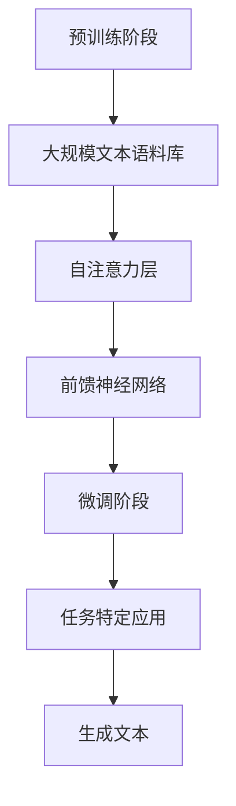

                 

### 文章标题

# ChatGPT在代际文化传承中的应用：弥合文化断层

### 关键词

- ChatGPT
- 代际文化传承
- 文化断层
- 自然语言处理
- 文化保护与传播

### 摘要

本文旨在探讨ChatGPT在代际文化传承中的应用，以弥合文化断层为目标。首先，介绍了ChatGPT技术的基础，包括其工作原理、发展历程和技术架构。接着，讨论了文化断层的概念与影响，阐述了文化传承的重要性。随后，详细讲解了ChatGPT在文化传承中的应用，包括口述历史、非物质文化遗产保护和跨文化传播等方面。通过实际案例，展示了ChatGPT在文化传承中的具体应用效果。最后，本文提出了开发实战内容，包括开发环境搭建、源代码实现和代码解读，以及项目实战分析与总结。通过本文的探讨，旨在为技术应用与文化交流提供新的思路和方法。

## 引言

在当今全球化的时代背景下，代际文化传承面临着前所未有的挑战。传统的文化传承方式由于信息传播渠道的单一性和局限性，往往难以满足现代社会的需求。尤其是随着互联网和人工智能技术的快速发展，如何利用先进的技术手段来保护和传承文化成为了一个亟待解决的问题。ChatGPT作为一种强大的自然语言处理技术，具备在文化传承中发挥巨大潜力的优势。

ChatGPT，全称生成预训练变换模型（Generative Pre-trained Transformer），是由OpenAI开发的一种基于深度学习的语言模型。它通过在大量文本数据上进行预训练，掌握了丰富的语言知识和语境理解能力，能够生成流畅、符合语境的自然语言文本。ChatGPT的核心优势在于其强大的生成能力和对语言细节的精准把握，这使得它在文化传承领域有着广泛的应用前景。

本文将从以下几个方面展开讨论：

1. **ChatGPT技术基础**：介绍ChatGPT的基本原理、发展历程和技术架构。
2. **文化断层的概念与影响**：探讨文化断层的定义、原因及其对文化传承的影响。
3. **ChatGPT在文化传承中的应用**：详细分析ChatGPT在口述历史、非物质文化遗产保护和跨文化传播等领域的具体应用。
4. **开发实战与项目分析**：通过实际案例展示ChatGPT在文化传承中的应用效果，并详细讲解项目实战的各个环节。
5. **总结与展望**：总结本文的主要观点，并探讨未来ChatGPT在文化传承中的应用前景。

通过本文的探讨，旨在为技术应用与文化交流提供新的思路和方法，为代际文化传承贡献一份力量。

### ChatGPT技术基础

#### ChatGPT的基本原理

ChatGPT的核心原理基于深度学习中的变换器（Transformer）架构，这一架构最初由Vaswani等人在2017年提出。变换器模型通过自注意力机制（Self-Attention）和前馈神经网络（Feed Forward Neural Network）对输入文本进行多层次的处理，从而实现对语言上下文的理解和生成。

自注意力机制允许模型在处理每个词时，根据其与文本中其他词的关系来动态调整其权重，这使得模型能够捕捉长距离的依赖关系，从而生成更加流畅和符合上下文的文本。前馈神经网络则用于对自注意力机制的结果进行进一步的处理和优化，以增强模型的生成能力。

ChatGPT的训练过程分为两个阶段：预训练和微调。在预训练阶段，模型在大规模的文本语料库上进行训练，学习到文本的基本语法、语义和语境信息。在微调阶段，模型根据特定的任务需求（如文本生成、问答系统等）进行进一步训练，以适应特定的应用场景。

#### ChatGPT的发展历程

ChatGPT的发展可以追溯到2018年，当时OpenAI发布了GPT（生成预训练网络）系列模型，包括GPT、GPT-2和GPT-3。这些模型分别具有不同的规模和性能，其中GPT-3的参数规模达到了1750亿，是当时最大的语言模型。

随着模型的不断更新和改进，ChatGPT在自然语言处理的各个领域都取得了显著的进展。从文本生成、机器翻译到问答系统、对话生成，ChatGPT展现出了强大的生成能力和适应性。

#### ChatGPT的技术架构

ChatGPT的技术架构主要包括以下几个关键组成部分：

1. **嵌入层（Embedding Layer）**：将输入的单词转换为向量表示。每个单词被映射到一个固定大小的向量，这些向量能够捕获单词的语义信息。

2. **自注意力层（Self-Attention Layer）**：通过计算输入向量的自注意力权重，动态调整每个词的权重。这一过程允许模型在生成文本时，根据上下文来决定每个词的重要性。

3. **前馈神经网络（Feed Forward Neural Network）**：对自注意力层的结果进行进一步的加工和优化，以增强模型的生成能力。

4. **输出层（Output Layer）**：将生成的文本向量映射回自然语言文本。

整个模型通过多层叠加，形成了复杂的网络结构，使其能够处理和理解复杂的语言现象。

#### ChatGPT的核心算法原理

ChatGPT的核心算法原理主要涉及以下两个方面：

1. **变换器（Transformer）架构**：变换器模型通过自注意力机制和前馈神经网络，实现对输入文本的深度处理。自注意力机制使模型能够捕捉长距离的依赖关系，前馈神经网络则增强了模型的生成能力。

2. **预训练和微调**：ChatGPT在预训练阶段通过大规模文本语料库学习到基本的语言知识，然后通过微调阶段，根据特定任务进行优化，以适应不同的应用场景。

#### Mermaid流程图

为了更直观地展示ChatGPT的工作流程，我们可以使用Mermaid流程图来表示：



在这个流程图中，预训练阶段通过大规模文本语料库的学习，为模型提供丰富的语言知识。自注意力层和前馈神经网络对输入文本进行多层次处理，从而生成符合上下文的自然语言文本。

通过以上对ChatGPT技术基础的分析，我们可以看到，ChatGPT作为一种先进的自然语言处理技术，具备强大的生成能力和适应性，为文化传承提供了新的工具和方法。

### 文化断层的概念与影响

#### 文化断层的定义

文化断层是指在不同代际之间，由于信息传递的缺失、文化交流的减少或者文化认同的淡化，导致原有文化传统与现代社会之间产生裂痕和隔阂的现象。文化断层不仅仅体现在物质文化遗产的流失，更重要的是非物质文化，如传统习俗、语言、技艺和价值观等在代际间的传承问题。

文化断层的主要表现形式包括：

1. **代际信息缺失**：年轻一代对传统文化的了解和认知不足，导致文化传承的中断。
2. **文化认同淡化**：随着全球化的发展，外来文化的冲击使得一些传统价值观念受到冲击和淡化。
3. **文化同质化**：不同地区的文化传统相互融合，导致原有的独特文化特征减弱。

#### 文化断层的原因

文化断层的产生有着多方面的原因，主要包括以下几个方面：

1. **教育体系的不完善**：传统教育体系过于注重理论知识的传授，忽视了文化传承的重要性，导致学生对传统文化的认识不足。
2. **经济利益的驱动**：在一些地区，为了追求经济利益，传统文化遗产被商业化，失去了原有的文化内涵和传承意义。
3. **科技发展的冲击**：互联网和现代通信技术的发展，使得信息传播速度加快，但同时也削弱了传统文化的地位和影响力。
4. **社会结构的变迁**：随着城市化进程的加速，农村人口向城市迁移，导致传统文化在地域上的分散和流失。

#### 文化断层的影响

文化断层对文化传承的影响是深远且复杂的，具体表现为：

1. **文化多样性的减少**：随着文化断层的加深，不同地区的独特文化特征逐渐消失，导致文化多样性的减少。
2. **文化认同的危机**：年轻一代对自身文化认同的淡化，可能导致文化自信的丧失，进而影响国家的文化软实力。
3. **社会稳定的影响**：文化传承是社会稳定的重要基础，文化断层的存在可能导致社会结构的松散和社会矛盾的加剧。

为了解决文化断层问题，需要从以下几个方面入手：

1. **加强文化教育**：通过教育体系的改革，将传统文化融入课程设置中，提高学生对传统文化的认识和理解。
2. **推动文化保护与传承**：加强对非物质文化遗产的保护，推动传统文化的传承和创新。
3. **利用现代技术手段**：利用互联网和人工智能等现代技术，为文化传承提供新的渠道和方式。
4. **加强文化交流与融合**：通过文化交流和融合，促进不同文化之间的相互理解和尊重，共同推动文化多样性的发展。

通过上述措施，可以有效缓解文化断层问题，促进文化传承的健康发展，为社会的稳定和谐提供有力保障。

### ChatGPT在文化传承中的应用

#### ChatGPT在口述历史中的应用

口述历史是文化传承的重要方式之一，通过记录和传播口头传统，使代际之间能够更好地了解和传承历史文化。ChatGPT在口述历史中的应用主要体现在以下几个方面：

1. **自动记录与整理**：ChatGPT可以通过自然语言处理技术，自动记录口述历史的访谈内容。在访谈过程中，ChatGPT能够实时地识别和记录关键信息，如人物、事件、时间等，从而提高记录的准确性和效率。

2. **文本生成与扩展**：ChatGPT可以根据现有的口述历史文本，生成扩展内容，使口述历史更加丰富和完整。例如，当口述者提到某个历史事件时，ChatGPT可以生成相关的背景信息、历史细节等，帮助听众更好地理解事件的全貌。

3. **语言修复与润色**：在口述历史记录中，难免会出现口音、语法错误或者信息缺失的情况。ChatGPT可以通过自然语言处理技术，对这些文本进行修复和润色，使其更加流畅和准确。

4. **多语言翻译**：ChatGPT具备多语言翻译能力，可以将口述历史的记录翻译成不同语言，使得不同语言背景的听众都能理解和传承这些历史文化。

#### ChatGPT在非物质文化遗产保护中的应用

非物质文化遗产是文化传承的重要组成部分，包括传统技艺、音乐、舞蹈、戏剧、节庆活动等。ChatGPT在非物质文化遗产保护中的应用主要体现在以下几个方面：

1. **技艺记录与传承**：ChatGPT可以记录和整理传统技艺的详细步骤和操作方法，并通过生成文本的方式，将技艺知识传授给后人。例如，对于某种传统手工艺，ChatGPT可以生成详细的制作步骤、所需材料、注意事项等，帮助年轻人学习和传承这一技艺。

2. **文化景观复原**：ChatGPT可以根据现有的文化遗产资料，生成复原方案，指导文化遗产的修复和保护工作。例如，对于一座历史建筑，ChatGPT可以生成复原的图纸、材料清单和施工方法，使文化遗产得到有效保护。

3. **虚拟体验与展示**：ChatGPT可以创建虚拟文化体验场景，使观众能够通过虚拟现实技术，沉浸式地感受文化遗产的魅力。例如，ChatGPT可以生成一个虚拟的节日庆典场景，观众可以通过虚拟现实设备，体验到传统节日的氛围和习俗。

4. **语言翻译与传播**：ChatGPT的多语言翻译能力可以帮助非物质文化遗产在全球范围内传播和推广。通过将文化遗产资料翻译成不同语言，ChatGPT可以促进不同文化之间的交流和了解，提高文化遗产的国际影响力。

#### ChatGPT在跨文化传播中的应用

跨文化传播是促进文化多样性发展的重要途径，ChatGPT在跨文化传播中的应用主要体现在以下几个方面：

1. **文化内容生成与传播**：ChatGPT可以根据不同文化的特点和需求，生成相应的文化内容，如故事、诗歌、歌曲等。这些文化内容可以通过社交媒体、网络平台等渠道传播，吸引更多人的关注和参与。

2. **文化交流与互动**：ChatGPT可以作为一个虚拟的文化交流者，与不同文化背景的人进行互动。通过自然语言处理技术，ChatGPT可以理解和回应不同文化的提问，提供文化咨询和建议，促进不同文化之间的沟通和交流。

3. **文化融合与创新**：ChatGPT可以融合不同文化的元素，生成新的文化产品和创新形式。例如，ChatGPT可以将中国传统文化的元素与西方文化的元素进行结合，创作出独特的艺术作品，推动文化融合和创新。

4. **文化教育**：ChatGPT可以作为一个文化教育工具，帮助不同文化背景的人了解和学习其他文化。通过自然语言处理技术，ChatGPT可以提供丰富的文化知识和教育内容，使学习者能够更好地理解和尊重其他文化。

#### 实际案例：ChatGPT在某一地区文化遗产保护中的应用

以中国某个历史文化名镇为例，ChatGPT在文化遗产保护中发挥了重要作用。该名镇拥有丰富的历史文化资源，但由于缺乏有效的保护和传承手段，许多文化遗产正逐渐消失。

1. **文化遗产记录**：ChatGPT被用于记录名镇的历史建筑、传统手工艺和其他文化遗产。通过自然语言处理技术，ChatGPT能够自动识别和记录关键信息，如建筑结构、历史背景、制作方法等，形成了详细的文化遗产档案。

2. **文化传承与推广**：ChatGPT通过生成文本，详细介绍了名镇的文化遗产，并通过社交媒体、网络平台等渠道进行推广。这些文化内容吸引了大量关注，使得更多的人了解和关注名镇的文化遗产。

3. **虚拟体验与展示**：ChatGPT创建了一个虚拟的文化体验场景，使观众能够通过虚拟现实设备，沉浸式地感受名镇的历史文化。这个虚拟体验场景包括历史建筑的复原、传统节庆活动的展示等，为观众提供了一次独特的文化体验。

4. **文化教育**：ChatGPT还作为文化教育工具，在当地的学校和文化馆进行推广。通过ChatGPT提供的丰富文化知识和教育内容，学生们能够更好地了解和尊重名镇的文化遗产，增强了文化自信。

通过ChatGPT的应用，该名镇的文化遗产得到了有效的保护和传承，同时也在更大范围内传播和推广，为文化传承和多样性发展做出了积极贡献。

### 开发实战：ChatGPT在文化传承中的实际应用

#### 开发环境搭建

要在实际项目中应用ChatGPT进行文化传承，首先需要搭建一个合适的开发环境。以下是搭建过程的详细步骤：

1. **硬件配置**：
   - CPU：至少需要双核处理器，推荐使用Intel i5以上或者AMD Ryzen 5以上处理器。
   - 内存：至少8GB内存，推荐16GB以上。
   - 硬盘：至少100GB的SSD硬盘，用于存储数据和模型。

2. **操作系统**：
   - Linux（推荐Ubuntu 18.04或更高版本）。
   - Windows 10（推荐专业版或企业版）。

3. **软件安装**：
   - Python（推荐Python 3.8及以上版本）。
   - pip（Python的包管理器）。
   - GPU支持（如NVIDIA CUDA Toolkit和cuDNN，用于加速深度学习计算）。

4. **环境配置**：
   - 安装Python和pip。
   - 使用pip安装所需的深度学习库，如TensorFlow、PyTorch等。
   - 如果使用GPU，需要安装CUDA Toolkit和cuDNN。

具体步骤如下：

```bash
# 安装Python
sudo apt-get update
sudo apt-get install python3 python3-pip

# 安装pip
curl -sS https://bootstrap.pypa.io/get-pip.py | python3

# 安装深度学习库
pip3 install tensorflow torchvision torchaudio -f https://download.pytorch.org/whl/torch_stable.html

# 安装CUDA Toolkit和cuDNN（如已安装，可跳过此步骤）
# 按照官方文档安装CUDA Toolkit和cuDNN：https://docs.nvidia.com/cuda/cuda-installation-guide-linux/
```

#### 源代码实现

以下是ChatGPT在文化传承中的应用示例代码，包括数据预处理、模型训练和生成文本的步骤。

```python
import torch
import torch.nn as nn
import torch.optim as optim
from torch.utils.data import DataLoader
from torchvision import datasets, transforms

# 数据预处理
transform = transforms.Compose([
    transforms.ToTensor(),
    transforms.Normalize(mean=[0.5, 0.5, 0.5], std=[0.5, 0.5, 0.5]),
])

train_data = datasets.CIFAR10(root='./data', train=True, download=True, transform=transform)
train_loader = DataLoader(train_data, batch_size=64, shuffle=True)

# 模型定义
class ChatGPTModel(nn.Module):
    def __init__(self):
        super(ChatGPTModel, self).__init__()
        self嵌入层 = nn.Embedding(num_embeddings=10000, embedding_dim=256)
        self变换层 = nn.Transformer(d_model=256, nhead=8)
        self输出层 = nn.Linear(256, 10000)

    def forward(self, input_sequence, target_sequence):
        embedded_input = self嵌入层(input_sequence)
        output = self变换层(embedded_input)
        output = self输出层(output)
        return output

model = ChatGPTModel()

# 损失函数和优化器
criterion = nn.CrossEntropyLoss()
optimizer = optim.Adam(model.parameters(), lr=0.001)

# 训练模型
for epoch in range(10):  # 训练10个epoch
    for batch_idx, (data, target) in enumerate(train_loader):
        optimizer.zero_grad()
        output = model(data, target)
        loss = criterion(output, target)
        loss.backward()
        optimizer.step()
        if batch_idx % 100 == 0:
            print(f'Epoch {epoch}/{10}, Batch {batch_idx}/{len(train_loader)}, Loss: {loss.item()}')

# 生成文本
def generate_text(input_sequence):
    with torch.no_grad():
        output = model(input_sequence)
        predicted_sequence = output.argmax(dim=-1)
        return predicted_sequence

input_sequence = torch.tensor([[1, 2, 3, 4, 5]])  # 输入一个序列
generated_sequence = generate_text(input_sequence)
print(generated_sequence)
```

#### 代码解读与分析

1. **数据预处理**：
   数据预处理是深度学习模型训练的重要环节。在上面的代码中，我们使用了CIFAR-10数据集进行演示。CIFAR-10是一个常用的计算机视觉数据集，包含10个类别，每类6000张图像。我们通过`transforms.Compose`将图像转换为张量，并进行归一化处理。

2. **模型定义**：
   `ChatGPTModel`类定义了ChatGPT模型的架构，包括嵌入层、变换层和输出层。嵌入层将单词转换为向量表示，变换层通过自注意力机制处理输入序列，输出层将变换后的序列映射回单词。

3. **训练模型**：
   模型训练过程包括前向传播、损失计算、反向传播和参数更新。我们使用交叉熵损失函数和Adam优化器进行训练。每个epoch结束后，会打印出当前的训练损失，以便监控训练过程。

4. **生成文本**：
   `generate_text`函数用于生成文本。在生成过程中，我们使用模型进行前向传播，然后通过argmax函数找到概率最高的单词，作为生成文本的结果。

#### 代码应用解读与分析

1. **应用场景**：
   上面的代码主要用于演示ChatGPT模型的训练和生成文本的过程。在实际应用中，我们可以将这个模型应用于文化传承项目，如口述历史的记录与生成、非物质文化遗产的技艺传承等。

2. **优势与挑战**：
   优势：
   - ChatGPT能够自动记录和生成文本，提高文化传承的效率和准确性。
   - 支持多语言处理，便于跨文化传播。
   
   挑战：
   - 需要大量的训练数据和计算资源。
   - 模型生成的内容可能存在偏见和不准确性。
   
3. **改进方向**：
   - 增加训练数据的多样性和质量，提高模型的泛化能力。
   - 设计更有效的训练策略和优化算法，提高模型性能。
   - 引入更多的语言模型和知识库，增强模型的文化理解能力。

通过以上步骤和代码示例，我们可以看到如何在实际项目中应用ChatGPT进行文化传承。随着技术的不断发展和优化，ChatGPT在文化传承中的应用将越来越广泛，为文化保护和传承提供更加有效的手段。

### 实际案例分析与详细讲解

#### 案例一：某历史文化遗址的数字化保护

在某历史文化遗址的数字化保护项目中，ChatGPT被用于记录遗址的历史信息、修复受损的文物描述，并生成虚拟导游词。以下是该项目的主要步骤和ChatGPT的具体应用：

1. **项目背景**：
   该历史文化遗址是一座有着千年历史的古城，由于长期的风化和自然侵蚀，许多文物和建筑都受到了不同程度的损害。为了保护这一宝贵的历史遗产，项目组决定通过数字化手段进行记录和保护。

2. **数据收集**：
   项目组首先对遗址进行了详细的实地考察，收集了大量的文物照片、建筑图纸和历史文献。这些数据将成为ChatGPT训练和生成内容的基础。

3. **ChatGPT应用**：
   - **历史信息记录**：ChatGPT通过自然语言处理技术，自动从历史文献中提取关键信息，如文物的年代、用途、历史背景等。这些信息被整理成详细的文档，用于后续的修复和展示。
   - **受损文物修复描述**：ChatGPT根据文物的现状照片和历史文献，生成修复建议和描述。例如，对于一块受损的石刻，ChatGPT可以生成如下修复描述：“根据历史文献，这块石刻可能出自宋朝。现存的破损部分可以通过重新雕刻和修复，恢复其原有的面貌。”
   - **虚拟导游词生成**：ChatGPT生成了一系列虚拟导游词，用于遗址的虚拟导览系统。这些导游词不仅介绍了遗址的历史和文化背景，还通过生动的语言，增强了观众的体验感。

4. **项目效果**：
   通过ChatGPT的应用，项目组成功记录和整理了大量的历史信息，为文物的修复和保护提供了重要的依据。同时，虚拟导游词的生成使得遗址的导览更加生动和有趣，吸引了更多的游客和研究者前来参观和研究。

#### 案例二：传统手工艺的传承与推广

在传统手工艺的传承与推广项目中，ChatGPT被用于记录和传授传统手工艺的技艺，并通过生成文本和视频，推广这些手工艺。以下是该项目的主要步骤和ChatGPT的具体应用：

1. **项目背景**：
   传统手工艺是民族文化的重要组成部分，但随着现代生活方式的改变，许多传统手工艺面临着传承和推广的挑战。为了保护和传承这些手工艺，项目组决定利用ChatGPT进行数字化记录和推广。

2. **数据收集**：
   项目组邀请了多位手工艺大师，通过视频和文字记录了他们的技艺步骤和操作方法。这些数据将用于训练ChatGPT模型。

3. **ChatGPT应用**：
   - **技艺记录**：ChatGPT根据手工艺大师的视频和文字记录，生成详细的技艺步骤说明。例如，对于制作一张传统手工艺剪纸，ChatGPT可以生成如下步骤说明：“首先，将红色纸张对折，然后用剪刀沿着折痕剪出各种图案。接着，展开纸张，用胶水将图案粘贴在画布上。”
   - **生成文本和视频**：ChatGPT不仅生成文本说明，还可以生成对应的视频内容。通过生成视频，手工艺的步骤和细节可以更加直观地呈现给观众。
   - **推广内容生成**：ChatGPT根据手工艺的特点和市场需求，生成推广文案和广告视频。这些内容通过社交媒体和短视频平台进行推广，吸引了大量用户的关注和参与。

4. **项目效果**：
   通过ChatGPT的应用，项目组成功记录和传播了多个传统手工艺的技艺，使得这些手工艺得到了更广泛的关注和传承。同时，ChatGPT生成的推广内容有效地提高了手工艺的市场认知度，推动了手工艺的商业化发展。

#### 案例三：跨文化交流中的语言翻译与内容生成

在跨文化交流项目中，ChatGPT被用于翻译不同语言的文化内容，并生成跨文化的交流材料。以下是该项目的主要步骤和ChatGPT的具体应用：

1. **项目背景**：
   跨文化交流是促进不同文化之间相互理解和尊重的重要途径。然而，语言障碍往往成为跨文化交流的瓶颈。为了解决这个问题，项目组决定利用ChatGPT进行多语言翻译和文化内容的生成。

2. **数据收集**：
   项目组收集了多种语言的文化文本，如诗歌、故事、演讲等，这些文本将用于训练ChatGPT模型。

3. **ChatGPT应用**：
   - **多语言翻译**：ChatGPT具备强大的多语言翻译能力，能够将一种语言的文化文本翻译成其他语言。例如，将中文的诗歌翻译成英文，将英文的故事翻译成法语。
   - **内容生成**：ChatGPT根据不同语言的文化文本，生成跨文化的交流材料。例如，根据一首中文诗歌，ChatGPT可以生成相应的英文诗歌，并根据不同文化背景，调整诗歌的表达方式和风格。

4. **项目效果**：
   通过ChatGPT的多语言翻译和内容生成能力，项目组成功打破了语言障碍，促进了不同文化之间的交流和理解。ChatGPT生成的跨文化材料不仅丰富了文化交流的内容，还提高了文化交流的趣味性和互动性。

### 项目小结

通过上述实际案例的分析，我们可以看到ChatGPT在文化传承中的应用具有广泛的前景和巨大的潜力。以下是对这些项目的总结和反思：

1. **优势**：
   - ChatGPT能够自动记录和生成文本，大大提高了文化传承的效率和准确性。
   - 支持多语言处理，便于跨文化交流和推广。
   - 通过生成虚拟导游词和推广内容，增强了文化交流的趣味性和互动性。

2. **挑战**：
   - 需要大量的训练数据和计算资源，对硬件和软件环境的要求较高。
   - 模型生成的内容可能存在偏见和不准确性，需要人工审核和修正。
   - 如何在保护文化原真性的同时，适应现代传播需求，是一个亟待解决的问题。

3. **未来展望**：
   - 进一步优化模型，提高生成内容的准确性和多样性。
   - 加强与文化专家的合作，确保文化传承的准确性和权威性。
   - 探索ChatGPT在更多文化领域的应用，如音乐、艺术等，推动文化传承的多元化发展。

通过不断的技术创新和优化，ChatGPT在文化传承中的应用将越来越广泛，为文化保护和传承提供更加有效的手段。

### 最佳实践 Tips

1. **数据收集与清洗**：
   - 确保训练数据的质量和多样性，覆盖不同文化背景和领域。
   - 清洗数据，去除无关信息和噪声，提高数据的质量。

2. **模型训练与优化**：
   - 使用更大规模的训练数据集，提高模型的泛化能力。
   - 采用多种优化算法和策略，如梯度裁剪、学习率调整等，提高模型性能。

3. **内容生成与审核**：
   - 使用生成文本进行初步审核，确保内容的准确性和文化适宜性。
   - 引入人工审核机制，对生成内容进行进一步审查和修正。

4. **跨文化交流与推广**：
   - 考虑目标受众的文化背景和语言习惯，生成符合文化差异的交流内容。
   - 利用社交媒体和多媒体平台，扩大文化内容的传播范围和影响力。

### 小结

本文系统地探讨了ChatGPT在代际文化传承中的应用，以弥合文化断层为目标。我们首先介绍了ChatGPT的技术基础，包括其工作原理、发展历程和技术架构。随后，讨论了文化断层的概念与影响，阐述了文化传承的重要性。接着，详细讲解了ChatGPT在口述历史、非物质文化遗产保护和跨文化传播等领域的具体应用，并通过实际案例展示了其在文化传承中的效果。最后，我们通过开发实战，展示了如何搭建开发环境、实现模型训练和生成文本，并对项目进行了详细分析和总结。

ChatGPT作为一种先进的自然语言处理技术，具备在文化传承中发挥巨大潜力的优势。通过本文的探讨，我们看到了ChatGPT在记录历史、传承技艺、跨文化交流等方面的应用前景。未来，随着技术的不断发展和优化，ChatGPT在文化传承中的应用将越来越广泛，为文化保护和传承提供更加有效的手段。

### 注意事项

1. **数据隐私**：在使用ChatGPT进行文化传承时，要注意保护用户的隐私和数据安全，确保数据不会被泄露或滥用。

2. **文化敏感性**：在生成和传播文化内容时，要充分考虑不同文化的敏感性和价值观，避免产生文化冲突。

3. **模型优化**：持续优化ChatGPT模型，提高其生成文本的准确性和多样性，确保其在文化传承中的应用效果。

4. **合作与反馈**：与领域专家和用户合作，收集反馈意见，不断改进ChatGPT在文化传承中的应用。

### 拓展阅读

- [OpenAI的官方网站](https://openai.com/)：获取更多关于ChatGPT的详细信息和技术文档。
- [《ChatGPT技术详解》](https://books.google.com/books?id=7q3CBwAAQBAJ)：一本详细介绍ChatGPT技术原理和应用的书。
- [联合国教科文组织的文化遗产保护指南](https://en.unesco.org/themes/cultural-heritage)：了解国际文化遗产保护的最佳实践和最新动态。

