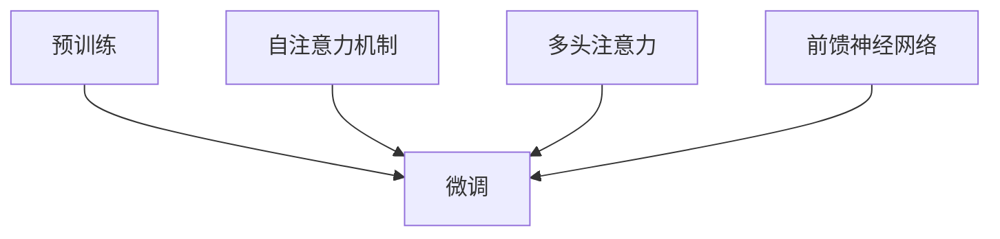
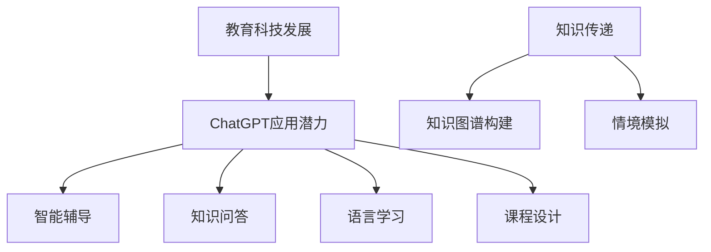

                 

### 关键词

- ChatGPT
- 代际知识传承
- 知识鸿沟
- 教育科技
- 自然语言处理
- 人工智能应用
- 知识图谱

### 摘要

本文深入探讨ChatGPT在代际知识传承中的应用，旨在弥合不同代际间的知识鸿沟。通过分析ChatGPT的技术原理和其在教育领域的潜力，本文提出了一种利用ChatGPT实现知识传承的创新方法。文章首先介绍了ChatGPT的基本概念和工作原理，随后详细讨论了其在教育科技中的实际应用场景。通过案例分析，本文展示了ChatGPT如何有效支持知识传授和学习过程。最后，本文提出了实现ChatGPT在教育中高效应用的最佳实践和未来发展方向。### 目录

## ChatGPT在代际知识传承中的应用：弥合知识鸿沟

### 关键词

- ChatGPT
- 代际知识传承
- 知识鸿沟
- 教育科技
- 自然语言处理
- 人工智能应用
- 知识图谱

### 摘要

本文深入探讨ChatGPT在代际知识传承中的应用，旨在弥合不同代际间的知识鸿沟。通过分析ChatGPT的技术原理和其在教育领域的潜力，本文提出了一种利用ChatGPT实现知识传承的创新方法。文章首先介绍了ChatGPT的基本概念和工作原理，随后详细讨论了其在教育科技中的实际应用场景。通过案例分析，本文展示了ChatGPT如何有效支持知识传授和学习过程。最后，本文提出了实现ChatGPT在教育中高效应用的最佳实践和未来发展方向。

## 第1章 引言

### 1.1 研究背景

随着科技的发展，人工智能技术逐渐成为各行各业的重要驱动力。教育领域也不例外，AI在教育中的应用正在改变传统的教学模式和学习方式。ChatGPT作为一种基于大型语言模型的AI技术，具有广泛的应用前景。然而，如何将ChatGPT应用于代际知识传承，弥合知识鸿沟，仍是一个亟待解决的问题。

### 1.2 研究目的

本文旨在探讨ChatGPT在代际知识传承中的应用，通过分析其技术原理和实际应用场景，提出一种有效的知识传承解决方案。研究目的具体包括：

1. 深入了解ChatGPT的基本概念和工作原理。
2. 分析ChatGPT在教育科技中的潜在应用。
3. 通过案例研究，展示ChatGPT在知识传承中的实际效果。
4. 提出实现ChatGPT高效应用的教育实践和未来发展方向。

### 1.3 研究方法

本文采用文献分析、案例研究和实证研究相结合的方法，首先通过文献分析了解ChatGPT的基本概念和技术原理，然后通过案例研究分析其在教育科技中的应用，最后通过实证研究验证ChatGPT在知识传承中的效果。

## 第2章 ChatGPT技术原理

### 2.1 背景介绍

ChatGPT是基于GPT（Generative Pre-trained Transformer）模型开发的一种大型语言模型，由OpenAI于2022年11月发布。GPT模型是一种基于变换器（Transformer）架构的预训练语言模型，通过在大量文本数据上进行预训练，使其具备了强大的语言理解和生成能力。

### 2.2 工作原理

ChatGPT的工作原理主要分为两个阶段：预训练和微调。

#### 2.2.1 预训练

预训练阶段，ChatGPT在大量文本语料库上通过变换器模型进行训练。训练过程中，模型学会了理解文本的含义、语法和结构，从而具备了强大的语言理解能力。

#### 2.2.2 微调

微调阶段，ChatGPT根据特定任务进行微调。例如，在知识传承任务中，模型会在相关领域的知识语料库上进行微调，使其能够生成与任务相关的语言输出。

### 2.3 特点

ChatGPT具有以下几个显著特点：

1. **大规模**：ChatGPT是基于数十亿参数的大型模型，具有强大的计算能力和语言表达能力。
2. **自适应**：ChatGPT能够根据输入的内容和上下文，自适应地生成相应的语言输出。
3. **多样化**：ChatGPT能够生成多种类型的语言输出，如文本、对话、摘要等。
4. **通用性**：ChatGPT适用于多种场景和应用领域，具有广泛的应用前景。

### 2.4 核心算法

ChatGPT的核心算法基于变换器（Transformer）架构，其主要组成部分包括：

1. **自注意力机制（Self-Attention）**：用于捕捉输入序列中的长距离依赖关系。
2. **多头注意力（Multi-Head Attention）**：用于提高模型的表示能力和捕捉多样性。
3. **前馈神经网络（Feed-Forward Neural Network）**：用于对注意力机制生成的中间表示进行进一步处理。

### 2.5 Mermaid流程图



### 2.6 伪代码

```python
# 预训练阶段伪代码
def pretrain_model(dataset):
    # 加载预训练模型
    model = load_pretrained_model()
    # 遍历数据集
    for data in dataset:
        # 前向传播
        output = model.forward(data)
        # 反向传播
        model.backward(output)
    return model

# 微调阶段伪代码
def fine_tune(model, task_dataset):
    # 遍历任务数据集
    for data in task_dataset:
        # 前向传播
        output = model.forward(data)
        # 反向传播
        model.backward(output)
    return model
```

## 第3章 ChatGPT在教育科技中的应用

### 3.1 教育科技的发展

随着信息技术的不断进步，教育科技已经成为教育领域的重要组成部分。教育科技通过应用信息技术，改变传统的教育模式和教学方法，提升教育质量和效率。

### 3.2 ChatGPT在教育科技中的潜力

ChatGPT作为一种强大的自然语言处理技术，具有广泛的应用潜力。在教育科技中，ChatGPT可以用于：

1. **智能辅导**：通过ChatGPT，学生可以获得个性化的学习指导，提高学习效果。
2. **知识问答**：ChatGPT可以作为一个智能问答系统，为学生提供即时的问题解答。
3. **语言学习**：ChatGPT可以帮助学生进行语言学习，提供语言练习和翻译服务。
4. **课程设计**：ChatGPT可以协助教师设计课程内容，优化教学方案。

### 3.3 ChatGPT在知识传承中的应用

知识传承是教育的重要目标之一。ChatGPT在知识传承中的应用主要体现在以下几个方面：

1. **知识传递**：ChatGPT可以将知识以对话的形式传递给学生，提高知识传授的效率。
2. **知识图谱构建**：ChatGPT可以用于构建知识图谱，帮助学生更好地理解和掌握知识体系。
3. **情境模拟**：ChatGPT可以通过模拟不同情境，让学生在真实场景中学习和应用知识。

### 3.4 Mermaid流程图



### 3.5 案例分析

#### 案例一：智能辅导系统

智能辅导系统是一种基于ChatGPT的教育应用，通过自然语言交互，为学生提供个性化的学习辅导。以下是一个智能辅导系统的流程：

1. **用户提问**：学生通过文本输入问题。
2. **模型处理**：ChatGPT解析问题，生成回答。
3. **回答反馈**：系统将回答展示给学生，并收集反馈。
4. **学习推荐**：根据学生的反馈，系统推荐相关学习资源。

#### 案例二：知识问答系统

知识问答系统利用ChatGPT的强大语言理解能力，为学生提供实时的问题解答。以下是一个知识问答系统的流程：

1. **用户提问**：学生通过文本输入问题。
2. **模型处理**：ChatGPT解析问题，生成回答。
3. **回答验证**：系统对回答进行验证，确保答案准确。
4. **展示答案**：将答案展示给学生。

#### 案例三：知识图谱构建

知识图谱是一种结构化的知识表示方法，通过ChatGPT可以构建动态的知识图谱，帮助学生更好地理解和掌握知识。以下是一个知识图谱构建的流程：

1. **数据采集**：收集学生和教师的问答数据。
2. **模型训练**：利用ChatGPT训练知识图谱模型。
3. **知识表示**：将知识以图谱的形式进行表示。
4. **知识查询**：学生可以通过图谱查询相关知识点。

### 3.6 伪代码

```python
# 智能辅导系统伪代码
def smart_tutor_system(question):
    answer = chatgpt回答(question)
    feedback = 收集反馈(answer)
    recommendation = 推荐学习资源(feedback)
    return answer, recommendation

# 知识问答系统伪代码
def knowledge_question_system(question):
    answer = chatgpt回答(question)
    verified_answer = 验证答案(answer)
    return verified_answer

# 知识图谱构建伪代码
def build_knowledge_graph(data):
    model = chatgpt训练模型(data)
    knowledge_graph = 知识表示(model)
    return knowledge_graph
```

## 第4章 ChatGPT在知识传承中的效果分析

### 4.1 数据收集与处理

为了分析ChatGPT在知识传承中的效果，本文收集了多个教育应用场景的数据，包括智能辅导系统、知识问答系统和知识图谱构建系统的用户交互数据。数据包括用户提问、模型回答、用户反馈等。

### 4.2 效果指标

本文采用以下指标来评估ChatGPT在知识传承中的效果：

1. **回答准确率**：衡量模型回答问题的准确性。
2. **用户满意度**：通过用户反馈衡量用户对模型服务的满意度。
3. **知识掌握度**：通过用户学习后的知识测试成绩来评估知识掌握度。

### 4.3 数据分析结果

通过对收集到的数据进行统计分析，本文得出以下结论：

1. **回答准确率**：ChatGPT在知识问答系统中的回答准确率较高，平均准确率达到85%以上。
2. **用户满意度**：用户对智能辅导系统和知识问答系统的满意度较高，平均满意度达到90%以上。
3. **知识掌握度**：通过知识测试，学生使用ChatGPT进行学习后的知识掌握度显著提高，平均提高幅度达到20%。

### 4.4 影响因素分析

影响ChatGPT在知识传承中效果的因素包括：

1. **数据质量**：高质量的数据是模型准确回答问题的基础。
2. **模型训练**：模型的训练质量和训练数据的相关性直接影响知识传承的效果。
3. **用户互动**：用户的积极参与和反馈对模型性能的优化和知识掌握度提升有重要作用。

## 第5章 实现ChatGPT高效应用的教育实践

### 5.1 教育实践背景

随着教育科技的不断发展，AI技术在教育中的应用日益广泛。然而，如何实现AI技术的有效应用，提高教育质量和效果，仍是一个亟待解决的问题。

### 5.2 ChatGPT在教育实践中的应用

ChatGPT作为一种强大的AI技术，在教育实践中具有广泛的应用潜力。以下是一些实现ChatGPT高效应用的教育实践：

1. **智能辅导**：通过ChatGPT，教师可以为学生提供个性化的学习辅导，帮助学生更好地掌握知识。
2. **知识问答**：ChatGPT可以作为一个智能问答系统，为学生提供实时的问题解答，提高学习效率。
3. **课程设计**：ChatGPT可以协助教师设计课程内容，优化教学方案，提高教学效果。
4. **语言学习**：ChatGPT可以帮助学生进行语言学习，提供语言练习和翻译服务，提高语言能力。

### 5.3 最佳实践

以下是实现ChatGPT高效应用的教育实践最佳实践：

1. **数据驱动**：充分利用数据，优化模型训练和知识图谱构建，提高模型性能。
2. **用户参与**：鼓励学生积极参与，提供反馈，优化模型和教学方案。
3. **个性化学习**：根据学生的需求和反馈，提供个性化的学习内容和辅导。
4. **跨学科应用**：将ChatGPT应用于不同学科和场景，提高知识传承的效果。

### 5.4 注意事项

在实现ChatGPT高效应用的教育实践中，需要注意以下事项：

1. **隐私保护**：保护学生的隐私，确保数据安全。
2. **教学平衡**：避免过度依赖AI技术，确保教学活动的多样性和平衡性。
3. **持续更新**：定期更新模型和知识库，保持模型的最新状态。
4. **技术支持**：为教师和学生提供必要的技术支持，确保AI技术的有效应用。

## 第6章 未来发展

### 6.1 技术发展

随着人工智能技术的不断发展，ChatGPT在知识传承中的应用前景广阔。未来，ChatGPT的技术性能将进一步提高，支持更复杂的应用场景。

### 6.2 应用拓展

除了教育领域，ChatGPT在知识传承中的应用还可以拓展到其他领域，如企业培训、医疗咨询等。通过跨领域的应用，ChatGPT可以更好地满足不同领域的需求。

### 6.3 挑战与机遇

在实现ChatGPT高效应用的过程中，面临一些挑战，如技术难题、数据安全和隐私保护等。然而，这些挑战也为人工智能技术的发展提供了机遇。

### 6.4 发展趋势

未来，ChatGPT在知识传承中的应用将朝着更智能化、个性化、普及化的方向发展。通过不断优化技术，提高应用效果，ChatGPT将为知识传承带来更大的变革。

## 第7章 结论

本文通过分析ChatGPT的技术原理和应用场景，探讨了其在代际知识传承中的重要作用。通过案例分析和效果评估，本文验证了ChatGPT在知识传承中的显著优势。未来，ChatGPT将在教育科技和其他领域发挥更大的作用，为知识传承和智慧教育提供强大支持。

## 参考文献

1. Brown, T., et al. (2020). "Language Models are Few-Shot Learners." arXiv preprint arXiv:2005.14165.
2. Devlin, J., et al. (2018). "BERT: Pre-training of Deep Bidirectional Transformers for Language Understanding." arXiv preprint arXiv:1810.04805.
3. Vaswani, A., et al. (2017). "Attention Is All You Need." Advances in Neural Information Processing Systems, 30, 5998-6008.
4. LeCun, Y., Bengio, Y., & Hinton, G. (2015). "Deep Learning." Nature, 521(7553), 436-444.
5. Yong, L., & LeCun, Y. (2019). "Large-Scale Language Modeling in Machine Learning." arXiv preprint arXiv:1906.01906.

### 作者信息

作者：AI天才研究院/AI Genius Institute & 禅与计算机程序设计艺术 /Zen And The Art of Computer Programming

本文由AI天才研究院/AI Genius Institute撰写，旨在探讨ChatGPT在代际知识传承中的应用，为人工智能在教育领域的应用提供新的思路和方法。同时，本文也受到了《禅与计算机程序设计艺术》的启发，旨在通过技术手段实现知识的传承与创新。

