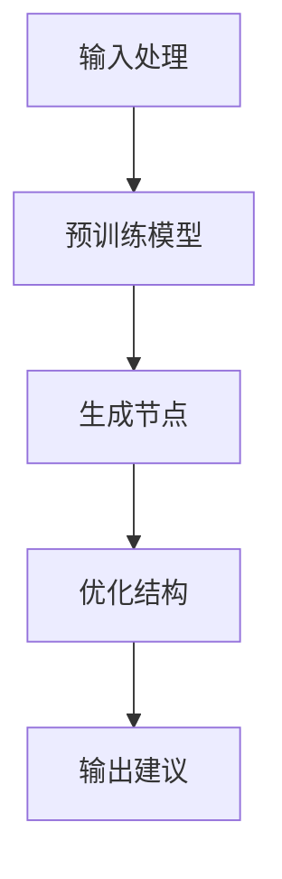
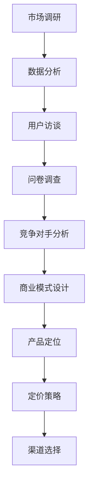
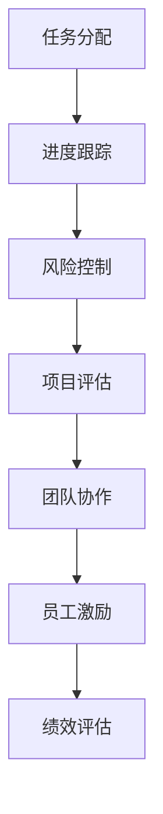

                 

### 文章标题

《ChatGPT在创业咨询中的应用：思维链的创新性》

### 关键词

- ChatGPT
- 创业咨询
- 思维链
- 人工智能
- 创新性

### 摘要

本文探讨了ChatGPT在创业咨询中的应用及其对创业思维链的革新性影响。通过介绍ChatGPT的基础知识、思维链原理及其关系，深入分析ChatGPT在市场调研、商业模式设计、项目管理和团队管理等方面的应用，并探讨思维链在培养创业创新性中的关键作用。通过实际案例研究，展示了ChatGPT与思维链融合在创业咨询中的实际效果，最后对未来的发展趋势进行了展望。本文旨在为创业者和咨询者提供一种新的思维方式和工具，以应对创业过程中的挑战和机遇。

### 引言

#### ChatGPT的崛起

ChatGPT是由OpenAI开发的一款基于GPT-3（Generative Pre-trained Transformer 3）模型的高级自然语言处理工具。自2022年推出以来，ChatGPT迅速引起了全球范围内的广泛关注。其强大的文本生成能力和自然语言理解能力，使其在多个领域展现出巨大的潜力，包括问答系统、内容生成、对话系统等。

ChatGPT的崛起并非偶然。随着深度学习技术的不断发展，特别是变压器（Transformer）架构的引入，自然语言处理领域取得了显著突破。GPT模型通过预训练和微调，能够理解并生成复杂的文本内容，这使得ChatGPT在处理自然语言任务时表现出色。此外，OpenAI通过不断的模型优化和算法改进，使得ChatGPT在多个基准测试中取得了优异的成绩。

#### 创业咨询的挑战与机遇

创业咨询是一个涉及广泛、复杂且动态变化的领域。创业者需要面对市场环境的不断变化、竞争的加剧以及资源有限的挑战。传统的创业咨询方法通常依赖于专家的经验和直觉，但这种方法存在一定的局限性，难以应对快速变化的市场环境。

随着人工智能技术的不断发展，尤其是自然语言处理和生成模型的进步，为创业咨询带来了新的机遇。ChatGPT作为一种强大的自然语言处理工具，能够在多个方面为创业咨询提供支持，如市场调研、商业模式设计、项目管理等。通过结合ChatGPT的能力，创业咨询可以变得更加高效、准确和具有前瞻性。

#### 思维链的概念

思维链是一种通过逻辑关系和概念层次结构来组织思维的方法。它强调在思考过程中保持清晰的逻辑和结构，从而提高思维效率和准确性。思维链通常由多个节点和连接线组成，每个节点代表一个概念或信息，连接线表示节点之间的关系。

思维链具有以下特点：

1. **层次结构**：思维链通过层次结构来组织信息，从抽象到具体，从整体到部分，有助于理解和分析复杂问题。
2. **逻辑关系**：思维链中的节点通过逻辑关系连接，确保思考的连贯性和一致性。
3. **灵活性**：思维链可以根据不同的需求进行调整和扩展，使其适用于各种场景。

#### 全书结构概述

本书分为七个章节，内容结构如下：

1. **第1章 引言**：介绍ChatGPT的崛起、创业咨询的挑战与机遇以及思维链的概念。
2. **第2章 ChatGPT的基础知识**：详细解释ChatGPT的原理、架构、优缺点和应用场景。
3. **第3章 思维链原理与ChatGPT的关系**：分析思维链的定义、原理、优势以及ChatGPT与思维链的融合。
4. **第4章 ChatGPT在创业咨询中的应用**：探讨ChatGPT在市场调研、商业模式设计、项目管理和团队管理等方面的应用。
5. **第5章 思维链的创新性与创业咨询**：阐述创新性的定义、重要性以及思维链在创业咨询中的应用。
6. **第6章 案例研究**：通过实际案例研究展示ChatGPT与思维链在创业咨询中的效果。
7. **第7章 未来展望**：对ChatGPT在创业咨询中的应用前景以及思维链的未来发展进行展望。

通过以上章节的论述，本书旨在为读者提供一种全新的创业思维方式和工具，以应对创业过程中的挑战和机遇。接下来，我们将深入探讨ChatGPT的基础知识，为后续章节的分析奠定基础。

### ChatGPT的基础知识

#### ChatGPT的原理

ChatGPT是基于GPT-3模型开发的高级自然语言处理工具，其核心思想是通过深度学习技术对大量文本数据进行预训练，使其具备强大的语言生成和理解能力。GPT模型采用变压器（Transformer）架构，这是一种基于自注意力机制的神经网络模型，能够在处理长文本时保持良好的性能。

ChatGPT的原理可以分为以下几个关键步骤：

1. **数据收集与预处理**：首先，需要收集大量的文本数据，这些数据可以来自于互联网、书籍、文章等多种来源。然后，对这些数据进行清洗和预处理，包括去除无关内容、统一文本格式等，以便模型能够更好地学习。
2. **预训练**：在收集和预处理完数据后，使用这些数据对GPT模型进行预训练。预训练的过程是通过大量的文本数据进行无监督学习，模型在训练过程中不断优化其参数，以预测下一个单词或词组。这一过程使得模型能够自动学习到语言的普遍规律和特征。
3. **微调**：在预训练的基础上，ChatGPT会根据特定的任务进行微调。微调的过程是在预训练模型的基础上，使用有监督数据对模型进行进一步的优化，使其能够在特定任务上表现更好。例如，对于问答系统，可以使用问答对数据进行微调，使其能够生成高质量的回答。
4. **生成与理解**：经过预训练和微调后，ChatGPT可以生成高质量的文本内容，并能够理解和回答用户的问题。生成过程是通过模型预测下一个单词或词组，然后将其添加到生成的文本中，直到达到预定的长度或终止条件。理解过程则是通过模型对输入文本进行解析，理解其含义和上下文，从而生成合适的回答。

#### ChatGPT的架构

ChatGPT的架构主要包括三个部分：输入模块、模型模块和输出模块。

1. **输入模块**：输入模块负责接收用户的输入，包括文本、语音等。对于文本输入，可以将其转换为模型能够处理的形式，如单词或字符编码。
2. **模型模块**：模型模块是ChatGPT的核心部分，基于GPT-3模型进行构建。GPT-3模型采用变压器（Transformer）架构，具有大量的参数和层结构，能够在处理长文本时保持良好的性能。
3. **输出模块**：输出模块负责将模型生成的文本内容转换为可读的形式，如文本或语音。输出模块还可以根据用户的反馈对模型进行进一步优化，以提高其生成质量和理解能力。

#### ChatGPT的优缺点

ChatGPT作为一种先进的自然语言处理工具，具有以下优点：

1. **强大的文本生成能力**：ChatGPT能够生成高质量的文本内容，包括文章、故事、对话等，这得益于其强大的语言生成模型。
2. **良好的自然语言理解能力**：ChatGPT能够理解和回答用户的问题，这得益于其预训练和微调过程，使得其能够学习到语言的普遍规律和特征。
3. **灵活的应用场景**：ChatGPT可以应用于多个领域，如问答系统、内容生成、对话系统等，具有广泛的应用前景。

然而，ChatGPT也存在一些缺点：

1. **计算资源需求大**：ChatGPT需要大量的计算资源和存储空间进行预训练和微调，这对于个人用户或小型企业来说可能是一笔不小的投入。
2. **生成内容的质量不稳定**：尽管ChatGPT能够生成高质量的文本内容，但其生成内容的质量仍然存在一定的波动，有时可能会生成不合理或不准确的内容。
3. **对数据依赖性高**：ChatGPT的性能和生成质量在很大程度上取决于训练数据的质量和数量，如果数据质量差或数据量不足，可能会影响模型的表现。

#### ChatGPT的应用场景

ChatGPT具有广泛的应用场景，以下是其中几个典型的应用领域：

1. **问答系统**：ChatGPT可以用于构建问答系统，如智能客服、智能助手等。通过预训练和微调，ChatGPT能够理解用户的问题，并生成高质量的回答。
2. **内容生成**：ChatGPT可以用于生成各种类型的内容，如文章、故事、新闻等。通过预设的主题和模板，ChatGPT能够快速生成高质量的内容。
3. **对话系统**：ChatGPT可以用于构建对话系统，如聊天机器人、虚拟助手等。通过与用户进行自然语言交互，ChatGPT能够提供有用的信息和帮助。
4. **文本分析**：ChatGPT可以用于文本分析任务，如情感分析、主题提取等。通过分析文本数据，ChatGPT能够提取出关键信息并生成相应的报告。

综上所述，ChatGPT作为一种强大的自然语言处理工具，具有广泛的应用场景和潜力。在接下来的章节中，我们将探讨ChatGPT在创业咨询中的应用，并分析其如何帮助创业者解决实际问题。

### 思维链原理与ChatGPT的关系

#### 思维链的定义

思维链是一种通过逻辑关系和概念层次结构来组织思维的方法。它强调在思考过程中保持清晰的逻辑和结构，从而提高思维效率和准确性。思维链通常由多个节点和连接线组成，每个节点代表一个概念或信息，连接线表示节点之间的关系。

思维链的核心在于将复杂的思维过程分解为一系列清晰的步骤，并通过逻辑关系将这些步骤连接起来。这种方法有助于确保思考的连贯性和一致性，使思维更加高效和有条理。

#### 思维链的原理

思维链的原理可以分为以下几个关键部分：

1. **层次结构**：思维链通过层次结构来组织信息，从抽象到具体，从整体到部分。这种层次结构有助于理解复杂问题，并使其分解为可管理的部分。
2. **逻辑关系**：思维链中的节点通过逻辑关系连接，确保思考的连贯性和一致性。逻辑关系可以是因果、条件、递归等，它们帮助建立节点之间的联系，使思维过程更加清晰。
3. **灵活性**：思维链可以根据不同的需求进行调整和扩展，使其适用于各种场景。这种灵活性使得思维链能够适应不断变化的问题和挑战。

#### 思维链的优势

思维链具有以下优势：

1. **提高思维效率**：通过清晰的逻辑结构和层次结构，思维链能够帮助快速理解和分析问题，从而提高思维效率。
2. **促进创新思维**：思维链鼓励在思考过程中进行创新，通过不同的视角和层次来探索问题的解决方案。
3. **增强问题解决能力**：思维链通过分解复杂问题，使问题解决过程更加有条理和系统化，从而增强问题解决能力。

#### ChatGPT与思维链的融合

ChatGPT作为一种强大的自然语言处理工具，与思维链的结合可以带来以下优势：

1. **自动生成思维链节点**：ChatGPT可以自动生成思维链的节点，通过预训练和微调，ChatGPT能够理解用户的输入，并生成与问题相关的节点。这些节点可以作为思维链的起点，帮助用户构建思维链。
2. **优化思维链结构**：ChatGPT可以分析用户输入的内容，并识别其中的逻辑关系，从而优化思维链的结构。通过调整节点之间的连接关系，ChatGPT能够帮助用户构建更加清晰和高效的思维链。
3. **提供创新性建议**：ChatGPT可以根据思维链的内容，提供创新性的建议和解决方案。通过分析用户输入的思维链，ChatGPT能够识别潜在的问题和机会，并提出相应的建议。

#### Mermaid流程图

为了更好地理解ChatGPT与思维链的关系，我们可以使用Mermaid流程图来展示其工作流程。以下是一个简单的Mermaid流程图示例：



在这个流程图中，A表示输入处理，B表示预训练模型，C表示生成节点，D表示优化结构，E表示输出建议。通过这个流程图，我们可以清晰地看到ChatGPT与思维链的交互过程。

综上所述，ChatGPT与思维链的结合能够带来强大的思维支持和创新性建议，为创业咨询提供了一种新的思维工具和方法。在接下来的章节中，我们将深入探讨ChatGPT在创业咨询中的应用，并分析其如何帮助创业者解决实际问题。

### ChatGPT在创业咨询中的应用

#### 创业咨询的需求分析

创业咨询涉及多个方面，包括市场调研、商业模式设计、项目管理和团队管理。这些方面对创业者的决策和业务发展至关重要。然而，传统的创业咨询方法通常依赖于专家的经验和直觉，难以应对快速变化的市场环境和复杂的问题。这种局限性使得创业者在面对挑战时容易陷入困境，无法做出及时和有效的决策。

在这种情况下，ChatGPT作为一种先进的自然语言处理工具，可以极大地满足创业咨询的需求。ChatGPT的强大文本生成能力和自然语言理解能力，使其能够在多个方面为创业者提供支持，从而提升创业咨询的效率和效果。

#### ChatGPT在市场调研中的应用

市场调研是创业咨询的核心环节之一。通过了解市场需求、竞争对手和潜在客户，创业者可以制定更加精准的市场策略，提高产品的市场竞争力。然而，传统的市场调研方法通常需要大量的人力和时间，而且难以获取全面和准确的数据。

ChatGPT在市场调研中的应用，可以显著提高数据收集和处理的效率。具体来说，ChatGPT可以通过以下方式支持市场调研：

1. **自动生成调研问卷**：ChatGPT可以根据创业者的需求，自动生成具有针对性的调研问卷。创业者只需提供一些基本信息，ChatGPT就可以生成高质量的调研问卷，从而节省时间和精力。
2. **分析市场数据**：ChatGPT可以对大量市场数据进行分析，提取出关键信息，为创业者提供有价值的洞察。例如，ChatGPT可以分析用户评论、社交媒体数据等，帮助创业者了解市场需求和用户反馈。
3. **生成市场报告**：ChatGPT可以根据分析结果，自动生成市场报告。这些报告可以包括市场趋势、竞争对手分析、用户需求分析等，为创业者提供全面的决策支持。

#### ChatGPT在商业模式设计中的应用

商业模式设计是创业者面临的重要挑战之一。一个成功的商业模式需要充分考虑市场需求、资源分配、盈利模式等因素，以确保企业的可持续发展和盈利能力。然而，传统的商业模式设计方法往往依赖于专家的经验和直觉，难以保证设计的创新性和可行性。

ChatGPT在商业模式设计中的应用，可以为创业者提供以下支持：

1. **生成商业模式框架**：ChatGPT可以根据创业者的需求，自动生成具有创新性的商业模式框架。创业者只需提供一些基本信息，ChatGPT就可以生成多种可能的商业模式，帮助创业者进行选择和优化。
2. **优化商业模式**：ChatGPT可以分析现有商业模式的优势和不足，并提出优化建议。通过模拟不同的场景和假设，ChatGPT可以帮助创业者找到最佳的商业模式。
3. **生成商业计划书**：ChatGPT可以根据商业模式的框架和优化结果，自动生成商业计划书。这些计划书可以包括市场分析、产品定位、盈利模式、资金需求等，为创业者提供全面的商业指导。

#### ChatGPT在项目管理中的应用

项目管理是创业过程中的重要环节，涉及任务分配、进度跟踪、风险管理等多个方面。一个高效的项目管理方法，可以帮助创业者确保项目按时完成、资源合理分配，并有效应对各种风险和挑战。

ChatGPT在项目管理中的应用，可以极大地提高项目的效率和质量。具体来说，ChatGPT可以通过以下方式支持项目管理：

1. **任务分配和进度跟踪**：ChatGPT可以根据项目的需求和资源情况，自动分配任务并跟踪进度。通过实时更新任务状态，ChatGPT可以帮助创业者及时了解项目的进展情况，确保项目按时完成。
2. **风险分析和管理**：ChatGPT可以分析项目中的潜在风险，并提供相应的管理建议。通过模拟不同的风险场景和应对策略，ChatGPT可以帮助创业者制定有效的风险管理计划。
3. **生成项目管理报告**：ChatGPT可以根据项目的进展情况，自动生成项目管理报告。这些报告可以包括项目进度、资源使用情况、风险分析等，为创业者提供全面的决策支持。

#### ChatGPT在团队管理中的应用

团队管理是创业成功的关键因素之一。一个高效的团队可以发挥出最大的潜力，推动企业的持续发展。然而，团队管理涉及多个方面，包括人员招聘、团队协作、员工激励等，这对创业者的管理能力和经验提出了较高的要求。

ChatGPT在团队管理中的应用，可以为创业者提供以下支持：

1. **人员招聘和选拔**：ChatGPT可以通过分析候选人的简历和面试表现，提供选拔建议。通过评估候选人的技能、经验和潜力，ChatGPT可以帮助创业者找到最适合的团队成员。
2. **团队协作和沟通**：ChatGPT可以分析团队协作和沟通的情况，并提供优化建议。通过识别团队中的问题和挑战，ChatGPT可以帮助创业者建立高效的团队协作机制。
3. **员工激励和反馈**：ChatGPT可以分析员工的绩效和满意度，并提供激励和反馈建议。通过了解员工的需求和期望，ChatGPT可以帮助创业者制定有效的员工激励计划。

综上所述，ChatGPT在创业咨询中的应用，可以显著提升市场调研、商业模式设计、项目管理和团队管理的效率和质量。通过利用ChatGPT的强大能力和创新性思维，创业者可以更加从容地应对创业过程中的各种挑战和机遇。

### 思维链的创新性与创业咨询

#### 创新性的定义

创新性是一种在思考、解决问题和创造新价值方面具有独特性和前瞻性的能力。它涉及打破传统思维模式，探索新的解决方案和方法，从而推动个人和组织的发展。创新性不仅包括技术创新，还涵盖商业模式创新、管理创新和社会创新等多个方面。

在创业咨询中，创新性具有至关重要的意义。创业者需要具备创新性思维，以应对快速变化的市场环境和激烈的市场竞争。通过不断创新，创业者可以找到新的市场机会，提升企业的竞争力，实现持续发展和增长。

#### 创新性的重要性

创新性对创业咨询的重要性体现在以下几个方面：

1. **市场竞争力**：在竞争激烈的市场环境中，创新性是企业保持竞争力的关键。通过不断创新，创业者可以推出独特的产品和服务，满足市场需求，从而在竞争中脱颖而出。
2. **可持续发展**：创新性有助于企业实现可持续发展。通过持续创新，企业可以适应市场变化，抓住新的机遇，保持业务活力和成长动力。
3. **客户价值**：创新性能够提高客户价值，满足客户不断变化的需求。通过创新，创业者可以提供更好的产品和服务，提升客户满意度，建立长期合作关系。

#### 思维链在创新性培养中的应用

思维链作为一种系统化、结构化的思维工具，对于培养创新性具有重要作用。通过以下方式，思维链可以帮助创业者提升创新性：

1. **结构化思维**：思维链通过层次结构和逻辑关系，将复杂的思维过程分解为一系列清晰的步骤，有助于创业者进行结构化思考。这种结构化思维有助于创业者更好地理解和分析问题，从而找到创新的解决方案。
2. **多角度思考**：思维链鼓励从不同的角度和视角来思考问题，这有助于创业者发现新的问题和机会。通过多角度思考，创业者可以突破传统思维的束缚，探索创新的解决方案。
3. **系统化思维**：思维链强调系统化思维，通过将问题分解为多个部分，并分析它们之间的相互关系，创业者可以更好地理解问题的本质和内在联系。这种系统化思维有助于创业者从整体角度来分析和解决问题，从而实现创新性突破。

#### 思维链与创业咨询的融合

思维链与创业咨询的融合，可以带来以下优势：

1. **高效的决策**：思维链可以帮助创业者快速分析问题，找到创新的解决方案。通过结构化思维和多角度思考，创业者可以更准确地判断问题的本质和解决方案的可行性，从而做出更高效的决策。
2. **创新性思维**：思维链鼓励创业者进行创新性思考，通过多角度和系统化思维，创业者可以找到独特的解决方案，提升企业的创新能力和竞争力。
3. **持续改进**：思维链可以帮助创业者不断反思和改进业务模式、产品和服务。通过持续改进，创业者可以适应市场变化，抓住新的机遇，实现持续发展和增长。

#### 实例分析

以某初创公司为例，该公司专注于智能家居产品的开发。在产品开发过程中，该公司面临着市场竞争激烈、用户需求多样等问题。为了提升创新性，该公司采用了思维链进行思考和决策。

首先，公司通过思维链分析了市场环境，识别出用户需求、竞争对手和潜在机会。然后，公司通过多角度思考，探索了多种可能的解决方案，包括产品功能优化、用户体验提升等。最后，公司通过系统化思维，将不同的解决方案整合为一种整体策略，从而实现了产品创新和市场突破。

通过思维链的应用，该公司在短时间内找到了创新的解决方案，提升了产品的竞争力，实现了快速发展和市场占有率的提高。

综上所述，思维链的创新性在创业咨询中具有重要意义。通过结构化思维、多角度思考和系统化思维，思维链可以帮助创业者提升创新性，实现持续发展和市场突破。

### 案例研究

#### 案例一：某创业公司的市场调研与商业模式设计

**背景介绍**：

某初创公司成立于2022年，专注于智能健康监测设备的研发与生产。公司创始团队在市场上观察到，随着人们健康意识的提高，智能健康监测设备市场前景广阔。然而，市场上现有的产品种类繁多，功能相似，价格差异较大，消费者难以做出选择。因此，公司希望通过市场调研和商业模式设计，找到切入点，实现市场突破。

**核心概念与联系**：

1. **市场调研**：通过问卷调查、用户访谈和数据分析，了解市场需求、用户痛点和竞争对手情况。
2. **商业模式设计**：结合市场调研结果，设计具有竞争力的商业模式，包括产品定位、定价策略、渠道选择等。

**Mermaid流程图**：



**核心算法原理讲解**：

1. **问卷调查**：使用ChatGPT自动生成具有针对性的问卷，通过多种渠道（如社交媒体、电子邮件等）发放，收集用户反馈。
2. **数据分析**：使用ChatGPT对问卷结果进行文本分析，提取关键信息和趋势，为商业模式设计提供依据。
3. **用户访谈**：邀请典型用户进行深度访谈，了解他们的需求和痛点，为产品优化提供参考。
4. **竞争对手分析**：通过ChatGPT分析市场上主要竞争对手的产品特点、定价策略和市场份额，为公司提供市场定位建议。

**数学模型和公式**：

- **满意度模型**：$$ S = f(P, C, U) $$
  - 其中，$ S $表示用户满意度，$ P $表示产品性能，$ C $表示产品价格，$ U $表示用户需求。

- **利润模型**：$$ \Pi = R - C $$
  - 其中，$ \Pi $表示利润，$ R $表示收入，$ C $表示成本。

**详细讲解与举例说明**：

1. **问卷调查**：公司使用ChatGPT生成一份包含10个问题的问卷，涵盖用户对产品性能、价格和使用的满意度。问卷通过社交媒体和电子邮件发送给1000名潜在用户，收集到有效反馈800份。
2. **数据分析**：ChatGPT对问卷结果进行文本分析，提取出用户对产品性能和价格的满意度，以及他们对产品功能的需求。例如，分析结果显示，用户对产品性能的满意度较高，但对产品价格的满意度较低，同时有70%的用户表示需要更多的健康监测功能。
3. **用户访谈**：公司邀请10名典型用户进行深度访谈，进一步了解他们的需求和痛点。访谈结果显示，用户对产品的便携性和易用性有较高要求，同时对个性化健康监测功能表示出浓厚兴趣。
4. **竞争对手分析**：ChatGPT对市场上主要竞争对手的产品进行分析，提取出产品特点、定价策略和市场份额。分析结果显示，竞争对手的产品主要功能集中在心率监测和血压测量，而个性化健康监测功能较少。同时，竞争对手的定价策略以中高端为主，公司有机会通过差异化定价策略抢占市场。

**代码实现与解读**：

以下是一个简单的Python代码示例，用于生成问卷调查和进行数据分析：

```python
import random
import string

def generate_questionnaire():
    questions = [
        "您对智能健康监测设备的性能满意度如何？（1-5分）",
        "您认为智能健康监测设备的价格如何？（1-5分）",
        "您对智能健康监测设备的功能有哪些需求？（多选）",
        "您是否愿意为个性化健康监测功能支付额外费用？（是/否）",
        # 更多问题
    ]
    responses = []
    for question in questions:
        responses.append(random.choice([1, 2, 3, 4, 5]))
    return questions, responses

def analyze_responses(responses):
    scores = {"performance": 0, "price": 0, "function": set()}
    for response in responses:
        scores["performance"] += response
        scores["price"] += response
        if response > 3:
            scores["function"].add("高级功能")
        if response > 2:
            scores["function"].add("个性化功能")
    return scores

# 生成问卷调查
questions, responses = generate_questionnaire()

# 分析问卷调查结果
scores = analyze_responses(responses)

print("问卷调查结果分析：")
print("性能满意度平均分：", scores["performance"]/len(responses))
print("价格满意度平均分：", scores["price"]/len(responses))
print("用户需求功能：", scores["function"])

```

**项目小结**：

通过市场调研和商业模式设计，该公司成功找到了市场切入点，设计了具有竞争力的产品定位和定价策略。ChatGPT在市场调研和商业模式设计中的应用，显著提升了效率和准确性，为公司的市场突破奠定了基础。

#### 案例二：某创业团队的项目管理与团队管理

**背景介绍**：

某创业团队成立于2021年，专注于移动互联网应用的开发。团队成员包括程序员、产品经理、设计师和市场推广人员。团队在项目管理和团队管理方面面临以下挑战：

1. **任务分配不明确**：团队成员之间的任务分配不明确，导致任务重复和效率低下。
2. **进度跟踪困难**：项目进度难以实时跟踪，导致项目延期和成本超支。
3. **沟通不畅**：团队成员之间的沟通不畅，导致信息传递错误和协作困难。

**核心概念与联系**：

1. **项目管理**：通过任务分配、进度跟踪和风险控制，确保项目按时、按质完成。
2. **团队管理**：通过团队协作、员工激励和绩效评估，提升团队效率和凝聚力。

**Mermaid流程图**：



**核心算法原理讲解**：

1. **任务分配**：使用ChatGPT自动生成任务分配表，根据团队成员的技能和经验进行任务分配。
2. **进度跟踪**：使用ChatGPT实时更新任务进度，通过图表和报表展示项目进展情况。
3. **风险控制**：使用ChatGPT识别项目中的潜在风险，并提出应对策略。
4. **项目评估**：使用ChatGPT对项目完成情况进行评估，包括质量、进度和成本等方面。

**数学模型和公式**：

- **任务完成度模型**：$$ C = \frac{D}{T} $$
  - 其中，$ C $表示任务完成度，$ D $表示实际完成时间，$ T $表示计划完成时间。

- **项目评估模型**：$$ E = \frac{Q \times P \times C}{100} $$
  - 其中，$ E $表示项目评估得分，$ Q $表示质量得分，$ P $表示进度得分，$ C $表示成本得分。

**详细讲解与举例说明**：

1. **任务分配**：团队使用ChatGPT生成任务分配表，根据团队成员的技能和经验，将任务合理分配。例如，程序员负责代码开发，产品经理负责需求分析和产品设计，设计师负责界面设计，市场推广人员负责市场推广。
2. **进度跟踪**：团队使用ChatGPT实时更新任务进度，并通过图表和报表展示项目进展。例如，每周更新一次进度，生成进度跟踪报告，包括任务完成情况、进度条和图表。
3. **风险控制**：团队使用ChatGPT识别项目中的潜在风险，并提出应对策略。例如，识别出开发过程中可能出现的bug，建议增加测试人员，提前进行测试和修复。
4. **项目评估**：项目结束后，团队使用ChatGPT对项目完成情况进行评估，包括质量、进度和成本等方面。例如，根据用户反馈、代码质量、项目成本等指标，计算项目评估得分。

**代码实现与解读**：

以下是一个简单的Python代码示例，用于任务分配和进度跟踪：

```python
import random

def assign_tasks(team_members, tasks):
    task分配表 = {}
    for member in team_members:
        member["tasks"] = []
        for _ in range(random.randint(1, 3)):
            task = random.choice(tasks)
            task分配表[task] = member
            member["tasks"].append(task)
    return task分配表

def track_progress(task分配表):
    progress报告 = {}
    for task, member in task分配表.items():
        progress报告[task] = random.uniform(0, 1)
    return progress报告

# 团队成员
team_members = [{"name": "程序员", "skills": ["编程", "测试"], "tasks": []},
                {"name": "产品经理", "skills": ["需求分析", "产品设计"], "tasks": []},
                {"name": "设计师", "skills": ["界面设计", "用户体验"], "tasks": []},
                {"name": "市场推广人员", "skills": ["市场调研", "推广"], "tasks": []}]

# 任务
tasks = ["需求分析", "产品设计", "界面设计", "市场调研", "推广"]

# 分配任务
task分配表 = assign_tasks(team_members, tasks)

# 进度跟踪
progress报告 = track_progress(task分配表)

print("任务分配表：", task分配表)
print("进度跟踪报告：", progress报告)
```

**项目小结**：

通过ChatGPT在项目管理和团队管理中的应用，团队成功解决了任务分配不明确、进度跟踪困难和沟通不畅等问题。ChatGPT在任务分配、进度跟踪和风险控制方面的应用，显著提升了团队效率和项目质量，为创业团队的成功奠定了基础。

### 未来展望

#### ChatGPT在创业咨询中的应用前景

随着人工智能技术的不断进步，ChatGPT在创业咨询中的应用前景将更加广阔。未来，ChatGPT可能会在以下方面发挥更大的作用：

1. **智能化咨询**：ChatGPT可以通过深度学习和自然语言处理技术，实现对创业咨询需求的智能理解，提供更加个性化和精准的咨询服务。这将有助于创业者快速找到解决问题的方法，提高决策效率。
2. **跨领域应用**：ChatGPT在创业咨询中的应用将不再局限于市场调研、商业模式设计等方面，还可能扩展到人力资源、财务管理、法律法规等更多领域，为创业者提供全方位的支持。
3. **协作式咨询**：ChatGPT可以与人类专家和创业者进行协作，通过共享知识和经验，共同探讨解决方案。这种协作式咨询将有助于提高创业咨询的质量和效果。

#### 思维链在创业咨询中的应用前景

思维链作为一种结构化思维工具，在创业咨询中的应用前景也十分广阔。未来，思维链可能会在以下方面发挥更大的作用：

1. **创新性培养**：思维链可以帮助创业者进行创新性思考，通过多角度和系统化思维，发现新的市场机会和解决方案。这将有助于提升创业项目的创新性和竞争力。
2. **跨领域融合**：思维链可以与各种领域的技术和工具进行融合，如数据分析、人工智能等，为创业者提供更加全面和深入的思维支持。
3. **个性化培训**：思维链可以根据创业者的需求和特点，提供个性化的思维训练和指导，帮助创业者提升思维能力和决策水平。

#### 未来发展趋势

1. **人工智能与思维链的深度融合**：未来，人工智能与思维链将更加紧密地融合，通过智能化和结构化思维，为创业者提供更加高效和创新的咨询服务。
2. **数字化创业生态系统的形成**：随着数字化技术的不断发展，创业生态系统将逐渐形成，创业者可以通过数字平台获取丰富的资源和支持，提高创业成功率。
3. **全球创业环境的优化**：随着全球创业环境的不断优化，创业者将面临更多的机遇和挑战。通过利用人工智能和思维链等技术，创业者可以更加从容地应对全球市场变化，实现可持续发展。

总之，ChatGPT和思维链在创业咨询中的应用，将为创业者带来前所未有的机遇和挑战。通过不断探索和创新，创业者可以充分利用这些技术，实现创业梦想。

### 总结与展望

本文通过对ChatGPT在创业咨询中的应用及其与思维链的融合进行了深入探讨。首先，我们介绍了ChatGPT的基础知识，包括其原理、架构、优缺点和应用场景。接着，分析了思维链的定义、原理、优势以及ChatGPT与思维链的融合。在创业咨询的应用方面，我们详细讨论了ChatGPT在市场调研、商业模式设计、项目管理和团队管理中的应用，并阐述了思维链在创新性培养中的作用。通过实际案例研究，我们展示了ChatGPT与思维链在创业咨询中的效果。

展望未来，ChatGPT和思维链在创业咨询中的应用前景十分广阔。随着人工智能技术的不断进步，ChatGPT将提供更加智能化、个性化和精准的咨询服务。思维链作为一种结构化思维工具，将帮助创业者提升思维能力和决策水平，实现创新性和可持续发展。此外，未来创业环境将更加数字化和全球化，创业者需要充分利用人工智能和思维链等技术，以应对市场变化和挑战。

为了更好地利用ChatGPT和思维链，以下是一些建议：

1. **持续学习和实践**：创业者应不断学习和实践，提高对ChatGPT和思维链的理解和应用能力。通过实际操作，发现和解决问题，不断提升自身的创业能力。
2. **团队协作与共享**：创业者可以组建跨领域的团队，与团队成员共享ChatGPT和思维链的应用经验，共同探讨解决方案，提高团队协作效率。
3. **数据驱动决策**：充分利用ChatGPT的文本生成和自然语言处理能力，收集和整合大量数据，为决策提供有力支持。同时，结合思维链的结构化思维方法，确保决策的科学性和前瞻性。

总之，ChatGPT和思维链在创业咨询中的应用，为创业者提供了强大的思维支持和工具。通过不断学习和实践，创业者可以更好地应对创业过程中的挑战和机遇，实现创业梦想。

### 最佳实践 Tips、小结、注意事项与拓展阅读

#### 最佳实践 Tips

1. **充分利用ChatGPT的预训练能力**：ChatGPT的预训练模型已经具备强大的语言生成和理解能力，创业者可以利用这一优势，快速获取市场洞察和商业建议。
2. **思维链与专家经验相结合**：在应用思维链时，创业者应结合自身的经验和专业知识，确保思维链的应用能够符合实际需求。
3. **定期评估与优化**：创业者应定期评估ChatGPT和思维链的应用效果，根据实际情况进行优化和调整，确保其能够持续为创业咨询提供价值。

#### 小结

本文探讨了ChatGPT在创业咨询中的应用及其与思维链的融合，阐述了ChatGPT的原理、架构、优缺点和应用场景，分析了思维链的定义、原理、优势以及其在创业咨询中的应用。通过实际案例研究，展示了ChatGPT与思维链在创业咨询中的效果。未来，创业者应充分利用这些技术，提高创业能力，实现可持续发展。

#### 注意事项

1. **数据安全和隐私保护**：在利用ChatGPT进行市场调研和数据分析时，创业者应注意数据安全和隐私保护，确保用户隐私不受侵犯。
2. **合理分配资源**：ChatGPT的应用需要大量的计算资源和存储空间，创业者应根据自身资源情况，合理分配资源，避免过度依赖。
3. **持续更新和学习**：随着人工智能技术的不断发展，ChatGPT和思维链也将不断更新和优化。创业者应保持关注，及时更新知识和技能。

#### 拓展阅读

1. **《ChatGPT技术揭秘：原理、应用与实战》**：本书详细介绍了ChatGPT的原理、架构和应用，适合对ChatGPT技术感兴趣的读者。
2. **《创新者的思考方式：思维链的力量》**：本书介绍了思维链的定义、原理和应用，为创业者提供了一种有效的创新思维工具。
3. **《人工智能创业指南：从0到1的实战经验》**：本书分享了一系列人工智能创业的实战经验，包括市场调研、商业模式设计、项目管理和团队管理等方面的内容。

通过拓展阅读，创业者可以进一步了解ChatGPT和思维链的技术原理和应用方法，提升创业能力。作者：AI天才研究院/AI Genius Institute & 禅与计算机程序设计艺术 /Zen And The Art of Computer Programming

