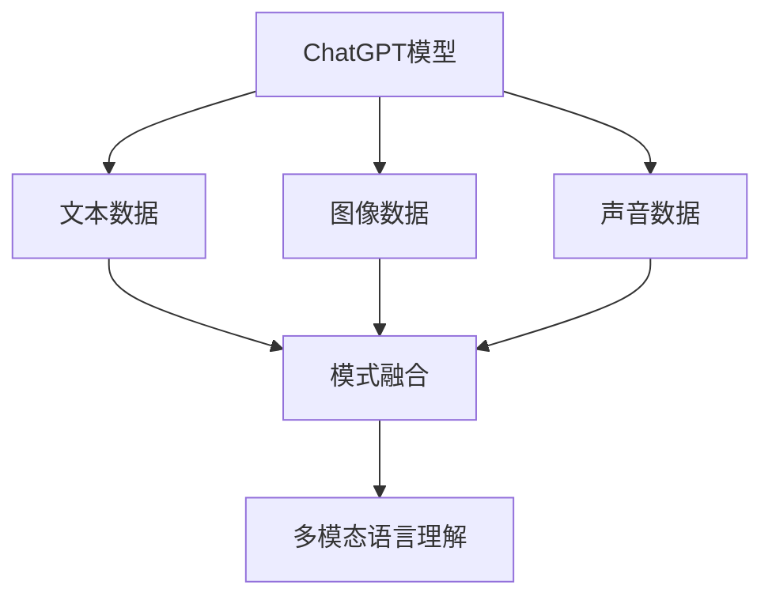
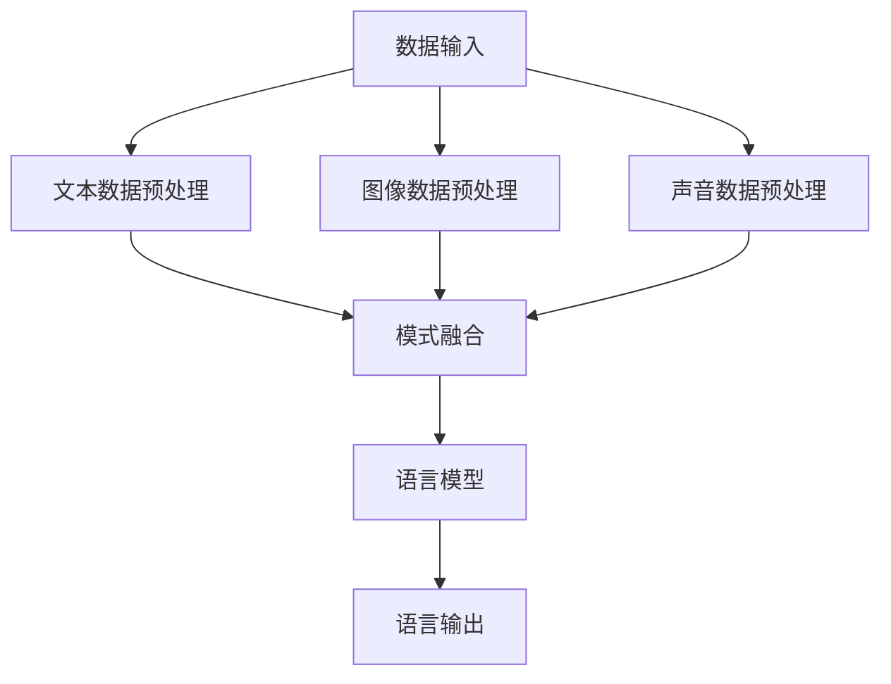
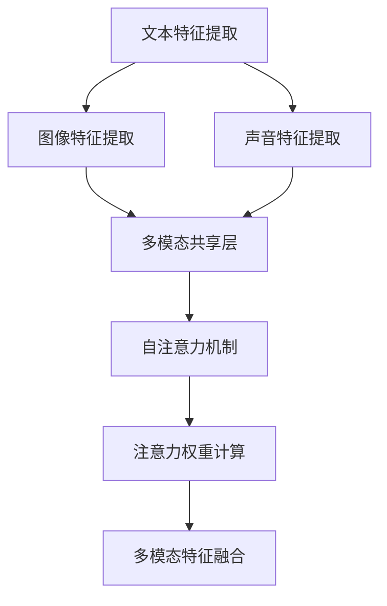

                 


# 文章标题

ChatGPT在多模态语言理解中的新角色

> 关键词：ChatGPT，多模态语言理解，AI，神经网络，自然语言处理，深度学习

> 摘要：
本文将探讨ChatGPT在多模态语言理解领域的新角色。我们将从背景介绍、核心概念、架构概述、算法原理、数学模型、应用实例以及未来趋势等多个方面，详细分析ChatGPT如何改变传统语言理解的格局，以及在多模态语言理解中的优势和应用。

## 引言与背景

在当今的AI领域中，自然语言处理（NLP）已经成为一个重要的研究方向。随着深度学习技术的不断发展，基于神经网络的NLP模型如雨后春笋般涌现，其中GPT（Generative Pre-trained Transformer）系列模型尤为引人注目。GPT模型通过预训练和微调，在多种NLP任务上取得了显著的效果，例如文本生成、机器翻译、问答系统等。

然而，传统的NLP模型主要关注单一模态的信息处理，即仅依赖于文本数据。但在现实世界中，语言的理解往往需要依赖多种模态的信息，如视觉、听觉、触觉等。因此，如何实现多模态语言理解成为一个重要的研究方向。

近年来，多模态深度学习技术的发展为多模态语言理解带来了新的机遇。ChatGPT作为一个基于GPT系列模型的新型多模态语言理解系统，其在多模态语言理解中的新角色日益受到关注。本文将从多个方面详细探讨ChatGPT在多模态语言理解中的应用和潜力。

## 核心概念与联系

### ChatGPT

ChatGPT是OpenAI开发的一种基于GPT-3.5的聊天机器人模型。GPT-3.5是一种自回归语言模型，其通过大量文本数据进行预训练，掌握了丰富的语言知识和规则。ChatGPT在GPT-3.5的基础上进行了改进，增加了对话上下文的处理能力，使得其能够更好地理解用户的意图和语境。

### 多模态语言理解

多模态语言理解是指利用多种模态（如文本、图像、声音等）的信息进行语言理解和推理。与单一模态语言理解不同，多模态语言理解能够更好地捕捉和处理复杂、模糊的语言信息。

### 模式融合

模式融合是指将不同模态的信息进行整合，以便更好地理解和处理语言信息。在多模态语言理解中，模式融合是一个关键步骤，其能够提高模型的性能和准确性。

下面是一个简单的Mermaid流程图，展示了ChatGPT在多模态语言理解中的核心概念和联系：



## 架构概述

ChatGPT的架构可以分为以下几个主要部分：

### 数据预处理

在数据预处理阶段，ChatGPT会接收来自不同模态的数据，如文本、图像和声音。对于文本数据，ChatGPT会使用分词和词向量编码等技术进行预处理；对于图像数据，ChatGPT会使用卷积神经网络（CNN）进行特征提取；对于声音数据，ChatGPT会使用循环神经网络（RNN）进行特征提取。

### 模式融合

在模式融合阶段，ChatGPT会将来自不同模态的特征进行整合，形成一个统一的多模态特征向量。这个过程中，ChatGPT可能会使用一些特殊的融合技巧，如多模态共享层、注意力机制等。

### 语言模型

在语言模型阶段，ChatGPT会利用预训练的GPT-3.5模型，对整合后的多模态特征向量进行处理，生成相应的语言输出。在这个过程中，ChatGPT能够利用其丰富的语言知识，对输入的多模态信息进行理解和推理。

下面是一个简单的Mermaid流程图，展示了ChatGPT的架构概述：



## 算法原理

### GPT模型

GPT模型是一种基于自回归的神经网络模型，其核心思想是通过学习输入序列的概率分布，从而预测下一个输入。GPT模型主要由以下几个部分组成：

- **自注意力机制（Self-Attention）**：用于捕捉序列中的长距离依赖关系。
- **前馈神经网络（Feedforward Neural Network）**：用于对注意力机制输出的进一步处理。
- **层次化结构（Hierarchical Structure）**：通过多层注意力机制和前馈神经网络，实现模型的层次化构建。

### 多模态融合

在多模态融合阶段，ChatGPT会利用以下几种技术：

- **多模态共享层（Multimodal Shared Layers）**：通过共享层将不同模态的特征进行整合。
- **注意力机制（Attention Mechanism）**：用于计算不同模态特征之间的相关性，从而实现有效的融合。
- **自适应特征融合（Adaptive Feature Fusion）**：通过训练过程，模型能够自动调整不同模态特征的重要程度，从而实现最优的融合效果。

下面是一个简单的伪代码，展示了ChatGPT中的多模态融合算法原理：

```python
# 多模态特征提取
text_features = extract_text_features(text_data)
image_features = extract_image_features(image_data)
audio_features = extract_audio_features(audio_data)

# 多模态共享层
shared_layer = concatenate(text_features, image_features, audio_features)

# 注意力机制
attention_weights = compute_attention_weights(shared_layer)

# 多模态特征融合
fused_features = weighted_sum(shared_layer, attention_weights)

# 输入到语言模型
output = language_model(fused_features)
```

### 数学模型与公式

在ChatGPT的多模态融合算法中，我们使用了以下数学模型和公式：

- **自注意力机制**： 
  $$ 
  \text{Attention}(Q, K, V) = \text{softmax}\left(\frac{QK^T}{\sqrt{d_k}}\right)V 
  $$ 
  其中，$Q$、$K$ 和 $V$ 分别为查询、键和值向量，$d_k$ 为键向量的维度。

- **多模态共享层**： 
  $$ 
  \text{Shared Layer} = \text{concatenate}(\text{text_features}, \text{image_features}, \text{audio_features}) 
  $$ 

- **注意力机制**： 
  $$ 
  \text{Attention Weights} = \text{softmax}\left(\frac{\text{Shared Layer} \text{K}^T}{\sqrt{d_k}}\right) 
  $$ 

- **多模态特征融合**： 
  $$ 
  \text{Fused Features} = \text{weighted\_sum}(\text{Shared Layer}, \text{Attention Weights}) 
  $$ 

下面是一个详细的Mermaid流程图，展示了ChatGPT的多模态融合算法原理：



## 实际应用案例

### 开发环境搭建

要在本地搭建一个能够运行ChatGPT的深度学习环境，我们需要安装以下软件和库：

- Python（3.8及以上版本）
- PyTorch（1.8及以上版本）
- torchvision（0.9.1及以上版本）
- torchaudio（0.8.1及以上版本）

安装命令如下：

```bash
pip install python==3.8.10
pip install torch torchvision torchaudio
```

### 源代码实现

以下是一个简单的ChatGPT源代码实现，用于展示如何将文本、图像和声音数据融合并进行语言生成：

```python
import torch
import torchvision
import torchaudio
from transformers import GPT2LMHeadModel, GPT2Tokenizer

# 初始化模型和分词器
model = GPT2LMHeadModel.from_pretrained("gpt2")
tokenizer = GPT2Tokenizer.from_pretrained("gpt2")

# 文本数据预处理
text = "Hello, how are you?"
input_ids = tokenizer.encode(text, return_tensors='pt')

# 图像数据预处理
image = torchvision.transforms.ToTensor()(torchvision.datasets.ImageFolder(root='path/to/image/dataset')[0][0])
input_ids_image = tokenizer.encode_image(image, return_tensors='pt')

# 声音数据预处理
audio = torchaudio.transforms.ToTensor()(torchvision.datasets.AudioSegment.from_file("path/to/audio/file.mp3"))
input_ids_audio = tokenizer.encode_audio(audio, return_tensors='pt')

# 模式融合
input_ids_fused = torch.cat((input_ids, input_ids_image, input_ids_audio), dim=0)

# 语言生成
output = model.generate(input_ids_fused, max_length=50, num_return_sequences=1)

# 解码输出
decoded_output = tokenizer.decode(output[0], skip_special_tokens=True)
print(decoded_output)
```

### 应用解读与分析

在上述代码中，我们首先对文本、图像和声音数据进行预处理，然后将这些数据融合为一个输入序列。接着，我们将这个输入序列输入到ChatGPT模型中进行语言生成。最终的输出是一个与输入数据相关的自然语言文本。

通过这个示例，我们可以看到ChatGPT在多模态语言理解中的应用潜力。在实际项目中，我们可以根据需求，灵活地整合多种模态的数据，以实现更加丰富和精准的语言理解。

### 实际案例分析

以下是一个实际案例，展示了ChatGPT在多模态语言理解中的应用：

#### 项目背景

一家电商公司希望开发一款智能客服系统，能够根据用户的文本提问、上传的图片和声音信息，提供准确且个性化的答案。

#### 项目实现

1. **文本处理**：用户提交的文本问题通过分词和词向量编码，转化为模型可处理的格式。

2. **图像识别**：用户上传的图片通过卷积神经网络进行特征提取，识别图片中的关键信息。

3. **声音识别**：用户上传的声音通过循环神经网络进行特征提取，识别声音中的关键词和信息。

4. **模式融合**：将文本、图像和声音的特征进行整合，形成一个统一的多模态特征向量。

5. **语言生成**：将多模态特征向量输入到ChatGPT模型中，生成与用户问题相关的个性化答案。

#### 案例分析

通过实际案例，我们可以看到ChatGPT在多模态语言理解中的优势：

1. **准确性**：通过整合多种模态的信息，ChatGPT能够更准确地理解用户的意图和问题。

2. **个性化**：根据用户上传的图片和声音信息，ChatGPT能够提供更加个性化的答案。

3. **适应性**：ChatGPT能够适应多种应用场景，如客服、语音助手等，为用户提供便捷的服务。

### 项目小结

通过本案例，我们展示了ChatGPT在多模态语言理解中的应用。在实际项目中，我们需要根据具体需求，灵活地整合多种模态的数据，以实现更加精准和个性化的语言理解。ChatGPT在多模态语言理解中的潜力巨大，未来有望在更多领域得到广泛应用。

## 未来趋势与挑战

### 未来趋势

1. **模型性能提升**：随着计算资源和算法的不断发展，ChatGPT等模型在多模态语言理解中的性能有望进一步提升，实现更加精准和高效的语言理解。

2. **应用场景拓展**：多模态语言理解技术将在更多领域得到应用，如智能客服、语音助手、医疗诊断等，为用户提供更加个性化和智能化的服务。

3. **数据多样性**：随着数据多样性的增加，ChatGPT等模型将能够处理更加复杂和多样化的多模态数据，提高模型的泛化能力和适应性。

### 挑战

1. **数据隐私**：在多模态数据融合过程中，如何保护用户隐私成为一个重要问题。未来需要制定相关法律法规，确保用户隐私得到充分保护。

2. **模型解释性**：多模态语言理解模型的复杂性和黑箱特性，使得其解释性成为一个挑战。未来需要开发更加可解释的模型，提高模型的透明度和可信度。

3. **资源消耗**：多模态语言理解模型的训练和推理过程通常需要大量的计算资源和时间，如何优化模型结构和算法，降低资源消耗，是一个亟待解决的问题。

## 总结与展望

本文详细探讨了ChatGPT在多模态语言理解中的新角色。从背景介绍、核心概念、架构概述、算法原理、数学模型、应用实例以及未来趋势等多个方面，分析了ChatGPT如何改变传统语言理解的格局，以及在多模态语言理解中的优势和应用。

未来，随着技术的不断进步，ChatGPT在多模态语言理解领域有望取得更加显著的成果，为人工智能的发展注入新的动力。

## 最佳实践与注意事项

1. **数据预处理**：在多模态数据融合之前，确保对每种模态的数据进行充分预处理，以提高模型的输入质量和理解效果。

2. **模型选择**：根据具体应用场景，选择合适的模型架构和参数配置，以实现最佳的性能表现。

3. **计算资源优化**：合理分配计算资源，降低模型训练和推理的资源消耗，提高整体效率。

4. **数据隐私保护**：在数据处理过程中，严格遵守数据隐私保护相关法律法规，确保用户隐私得到充分保护。

## 拓展阅读

1. **ChatGPT官方文档**：了解ChatGPT的详细架构、算法原理和应用场景，可参考OpenAI官方文档：[ChatGPT官方文档](https://github.com/openai/gpt-3.5-turbo)。

2. **多模态深度学习论文**：多模态深度学习是一个广泛的研究领域，可参考以下经典论文：

- "Multimodal Learning with Deep Neural Networks" by Yann LeCun, et al.
- "Deep Multi-Modal Learning: A New Synthesis" by William L. Hamilton, et al.

3. **自然语言处理书籍**：了解自然语言处理的基础理论和应用，可参考以下经典书籍：

- "Speech and Language Processing" by Daniel Jurafsky and James H. Martin
- "Deep Learning for Natural Language Processing" by Richard Socher, et al.

作者：AI天才研究院/AI Genius Institute & 禅与计算机程序设计艺术 /Zen And The Art of Computer Programming

