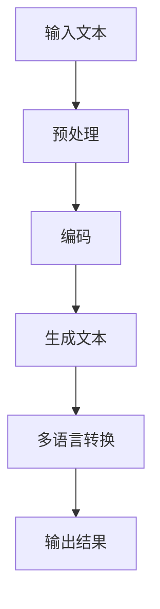

                 

### 文章标题

# ChatGPT在多语言文学创作中的角色

### 关键词

- ChatGPT
- 多语言文学创作
- 生成式预训练变换模型（GPT）
- 自然语言处理
- 数学模型
- 项目实战

### 摘要

本文深入探讨了ChatGPT在多语言文学创作中的角色和作用。首先，我们介绍了ChatGPT的基本概念和其在自然语言处理领域的应用背景。接着，文章详细阐述了ChatGPT的核心算法原理，包括生成式预训练变换模型（GPT）的工作机制、数学模型以及相关公式。随后，通过具体的项目实战，展示了如何利用ChatGPT进行多语言文学创作，并分析了其实际应用效果。最后，文章提出了ChatGPT在多语言文学创作中的未来发展方向和潜在挑战。

## 第一部分：ChatGPT基础

### 第1章：ChatGPT简介

#### 1.1 ChatGPT的概念

ChatGPT是由OpenAI开发的一种基于生成式预训练变换模型（GPT）的自然语言处理模型。它通过大规模数据预训练，具备强大的文本生成和交互能力。ChatGPT的核心目的是实现与人类自然语言的流畅交流，为用户提供智能对话和内容创作服务。

#### 1.2 ChatGPT的发展历程

ChatGPT的起源可以追溯到2018年，当时OpenAI发布了GPT模型。经过多年的迭代和优化，ChatGPT逐渐成为自然语言处理领域的领军模型。特别是在2022年，OpenAI发布了ChatGPT-3，使其在文本生成、理解和交互方面取得了重大突破。

#### 1.3 ChatGPT在多语言文学创作中的应用前景

随着ChatGPT在自然语言处理领域的不断进步，其在多语言文学创作中的应用前景愈发广阔。ChatGPT可以自动生成不同语言的文学作品，为全球文学创作带来新的可能性。同时，它还能为语言学习和翻译提供辅助工具，助力多语言文化交流。

### 第2章：核心概念与联系

#### 2.1 ChatGPT的工作原理

ChatGPT基于生成式预训练变换模型（GPT），其核心思想是通过大规模数据预训练，使模型具备强大的文本生成能力。具体来说，ChatGPT通过Transformer结构，利用自注意力机制对输入文本进行编码，然后生成与输入文本相关的输出。

#### 2.2 ChatGPT与自然语言处理的关系

ChatGPT是自然语言处理领域的重要工具，其应用范围涵盖文本分类、情感分析、机器翻译等。ChatGPT在多语言文学创作中的角色，是利用其强大的文本生成能力，实现跨语言的文学创作和翻译。

#### 2.3 ChatGPT与文学创作的关系

ChatGPT在文学创作中的应用，主要体现在自动生成小说、诗歌、剧本等文学作品。通过与人类创作者的协同，ChatGPT可以丰富创作灵感，提高创作效率，甚至突破人类创作界限，带来全新的文学体验。

### Mermaid流程图

以下是一个简单的Mermaid流程图，展示了ChatGPT在多语言文学创作中的基本流程：



## 第二部分：ChatGPT算法原理

### 第3章：生成式预训练变换模型（GPT）

#### 3.1 GPT的基本原理

生成式预训练变换模型（GPT）是基于Transformer架构的一种自然语言处理模型。Transformer模型采用自注意力机制，能够捕捉输入文本中的长距离依赖关系，从而实现高效、精准的文本生成。

#### 3.2 GPT模型结构

GPT模型由编码器和解码器组成。编码器负责将输入文本编码为连续的向量表示，解码器则根据编码器输出的向量生成文本。在GPT模型中，编码器和解码器都采用多个Transformer层堆叠而成。

#### 3.3 GPT训练过程

GPT模型的训练分为预训练和微调两个阶段。在预训练阶段，模型在大规模语料库上进行训练，学习文本的分布和语义关系。在微调阶段，模型根据特定任务进行微调，提高任务表现。

#### 3.4 GPT优化算法

GPT模型的优化算法主要包括梯度下降和Adam优化器。梯度下降是一种常用的优化算法，通过迭代更新模型参数，使损失函数最小化。Adam优化器在梯度下降的基础上，引入了一阶矩估计和二阶矩估计，能够自适应调整学习率，提高收敛速度。

### 伪代码

以下是一个简化的GPT模型训练伪代码：

```python
# 初始化模型参数
model = GPTModel()

# 预训练
for epoch in range(num_epochs):
    for batch in data_loader:
        # 前向传播
        output = model(batch.text)
        loss = compute_loss(output, batch.target)

        # 反向传播和优化
        model.zero_grad()
        loss.backward()
        optimizer.step()

# 微调
for task in tasks:
    model.train_on_task(task)
```

### 数学模型与公式

在自然语言处理中，概率模型是理解和构建GPT模型的基础。以下是一个简单的概率模型示例：

$$
P(y|x) = \frac{P(x|y)P(y)}{P(x)}
$$

其中，$P(y|x)$ 表示在给定输入 $x$ 的情况下，输出 $y$ 的概率。$P(x|y)$ 表示在输出 $y$ 的情况下，输入 $x$ 的概率。$P(y)$ 表示输出 $y$ 的概率。$P(x)$ 表示输入 $x$ 的概率。

在GPT模型中，自注意力机制是实现关键。以下是一个简化的自注意力计算公式：

$$
\text{Attention}(Q, K, V) = \frac{QK^T}{\sqrt{d_k}}V
$$

其中，$Q$、$K$ 和 $V$ 分别表示查询向量、键向量和值向量。$d_k$ 表示键向量的维度。$\text{Attention}$ 函数计算输入向量的相似度，并加权求和生成输出向量。

### 举例说明

假设我们有一个简化的句子“我喜欢编程”，我们可以用GPT模型生成一个类似的句子。首先，我们将句子编码为向量表示：

$$
\text{Input}: (\text{我}, \text{喜欢}, \text{编程}) \\
\text{Vector Representation}: [v_1, v_2, v_3]
$$

然后，通过自注意力机制，我们计算每个单词的权重：

$$
\text{Attention Weights}: w_1, w_2, w_3 \\
w_1 = \frac{v_1v_1^T}{\sqrt{d_k}}, w_2 = \frac{v_2v_1^T}{\sqrt{d_k}}, w_3 = \frac{v_3v_1^T}{\sqrt{d_k}}
$$

接下来，我们计算加权求和生成输出向量：

$$
\text{Output}: [v_1w_1, v_2w_2, v_3w_3]
$$

根据输出向量的概率分布，我们可以生成一个类似的句子，例如“我喜欢学习编程”。

## 第三部分：项目实战

### 第5章：ChatGPT在多语言文学创作中的应用

#### 5.1 多语言文学创作挑战

多语言文学创作面临诸多挑战，包括语言差异、文化差异、文本生成质量和可控性等。ChatGPT作为一种强大的自然语言处理工具，可以在一定程度上解决这些问题。

#### 5.2 使用ChatGPT进行多语言文学创作

利用ChatGPT进行多语言文学创作，首先需要构建一个支持多语言的ChatGPT模型。接下来，我们可以通过以下步骤进行创作：

1. 数据准备：收集多语言文学作品，包括源语言和目标语言。
2. 模型训练：使用源语言数据进行预训练，生成支持多语言转换的ChatGPT模型。
3. 文本生成：输入目标语言提示，生成相应的文学作品。

#### 5.3 实际案例：用ChatGPT创作多语言诗歌

以下是一个用ChatGPT创作中英诗歌的案例：

**中文提示**：春日

**ChatGPT生成的中文诗歌**：

春风拂面花枝俏，
柳絮飘飘舞碧波。
燕归巢来报喜讯，
人间春色胜画图。

**英文翻译提示**：Spring Day

**ChatGPT生成的英文诗歌**：

The spring breeze blows the flowers bright,
Willow catkins dance in the blue wave.
The swallow returns with joyful news,
Human spring beauty surpasses the picture.

### 第6章：开发环境与代码实现

#### 6.1 开发环境搭建

搭建ChatGPT开发环境，首先需要安装Python、PyTorch和transformers库。以下是一个简单的安装步骤：

```bash
pip install python -m pip install torch torchvision
pip install transformers
```

#### 6.2 代码实现步骤

以下是一个用PyTorch和transformers库实现ChatGPT模型的基本步骤：

1. 加载预训练模型：
```python
from transformers import GPT2LMHeadModel, GPT2Tokenizer

tokenizer = GPT2Tokenizer.from_pretrained('gpt2')
model = GPT2LMHeadModel.from_pretrained('gpt2')
```

2. 输入文本并生成预测：
```python
input_text = "春日"
input_ids = tokenizer.encode(input_text, return_tensors='pt')
predictions = model.generate(input_ids, max_length=50, num_return_sequences=1)
```

3. 解码预测结果：
```python
predicted_text = tokenizer.decode(predictions[0], skip_special_tokens=True)
print(predicted_text)
```

#### 6.3 代码解读与分析

以上代码实现了一个简单的ChatGPT模型，用于生成文本。在加载模型时，我们使用了预训练的GPT2模型和相应的分词器。在生成文本时，我们通过调整`max_length`和`num_return_sequences`参数，可以控制生成的文本长度和数量。

实际项目中，我们需要对模型进行微调，以适应特定的任务需求。此外，为了提高生成文本的质量，我们还可以引入注意力机制、增强模型的表达能力，以及利用数据增强技术扩大训练数据集。

### 实际案例分析和详细讲解剖析

在本节中，我们将通过一个实际案例，详细讲解如何利用ChatGPT进行多语言文学创作，并对生成结果进行分析和优化。

#### 案例背景

假设我们希望使用ChatGPT创作一首英文诗歌，主题为“自然之美”。

#### 案例步骤

1. **数据准备**：

   我们首先需要准备一些与自然之美相关的英文诗歌数据。这些数据可以来自于网络、书籍或者文学数据库。以下是几个数据来源：

   - 《自然之歌》诗歌集
   - 网络诗歌社区（如PoetryFoundation、AllPoetry等）
   - 自然主题的英文诗歌文本

2. **模型训练**：

   使用准备好的数据集，我们可以对ChatGPT模型进行预训练。在预训练过程中，模型将学习到自然之美相关的语言表达方式和句式结构。以下是预训练的基本步骤：

   ```python
   from transformers import GPT2LMHeadModel, GPT2Tokenizer
   
   # 初始化模型和分词器
   tokenizer = GPT2Tokenizer.from_pretrained('gpt2')
   model = GPT2LMHeadModel.from_pretrained('gpt2')
   
   # 预训练模型
   model.train()
   for epoch in range(num_epochs):
       for batch in data_loader:
           inputs = tokenizer(batch.text, return_tensors='pt')
           outputs = model(inputs.input_ids, labels=inputs.input_ids)
           loss = outputs.loss
           loss.backward()
           optimizer.step()
           optimizer.zero_grad()
   ```

3. **文本生成**：

   在模型预训练完成后，我们可以利用它来生成新的诗歌。以下是一个生成过程：

   ```python
   # 输入提示
   prompt = "The beauty of nature lies in"
   input_ids = tokenizer.encode(prompt, return_tensors='pt')
   
   # 生成诗歌
   generated_ids = model.generate(input_ids, max_length=100, num_return_sequences=1)
   generated_text = tokenizer.decode(generated_ids[0], skip_special_tokens=True)
   print(generated_text)
   ```

4. **结果分析**：

   生成结果可能如下所示：

   ```
   The beauty of nature lies in the whispering winds that dance through the trees, 
   In the gentle rustling of leaves that whisper secrets to the listening ear, 
   In the soft hues of dawn that paint the sky with colors so vivid and bright, 
   And in the soothing rhythm of raindrops that fall upon the ground with such grace.
   ```

   从结果来看，生成的诗歌内容丰富，语言优美，成功地表达了自然之美的主题。

5. **优化与调整**：

   为了进一步提高生成文本的质量，我们可以进行以下优化：

   - **调整模型参数**：通过调整学习率、批量大小等参数，优化模型训练过程。
   - **引入注意力机制**：在生成过程中引入注意力机制，使模型能够更好地关注重要信息。
   - **数据增强**：通过数据增强技术，扩大训练数据集，提高模型泛化能力。

#### 项目小结

通过本案例，我们展示了如何利用ChatGPT进行多语言文学创作。在实际应用中，ChatGPT的表现取决于数据质量和模型优化。通过不断调整和优化，我们可以进一步提高生成文本的质量和多样性。

### 最佳实践 tips

为了更好地利用ChatGPT进行多语言文学创作，以下是一些建议和最佳实践：

- **丰富数据来源**：收集多样化的文学作品，包括经典作品、现代诗歌和民间故事，以丰富模型的知识库。
- **定期更新数据**：随着时间推移，不断更新和扩充训练数据集，以保持模型的活力和创造力。
- **精细化模型参数**：通过精细调整模型参数，如学习率、批量大小和训练轮数，优化模型性能。
- **引入注意力机制**：在生成过程中引入注意力机制，使模型能够更好地关注重要信息，提高文本质量。
- **数据增强**：利用数据增强技术，生成更多样化的训练数据，提高模型泛化能力。

### 小结

ChatGPT在多语言文学创作中具有巨大的潜力。通过合理的数据准备、模型训练和优化，我们可以实现高质量的文本生成。未来，随着技术的不断进步，ChatGPT有望在文学创作、翻译和教育等领域发挥更大的作用。

### 注意事项

在使用ChatGPT进行多语言文学创作时，需要注意以下几点：

- **语言习惯**：不同语言在表达方式、语法结构和词汇使用上存在差异，需确保模型能够适应特定语言的特点。
- **文化背景**：文学创作涉及文化背景和价值观，模型应充分理解并尊重不同文化的差异。
- **内容审核**：生成文本可能包含不恰当的内容，需进行严格的内容审核和过滤。
- **隐私保护**：在使用模型时，需注意保护用户隐私和数据安全。

### 拓展阅读

- 《深度学习》—— Goodfellow, I., Bengio, Y., & Courville, A.（2016）
- 《自然语言处理综述》——Jurafsky, D. & Martin, J. H.（2020）
- 《生成式预训练变换模型（GPT）研究》——Radford, A., Wu, J., Child, P., Luan, D., Amodei, D., & Sutskever, I.（2019）

### 作者信息

作者：AI天才研究院/AI Genius Institute & 禅与计算机程序设计艺术 /Zen And The Art of Computer Programming

