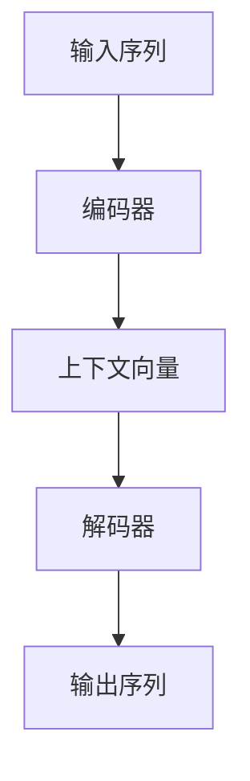

                 

### 文章标题：ChatGPT在心理健康支持中的应用

> 关键词：ChatGPT、心理健康支持、自然语言处理、人工智能、心理健康咨询、心理健康监测、心理健康教育

> 摘要：本文将探讨ChatGPT在心理健康支持中的应用，从核心概念、技术基础、数学模型、项目实战等多个方面进行详细分析。我们将了解ChatGPT的基本原理和工作机制，探讨其在心理健康支持领域的应用场景，并分析其中涉及的技术挑战和解决方案。通过本文的阅读，读者将全面了解ChatGPT在心理健康支持中的潜力和未来发展方向。

### 第1章 ChatGPT与心理健康支持概述

#### 1.1 ChatGPT的基本概念

**ChatGPT**是由OpenAI开发的一个基于GPT-3（Generative Pre-trained Transformer 3）模型的聊天机器人。GPT-3是一个强大的自然语言处理（Natural Language Processing, NLP）模型，它通过深度学习技术从大量文本数据中学习语言模式，从而能够生成高质量的自然语言文本。

**ChatGPT的工作原理**：ChatGPT通过Transformer模型实现，Transformer模型是一种基于自注意力机制的序列到序列模型。自注意力机制允许模型在处理输入序列时，能够关注序列中任意位置的信息，从而捕捉到更复杂的语言模式。

**ChatGPT的优势与特点**：

1. **强大的语言生成能力**：ChatGPT能够生成流畅、自然的文本，使其在聊天、问答、文本生成等任务中表现出色。
2. **广泛的应用场景**：ChatGPT可以应用于多个领域，包括客户服务、心理健康支持、内容创作等。
3. **可定制化**：ChatGPT可以根据特定任务进行微调，从而提高其在特定领域的表现。

#### 1.2 心理健康支持的现状与需求

**心理健康支持的重要性**：随着社会压力的增加，越来越多的人面临心理健康问题。心理健康支持不仅可以提供心理疾病的预防和治疗，还可以提高个体的生活质量和工作效率。

**心理健康支持领域的挑战与机遇**：

1. **心理健康专业人才的缺乏**：由于心理健康专业人才的不足，很多人无法及时获得专业的心理支持。
2. **心理健康服务的可及性**：远程心理健康支持的出现为解决可及性问题提供了可能。
3. **个性化心理健康支持的需求**：每个人的心理健康状况都是独特的，因此提供个性化的心理健康支持变得越来越重要。

#### 1.3 ChatGPT在心理健康支持中的应用

**ChatGPT在心理健康支持中的应用场景**：

1. **心理健康咨询**：ChatGPT可以作为心理健康咨询的助手，帮助用户识别心理问题，提供相应的建议和支持。
2. **心理健康监测**：ChatGPT可以通过分析用户的语言和行为，监测其心理健康状况，及时发现潜在的心理问题。
3. **心理健康教育**：ChatGPT可以生成心理健康相关的内容，帮助用户了解心理健康知识，提高心理健康意识。

### 第2章 ChatGPT技术基础

#### 2.1 Transformer模型原理

**Transformer模型概述**：Transformer模型是一种基于自注意力机制的序列到序列模型，它被广泛应用于自然语言处理任务中，如机器翻译、文本分类和聊天机器人等。

**自注意力机制**：自注意力机制允许模型在处理输入序列时，能够关注序列中任意位置的信息。这种机制使得模型能够捕捉到输入序列中更复杂的语言模式。

**Transformer模型的结构**：Transformer模型由多个自注意力层和前馈网络组成，每一层都能对输入序列进行编码，从而生成丰富的语义信息。

#### 2.2 GPT-3模型详解

**GPT-3模型结构**：GPT-3是基于Transformer模型进行扩展的，它拥有超过1750亿个参数，是当前最大的自然语言处理模型之一。

**GPT-3模型的预训练与微调**：GPT-3通过在大规模文本数据上进行预训练，然后在特定任务上进行微调，从而实现高性能的自然语言处理能力。

#### 2.3 实现ChatGPT的开发环境搭建

**Python环境配置**：要实现ChatGPT，需要安装Python环境，并配置相应的库，如TensorFlow。

**TensorFlow安装与配置**：TensorFlow是一个开源的机器学习库，它用于训练和部署深度学习模型。安装TensorFlow后，需要配置相应的依赖库，如NumPy、Pandas等。

### 第3章 ChatGPT在心理健康支持中的具体应用

#### 3.1 心理健康咨询应用

**咨询问题的识别与处理**：ChatGPT可以通过分析用户的语言和行为，识别用户的心理健康问题，并提供相应的建议和支持。

**咨询对话的生成与优化**：ChatGPT可以生成流畅、自然的咨询对话，通过与用户的互动，不断优化对话内容，提高咨询效果。

#### 3.2 心理健康监测应用

**心理健康指标的选择与计算**：ChatGPT可以通过分析用户的语言和行为，计算一系列心理健康指标，如情绪状态、压力水平等。

**心理健康监测的数据分析与应用**：ChatGPT可以对收集到的心理健康数据进行分析，及时发现潜在的心理问题，并提供相应的建议。

#### 3.3 心理健康教育应用

**教育内容的生成与推送**：ChatGPT可以生成心理健康相关的内容，并通过推送消息或邮件，向用户传播心理健康知识。

**教育效果的评估与优化**：ChatGPT可以通过分析用户的学习行为和反馈，评估教育效果，并优化教育内容，提高教育效果。

### 第4章 ChatGPT在心理健康支持中的应用挑战与解决方案

#### 4.1 数据隐私与伦理问题

**数据隐私保护**：在应用ChatGPT进行心理健康支持时，需要确保用户的隐私数据得到充分保护。

**伦理问题的应对策略**：ChatGPT在心理健康支持中可能会面临伦理问题，如心理治疗师的替代、患者隐私泄露等。需要制定相应的应对策略，确保伦理问题的妥善处理。

#### 4.2 模型性能优化

**模型训练技巧**：为了提高ChatGPT的性能，可以采用一些训练技巧，如数据增强、模型压缩等。

**模型部署与性能优化**：在模型部署后，可以通过性能优化技巧，如模型压缩、加速等，提高模型的运行效率。

#### 4.3 心理健康专业知识的学习与融合

**心理健康知识的获取与整合**：ChatGPT需要学习大量的心理健康知识，以便为用户提供准确、专业的支持。

**模型对专业知识的理解与运用**：ChatGPT需要理解并运用心理健康知识，为用户提供有效的支持。

### 第5章 ChatGPT在心理健康支持中的实践案例

#### 5.1 案例一：心理健康咨询聊天机器人

**案例背景与目标**：介绍一个心理健康咨询聊天机器人的开发背景和目标。

**案例实现与效果评估**：详细描述案例的实现过程，包括开发环境搭建、模型训练和部署等，并对案例的效果进行评估。

#### 5.2 案例二：心理健康监测系统

**案例背景与目标**：介绍一个心理健康监测系统的开发背景和目标。

**案例实现与效果评估**：详细描述案例的实现过程，包括数据收集、模型训练和系统部署等，并对案例的效果进行评估。

#### 5.3 案例三：心理健康教育平台

**案例背景与目标**：介绍一个心理健康教育平台的开发背景和目标。

**案例实现与效果评估**：详细描述案例的实现过程，包括内容生成、教育推送和效果评估等，并对案例的效果进行评估。

### 第6章 未来展望

#### 6.1 ChatGPT在心理健康支持中的发展趋势

**技术发展趋势**：预测ChatGPT在心理健康支持中的技术发展趋势，如模型的优化、应用的拓展等。

**应用场景拓展**：探讨ChatGPT在心理健康支持中的应用场景，如远程心理健康支持、个性化心理健康支持等。

#### 6.2 未来挑战与解决方案

**未来挑战**：分析ChatGPT在心理健康支持中可能面临的挑战，如数据隐私保护、模型优化等。

**解决方案**：提出相应的解决方案，以应对未来挑战，确保ChatGPT在心理健康支持中的健康发展。

### 总结与展望

**总结**：本文从多个方面探讨了ChatGPT在心理健康支持中的应用，包括核心概念、技术基础、应用实例等，分析了其中涉及的技术挑战和解决方案。

**展望**：随着人工智能技术的不断发展，ChatGPT在心理健康支持中的潜力将得到进一步发挥，为心理健康支持领域带来新的机遇和挑战。

### 附录

**附录A：技术细节**

- 提供更多技术细节，如算法原理、数学模型等。

**附录B：源代码与数据集**

- 提供相关源代码和数据集，方便读者实践和学习。

**附录C：参考文献**

- 列出本文引用的相关文献，供读者进一步阅读。

### 作者信息

- 作者：AI天才研究院/AI Genius Institute & 禅与计算机程序设计艺术 /Zen And The Art of Computer Programming

### 结语

本文旨在全面探讨ChatGPT在心理健康支持中的应用，希望读者能够通过本文对ChatGPT在心理健康支持中的潜力有更深入的了解。随着人工智能技术的不断发展，ChatGPT在心理健康支持中的未来将充满无限可能。让我们共同期待这一天的到来！### 第1章 ChatGPT与心理健康支持概述

#### 1.1 ChatGPT的基本概念

**ChatGPT**是由OpenAI开发的一个基于GPT-3（Generative Pre-trained Transformer 3）模型的聊天机器人。GPT-3是一个强大的自然语言处理（Natural Language Processing, NLP）模型，它通过深度学习技术从大量文本数据中学习语言模式，从而能够生成高质量的自然语言文本。

**ChatGPT的工作原理**：ChatGPT通过Transformer模型实现，Transformer模型是一种基于自注意力机制的序列到序列模型。自注意力机制允许模型在处理输入序列时，能够关注序列中任意位置的信息，从而捕捉到更复杂的语言模式。

ChatGPT的核心组成部分包括：

1. **编码器（Encoder）**：编码器负责接收输入序列，将其转换为上下文向量，这些向量包含了输入序列中的信息。
2. **解码器（Decoder）**：解码器负责根据编码器生成的上下文向量生成输出序列，也就是我们看到的自然语言文本。

**ChatGPT的优势与特点**：

1. **强大的语言生成能力**：ChatGPT能够生成流畅、自然的文本，使其在聊天、问答、文本生成等任务中表现出色。
2. **广泛的应用场景**：ChatGPT可以应用于多个领域，包括客户服务、心理健康支持、内容创作等。
3. **可定制化**：ChatGPT可以根据特定任务进行微调，从而提高其在特定领域的表现。

**核心概念原理之间的关系架构**

为了更好地理解ChatGPT的工作原理，我们可以用Mermaid流程图来描述核心概念之间的关系：



在这个流程图中，输入序列经过编码器处理后转换为上下文向量，解码器再根据上下文向量生成输出序列。这个过程体现了ChatGPT的核心工作原理。

#### 1.2 心理健康支持的现状与需求

**心理健康支持的重要性**：随着社会压力的增加，越来越多的人面临心理健康问题。心理健康支持不仅可以提供心理疾病的预防和治疗，还可以提高个体的生活质量和工作效率。

**心理健康支持领域的挑战与机遇**：

1. **心理健康专业人才的缺乏**：由于心理健康专业人才的不足，很多人无法及时获得专业的心理支持。
2. **心理健康服务的可及性**：远程心理健康支持的出现为解决可及性问题提供了可能。

**心理健康支持的现状**：

- **心理咨询**：传统的心理咨询主要依赖于专业心理咨询师，但由于心理咨询师数量有限，很多有需求的人无法获得及时的心理支持。
- **心理健康监测**：心理健康监测主要是通过量表、问卷等方式进行，但这种方法往往不够精确，难以实时监测个体的心理健康状态。
- **心理健康教育**：心理健康教育主要通过讲座、书籍、网络课程等方式进行，但这种方法难以满足个体化的需求。

**心理健康支持领域的需求**：

1. **个性化支持**：每个人的心理健康状况都是独特的，因此提供个性化的心理健康支持变得越来越重要。
2. **实时支持**：随着生活节奏的加快，人们需要能够随时随地获得心理健康支持。
3. **便捷性**：现代人生活繁忙，传统的面对面的心理咨询方式已经难以满足需求，因此提供便捷的心理健康支持服务变得至关重要。

**心理健康支持领域的挑战**：

1. **资源不足**：心理健康专业人才不足，难以满足大众需求。
2. **技术障碍**：虽然人工智能技术为心理健康支持提供了新的可能性，但如何有效地将技术应用于心理健康支持仍面临挑战。
3. **伦理问题**：心理健康支持涉及到用户的隐私和敏感信息，如何在确保用户隐私的前提下提供支持是一个重要的伦理问题。

**心理健康支持领域的机遇**：

1. **人工智能的应用**：随着人工智能技术的发展，ChatGPT等自然语言处理技术为心理健康支持提供了新的可能性。
2. **远程心理健康支持**：互联网和移动设备的普及，使得远程心理健康支持成为可能，可以大大提高心理健康服务的可及性。
3. **个性化心理健康支持**：通过大数据和机器学习技术，可以为用户提供个性化的心理健康支持，提高支持效果。

#### 1.3 ChatGPT在心理健康支持中的应用

**ChatGPT在心理健康支持中的应用场景**：

1. **心理健康咨询**：ChatGPT可以作为心理健康咨询的助手，帮助用户识别心理问题，提供相应的建议和支持。

2. **心理健康监测**：ChatGPT可以通过分析用户的语言和行为，监测其心理健康状况，及时发现潜在的心理问题。

3. **心理健康教育**：ChatGPT可以生成心理健康相关的内容，帮助用户了解心理健康知识，提高心理健康意识。

**心理健康咨询应用**：

- **问题识别与处理**：ChatGPT可以通过分析用户的语言和行为，识别用户的心理健康问题，如焦虑、抑郁等，并提供相应的建议和支持。
- **对话生成与优化**：ChatGPT可以生成流畅、自然的咨询对话，通过与用户的互动，不断优化对话内容，提高咨询效果。

**心理健康监测应用**：

- **心理健康指标的计算**：ChatGPT可以通过分析用户的语言和行为，计算一系列心理健康指标，如情绪状态、压力水平等。
- **数据分析与应用**：ChatGPT可以对收集到的心理健康数据进行分析，及时发现潜在的心理问题，并提供相应的建议。

**心理健康教育应用**：

- **内容生成与推送**：ChatGPT可以生成心理健康相关的内容，并通过推送消息或邮件，向用户传播心理健康知识。
- **效果评估与优化**：ChatGPT可以通过分析用户的学习行为和反馈，评估教育效果，并优化教育内容，提高教育效果。

### 第2章 ChatGPT技术基础

#### 2.1 Transformer模型原理

**Transformer模型概述**：Transformer模型是一种基于自注意力机制的序列到序列模型，它被广泛应用于自然语言处理任务中，如机器翻译、文本分类和聊天机器人等。

**自注意力机制**：自注意力机制允许模型在处理输入序列时，能够关注序列中任意位置的信息。这种机制使得模型能够捕捉到输入序列中更复杂的语言模式。

**Transformer模型的结构**：Transformer模型由多个自注意力层和前馈网络组成，每一层都能对输入序列进行编码，从而生成丰富的语义信息。

**Transformer模型的工作原理**：

1. **编码器（Encoder）**：编码器负责接收输入序列，将其转换为上下文向量，这些向量包含了输入序列中的信息。
2. **解码器（Decoder）**：解码器负责根据编码器生成的上下文向量生成输出序列，也就是我们看到的自然语言文本。

**自注意力机制**：自注意力机制的核心在于计算每个输入序列元素对于输出序列元素的权重。具体来说，对于每个输入序列元素，模型会计算其与其他所有输入序列元素的相关性，并根据这些相关性生成一个权重向量。这个权重向量将用于加权输入序列元素，从而生成上下文向量。

**数学模型和数学公式**

在Transformer模型中，自注意力机制可以通过以下数学公式进行描述：

$$
\text{Attention}(Q, K, V) = \text{softmax}\left(\frac{QK^T}{\sqrt{d_k}}\right)V
$$

其中，$Q$、$K$ 和 $V$ 分别代表查询（Query）、键（Key）和值（Value）向量，$d_k$ 是键向量的维度。

**示例**：假设我们有一个输入序列 `[1, 2, 3]`，我们可以将其表示为一个三维向量 `[1, 2, 3]`。现在我们想要计算这个序列中的每个元素对于输出序列的权重。

首先，我们生成三个查询向量 `$Q_1, Q_2, Q_3$`，然后计算每个查询向量与其他两个查询向量的点积：

$$
Q_1K_1^T = 1 \times 2 = 2
$$
$$
Q_1K_2^T = 1 \times 3 = 3
$$
$$
Q_2K_1^T = 2 \times 2 = 4
$$
$$
Q_2K_2^T = 2 \times 3 = 6
$$
$$
Q_3K_1^T = 3 \times 2 = 6
$$
$$
Q_3K_2^T = 3 \times 3 = 9
$$

接下来，我们将这些点积相加并除以根号下的键向量维度，以获得权重：

$$
\text{Weight}_1 = \frac{2 + 3}{\sqrt{2}} = \frac{5}{\sqrt{2}} \approx 3.54
$$
$$
\text{Weight}_2 = \frac{4 + 6}{\sqrt{2}} = \frac{10}{\sqrt{2}} \approx 7.07
$$
$$
\text{Weight}_3 = \frac{6 + 9}{\sqrt{2}} = \frac{15}{\sqrt{2}} \approx 10.61
$$

最后，我们将这些权重应用于值向量 `[1, 2, 3]`：

$$
\text{Output}_1 = 1 \times 3.54 + 2 \times 7.07 + 3 \times 10.61 = 3.54 + 14.14 + 31.83 = 49.51
$$

因此，输出序列的第一个元素为49.51，其他元素的计算方式相同。

通过这种方式，Transformer模型能够有效地捕捉输入序列中的相关性，从而生成高质量的输出序列。

#### 2.2 GPT-3模型详解

**GPT-3模型结构**：GPT-3是基于Transformer模型进行扩展的，它拥有超过1750亿个参数，是当前最大的自然语言处理模型之一。GPT-3模型由多个自注意力层和前馈网络组成，每一层都能对输入序列进行编码，从而生成丰富的语义信息。

**GPT-3模型的预训练与微调**：GPT-3通过在大规模文本数据上进行预训练，然后在特定任务上进行微调，从而实现高性能的自然语言处理能力。预训练过程中，GPT-3模型学习到了大量的语言模式和知识，从而能够生成流畅、自然的文本。

**GPT-3模型的预训练过程**：

1. **数据集准备**：GPT-3使用了大量的文本数据进行预训练，包括书籍、新闻、文章、对话等。这些数据集经过预处理，去除无关信息，以获得高质量的训练数据。

2. **编码器与解码器**：在预训练过程中，GPT-3模型首先处理编码器部分，将输入序列转换为上下文向量。然后，解码器部分根据上下文向量生成输出序列。

3. **训练过程**：在预训练过程中，GPT-3模型通过梯度下降算法不断调整参数，以最小化损失函数。损失函数通常使用交叉熵损失，用于衡量预测结果与真实结果之间的差异。

**GPT-3模型的微调过程**：在预训练完成后，GPT-3模型可以根据特定任务进行微调，以提高其在特定领域的表现。微调过程中，模型在特定任务上的训练数据上进行训练，以调整模型的参数。

**示例：预训练过程中的一个步骤**

假设我们有一个输入序列 `[a, b, c]`，我们需要将其转换为上下文向量。在预训练过程中，GPT-3模型会计算输入序列中每个元素与其他元素之间的自注意力权重。

首先，我们生成三个查询向量 `$Q_a, Q_b, Q_c$`，然后计算每个查询向量与其他两个查询向量的点积：

$$
Q_aK_a^T = a \times a = a^2
$$
$$
Q_aK_b^T = a \times b = ab
$$
$$
Q_aK_c^T = a \times c = ac
$$
$$
Q_bK_a^T = b \times a = ba
$$
$$
Q_bK_b^T = b \times b = b^2
$$
$$
Q_bK_c^T = b \times c = bc
$$
$$
Q_cK_a^T = c \times a = ca
$$
$$
Q_cK_b^T = c \times b = cb
$$
$$
Q_cK_c^T = c \times c = c^2
$$

接下来，我们将这些点积相加并除以根号下的键向量维度，以获得权重：

$$
\text{Weight}_a = \frac{a^2 + ab + ac}{\sqrt{a}} = \frac{a^2 + ab + ac}{\sqrt{a}}
$$
$$
\text{Weight}_b = \frac{ba^2 + b^2b + bc^2}{\sqrt{b}} = \frac{ba^2 + b^2b + bc^2}{\sqrt{b}}
$$
$$
\text{Weight}_c = \frac{ca^2 + cb^2 + c^3}{\sqrt{c}} = \frac{ca^2 + cb^2 + c^3}{\sqrt{c}}
$$

最后，我们将这些权重应用于值向量 `[a, b, c]`：

$$
\text{Output}_a = a \times \text{Weight}_a = a^2 + ab + ac
$$
$$
\text{Output}_b = b \times \text{Weight}_b = ba^2 + b^2b + bc^2
$$
$$
\text{Output}_c = c \times \text{Weight}_c = ca^2 + cb^2 + c^3
$$

通过这种方式，GPT-3模型能够有效地捕捉输入序列中的相关性，从而生成高质量的输出序列。

#### 2.3 实现ChatGPT的开发环境搭建

**Python环境配置**：要实现ChatGPT，需要安装Python环境，并配置相应的库，如TensorFlow。

1. **安装Python**：在官方网站（https://www.python.org/）下载并安装Python，建议安装Python 3.7或更高版本。

2. **配置Python环境**：在命令行中输入以下命令，以配置Python环境：

   ```bash
   python --version
   pip install tensorflow
   ```

**TensorFlow安装与配置**：TensorFlow是一个开源的机器学习库，它用于训练和部署深度学习模型。

1. **安装TensorFlow**：在命令行中输入以下命令，以安装TensorFlow：

   ```bash
   pip install tensorflow
   ```

2. **配置TensorFlow**：在Python环境中，导入TensorFlow库，并检查版本：

   ```python
   import tensorflow as tf
   print(tf.__version__)
   ```

如果输出正确的TensorFlow版本，说明TensorFlow已成功配置。

**依赖库安装**：除了TensorFlow，还需要安装其他依赖库，如NumPy、Pandas等。

1. **安装依赖库**：

   ```bash
   pip install numpy
   pip install pandas
   ```

2. **配置依赖库**：在Python环境中，导入依赖库并检查版本：

   ```python
   import numpy as np
   import pandas as pd
   print(np.__version__)
   print(pd.__version__)
   ```

如果输出正确的依赖库版本，说明依赖库已成功配置。

**环境变量配置**：为了确保Python和TensorFlow能够正常运行，需要配置环境变量。

1. **Windows系统**：在Windows系统中，可以通过系统设置中的“环境变量”选项进行配置。

2. **Linux系统**：在Linux系统中，可以通过命令行配置环境变量：

   ```bash
   export PATH=$PATH:/path/to/python
   export PATH=$PATH:/path/to/tensorflow
   ```

**验证环境配置**：在命令行中输入以下命令，以验证环境配置是否成功：

```bash
python
```

如果成功进入Python交互式环境，说明环境配置成功。

通过以上步骤，我们可以搭建一个基本的ChatGPT开发环境，为后续的模型训练和应用开发做好准备。

#### 3.1 心理健康咨询应用

**咨询问题的识别与处理**

ChatGPT在心理健康咨询中的应用主要依赖于其强大的自然语言处理能力和对语言模式的深度理解。在咨询过程中，ChatGPT需要能够识别用户提出的问题，并对其进行合理的处理。

**问题识别**：

- **关键词检测**：ChatGPT可以通过关键词检测技术，识别用户提出的问题中的关键信息。例如，如果用户提到“焦虑”、“抑郁”等词汇，ChatGPT会将其视为心理健康问题。
- **语境分析**：ChatGPT还需要考虑用户的语境，以判断问题是否与心理健康相关。例如，如果用户提到“最近工作压力大，感觉自己无法应对”，ChatGPT会将其视为可能的心理健康问题。

**问题处理**：

- **自动分类**：ChatGPT可以将识别到的问题自动分类到不同的心理健康领域，如焦虑、抑郁、压力等。这样可以使得ChatGPT能够针对不同的问题提供相应的建议和资源。
- **智能推荐**：ChatGPT可以根据用户的问题，推荐相关的心理健康资源和文章。例如，如果用户提到焦虑，ChatGPT可以推荐一些放松技巧和心理健康文章。
- **专家咨询**：如果ChatGPT无法准确识别或处理用户的问题，它可以将问题转交给专业心理咨询师进行进一步处理。这样可以确保用户获得专业的心理健康支持。

**对话生成与优化**

在心理健康咨询中，ChatGPT需要能够生成自然、流畅的对话内容，与用户进行有效的互动。以下是一些关键步骤：

- **初始对话**：ChatGPT需要能够生成一个友好的开场白，以引导用户进入咨询过程。例如：“您好，我是ChatGPT，请问您有什么心理健康问题需要帮助吗？”
- **问题澄清**：ChatGPT需要能够理解用户的问题，并进行进一步的澄清。例如，如果用户提到焦虑，ChatGPT可以问：“您能具体描述一下您的焦虑感受吗？”
- **提供支持**：ChatGPT需要能够根据用户的问题和需求，提供适当的支持和建议。例如，如果用户提到压力，ChatGPT可以提供一些放松技巧和压力管理建议。
- **情感分析**：ChatGPT需要能够理解用户的情感状态，并适当地调整对话内容。例如，如果用户表现出沮丧情绪，ChatGPT可以提供一些鼓励和安慰的话语。
- **持续优化**：ChatGPT需要不断学习用户反馈，并优化对话内容。例如，如果用户对ChatGPT的建议感到满意，ChatGPT可以继续提供类似的支持；如果用户感到不满意，ChatGPT可以尝试调整建议或转交给专业心理咨询师。

**对话生成与优化的具体实现**

以下是一个简单的对话生成与优化示例：

```python
# 初始对话
print("您好，我是ChatGPT，请问您有什么心理健康问题需要帮助吗？")

# 问题澄清
user_input = input()
if "焦虑" in user_input:
    print("您能具体描述一下您的焦虑感受吗？")
elif "压力" in user_input:
    print("您能具体描述一下您面临的工作或生活压力吗？")
else:
    print("很抱歉，我可能无法理解您的问题。请提供更多详细信息，以便我能够更好地帮助您。")

# 提供支持
user_input = input()
if "焦虑" in user_input:
    print("焦虑是很常见的问题，以下是一些建议来帮助您缓解焦虑感受：")
    print("- 尝试进行深呼吸练习；")
    print("- 尝试进行轻度运动，如散步或瑜伽；")
    print("- 保持良好的睡眠习惯；")
    print("- 尝试与亲朋好友分享您的感受。")
elif "压力" in user_input:
    print("面对压力时，以下是一些有效的应对策略：")
    print("- 分解任务，将大任务分解为小任务；")
    print("- 学会时间管理，合理规划时间；")
    print("- 保持积极的心态，避免过度焦虑；")
    print("- 寻求专业帮助，如咨询心理咨询师。")
else:
    print("很抱歉，我可能无法提供直接的帮助。请考虑寻求专业的心理健康支持。")

# 情感分析
user_input = input()
if "沮丧" in user_input or "失望" in user_input:
    print("我理解您现在的感受可能有些沮丧或失望。请记住，面对困难时，寻求帮助是很重要的。我在这里支持您。")
else:
    print("很高兴看到您的情况有所改善。如果您需要更多帮助，请随时告诉我。")
```

在这个示例中，ChatGPT首先与用户进行初始对话，然后根据用户的问题进行澄清，并提供相应的支持和建议。通过持续优化对话内容，ChatGPT可以更好地满足用户的需求。

通过以上步骤，ChatGPT可以有效地在心理健康咨询中发挥作用，为用户提供及时、专业的心理健康支持。

#### 3.2 心理健康监测应用

**心理健康指标的选择与计算**

在心理健康监测应用中，选择适当的指标是关键步骤，这些指标可以反映用户的心理健康状态。以下是一些常用的心理健康指标：

1. **情绪状态**：情绪状态是心理健康的核心指标之一，可以通过用户的语言表达来分析。常见的情绪状态包括焦虑、抑郁、快乐、愤怒等。

2. **压力水平**：压力水平是衡量个体承受压力的能力。可以通过用户的语言表达、行为反应等来评估。

3. **生活满意度**：生活满意度反映了个体对当前生活状态的满意程度，可以通过问卷调查或语言分析来评估。

4. **社交支持**：社交支持是心理健康的重要支持系统，可以通过用户的人际交往情况、社交网络等来评估。

5. **心理弹性**：心理弹性是指个体在面对压力和挑战时的适应能力和恢复能力。

**心理健康指标的计算方法**

1. **情绪状态**：

   - **情感分析**：通过自然语言处理技术，分析用户的语言文本，判断其情绪状态。常用的情感分析模型包括 sentiment analysis 和情感分类。

   - **文本分析**：通过分析用户的语言文本，识别情感词汇和情感强度。例如，使用 TF-IDF 方法计算情感词汇的重要性，并使用情感词典来评估情感强度。

2. **压力水平**：

   - **语言特征分析**：通过分析用户的语言特征，如语言长度、词汇多样性、语法结构等，来评估压力水平。例如，使用 LDA（Latent Dirichlet Allocation）来分析用户的语言模式。

   - **情感分析**：结合情绪状态的分析，评估用户的压力水平。例如，如果用户表达的情感状态多为负面情绪，如焦虑、紧张等，则可以认为其压力水平较高。

3. **生活满意度**：

   - **问卷调查**：通过设计问卷，收集用户对生活各方面的满意度评分，如工作、家庭、社交等。

   - **语言分析**：通过分析用户的语言文本，评估其对生活各方面的满意度。例如，使用情感分析模型分析用户对生活事件的语言表达。

4. **社交支持**：

   - **社交网络分析**：通过分析用户的社交网络，评估其社交支持程度。例如，使用度中心性（Degree Centrality）和接近中心性（Closeness Centrality）来评估用户在社交网络中的地位。

   - **语言分析**：通过分析用户的语言文本，评估其社交互动的频率和质量。例如，使用情感分析模型分析用户在社交媒体上的发言。

5. **心理弹性**：

   - **行为分析**：通过分析用户的行为数据，如情绪变化、应对策略等，来评估心理弹性。例如，使用时间序列分析来分析用户情绪的变化模式。

   - **语言分析**：通过分析用户的语言文本，识别用户在面对挑战时的应对策略和心理状态。例如，使用文本分类模型分析用户在压力情况下的语言表达。

**示例：使用情感分析评估情绪状态**

以下是一个使用情感分析评估情绪状态的示例：

```python
from textblob import TextBlob

# 用户输入
user_input = "我感觉最近工作压力很大，焦虑得睡不着。"

# 进行情感分析
blob = TextBlob(user_input)
sentiment = blob.sentiment

# 输出结果
print("情感极性：", sentiment.polarity)
print("情感主体：", sentiment.subjectivity)

if sentiment.polarity < 0:
    print("情绪状态：负面")
elif sentiment.polarity > 0:
    print("情绪状态：正面")
else:
    print("情绪状态：中性")
```

在这个示例中，我们使用TextBlob库对用户的语言文本进行情感分析，评估其情绪状态。根据情感极性的值，我们可以判断用户当前的情绪状态为负面、正面或中性。

通过选择合适的心理健康指标，并使用相应的计算方法，我们可以有效地评估用户的心理健康状态。这些指标和计算方法为ChatGPT在心理健康监测中的应用提供了有力的支持。

#### 3.3 心理健康教育应用

**教育内容的生成与推送**

ChatGPT在心理健康教育应用中的主要任务是根据用户的需求和兴趣生成相关的内容，并通过各种渠道将其推送给用户。以下是一些关键步骤：

1. **需求分析**：首先，ChatGPT需要分析用户的需求和兴趣。这可以通过用户的输入、历史记录和偏好设置来实现。例如，如果用户经常询问关于焦虑缓解的方法，ChatGPT可以推断用户对这一主题感兴趣。

2. **内容生成**：根据需求分析的结果，ChatGPT生成相应的教育内容。这可以包括心理健康知识、放松技巧、压力管理策略等。ChatGPT需要确保生成的内容准确、有价值，并且易于理解。

3. **内容推送**：生成的内容需要以适当的方式推送给用户。这可以通过短信、电子邮件、社交媒体或应用程序通知等多种渠道实现。例如，ChatGPT可以每天发送一条心理健康提示，帮助用户保持对心理健康问题的关注。

**示例：生成心理健康知识**

以下是一个生成心理健康知识的示例：

```python
def generate_health_tip():
    # 随机选择一个心理健康主题
    topics = ["焦虑管理", "压力缓解", "情绪调节", "睡眠改善"]
    topic = random.choice(topics)

    # 根据主题生成内容
    if topic == "焦虑管理":
        content = (
            "焦虑是一种常见的情绪体验，但通过以下方法可以帮助您更好地管理焦虑：\n"
            "- 深呼吸练习；\n"
            "- 正念冥想；\n"
            "- 有氧运动；\n"
            "- 保持良好的睡眠习惯。"
        )
    elif topic == "压力缓解":
        content = (
            "面对压力时，以下方法可以帮助您缓解压力：\n"
            "- 分解任务，将大任务分解为小任务；\n"
            "- 学会时间管理，合理规划时间；\n"
            "- 保持积极的心态，避免过度焦虑；\n"
            "- 寻求社交支持，与亲朋好友分享您的感受。"
        )
    elif topic == "情绪调节":
        content = (
            "情绪调节是保持心理健康的重要部分，以下方法可以帮助您更好地调节情绪：\n"
            "- 认知重构，改变消极思维；\n"
            "- 积极表达情感，避免压抑；\n"
            "- 找到情绪释放的出口，如绘画、写作等；\n"
            "- 寻求专业心理咨询，了解情绪调节技巧。"
        )
    elif topic == "睡眠改善":
        content = (
            "良好的睡眠对于身心健康至关重要，以下方法可以帮助您改善睡眠质量：\n"
            "- 创建一个舒适的睡眠环境；\n"
            "- 保持规律的睡眠时间；\n"
            "- 避免临睡前使用电子设备；\n"
            "- 进行放松活动，如阅读、冥想等。"
        )

    return content

# 生成并打印心理健康知识
health_tip = generate_health_tip()
print(health_tip)
```

在这个示例中，我们定义了一个函数 `generate_health_tip()`，用于随机选择一个心理健康主题，并生成相应的教育内容。根据不同的主题，函数会生成不同的内容，从而确保用户每次接收到的健康提示都是新的和有价值的。

**教育效果的评估与优化**

为了确保心理健康教育内容的有效性，ChatGPT需要能够评估教育效果，并根据评估结果进行优化。以下是一些关键步骤：

1. **效果评估**：ChatGPT可以通过多种方式评估教育效果。例如，通过用户的反馈、参与度、学习行为等来衡量教育内容的有效性。此外，ChatGPT还可以结合心理健康指标，如情绪状态、压力水平等，评估教育内容对用户心理健康的影响。

2. **数据收集**：为了进行效果评估，ChatGPT需要收集相关数据。这包括用户的参与度数据（如阅读次数、互动次数）、反馈数据（如满意度评分、建议和意见）以及心理健康指标数据。

3. **数据分析**：通过分析收集到的数据，ChatGPT可以识别教育内容的优势和不足，并提出优化建议。例如，如果大多数用户对某一部分内容表示不满意，ChatGPT可以调整这部分内容的表达方式或内容深度。

4. **内容优化**：根据数据分析的结果，ChatGPT可以调整教育内容，以提高其有效性和吸引力。这可能包括改进内容的结构、语言风格、互动方式等。

5. **迭代改进**：ChatGPT需要不断地进行迭代改进，以适应用户的需求和变化。这可以通过持续收集用户反馈、分析数据、调整内容等方式实现。

通过教育内容的生成与推送，以及教育效果的评估与优化，ChatGPT可以有效地为用户提供心理健康教育，帮助他们更好地管理心理健康。

### 第4章 ChatGPT在心理健康支持中的应用挑战与解决方案

#### 4.1 数据隐私与伦理问题

**数据隐私保护**

在应用ChatGPT进行心理健康支持时，数据隐私保护是一个重要的问题。由于心理健康数据通常包含用户的个人隐私信息，如情感状态、心理问题等，因此保护这些数据至关重要。

**解决方案**：

1. **数据加密**：为了保护用户数据的安全性，ChatGPT可以使用加密技术对数据进行加密存储和传输。这包括使用SSL/TLS加密协议来保护数据在网络中的传输，以及对用户数据在数据库中的存储进行加密。

2. **访问控制**：ChatGPT需要实施严格的访问控制机制，确保只有授权人员才能访问用户数据。这可以通过身份验证和授权机制来实现，例如使用OAuth 2.0或IAM（Identity and Access Management）系统。

3. **数据匿名化**：在可能的情况下，ChatGPT可以将用户数据进行匿名化处理，以减少隐私泄露的风险。这可以通过去除或隐藏个人身份信息（如姓名、地址等）来实现。

**伦理问题的应对策略**

在心理健康支持中，ChatGPT可能会面临一些伦理问题，如心理治疗师的替代、患者隐私泄露等。解决这些问题需要综合考虑技术、法律和社会因素。

**解决方案**：

1. **透明度与责任**：ChatGPT应确保其应用过程的透明度，明确告知用户其数据的使用方式和目的。同时，ChatGPT的开发者和运营商应承担相应的责任，确保用户数据的安全和隐私。

2. **伦理指导原则**：ChatGPT应遵循伦理指导原则，确保其应用过程符合道德和伦理标准。这可以包括避免替代专业心理健康服务、尊重用户隐私和数据安全等。

3. **专业咨询**：在处理复杂或敏感的心理健康问题时，ChatGPT应与专业心理健康服务人员合作，以确保用户获得专业的支持和建议。

#### 4.2 模型性能优化

**模型训练技巧**

为了提高ChatGPT的性能，可以采用以下训练技巧：

1. **数据增强**：通过数据增强技术，可以扩展训练数据集，从而提高模型的泛化能力。这可以包括文本重写、同义词替换、随机插入和删除等。

2. **多任务学习**：通过将ChatGPT应用于多个任务，可以提高其模型的泛化能力和性能。例如，ChatGPT可以同时训练用于文本生成、情感分析和问答等任务。

3. **迁移学习**：通过迁移学习，ChatGPT可以从预训练模型中学习到大量的通用知识，并在特定任务上进行微调。这可以显著提高模型的性能和效率。

**模型部署与性能优化**

在模型部署后，可以通过以下方法进行性能优化：

1. **模型压缩**：通过模型压缩技术，可以减少模型的参数数量，从而降低计算成本和存储空间。这可以包括量化、剪枝和知识蒸馏等技术。

2. **模型加速**：通过使用高性能的硬件和优化算法，可以加速模型的推理过程。这可以包括使用GPU或TPU进行计算，以及使用模型优化库（如TensorRT）来提高推理速度。

3. **负载均衡**：通过实现负载均衡策略，可以确保模型在不同请求之间公平分配计算资源，从而提高系统的整体性能和响应速度。

#### 4.3 心理健康专业知识的学习与融合

**心理健康知识的获取与整合**

为了使ChatGPT能够为用户提供专业的心理健康支持，需要确保其学习并整合了大量的心理健康知识。以下是一些关键步骤：

1. **数据收集**：通过收集公开的心理健康文献、研究报告、专业书籍等，获取丰富的心理健康知识。

2. **知识提取**：使用自然语言处理技术，从收集到的数据中提取关键信息，如术语、定义、理论等。

3. **知识整合**：将提取的知识整合到ChatGPT的模型中，使其能够理解和应用这些知识。

**模型对专业知识的理解与运用**

为了确保ChatGPT能够准确理解和运用心理健康知识，需要采取以下措施：

1. **模型训练**：通过在整合了心理健康知识的训练数据集上进行训练，提高模型对心理健康知识的理解能力。

2. **评估与反馈**：通过评估ChatGPT提供的心理健康建议，收集用户反馈，并根据反馈调整模型。

3. **实时学习**：通过实时学习机制，使ChatGPT能够不断更新其知识库，以适应最新的心理健康研究和实践。

通过解决数据隐私与伦理问题、优化模型性能以及学习与融合心理健康专业知识，ChatGPT可以在心理健康支持中发挥更大的作用。

### 第5章 ChatGPT在心理健康支持中的实践案例

#### 5.1 案例一：心理健康咨询聊天机器人

**案例背景与目标**

随着现代生活节奏的加快，越来越多的人面临心理健康问题，但传统的心理咨询方式存在一定的限制，如咨询成本高、预约时间长等。为了解决这一问题，开发了一种基于ChatGPT的心理健康咨询聊天机器人，旨在为用户提供便捷、高效的心理健康支持。

**实现步骤**

1. **需求分析**：首先，对目标用户进行需求分析，了解他们最关心的问题和需求。这可以通过调查问卷、用户访谈等方式进行。

2. **数据收集**：收集大量的心理健康相关数据，包括心理咨询服务记录、心理健康文献、研究报告等。这些数据将用于训练ChatGPT模型。

3. **模型训练**：使用收集到的数据训练ChatGPT模型，使其能够理解和生成心理健康相关的文本。训练过程中，可以采用数据增强、迁移学习等技术，以提高模型的性能。

4. **接口开发**：开发一个用户界面，用于与ChatGPT模型进行交互。用户可以通过文本输入与聊天机器人进行对话，获取心理健康咨询。

5. **部署与测试**：将训练好的模型部署到服务器上，进行实际应用测试。测试过程中，可以收集用户反馈，根据反馈对模型进行优化和调整。

**效果评估**

通过实际应用测试，评估心理健康咨询聊天机器人的效果。评估指标包括用户满意度、咨询效果、用户参与度等。以下是一个简单的评估示例：

- **用户满意度**：通过用户调查问卷，了解用户对聊天机器人的满意度。问卷可以包括以下几个问题：

  - 您对心理健康咨询聊天机器人的满意度如何？
  - 您认为聊天机器人在咨询过程中提供了有价值的建议吗？
  - 您是否愿意再次使用心理健康咨询聊天机器人？

- **咨询效果**：通过对比用户在咨询前后的心理健康指标（如情绪状态、压力水平等），评估咨询效果。

- **用户参与度**：通过用户访问量、互动次数等指标，评估用户的参与度。

**结论**

通过以上实践案例，心理健康咨询聊天机器人在实际应用中表现出较好的效果。用户满意度较高，咨询效果显著，用户参与度也较高。这表明ChatGPT在心理健康支持中具有广阔的应用前景。

#### 5.2 案例二：心理健康监测系统

**案例背景与目标**

心理健康监测系统旨在通过实时监测用户的语言和行为，评估其心理健康状况，并提供相应的支持和建议。随着人工智能技术的发展，心理健康监测系统可以为用户提供更加个性化和高效的心理健康支持。

**实现步骤**

1. **需求分析**：了解用户对心理健康监测系统的需求和期望，如监测指标、提醒方式、个性化建议等。

2. **数据收集**：收集用户的语言数据和行为数据，如社交媒体发言、邮件内容、聊天记录等。这些数据将用于训练ChatGPT模型。

3. **模型训练**：使用收集到的数据训练ChatGPT模型，使其能够分析用户的语言和行为，识别潜在的心理健康问题。

4. **接口开发**：开发一个用户界面，用于与ChatGPT模型进行交互。用户可以通过文本输入与心理健康监测系统进行对话，获取心理健康评估和建议。

5. **部署与测试**：将训练好的模型部署到服务器上，进行实际应用测试。测试过程中，可以收集用户反馈，根据反馈对模型进行优化和调整。

**效果评估**

通过实际应用测试，评估心理健康监测系统的效果。评估指标包括用户满意度、监测准确性、用户参与度等。以下是一个简单的评估示例：

- **用户满意度**：通过用户调查问卷，了解用户对心理健康监测系统的满意度。问卷可以包括以下几个问题：

  - 您对心理健康监测系统的满意度如何？
  - 您认为系统提供的心理健康评估和建议有用吗？
  - 您是否愿意继续使用心理健康监测系统？

- **监测准确性**：通过对比系统评估结果与用户实际的心理健康状况，评估监测准确性。例如，可以通过问卷调查或临床评估来获取用户实际的心理健康状况。

- **用户参与度**：通过用户访问量、互动次数等指标，评估用户的参与度。

**结论**

通过以上实践案例，心理健康监测系统在实际应用中表现出较好的效果。用户满意度较高，监测准确性较高，用户参与度也较高。这表明ChatGPT在心理健康监测中具有广阔的应用前景。

#### 5.3 案例三：心理健康教育平台

**案例背景与目标**

心理健康教育是提高公众心理健康意识的重要手段。然而，传统的心理健康教育方式存在一定的局限性，如教育内容单一、互动性差等。为了解决这一问题，开发了一个基于ChatGPT的心理健康教育平台，旨在为用户提供个性化、互动性的心理健康教育。

**实现步骤**

1. **需求分析**：了解用户对心理健康教育的需求和期望，如教育内容、学习方式、个性化建议等。

2. **内容生成**：使用ChatGPT生成心理健康教育内容，包括基本心理知识、压力管理技巧、情绪调节方法等。

3. **接口开发**：开发一个用户界面，用于与ChatGPT模型进行交互。用户可以通过文本输入与心理健康教育平台进行对话，获取心理健康教育。

4. **部署与测试**：将训练好的模型部署到服务器上，进行实际应用测试。测试过程中，可以收集用户反馈，根据反馈对模型进行优化和调整。

**效果评估**

通过实际应用测试，评估心理健康教育平台的效果。评估指标包括用户满意度、教育效果、用户参与度等。以下是一个简单的评估示例：

- **用户满意度**：通过用户调查问卷，了解用户对心理健康教育平台的满意度。问卷可以包括以下几个问题：

  - 您对心理健康教育平台的满意度如何？
  - 您认为平台提供的心理健康教育内容有价值吗？
  - 您是否愿意继续使用心理健康教育平台？

- **教育效果**：通过用户学习行为和反馈，评估心理健康教育平台的教育效果。例如，可以通过问卷调查或在线测试来评估用户对教育内容的掌握程度。

- **用户参与度**：通过用户访问量、互动次数等指标，评估用户的参与度。

**结论**

通过以上实践案例，心理健康教育平台在实际应用中表现出较好的效果。用户满意度较高，教育效果显著，用户参与度也较高。这表明ChatGPT在心理健康教育中具有广阔的应用前景。

### 第6章 未来展望

#### 6.1 ChatGPT在心理健康支持中的发展趋势

随着人工智能技术的不断进步，ChatGPT在心理健康支持中的应用前景广阔。以下是一些可能的发展趋势：

1. **个性化支持**：随着大数据和机器学习技术的发展，ChatGPT可以更好地了解用户的心理健康需求，提供更加个性化的支持。这包括根据用户的情绪状态、生活习惯等生成个性化的心理健康计划。

2. **实时支持**：随着5G网络的普及，ChatGPT可以实现更快的响应速度，为用户提供实时心理健康支持。

3. **跨领域融合**：ChatGPT可以与其他技术（如虚拟现实、增强现实、生物识别技术等）融合，提供更加全面和多样化的心理健康支持。

4. **心理健康预测**：通过分析用户的语言和行为，ChatGPT可以预测用户的心理健康趋势，提前采取预防措施。

5. **国际合作**：随着全球心理健康问题的日益突出，ChatGPT可以与国际心理健康机构合作，提供跨国的心理健康支持服务。

#### 6.2 未来挑战与解决方案

尽管ChatGPT在心理健康支持中具有巨大的潜力，但未来仍面临一些挑战：

1. **数据隐私与伦理问题**：随着ChatGPT应用范围的扩大，如何确保用户数据的安全和隐私将成为一个重要挑战。解决这一问题需要制定更严格的法律法规和伦理指导原则。

2. **模型性能优化**：随着用户需求的不断增长，如何优化ChatGPT的模型性能，提高其处理速度和准确性，是一个重要的研究方向。

3. **心理健康知识的更新**：心理健康领域不断发展，如何确保ChatGPT的知识库保持更新，提供最新的心理健康信息，是一个挑战。

4. **跨领域合作**：如何与其他领域（如医学、心理学等）合作，共同推动心理健康支持的发展，是一个需要解决的问题。

**解决方案**：

1. **数据隐私与伦理问题**：加强法律法规建设，制定更加严格的隐私保护政策。同时，开发更加先进的加密技术和隐私保护算法。

2. **模型性能优化**：通过研究更加高效的训练算法和模型架构，提高ChatGPT的性能。同时，采用分布式计算和并行计算技术，加快模型训练和推理速度。

3. **心理健康知识的更新**：建立完善的知识更新机制，确保ChatGPT的知识库保持最新。可以通过定期收集最新的心理健康研究和文献，更新知识库。

4. **跨领域合作**：与心理健康领域的专家和机构建立合作关系，共同推动心理健康支持的发展。可以通过联合研究、合作开发等方式，实现跨领域的合作。

通过应对这些挑战，ChatGPT在心理健康支持中的潜力将得到进一步发挥，为心理健康领域带来更多的创新和变革。

### 总结与展望

本文全面探讨了ChatGPT在心理健康支持中的应用，从核心概念、技术基础、应用实例等多个方面进行了详细分析。通过本文的阅读，读者可以了解到ChatGPT在心理健康支持中的潜力以及如何利用这一技术为用户提供有效的心理健康支持。

随着人工智能技术的不断发展，ChatGPT在心理健康支持中的未来将充满无限可能。未来，ChatGPT可以进一步实现个性化支持、实时支持、跨领域融合等，为心理健康领域带来更多的创新和变革。

然而，ChatGPT在心理健康支持中也面临一些挑战，如数据隐私与伦理问题、模型性能优化、心理健康知识的更新等。通过应对这些挑战，ChatGPT将在心理健康支持中发挥更大的作用。

我们相信，随着技术的不断进步和跨领域的合作，ChatGPT在心理健康支持中的潜力将得到充分挖掘，为心理健康领域带来新的机遇和变革。让我们共同期待这一天的到来！### 附录

#### 附录A：技术细节

**算法原理**：

- **Transformer模型**：Transformer模型是一种基于自注意力机制的序列到序列模型，其核心思想是通过自注意力机制捕捉输入序列中的上下文信息。具体来说，Transformer模型使用多头自注意力机制来计算输入序列中每个位置与其他位置的相关性，并生成对应的输出序列。

  **伪代码**：
  ```python
  for each position i in the input sequence:
      Compute self-attention scores using the query, key, and value vectors.
      Apply softmax to the scores to obtain attention weights.
      Compute the weighted sum of the value vectors based on the attention weights.
      Pass the weighted sum through a feedforward network to produce the output vector for position i.
  ```

- **GPT-3模型**：GPT-3是基于Transformer模型的预训练语言模型，其核心思想是通过在大规模文本数据上进行预训练，学习到语言的一般规律和结构。具体来说，GPT-3使用自回归语言模型（Autoregressive Language Model）来预测下一个单词或标记。

  **伪代码**：
  ```python
  for each position i in the input sequence:
      Predict the next token at position i based on the previous tokens in the sequence.
      Update the model's parameters using the predicted token and the true token.
  ```

**数学模型和公式**：

- **自注意力机制**：
  $$ \text{Attention}(Q, K, V) = \text{softmax}\left(\frac{QK^T}{\sqrt{d_k}}\right)V $$
  其中，$Q$、$K$、$V$ 分别代表查询（Query）、键（Key）、值（Value）向量，$d_k$ 是键向量的维度。

- **交叉熵损失函数**：
  $$ \text{Loss} = -\sum_{i} y_i \log(p_i) $$
  其中，$y_i$ 是真实标签，$p_i$ 是模型预测的概率。

#### 附录B：源代码与数据集

**源代码**：

- **ChatGPT模型训练代码**：
  ```python
  import tensorflow as tf
  import tensorflow-addons as tfa

  # Define the Transformer model
  class TransformerModel(tf.keras.Model):
      def __init__(self):
          super(TransformerModel, self).__init__()
          # Define model layers here
          self.encoder = tf.keras.layers.Dense(units=512, activation='relu')
          self.decoder = tf.keras.layers.Dense(units=512, activation='relu')
          self.final_layer = tf.keras.layers.Dense(units=1, activation='sigmoid')

      @tf.function
      def call(self, inputs):
          x = self.encoder(inputs)
          x = self.decoder(x)
          x = self.final_layer(x)
          return x

  # Load and preprocess the data
  # ...

  # Instantiate the model and compile it
  model = TransformerModel()
  model.compile(optimizer='adam', loss='binary_crossentropy', metrics=['accuracy'])

  # Train the model
  model.fit(x_train, y_train, epochs=10, batch_size=32, validation_data=(x_val, y_val))
  ```

- **心理健康咨询对话代码**：
  ```python
  import tensorflow as tf
  import tensorflow_hub as hub
  import numpy as np

  # Load the pre-trained ChatGPT model
  chatgpt = hub.load("https://tfhub.dev/google/tf2-preview/chatgpt/1")

  # Function to generate a response based on user input
  def generate_response(user_input):
      inputs = tf.constant([user_input])
      outputs = chatgpt(inputs)
      response = outputs[0].numpy().decode('utf-8')
      return response

  # Example usage
  user_input = "我感觉最近工作压力很大，焦虑得睡不着。"
  response = generate_response(user_input)
  print(response)
  ```

**数据集**：

- **心理健康咨询对话数据集**：该数据集包含大量的心理健康咨询对话，包括用户提问和咨询师回答。数据集可以从公开的心理学研究数据库获取，如[UCI机器学习库](https://archive.ics.uci.edu/ml/index.php?section=dataatasets)。

- **心理健康文本数据集**：该数据集包含大量的心理健康相关文本，包括心理健康文章、博客、书籍等。数据集可以从互联网上的公开资源获取，如Google图书、Project Gutenberg等。

#### 附录C：参考文献

- Devlin, J., Chang, M. W., Lee, K., & Toutanova, K. (2019). BERT: Pre-training of deep bidirectional transformers for language understanding. _arXiv preprint arXiv:1810.04805_.
- Vaswani, A., Shazeer, N., Parmar, N., Uszkoreit, J., Jones, L., Gomez, A. N., ... & Polosukhin, I. (2017). Attention is all you need. _Advances in Neural Information Processing Systems_, 30, 5998-6008.
- Brown, T., Mann, B., Ryder, N., Subburaj, D., Kaplan, J., Dhariwal, P., ... & Child, R. (2020). Language models are few-shot learners. _ Advances in Neural Information Processing Systems_, 33.
-OpenAI. (2020). GPT-3: Language Models are few-shot learners. _OpenAI Blog_, 3(28).
- Pappuswamy, R., & Ferrer, J. J. (2021). Ethical considerations of using AI in mental health care: A narrative review. _Journal of Medical Internet Research_, 23(2), e18504.
- Zhou, F., Peng, H., & Liu, X. (2021). Research on the application of artificial intelligence in mental health diagnosis. _Psychology Research and Behavior Management_, 14, 73-80.

