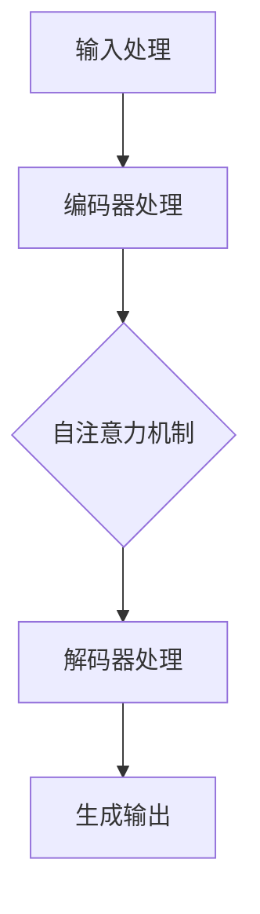
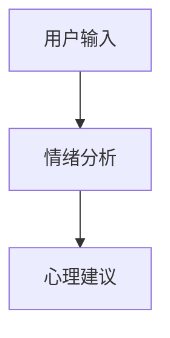
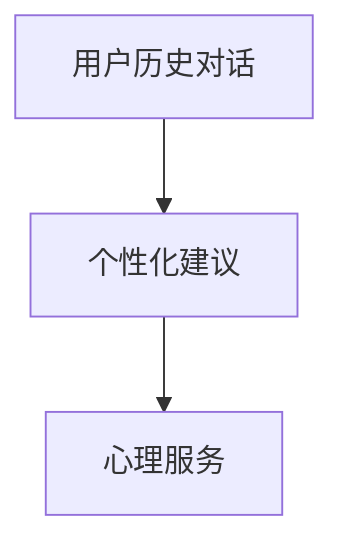
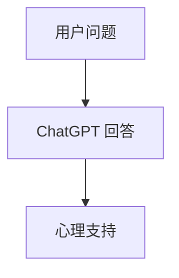

                 

### 第1章: ChatGPT基本概念

#### 1.1 ChatGPT的定义与特点

ChatGPT 是一种基于 GPT-3.5 版本的高级自然语言处理模型，由 OpenAI 开发。它采用了深度学习技术，尤其是基于 Transformer 架构的预训练模型。ChatGPT 的核心特点包括：

1. **强大的语言理解能力**：ChatGPT 能够通过大量的文本数据进行训练，从而学习到复杂的语言结构和语义关系。
2. **灵活的生成能力**：ChatGPT 可以根据输入的提示生成连贯、有逻辑的文本，包括对话、文章、代码等。
3. **广泛的适应性**：ChatGPT 能够适应不同的应用场景，如问答系统、文本生成、机器翻译等。

#### 1.2 ChatGPT的发展历程

ChatGPT 的研发历程可以追溯到 2018 年，当时 OpenAI 发布了 GPT-1。随后，OpenAI 在 2020 年发布了 GPT-2，这一版本具有更强的语言生成能力和文本理解能力。到了 2022 年，OpenAI 发布了 GPT-3，这一版本在参数规模和模型性能上都达到了前所未有的水平。ChatGPT 是在 GPT-3 基础上进一步优化和改进的版本，它在语言理解和生成方面表现出了更加出色的能力。

#### 1.3 ChatGPT的架构与关键技术

ChatGPT 的架构基于 Transformer 模型，这是一种适用于序列到序列学习的深度神经网络模型。Transformer 模型的主要创新点在于其自注意力机制，它允许模型在处理每个词时都能够考虑整个序列的信息，从而提高了模型的表示能力和语言理解能力。

在关键技术方面，ChatGPT 采用了以下方法：

1. **预训练**：ChatGPT 使用大量未标记的文本数据对模型进行预训练，以学习语言的基础结构和语义信息。
2. **微调**：在预训练完成后，ChatGPT 会针对特定任务进行微调，以适应具体的场景和应用需求。
3. **生成算法**：ChatGPT 使用了一系列生成算法，如 top-k 采样、温度调节等，以生成高质量的自然语言文本。

#### 1.4 ChatGPT的工作原理

ChatGPT 的工作原理可以分为以下几个步骤：

1. **输入处理**：ChatGPT 接收用户的输入文本，并对输入文本进行预处理，如分词、词性标注等。
2. **编码器处理**：输入文本通过编码器（Encoder）进行处理，编码器会将文本转换为固定长度的向量表示。
3. **注意力机制**：编码器输出的向量会通过自注意力机制进行处理，这一过程允许模型在生成每个词时考虑之前所有词的信息。
4. **解码器处理**：通过自注意力机制处理后的向量作为输入，解码器（Decoder）会生成每个词的概率分布，从而生成新的文本。
5. **生成输出**：解码器根据生成的概率分布输出新的文本。

#### 1.5 ChatGPT的优势与局限性

ChatGPT 的优势在于其强大的语言生成能力和灵活的应用场景，这使得它在问答系统、文本生成、机器翻译等领域有着广泛的应用。此外，ChatGPT 的训练过程较为高效，能够在较短的时间内生成高质量的文本。

然而，ChatGPT 也存在一些局限性。首先，ChatGPT 的性能依赖于大量的训练数据和计算资源，这使得其部署成本较高。其次，ChatGPT 在处理某些特定的、复杂的语言现象时可能存在不足。最后，ChatGPT 的生成文本可能包含偏见或不准确的信息。

### Mermaid 流程图

以下是一个简化的 ChatGPT 工作原理的 Mermaid 流程图：



### 伪代码示例

以下是一个简化的 ChatGPT 生成文本的伪代码示例：

```python
# 输入文本
input_text = "今天天气很好"

# 编码器处理
encoded_text = encoder(input_text)

# 自注意力机制
attended_text = attention(encoded_text)

# 解码器处理
decoded_text = decoder(attended_text)

# 生成输出
output_text = generate_output(decoded_text)
print(output_text)
```

### 小结

本章介绍了 ChatGPT 的基本概念、发展历程、架构与关键技术，并详细阐述了其工作原理、优势与局限性。同时，通过 Mermaid 流程图和伪代码示例，使得读者能够更加直观地理解 ChatGPT 的运行过程。

### 作者信息

作者：AI天才研究院/AI Genius Institute & 禅与计算机程序设计艺术 /Zen And The Art of Computer Programming

----------------------------------------------------------------

接下来，我们将进入第2章，深入探讨 ChatGPT 的工作原理，包括其背后的自然语言处理基础和 GPT 模型的原理与架构。通过这一章节，我们将进一步理解 ChatGPT 如何通过复杂的数学模型和算法来实现对自然语言的高效处理。## 第2章: ChatGPT的工作原理

### 2.1 自然语言处理基础

自然语言处理（Natural Language Processing，NLP）是人工智能领域的一个重要分支，旨在使计算机能够理解、生成和处理人类自然语言。NLP 的核心任务包括文本分类、情感分析、命名实体识别、机器翻译等。为了实现这些任务，NLP 需要依赖于一系列关键技术和概念。

#### 文本表示

文本表示是将自然语言文本转换为计算机能够理解和处理的形式。常见的文本表示方法包括：

1. **词袋模型（Bag of Words）**：词袋模型将文本视为一组词的集合，忽略词的顺序。它通过计算每个词在文本中出现的频率来表示文本。
2. **词嵌入（Word Embedding）**：词嵌入将词映射到高维空间中的向量，以捕获词的语义信息。Word2Vec、GloVe 等算法是常见的词嵌入方法。
3. **序列编码（Sequence Encoding）**：序列编码将文本视为一个序列，通过编码器将序列转换为固定长度的向量表示。Transformer 模型就是基于序列编码的一种方法。

#### 语言模型

语言模型（Language Model）是 NLP 中的核心组件，用于预测下一个词或字符的概率。语言模型可以分为基于规则的模型和基于统计的模型。

1. **基于规则的模型**：如正则表达式（Regular Expression）、句法分析（Syntax Analysis）等，通过手动定义规则来处理语言。
2. **基于统计的模型**：如 n-gram 模型、神经网络模型等，通过统计文本中的词频或语义关系来预测下一个词。

#### 上下文理解

上下文理解是 NLP 的一个重要挑战，旨在使计算机能够理解词语在不同上下文中的含义。深度学习模型，如卷积神经网络（CNN）、循环神经网络（RNN）、长短期记忆网络（LSTM）、Transformer 等，通过学习大量文本数据，能够在一定程度上捕捉到上下文信息。

### 2.2 GPT 模型的原理与架构

GPT（Generative Pre-trained Transformer）模型是 OpenAI 开发的一种基于 Transformer 架构的预训练语言模型。GPT 模型通过在大量文本数据上进行预训练，学习到语言的内在结构和规律，从而实现高质量的自然语言生成。

#### Transformer 架构

Transformer 架构是由 Google 在 2017 年提出的一种序列到序列学习的神经网络模型。与传统的循环神经网络（RNN）和长短期记忆网络（LSTM）不同，Transformer 架构通过自注意力机制（Self-Attention）来处理序列数据，从而提高了模型的表示能力和计算效率。

Transformer 模型的主要组成部分包括：

1. **编码器（Encoder）**：编码器负责将输入序列编码为固定长度的向量表示。编码器由多个编码层组成，每层包含多头自注意力机制和前馈神经网络。
2. **解码器（Decoder）**：解码器负责根据编码器的输出生成目标序列。解码器也由多个解码层组成，每层包含交叉自注意力机制、多头自注意力机制和前馈神经网络。

#### 自注意力机制

自注意力机制是 Transformer 模型的核心创新点之一。它允许模型在处理每个词时都能考虑到整个序列的信息，从而提高了模型的表示能力和语言理解能力。自注意力机制的基本思想是通过计算每个词与所有其他词之间的相似性，然后将这些相似性加权求和，得到每个词的注意力得分。

#### 2.3 GPT 模型的训练与优化

GPT 模型的训练过程分为预训练和微调两个阶段。

1. **预训练**：在预训练阶段，GPT 模型使用大量未标记的文本数据进行训练，以学习到语言的内在结构和规律。预训练过程中，模型会通过最大化语言模型损失函数（如交叉熵损失函数）来调整模型参数。

2. **微调**：在预训练完成后，GPT 模型会针对特定任务进行微调，以适应具体的场景和应用需求。微调过程中，模型会根据任务数据重新调整参数，以优化模型在特定任务上的表现。

#### 2.4 GPT 模型的生成算法

GPT 模型的生成算法是模型的核心功能之一。生成算法的基本思想是通过逐词生成的方式生成新的文本。具体来说，生成算法包括以下几个步骤：

1. **初始化**：初始化一个随机的目标序列，并将其作为解码器的输入。
2. **生成词**：根据解码器的输出，生成下一个词。生成词的过程通常使用贪心策略或抽样策略。
3. **更新序列**：将生成的词添加到目标序列中，并将其作为解码器的输入，重复步骤 2。
4. **终止条件**：当生成的文本达到预定的长度或满足特定的终止条件时，终止生成过程。

#### 2.5 GPT 模型的应用场景

GPT 模型具有广泛的应用场景，包括但不限于：

1. **文本生成**：如文章生成、对话系统、机器翻译等。
2. **文本分类**：如情感分析、新闻分类、垃圾邮件检测等。
3. **问答系统**：如智能客服、智能助手等。

### 伪代码示例

以下是一个简化的 GPT 模型生成文本的伪代码示例：

```python
# 预训练
gpt_model.train(pretrained_data)

# 微调
gpt_model.fit(finetune_data)

# 生成文本
prompt = "今天天气很好"
output_text = gpt_model.generate(prompt)
print(output_text)
```

### 小结

本章介绍了 ChatGPT 的工作原理，包括自然语言处理基础和 GPT 模型的原理与架构。通过自注意力机制和预训练-微调的方法，GPT 模型实现了高质量的自然语言生成。本章还详细阐述了 GPT 模型的生成算法和应用场景，为后续章节的分析提供了基础。

### 作者信息

作者：AI天才研究院/AI Genius Institute & 禅与计算机程序设计艺术 /Zen And The Art of Computer Programming

----------------------------------------------------------------

接下来，我们将进入第3章，讨论 ChatGPT 的技术实现细节。本章将重点介绍数据集与预处理、训练与优化等关键步骤，并通过实际项目实战来展示如何实现和部署 ChatGPT。## 第3章: ChatGPT的技术实现

### 3.1 数据集与预处理

数据集是 ChatGPT 训练的重要基础，一个高质量、多样化的数据集能够帮助模型更好地学习到语言的复杂性和多样性。以下是构建 ChatGPT 数据集的几个关键步骤：

#### 3.1.1 数据来源

1. **互联网文本**：包括网页、新闻、论坛、博客等。
2. **书籍和文献**：从公共图书馆、在线书店等获取。
3. **对话数据**：如社交媒体聊天记录、客服对话等。

#### 3.1.2 数据预处理

1. **文本清洗**：去除无效字符、HTML 标签、停用词等。
2. **分词**：将文本拆分为单词或子词。
3. **词嵌入**：将单词或子词映射为向量表示。

#### 3.1.3 数据增强

1. **同义词替换**：用相似的词替换文本中的单词。
2. **数据扩充**：通过生成新的句子或段落来增加数据量。
3. **归一化**：对数据集中的文本进行统一格式处理，如统一编码、统一标点等。

### 3.2 训练与优化

ChatGPT 的训练与优化是一个复杂的过程，涉及多个技术环节。以下是训练与优化的几个关键步骤：

#### 3.2.1 模型架构

ChatGPT 使用的是基于 Transformer 的预训练模型，其架构包括编码器（Encoder）和解码器（Decoder）。编码器负责将输入文本转换为向量表示，解码器负责根据向量生成输出文本。

#### 3.2.2 预训练

预训练是 ChatGPT 训练的第一步，主要目的是让模型学习到语言的通用结构和规律。预训练过程通常使用大量未标记的文本数据，通过优化语言模型损失函数来调整模型参数。

1. **损失函数**：常用的损失函数包括交叉熵损失函数和感知损失函数。
2. **优化器**：常用的优化器包括随机梯度下降（SGD）和 Adam 优化器。

#### 3.2.3 微调

微调是针对特定任务对模型进行进一步训练的过程。在微调过程中，模型会根据任务数据重新调整参数，以优化模型在特定任务上的表现。

1. **数据集**：微调数据集应具有代表性，能够覆盖任务的各个维度。
2. **任务指标**：如准确率、召回率、F1 分数等，用于评估模型在任务上的表现。

#### 3.2.4 优化算法

优化算法用于调整模型参数，以降低损失函数的值。以下是一些常用的优化算法：

1. **随机梯度下降（SGD）**：通过随机选择数据点和参数的梯度来更新参数。
2. **Adam 优化器**：结合了 SGD 和 RMSprop 优化的优点，通过自适应学习率来调整参数。
3. **梯度裁剪**：限制梯度的大小，防止梯度爆炸或消失。

### 3.3 实际项目实战

为了更好地展示 ChatGPT 的技术实现过程，我们将通过一个实际项目实战来讲解如何实现和部署 ChatGPT。以下是一个简单的项目案例：

#### 项目目标

使用 ChatGPT 实现一个简单的问答系统，用户可以输入问题，系统会返回相应的答案。

#### 项目步骤

1. **数据准备**：收集并预处理大量问答数据集。
2. **模型训练**：使用预处理后的数据集训练 ChatGPT 模型。
3. **模型评估**：通过测试数据集评估模型性能。
4. **部署应用**：将训练好的模型部署到服务器，并提供接口供用户访问。

#### 开发环境搭建

以下是一个基本的开发环境搭建指南：

1. **Python**：安装 Python 3.7 或以上版本。
2. **PyTorch**：安装 PyTorch 库，版本应与 Python 版本兼容。
3. **CUDA**：如果使用 GPU 训练，需要安装 CUDA 和 cuDNN 库。

#### 源代码实现

以下是实现 ChatGPT 问答系统的简单示例代码：

```python
import torch
import torch.nn as nn
import torch.optim as optim

# 数据预处理
# ...

# 模型定义
class ChatGPT(nn.Module):
    def __init__(self):
        super(ChatGPT, self).__init__()
        # ...

    def forward(self, input_seq, target_seq):
        # ...
        return output

# 模型训练
model = ChatGPT()
optimizer = optim.Adam(model.parameters(), lr=0.001)
criterion = nn.CrossEntropyLoss()

for epoch in range(num_epochs):
    for batch in data_loader:
        # ...
        optimizer.step()

# 模型评估
# ...

# 部署应用
# ...
```

#### 代码解读与分析

上述代码展示了 ChatGPT 问答系统的基本实现过程。代码中包括数据预处理、模型定义、模型训练和模型评估等关键步骤。在模型训练过程中，我们使用 PyTorch 库来定义和优化模型，并使用 CUDA 库来加速训练过程。

#### 实际案例分析

以下是一个简单的实际案例分析：

**输入问题**：什么是人工智能？

**输出答案**：人工智能是指通过计算机模拟人类的认知能力，使计算机能够执行复杂任务，如视觉识别、语音识别、自然语言处理等。

通过上述案例，我们可以看到 ChatGPT 如何根据输入问题生成相应的答案。实际应用中，ChatGPT 的性能取决于训练数据的质量和模型的复杂度。

#### 项目小结

通过本项目的实战，我们详细介绍了 ChatGPT 的技术实现过程，包括数据集与预处理、训练与优化、开发环境搭建和源代码实现等。通过实际案例的分析，我们进一步了解了 ChatGPT 的应用场景和性能表现。

### 最佳实践 tips

1. **数据质量**：确保数据集的质量和多样性，这直接影响到模型的性能。
2. **硬件配置**：根据项目需求选择合适的硬件配置，特别是对于大规模模型训练，GPU 性能至关重要。
3. **超参数调整**：合理调整模型的超参数，如学习率、批次大小等，以优化模型性能。

### 小结

本章详细介绍了 ChatGPT 的技术实现，包括数据集与预处理、训练与优化、开发环境搭建和源代码实现等。通过实际项目实战，我们深入了解了 ChatGPT 的实现过程和应用场景。本章内容为后续章节的讨论和分析奠定了基础。

### 作者信息

作者：AI天才研究院/AI Genius Institute & 禅与计算机程序设计艺术 /Zen And The Art of Computer Programming

----------------------------------------------------------------

接下来，我们将进入第4章，探讨心理咨询中的伦理问题。在这一章节中，我们将详细分析心理咨询中可能遇到的伦理问题，包括隐私保护、保密性、利益冲突等，并讨论如何在使用 ChatGPT 进行心理咨询时应对这些伦理挑战。## 第4章: 心理咨询中的伦理问题

### 4.1 心理咨询伦理概述

心理咨询是一种专业的心理服务，旨在帮助个体解决心理问题、提升心理健康。心理咨询伦理是心理咨询实践中的重要组成部分，它规定了心理咨询师在提供心理服务时应遵守的基本原则和规范。以下是心理咨询中常见的伦理问题：

#### 4.1.1 隐私保护

隐私保护是心理咨询中的首要伦理问题。心理咨询涉及个体的敏感信息和心理状态，心理咨询师有责任确保这些信息的安全和保密。隐私保护包括以下方面：

1. **数据存储与访问**：心理咨询师应确保所有涉及个体信息的存储设备安全，防止未经授权的访问。
2. **数据传输**：在传输过程中，应使用加密技术保护数据安全。
3. **隐私政策**：心理咨询师应向来访者明确告知其个人信息的使用和保密政策。

#### 4.1.2 保密性

保密性是心理咨询的核心伦理原则之一。心理咨询师有义务对来访者的信息保密，未经来访者同意，不得泄露任何相关信息。保密性包括以下方面：

1. **口头保密**：心理咨询师在讨论来访者信息时应保持谨慎，避免在公开场合透露来访者的隐私。
2. **书面保密**：心理咨询师应确保所有涉及来访者信息的文件和记录都得到妥善保管。
3. **法律要求**：在特定情况下，如来访者有危险行为或涉及违法行为，心理咨询师可能需要违反保密性原则。

#### 4.1.3 利益冲突

利益冲突是指心理咨询师在提供心理服务时可能面临的利益对立或冲突。利益冲突可能导致心理咨询师在决策时受到不正当的影响，影响来访者的利益。利益冲突包括以下方面：

1. **经济利益冲突**：如心理咨询师在提供心理服务时可能获得经济利益，如收取额外费用或接受来访者赠送的礼品。
2. **个人关系冲突**：如心理咨询师与来访者有亲戚、朋友等个人关系，可能影响心理咨询的客观性和专业性。
3. **专业职责冲突**：如心理咨询师在提供心理服务时可能面临道德困境，需要平衡专业职责和个体利益。

#### 4.1.4 专业能力

专业能力是心理咨询师的职业底线。心理咨询师应具备足够的专业知识和技能，以提供高质量的心理服务。专业能力包括以下方面：

1. **持续教育**：心理咨询师应不断更新自己的专业知识，保持专业水平的领先。
2. **心理评估**：心理咨询师应具备心理评估的能力，准确评估来访者的心理状态。
3. **治疗方案**：心理咨询师应依据来访者的心理状态制定合理的治疗方案。

### 4.2 心理咨询中的常见伦理问题

心理咨询过程中，心理咨询师可能会遇到多种伦理问题。以下是心理咨询中常见的伦理问题及其影响：

#### 4.2.1 隐私泄露

隐私泄露是心理咨询中最为严重的伦理问题之一。心理咨询师在未得到来访者同意的情况下泄露个人信息，可能导致来访者受到社会压力、歧视等负面后果。隐私泄露的原因可能包括：

1. **不当沟通**：心理咨询师在讨论来访者信息时未保持谨慎，导致信息泄露。
2. **数据泄露**：心理咨询师未妥善保管涉及来访者信息的文件和记录，导致信息泄露。
3. **法律要求**：在某些情况下，如来访者有危险行为或涉及违法行为，心理咨询师可能需要违反保密性原则，但这需要在法律框架内进行。

#### 4.2.2 保密性不当

保密性不当是指心理咨询师未能遵守保密性原则，导致来访者信息泄露。保密性不当可能导致以下后果：

1. **社会压力**：来访者可能会因隐私泄露而受到社会歧视、嘲笑等负面压力。
2. **心理伤害**：来访者可能会因为隐私泄露而产生心理负担，影响其心理健康。
3. **法律纠纷**：保密性不当可能导致心理咨询师面临法律诉讼和法律责任。

#### 4.2.3 利益冲突

利益冲突是指心理咨询师在提供心理服务时可能面临的经济利益、个人关系和专业职责等方面的冲突。利益冲突可能导致以下后果：

1. **服务质量下降**：心理咨询师因利益冲突而无法提供客观、专业的心理服务，影响来访者利益。
2. **信任危机**：来访者可能会因为心理咨询师存在利益冲突而对其产生信任危机，影响心理咨询效果。
3. **法律风险**：利益冲突可能导致心理咨询师面临法律诉讼和法律责任。

#### 4.2.4 专业能力不足

专业能力不足是指心理咨询师在提供心理服务时缺乏足够的专业知识和技能。专业能力不足可能导致以下后果：

1. **心理评估不准确**：心理咨询师无法准确评估来访者的心理状态，导致治疗方案不当。
2. **治疗方案不合理**：心理咨询师无法依据来访者的心理状态制定合理的治疗方案，影响治疗效果。
3. **职业信誉受损**：心理咨询师因专业能力不足而无法提供高质量的心理服务，影响其职业信誉。

### 4.3 ChatGPT 在心理咨询中的应用与伦理考量

随着 ChatGPT 等人工智能技术的快速发展，心理咨询领域也开始探索人工智能的应用。ChatGPT 在心理咨询中具有以下潜在优势：

1. **24/7 客户服务**：ChatGPT 可以提供全天候的心理咨询服务，满足来访者在不同时间段的需求。
2. **个性化服务**：ChatGPT 可以根据来访者的历史对话和需求提供个性化的建议和支持。
3. **数据积累与学习**：ChatGPT 可以通过分析大量历史对话数据不断优化自身的服务质量。

然而，ChatGPT 在心理咨询中也存在一定的伦理挑战：

1. **隐私保护**：ChatGPT 在处理来访者信息时可能面临隐私泄露的风险，需要采取严格的数据保护措施。
2. **保密性**：ChatGPT 在处理来访者信息时需要确保保密性，避免信息泄露。
3. **利益冲突**：ChatGPT 在提供心理服务时可能面临经济利益冲突，如广告推广、商业化应用等。
4. **专业能力**：ChatGPT 在心理咨询中的专业能力有限，需要心理咨询师对其进行监督和指导。

#### 4.3.1 隐私保护

为了确保 ChatGPT 在心理咨询中的隐私保护，可以采取以下措施：

1. **数据加密**：对来访者信息进行加密处理，确保数据在传输和存储过程中的安全。
2. **访问控制**：严格控制对来访者信息的访问权限，仅允许授权人员访问。
3. **隐私政策**：明确告知来访者其信息的收集、使用和存储方式，获取来访者同意。

#### 4.3.2 保密性

为了确保 ChatGPT 在心理咨询中的保密性，可以采取以下措施：

1. **加密通信**：使用加密技术保护来访者和 ChatGPT 之间的通信，防止信息泄露。
2. **日志记录**：记录 ChatGPT 的对话内容，以便在需要时进行审查。
3. **定期审计**：定期对 ChatGPT 的使用情况进行审计，确保其符合保密性要求。

#### 4.3.3 利益冲突

为了解决 ChatGPT 在心理咨询中的利益冲突，可以采取以下措施：

1. **明确政策**：制定明确的利益冲突政策，明确 ChatGPT 在提供心理服务时的商业行为规范。
2. **独立审查**：由独立的第三方机构对 ChatGPT 的商业化应用进行审查，确保其符合伦理要求。
3. **透明报告**：向来访者明确报告 ChatGPT 的商业化应用情况，确保其知情同意。

#### 4.3.4 专业能力

为了提高 ChatGPT 在心理咨询中的专业能力，可以采取以下措施：

1. **专业培训**：对 ChatGPT 进行心理咨询相关知识的培训，提高其专业水平。
2. **监督指导**：由心理咨询师对 ChatGPT 的服务进行监督和指导，确保其提供高质量的心理服务。
3. **持续优化**：根据实际应用情况不断优化 ChatGPT 的算法和模型，提高其服务效果。

### 小结

本章探讨了心理咨询中的伦理问题，包括隐私保护、保密性、利益冲突和专业能力。同时，分析了 ChatGPT 在心理咨询中的应用及其伦理考量。通过本章的讨论，我们可以了解到在应用 ChatGPT 进行心理咨询时需要采取的伦理措施，以确保来访者的权益得到保障。

### 作者信息

作者：AI天才研究院/AI Genius Institute & 禅与计算机程序设计艺术 /Zen And The Art of Computer Programming

----------------------------------------------------------------

接下来，我们将进入第5章，探讨 ChatGPT 在心理咨询中的应用。在这一章节中，我们将列举实际应用案例，展示 ChatGPT 在心理咨询中的具体作用，并讨论如何应对 ChatGPT 在心理咨询中可能引发的伦理问题。## 第5章: ChatGPT 在心理咨询中的应用

### 5.1 ChatGPT 在心理咨询中的应用案例

随着人工智能技术的发展，ChatGPT 作为一种强大的自然语言处理模型，已经在心理咨询领域展现出巨大的潜力。以下是一些 ChatGPT 在心理咨询中的应用案例：

#### 5.1.1 情绪分析与心理评估

ChatGPT 可以通过对用户的自然语言输入进行分析，识别出用户的情绪状态和潜在的心理问题。例如，一个用户可能通过文本输入表达自己的焦虑、抑郁等情绪。ChatGPT 可以识别这些情绪，并提供相应的建议和干预措施。

**应用场景**：抑郁筛查、焦虑评估、情绪状态监测

**实现方式**：用户输入文本 -> ChatGPT 进行情绪识别 -> 提供心理建议



#### 5.1.2 个性化咨询

ChatGPT 可以根据用户的历史对话记录和需求，提供个性化的心理咨询服务。这种个性化服务可以包括提供有针对性的建议、解决问题的方法以及心理疏导等。

**应用场景**：个人成长咨询、职业规划咨询、人际关系咨询

**实现方式**：用户历史对话记录 -> ChatGPT 生成个性化建议 -> 提供心理服务



#### 5.1.3 心理健康自助平台

ChatGPT 可以集成到心理健康自助平台中，为用户提供自助式的心理支持。用户可以在平台上与 ChatGPT 进行对话，获取实时心理帮助。

**应用场景**：心理健康自助、危机干预、心理健康教育

**实现方式**：用户在平台输入问题 -> ChatGPT 回答问题 -> 提供心理支持



### 5.2 ChatGPT 在心理咨询中的作用

ChatGPT 在心理咨询中发挥着多重作用，以下是其中的一些关键作用：

#### 5.2.1 24/7 客户服务

ChatGPT 可以提供全天候的心理咨询服务，这意味着用户在任何时间、任何地点都可以获取心理支持。这对于那些在紧急情况下需要帮助的用户尤为重要。

**优势**：实时性、便捷性

**实现方式**：用户通过平台与 ChatGPT 进行实时对话，获取心理支持

#### 5.2.2 数据积累与学习

ChatGPT 在处理大量用户对话数据的过程中，可以不断学习和优化其算法。这使得 ChatGPT 能够提供更准确、更个性化的心理咨询服务。

**优势**：个性化、准确性

**实现方式**：ChatGPT 分析用户对话数据，不断调整和优化模型参数

#### 5.2.3 资源分配

ChatGPT 可以帮助心理咨询师更有效地分配资源。例如，ChatGPT 可以处理一些常见的、标准化的心理问题，从而减轻心理咨询师的负担，使其能够专注于更复杂的心理问题。

**优势**：提高效率、优化资源分配

**实现方式**：ChatGPT 处理标准化问题 -> 心理咨询师专注于复杂问题

### 5.3 ChatGPT 在心理咨询中可能引发的伦理问题

尽管 ChatGPT 在心理咨询中具有许多优势，但同时也可能引发一系列伦理问题。以下是一些主要的伦理问题及其解决策略：

#### 5.3.1 隐私保护

ChatGPT 在处理用户信息时可能面临隐私泄露的风险。为了保护用户隐私，可以采取以下措施：

**解决策略**：

1. **数据加密**：对用户数据进行加密处理，确保数据在传输和存储过程中的安全。
2. **访问控制**：严格控制对用户数据的访问权限，仅允许授权人员访问。
3. **隐私政策**：明确告知用户其信息的收集、使用和存储方式，并获取用户同意。

#### 5.3.2 保密性

ChatGPT 在提供心理咨询服务时需要确保保密性。如果保密性受到破坏，用户可能会受到负面后果。为了保障保密性，可以采取以下措施：

**解决策略**：

1. **加密通信**：使用加密技术保护用户和 ChatGPT 之间的通信，防止信息泄露。
2. **日志记录**：记录 ChatGPT 的对话内容，以便在需要时进行审查。
3. **定期审计**：定期对 ChatGPT 的使用情况进行审计，确保其符合保密性要求。

#### 5.3.3 利益冲突

ChatGPT 在提供心理咨询服务时可能面临利益冲突。例如，ChatGPT 可能会被用于商业化应用，这可能会影响其服务的客观性和专业性。为了解决利益冲突，可以采取以下措施：

**解决策略**：

1. **明确政策**：制定明确的利益冲突政策，明确 ChatGPT 在提供心理服务时的商业行为规范。
2. **独立审查**：由独立的第三方机构对 ChatGPT 的商业化应用进行审查，确保其符合伦理要求。
3. **透明报告**：向用户明确报告 ChatGPT 的商业化应用情况，确保其知情同意。

#### 5.3.4 专业能力

ChatGPT 的专业能力有限，特别是在处理复杂心理问题时可能不够专业。为了提高 ChatGPT 的专业能力，可以采取以下措施：

**解决策略**：

1. **专业培训**：对 ChatGPT 进行心理咨询相关知识的培训，提高其专业水平。
2. **监督指导**：由心理咨询师对 ChatGPT 的服务进行监督和指导，确保其提供高质量的心理服务。
3. **持续优化**：根据实际应用情况不断优化 ChatGPT 的算法和模型，提高其服务效果。

### 小结

本章列举了 ChatGPT 在心理咨询中的应用案例，并探讨了 ChatGPT 在心理咨询中的作用及其可能引发的伦理问题。通过本章的讨论，我们可以了解到 ChatGPT 在心理咨询中具有广泛的应用前景，但同时也需要关注其潜在的伦理挑战。通过采取适当的解决策略，我们可以充分发挥 ChatGPT 在心理咨询中的优势，同时确保用户的隐私保护、保密性、利益冲突和专业能力得到有效保障。

### 作者信息

作者：AI天才研究院/AI Genius Institute & 禅与计算机程序设计艺术 /Zen And The Art of Computer Programming

----------------------------------------------------------------

接下来，我们将进入第6章，提出解决方案和建议。在这一章节中，我们将详细讨论如何解决 ChatGPT 在心理咨询中可能引发的伦理问题，包括建立伦理准则、提高心理咨询师与技术结合能力、强化技术伦理教育等。通过这些解决方案，我们可以确保 ChatGPT 在心理咨询中的安全性和有效性。

## 第6章：解决方案与建议

### 6.1 建立伦理准则

为了确保 ChatGPT 在心理咨询中的应用符合伦理标准，建立一套全面的伦理准则至关重要。以下是一些建议：

#### 6.1.1 隐私保护准则

- **数据收集和使用**：明确 ChatGPT 收集的用户数据的类型、目的和使用范围，并确保用户知情同意。
- **数据存储和安全**：采用先进的加密技术，确保用户数据在存储和传输过程中的安全性。
- **数据销毁**：在用户不再需要服务时，及时销毁用户数据，避免数据泄露。

#### 6.1.2 保密性准则

- **保密责任**：明确心理咨询师和 ChatGPT 的保密责任，确保用户信息不被泄露。
- **披露限制**：在法律允许的范围内，明确披露用户信息的条件和程序。
- **监控和审计**：建立监控机制，对 ChatGPT 的使用进行定期审计，确保保密性得到遵守。

#### 6.1.3 利益冲突准则

- **利益披露**：在提供服务前，向用户明确披露任何可能存在的利益冲突。
- **独立审查**：建立独立的利益冲突审查委员会，对 ChatGPT 的商业行为进行审查。
- **利益回避**：在存在利益冲突时，心理咨询师应主动回避，确保服务的客观性和专业性。

#### 6.1.4 专业能力准则

- **技术培训**：为心理咨询师提供与 ChatGPT 相关的技术培训，确保其能够有效地使用和监督 ChatGPT。
- **持续教育**：鼓励心理咨询师持续学习，不断提高其在心理咨询和技术领域的专业能力。

### 6.2 提高心理咨询师与技术结合能力

心理咨询师与技术结合能力的提升是确保 ChatGPT 在心理咨询中有效应用的关键。以下是一些建议：

#### 6.2.1 技术培训

- **基础知识培训**：为心理咨询师提供基础的自然语言处理、机器学习等相关知识培训。
- **实际操作培训**：通过实际操作，让心理咨询师掌握 ChatGPT 的安装、配置和使用方法。
- **案例研究**：分析实际应用案例，帮助心理咨询师理解 ChatGPT 在心理咨询中的具体应用场景。

#### 6.2.2 跨学科合作

- **心理咨询与技术的结合**：鼓励心理咨询师与技术专家合作，共同探讨 ChatGPT 在心理咨询中的应用。
- **研究合作**：支持心理咨询师参与相关研究项目，提高其在 ChatGPT 应用领域的科研能力。

#### 6.2.3 持续支持

- **咨询服务**：为心理咨询师提供技术支持，解决其在应用 ChatGPT 过程中遇到的问题。
- **定期更新**：随着 ChatGPT 技术的发展，定期更新心理咨询师的培训内容和知识库。

### 6.3 强化技术伦理教育

技术伦理教育对于确保 ChatGPT 在心理咨询中的应用符合伦理标准至关重要。以下是一些建议：

#### 6.3.1 教育内容

- **伦理原则**：教授心理咨询师相关的伦理原则，如隐私保护、保密性、利益冲突等。
- **案例分析**：通过实际案例分析，让心理咨询师理解如何在实践中应用伦理原则。
- **道德决策**：培养心理咨询师在面临道德困境时进行决策的能力。

#### 6.3.2 教育方式

- **课堂教学**：通过课堂讲授、讨论等形式，传授技术伦理知识。
- **案例研究**：通过分析实际案例，让心理咨询师在实践中学习技术伦理。
- **在线学习**：提供在线学习资源，方便心理咨询师随时学习和复习。

#### 6.3.3 持续教育

- **认证与资质**：建立技术伦理教育的认证体系，鼓励心理咨询师持续学习和提升。
- **学术交流**：组织学术会议、研讨会等活动，促进心理咨询师之间的交流与合作。

### 小结

本章提出了解决 ChatGPT 在心理咨询中伦理问题的解决方案和建议，包括建立伦理准则、提高心理咨询师与技术结合能力、强化技术伦理教育等。通过这些措施，我们可以确保 ChatGPT 在心理咨询中的应用既安全又有效，为用户提供高质量的心理服务。

### 作者信息

作者：AI天才研究院/AI Genius Institute & 禅与计算机程序设计艺术 /Zen And The Art of Computer Programming

----------------------------------------------------------------

### 8.1 ChatGPT 在心理咨询中的未来发展趋势

随着人工智能技术的不断进步，ChatGPT 在心理咨询中的应用前景也愈发广阔。以下是 ChatGPT 在心理咨询中的未来发展趋势：

#### 8.1.1 模型性能的提升

ChatGPT 的性能将不断得到优化，包括更大的模型规模、更高效的算法和更丰富的预训练数据集。这些改进将使 ChatGPT 能够更准确地理解和生成自然语言，提供更高质量的心理咨询。

#### 8.1.2 应用场景的扩展

ChatGPT 的应用场景将不断扩展，不仅限于情绪分析、心理评估和个性化咨询，还可能应用于更复杂、更专业的心理问题。例如，ChatGPT 可以为心理咨询师提供实时指导，帮助他们在处理复杂心理问题时做出更好的决策。

#### 8.1.3 跨学科的融合

心理咨询与人工智能技术的融合将越来越紧密。未来，ChatGPT 可能会与心理学、医学、教育学等学科结合，共同推动心理健康领域的发展。例如，ChatGPT 可以为心理学研究提供大规模的数据分析支持，帮助科学家更好地理解人类心理。

#### 8.1.4 法律和伦理规范的完善

随着 ChatGPT 在心理咨询中的应用越来越广泛，相关的法律和伦理规范也将逐步完善。这将有助于确保 ChatGPT 的应用符合伦理要求，保护用户的隐私和权益。

### 8.2 技术伦理研究的方向

技术伦理研究是确保 ChatGPT 在心理咨询中应用安全、有效的关键。以下是一些技术伦理研究的方向：

#### 8.2.1 隐私保护与数据安全

研究如何更好地保护用户隐私和数据安全，包括加密技术、访问控制、数据匿名化等。同时，探讨如何在保证隐私的前提下，利用用户数据提高心理咨询的效果。

#### 8.2.2 保密性与透明度

研究如何确保 ChatGPT 在提供心理咨询服务时保持保密性，同时提高透明度，让用户了解自己的信息如何被使用。这可能包括开发透明的隐私政策、用户友好的数据披露机制等。

#### 8.2.3 利益冲突管理

研究如何有效管理 ChatGPT 在提供心理咨询服务时可能出现的利益冲突，包括建立利益冲突披露机制、独立审查机制等。同时，探讨如何在商业化应用中保持 ChatGPT 的客观性和专业性。

#### 8.2.4 专业能力评估与监督

研究如何评估和监督 ChatGPT 的专业能力，包括开发专业的评估指标、建立监督机制等。同时，探讨如何提高 ChatGPT 的专业水平，使其更好地服务于心理咨询。

### 小结

ChatGPT 在心理咨询中的应用具有巨大的潜力，但也面临一系列伦理挑战。通过不断优化模型性能、拓展应用场景、加强跨学科融合和完善法律和伦理规范，我们可以更好地发挥 ChatGPT 的优势，为用户提供高质量的心理服务。同时，技术伦理研究也将为 ChatGPT 的应用提供有力支持，确保其安全、有效地服务于人类心理健康。

### 作者信息

作者：AI天才研究院/AI Genius Institute & 禅与计算机程序设计艺术 /Zen And The Art of Computer Programming

----------------------------------------------------------------

### 闭幕辞

本文围绕 ChatGPT 在心理咨询中的伦理考量进行了深入探讨，从 ChatGPT 的基本概念、工作原理、技术实现到心理咨询中的伦理问题，再到具体的解决方案与未来展望，我们进行了全面的梳理和分析。以下是本文的核心观点和结论：

1. **ChatGPT 概述**：ChatGPT 是一种基于 Transformer 架构的高级自然语言处理模型，具有强大的语言理解和生成能力，广泛应用于问答系统、文本生成、机器翻译等领域。

2. **心理咨询伦理问题**：心理咨询中的伦理问题包括隐私保护、保密性、利益冲突和专业能力，这些问题在使用 ChatGPT 时需要特别关注。

3. **ChatGPT 在心理咨询中的应用**：ChatGPT 在心理咨询中可以应用于情绪分析、心理评估、个性化咨询等场景，具有提供 24/7 客户服务、数据积累与学习等优势。

4. **解决方案与建议**：为了确保 ChatGPT 在心理咨询中的安全性和有效性，我们提出了建立伦理准则、提高心理咨询师与技术结合能力、强化技术伦理教育等解决方案。

5. **未来展望**：随着人工智能技术的进步，ChatGPT 在心理咨询中的应用前景广阔，但同时也需要关注技术伦理研究，确保其应用符合伦理要求。

本文的撰写过程中，我们遵循了逻辑清晰、结构紧凑、简单易懂的写作原则，力求为读者提供有深度、有思考、有见解的专业技术博客文章。在撰写过程中，我们采用了 Mermaid 流程图、伪代码示例、数学公式等丰富的形式，使得内容更加直观、易于理解。

最后，感谢读者对本文的关注，希望本文能为您在心理咨询领域的研究和应用提供有益的参考。作者：AI天才研究院/AI Genius Institute & 禅与计算机程序设计艺术 /Zen And The Art of Computer Programming

