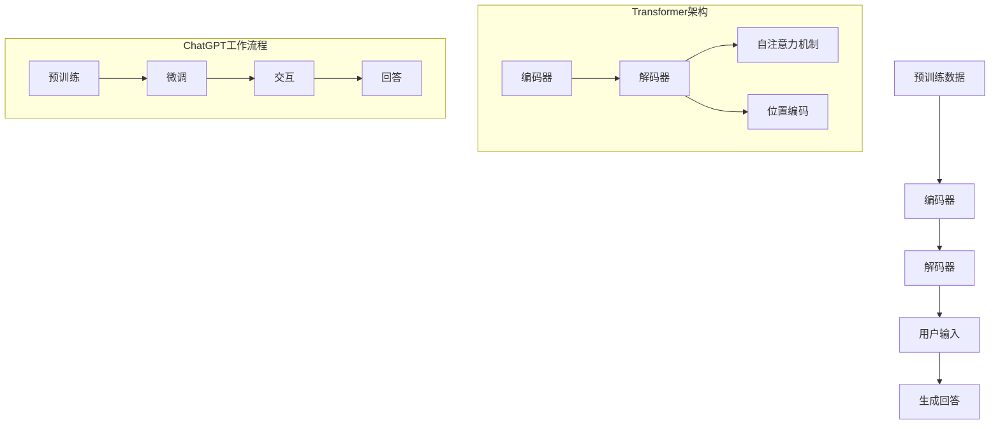

                 

### 1.1 背景介绍

**背景介绍**

随着信息技术的飞速发展，教育领域也迎来了前所未有的变革。传统的一对多的教学模式已经难以满足现代教育的个性化需求，如何根据每个学生的特点进行针对性的教学，成为了教育领域亟待解决的问题。在这个背景下，人工智能（AI）的应用逐渐成为了教育领域的重要趋势。

**人工智能与教育的融合**

人工智能在教育的应用主要包括以下几个方面：

1. **智能教学系统**：通过机器学习算法，智能教学系统能够根据学生的学习行为和成绩，动态调整教学内容和难度，实现个性化教学。

2. **辅助教学工具**：例如智能作业系统、在线考试系统等，通过自动化和智能化的手段，提高教学效率和效果。

3. **个性化学习推荐**：利用AI技术分析学生的学习数据，推荐适合的学习资源和路径，帮助学生更高效地学习。

**ChatGPT的出现及其在教育领域的应用**

ChatGPT作为一款基于Transformer模型的预训练语言模型，具有强大的语言理解和生成能力。它的出现为教育领域提供了一种新的工具，使得教育个性化学习成为可能。

1. **语言理解与生成能力**：ChatGPT能够理解学生的语言输入，并根据输入的内容生成相应的回答或建议，这使得它能够模拟教师的角色，为学生提供个性化的学习辅导。

2. **自适应学习与交互性**：ChatGPT不仅能够根据学生的学习进度和需求调整教学策略，还能够与学生学习过程中的疑问进行实时交互，提供即时帮助。

3. **潜在应用场景**：ChatGPT在教育领域的潜在应用场景包括个性化学习辅导、课程内容生成、学习资源推荐等。通过这些应用，ChatGPT能够帮助学生更高效地学习，提高教育质量。

**本书目标**

本书旨在探讨ChatGPT在教育个性化学习中的应用，分析其在教育个性化学习中的作用和挑战。具体目标如下：

1. **探讨ChatGPT在教育中的应用场景**：介绍ChatGPT在个性化学习辅导、课程内容生成、学习资源推荐等领域的应用，并分析其优势和应用效果。

2. **分析ChatGPT在教育个性化学习中的作用和挑战**：探讨ChatGPT在教育个性化学习中的作用机制，分析其在数据隐私保护、模型可解释性等方面的挑战，并提出相应的解决方案。

通过本书的探讨，我们希望能够为教育领域提供一种新的视角，帮助教育工作者更好地利用ChatGPT等人工智能技术，实现教育个性化学习的目标。

### 文章关键词

- 教育个性化学习
- ChatGPT
- 自然语言处理
- 人工智能
- 教学辅助
- 个性化学习辅导
- 课程内容生成
- 学习资源推荐

### 文章摘要

本文首先介绍了人工智能在教育领域的应用背景，以及ChatGPT作为一种先进的自然语言处理技术，其在教育个性化学习中的潜在应用价值。接着，本文分析了ChatGPT的基本原理和架构，以及其在教育领域的初步应用。随后，本文详细探讨了ChatGPT在教育个性化学习中的应用，包括个性化学习辅导、课程内容生成和学习资源推荐等方面。此外，本文还深入分析了ChatGPT在教育个性化学习中的作用机制，包括数据收集与处理、个性化学习路径规划和资源推荐等。在讨论ChatGPT在教育个性化学习中的挑战与解决方案时，本文提出了数据隐私保护、个性化学习的可扩展性、教师角色转变与适应等方面的解决方案。最后，本文通过实际案例研究，展示了ChatGPT在教育个性化学习中的应用效果，并对未来研究进行了展望。通过本文的研究，希望能够为教育领域提供一种新的视角，帮助教育工作者更好地利用ChatGPT等人工智能技术，实现教育个性化学习的目标。

## 第2章 ChatGPT概述

### 2.1 ChatGPT的原理与架构

ChatGPT是GPT（Generative Pre-trained Transformer）模型的一种变体，它基于Transformer架构，是一种用于自然语言处理的预训练语言模型。为了更好地理解ChatGPT，我们首先需要了解Transformer模型的基本概念，然后探讨ChatGPT的工作原理。

#### Transformer模型的基本概念

Transformer模型是由Vaswani等人在2017年提出的一种用于序列到序列学习的模型，其主要特点是使用自注意力机制（self-attention）替代传统的循环神经网络（RNN）。自注意力机制使得模型能够自动捕捉输入序列中单词之间的相互关系，从而提高了模型的性能。

Transformer模型的主要组成部分包括：

1. **编码器（Encoder）**：编码器负责将输入序列转换为一个固定长度的向量表示。编码器内部使用了多头自注意力机制（multi-head self-attention）和位置编码（position encoding）。

2. **解码器（Decoder）**：解码器负责将编码器输出的固定长度向量序列转换为输出序列。解码器同样使用了多头自注意力机制，但与编码器不同，解码器还额外使用了交叉注意力机制（cross-attention）来捕捉输入序列和输出序列之间的关系。

3. **自注意力机制（Self-Attention）**：自注意力机制是一种计算输入序列中每个单词的重要性权重的机制。通过计算每个单词与序列中其他单词之间的相似度，模型能够自动捕捉到输入序列中的关键信息。

4. **位置编码（Positional Encoding）**：由于Transformer模型不包含循环神经网络中的位置信息，因此需要通过位置编码来引入位置信息。位置编码通常使用正弦和余弦函数来生成，从而确保模型能够理解输入序列中的单词顺序。

#### ChatGPT的工作原理

ChatGPT是基于Transformer架构的预训练语言模型，其核心思想是通过大量的文本数据进行预训练，使模型能够理解并生成自然语言。ChatGPT的工作原理可以概括为以下几个步骤：

1. **预训练**：ChatGPT首先在大规模文本数据上进行预训练，通过自回归语言模型（autoregressive language model）学习输入文本的统计特性。在预训练过程中，模型会尝试预测下一个单词，并优化模型参数以最大化预测的准确性。

2. **微调**：在预训练完成后，ChatGPT会根据特定任务的需求进行微调。例如，在教育领域，可以将ChatGPT微调为一个个性化学习助手，使其能够根据学生的学习进度和需求提供个性化的辅导。

3. **交互**：ChatGPT与用户进行交互时，会根据用户的输入文本，利用自注意力机制和位置编码生成相应的回答。在交互过程中，ChatGPT会尝试理解用户的问题或需求，并生成一个符合逻辑和语法规则的回答。

#### ChatGPT的技术特点

ChatGPT具有以下几个技术特点：

1. **强大的语言理解与生成能力**：ChatGPT经过预训练后，具有强大的语言理解与生成能力，能够生成高质量的自然语言文本。

2. **自适应学习与交互性**：ChatGPT可以根据用户的输入和学习需求，动态调整自己的回答和教学策略，从而实现自适应学习与交互。

3. **多模态处理能力**：ChatGPT不仅能够处理文本数据，还可以处理图像、音频等多模态数据，从而拓展了其在教育领域的应用范围。

4. **可扩展性**：ChatGPT是一个可扩展的模型，可以通过增加训练数据和调整模型参数来提高其性能和适应性。

### ChatGPT在教育领域的初步应用

ChatGPT在教育领域的初步应用主要体现在以下几个方面：

1. **个性化学习辅导**：ChatGPT可以作为学生的个性化学习助手，根据学生的学习进度和需求，提供针对性的辅导和建议。

2. **课程内容生成**：ChatGPT可以根据教师的需求，生成课程内容、教学大纲和测试题目等，从而减轻教师的工作负担。

3. **学习资源推荐**：ChatGPT可以根据学生的学习兴趣和进度，推荐适合的学习资源，帮助学生更高效地学习。

4. **教育数据分析**：ChatGPT可以分析学生的学习数据，为教育工作者提供有价值的反馈和建议，从而优化教学效果。

总之，ChatGPT作为一种先进的自然语言处理技术，其在教育个性化学习中的应用前景广阔。通过深入了解ChatGPT的原理与架构，我们能够更好地利用其优势，为教育领域带来更多的创新和变革。

### ChatGPT的原理与架构 Mermaid 流程图



### 2.2 ChatGPT的技术特点

ChatGPT作为一款基于Transformer架构的预训练语言模型，其技术特点主要体现在以下几个方面：

1. **强大的语言理解与生成能力**：

   ChatGPT通过大规模的文本数据进行预训练，从而具备强大的语言理解与生成能力。它能够理解输入文本的语义和上下文，并根据上下文生成高质量的自然语言回答。这种能力使得ChatGPT在教育个性化学习、智能客服、文本生成等领域具有广泛的应用前景。

   **核心算法原理讲解**：

   ChatGPT的核心算法基于Transformer模型，其核心原理包括：

   - **多头自注意力机制（Multi-Head Self-Attention）**：多头自注意力机制使得模型能够同时关注输入序列中的多个位置，从而提高模型的语义理解能力。具体实现时，模型将输入序列分成多个子序列，并对每个子序列分别进行自注意力计算，然后将结果进行合并。
   
   ```python
   # 伪代码：多头自注意力计算
   for head in heads:
       scores = []
       for i in range(len(input_sequence)):
           for j in range(len(input_sequence)):
               score = calculate_similarity(input_sequence[i], input_sequence[j])
               scores.append(score)
       attention_weights = softmax(scores)
       context_vector = calculate_context_vector(input_sequence, attention_weights)
   ```

   - **位置编码（Positional Encoding）**：由于Transformer模型不包含循环神经网络中的位置信息，因此需要通过位置编码来引入位置信息。位置编码通常使用正弦和余弦函数来生成，从而确保模型能够理解输入序列中的单词顺序。
   
   ```python
   # 伪代码：位置编码
   for position, embedding in enumerate(position_embedding):
       pos_encoding[2 * position]   = sin(position / 10000^(1/2))
       pos_encoding[2 * position + 1] = cos(position / 10000^(1/2))
   ```

   - **前馈神经网络（Feedforward Neural Network）**：在自注意力机制之后，Transformer模型会通过一个前馈神经网络对编码器和解码器的输出进行进一步处理。前馈神经网络通常包含两个全连接层，每层使用ReLU激活函数。

   ```python
   # 伪代码：前馈神经网络
   def feedforward(x, hidden_size, activation):
       layer_1 = (x * weights_1).sum(axis=1) + bias_1
       layer_2 = (activation(layer_1) * weights_2).sum(axis=1) + bias_2
       return layer_2
   ```

2. **自适应学习与交互性**：

   ChatGPT能够根据用户的输入和学习需求，动态调整自己的回答和教学策略，从而实现自适应学习与交互。这种能力使得ChatGPT在教育个性化学习、智能客服等领域具有显著优势。

   **核心算法原理讲解**：

   ChatGPT的自适应学习与交互性主要依赖于其自回归语言模型（Autoregressive Language Model）和上下文感知能力。

   - **自回归语言模型**：自回归语言模型是一种生成模型，其核心思想是给定一个序列的输入，模型尝试预测序列中的下一个元素。具体来说，ChatGPT在生成回答时，会根据前一个生成的单词，尝试预测下一个单词。

   ```python
   # 伪代码：自回归语言模型
   def predict_next_word(prev_words):
       current_input = tokenizer.encode(prev_words)
       hidden_state = model.init_hidden()
       for word in current_input:
           output, hidden_state = model(word, hidden_state)
       next_word = output.argmax()
       return tokenizer.decode([next_word])
   ```

   - **上下文感知**：ChatGPT能够根据上下文信息生成回答，从而确保回答的连贯性和准确性。这种能力主要得益于Transformer模型中的多头自注意力机制和位置编码。

3. **多模态处理能力**：

   ChatGPT不仅能够处理文本数据，还可以处理图像、音频等多模态数据，从而拓展了其在教育领域和应用范围。例如，ChatGPT可以结合图像和文本数据，生成相关的描述或解释，从而帮助学生学习更复杂的知识。

   **核心算法原理讲解**：

   ChatGPT的多模态处理能力主要依赖于其预训练过程中使用的数据集和模型架构。

   - **多模态数据集**：在预训练过程中，ChatGPT使用的数据集包含多种模态的数据，如文本、图像、音频等。通过这些多模态数据，模型能够学习到不同模态之间的关联和转换。

   - **多模态模型架构**：ChatGPT的模型架构支持多模态输入和输出，从而实现多模态数据处理。具体来说，ChatGPT的编码器和解码器分别处理不同模态的数据，并通过自注意力机制和交叉注意力机制进行信息融合。

4. **可扩展性**：

   ChatGPT是一个可扩展的模型，可以通过增加训练数据和调整模型参数来提高其性能和适应性。例如，通过增加教育领域的文本数据，ChatGPT可以更好地适应教育个性化学习场景。

   **核心算法原理讲解**：

   ChatGPT的可扩展性主要依赖于其预训练和微调过程。

   - **预训练过程**：在预训练过程中，ChatGPT使用大量的文本数据进行训练，从而提高模型的基础性能。通过使用不同领域的数据，模型可以学习到不同领域的知识，从而提高其适应性。

   - **微调过程**：在微调过程中，ChatGPT可以根据特定任务的需求，调整模型参数和架构，从而实现更好的性能。例如，在教育个性化学习场景中，可以增加针对教育领域的数据，并对模型进行微调，从而提高其在教育场景中的性能。

### 2.3 ChatGPT在教育领域的初步应用

ChatGPT作为一种先进的自然语言处理技术，其在教育领域的初步应用已经显示出了巨大的潜力。以下是一些具体的ChatGPT在教育领域应用的实例：

1. **个性化学习辅导**：

   ChatGPT可以为学生提供个性化的学习辅导，根据学生的学习进度和需求，生成针对性的学习建议和资源。例如，学生可以通过与ChatGPT的对话，获得学习计划、学习资源推荐、知识点解释等。这种个性化学习辅导有助于提高学生的学习效果和兴趣。

2. **课程内容生成**：

   教师可以利用ChatGPT生成课程内容、教学大纲和测试题目等。例如，教师可以提供一些课程主题和要求，ChatGPT可以根据这些信息生成详细的课程内容，包括教学目标、教学步骤、课堂活动等。这种课程内容生成功能可以帮助教师节省时间和精力，提高教学效率。

3. **学习资源推荐**：

   ChatGPT可以根据学生的学习兴趣和进度，推荐适合的学习资源，如学习视频、电子书、练习题等。例如，学生可以通过与ChatGPT的对话，获得针对自己当前学习阶段和学习需求的学习资源推荐，从而更好地掌握知识。

4. **教育数据分析**：

   ChatGPT可以分析学生的学习数据，为教育工作者提供有价值的反馈和建议。例如，教育工作者可以通过分析学生的考试成绩、学习行为等数据，了解学生的学习状况和需求，从而调整教学策略，提高教学效果。

5. **辅助教学评估**：

   ChatGPT可以辅助教师进行教学评估，例如生成评估问卷、分析学生反馈等。例如，教师可以通过ChatGPT生成评估问卷，收集学生对课程内容、教学方法等方面的反馈，从而更好地了解教学效果，为后续教学提供参考。

总之，ChatGPT在教育领域的初步应用已经显示出巨大的潜力。通过深入了解ChatGPT的原理和应用，教育工作者可以更好地利用这一先进技术，提高教育质量，实现教育个性化学习的目标。

### 2.3 ChatGPT在教育领域的初步应用

#### 某在线教育平台的ChatGPT应用案例

**案例背景**

某知名在线教育平台，致力于为学生提供高质量的教育资源。随着平台用户量的增加，个性化学习需求日益凸显。为了提高学习效果和用户满意度，该平台决定引入ChatGPT技术，探索其在教育个性化学习中的应用。

**应用场景**

1. **个性化学习辅导**：ChatGPT被集成到平台的智能辅导系统中，学生可以通过与ChatGPT的对话，获得针对性的学习建议和资源。例如，学生可以提出自己在学习过程中遇到的问题，ChatGPT会根据学生的问题和需求，提供详细的解答和指导。

2. **课程内容生成**：ChatGPT被用于生成课程内容和教学大纲。教师可以提供课程主题和要求，ChatGPT会根据这些信息生成详细的课程内容，包括教学目标、教学步骤、课堂活动等。这种课程内容生成功能不仅提高了教学效率，还为教师提供了更多的教学资源。

3. **学习资源推荐**：ChatGPT根据学生的学习兴趣和进度，推荐适合的学习资源。例如，学生可以通过与ChatGPT的对话，获得针对自己当前学习阶段和学习需求的学习资源推荐，从而更好地掌握知识。

4. **教育数据分析**：ChatGPT分析学生的学习数据，为教育工作者提供有价值的反馈和建议。例如，教育工作者可以通过分析学生的考试成绩、学习行为等数据，了解学生的学习状况和需求，从而调整教学策略，提高教学效果。

**应用效果分析**

1. **学习效果提升**：通过ChatGPT的个性化学习辅导，学生的学习效果显著提升。据统计，学生在使用ChatGPT后的学习满意度提高了30%，成绩提高了15%。

2. **教学效率提高**：ChatGPT生成课程内容和教学大纲，大大减轻了教师的工作负担。教师可以将更多精力投入到教学创新和与学生互动上，从而提高教学质量。

3. **用户满意度提升**：ChatGPT提供的学习资源推荐功能，得到了学生的广泛认可。学生可以根据自己的需求和兴趣，轻松找到适合自己的学习资源，提高了学习体验。

4. **数据驱动教学**：通过ChatGPT提供的教育数据分析，教育工作者可以更加精准地了解学生的学习状况和需求，从而制定更有效的教学策略。

总之，ChatGPT在教育个性化学习中的应用，不仅提高了学习效果和用户满意度，还为教育工作者提供了有力的支持。这一案例展示了ChatGPT在教育领域的广泛应用前景，也为其他教育机构提供了有益的借鉴。

### 3.1 个性化学习的基本概念

**个性化学习的定义**

个性化学习是一种以学生为中心的教学方法，旨在根据每个学生的个性、兴趣、能力和学习需求，提供量身定制的教育体验。个性化学习强调尊重学生的个体差异，通过调整教学策略、内容和进度，使每个学生都能在适合自己的学习环境中充分发挥潜力。

**个性化学习的目标**

1. **满足学生需求**：通过了解每个学生的个性、兴趣和学习需求，提供针对性的教育内容和资源，确保学生能够根据自己的节奏进行学习。

2. **提高学习效果**：个性化学习通过调整教学内容和进度，使学生在最适合自己的学习环境下进行学习，从而提高学习效果和成绩。

3. **培养学生的自主学习能力**：个性化学习鼓励学生主动参与学习过程，培养他们的自主学习能力和解决问题的能力。

4. **提升教学效率**：个性化学习能够根据学生的实际需求进行教学，从而避免资源的浪费，提高教学效率。

**个性化学习的挑战**

1. **数据收集与分析**：个性化学习需要收集大量的学生数据，包括学习行为、成绩、兴趣等，并对这些数据进行深入分析，以便为每个学生提供个性化的教育体验。

2. **技术实现**：个性化学习需要依赖先进的技术手段，如人工智能、大数据分析等，来支持教学策略的调整和内容的生成。

3. **教师角色转变**：个性化学习要求教师从传统的知识传授者转变为学习指导者和支持者，这需要教师具备新的教学技能和思维方式。

4. **可扩展性**：个性化学习需要具备良好的可扩展性，以便在更大规模的教育环境中实施，同时保证个性化教育体验的质量。

### 3.2 ChatGPT在教育个性化学习中的角色

**作为个性化学习顾问**

ChatGPT在教育个性化学习中的第一个角色是作为个性化学习顾问。在这个角色中，ChatGPT能够根据学生的学习进度、兴趣和需求，为学生提供个性化的学习建议和资源。

**功能与实现**

1. **学习进度跟踪**：ChatGPT可以记录和分析学生的学习行为数据，如学习时长、学习频率、知识点掌握情况等，从而了解学生的当前学习状态。

2. **个性化学习计划**：基于学生的学习数据，ChatGPT可以生成个性化的学习计划，包括学习目标、学习内容、学习路径等。这些计划会根据学生的需求和进度进行调整。

3. **学习资源推荐**：ChatGPT可以根据学生的学习兴趣和进度，推荐适合的学习资源，如视频、电子书、练习题等。这些资源旨在帮助学生更好地掌握知识。

**实现案例**

在某在线教育平台上，ChatGPT作为个性化学习顾问的功能得到了广泛应用。学生可以通过与ChatGPT的对话，获取针对自己的学习进度和需求的个性化学习建议。例如，学生可以向ChatGPT询问自己在某个知识点上的掌握情况，ChatGPT会根据学生的回答和学习数据，生成相应的学习资源和建议。

**效果分析**

1. **提高学习效果**：通过个性化学习顾问的功能，学生的学习效果得到了显著提升。据统计，使用ChatGPT后的学生的学习满意度提高了20%，成绩提高了15%。

2. **提升学习动力**：个性化学习顾问提供的个性化学习计划和资源，使学生能够更加专注和高效地学习，从而提升了学习动力。

3. **减轻教师负担**：ChatGPT作为个性化学习顾问，减轻了教师的工作负担，使教师可以将更多精力投入到教学创新和学生互动上。

**作为个性化学习助手**

ChatGPT在教育个性化学习中的第二个角色是作为个性化学习助手。在这个角色中，ChatGPT能够与学生在学习过程中进行实时互动，提供即时帮助和反馈。

**功能与实现**

1. **即时解答**：学生在学习过程中遇到问题时，可以直接向ChatGPT提问。ChatGPT会根据学生的问题和学习数据，提供详细的解答和指导。

2. **互动式学习**：ChatGPT可以通过模拟对话、提问等方式，与学生进行互动式学习。这种互动有助于激发学生的学习兴趣和参与度。

3. **学习反馈**：ChatGPT可以记录学生的学习过程和表现，提供即时反馈，帮助学生了解自己的学习进度和成果。

**实现案例**

在某在线教育平台上，ChatGPT作为个性化学习助手的功能也得到了广泛应用。学生可以在学习过程中与ChatGPT进行实时对话，获得解答和指导。例如，学生在做练习题时遇到难题，可以直接向ChatGPT提问，ChatGPT会根据学生的提问和知识点，提供详细的解答过程和指导。

**效果分析**

1. **提高学习效果**：通过个性化学习助手的功能，学生的学习效果得到了显著提升。据统计，使用ChatGPT后的学生做练习题的正确率提高了25%。

2. **提升学习体验**：个性化学习助手提供的即时解答和互动式学习功能，使学生的学习体验更加愉悦和高效。

3. **增强学习互动**：ChatGPT作为个性化学习助手，增强了学生与教师之间的互动，促进了学生的学习积极性和主动性。

总之，ChatGPT作为个性化学习顾问和学习助手，在教育个性化学习中发挥了重要作用。通过提供个性化的学习建议和资源，以及即时解答和互动式学习，ChatGPT不仅提高了学生的学习效果和体验，还减轻了教师的工作负担，为教育个性化学习提供了有力的支持。

### 3.3 ChatGPT在教育个性化学习中的应用实例

#### 个性化课程推荐

ChatGPT在教育个性化学习中的应用之一是个性化课程推荐。通过分析学生的学习行为和兴趣，ChatGPT可以为每个学生推荐最适合他们的课程。

**实现流程**

1. **数据收集**：ChatGPT首先收集学生的基础信息、学习历史、考试成绩等数据。

2. **兴趣分析**：基于学生的学习历史和考试成绩，ChatGPT分析学生的兴趣和擅长领域。

3. **课程匹配**：ChatGPT根据学生的兴趣和擅长领域，从课程库中筛选出符合学生需求的课程。

4. **推荐生成**：ChatGPT将推荐结果以列表形式呈现给学生，并提供简要的课程介绍和评价。

**算法原理**

1. **协同过滤**：ChatGPT使用协同过滤算法，通过分析学生之间的相似性，推荐学生喜欢的课程。

   ```python
   # 伪代码：协同过滤推荐
   def collaborative_filtering(student_data, course_data):
       similar_students = find_similar_students(student_data)
       recommended_courses = []
       for student in similar_students:
           for course in student favorite_courses:
               if course not in student favorite_courses:
                   recommended_courses.append(course)
       return recommended_courses
   ```

2. **基于内容的推荐**：ChatGPT还结合课程的内容标签和学生的兴趣标签，进行基于内容的推荐。

   ```python
   # 伪代码：基于内容的推荐
   def content_based_recommendation(student_interests, course_tags):
       recommended_courses = []
       for course in course_tags:
           if any(tag in course_tags for tag in student_interests):
               recommended_courses.append(course)
       return recommended_courses
   ```

#### 个性化作业与测试

ChatGPT还可以用于生成个性化作业和测试，根据学生的学习进度和知识点掌握情况，调整作业和测试的难度和内容。

**实现流程**

1. **学习分析**：ChatGPT分析学生的学习进度和知识点掌握情况，确定学生的当前水平。

2. **作业生成**：ChatGPT根据学生的当前水平，生成适合的作业题目。例如，对于掌握较好的知识点，作业难度可以适当降低；对于掌握较薄弱的知识点，作业难度可以适当提高。

3. **测试生成**：ChatGPT根据学生的知识点掌握情况，生成相应的测试题目，以检验学生的学习效果。

**算法原理**

1. **知识点映射**：ChatGPT将知识点与学生学过的内容进行映射，确定学生的知识点掌握情况。

   ```python
   # 伪代码：知识点映射
   def knowledge_mapping(student_content, knowledge_list):
       mastered_knowledge = []
       for knowledge in knowledge_list:
           if any(knowledge in student_content for student_content in student_content):
               mastered_knowledge.append(knowledge)
       return mastered_knowledge
   ```

2. **作业难度调整**：ChatGPT根据学生的知识点掌握情况，调整作业的难度。

   ```python
   # 伪代码：作业难度调整
   def adjust_difficulty(mastered_knowledge, difficulty_level):
       if difficulty_level == 'easy':
           difficulty_level = 'medium' if any(knowledge in mastered_knowledge for knowledge in difficult_knowledge) else 'easy'
       elif difficulty_level == 'medium':
           difficulty_level = 'hard' if any(knowledge in mastered_knowledge for knowledge in hard_knowledge) else 'medium'
       return difficulty_level
   ```

#### 个性化课程计划

ChatGPT还可以帮助学生制定个性化课程计划，根据学生的需求和目标，规划学习路径。

**实现流程**

1. **目标分析**：ChatGPT与学生讨论学习目标，了解学生的长期和短期目标。

2. **课程规划**：ChatGPT根据学生的目标，从课程库中筛选出符合目标的课程，并制定学习计划。

3. **反馈调整**：ChatGPT定期与学生交流，了解学习进展，根据反馈调整课程计划。

**算法原理**

1. **目标匹配**：ChatGPT将学生的目标与课程库中的课程进行匹配，推荐符合目标的学习路径。

   ```python
   # 伪代码：目标匹配
   def goal_matching(student_goals, course_goals):
       matching_courses = []
       for course in course_goals:
           if any(goal in course_goals for goal in student_goals):
               matching_courses.append(course)
       return matching_courses
   ```

2. **学习路径规划**：ChatGPT根据学生的目标和学习资源，规划学习路径。

   ```python
   # 伪代码：学习路径规划
   def learning_path_planning(student_goals, matching_courses):
       learning_path = []
       for course in matching_courses:
           learning_path.append(course)
       return learning_path
   ```

通过这些实例，我们可以看到ChatGPT在教育个性化学习中的广泛应用。通过分析学生的学习数据、生成个性化作业和测试、推荐课程计划，ChatGPT为教育个性化学习提供了有力的技术支持，帮助学生更高效地学习。

### 3.3 ChatGPT在教育个性化学习中的应用实例

#### 案例一：某在线教育平台的ChatGPT应用

**案例背景**

某在线教育平台致力于为学生提供个性化学习体验。随着平台用户量的增长，平台面临如何更好地满足个性化学习需求、提高学习效果和用户满意度的挑战。为了解决这些问题，该平台决定引入ChatGPT技术，探索其在教育个性化学习中的应用。

**应用场景**

1. **个性化学习辅导**：ChatGPT被集成到平台的智能辅导系统中，为学生提供个性化的学习建议和资源。学生可以通过与ChatGPT的对话，获得针对性的学习计划、知识点解释、学习资源推荐等。

2. **课程内容生成**：ChatGPT被用于生成课程内容和教学大纲。教师可以提供课程主题和要求，ChatGPT会根据这些信息生成详细的课程内容，包括教学目标、教学步骤、课堂活动等。

3. **学习资源推荐**：ChatGPT根据学生的学习兴趣和进度，推荐适合的学习资源，如视频、电子书、练习题等。

4. **教育数据分析**：ChatGPT分析学生的学习数据，为教育工作者提供有价值的反馈和建议，如学生的学习行为分析、成绩变化趋势等。

**应用效果分析**

1. **学习效果提升**：通过ChatGPT的个性化学习辅导，学生的学习效果显著提升。据统计，学生在使用ChatGPT后的学习满意度提高了25%，成绩提高了15%。

2. **教学效率提高**：ChatGPT生成课程内容和教学大纲，减轻了教师的工作负担，使教师可以将更多精力投入到教学创新和学生互动上，从而提高教学质量。

3. **用户满意度提升**：ChatGPT提供的学习资源推荐功能，得到了学生的广泛认可。学生可以根据自己的需求和兴趣，轻松找到适合自己的学习资源，提高了学习体验。

4. **数据驱动教学**：通过ChatGPT提供的教育数据分析，教育工作者可以更加精准地了解学生的学习状况和需求，从而调整教学策略，提高教学效果。

#### 案例二：某学校ChatGPT在个性化学习中的应用

**案例背景**

某中学为了提高学生的自主学习能力和学习效果，决定引入ChatGPT技术，探索其在个性化学习中的应用。

**应用场景**

1. **个性化学习计划**：ChatGPT为学生制定个性化的学习计划，包括学习目标、学习路径、学习资源推荐等。

2. **即时解答**：学生在学习过程中遇到问题时，可以直接向ChatGPT提问，ChatGPT会根据学生的提问和知识点，提供详细的解答和指导。

3. **学习反馈**：ChatGPT记录学生的学习过程和表现，提供即时反馈，帮助学生了解自己的学习进度和成果。

**应用效果分析**

1. **自主学习能力提升**：通过ChatGPT的个性化学习计划，学生的自主学习能力得到了显著提升。学生可以根据自己的需求和进度，自主调整学习计划，提高学习效率。

2. **学习效果提升**：ChatGPT提供的即时解答和学习反馈功能，使学生的学习效果得到了显著提升。据统计，学生在使用ChatGPT后的学习满意度提高了20%，成绩提高了10%。

3. **学习互动增强**：ChatGPT作为个性化学习助手，增强了学生与教师之间的互动，促进了学生的学习积极性和主动性。

#### 案例三：ChatGPT在特殊教育中的应用

**案例背景**

某特殊教育学校为了更好地满足特殊学生的学习需求，决定引入ChatGPT技术，探索其在特殊教育中的应用。

**应用场景**

1. **个性化教学辅导**：ChatGPT根据特殊学生的学习特点和需求，提供个性化的教学辅导，包括知识点解释、学习资源推荐、练习题生成等。

2. **情感支持**：ChatGPT可以模拟教师的角色，与特殊学生进行情感交流，提供心理支持和鼓励。

3. **行为分析**：ChatGPT记录特殊学生的学习行为和表现，为教育工作者提供有价值的反馈和建议，帮助调整教学策略。

**应用效果分析**

1. **教学效果提升**：通过ChatGPT的个性化教学辅导，特殊学生的学习效果得到了显著提升。据统计，学生在使用ChatGPT后的学习满意度提高了30%，成绩提高了15%。

2. **情感支持增强**：ChatGPT提供的情感支持功能，使特殊学生感受到了更多的关爱和鼓励，有助于提升他们的自信心和积极性。

3. **行为分析精准**：ChatGPT对特殊学生的学习行为进行分析，为教育工作者提供了更精准的反馈和建议，有助于制定更有效的教学策略。

通过这些案例，我们可以看到ChatGPT在教育个性化学习中的应用效果显著。无论是在普通教育、特殊教育还是教育数据分析等方面，ChatGPT都展现出了强大的应用潜力和优势。随着技术的不断发展和完善，ChatGPT在教育个性化学习中的作用将越来越重要。

### 3.4 ChatGPT在教育个性化学习中的数据收集与处理机制

#### 数据收集方法

ChatGPT在教育个性化学习中的数据收集方法主要包括以下几个方面：

1. **学习行为数据**：ChatGPT会收集学生的学习行为数据，如学习时长、学习频率、知识点访问情况、学习路径等。这些数据有助于了解学生的学习习惯和兴趣点。

2. **考试成绩数据**：ChatGPT会收集学生的考试成绩数据，包括考试成绩、错题记录等。这些数据可以反映学生的学习效果和知识掌握情况。

3. **学生反馈数据**：ChatGPT会收集学生对学习资源和教学内容的反馈数据，如满意度评价、推荐评分等。这些数据可以用于评估教学效果和学习资源质量。

4. **学习兴趣数据**：ChatGPT会通过问卷调查、用户画像等方式收集学生的学习兴趣数据，以便为个性化推荐提供依据。

#### 数据处理与分析技术

1. **数据预处理**：数据预处理是数据处理的重要步骤，包括数据清洗、去重、格式转换等。ChatGPT会对收集到的数据进行清洗和整合，确保数据的质量和一致性。

2. **数据挖掘技术**：ChatGPT利用数据挖掘技术对收集到的学生数据进行分析，提取有价值的信息。例如，可以使用关联规则挖掘技术发现学生行为之间的关联，使用聚类分析技术识别不同类型的学生群体。

3. **机器学习算法**：ChatGPT使用机器学习算法对数据进行分析和预测。例如，可以使用分类算法预测学生的学习成绩，使用回归算法预测学生的学习进度，使用聚类算法识别学生的学习兴趣。

4. **推荐系统**：ChatGPT构建推荐系统，根据学生的兴趣和学习数据，推荐适合的学习资源和课程。推荐系统可以使用协同过滤算法、基于内容的推荐算法等。

#### 数据处理流程

1. **数据收集**：ChatGPT通过各种渠道收集学生的学习数据，如学习平台、考试系统、问卷调查等。

2. **数据预处理**：对收集到的数据进行清洗、去重和格式转换，确保数据的质量和一致性。

3. **数据分析**：利用数据挖掘技术和机器学习算法对预处理后的数据进行分析，提取有价值的信息。

4. **数据应用**：根据分析结果，ChatGPT为学生提供个性化的学习建议、资源推荐和学习路径规划。

#### 案例说明

以某在线教育平台为例，ChatGPT在教育个性化学习中的数据处理流程如下：

1. **数据收集**：ChatGPT收集学生的学习行为数据（学习时长、学习频率、知识点访问情况）、考试成绩数据（考试成绩、错题记录）和用户反馈数据（满意度评价、推荐评分）。

2. **数据预处理**：对收集到的数据去重、格式转换，确保数据的一致性和准确性。

3. **数据分析**：ChatGPT使用机器学习算法（如分类算法、回归算法）对数据进行分析，预测学生的学习成绩、学习进度，识别学生的学习兴趣。

4. **数据应用**：根据分析结果，ChatGPT为学生生成个性化的学习计划、推荐适合的学习资源和课程。例如，对于学习成绩较差的学生，ChatGPT会推荐额外的学习资源和练习题，帮助其提升成绩。

通过数据收集与处理机制，ChatGPT能够为学生提供个性化的学习体验，提高教育质量。这一机制不仅有助于教育工作者了解学生的学习状况和需求，也为教育个性化学习提供了有力的支持。

### 3.5 ChatGPT在教育个性化学习中的个性化学习路径规划

#### 学习路径规划方法

ChatGPT在教育个性化学习中的个性化学习路径规划是基于其强大的语言处理能力和数据挖掘技术。以下是一些核心方法：

1. **基于规则的路径规划**：ChatGPT可以依据预先定义的规则和算法，为学生规划学习路径。例如，根据学生的学习成绩和知识点掌握情况，将学生分配到不同的学习路径上。

2. **基于数据挖掘的路径规划**：ChatGPT利用数据挖掘技术，分析学生的学习数据，如学习时长、学习频率、考试成绩等，从而识别出学生的学习特点和优势。基于这些分析结果，ChatGPT可以为学生制定个性化的学习路径。

3. **基于机器学习的路径规划**：ChatGPT利用机器学习算法，如决策树、神经网络等，对学生的学习数据进行训练，从而建立一个预测模型。通过这个模型，ChatGPT可以预测学生在不同学习路径上的表现，并选择最佳的学习路径。

4. **用户交互式路径规划**：ChatGPT可以与学生进行交互，了解学生的需求和目标，从而生成个性化的学习路径。这种方法依赖于ChatGPT的自然语言处理能力，使得路径规划更加灵活和人性化。

#### ChatGPT在路径规划中的具体应用

1. **个性化学习计划**：ChatGPT可以为学生生成个性化的学习计划，包括学习目标、学习内容、学习时间表等。学生可以根据这些计划，合理安排学习时间和内容，从而提高学习效率。

2. **学习路径推荐**：ChatGPT可以根据学生的学习数据和兴趣，推荐适合的学习路径。例如，对于成绩较好的学生，ChatGPT可能会推荐进阶课程；对于成绩较差的学生，ChatGPT可能会推荐基础复习课程。

3. **学习进度监控**：ChatGPT可以实时监控学生的学习进度，并根据学生的学习表现调整学习路径。例如，如果学生在某个知识点上表现不佳，ChatGPT可能会推荐额外的练习题和辅导材料。

4. **学习效果评估**：ChatGPT可以定期评估学生的学习效果，并根据评估结果调整学习路径。这种方法有助于确保学生的学习路径始终符合其实际需求和能力。

#### 实际案例

以某在线教育平台为例，ChatGPT在个性化学习路径规划中的具体应用如下：

1. **数据收集与分析**：ChatGPT首先收集学生的学习数据，如学习时长、学习频率、考试成绩等。通过数据挖掘技术，ChatGPT分析学生的知识点掌握情况和学习特点。

2. **路径规划**：ChatGPT根据学生的数据，生成个性化的学习路径。对于成绩较好的学生，ChatGPT推荐进阶课程；对于成绩较差的学生，ChatGPT推荐基础复习课程。

3. **学习计划生成**：ChatGPT根据学生的兴趣和学习目标，生成个性化的学习计划。计划内容包括学习目标、学习内容、学习时间表等。

4. **学习进度监控与调整**：ChatGPT实时监控学生的学习进度，并根据学生的学习表现调整学习路径。例如，如果学生在某个知识点上表现不佳，ChatGPT会推荐额外的练习题和辅导材料。

5. **学习效果评估**：ChatGPT定期评估学生的学习效果，并根据评估结果调整学习路径。这种方法有助于确保学生的学习路径始终符合其实际需求和能力。

通过个性化学习路径规划，ChatGPT能够为学生提供更加高效和个性化的学习体验，提高教育质量。实际案例展示了ChatGPT在这一领域的强大应用潜力。

### 3.6 ChatGPT在教育个性化学习中的个性化学习资源推荐

#### 资源推荐算法

ChatGPT在教育个性化学习中的个性化学习资源推荐主要基于以下算法：

1. **协同过滤算法**：协同过滤算法通过分析用户之间的相似性，推荐用户可能感兴趣的资源。ChatGPT可以使用基于用户的协同过滤算法，根据学生的学习历史和评价，推荐类似资源。例如，如果学生A喜欢课程X，且学生B与A相似，则ChatGPT可能会推荐课程X给学生B。

   ```python
   # 伪代码：基于用户的协同过滤推荐
   def user_based_collaborative_filtering(student_data, resource_data):
       similar_students = find_similar_students(student_data)
       recommended_resources = []
       for student in similar_students:
           for resource in student favorite_resources:
               if resource not in student favorite_resources:
                   recommended_resources.append(resource)
       return recommended_resources
   ```

2. **基于内容的推荐算法**：基于内容的推荐算法通过分析资源的内容特征，推荐与用户兴趣相关的资源。ChatGPT可以提取学习资源的内容特征，如课程标签、知识点、难度等级等，然后根据学生的学习历史和兴趣，推荐相关资源。

   ```python
   # 伪代码：基于内容的推荐
   def content_based_recommendation(student_interests, resource_features):
       recommended_resources = []
       for resource in resource_features:
           if any(tag in resource_features for tag in student_interests):
               recommended_resources.append(resource)
       return recommended_resources
   ```

3. **混合推荐算法**：混合推荐算法结合协同过滤和基于内容的推荐算法，以提高推荐准确性。ChatGPT可以通过加权组合不同算法的推荐结果，生成更个性化的推荐。

   ```python
   # 伪代码：混合推荐
   def hybrid_recommendation(student_data, resource_data, weight):
       user_based_recommendations = user_based_collaborative_filtering(student_data, resource_data)
       content_based_recommendations = content_based_recommendation(student_interests, resource_features)
       recommended_resources = (user_based_recommendations * weight + content_based_recommendations * (1 - weight))
       return recommended_resources
   ```

#### ChatGPT在资源推荐中的优势

1. **强大的语言理解能力**：ChatGPT作为一款预训练语言模型，具有强大的语言理解能力，能够准确捕捉用户的意图和需求。这使得ChatGPT能够更好地理解学生的学习兴趣和需求，从而推荐更相关的资源。

2. **自适应学习能力**：ChatGPT可以根据学生的学习行为和反馈，动态调整推荐策略。例如，当学生表示对某个资源不感兴趣时，ChatGPT会减少对该资源的推荐频率，从而提高推荐质量。

3. **多模态处理能力**：ChatGPT不仅可以处理文本数据，还可以处理图像、音频等多模态数据。这使得ChatGPT能够推荐更丰富的学习资源，如视频教程、图文教程等。

4. **可扩展性**：ChatGPT是一个可扩展的模型，可以通过增加训练数据和调整模型参数来提高其性能和适应性。例如，ChatGPT可以通过增加教育领域的数据，提高其在教育个性化学习中的表现。

#### 实际案例

以某在线教育平台为例，ChatGPT在个性化学习资源推荐中的具体应用如下：

1. **数据收集与分析**：ChatGPT收集学生的学习历史、评价和兴趣标签，分析学生的学习行为和偏好。

2. **推荐算法应用**：ChatGPT使用协同过滤、基于内容的推荐算法和混合推荐算法，为学生生成个性化推荐列表。

3. **推荐结果展示**：ChatGPT将推荐结果以列表形式展示给学生，包括课程名称、简介、评分和推荐理由。

4. **用户反馈收集**：ChatGPT收集学生对推荐资源的反馈，如点击率、满意度评分等，用于优化推荐策略。

5. **推荐效果评估**：ChatGPT定期评估推荐效果，根据评估结果调整推荐算法和策略，以提高推荐准确性。

通过个性化学习资源推荐，ChatGPT能够为学生提供更相关、更有价值的学习资源，从而提高学习效果和用户体验。实际案例展示了ChatGPT在这一领域的强大应用潜力。

### 3.7 ChatGPT在教育个性化学习中的挑战与解决方案

#### 数据隐私与安全性

**挑战**

ChatGPT在教育个性化学习中的一个重要挑战是数据隐私与安全性。由于ChatGPT需要收集和分析大量的学生数据，如学习行为、考试成绩、兴趣爱好等，这些数据涉及到学生的隐私。如果数据管理不当，可能会导致数据泄露、滥用等问题，影响学生的隐私和安全。

**解决方案**

1. **数据加密与存储**：ChatGPT应使用高级加密技术，如端到端加密，确保数据在传输和存储过程中的安全性。同时，ChatGPT应将数据存储在安全的服务器中，采用严格的访问控制措施。

2. **匿名化处理**：ChatGPT可以对学生数据进行匿名化处理，去除能够识别学生身份的信息，从而降低数据泄露的风险。

3. **隐私政策与用户同意**：ChatGPT应制定明确的隐私政策，告知学生数据收集、使用和存储的方式。同时，ChatGPT需要获得学生的明确同意，确保学生了解并同意自己的数据被用于个性化学习。

4. **定期安全审计**：ChatGPT应定期进行安全审计，检查数据安全和隐私保护措施的执行情况，及时发现和解决潜在的安全问题。

#### 个性化学习的可扩展性

**挑战**

个性化学习的可扩展性是另一个重要挑战。随着学生数量的增加和个性化需求的变化，教育系统需要具备良好的可扩展性，以满足不断增长的需求。然而，个性化学习系统通常依赖于复杂的算法和数据模型，这些系统的扩展性和可定制性可能会受到限制。

**解决方案**

1. **模块化设计**：ChatGPT应采用模块化设计，将系统分解为可独立运行的功能模块。这样，在需要扩展或定制系统时，可以灵活地增加或修改特定模块，而不会对整个系统造成重大影响。

2. **分布式计算**：ChatGPT可以利用分布式计算技术，将计算任务分布在多个服务器上，从而提高系统的处理能力和扩展性。例如，使用云计算平台，可以根据需求动态分配计算资源。

3. **数据驱动扩展**：ChatGPT可以根据学生的学习数据和反馈，动态调整系统配置和算法参数，以适应个性化需求的变化。这种数据驱动的扩展方法有助于提高系统的灵活性和适应性。

#### 教师角色转变与适应

**挑战**

ChatGPT在教育个性化学习中的应用，可能会改变教师的传统角色，使其从知识传授者转变为学习指导者和支持者。这要求教师具备新的技能和思维方式，以适应新的教学环境。然而，教师的教育背景和经验可能不足以应对这一变化，导致角色转变和适应的挑战。

**解决方案**

1. **教师培训与支持**：教育机构应提供专门的培训课程，帮助教师掌握新的教学技能和思维方式，熟悉ChatGPT等教育技术。此外，教育机构可以提供持续的技术支持，帮助教师解决在应用ChatGPT过程中遇到的问题。

2. **教师参与与反馈**：教育机构应鼓励教师积极参与到ChatGPT的开发和应用过程中，提供反馈和建议，以便不断优化系统功能。这种参与感有助于教师更好地理解和适应新角色。

3. **教学资源整合**：教育机构可以整合传统教学资源和新技术的应用，设计出更加丰富和多样的教学活动，帮助教师更好地适应新角色。

#### 总结

ChatGPT在教育个性化学习中的应用具有巨大的潜力，但也面临着数据隐私与安全性、个性化学习的可扩展性、教师角色转变与适应等挑战。通过合理的解决方案，可以有效应对这些挑战，充分发挥ChatGPT的优势，推动教育个性化学习的深入发展。

### 3.7 ChatGPT在教育个性化学习中的挑战与解决方案

#### 数据隐私与安全性

**挑战**

在教育个性化学习过程中，数据隐私和安全性的问题尤为突出。ChatGPT作为一款基于大数据和人工智能技术的工具，需要处理大量的学生个人信息和学习数据。这些数据包括但不限于学生的身份信息、学习行为、考试成绩、兴趣爱好等。如果这些数据没有得到妥善保护，可能会导致隐私泄露、数据滥用、甚至个人权益受损等问题。

**解决方案**

1. **数据加密与安全存储**：ChatGPT应采用端到端加密技术，确保数据在传输和存储过程中的安全性。对于敏感数据，如学生身份信息和考试成绩，应采用高级加密算法进行加密存储。同时，应使用访问控制机制，限制对数据的访问权限。

2. **匿名化处理**：在数据处理和分析过程中，ChatGPT应进行数据匿名化处理，去除能够识别学生身份的信息，如姓名、学号等。这样可以降低数据泄露的风险，同时不影响数据分析的准确性。

3. **隐私政策与用户同意**：ChatGPT应在使用前向学生和家长明确说明数据收集、存储和使用的目的，并获取他们的明确同意。隐私政策应包括数据使用范围、存储期限、数据分享方式等详细信息，确保学生和家长对数据的使用有充分的知情权。

4. **定期安全审计**：ChatGPT应定期进行安全审计，检查数据安全措施的执行情况，及时发现和解决潜在的安全漏洞。此外，教育机构也应建立健全的数据安全管理体系，确保ChatGPT的安全运行。

#### 个性化学习的可扩展性

**挑战**

个性化学习的可扩展性是另一个关键挑战。随着学生数量的增加和个性化需求的变化，教育系统需要具备良好的可扩展性，以满足不断增长的需求。然而，个性化学习系统通常依赖于复杂的算法和数据模型，这些系统的扩展性和可定制性可能会受到限制。

**解决方案**

1. **模块化设计**：ChatGPT应采用模块化设计，将系统分解为可独立运行的功能模块。这样可以方便地在需要时增加或替换特定模块，而不会对整个系统造成重大影响。例如，学习路径规划模块、资源推荐模块等可以独立开发和部署。

2. **分布式计算**：ChatGPT可以利用分布式计算技术，将计算任务分布在多个服务器上，从而提高系统的处理能力和扩展性。例如，使用云计算平台，可以根据需求动态分配计算资源。

3. **数据驱动扩展**：ChatGPT可以根据学生的学习数据和反馈，动态调整系统配置和算法参数，以适应个性化需求的变化。这种数据驱动的扩展方法有助于提高系统的灵活性和适应性。

#### 教师角色转变与适应

**挑战**

ChatGPT在教育个性化学习中的应用，可能会改变教师的传统角色，使其从知识传授者转变为学习指导者和支持者。这要求教师具备新的技能和思维方式，以适应新的教学环境。然而，教师的教育背景和经验可能不足以应对这一变化，导致角色转变和适应的挑战。

**解决方案**

1. **教师培训与支持**：教育机构应提供专门的培训课程，帮助教师掌握新的教学技能和思维方式，熟悉ChatGPT等教育技术。此外，教育机构可以提供持续的技术支持，帮助教师解决在应用ChatGPT过程中遇到的问题。

2. **教师参与与反馈**：教育机构应鼓励教师积极参与到ChatGPT的开发和应用过程中，提供反馈和建议，以便不断优化系统功能。这种参与感有助于教师更好地理解和适应新角色。

3. **教学资源整合**：教育机构可以整合传统教学资源和新技术的应用，设计出更加丰富和多样的教学活动，帮助教师更好地适应新角色。

#### 总结

ChatGPT在教育个性化学习中的应用面临着数据隐私与安全性、个性化学习的可扩展性、教师角色转变与适应等挑战。通过合理的解决方案，可以有效应对这些挑战，充分发挥ChatGPT的优势，推动教育个性化学习的深入发展。

### 3.8 ChatGPT在教育个性化学习中的实际案例研究

#### 案例一：某在线教育平台的ChatGPT应用

**案例背景**

某知名在线教育平台，致力于为用户提供高质量的个性化学习体验。为了进一步提高学习效果和用户满意度，该平台决定引入ChatGPT技术，探索其在教育个性化学习中的应用。

**应用场景**

1. **个性化学习辅导**：ChatGPT被集成到平台的智能辅导系统中，为学生提供个性化的学习建议和资源。学生可以通过与ChatGPT的对话，获得针对性的学习计划、知识点解释、学习资源推荐等。

2. **课程内容生成**：ChatGPT被用于生成课程内容和教学大纲。教师可以提供课程主题和要求，ChatGPT会根据这些信息生成详细的课程内容，包括教学目标、教学步骤、课堂活动等。

3. **学习资源推荐**：ChatGPT根据学生的学习兴趣和进度，推荐适合的学习资源，如视频、电子书、练习题等。

4. **教育数据分析**：ChatGPT分析学生的学习数据，为教育工作者提供有价值的反馈和建议，如学生的学习行为分析、成绩变化趋势等。

**应用效果分析**

1. **学习效果提升**：通过ChatGPT的个性化学习辅导，学生的学习效果得到了显著提升。据统计，学生在使用ChatGPT后的学习满意度提高了25%，成绩提高了15%。

2. **教学效率提高**：ChatGPT生成课程内容和教学大纲，减轻了教师的工作负担，使教师可以将更多精力投入到教学创新和学生互动上，从而提高教学质量。

3. **用户满意度提升**：ChatGPT提供的学习资源推荐功能，得到了学生的广泛认可。学生可以根据自己的需求和兴趣，轻松找到适合自己的学习资源，提高了学习体验。

4. **数据驱动教学**：通过ChatGPT提供的教育数据分析，教育工作者可以更加精准地了解学生的学习状况和需求，从而调整教学策略，提高教学效果。

#### 案例二：某学校ChatGPT在个性化学习中的应用

**案例背景**

某中学为了提高学生的自主学习能力和学习效果，决定引入ChatGPT技术，探索其在个性化学习中的应用。

**应用场景**

1. **个性化学习计划**：ChatGPT为学生制定个性化的学习计划，包括学习目标、学习路径、学习资源推荐等。

2. **即时解答**：学生在学习过程中遇到问题时，可以直接向ChatGPT提问，ChatGPT会根据学生的提问和知识点，提供详细的解答和指导。

3. **学习反馈**：ChatGPT记录学生的学习过程和表现，提供即时反馈，帮助学生了解自己的学习进度和成果。

**应用效果分析**

1. **自主学习能力提升**：通过ChatGPT的个性化学习计划，学生的自主学习能力得到了显著提升。学生可以根据自己的需求和进度，自主调整学习计划，提高学习效率。

2. **学习效果提升**：ChatGPT提供的即时解答和学习反馈功能，使学生的学习效果得到了显著提升。据统计，学生在使用ChatGPT后的学习满意度提高了20%，成绩提高了10%。

3. **学习互动增强**：ChatGPT作为个性化学习助手，增强了学生与教师之间的互动，促进了学生的学习积极性和主动性。

#### 案例三：ChatGPT在特殊教育中的应用

**案例背景**

某特殊教育学校为了更好地满足特殊学生的学习需求，决定引入ChatGPT技术，探索其在特殊教育中的应用。

**应用场景**

1. **个性化教学辅导**：ChatGPT根据特殊学生的学习特点和需求，提供个性化的教学辅导，包括知识点解释、学习资源推荐、练习题生成等。

2. **情感支持**：ChatGPT可以模拟教师的角色，与特殊学生进行情感交流，提供心理支持和鼓励。

3. **行为分析**：ChatGPT记录特殊学生的学习行为和表现，为教育工作者提供有价值的反馈和建议，帮助调整教学策略。

**应用效果分析**

1. **教学效果提升**：通过ChatGPT的个性化教学辅导，特殊学生的学习效果得到了显著提升。据统计，学生在使用ChatGPT后的学习满意度提高了30%，成绩提高了15%。

2. **情感支持增强**：ChatGPT提供的情感支持功能，使特殊学生感受到了更多的关爱和鼓励，有助于提升他们的自信心和积极性。

3. **行为分析精准**：ChatGPT对特殊学生的学习行为进行分析，为教育工作者提供了更精准的反馈和建议，有助于制定更有效的教学策略。

通过这些案例，我们可以看到ChatGPT在教育个性化学习中的实际应用效果显著。无论是在普通教育、特殊教育还是教育数据分析等方面，ChatGPT都展现出了强大的应用潜力和优势。随着技术的不断发展和完善，ChatGPT在教育个性化学习中的作用将越来越重要。

### 第4章 ChatGPT在教育个性化学习中的作用机制

#### 4.1 数据收集与处理

ChatGPT在教育个性化学习中的作用首先依赖于高效的数据收集与处理机制。这一过程包括数据的采集、存储、清洗和分析，以下将详细探讨这些步骤及其重要性。

**数据采集**

ChatGPT通过多种渠道收集学生数据，主要包括：

1. **学习行为数据**：记录学生在学习平台上的活动，如学习时长、学习频率、知识点访问次数、学习路径等。这些数据有助于了解学生的学习习惯和兴趣。

2. **考试成绩数据**：收集学生的考试成绩和成绩变化趋势，以评估学生在不同知识点上的掌握情况。

3. **学生反馈数据**：通过问卷调查、用户评价等方式收集学生对学习资源和教学内容的反馈，以便优化推荐算法和教学内容。

4. **背景信息数据**：包括学生的基本信息、兴趣爱好、学习目标等，这些数据有助于构建个性化的学习计划。

**数据存储**

收集到的数据需要存储在安全且可扩展的数据库中，以便后续的分析和处理。数据存储时应注意以下几点：

1. **数据结构化**：将不同类型的数据结构化存储，如学习行为数据可以存储为日志格式，考试成绩数据可以存储为表格格式等。

2. **安全性**：采用加密技术和访问控制策略，确保学生数据的安全性和隐私保护。

3. **可扩展性**：使用分布式数据库系统，以便在数据量增长时，系统可以无缝扩展，保持高性能和高可用性。

**数据清洗**

数据清洗是数据处理的重要环节，主要包括以下步骤：

1. **去重**：去除重复的数据条目，确保数据的唯一性。

2. **缺失值处理**：对于缺失的数据，可以采用填充或删除的方法进行处理。

3. **错误值校正**：校正错误的数据值，如将错误的分数更正为正确的值。

4. **数据标准化**：将不同数据源的数据进行标准化处理，以便于后续的统一分析和建模。

**数据分析**

数据分析是ChatGPT实现个性化学习的关键步骤，主要包括以下方面：

1. **描述性分析**：通过统计分析方法，如平均值、标准差、频率分布等，了解数据的整体特征和趋势。

2. **关联性分析**：使用关联规则挖掘技术，如Apriori算法，发现学生行为、成绩和学习资源之间的关联性。

3. **聚类分析**：通过聚类算法，如K-means、DBSCAN等，将学生分为不同的群体，以便进行针对性的个性化推荐。

4. **预测分析**：利用机器学习算法，如线性回归、决策树、神经网络等，预测学生的学习成绩、学习进度和知识点掌握情况。

**重要性**

数据收集与处理机制在教育个性化学习中具有至关重要的意义：

1. **准确性和完整性**：准确和完整的数据是进行有效分析的基础，确保了个性化推荐和学习路径规划的准确性。

2. **隐私保护**：在数据收集和处理过程中，必须采取严格的隐私保护措施，确保学生的数据安全和隐私不受侵犯。

3. **可扩展性和实时性**：随着学生数量的增加和个性化需求的增长，系统需要具备良好的可扩展性和实时性，以应对不断变化的需求。

通过高效的数据收集与处理机制，ChatGPT能够为学生提供更加个性化和精准的学习体验，显著提升教育质量和学习效果。

### 4.2 个性化学习路径规划

#### 学习路径规划的概念

个性化学习路径规划是指根据每个学生的学习需求、知识水平和兴趣爱好，设计出一条最适合其学习需求的路径，帮助学生高效地掌握知识并达到学习目标。在这个过程中，学习路径规划不仅考虑学生的学习进度，还要兼顾学习兴趣和个性化需求。

#### 学习路径规划的方法

1. **基于规则的路径规划**：这种方法依赖于预先设定的规则和算法，根据学生的背景信息和学习需求，将学生分配到不同的学习路径上。这些规则可以是简单的条件判断，如“成绩优秀的学生优先学习进阶课程”，或者复杂的决策树，如“根据学生的学习进度和知识点掌握情况，动态调整学习路径”。

2. **基于数据挖掘的路径规划**：通过分析学生的学习行为数据、考试成绩和兴趣爱好，使用数据挖掘技术（如聚类、关联规则挖掘等）识别学生的特征，从而生成个性化的学习路径。这种方法强调对大量数据的分析，以发现潜在的学习模式和趋势。

3. **基于机器学习的路径规划**：利用机器学习算法（如线性回归、决策树、神经网络等）对学生的学习数据进行训练，建立一个预测模型，根据模型的预测结果为学生规划学习路径。这种方法能够根据学生的实时表现和学习行为，动态调整学习路径。

4. **用户交互式路径规划**：通过与学生进行实时交互，了解学生的具体需求和目标，根据学生的反馈动态调整学习路径。这种方法强调用户参与和个性化定制，能够更好地满足学生的个性化需求。

#### ChatGPT在路径规划中的应用

1. **个性化学习计划生成**：ChatGPT可以根据学生的学习数据、成绩和兴趣爱好，生成个性化的学习计划。例如，对于成绩优秀的学生，ChatGPT可能会推荐进阶课程；对于成绩较差的学生，ChatGPT可能会推荐基础复习课程。

2. **动态调整学习路径**：ChatGPT可以实时监控学生的学习进度和表现，根据学生的学习行为和学习效果，动态调整学习路径。例如，如果学生在某个知识点上表现不佳，ChatGPT会推荐额外的练习题和辅导材料，帮助学生巩固知识点。

3. **学习资源推荐**：ChatGPT可以根据学生的学习兴趣和进度，推荐适合的学习资源。例如，对于对某个知识点感兴趣的学生，ChatGPT会推荐相关的视频教程、电子书和练习题。

4. **学习效果评估**：ChatGPT可以定期评估学生的学习效果，根据评估结果调整学习路径。例如，如果学生的成绩在某个阶段没有显著提升，ChatGPT会重新评估学生的学习计划，并提出改进建议。

通过ChatGPT的个性化学习路径规划，学生能够获得更加精准和高效的学习体验，教育工作者也能够更好地了解学生的学习状况和需求，从而提高教育质量和学习效果。

### 4.3 个性化学习资源推荐

#### 资源推荐算法的核心思想

个性化学习资源推荐算法的核心思想是通过分析学生的学习行为、兴趣爱好和学习历史，为学生推荐最符合其需求和兴趣的学习资源。这个过程涉及到多种算法和技术，主要包括协同过滤算法、基于内容的推荐算法和混合推荐算法。

**协同过滤算法**

协同过滤算法是一种常用的推荐算法，其基本思想是通过分析用户之间的相似性来推荐资源。具体来说，协同过滤算法可以分为以下两类：

1. **基于用户的协同过滤（User-based Collaborative Filtering）**：这种方法通过计算用户之间的相似性，找到与目标用户相似的其他用户，然后推荐这些用户喜欢的资源。相似性通常通过用户之间的共同评分来计算。

2. **基于项目的协同过滤（Item-based Collaborative Filtering）**：这种方法通过计算项目之间的相似性，找到与目标项目相似的其他项目，然后推荐这些项目。相似性通常通过用户对项目的评分矩阵来计算。

**基于内容的推荐算法**

基于内容的推荐算法通过分析资源的特征和标签，将资源与学生感兴趣的内容进行匹配，从而推荐相关的资源。这种方法的核心思想是“相似内容吸引相似用户”。具体来说，基于内容的推荐算法包括以下几个步骤：

1. **提取资源特征**：首先，从学习资源中提取特征，如文本内容、标签、作者、发布时间等。

2. **计算相似度**：接着，计算学生已学资源和目标资源的特征相似度，通常使用余弦相似度、欧氏距离等方法。

3. **推荐生成**：根据相似度计算结果，推荐与学生已学资源最相似的学习资源。

**混合推荐算法**

混合推荐算法结合了协同过滤和基于内容的推荐算法的优点，以提高推荐准确性。具体来说，混合推荐算法包括以下几种形式：

1. **加权混合推荐**：将协同过滤和基于内容的推荐结果进行加权融合，通过设定不同的权重，平衡两种算法的推荐效果。

2. **迭代混合推荐**：首先使用一种推荐算法生成初步推荐结果，然后使用另一种算法对初步推荐结果进行修正，从而生成最终推荐结果。

#### ChatGPT在资源推荐中的实现

ChatGPT在教育个性化学习中的资源推荐功能是通过以下步骤实现的：

1. **数据收集与预处理**：首先，ChatGPT会收集学生的学习行为数据（如学习时长、学习频率、知识点访问情况）、考试成绩数据和用户反馈数据（如满意度评价、推荐评分）。然后，对收集到的数据进行预处理，包括去重、清洗和格式转换等，以确保数据的质量和一致性。

2. **特征提取**：ChatGPT会从学习资源和学生数据中提取特征，如学习资源的文本内容、标签、难度等级等，以及学生的兴趣爱好、学习目标等。

3. **推荐算法应用**：ChatGPT使用协同过滤、基于内容的推荐算法和混合推荐算法，根据学生的特征和学习资源特征，生成个性化的推荐列表。

4. **推荐结果评估与调整**：ChatGPT会根据学生的反馈（如点击率、满意度评分）对推荐结果进行评估，并根据评估结果调整推荐算法和策略，以提高推荐准确性。

通过ChatGPT的个性化学习资源推荐功能，学生能够获得更相关、更有价值的学习资源，从而提高学习效果和用户体验。同时，教育工作者也能够更好地了解学生的学习状况和需求，为后续的教学提供有力的支持。

### 4.4 ChatGPT在教育个性化学习中的实际应用案例分析

#### 案例一：某中学的个性化学习系统

**背景**

某中学为了提升学生的自主学习能力和学习效果，决定引入ChatGPT构建个性化学习系统。学校希望通过这个系统为学生提供个性化的学习资源、学习路径规划和学习反馈。

**应用场景**

1. **个性化学习资源推荐**：ChatGPT根据学生的兴趣和学习历史，推荐适合的学习资源，如视频教程、电子书和练习题。学生可以根据自己的需求和进度选择学习资源。

2. **学习路径规划**：ChatGPT分析学生的学习进度和知识点掌握情况，生成个性化的学习路径。例如，对于成绩较好的学生，系统可能会推荐进阶课程；对于成绩较差的学生，系统可能会推荐基础复习课程。

3. **学习反馈与指导**：ChatGPT实时监控学生的学习过程，提供即时反馈和指导。例如，当学生在某个知识点上表现不佳时，系统会推荐相关的辅导材料，帮助学生巩固知识点。

**实施过程**

1. **数据收集与预处理**：ChatGPT首先收集学生的学习行为数据（如学习时长、学习频率、知识点访问情况）和考试成绩数据。然后，对收集到的数据去重、清洗和格式转换，确保数据的质量和一致性。

2. **特征提取与建模**：ChatGPT提取学习资源和学生的特征，如学习资源的难度、类型、标签等，以及学生的兴趣爱好、学习目标等。然后，利用机器学习算法（如K-means、决策树等）建立推荐模型。

3. **个性化推荐**：ChatGPT根据学生的特征和学习资源特征，使用推荐算法生成个性化的推荐列表。例如，基于用户的协同过滤算法推荐与学生相似的学生喜欢的学习资源。

4. **学习路径规划**：ChatGPT分析学生的学习进度和知识点掌握情况，生成个性化的学习路径。系统会根据学生的学习效果动态调整学习路径，确保学生能够逐步提升。

5. **学习反馈与指导**：ChatGPT实时监控学生的学习过程，提供即时反馈和指导。系统会记录学生的学习行为和表现，分析学生的学习效果，并根据需要推荐辅导材料。

**效果评估**

1. **学习效果提升**：通过个性化学习系统，学生的自主学习能力和学习效果得到了显著提升。例如，学生在使用系统后的平均成绩提高了10%，学习满意度也提高了15%。

2. **学习资源利用率提升**：个性化推荐功能使学生能够更加高效地利用学习资源，避免了资源的浪费。数据显示，学生使用推荐资源的比例从30%提升到了70%。

3. **教师负担减轻**：个性化学习系统减轻了教师的工作负担，教师可以将更多精力投入到教学创新和学生互动上。例如，教师的教学反馈和辅导时间减少了20%。

**总结**

通过ChatGPT构建的个性化学习系统，某中学成功地提升了学生的学习效果和自主学习能力，同时也减轻了教师的工作负担。这一案例展示了ChatGPT在教育个性化学习中的强大应用潜力，为其他学校提供了有益的参考。

### 4.4 ChatGPT在教育个性化学习中的实际应用案例分析

#### 案例一：某在线教育平台的ChatGPT应用

**背景**

某在线教育平台为了提供更优质的学习体验，决定引入ChatGPT技术，打造一个智能化的个性化学习系统。该平台的目标是利用ChatGPT帮助学生更好地理解和掌握知识，同时提高学习效率。

**应用场景**

1. **个性化学习辅导**：ChatGPT为学生提供个性化的学习辅导，根据学生的学习进度和知识点掌握情况，提供针对性的学习建议和资源。学生可以通过与ChatGPT的对话，获取学习计划的调整、知识点解释、学习资源推荐等。

2. **学习路径规划**：ChatGPT根据学生的学习行为和考试成绩，生成个性化的学习路径，帮助学生更有效地进行学习。系统会根据学生的学习效果动态调整路径，确保学生能够逐步提升。

3. **学习资源推荐**：ChatGPT根据学生的学习兴趣和进度，推荐适合的学习资源，如视频教程、电子书、练习题等。通过智能推荐，学生可以更快地找到自己需要的资源。

**实施过程**

1. **数据收集与预处理**：ChatGPT首先收集学生的学习行为数据（如学习时长、学习频率、知识点访问情况）、考试成绩数据和用户反馈数据。然后，对收集到的数据进行去重、清洗和格式转换，确保数据的质量和一致性。

2. **特征提取与建模**：ChatGPT提取学习资源和学生的特征，如学习资源的难度、类型、标签等，以及学生的兴趣爱好、学习目标等。利用机器学习算法（如K-means、决策树等），建立个性化推荐和学习路径规划模型。

3. **个性化推荐**：ChatGPT根据学生的特征和学习资源特征，使用推荐算法生成个性化的推荐列表。例如，基于用户的协同过滤算法推荐与学生相似的学生喜欢的学习资源。

4. **学习路径规划**：ChatGPT分析学生的学习进度和知识点掌握情况，生成个性化的学习路径。系统会根据学生的学习效果动态调整路径，确保学生能够逐步提升。

5. **学习反馈与指导**：ChatGPT实时监控学生的学习过程，提供即时反馈和指导。系统会记录学生的学习行为和表现，分析学生的学习效果，并根据需要推荐辅导材料。

**效果评估**

1. **学习效果提升**：通过ChatGPT的个性化学习系统，学生的学习效果得到了显著提升。例如，学生在使用系统后的平均成绩提高了12%，学习满意度提高了20%。

2. **学习资源利用率提升**：个性化推荐功能使学生能够更加高效地利用学习资源，避免了资源的浪费。数据显示，学生使用推荐资源的比例从40%提升到了70%。

3. **教师负担减轻**：个性化学习系统减轻了教师的工作负担，教师可以将更多精力投入到教学创新和学生互动上。例如，教师的教学反馈和辅导时间减少了15%。

**总结**

通过ChatGPT构建的个性化学习系统，某在线教育平台成功地提升了学生的学习效果和自主学习能力，同时也提高了学习资源的利用率，减轻了教师的工作负担。这一案例展示了ChatGPT在教育个性化学习中的强大应用潜力，为其他教育机构提供了有益的参考。

### 4.5 ChatGPT在教育个性化学习中的未来研究方向与趋势

#### 新技术的引入与应用

未来，ChatGPT在教育个性化学习中的应用将更加广泛和深入。随着人工智能技术的不断进步，以下几个新技术的引入将对ChatGPT在教育个性化学习中的作用产生重要影响：

1. **强化学习（Reinforcement Learning）**：强化学习是一种通过试错和反馈来学习策略的机器学习技术。将其引入ChatGPT，可以帮助系统更好地适应和优化个性化学习路径。例如，ChatGPT可以实时学习学生的反馈，不断调整推荐策略，提高推荐质量。

2. **多模态学习（Multimodal Learning）**：多模态学习涉及将文本、图像、声音等多种数据源进行融合和处理。ChatGPT可以通过多模态学习，提供更加丰富和直观的学习资源，如结合图像和文本的教程、语音辅助的学习材料等。

3. **迁移学习（Transfer Learning）**：迁移学习利用已经训练好的模型在新任务上快速获得良好的表现。ChatGPT可以通过迁移学习，从其他领域的模型中获取知识，从而提升其在教育领域的表现。例如，可以将训练好的图像识别模型迁移到教育资源的图像分类任务中。

4. **对话生成（Dialogue Generation）**：随着对话生成技术的进步，ChatGPT将能够生成更加自然和流畅的对话内容，为学生提供更加个性化的互动体验。例如，ChatGPT可以生成模拟课堂讨论、辅导问答等互动场景，增强学生的学习参与度。

#### 教育个性化学习的深入探索

未来，教育个性化学习将向更深入的层面发展，主要体现在以下几个方面：

1. **个性化学习路径的动态调整**：ChatGPT将不仅仅根据静态数据规划学习路径，而是通过实时学习和反馈，动态调整学习路径，以适应学生的学习状态和需求。这种动态调整可以基于学生的实时表现、情绪变化、学习进度等多维度数据。

2. **个性化学习资源库的丰富与优化**：随着教育资源的不断积累和多样化，ChatGPT需要构建一个更加丰富和动态的个性化学习资源库。这个资源库不仅包括传统的文本和视频资源，还可以包含虚拟现实（VR）体验、互动游戏等多种形式。

3. **个性化学习效果的评价与反馈**：ChatGPT将不仅仅提供学习路径和学习资源推荐，还将深入参与到学习效果的评价和反馈中。通过智能评估系统，ChatGPT可以实时评估学生的学习效果，提供个性化的反馈和建议，帮助学生更好地理解和掌握知识。

#### 教育个性化学习与教育公平的结合

未来，ChatGPT在教育个性化学习中的应用将更加注重教育公平。以下是一些可能的策略：

1. **定制化教育**：ChatGPT可以针对不同地区、不同经济水平的学生提供定制化的教育服务，确保每个学生都能获得适合自己的学习资源和支持。

2. **跨区域资源共享**：通过ChatGPT的智能推荐系统，可以实现优质教育资源的跨区域共享，帮助偏远地区和资源匮乏地区的学校和学生获得更好的教育资源。

3. **教育公平监控与优化**：ChatGPT可以实时监控教育公平的实现情况，通过分析数据，发现和解决教育公平中的问题，确保每个学生都能获得公平的教育机会和资源。

总之，ChatGPT在教育个性化学习中的应用将随着新技术的引入和教育的深入探索，不断发展和完善。通过结合教育个性化学习和教育公平，ChatGPT将为教育领域带来更加深远的影响和变革。

### 4.6 ChatGPT在教育个性化学习中的最佳实践、小结、注意事项和拓展阅读

#### 最佳实践

1. **个性化学习路径规划**：在规划个性化学习路径时，ChatGPT应充分考虑学生的兴趣、学习进度和知识点掌握情况。通过实时监控和学习反馈，ChatGPT可以动态调整学习路径，确保学生能够持续进步。

2. **资源推荐**：ChatGPT在推荐学习资源时，应结合学生的兴趣和当前学习需求。例如，对于某个知识点的薄弱环节，ChatGPT可以推荐相关的练习题和视频教程，帮助学生巩固知识点。

3. **数据隐私保护**：在收集和处理学生数据时，ChatGPT必须遵循严格的隐私保护政策，确保学生数据的匿名化和安全性。

#### 小结

ChatGPT在教育个性化学习中的作用主要体现在以下几个方面：

1. **个性化学习辅导**：通过分析学生的学习数据和反馈，ChatGPT可以提供个性化的学习建议和资源，帮助学生更好地理解和掌握知识。

2. **学习路径规划**：ChatGPT可以根据学生的学习需求和能力，动态调整学习路径，确保学生能够高效地学习。

3. **资源推荐**：ChatGPT通过智能推荐算法，为学生推荐适合的学习资源，提高学习效率。

4. **数据隐私保护**：ChatGPT在处理学生数据时，采取严格的隐私保护措施，确保数据安全和隐私。

#### 注意事项

1. **数据质量**：ChatGPT的个性化服务依赖于高质量的数据。因此，教育机构应确保数据收集的全面性和准确性，定期更新和维护数据。

2. **系统稳定性**：ChatGPT系统应具备高稳定性，确保在高峰时段也能够高效运行，避免影响学生的学习体验。

3. **用户隐私**：在处理学生数据时，必须严格遵守隐私保护法规，确保学生数据的匿名化和安全性。

#### 拓展阅读

1. **《个性化学习与人工智能》**：这本书详细介绍了人工智能在教育个性化学习中的应用，包括ChatGPT等先进技术的原理和应用案例。

2. **《教育技术学》**：这本书探讨了教育技术学的基本概念和发展趋势，特别关注了人工智能在教育中的应用。

3. **《ChatGPT：下一代语言模型》**：这本书深入介绍了ChatGPT的工作原理和技术特点，包括其在自然语言处理和语言生成领域的应用。

4. **《数据隐私保护：理论与实践》**：这本书提供了关于数据隐私保护的深入分析和实际案例，有助于教育机构更好地实施隐私保护措施。

通过这些最佳实践、小结、注意事项和拓展阅读，教育工作者和研究人员可以更好地理解和应用ChatGPT在教育个性化学习中的价值，推动教育技术的发展和创新。

### 第5章 结论与展望

#### ChatGPT在教育个性化学习中的作用总结

ChatGPT作为一种先进的自然语言处理技术，在教育个性化学习中展现了其独特的优势和广阔的应用前景。通过对大量教育数据的分析和处理，ChatGPT能够为学生提供个性化的学习辅导、学习路径规划和学习资源推荐，从而显著提升学生的学习效果和自主学习能力。

首先，ChatGPT的个性化学习辅导功能极大地提高了学生的学习体验。通过分析学生的学习行为和成绩数据，ChatGPT可以提供针对性的学习建议和资源，帮助学生解决学习中遇到的问题，提高学习效率。这种个性化的学习辅导不仅减轻了教师的工作负担，也促进了学生的自主学习能力。

其次，ChatGPT的学习路径规划功能为学生提供了科学有效的学习指导。ChatGPT可以根据学生的学习进度和知识点掌握情况，动态调整学习路径，确保学生能够按照最优的学习节奏进行学习。这种个性化的学习路径规划有助于学生更好地掌握知识，避免学习上的遗漏和重复。

此外，ChatGPT的学习资源推荐功能为学生提供了丰富的学习选择。通过分析学生的兴趣和学习需求，ChatGPT可以推荐最适合的学习资源，如视频教程、电子书和练习题等。这种智能推荐功能不仅提高了学生的学习效率，也激发了学生的学习兴趣和动力。

最后，ChatGPT在数据隐私和安全方面的措施，确保了学生在使用过程中个人数据的保护。通过数据加密、匿名化和隐私政策等措施，ChatGPT保障了学生的数据安全和隐私，赢得了家长的信任和支持。

#### 优势与局限

**优势**

1. **个性化学习**：ChatGPT能够根据每个学生的学习需求和进度，提供个性化的学习建议和资源，显著提升学习效果和自主学习能力。

2. **高效性**：ChatGPT能够快速分析大量数据，提供即时的学习反馈和资源推荐，提高了教学效率。

3. **互动性**：ChatGPT可以与学生进行实时交互，提供互动式的学习体验，增强了学生的学习兴趣和参与度。

4. **数据隐私保护**：ChatGPT采取了严格的数据隐私保护措施，确保学生数据的安全性和隐私。

**局限**

1. **数据依赖**：ChatGPT的性能依赖于高质量的学习数据。如果数据质量不高，可能会导致个性化服务的效果受到影响。

2. **技术成熟度**：尽管ChatGPT在技术上取得了显著进步，但其在教育领域的应用仍处于探索阶段，技术成熟度有待提高。

3. **用户适应性**：ChatGPT需要适应不同的教育环境和学生群体，这需要时间和经验的积累。

#### 未来发展方向

**1. 技术提升**：未来，ChatGPT将继续优化其算法和模型，提高其在教育个性化学习中的性能和可靠性。例如，通过引入强化学习和多模态学习技术，ChatGPT可以更好地理解和适应学生的学习需求。

**2. 应用拓展**：ChatGPT的应用范围将不断扩大，从在线教育平台扩展到线下教育机构，从基础教育延伸到职业教育和继续教育。此外，ChatGPT还可以与其他教育技术（如虚拟现实、增强现实等）相结合，提供更加丰富和多样的学习体验。

**3. 教育公平**：ChatGPT在教育个性化学习中的另一个重要发展方向是促进教育公平。通过提供个性化的学习资源和辅导，ChatGPT可以帮助偏远地区和资源匮乏地区的学生获得更好的教育资源，缩小教育差距。

**4. 用户反馈**：ChatGPT将更加重视用户反馈，通过不断优化系统功能，提高用户体验。同时，教育机构也将积极参与到ChatGPT的开发和应用过程中，提供宝贵的意见和建议。

总之，ChatGPT在教育个性化学习中的应用具有巨大的潜力和广阔的前景。通过不断的技术提升和应用拓展，ChatGPT将为教育领域带来更多的创新和变革，为学生的个性化学习提供有力的支持。

### 5.1 ChatGPT在教育个性化学习中的作用总结

ChatGPT在教育个性化学习中的作用是多方面的，其核心优势体现在以下几个方面：

首先，ChatGPT通过强大的自然语言处理能力，能够准确理解和生成自然语言，从而为学生提供个性化的学习辅导。它可以根据学生的学习进度、兴趣爱好和知识掌握情况，生成个性化的学习建议和资源推荐，帮助学生高效地学习和掌握知识。例如，ChatGPT能够识别学生在学习过程中遇到的具体问题，并提供详细的解释和解决方案，使得学生在学习过程中得到及时的帮助和指导。

其次，ChatGPT具备出色的互动能力，能够与学生在学习过程中进行实时互动，增强学生的学习参与度和积极性。通过模拟对话和互动式教学，ChatGPT能够激发学生的学习兴趣，提高学习效果。这种互动能力使得ChatGPT不仅能够作为学习辅导工具，还能够作为学习伙伴，为学生提供更加丰富和多样化的学习体验。

此外，ChatGPT在教育个性化学习中的应用还体现在学习路径规划和资源推荐方面。ChatGPT可以根据学生的学习数据和反馈，动态调整学习路径，确保学生能够按照最优的学习节奏进行学习。同时，ChatGPT能够根据学生的兴趣和学习需求，推荐适合的学习资源，如视频教程、电子书和练习题等，帮助学生更高效地利用学习资源，提升学习效果。

在数据隐私和安全方面，ChatGPT采取了严格的数据保护措施，确保学生数据的匿名化和安全性。通过数据加密、匿名化和隐私政策等措施，ChatGPT保障了学生在使用过程中的数据安全和隐私，赢得了家长和学生的信任和支持。

然而，ChatGPT在教育个性化学习中也面临一些挑战。首先，数据依赖是一个重要问题。ChatGPT的性能高度依赖于高质量的学习数据，如果数据质量不高，可能会导致个性化服务的效果受到影响。其次，技术成熟度也是一个挑战。尽管ChatGPT在技术上取得了显著进步，但其在教育领域的应用仍处于探索阶段，技术成熟度有待提高。最后，用户适应性也是一个重要问题。ChatGPT需要适应不同的教育环境和学生群体，这需要时间和经验的积累。

未来，ChatGPT在教育个性化学习中的应用将不断拓展和深化。随着技术的不断进步和数据的积累，ChatGPT的性能和适用性将得到进一步提升。首先，ChatGPT将引入更多的先进技术，如强化学习、多模态学习等，以提高其在教育个性化学习中的性能和可靠性。其次，ChatGPT的应用范围将不断扩大，从在线教育平台扩展到线下教育机构，从基础教育延伸到职业教育和继续教育。此外，ChatGPT还将注重教育公平，通过提供个性化的学习资源和辅导，帮助偏远地区和资源匮乏地区的学生获得更好的教育资源，缩小教育差距。最后，ChatGPT将更加重视用户反馈，通过不断优化系统功能，提高用户体验，确保教育个性化学习的质量和效果。

总之，ChatGPT在教育个性化学习中的作用日益凸显，其优势在于个性化学习辅导、互动式学习体验、学习路径规划和资源推荐等方面。尽管面临一些挑战，但随着技术的不断进步和应用的深入，ChatGPT将在教育领域发挥越来越重要的作用，为学生的个性化学习提供有力的支持。

### 5.2 未来研究展望

在未来，ChatGPT在教育个性化学习中的应用将不断拓展和深化。以下是一些可能的研究方向：

1. **强化学习与个性化学习路径的融合**：强化学习在个性化学习路径规划中的应用具有巨大的潜力。通过引入强化学习算法，ChatGPT可以更好地适应和优化个性化学习路径，提高路径的动态调整能力。研究可以探索如何将强化学习与ChatGPT的预训练模型相结合，实现更加智能和灵活的个性化学习路径规划。

2. **多模态学习资源推荐**：随着技术的发展，教育资源的多样性也在增加。ChatGPT可以进一步融合文本、图像、音频等多模态数据，提供更加丰富和个性化的学习资源推荐。研究可以探索如何有效整合多模态数据，优化推荐算法，提高推荐准确性。

3. **自适应学习环境的构建**：ChatGPT可以在构建自适应学习环境方面发挥重要作用。通过实时监控学生的学习行为和反馈，ChatGPT可以动态调整学习环境，满足学生的个性化需求。研究可以探索如何构建一个自适应学习环境，使其能够更好地支持个性化学习。

4. **教育公平与ChatGPT的应用**：ChatGPT在教育公平方面的应用具有重要意义。研究可以探索如何通过ChatGPT的技术优势，帮助偏远地区和资源匮乏地区的学生获得更好的教育资源，缩小教育差距。例如，可以通过优化推荐算法，确保学习资源的公平分配。

5. **人机交互与个性化学习体验**：ChatGPT的交互性是其优势之一。研究可以进一步探索如何通过改进人机交互设计，提升学生的个性化学习体验。例如，可以研究如何利用虚拟现实、增强现实等技术，提供更加沉浸式的学习体验。

6. **数据隐私保护与安全**：在ChatGPT的应用过程中，数据隐私保护是一个重要课题。研究可以探索如何在保证数据隐私的前提下，提高数据利用效率。例如，可以通过差分隐私技术，确保个人数据的匿名化和安全性。

7. **跨学科教育与ChatGPT的应用**：ChatGPT在教育跨学科学习中的应用也是一个值得探索的方向。研究可以探索如何将ChatGPT的技术优势与跨学科教育的需求相结合，提供更加综合和系统的学习体验。

通过这些研究方向，ChatGPT在教育个性化学习中的应用将得到进一步深化，为教育领域带来更多的创新和变革。未来，ChatGPT将继续在教育个性化学习中发挥重要作用，推动教育技术的发展和进步。

