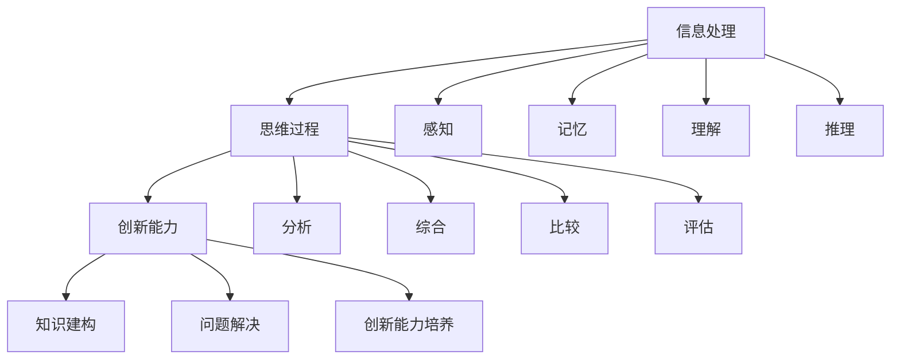

                 

### 文章标题：ChatGPT在教育中的应用：思维链的重要性

**关键词**：ChatGPT，教育，思维链，应用场景，发展趋势

**摘要**：本文探讨了ChatGPT在教育领域中的应用及其重要性。首先，介绍了ChatGPT的定义、核心技术及其在教育中的优势与局限性。接着，阐述了思维链的概念及其在ChatGPT中的应用价值，通过Mermaid流程图展示了核心概念之间的关系。然后，详细讨论了ChatGPT在教育中的多种应用场景，包括教学辅助、学习评估、学生互动和教育资源开发。随后，分析了思维链在实际教育实践中的应用，包括教学设计、学生自主学习和教师专业发展。最后，探讨了ChatGPT与思维链在教育中的发展趋势，以及面临的挑战与应对策略。

### 第1章：ChatGPT简介

#### 1.1 ChatGPT的定义

ChatGPT是由OpenAI开发的一种基于Transformer模型的人工智能聊天机器人，它可以进行自然语言理解和生成，模拟人类的对话过程。ChatGPT的核心技术包括生成对抗网络（GAN）、循环神经网络（RNN）和Transformer模型。通过这些技术，ChatGPT能够处理复杂的对话场景，理解用户的问题并生成连贯、有逻辑的回答。

#### 1.2 ChatGPT的核心技术

- **生成对抗网络（GAN）**：GAN是一种深度学习模型，由生成器和判别器组成。生成器试图生成逼真的数据，而判别器则试图区分生成数据与真实数据。ChatGPT利用GAN来生成高质量的对话文本。

- **循环神经网络（RNN）**：RNN是一种能够处理序列数据的神经网络，适合处理对话中的上下文信息。ChatGPT使用RNN来捕捉对话中的历史信息，从而生成更加连贯的回答。

- **Transformer模型**：Transformer是一种基于自注意力机制的深度学习模型，它在处理长距离依赖和并行计算方面表现出色。ChatGPT使用Transformer模型来实现高效的对话生成。

#### 1.3 ChatGPT的优势与局限性

**优势**：

- **高效的对话生成能力**：ChatGPT能够快速生成连贯、有逻辑的回答，适用于快速响应的场景。
- **广泛的领域知识**：ChatGPT通过训练获得了大量的知识，可以回答各种领域的问题。

**局限性**：

- **事实性错误**：由于训练数据的限制，ChatGPT可能会生成错误或不准确的信息。
- **对复杂问题的理解有限**：对于需要深入思考和复杂推理的问题，ChatGPT的表现可能不佳。

### 第2章：思维链的概念与原理

#### 2.1 思维链的定义

思维链是一种基于信息加工和思维过程的心理模型，它将人的思维活动看作是一种信息处理过程，包括信息的获取、存储、加工和输出。思维链的核心是信息加工和思维过程，通过这些过程，人们能够理解和解决问题。

#### 2.2 思维链的核心要素

思维链的核心要素包括：

- **信息处理**：信息处理是思维链的基础，包括感知、记忆、理解和推理等过程。
- **思维过程**：思维过程是思维链的核心，包括分析、综合、比较和评估等过程。
- **创新能力**：创新能力是思维链的关键，它使人们能够创造新的知识和解决方案。

#### 2.3 思维链在教育中的应用价值

思维链在教育中的应用价值体现在以下几个方面：

- **提高学习效果**：思维链可以帮助学生更好地理解和掌握知识，提高学习效果。
- **促进知识建构**：思维链可以促进学生主动建构知识，形成自己的理解。
- **培养创新能力**：思维链可以培养学生的创新能力，使他们能够提出新的观点和解决方案。

#### 2.4 思维链与ChatGPT的关系

思维链与ChatGPT之间存在密切的关系。ChatGPT作为一种人工智能聊天机器人，其核心任务是模拟人类的对话过程，理解用户的问题并生成回答。而思维链作为一种心理模型，描述了人的思维活动过程，包括信息处理、思维过程和创新能力。因此，ChatGPT在实现对话功能时，可以借鉴思维链的概念和原理，更好地模拟人类的思维过程。

### Mermaid流程图

### 第3章：ChatGPT在教育中的应用场景

#### 3.1 教学辅助

ChatGPT可以应用于教学辅助，为教师和学生提供实时、个性化的支持。

- **教师备课**：ChatGPT可以帮助教师快速生成教学计划和课件，节省备课时间。
- **课堂互动**：ChatGPT可以在课堂上与学生学习互动，回答问题，引导学生思考，提高课堂氛围。

#### 3.2 学习评估

ChatGPT可以用于学习评估，帮助学生和教师了解学习效果。

- **学生成绩评估**：ChatGPT可以分析学生的学习数据，生成个性化的学习报告，为教师提供教学反馈。
- **学业水平测试**：ChatGPT可以模拟考试环境，为学生提供模拟测试，帮助他们熟悉考试形式和题型。

#### 3.3 学生互动

ChatGPT可以促进学生的互动，提高学习参与度。

- **学生交流**：ChatGPT可以为学生提供一个虚拟的学习伙伴，帮助他们解决学习中的问题。
- **个性化辅导**：ChatGPT可以根据学生的学习需求，提供个性化的辅导，帮助他们提高学习效果。

#### 3.4 教育资源开发

ChatGPT可以用于教育资源的开发，提高教育资源的质量和可用性。

- **课程设计**：ChatGPT可以帮助教育工作者快速生成课程计划和教学材料，节省设计时间。
- **教育游戏开发**：ChatGPT可以用于开发教育游戏，提高学生的学习兴趣和参与度。

### 第4章：思维链在教育实践中的应用

#### 4.1 思维链在教学设计中的应用

思维链可以指导教师进行教学设计，提高教学效果。

- **教学目标设定**：思维链可以帮助教师明确教学目标，确保教学活动围绕目标进行。
- **教学策略选择**：思维链可以帮助教师选择合适的教学策略，促进学生的知识建构和创新能力培养。

#### 4.2 思维链在学生自主学习和问题解决中的应用

思维链可以指导学生进行自主学习和问题解决。

- **知识建构**：思维链可以帮助学生主动建构知识，形成自己的理解。
- **问题解决**：思维链可以帮助学生分析问题，提出解决方案，并进行评估和调整。

#### 4.3 思维链在教师专业发展中的应用

思维链可以促进教师的专业发展，提高教学能力。

- **教学反思**：思维链可以帮助教师进行教学反思，发现和解决问题。
- **教学创新**：思维链可以帮助教师进行教学创新，尝试新的教学方法和策略。

### 第5章：ChatGPT与思维链在教育中的发展趋势

#### 5.1 技术发展趋势

随着人工智能技术的不断发展，ChatGPT和思维链在教育中的应用前景十分广阔。

- **技术演进**：ChatGPT和思维链的技术将不断演进，提高其性能和应用范围。
- **多模态交互**：ChatGPT和思维链将支持多模态交互，提高教育体验。

#### 5.2 教育应用前景

ChatGPT和思维链在教育中的应用前景包括：

- **个性化教育**：ChatGPT和思维链将推动个性化教育的发展，满足学生的个性化学习需求。
- **智能化教学**：ChatGPT和思维链将使教学更加智能化，提高教学效率和效果。

#### 5.3 面临的挑战与应对策略

ChatGPT和思维链在教育中应用仍面临一些挑战：

- **数据隐私**：如何保护学生的数据隐私是一个重要问题。
- **教师培训**：如何提高教师的数字化教学能力是一个挑战。

应对策略包括：

- **数据保护**：制定严格的数据保护政策，确保学生数据的安全。
- **教师培训**：开展教师培训，提高他们的数字化教学能力。

### 第6章：案例分析：成功应用ChatGPT与思维链的教育项目

#### 6.1 项目背景

本项目旨在通过ChatGPT和思维链技术，提高学生的学习效果和教师的教学效率。

#### 6.2 项目实施过程

项目实施过程包括以下几个阶段：

1. **需求分析**：分析学生的学习需求和教师的教学需求。
2. **技术选型**：选择合适的ChatGPT和思维链技术。
3. **系统开发**：开发基于ChatGPT和思维链的教育系统。
4. **测试与优化**：对系统进行测试和优化，确保其性能和用户体验。
5. **部署与应用**：将系统部署到教育环境中，并推广应用。

#### 6.3 项目效果评估

项目效果评估包括以下几个方面：

- **学生学习效果**：通过学习成果测试和问卷调查，评估学生的学习效果。
- **教师教学效率**：通过教学评估和课堂观察，评估教师的教学效率。
- **系统满意度**：通过用户满意度调查，评估学生对系统的满意度。

### 第7章：最佳实践 Tips

#### 7.1 教师应用ChatGPT的技巧

- **备课使用ChatGPT**：教师可以利用ChatGPT快速生成教学计划和课件，节省时间。
- **课堂互动使用ChatGPT**：教师可以在课堂上使用ChatGPT与学生互动，提高课堂氛围。

#### 7.2 学生使用思维链的技巧

- **自主构建知识**：学生可以通过思维链自主构建知识，形成自己的理解。
- **问题解决**：学生可以利用思维链进行问题解决，提高解决问题的能力。

#### 7.3 教师专业发展的技巧

- **教学反思**：教师可以通过思维链进行教学反思，发现和解决问题。
- **教学创新**：教师可以通过思维链进行教学创新，尝试新的教学方法和策略。

### 第8章：小结与展望

本文探讨了ChatGPT在教育中的应用及其重要性，介绍了思维链的概念及其在教育实践中的应用。通过案例分析，展示了ChatGPT和思维链在实际教育项目中的应用效果。未来，随着技术的不断发展，ChatGPT和思维链将在教育领域发挥更大的作用。

### 附录

#### 附录1：ChatGPT与思维链相关资源与工具

- **ChatGPT开发工具**：包括Hugging Face、TensorFlow等。
- **思维链应用平台**：包括MindSpore、PyTorch等。
- **教育资源库**：包括国家教育资源公共服务平台、智慧教育平台等。

#### 附录2：参考文献

- **书籍**：《ChatGPT：下一代人工智能对话系统》、《思维链：人工智能的未来》等。
- **论文**：相关的研究论文和专利。
- **网络资源**：相关的研究网站、博客和论坛。

**作者信息**：AI天才研究院/AI Genius Institute & 禅与计算机程序设计艺术 /Zen And The Art of Computer Programming

