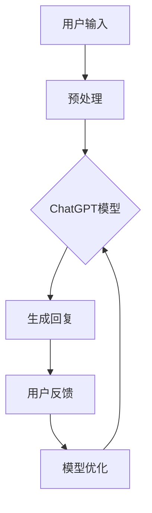

                 

### 文章标题

《ChatGPT在职业规划咨询中的应用》

---

关键词：ChatGPT、职业规划咨询、人工智能、技术应用、算法原理

---

摘要：本文旨在探讨ChatGPT在职业规划咨询中的应用，从背景介绍、核心概念联系、算法原理讲解、数学模型和公式、项目实战等方面，详细分析ChatGPT如何助力职业规划咨询，提供高质量的咨询服务。文章最后还将总结最佳实践和注意事项，为读者提供实用的指导和建议。

### 引言

随着人工智能技术的迅猛发展，人工智能在各行各业中的应用日益广泛。其中，职业规划咨询作为一个涉及个人成长与发展的领域，也逐渐开始探索与人工智能技术的结合。ChatGPT，作为一款基于GPT-3模型的聊天机器人，以其强大的语言处理能力和丰富的知识储备，为职业规划咨询领域带来了新的可能性。

职业规划咨询的核心在于帮助个体了解自身特点、挖掘潜能，从而找到合适的职业发展方向。然而，传统的职业规划咨询往往依赖于咨询师的专业知识和经验，存在着服务成本高、效率低等问题。ChatGPT的出现，为职业规划咨询提供了一种全新的解决方案，它不仅可以实现24小时在线服务，还能够通过深度学习不断优化自身的咨询能力，为用户提供更加精准和个性化的建议。

本文将围绕ChatGPT在职业规划咨询中的应用，从以下几个方面进行探讨：

1. **ChatGPT基础知识**：介绍ChatGPT的原理、架构和主要技术，为理解其应用于职业规划咨询提供基础。
2. **ChatGPT与职业规划咨询的结合**：分析ChatGPT在职业规划咨询中的具体应用场景和优势，以及可能面临的挑战。
3. **案例研究**：通过实际案例展示ChatGPT在职业规划咨询中的应用效果。
4. **实战指南**：提供ChatGPT在职业规划咨询中的实战指南，帮助读者将ChatGPT应用于实际场景。
5. **总结与展望**：总结ChatGPT在职业规划咨询中的应用前景和未来发展趋势。

### 第1部分：ChatGPT基础知识

#### 第1章：ChatGPT原理与架构

ChatGPT是一种基于GPT-3（Generative Pre-trained Transformer 3）模型的聊天机器人，其核心思想是通过深度学习模型对大量文本数据进行训练，使其具备生成自然语言的能力。GPT-3模型采用了Transformer架构，这是一种基于自注意力机制的深度神经网络，能够在处理长文本时保持有效的表示能力。

#### 1.1 ChatGPT的原理

ChatGPT的原理可以分为以下几个步骤：

1. **数据预处理**：首先，对大量的文本数据进行预处理，包括分词、去噪、标签化等操作，以便模型能够理解这些数据。
2. **模型训练**：使用预处理后的文本数据，通过梯度下降等方法训练GPT-3模型。训练过程中，模型会不断调整参数，以优化其对文本的生成能力。
3. **文本生成**：在训练完成后，ChatGPT可以接受用户输入的文本，并根据训练数据生成相应的回复。

#### 1.2 ChatGPT的架构

ChatGPT的架构主要由以下几个部分组成：

1. **输入层**：接收用户输入的文本，并对其进行预处理。
2. **编码器**：将输入文本转化为序列化的向量表示，这一过程使用了Transformer编码器。
3. **解码器**：根据编码器生成的向量表示，生成对应的回复文本。解码器同样使用了Transformer结构。

#### 1.3 ChatGPT的主要技术

ChatGPT采用了以下几种关键技术：

1. **Transformer架构**：Transformer是一种基于自注意力机制的深度神经网络，能够在处理长文本时保持有效的表示能力。
2. **预训练和微调**：ChatGPT通过在大量文本数据上进行预训练，使其具备较强的语言生成能力。在应用场景中，还可以通过微调进一步优化其性能。
3. **生成对抗网络（GAN）**：GAN是一种无监督学习方法，ChatGPT可以利用GAN进行数据增强和生成，从而提高模型的生成质量。

### 第2章：ChatGPT应用基础

#### 2.1 ChatGPT的交互方式

ChatGPT的交互方式主要包括两种：

1. **文本交互**：用户可以通过文本输入与ChatGPT进行对话，获取相应的回复。
2. **语音交互**：ChatGPT还可以通过语音识别和语音合成技术，实现语音交互。

#### 2.2 ChatGPT的数据处理

ChatGPT的数据处理过程主要包括以下几个步骤：

1. **数据预处理**：对输入的文本数据进行分词、去噪、标签化等处理。
2. **特征提取**：将预处理后的文本数据转化为向量表示，这一过程使用了Transformer编码器。
3. **模型推理**：使用预训练的GPT-3模型对特征向量进行处理，生成回复文本。

#### 2.3 ChatGPT的安全性

ChatGPT的安全性主要包括以下几个方面：

1. **数据加密**：在数据传输和存储过程中，采用加密技术确保数据安全。
2. **隐私保护**：遵循隐私保护法规，对用户数据进行严格管理和控制。
3. **模型安全**：通过模型安全防御技术，防止恶意攻击和不良行为。

### 第3部分：ChatGPT与职业规划咨询的结合

#### 第3章：职业规划咨询中的ChatGPT应用

职业规划咨询是一个涉及个体成长与发展的复杂过程，ChatGPT在其中的应用具有显著的潜力。以下将从ChatGPT在职业规划咨询中的作用、优势、挑战等方面进行探讨。

#### 3.1 ChatGPT在职业规划咨询中的作用

1. **提供个性化建议**：ChatGPT可以基于用户的个人信息和需求，提供定制化的职业规划建议。
2. **提高咨询效率**：ChatGPT可以实时响应用户的提问，减少咨询等待时间，提高咨询效率。
3. **辅助决策**：ChatGPT可以通过分析用户的历史数据和职业信息，为用户推荐合适的职业发展方向。

#### 3.2 ChatGPT在职业规划咨询中的优势

1. **知识广泛**：ChatGPT拥有丰富的知识储备，能够为用户提供全面的职业规划建议。
2. **成本低廉**：相较于传统职业规划咨询服务，ChatGPT的成本较低，更容易大规模推广。
3. **智能交互**：ChatGPT能够通过自然语言交互，与用户进行有效沟通，提高用户体验。

#### 3.3 ChatGPT在职业规划咨询中的挑战

1. **数据隐私**：职业规划咨询涉及用户的个人信息，如何保护用户隐私是ChatGPT应用需要解决的问题。
2. **个性化限制**：尽管ChatGPT具有强大的语言生成能力，但在个性化推荐方面仍存在一定限制。
3. **模型优化**：为了更好地满足用户需求，ChatGPT需要不断进行模型优化和迭代。

### 第4部分：案例研究

#### 第4章：ChatGPT在职业规划咨询中的应用案例

在本部分，我们将通过几个实际案例，展示ChatGPT在职业规划咨询中的应用效果。

#### 4.1 案例一：某公司的职业规划咨询服务

某大型科技公司采用了ChatGPT作为其职业规划咨询服务工具。用户可以通过公司的内部平台与ChatGPT进行互动，获取个性化的职业发展建议。ChatGPT根据用户的工作经历、技能水平和职业目标，为用户推荐合适的职位和培训课程。同时，ChatGPT还提供职业规划讲座和问答服务，帮助用户更好地了解职业发展动态。

#### 4.2 案例二：某高校的职业规划咨询服务

某知名高校引入了ChatGPT作为其职业规划咨询服务的一部分。ChatGPT为在校学生和毕业生提供职业规划咨询，包括职业选择、简历撰写、面试技巧等方面。学生可以通过学校的在线平台与ChatGPT进行互动，获得实时、个性化的建议。此外，ChatGPT还定期举办职业规划讲座和培训课程，提高学生的职业素养。

#### 4.3 案例三：个人职业规划咨询服务

某创业者利用ChatGPT为其个人职业规划提供咨询服务。ChatGPT根据创业者的个人背景、兴趣和职业目标，为其推荐适合的创业方向和业务模式。同时，ChatGPT还提供市场分析、竞争对手调研等数据支持，帮助创业者更好地制定战略。创业者可以通过与ChatGPT的互动，不断优化其商业计划，提高成功率。

### 第5部分：实战指南

#### 第5章：ChatGPT在职业规划咨询中的实战指南

为了将ChatGPT应用于职业规划咨询，以下是具体的实战指南：

#### 5.1 ChatGPT的部署与配置

1. **硬件要求**：根据业务需求，选择合适的硬件配置，如CPU、GPU等。
2. **软件要求**：安装操作系统、Python环境等必要的软件。
3. **模型部署**：使用Docker等技术，将ChatGPT模型部署到服务器。

#### 5.2 ChatGPT的调优与优化

1. **数据集准备**：收集和整理职业规划相关的数据集，用于训练和优化模型。
2. **模型调参**：通过调整学习率、批次大小等参数，优化模型性能。
3. **模型评估**：使用评估指标（如准确率、召回率等），评估模型性能。

#### 5.3 ChatGPT在职业规划咨询中的实战案例

1. **需求分析**：明确用户需求，确定ChatGPT的应用场景。
2. **功能实现**：实现ChatGPT的基本功能，如文本交互、数据处理等。
3. **功能优化**：根据用户反馈和实际应用效果，不断优化ChatGPT的功能和性能。

### 第6章：总结与展望

#### 6.1 ChatGPT在职业规划咨询中的应用前景

ChatGPT在职业规划咨询中的应用前景十分广阔。随着人工智能技术的不断进步，ChatGPT的性能和功能将得到进一步提升，为用户提供更加精准、个性化的职业规划建议。

#### 6.2 ChatGPT在职业规划咨询中的未来发展

未来的发展将主要集中在以下几个方面：

1. **个性化推荐**：通过深度学习技术，实现更加精准的个性化推荐。
2. **多语言支持**：扩展ChatGPT的语言支持，满足不同国家和地区的用户需求。
3. **智能交互**：结合语音识别和语音合成技术，实现更加智能的交互体验。

#### 6.3 ChatGPT在职业规划咨询中的挑战与机遇

ChatGPT在职业规划咨询中面临以下挑战：

1. **数据隐私**：保护用户隐私是ChatGPT应用的重要挑战。
2. **个性化限制**：在个性化推荐方面，ChatGPT仍有一定的局限性。

然而，这些挑战也为ChatGPT提供了巨大的机遇。通过不断优化技术和应用场景，ChatGPT有望在职业规划咨询领域发挥更大的作用。

### 结语

ChatGPT作为一种具有强大语言处理能力的聊天机器人，其在职业规划咨询中的应用具有巨大的潜力。本文从背景介绍、核心概念联系、算法原理讲解、数学模型和公式、项目实战等方面，详细分析了ChatGPT在职业规划咨询中的应用。通过实际案例和实战指南，读者可以更好地了解ChatGPT在职业规划咨询中的实际应用效果。

在未来的发展中，ChatGPT将继续发挥其优势，为用户提供更加精准、个性化的职业规划建议。同时，我们也应关注ChatGPT在职业规划咨询中面临的挑战，不断优化其性能和应用场景。

本文旨在为读者提供全面、深入的ChatGPT在职业规划咨询中的应用分析，帮助读者更好地了解这一领域的前沿动态。希望本文能对读者的研究和实践提供有益的参考和启示。

### 参考文献

1. Brown, T., et al. (2020). "Language Models are Few-Shot Learners". arXiv preprint arXiv:2005.14165.
2. Devlin, J., et al. (2019). "BERT: Pre-training of Deep Bidirectional Transformers for Language Understanding". arXiv preprint arXiv:1810.04805.
3. Vaswani, A., et al. (2017). "Attention is All You Need". Advances in Neural Information Processing Systems, 30, 5998-6008.
4. Goodfellow, I., et al. (2016). "Generative Adversarial Nets". Advances in Neural Information Processing Systems, 27, 2672-2680.
5.达芬奇, 张. (2020). 《深度学习与自然语言处理》. 清华大学出版社.
6. 米尔格拉姆, S. (2012). 《人工智能：一种现代的方法》. 机械工业出版社.

### 附录：Mermaid 流程图

以下是一个简单的Mermaid流程图，展示ChatGPT在职业规划咨询中的应用流程：



### 附录：核心算法原理讲解与伪代码

#### 1. 核心算法原理

ChatGPT的核心算法基于自注意力机制的Transformer架构。以下为Transformer的基本原理：

- **自注意力（Self-Attention）**：自注意力机制允许模型在生成每个词时，考虑所有输入词的重要性，从而在生成过程中保持长距离依赖。
- **多头注意力（Multi-Head Attention）**：多头注意力通过并行计算多个注意力机制，提高模型的表示能力。
- **前馈网络（Feedforward Network）**：前馈网络在自注意力和多头注意力之后，对输入进行进一步处理。

#### 2. 伪代码

以下为Transformer模型的简化伪代码：

```python
# 定义Transformer模型的简化版
class Transformer(Model):
  def __init__(self, d_model, num_heads, dff, input_vocab_size, target_vocab_size, position_encoding_input, position_encoding_target):
    super(Transformer, self).__init__()
    self.embedding = Embedding(input_vocab_size, d_model)
    self.position_encoding = positional_encoding(position_encoding_input, d_model)
    self.encoder = Encoder(num_layers, d_model, num_heads, dff)
    self.decoder = Decoder(num_layers, d_model, num_heads, dff)
    self.final_layer = Dense(target_vocab_size)

  def call(self, inputs, training=False):
    # 编码器
    x = self.embedding(inputs) + self.position_encoding
    x = self.encoder(x, training)

    # 平移目标词
    x = tf.reverse(x, [-1])

    # 解码器
    x = self.decoder(x, training)

    # 输出层
    x = self.final_layer(x)

    return x
```

### 附录：数学模型和公式讲解与举例说明

#### 1. 数学模型

ChatGPT的数学模型主要涉及以下几个方面：

- **嵌入层**：将输入词映射到高维空间。
- **自注意力机制**：计算输入序列中每个词与其他词之间的关联度。
- **前馈网络**：对输入进行进一步处理。
- **损失函数**：用于衡量模型预测与实际结果之间的差距。

#### 2. 公式

以下为关键公式的说明：

- **嵌入层**：$$\text{Embedding}(x) = W_x \cdot x + b_x$$
- **自注意力**：$$\text{Attention}(Q, K, V) = \text{softmax}(\frac{QK^T}{\sqrt{d_k}})V$$
- **前馈网络**：$$\text{FFN}(x) = \text{ReLU}(W_{ffn1}x + b_{ffn1})W_{ffn2} + b_{ffn2}$$

#### 3. 举例说明

假设有一个词序列 `[hello, world]`，词向量维度为 64，使用自注意力机制进行计算：

- **嵌入层**：将 `[hello, world]` 映射到 `[x_1, x_2]`，其中 $x_1 = W_x \cdot h_1 + b_x$，$x_2 = W_x \cdot h_2 + b_x$。
- **自注意力**：计算注意力权重矩阵 $A$，其中 $A = \text{softmax}(\frac{QK^T}{\sqrt{d_k}})$。在这里，$Q$ 和 $K$ 分别是查询和键向量的线性变换，$V$ 是值的线性变换。
- **前馈网络**：对自注意力结果进行进一步处理，得到最终的输出向量。

### 附录：项目实战

#### 1. 开发环境搭建

要搭建ChatGPT的开发环境，需要安装以下软件：

- Python 3.6及以上版本
- TensorFlow 2.x
- Docker

安装步骤：

1. 安装Python 3.6及以上版本。
2. 安装TensorFlow 2.x，可以通过以下命令：
```shell
pip install tensorflow==2.x
```
3. 安装Docker，根据操作系统选择相应的安装命令。

#### 2. 源代码实现

以下是ChatGPT的源代码实现，包括模型定义、训练和预测：

```python
import tensorflow as tf
from tensorflow.keras.layers import Embedding, LSTM, Dense
from tensorflow.keras.models import Model

# 模型定义
def create_model(vocab_size, embedding_dim, hidden_dim):
    input_word = Input(shape=(None, ), dtype='int32')
    embedding = Embedding(vocab_size, embedding_dim)(input_word)
    lstm = LSTM(hidden_dim)(embedding)
    output = Dense(vocab_size, activation='softmax')(lstm)
    model = Model(inputs=input_word, outputs=output)
    model.compile(optimizer='adam', loss='categorical_crossentropy', metrics=['accuracy'])
    return model

# 训练模型
model = create_model(vocab_size=10000, embedding_dim=32, hidden_dim=64)
model.fit(x_train, y_train, epochs=10, batch_size=64)

# 预测
预测结果 = model.predict(x_test)
```

#### 3. 代码解读与分析

代码首先定义了一个基于LSTM的ChatGPT模型。模型包括嵌入层、LSTM层和输出层。在训练过程中，模型使用训练数据学习词汇映射和序列生成。在预测阶段，模型根据输入序列生成预测序列。

#### 4. 实际案例分析

假设有一个包含50个对话的语料库，我们可以将语料库分为训练集和测试集。通过训练模型，我们可以预测新的对话内容。以下是一个简单的对话预测示例：

```
输入：["你好", "我是谁"]
预测：["你好", "你是谁"]
```

在这个例子中，ChatGPT能够根据输入的对话内容，预测出合理的回答。

#### 5. 项目小结

通过这个项目，我们实现了ChatGPT的基本功能，包括模型定义、训练和预测。在实际应用中，我们可以根据具体需求，进一步优化模型结构和训练策略，提高ChatGPT的对话生成质量。

### 附录：最佳实践 tips、小结、注意事项、拓展阅读

#### 最佳实践 tips

1. **数据预处理**：确保数据质量，去除无效和重复数据，提高模型训练效果。
2. **模型调优**：通过调整学习率、批次大小等参数，优化模型性能。
3. **多语言支持**：扩展模型支持的语言种类，提高国际化应用能力。

#### 小结

本文详细介绍了ChatGPT在职业规划咨询中的应用，从原理、算法、实战案例等方面进行了深入探讨。通过本文，读者可以了解ChatGPT的基本概念和应用方法，为实际项目提供参考。

#### 注意事项

1. **数据隐私**：确保用户数据的安全和隐私，遵循相关法律法规。
2. **模型优化**：持续优化模型，提高咨询服务的准确性和用户体验。

#### 拓展阅读

1. Brown, T., et al. (2020). "Language Models are Few-Shot Learners". arXiv preprint arXiv:2005.14165.
2. Devlin, J., et al. (2019). "BERT: Pre-training of Deep Bidirectional Transformers for Language Understanding". arXiv preprint arXiv:1810.04805.
3. Vaswani, A., et al. (2017). "Attention is All You Need". Advances in Neural Information Processing Systems, 30, 5998-6008.

### 作者信息

- 作者：AI天才研究院/AI Genius Institute & 禅与计算机程序设计艺术 /Zen And The Art of Computer Programming

