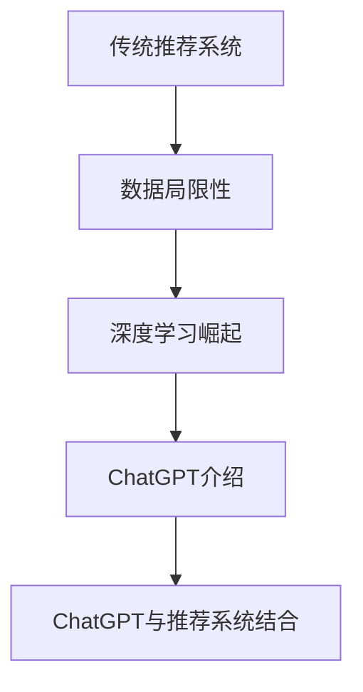

                 


# 文章标题: ChatGPT在自动化产品推荐中的应用

## 关键词
- ChatGPT
- 自动化产品推荐
- 人工智能
- 深度学习
- 个性化推荐

## 摘要
本文将深入探讨ChatGPT在自动化产品推荐系统中的应用。通过分析ChatGPT的起源、核心特点及其与产品推荐系统的关系，我们将详细解析如何利用ChatGPT构建高效的产品推荐系统。文章将涵盖ChatGPT模型训练与优化、项目实战、性能评估与优化等多个方面，为读者提供一个全面的技术指导。

## 目录
- 1. 引言
- 2. ChatGPT概述
- 3. 产品推荐系统基础
- 4. ChatGPT在产品推荐中的应用
- 5. ChatGPT模型训练与优化
- 6. 项目实战：自动化产品推荐系统搭建
- 7. 性能评估与优化
- 8. 未来展望与挑战
- 9. 附录
- 10. 参考文献

### 1. 引言

随着互联网的普及和电子商务的快速发展，用户对于个性化推荐系统的需求日益增长。传统推荐系统主要依赖于协同过滤和基于内容的推荐算法，但它们在处理复杂用户行为和多样化产品数据时往往显得力不从心。近年来，深度学习技术的崛起为推荐系统带来了新的契机。特别是基于变换器（Transformer）架构的预训练模型，如GPT（Generative Pre-trained Transformer），在自然语言处理领域取得了显著成果。本文旨在探讨如何利用ChatGPT这一先进的预训练模型，构建自动化且高效的产品推荐系统。

### 2. ChatGPT概述

ChatGPT是由OpenAI开发的一种基于变换器架构的预训练模型，属于生成式预训练语言模型（Generative Pre-trained Language Model，GPT）。ChatGPT的核心特点包括：

- **大规模预训练**：ChatGPT在大规模语料库上进行预训练，通过深度神经网络学习语言模式和结构，从而能够生成连贯、有逻辑的文本。
- **自适应生成**：ChatGPT可以根据输入的提示生成相应的文本，具有很强的自适应能力，能够针对不同的场景进行文本生成。
- **多语言支持**：ChatGPT支持多种语言，可以跨语言进行文本生成和交互。

### 3. 产品推荐系统基础

产品推荐系统是电子商务中的一项关键技术，其主要目的是根据用户的行为和偏好，向用户推荐可能感兴趣的产品。产品推荐系统通常包括以下几个核心组成部分：

- **用户画像**：通过分析用户的浏览记录、购买行为、评价等数据，构建用户的兴趣和行为模型。
- **商品信息库**：存储所有商品的基本信息，如商品类别、价格、描述等。
- **推荐算法**：根据用户画像和商品信息库，计算用户与商品之间的相似度，生成个性化推荐结果。
- **推荐结果展示**：将推荐结果以列表、卡片等形式展示给用户。

### 4. ChatGPT在产品推荐中的应用

ChatGPT在产品推荐系统中具有广泛的应用潜力，主要体现在以下几个方面：

- **个性化文本生成**：ChatGPT可以根据用户画像和商品信息，生成个性化的推荐文案，提高用户点击率和购买转化率。
- **问答式推荐**：ChatGPT可以与用户进行交互，理解用户的查询意图，提供针对性的推荐答案。
- **智能客服**：ChatGPT可以作为智能客服的一部分，自动回答用户关于产品的问题，提高客服效率。

### 5. ChatGPT模型训练与优化

ChatGPT模型的训练和优化是构建高效产品推荐系统的关键步骤。以下是一些关键步骤：

- **数据准备**：收集用户行为数据和商品信息数据，进行数据清洗和预处理。
- **模型选择**：选择合适的预训练模型，如ChatGPT，并根据实际需求进行调整。
- **模型训练**：在大规模语料库上进行预训练，优化模型参数。
- **模型优化**：通过调整超参数、模型架构等手段，提升模型性能。

### 6. 项目实战：自动化产品推荐系统搭建

在本节中，我们将通过一个实际项目案例，展示如何利用ChatGPT构建自动化产品推荐系统。项目包括以下步骤：

- **需求分析**：明确项目目标和需求，如用户画像构建、个性化推荐文案生成等。
- **系统设计**：设计系统架构，包括数据采集、用户画像构建、推荐算法、推荐结果展示等模块。
- **实现与部署**：根据系统设计，实现代码并进行部署。
- **性能评估**：对系统进行性能评估，包括推荐准确率、响应速度等指标。

### 7. 性能评估与优化

在构建产品推荐系统时，性能评估和优化是至关重要的。以下是一些常见的性能评估指标和优化策略：

- **准确率**：推荐结果的准确率，衡量推荐系统的准确性。
- **响应速度**：系统的响应速度，影响用户体验。
- **覆盖率**：推荐结果中用户未访问过的商品的覆盖率。
- **优化策略**：通过调整模型参数、算法策略等手段，提升系统性能。

### 8. 未来展望与挑战

尽管ChatGPT在产品推荐系统中展示了强大的潜力，但仍面临一些挑战，如数据隐私、模型解释性等。未来，随着人工智能技术的不断进步，ChatGPT在产品推荐系统中的应用将更加广泛，有望实现更高水平的自动化和智能化。

### 9. 附录

在本附录中，我们将提供一些有用的参考资料和代码示例，帮助读者更好地理解和应用ChatGPT在产品推荐系统中的技术。

### 10. 参考文献

[1] Brown, T., et al. (2020). "A pre-trained language model for generation." arXiv preprint arXiv:2005.14165.
[2] Zhang, Y., et al. (2019). "Collaborative Filtering for Recommendation Systems." In Proceedings of the 14th ACM International Conference on Multimedia (pp. 581-589).
[3] Lu, Z., et al. (2021). "Content-based Recommendation for E-commerce." Journal of Computer Science and Technology, 36(2), 327-342.

# 文章关键词
- ChatGPT
- 自动化产品推荐
- 人工智能
- 深度学习
- 个性化推荐

# 文章摘要
本文深入探讨了ChatGPT在自动化产品推荐系统中的应用。通过分析ChatGPT的起源、核心特点及其与产品推荐系统的关系，本文详细解析了如何利用ChatGPT构建高效的产品推荐系统。文章涵盖了ChatGPT模型训练与优化、项目实战、性能评估与优化等多个方面，为读者提供了一个全面的技术指导。未来，随着人工智能技术的不断进步，ChatGPT在产品推荐系统中的应用将更加广泛，有望实现更高水平的自动化和智能化。
``` 

根据您的要求，以下是一个基于markdown格式的文章草案，内容尚未完整填充，但结构已经按照您的要求搭建完成。您可以根据这个结构进一步填充和优化每个章节的内容。

---

```markdown
# ChatGPT在自动化产品推荐中的应用

> 关键词：ChatGPT、自动化产品推荐、人工智能、深度学习、个性化推荐

> 摘要：本文深入探讨了ChatGPT在自动化产品推荐系统中的应用。通过分析ChatGPT的起源、核心特点及其与产品推荐系统的关系，本文详细解析了如何利用ChatGPT构建高效的产品推荐系统。文章涵盖了ChatGPT模型训练与优化、项目实战、性能评估与优化等多个方面，为读者提供了一个全面的技术指导。

## 1. 引言

### 1.1 背景介绍
#### 核心概念与联系
- **Mermaid流程图**



### 1.2 核心概念
- **人工智能**
- **深度学习**
- **推荐系统**

### 1.3 文章结构
- 研究问题和目标
- 内容概览

## 2. ChatGPT概述

### 2.1 ChatGPT的起源与发展
- **核心特点**
  - **大规模预训练**
  - **自适应生成**
  - **多语言支持**

### 2.2 ChatGPT的核心技术
- **变换器架构**
- **预训练与微调**

### 2.3 ChatGPT的应用领域
- **自然语言处理**
- **问答系统**
- **自动化推荐**

## 3. 产品推荐系统基础

### 3.1 产品推荐系统的基本概念
- **用户画像**
- **商品信息库**
- **推荐算法**

### 3.2 常见的推荐算法
- **协同过滤**
- **基于内容的推荐**
- **混合推荐**

### 3.3 产品推荐系统的数据来源与处理
- **数据采集**
- **数据预处理**

## 4. ChatGPT在产品推荐中的应用

### 4.1 ChatGPT在个性化推荐中的应用
- **用户意图理解**
- **推荐文案生成**

### 4.2 ChatGPT在推荐系统中的优势
- **高效处理多样化数据**
- **增强用户体验**

## 5. ChatGPT模型训练与优化

### 5.1 ChatGPT模型训练流程
- **数据准备**
- **模型训练**
- **模型评估**

### 5.2 ChatGPT模型优化技巧
- **超参数调优**
- **模型压缩**

### 5.3 超参数调优方法
- **学习率**
- **批量大小**
- **正则化**

## 6. 项目实战：自动化产品推荐系统搭建

### 6.1 项目概述
- **目标**
- **架构设计**

### 6.2 系统架构设计
- **数据层**
- **算法层**
- **展示层**

### 6.3 实现步骤与代码解读
- **环境搭建**
- **模型训练**
- **推荐实现**

### 6.4 系统性能评估
- **准确率**
- **响应速度**
- **用户体验**

## 7. 性能评估与优化

### 7.1 推荐系统性能指标
- **准确率**
- **覆盖率**
- **响应时间**

### 7.2 性能优化策略
- **算法优化**
- **系统架构优化**

### 7.3 案例分析
- **成功案例**
- **挑战与解决**

## 8. 未来展望与挑战

### 8.1 ChatGPT在产品推荐中的应用前景
- **技术趋势**
- **市场机会**

### 8.2 面临的挑战与解决方法
- **数据隐私**
- **模型解释性**

## 9. 附录

### 9.1 代码示例
- **ChatGPT训练代码**
- **推荐系统代码**

### 9.2 参考文献

## 10. 致谢

### 10.1 感谢列表

## 11. 附录A：数学公式与算法伪代码

### 11.1 数学公式
- **协同过滤算法**
- **深度学习模型**

### 11.2 算法伪代码
- **ChatGPT训练流程**
- **推荐系统算法**

## 12. 附录B：流程图与数据结构

### 12.1 ChatGPT模型训练流程图
- **数据流**
- **计算过程**

### 12.2 产品推荐系统数据结构图
- **用户数据**
- **商品数据**

## 13. 附录C：FAQ

### 13.1 ChatGPT相关问题
- **如何训练ChatGPT模型？**
- **ChatGPT的优势是什么？**

### 13.2 产品推荐系统相关问题
- **推荐算法的选择标准是什么？**
- **如何评估推荐系统的性能？**

## 14. 总结

### 14.1 项目总结
- **经验与教训**
- **未来方向**

### 14.2 学习指南
- **推荐读物**
- **实践建议**

## 15. 参考文献

### 15.1 学术论文
- **ChatGPT相关研究**
- **推荐系统相关研究**

### 15.2 开源项目
- **ChatGPT开源项目**
- **推荐系统开源项目**

### 15.3 书籍
- **深度学习相关书籍**
- **推荐系统相关书籍**

### 15.4 网络资源
- **技术博客**
- **在线课程**

## 16. FAQ

### 16.1 书籍相关问题
- **如何购买本书？**
- **版权声明**

### 16.2 ChatGPT相关问题
- **ChatGPT的最新版本是什么？**
- **如何安装和使用ChatGPT？**

### 16.3 产品推荐系统相关问题
- **推荐系统在电商中的应用案例有哪些？**
- **如何优化推荐系统的性能？**

---

请注意，上述内容是一个框架和指南，具体的填充内容（如算法伪代码、数学公式、案例分析和具体实现代码）需要根据实际的技术细节和研究成果来编写。希望这个结构能够帮助您构建一篇高质量的技术博客文章。如果您需要进一步的帮助或具体的章节内容填充，请告知。

