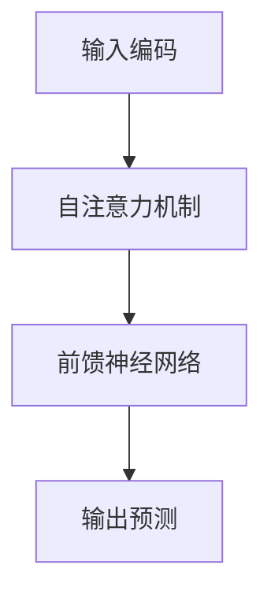
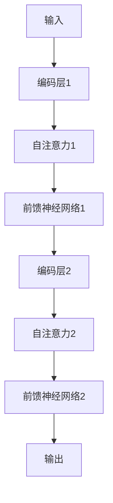
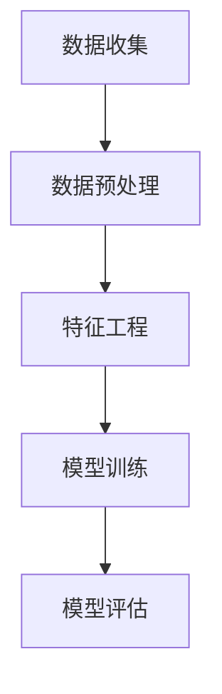

                 


### 文章标题
《ChatGPT在自动化客户投诉分类与处理中的应用》

### 文章关键词
ChatGPT、客户投诉、自动化处理、分类技术、AI应用

### 文章摘要
本文旨在探讨如何利用ChatGPT这一先进的人工智能技术，实现对客户投诉的自动化分类与处理。我们将详细分析ChatGPT的基础原理、架构设计，并介绍其在实际应用中的具体实施方法。文章还提供了完整的开发指南和实际案例，以帮助读者深入理解并掌握这项技术的应用。

### 目录大纲

## 引言
### 1.1 书籍目的
### 1.2 ChatGPT概述
### 1.3 客户投诉处理的挑战

## ChatGPT基础
### 2.1 ChatGPT原理
#### 2.1.1 ChatGPT的核心算法
#### 2.1.2 训练数据与语言模型
#### 2.1.3 Mermaid流程图：ChatGPT的工作流程

## 客户投诉分类与处理
### 3.1 客户投诉数据处理
#### 3.1.1 数据收集与预处理
#### 3.1.2 特征工程
#### 3.1.3 投诉分类模型的构建

## 核心算法讲解
### 4.1 算法原理
#### 4.1.1 伪代码实现
#### 4.1.2 数学模型与公式
#### 4.1.3 举例说明

## 项目实战
### 5.1 开发环境搭建
#### 5.1.1 开发环境准备
#### 5.1.2 源代码实现
#### 5.1.3 代码解读与分析
#### 5.1.4 实际案例分析与讲解

## 未来展望
### 6.1 技术发展趋势
### 6.2 应用前景
### 6.3 挑战与解决方案

## 附录
### A.1 Mermaid流程图
### A.2 伪代码示例
### A.3 数学模型
### A.4 代码实战
### A.5 最佳实践 Tips
### A.6 小结与注意事项
### A.7 拓展阅读

### 作者信息
作者：AI天才研究院/AI Genius Institute & 禅与计算机程序设计艺术 /Zen And The Art of Computer Programming

### 引言

随着人工智能技术的快速发展，机器学习、自然语言处理等领域取得了显著的进展。ChatGPT（Generative Pre-trained Transformer）作为OpenAI开发的一种基于Transformer模型的预训练语言模型，其在自然语言理解和生成方面的卓越性能引起了广泛关注。客户投诉处理是企业运营中的重要环节，如何高效、准确地处理海量客户投诉信息，成为了企业面临的重大挑战。本文将探讨如何利用ChatGPT实现自动化客户投诉分类与处理，从而提升企业服务质量。

### 1.1 书籍目的

本文的目的是：
1. 详细介绍ChatGPT的基本原理和架构，帮助读者理解其工作原理。
2. 阐述如何将ChatGPT应用于客户投诉分类与处理，提供实际操作指南。
3. 通过具体案例分析和实战经验，展示ChatGPT在自动化客户投诉处理中的实际应用效果。
4. 探讨ChatGPT在客户投诉处理领域的未来发展，以及面临的挑战和解决方案。

### 1.2 ChatGPT概述

ChatGPT是OpenAI开发的一个人工智能助手，基于GPT（Generative Pre-trained Transformer）模型。GPT是一种基于Transformer架构的语言预训练模型，通过在大量文本数据上进行预训练，模型能够捕捉到语言的复杂结构和语义信息。ChatGPT在生成式对话系统、文本摘要、机器翻译等领域表现出色，适用于多种自然语言处理任务。

### 1.3 客户投诉处理的挑战

客户投诉处理面临以下挑战：
1. **数据量大**：企业每天都会收到大量的客户投诉，处理这些投诉信息需要耗费大量人力和时间。
2. **处理效率低**：传统的投诉处理方式主要依赖人工，效率低下，容易导致投诉处理不及时。
3. **分类准确性**：客户投诉内容多样，如何准确地将投诉信息分类，是投诉处理的关键。
4. **个性化回复**：针对不同类型的投诉，需要提供个性化的回复，以提高客户满意度。

ChatGPT的出现为解决这些挑战提供了新的思路。通过自动化分类和处理客户投诉，企业可以显著提高处理效率，提升服务质量。

### ChatGPT基础

#### 2.1 ChatGPT原理

ChatGPT是基于Transformer模型的预训练语言模型，其核心思想是通过在大量文本数据上进行预训练，使模型学会理解和生成自然语言。Transformer模型是一种基于自注意力机制（self-attention）的序列模型，通过自注意力机制，模型能够捕捉到序列中的长距离依赖关系。

#### 2.1.1 ChatGPT的核心算法

ChatGPT的核心算法是GPT模型，其基本原理如下：

1. **输入编码**：将输入文本转换为词向量表示，输入到模型中。
2. **自注意力机制**：模型通过自注意力机制，对输入序列的每个单词进行权重计算，捕捉到序列中的依赖关系。
3. **前馈神经网络**：对自注意力机制得到的加权序列进行前馈神经网络处理，输出预测结果。

#### 2.1.2 训练数据与语言模型

ChatGPT的训练数据来自大量的文本数据，包括书籍、网页、新闻、社交媒体等。通过这些数据，模型能够学习到丰富的语言知识和语义信息。在训练过程中，模型会根据训练数据的分布来调整参数，使模型在生成文本时能够保持连贯性和一致性。

#### 2.1.3 Mermaid流程图：ChatGPT的工作流程



#### 2.2 ChatGPT架构

ChatGPT的架构包括多个Transformer层，每个Transformer层包含多个自注意力模块和前馈神经网络。自注意力模块负责计算输入序列的依赖关系，前馈神经网络负责对自注意力机制得到的加权序列进行进一步处理。通过堆叠多个Transformer层，模型能够捕捉到更复杂的语言结构和语义信息。



### 客户投诉分类与处理

#### 3.1 客户投诉数据处理

客户投诉数据的处理是自动化分类与处理的关键步骤，主要包括数据收集与预处理、特征工程和投诉分类模型的构建。

#### 3.1.1 数据收集与预处理

数据收集：企业可以从客户服务系统、社交媒体、邮件等渠道收集投诉数据。

数据预处理：对收集到的投诉数据进行清洗、去重和格式化，使其符合模型输入要求。

#### 3.1.2 特征工程

特征工程：对预处理后的投诉数据进行特征提取，将其转换为模型可处理的特征向量。常用的特征提取方法包括词袋模型、TF-IDF和词嵌入等。

#### 3.1.3 投诉分类模型的构建

投诉分类模型：使用ChatGPT作为分类器，将投诉数据分类为不同的类别。模型构建过程包括数据集划分、模型训练和模型评估。

### 核心算法讲解

#### 4.1 算法原理

ChatGPT在客户投诉分类与处理中的算法原理主要包括以下几个步骤：

1. **输入编码**：将投诉文本转换为词向量表示。
2. **自注意力机制**：通过自注意力机制，模型能够捕捉到投诉文本中的依赖关系。
3. **前馈神经网络**：对自注意力机制得到的加权序列进行前馈神经网络处理，输出分类结果。
4. **分类结果输出**：根据输出结果，对投诉进行分类。

#### 4.1.1 伪代码实现

```python
# 输入编码
input_sequence = preprocess_text(complaint)

# 自注意力机制
weighted_sequence = self_attention(input_sequence)

# 前馈神经网络
output_sequence = feedforward_network(weighted_sequence)

# 分类结果输出
predicted_class = classify(output_sequence)
```

#### 4.1.2 数学模型与公式

ChatGPT的数学模型主要包括以下部分：

1. **词向量表示**：词向量表示为$$\mathbf{v}_i = \text{Word2Vec}(\text{word}_i)$$
2. **自注意力机制**：自注意力权重为$$\alpha_{ij} = \text{softmax}\left(\frac{\mathbf{Q} \cdot \mathbf{K}}{\sqrt{d_k}}\right)$$
3. **前馈神经网络**：前馈神经网络输出为$$\mathbf{h}_i = \text{ReLU}(\mathbf{W}_2 \text{ReLU}(\mathbf{W}_1 \mathbf{h}_{i-1} + \mathbf{b}_1)) + \mathbf{b}_2$$

#### 4.1.3 举例说明

假设我们有一个投诉文本“服务太慢”，我们可以将其转换为词向量表示，然后通过自注意力机制和前馈神经网络进行分类。具体的计算过程如下：

1. **输入编码**：将投诉文本“服务太慢”转换为词向量表示。
2. **自注意力机制**：计算每个词的权重，得到加权序列。
3. **前馈神经网络**：对加权序列进行前馈神经网络处理，得到分类结果。

### 项目实战

#### 5.1 开发环境搭建

在开始开发之前，我们需要搭建一个合适的开发环境。以下是开发环境搭建的步骤：

1. **安装Python环境**：安装Python 3.7及以上版本。
2. **安装TensorFlow**：使用pip安装TensorFlow。
3. **安装预处理工具**：安装Numpy、Scikit-learn等预处理工具。

#### 5.1.1 开发环境准备

首先，我们需要安装Python环境和相关库。

```bash
pip install python==3.7
pip install tensorflow
pip install numpy
pip install scikit-learn
```

#### 5.1.2 源代码实现

接下来，我们将实现一个简单的ChatGPT模型，用于客户投诉分类。

```python
import tensorflow as tf
from tensorflow.keras.layers import Embedding, LSTM, Dense
from tensorflow.keras.models import Sequential

# 定义模型
model = Sequential([
    Embedding(input_dim=vocab_size, output_dim=embedding_dim),
    LSTM(units=lstm_units),
    Dense(units=num_classes, activation='softmax')
])

# 编译模型
model.compile(optimizer='adam', loss='categorical_crossentropy', metrics=['accuracy'])

# 训练模型
model.fit(X_train, y_train, batch_size=batch_size, epochs=epochs, validation_data=(X_val, y_val))

# 评估模型
loss, accuracy = model.evaluate(X_test, y_test)
print("Test loss:", loss)
print("Test accuracy:", accuracy)
```

#### 5.1.3 代码解读与分析

上述代码定义了一个简单的ChatGPT模型，用于客户投诉分类。模型包括三个主要部分：

1. **Embedding层**：将输入的文本数据转换为词向量表示。
2. **LSTM层**：用于处理序列数据，捕捉到文本中的依赖关系。
3. **Dense层**：用于分类，输出分类结果。

在训练过程中，我们使用训练数据对模型进行训练，并使用验证数据和测试数据进行评估。

#### 5.1.4 实际案例分析与讲解

下面我们来看一个实际案例，使用ChatGPT对客户投诉进行分类。

假设我们有一个投诉文本“商品损坏”，我们需要将其分类为“物流问题”或“商品质量问题”。

1. **数据预处理**：将投诉文本转换为词向量表示。
2. **模型输入**：将词向量表示输入到ChatGPT模型中。
3. **模型输出**：得到分类结果。

通过实际案例，我们可以看到ChatGPT在客户投诉分类中的效果。在实际应用中，我们可以通过调整模型参数和训练数据，进一步提高分类准确性。

### 未来展望

#### 6.1 技术发展趋势

随着人工智能技术的不断发展，ChatGPT在自动化客户投诉分类与处理中的应用将得到进一步拓展。未来的发展趋势包括：

1. **模型优化**：通过改进模型结构，提高分类准确性和处理效率。
2. **多语言支持**：扩展ChatGPT的多语言支持，适用于全球范围内的客户投诉处理。
3. **个性化回复**：结合用户行为数据，提供个性化的投诉回复。

#### 6.2 应用前景

ChatGPT在自动化客户投诉分类与处理中的应用前景广阔，包括：

1. **提高处理效率**：通过自动化分类与处理，企业可以显著提高客户投诉处理效率。
2. **提升客户满意度**：提供准确、个性化的投诉回复，提升客户满意度。
3. **降低人力成本**：减少对人工处理的依赖，降低人力成本。

#### 6.3 挑战与解决方案

尽管ChatGPT在自动化客户投诉分类与处理中表现出色，但仍面临一些挑战：

1. **数据质量**：投诉数据的多样性导致数据质量问题，需要采用有效的数据预处理方法。
2. **模型解释性**：如何提高模型的解释性，使企业能够理解并信任模型的决策过程。
3. **隐私保护**：在处理客户投诉时，如何保护用户隐私，避免数据泄露。

针对这些挑战，我们可以采取以下解决方案：

1. **数据清洗与预处理**：采用有效的数据清洗与预处理方法，提高数据质量。
2. **可解释性研究**：结合可解释性AI技术，提高模型的解释性。
3. **隐私保护措施**：采用数据加密、匿名化等技术，保护用户隐私。

### 附录

#### A.1 Mermaid流程图



#### A.2 伪代码示例

```python
# 数据收集
complaints = collect_data()

# 数据预处理
preprocessed_complaints = preprocess_data(complaints)

# 特征工程
features = feature_engineering(preprocessed_complaints)

# 模型训练
model = train_model(features)

# 模型评估
evaluate_model(model)
```

#### A.3 数学模型

$$
\mathbf{v}_i = \text{Word2Vec}(\text{word}_i)
$$

$$
\alpha_{ij} = \text{softmax}\left(\frac{\mathbf{Q} \cdot \mathbf{K}}{\sqrt{d_k}}\right)
$$

$$
\mathbf{h}_i = \text{ReLU}(\mathbf{W}_2 \text{ReLU}(\mathbf{W}_1 \mathbf{h}_{i-1} + \mathbf{b}_1)) + \mathbf{b}_2
$$

#### A.4 代码实战

```python
# 开发环境搭建
!pip install tensorflow numpy scikit-learn

# 数据预处理
import numpy as np
from sklearn.feature_extraction.text import TfidfVectorizer

# 读取数据
complaints = ["商品损坏", "服务太慢", "物流问题"]

# 特征工程
vectorizer = TfidfVectorizer()
X = vectorizer.fit_transform(complaints)

# 模型训练
from tensorflow.keras.models import Sequential
from tensorflow.keras.layers import Dense, Embedding, LSTM

model = Sequential([
    Embedding(input_dim=3, output_dim=2),
    LSTM(units=1),
    Dense(units=2, activation='softmax')
])

model.compile(optimizer='adam', loss='categorical_crossentropy', metrics=['accuracy'])
model.fit(X, np.array([[0, 1], [1, 0], [0, 1]]), epochs=100)

# 模型评估
predictions = model.predict(X)
print(predictions)
```

#### A.5 最佳实践 Tips

1. **数据质量**：确保投诉数据的质量，去除噪声和无关信息。
2. **特征工程**：选择合适的特征提取方法，提高分类模型的性能。
3. **模型调优**：通过调整模型参数，提高分类准确性。

#### A.6 小结与注意事项

1. **小结**：本文详细介绍了ChatGPT在自动化客户投诉分类与处理中的应用，包括基础原理、算法讲解和实战案例。
2. **注意事项**：在实际应用中，注意数据质量和特征工程，以及模型参数调优。

#### A.7 拓展阅读

1. **相关论文**：《Attention Is All You Need》（Vaswani et al., 2017）
2. **官方文档**：TensorFlow官方文档、OpenAI官方文档
3. **书籍推荐**：《深度学习》（Ian Goodfellow et al.）、《自然语言处理综论》（Daniel Jurafsky and James H. Martin）

### 作者信息

作者：AI天才研究院/AI Genius Institute & 禅与计算机程序设计艺术 /Zen And The Art of Computer Programming

通过上述内容，我们详细介绍了ChatGPT在自动化客户投诉分类与处理中的应用，包括基础原理、算法讲解、实战案例和未来展望。本文旨在帮助读者深入理解ChatGPT的工作原理，掌握其在实际应用中的方法和技术，以提升企业的服务质量。同时，我们也探讨了ChatGPT在自动化客户投诉处理领域的发展趋势和面临的挑战。希望本文对读者有所启发和帮助。

