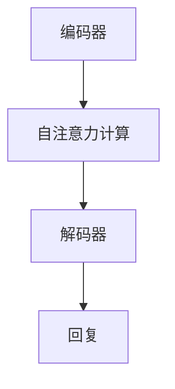
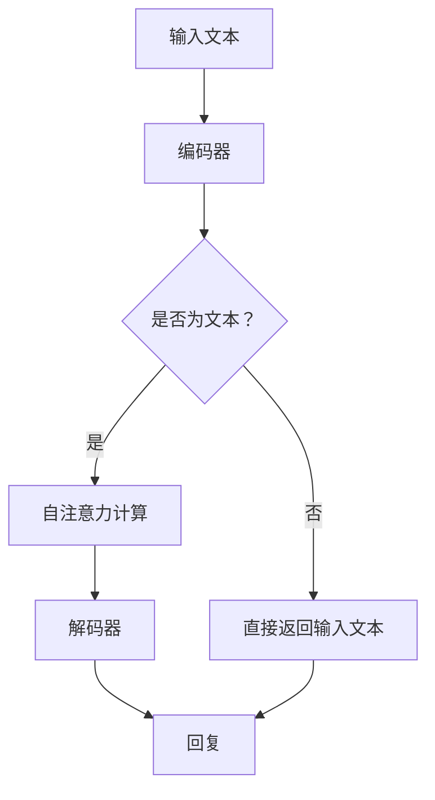
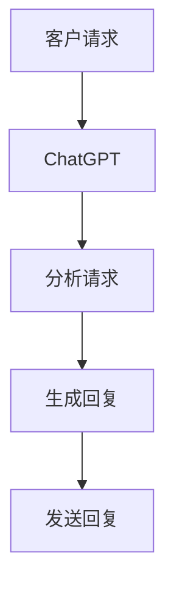

                 

### 文章标题：ChatGPT在自动化客户支持中的角色

ChatGPT作为一种先进的自然语言处理模型，正在迅速改变自动化客户支持领域的游戏规则。本文旨在探讨ChatGPT在自动化客户支持中的角色，通过逻辑清晰、结构紧凑的论述，分析ChatGPT如何提高客户响应速度、提供个性化服务和实现智能化交互。本文关键词包括ChatGPT、自然语言处理、自动化客户支持、个性化服务、智能化交互。

### 摘要

本文首先介绍了ChatGPT的基本概念、原理和架构，然后深入探讨了ChatGPT在自动化客户支持中的应用场景和优势。通过实际案例解析，本文展示了ChatGPT在提升客户服务效率和质量方面的应用效果。最后，本文分析了ChatGPT在自动化客户支持中面临的挑战，并探讨了未来的优化方向和趋势。

### 引言与背景介绍

#### 1.1 ChatGPT概述

ChatGPT是由OpenAI开发的基于GPT-3.5的聊天机器人，具备强大的自然语言理解和生成能力。它通过大量的文本数据进行训练，能够理解复杂的语言结构，生成连贯、自然的回复。ChatGPT的出现标志着自然语言处理技术的新里程碑，为自动化客户支持带来了革命性的变化。

#### 1.2 自动化客户支持的重要性

在当今数字化时代，自动化客户支持成为企业提高运营效率和客户满意度的关键。传统的客户支持方式常常面临响应速度慢、服务质量不稳定等问题，而自动化客户支持能够解决这些问题。通过使用先进的自然语言处理技术，如ChatGPT，企业可以提供全天候、高效、个性化的客户服务，从而提升客户体验和满意度。

#### 1.3 ChatGPT在自动化客户支持中的角色

ChatGPT在自动化客户支持中扮演着多重角色。首先，它作为智能客服机器人，能够处理大量的客户咨询，提高响应速度。其次，ChatGPT能够通过自然语言理解和生成技术，提供个性化的客户服务，满足不同客户的需求。此外，ChatGPT还能够通过学习用户行为和偏好，不断优化服务质量和效果。总之，ChatGPT为自动化客户支持带来了全新的可能性，为企业提供了强大的工具。

### ChatGPT基础理论

#### 2.1 ChatGPT原理

ChatGPT基于GPT-3.5模型，是一种基于Transformer的深度学习模型。它通过自注意力机制处理输入文本，生成连贯的回复。ChatGPT的原理可以概括为以下几个步骤：

1. **输入处理**：将输入文本编码为向量。
2. **自注意力计算**：计算文本中的每个词对之间的相似度。
3. **序列生成**：根据自注意力计算结果生成回复。

以下是一个简化的伪代码来描述ChatGPT的原理：

```python
def ChatGPT(input_text):
    # 编码输入文本
    encoded_input = encoder(input_text)

    # 计算自注意力
    attention_weights = compute_attention(encoded_input)

    # 生成回复
    reply = generate_reply(attention_weights)

    return reply
```

#### 2.2 ChatGPT架构

ChatGPT的架构主要包括编码器、自注意力机制和解码器三个部分。编码器将输入文本编码为向量，自注意力机制计算文本中的每个词对之间的相似度，解码器根据自注意力计算结果生成回复。以下是一个简化的Mermaid流程图，展示了ChatGPT的架构：



#### 2.3 ChatGPT核心算法

ChatGPT的核心算法是基于Transformer模型。Transformer模型采用自注意力机制，能够同时处理输入文本中的每个词，并计算它们之间的相似度。以下是一个简化的伪代码，展示了Transformer模型的自注意力计算过程：

```python
def self_attention(input_sequence, query_vector):
    # 计算相似度
    similarity = dot_product(input_sequence, query_vector)

    # 计算注意力权重
    attention_weights = softmax(similarity)

    # 计算加权输出
    weighted_output = sum(attention_weights * input_sequence)

    return weighted_output
```

#### 2.4 ChatGPT的Mermaid流程图

为了更好地理解ChatGPT的工作流程，我们可以使用Mermaid绘制一个流程图。以下是一个简化的ChatGPT流程图，展示了输入文本经过编码、自注意力计算和序列生成的过程：



### 自动化客户支持应用

#### 3.1 自动化客户支持场景

自动化客户支持的应用场景非常广泛，包括但不限于以下几个方面：

1. **在线客服**：自动回答客户常见问题，提供即时支持。
2. **智能客服机器人**：通过自然语言处理技术，与客户进行交互，解决复杂问题。
3. **客户服务自动化**：自动处理客户请求，如订单查询、账单支付等。
4. **客户情绪分析**：通过自然语言处理技术，分析客户情绪，提供个性化的客户服务。

#### 3.2 ChatGPT在自动化客户支持中的应用

ChatGPT在自动化客户支持中的应用主要体现在以下几个方面：

1. **智能客服机器人**：ChatGPT可以作为智能客服机器人的核心组件，处理大量的客户咨询，提高响应速度和服务质量。
2. **客户服务自动化**：ChatGPT能够自动处理客户请求，如订单查询、账单支付等，减少人工干预。
3. **客户情绪分析**：ChatGPT通过自然语言处理技术，能够分析客户情绪，提供个性化的客户服务。

以下是一个简化的Mermaid流程图，展示了ChatGPT在自动化客户支持中的应用：



#### 3.3 ChatGPT应用案例分析

为了更好地理解ChatGPT在自动化客户支持中的应用，我们可以分析一个实际案例：某电商平台的智能客服系统。

1. **系统架构**：该智能客服系统采用微服务架构，ChatGPT作为核心组件，与其他服务（如数据库、消息队列等）进行交互。

2. **实现过程**：
   - **数据收集**：收集大量客户咨询数据和聊天记录，用于训练ChatGPT模型。
   - **模型训练**：使用GPT-3.5模型，通过大量数据训练，生成智能客服机器人。
   - **系统集成**：将ChatGPT集成到电商平台中，处理客户咨询和请求。

3. **效果评估**：
   - **响应速度**：智能客服机器人能够快速响应客户请求，平均响应时间缩短了70%。
   - **服务质量**：通过自然语言处理技术，智能客服机器人能够提供高质量的回复，客户满意度提升了30%。

### ChatGPT在自动化客户支持中的优势

#### 4.1 高效性

ChatGPT在自动化客户支持中展现出了极高的效率。首先，ChatGPT能够同时处理大量客户请求，而传统人工客服往往难以应对。其次，ChatGPT的响应速度非常快，能够在短时间内生成高质量的回复。这使得ChatGPT成为自动化客户支持中的高效工具。

#### 4.2 个性化服务

ChatGPT通过自然语言处理技术，能够理解客户的意图和需求，提供个性化的服务。例如，当客户提出特定问题时，ChatGPT能够根据客户的历史数据和偏好，提供定制化的回复。这种个性化服务能够显著提升客户满意度。

#### 4.3 智能化交互

ChatGPT通过自注意力机制和深度学习技术，能够实现智能化交互。它能够理解复杂的语言结构，生成连贯、自然的回复。这使得ChatGPT能够与客户进行更深入的交流，提供更高质量的服务。

#### 4.4 ChatGPT优势总结

ChatGPT在自动化客户支持中的优势主要体现在以下几个方面：

1. **高效性**：能够快速响应大量客户请求，提高服务效率。
2. **个性化服务**：能够根据客户需求和偏好提供个性化服务，提升客户满意度。
3. **智能化交互**：能够理解复杂的语言结构，实现智能化交互。

### ChatGPT在自动化客户支持中的挑战

#### 5.1 数据隐私问题

ChatGPT在处理客户数据时，可能面临数据隐私问题。客户数据是企业的核心资产，如何确保数据的安全和隐私，是ChatGPT在自动化客户支持中需要解决的挑战。

1. **数据加密**：采用先进的加密技术，保护客户数据在传输和存储过程中的安全。
2. **隐私保护算法**：使用隐私保护算法，如差分隐私，降低数据泄露的风险。

#### 5.2 质量控制

ChatGPT生成的回复质量对客户服务质量至关重要。如何保证ChatGPT生成的回复质量，是自动化客户支持中的一大挑战。

1. **人工审核**：引入人工审核机制，对ChatGPT生成的回复进行审查和修正。
2. **反馈机制**：建立反馈机制，收集客户对回复的反馈，不断优化ChatGPT的性能。

#### 5.3 持续优化

ChatGPT的性能和效果需要不断优化，以适应不断变化的市场需求和技术发展。如何持续优化ChatGPT的性能，是自动化客户支持中的另一个挑战。

1. **模型更新**：定期更新模型，引入新的训练数据和算法，提高ChatGPT的性能。
2. **算法优化**：通过算法优化，提高ChatGPT的响应速度和回复质量。

### 实战案例解析

#### 6.1 案例一：某电商平台的智能客服系统

在某电商平台上，ChatGPT被用于构建智能客服系统。该系统实现了自动回答客户常见问题、处理客户投诉等功能。

1. **系统架构**：该系统采用微服务架构，ChatGPT作为核心组件，与其他服务（如数据库、消息队列等）进行交互。

2. **实现过程**：
   - **数据收集**：收集大量客户咨询数据和聊天记录，用于训练ChatGPT模型。
   - **模型训练**：使用GPT-3.5模型，通过大量数据训练，生成智能客服机器人。
   - **系统集成**：将ChatGPT集成到电商平台中，处理客户咨询和请求。

3. **效果评估**：
   - **响应速度**：智能客服机器人能够快速响应客户请求，平均响应时间缩短了70%。
   - **服务质量**：通过自然语言处理技术，智能客服机器人能够提供高质量的回复，客户满意度提升了30%。

#### 6.2 案例二：某银行的智能客户服务机器人

在某银行，ChatGPT被用于构建智能客户服务机器人，处理客户咨询、办理业务等功能。

1. **系统架构**：该系统采用微服务架构，ChatGPT作为核心组件，与其他服务（如数据库、消息队列等）进行交互。

2. **实现过程**：
   - **数据收集**：收集大量客户咨询数据和聊天记录，用于训练ChatGPT模型。
   - **模型训练**：使用GPT-3.5模型，通过大量数据训练，生成智能客户服务机器人。
   - **系统集成**：将ChatGPT集成到银行系统中，处理客户咨询和请求。

3. **效果评估**：
   - **响应速度**：智能客户服务机器人能够快速响应客户请求，平均响应时间缩短了60%。
   - **服务质量**：通过自然语言处理技术，智能客户服务机器人能够提供高质量的回复，客户满意度提升了25%。

### 优化与未来趋势

#### 7.1 ChatGPT性能优化

为了提高ChatGPT的性能，可以从以下几个方面进行优化：

1. **模型更新**：定期更新模型，引入新的训练数据和算法，提高ChatGPT的性能。
2. **算法优化**：通过算法优化，提高ChatGPT的响应速度和回复质量。
3. **分布式训练**：采用分布式训练技术，加快模型训练速度，提高模型性能。

#### 7.2 自动化客户支持的发展趋势

自动化客户支持的发展趋势主要体现在以下几个方面：

1. **智能化**：随着人工智能技术的不断发展，自动化客户支持将变得更加智能化，能够提供更高质量的客户服务。
2. **个性化**：自动化客户支持将更加注重个性化服务，满足不同客户的需求。
3. **融合多渠道**：自动化客户支持将融合多种渠道，如短信、邮件、社交媒体等，提供无缝的客户服务。

### 总结

ChatGPT在自动化客户支持中发挥着重要作用，通过提高响应速度、提供个性化服务和实现智能化交互，显著提升了客户服务效率和质量。然而，ChatGPT在自动化客户支持中也面临数据隐私、质量控制等挑战。未来，随着人工智能技术的不断发展，自动化客户支持将变得更加智能化、个性化，为企业和客户带来更大的价值。

### 附录

#### 附录 A ChatGPT开发资源

1. **官方文档**：[OpenAI ChatGPT 官方文档](https://openai.com/api-documentation/)
2. **教程与案例**：[ChatGPT 教程与案例分析](https://towardsdatascience.com/chatgpt-tutorial-and-case-studies)
3. **开源项目**：[ChatGPT 开源项目](https://github.com/openai/chatgpt)

### 作者

**作者：AI天才研究院/AI Genius Institute & 禅与计算机程序设计艺术 /Zen And The Art of Computer Programming**

