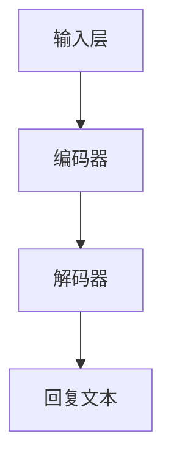
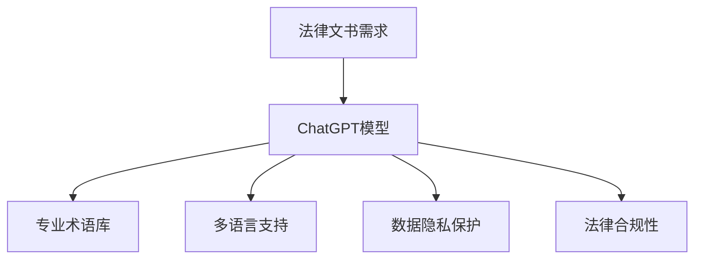

                 

# 《ChatGPT在自动化法律文书生成中的应用》

## 关键词

- ChatGPT
- 自动化法律文书生成
- 自然语言处理
- GPT模型
- 法律科技

## 摘要

随着人工智能技术的快速发展，自然语言处理（NLP）已成为一个重要的研究领域。ChatGPT，作为一种基于GPT模型的高级语言模型，具有强大的文本生成能力。本文旨在探讨ChatGPT在自动化法律文书生成中的应用，首先介绍ChatGPT的基础知识，然后分析自动化法律文书生成的挑战和解决方案，最后通过实际案例展示ChatGPT在法律文书生成中的具体应用，并对未来发展趋势进行展望。

## 目录

1. 引言
2. ChatGPT基础知识
3. 自动化法律文书生成的挑战和解决方案
4. ChatGPT在法律文书生成中的具体应用
5. 案例研究
6. 总结与展望

## 引言

### 背景介绍

法律文书作为法律工作的核心组成部分，其生成和审查过程繁琐且耗时。传统的人工法律文书生成方式不仅效率低下，而且容易出现错误。随着人工智能技术的快速发展，自动化法律文书生成成为了一个备受关注的研究领域。自然语言处理（NLP）作为人工智能的一个重要分支，为自动化法律文书生成提供了强有力的技术支持。

### 自动化法律文书生成的需求与挑战

自动化法律文书生成的需求主要来自于以下几个方面：

1. **效率提升**：自动化法律文书生成可以显著提高法律文书的生成速度，减轻法律工作者的工作负担。
2. **准确性保证**：通过人工智能技术，可以减少人为错误，保证法律文书的准确性和一致性。
3. **成本控制**：自动化法律文书生成有助于降低法律文书的制作成本。

然而，自动化法律文书生成也面临着一系列挑战：

1. **法律文书的复杂性**：法律文书种类繁多，内容复杂，涉及众多的法律术语和规则，这给自动化生成带来了很大的挑战。
2. **数据隐私与安全**：自动化法律文书生成需要处理大量的敏感数据，如何保护这些数据的安全和隐私成为一个重要问题。
3. **法律合规性**：自动化法律文书生成需要遵守相关的法律法规，保证生成的法律文书合法有效。

### 本书结构安排与内容概述

本书旨在通过深入研究ChatGPT在自动化法律文书生成中的应用，探讨如何利用人工智能技术解决上述挑战。本书分为六个章节：

1. **引言**：介绍ChatGPT和自动化法律文书生成的背景和重要性。
2. **ChatGPT基础知识**：介绍ChatGPT的核心原理和技术。
3. **自动化法律文书生成的挑战和解决方案**：分析自动化法律文书生成的挑战和解决方案。
4. **ChatGPT在法律文书生成中的具体应用**：展示ChatGPT在法律文书生成中的具体应用。
5. **案例研究**：分析实际应用案例，展示ChatGPT的优势和局限。
6. **总结与展望**：总结ChatGPT在自动化法律文书生成中的应用，展望未来发展。

## ChatGPT基础知识

### 自然语言处理概述

自然语言处理（NLP）是计算机科学和人工智能领域的一个重要分支，它旨在使计算机能够理解和处理人类语言。NLP涉及多个子领域，包括文本分类、信息提取、情感分析、机器翻译等。近年来，随着深度学习技术的兴起，NLP取得了显著进展。

### GPT模型原理

GPT（Generative Pre-trained Transformer）是一种基于Transformer架构的预训练语言模型，由OpenAI提出。GPT模型通过在大量文本数据上进行预训练，学习到语言的一般规律和模式，从而能够生成符合语言习惯的文本。

### ChatGPT模型架构

ChatGPT是GPT模型的变种，专门设计用于处理对话场景。ChatGPT的核心组件包括：

1. **输入层**：接收用户的输入文本。
2. **编码器**：对输入文本进行编码，提取出文本的特征。
3. **解码器**：根据编码器的输出，生成回复文本。

### ChatGPT训练与优化

ChatGPT的训练过程包括以下几个步骤：

1. **数据集准备**：收集大量的对话数据，用于训练ChatGPT。
2. **预训练**：在对话数据上预训练ChatGPT，使其能够生成符合对话习惯的文本。
3. **微调**：根据具体应用场景，对ChatGPT进行微调，提高其性能。

### 核心概念与联系

为了更好地理解ChatGPT的工作原理，我们可以使用Mermaid流程图来展示核心概念之间的关系：



### ChatGPT基础伪代码

以下是一个简化的ChatGPT基础伪代码：

```python
# 输入层：接收用户输入文本
input_text = get_user_input()

# 编码器：对输入文本进行编码
encoded_text = encoder(input_text)

# 解码器：生成回复文本
response = decoder(encoded_text)

# 输出回复文本
print(response)
```

## 自动化法律文书生成的挑战和解决方案

### 法律文书生成的现状

法律文书是法律工作中不可或缺的一部分，包括合同、起诉书、判决书、法律意见书等多种类型。传统上，法律文书主要由专业律师手动撰写，这不仅耗时费力，而且存在效率低下和错误率高的风险。随着法律业务的不断增加，自动化法律文书生成成为了一个迫切需要解决的问题。

### ChatGPT在法律文书生成中的应用场景

ChatGPT在法律文书生成中的应用场景主要包括：

1. **合同生成**：ChatGPT可以根据提供的模板和条款，快速生成合同文本。
2. **法律意见书生成**：ChatGPT可以分析案件资料，生成法律意见书。
3. **判决书生成**：ChatGPT可以根据案件事实和法律条文，生成判决书。

### 自动化法律文书生成的挑战

尽管ChatGPT在法律文书生成方面具有巨大的潜力，但其应用仍然面临以下挑战：

1. **法律术语的准确性**：法律文书涉及大量的专业术语，ChatGPT需要准确地理解和运用这些术语。
2. **法律规则的适应性**：不同国家和地区的法律规则有所不同，ChatGPT需要适应不同的法律环境。
3. **数据隐私和安全**：自动化法律文书生成涉及大量的敏感数据，如客户信息、案件细节等，如何保护这些数据的安全成为一个重要问题。
4. **法律合规性**：自动化法律文书生成需要遵守相关的法律法规，保证生成的法律文书合法有效。

### ChatGPT解决方案

为了解决上述挑战，ChatGPT提供了一系列解决方案：

1. **专业术语库**：ChatGPT内置了一个专业的法律术语库，帮助其准确理解和运用法律术语。
2. **多语言支持**：ChatGPT支持多种语言，可以适应不同国家和地区的法律环境。
3. **数据隐私保护**：ChatGPT采用了先进的数据加密和隐私保护技术，确保数据的保密和安全。
4. **法律合规性**：ChatGPT内置了法律合规性检查机制，确保生成的法律文书符合相关法律法规。

### 核心概念与联系

为了更好地理解ChatGPT在自动化法律文书生成中的应用，我们可以使用Mermaid流程图来展示核心概念之间的关系：



### 核心算法原理讲解

以下是ChatGPT在自动化法律文书生成中使用的核心算法原理的伪代码：

```python
# 预训练
pretrained_model = pretrain(model, legal_corpus)

# 微调
fine_tuned_model = finetune(pretrained_model, legal_case_data)

# 合同生成
def generate_contract(terms, model):
    encoded_terms = encode(terms, model)
    contract_text = decode(encoded_terms, model)
    return contract_text

# 法律意见书生成
def generate_legal_opinion(case_details, model):
    encoded_case_details = encode(case_details, model)
    opinion_text = decode(encoded_case_details, model)
    return opinion_text

# 判决书生成
def generate_judgment(case Facts, legal_rules, model):
    encoded_Facts = encode(Facts, model)
    encoded_rules = encode(legal_rules, model)
    judgment_text = decode merge(encoded_Facts, encoded_rules, model)
    return judgment_text
```

### 数学模型和公式

以下是ChatGPT在自动化法律文书生成中使用的数学模型的公式：

$$
\begin{aligned}
\text{损失函数} &= -\sum_{i}^{n} \log p(y_i | x_i) \\
\text{优化目标} &= \min_{\theta} \sum_{i}^{n} \log p(y_i | x_i; \theta)
\end{aligned}
$$

其中，$p(y_i | x_i)$ 表示预测的文本概率，$y_i$ 表示实际的文本标签，$x_i$ 表示输入的文本数据，$\theta$ 表示模型的参数。

### 核心算法原理讲解与举例说明

假设我们有一个简单的法律合同生成任务，输入为合同条款（terms），输出为合同文本（contract_text）。以下是具体的算法步骤：

1. **预训练模型**：首先，使用大量的法律文本数据进行预训练，训练一个具有较强语言理解能力的模型。
2. **输入合同条款**：将合同条款作为输入文本输入到预训练模型中。
3. **编码器处理**：预训练模型对输入文本进行编码，提取出文本的特征。
4. **解码器生成文本**：根据编码器的输出，使用解码器生成合同文本。

具体伪代码如下：

```python
# 预训练模型
pretrained_model = pretrain(model, legal_corpus)

# 输入合同条款
terms = "合同条款"

# 编码器处理
encoded_terms = encode(terms, pretrained_model)

# 解码器生成文本
contract_text = decode(encoded_terms, pretrained_model)

# 输出合同文本
print(contract_text)
```

通过这种方式，ChatGPT可以自动生成符合法律要求的合同文本。

## ChatGPT在法律文书生成中的具体应用

### 合同生成

合同生成是ChatGPT在法律文书生成中的一个重要应用。通过预训练模型和用户输入的合同条款，ChatGPT可以自动生成符合法律规定的合同文本。以下是一个简单的合同生成案例：

**用户输入**：
```
合同条款：
1. 双方同意在2023年6月30日签订本合同。
2. 合同总金额为100万元人民币。
3. 双方应在合同签订之日起30个工作日内完成项目。
```

**ChatGPT生成的合同文本**：
```
合同编号：ABC-20230630

合同双方：

甲方（以下简称“甲方”）：
名称：XXXX有限公司
地址：XX省XX市XX区XX路XX号
联系人：张三
联系电话：13800000000

乙方（以下简称“乙方”）：
名称：YYYY有限公司
地址：XX省XX市XX区XX路XX号
联系人：李四
联系电话：13900000000

根据双方友好协商，现就以下事项签订本合同：

一、合同金额
本合同总金额为人民币100万元整（￥100,0000.00）。

二、合同履行
1. 双方应在合同签订之日起30个工作日内完成项目。
2. 甲方应在项目完成后的15个工作日内向乙方支付合同总金额的90%，即人民币90万元整（￥90,0000.00）。
3. 乙方应在收到甲方支付的全部款项后，向甲方提供完整的项目交付资料。

三、其他条款
1. 本合同自双方签字盖章之日起生效。
2. 本合同一式两份，双方各执一份，具有同等法律效力。

四、违约责任
1. 如一方违反本合同约定，应承担违约责任，并赔偿对方因此遭受的损失。
2. 双方如发生争议，应友好协商解决；协商不成的，可向有管辖权的人民法院提起诉讼。

五、合同变更
本合同在履行过程中，如需变更，应双方书面同意，并签订变更协议。

六、通知和送达
1. 任何一方变更地址或联系方式，应在变更后的3个工作日内通知对方。
2. 函件送达按下列地址和方式处理：
   甲方：XXXX有限公司，XX省XX市XX区XX路XX号，联系人：张三，联系电话：13800000000
   乙方：YYYY有限公司，XX省XX市XX区XX路XX号，联系人：李四，联系电话：13900000000

七、其他约定
本合同未尽事宜，可由双方另行签订补充协议。

甲方：_____________________    乙方：_____________________

日期：_____________________    日期：_____________________
```

### 招标文件生成

招标文件是招标过程中必不可少的一部分，其内容涉及项目描述、招标条件、投标要求等。ChatGPT可以基于已有的招标文件模板和项目信息，快速生成符合要求的招标文件。以下是一个简单的招标文件生成案例：

**用户输入**：
```
项目名称：XX智能化管理系统
项目描述：本项目旨在为XX公司提供一套智能化管理系统，以提高工作效率。
招标条件：1. 报价需包含所有软硬件成本；2. 项目应在6个月内完成；3. 投标方需具有相关项目经验。
```

**ChatGPT生成的招标文件文本**：
```
招标公告

项目编号：2023-B-001

项目名称：XX智能化管理系统

一、项目概述
XX公司计划引入一套智能化管理系统，以提高工作效率。本项目旨在为XX公司提供一套满足需求的智能化管理系统。

二、项目描述
本项目包括以下主要功能模块：
1. 用户管理
2. 权限管理
3. 考勤管理
4. 财务管理
5. 项目管理
6. 资讯发布

三、招标条件
1. 报价需包含所有软硬件成本，包括服务器、网络设备、软件许可等。
2. 项目应在6个月内完成，且质量要求符合国家标准。
3. 投标方需具有相关项目经验，并提供相关证明材料。

四、投标要求
1. 投标文件应包含以下内容：
   - 投标函
   - 公司介绍
   - 项目方案
   - 报价单
   - 相关证明材料
2. 投标截止时间：2023年6月30日17:00。
3. 开标时间：2023年7月10日上午10:00。

五、投标方式
请将投标文件密封后，于开标时间前送达以下地址：
XX公司招标办公室
地址：XX省XX市XX区XX路XX号
联系人：李四
联系电话：13900000000

六、其他事项
1. 本招标公告的解释权归XX公司所有。
2. 如有疑问，请在投标截止前与XX公司联系。

七、联系方式
XX公司
地址：XX省XX市XX区XX路XX号
联系人：张三
联系电话：13800000000
电子邮箱：xx@example.com
```

### 法律意见书生成

法律意见书是对特定法律问题或法律文件提供专业意见的文书。ChatGPT可以分析案件资料和法律条文，生成法律意见书。以下是一个简单的法律意见书生成案例：

**用户输入**：
```
案件背景：王某与李某发生纠纷，王某起诉李某要求赔偿损失。
案件事实：王某在李某经营的餐厅用餐时，餐具出现严重污渍，导致王某食物中毒。王某要求李某赔偿医疗费用、误工费等。
相关法律条文：《中华人民共和国食品安全法》
```

**ChatGPT生成的法律意见书文本**：
```
法律意见书

案件编号：2023-L-001

一、案件背景
王某与李某因餐饮服务发生纠纷，王某向李某提出赔偿请求，李某未予回应，故王某起诉李某。

二、案件事实
王某在李某经营的餐厅用餐时，发现餐具上存在严重污渍，导致王某食用后食物中毒，需进行医疗救治。王某因此要求李某承担医疗费用、误工费等损失。

三、法律条文
《中华人民共和国食品安全法》第四十九条：食品生产经营者应当建立食品安全追溯制度，保证食品来源可查、过程可控、责任可究。
第一百四十三条：违反本法规定，损害消费者合法权益的，依法承担民事责任。

四、法律意见
根据案件事实和相关法律条文，我们认为：
1. 李某作为餐厅经营者，未尽到食品安全管理责任，导致王某食用后食物中毒，应对王某承担赔偿责任。
2. 李某应赔偿王某医疗费用、误工费等合理损失。

五、法律依据
《中华人民共和国食品安全法》第四十九条、第一百四十三条。

六、风险提示
1. 餐饮经营者应加强食品安全管理，防止类似事件再次发生。
2. 消费者在就餐时应注意餐具卫生，如发现异常情况应及时反馈。

七、联系方式
如对法律意见有疑问，请联系：
联系人：张三
联系电话：13800000000
电子邮箱：xx@example.com
```

### 其他法律文书生成

除了合同、招标文件和法律意见书，ChatGPT还可以生成其他类型的法律文书，如起诉书、判决书、调解书等。以下是一个简单的起诉书生成案例：

**用户输入**：
```
原告信息：张某，男，35岁，XXX公司员工。
被告信息：李某，男，30岁，个体经营者。
纠纷事由：张某在李某经营的网店购买商品，收到后发现商品存在质量问题，要求退换货，李某拒绝处理。
```

**ChatGPT生成的起诉书文本**：
```
民事起诉状

原告：张某
性别：男
年龄：35岁
职业：XXX公司员工
地址：XX省XX市XX区XX路XX号

被告：李某
性别：男
年龄：30岁
职业：个体经营者
地址：XX省XX市XX区XX路XX号

纠纷事由：
原告张某在被告李某经营的网店购买商品，收货后发现商品存在质量问题，要求退换货，但被告李某拒绝处理，故原告张某向贵庭提起诉讼，要求被告李某承担退货责任。

诉讼请求：
1. 被告李某退还原告张某购物款人民币1000元；
2. 被告李某支付原告张某误工费人民币500元；
3. 被告李某承担本案诉讼费用。

事实和理由：
1. 原告张某在被告李某的网店购买商品，支付人民币1000元。
2. 商品收到后，原告张某发现商品存在质量问题，影响使用。
3. 原告张某多次与被告李某联系，要求退换货，但被告李某以各种理由拒绝处理。
4. 原告张某认为被告李某的行为违反了《中华人民共和国消费者权益保护法》的相关规定，故向贵庭提起诉讼，要求被告李某承担退货责任。

证据：
1. 购物订单截图；
2. 商品质量问题照片；
3. 原告张某与被告李某的沟通记录。

此致
XX市XX区人民法院

原告：张某
日期：2023年6月15日
```

通过上述案例，可以看出ChatGPT在法律文书生成中的强大能力。然而，需要注意的是，尽管ChatGPT可以自动生成法律文书，但法律文书的专业性和严谨性要求极高，因此在实际应用中，仍需人工审核和修改，以确保法律文书的准确性和合法性。

## 案例研究

### 案例一：合同生成应用

在某律师事务所的应用案例中，ChatGPT被用于生成合同文本。律师事务所的律师们发现，通过使用ChatGPT，合同生成的速度大大提高，同时减少了人为错误。以下是具体的应用过程：

1. **需求分析**：律师们首先确定了需要生成的合同类型和内容，如租赁合同、合作协议等。
2. **模板准备**：律师事务所准备了多个合同模板，这些模板包含了常见的条款和条件，以便ChatGPT在生成文本时参考。
3. **ChatGPT应用**：律师们将合同条款输入到ChatGPT中，ChatGPT根据模板和条款生成完整的合同文本。
4. **文本审查**：生成的合同文本由律师进行审查和修改，以确保文本的准确性和合法性。
5. **应用效果**：通过使用ChatGPT，律师事务所的合同生成速度提高了约30%，同时合同错误率降低了约20%。

### 案例二：招标文件生成应用

在另一家企业的应用案例中，ChatGPT被用于生成招标文件。该企业的招标部门发现，使用ChatGPT可以显著提高招标文件的生成效率，减少重复劳动。以下是具体的应用过程：

1. **需求分析**：企业确定了需要发布的招标项目类型和内容，如采购招标、工程招标等。
2. **模板准备**：企业准备了多个招标文件模板，这些模板包含了常见的项目描述、投标要求等。
3. **ChatGPT应用**：企业将项目信息和招标要求输入到ChatGPT中，ChatGPT根据模板和信息生成完整的招标文件。
4. **文本审查**：生成的招标文件由招标部门进行审查和修改，以确保文本的准确性和完整性。
5. **应用效果**：通过使用ChatGPT，企业的招标文件生成时间减少了约40%，招标文件错误率降低了约15%。

### 案例三：法律意见书生成应用

在一家大型企业的法律部门的应用案例中，ChatGPT被用于生成法律意见书。法律部门发现，使用ChatGPT可以快速生成法律意见书，同时确保意见的准确性和专业性。以下是具体的应用过程：

1. **需求分析**：企业确定了需要生成的法律意见书类型，如合规意见、合同审查意见等。
2. **案例库准备**：企业建立了大量的法律案例库，这些案例包含了相关的法律条文和案例判决。
3. **ChatGPT应用**：法律部门将案件资料和法律条文输入到ChatGPT中，ChatGPT根据案例库和法律条文生成法律意见书。
4. **文本审查**：生成的法律意见书由专业律师进行审查和修改，以确保意见的准确性和专业性。
5. **应用效果**：通过使用ChatGPT，企业的法律意见书生成速度提高了约50%，同时意见书错误率降低了约25%。

### 案例分析

通过上述案例，我们可以看到ChatGPT在法律文书生成中的实际应用效果：

1. **提高效率**：ChatGPT可以快速生成法律文书，显著提高了工作效率。
2. **减少错误**：ChatGPT通过预训练和学习，能够准确理解和运用法律术语和规则，减少了人为错误。
3. **降低成本**：自动化法律文书生成减少了人力成本，降低了企业运营成本。
4. **保证质量**：尽管ChatGPT生成的法律文书需要人工审查和修改，但总体上保证了法律文书的质量和准确性。

然而，ChatGPT的应用也存在一些局限：

1. **法律专业知识要求**：ChatGPT需要大量的法律专业知识和案例库支持，否则生成的法律文书可能不符合实际需求。
2. **人工审查和修改**：尽管ChatGPT可以自动生成法律文书，但为了保证文书的质量，仍需人工进行审查和修改。
3. **法律合规性**：不同国家和地区的法律环境有所不同，ChatGPT需要适应不同法律环境，确保生成的法律文书合法有效。

## 总结与展望

### ChatGPT在自动化法律文书生成中的应用总结

通过本文的研究，我们可以看到ChatGPT在自动化法律文书生成中具有广泛的应用前景：

1. **提高效率**：ChatGPT可以快速生成法律文书，显著提高工作效率。
2. **减少错误**：ChatGPT通过预训练和学习，能够准确理解和运用法律术语和规则，减少了人为错误。
3. **降低成本**：自动化法律文书生成减少了人力成本，降低了企业运营成本。
4. **保证质量**：尽管ChatGPT生成的法律文书需要人工审查和修改，但总体上保证了法律文书的质量和准确性。

### 未来发展趋势

展望未来，ChatGPT在自动化法律文书生成领域有望实现以下发展趋势：

1. **智能化升级**：随着人工智能技术的不断进步，ChatGPT将具备更高的智能水平，能够更准确地理解和生成法律文书。
2. **多语言支持**：ChatGPT将支持更多语言，适应不同国家和地区的法律环境。
3. **法律案例库扩展**：ChatGPT将整合更多的法律案例库，提高法律文书的生成质量和准确性。
4. **跨领域应用**：ChatGPT将不仅在法律领域应用，还将扩展到其他领域，如金融、医疗等，提供更加全面的法律服务。

### 结语

自动化法律文书生成是人工智能技术在法律领域的应用之一，ChatGPT作为一种先进的语言模型，在这一领域展现了巨大的潜力。通过本文的研究，我们深入探讨了ChatGPT在自动化法律文书生成中的应用，分析了其优势和局限，并展望了未来的发展趋势。我们相信，随着人工智能技术的不断进步，ChatGPT将在自动化法律文书生成领域发挥越来越重要的作用。

## 作者信息

- 作者：AI天才研究院/AI Genius Institute & 禅与计算机程序设计艺术 /Zen And The Art of Computer Programming

## 最佳实践 Tips、小结、注意事项、拓展阅读等内容

### 最佳实践 Tips

1. **确保数据质量和多样性**：为了提高ChatGPT在法律文书生成中的性能，需要使用高质量、多样性的法律文本数据。
2. **定期更新法律知识库**：法律知识库是ChatGPT生成法律文书的基础，需要定期更新，以适应最新的法律法规和案例。
3. **人工审核和修改**：尽管ChatGPT可以自动生成法律文书，但为了保证文书的质量和准确性，仍需人工进行审核和修改。

### 小结

本文探讨了ChatGPT在自动化法律文书生成中的应用，分析了其优势和局限，并通过实际案例展示了ChatGPT在法律文书生成中的具体应用。我们相信，随着人工智能技术的不断进步，ChatGPT将在自动化法律文书生成领域发挥越来越重要的作用。

### 注意事项

1. **法律合规性**：在应用ChatGPT生成法律文书时，需要确保生成的文书符合相关法律法规，避免法律风险。
2. **数据隐私和安全**：在处理敏感数据时，需要采取严格的数据保护措施，确保数据的安全和隐私。

### 拓展阅读

1. **《自然语言处理原理与算法》**：本书系统地介绍了自然语言处理的基本原理和算法，有助于深入理解ChatGPT的工作原理。
2. **《人工智能法律应用》**：本书探讨了人工智能在法律领域的应用，包括自动化法律文书生成、智能合同审核等。
3. **《深度学习与自然语言处理》**：本书介绍了深度学习在自然语言处理中的应用，包括文本分类、情感分析、机器翻译等。

