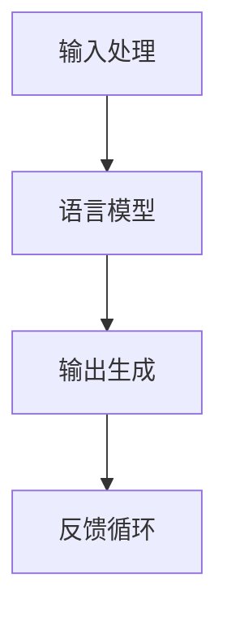
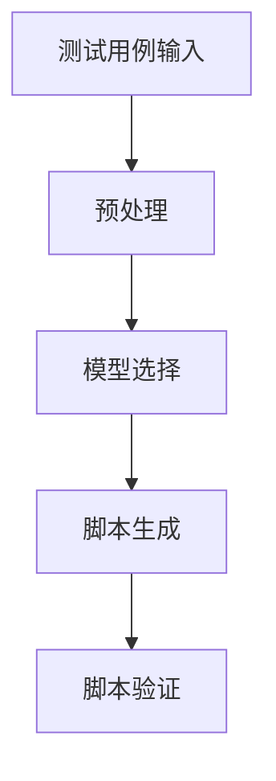

                 


为了撰写一篇高质量的技术博客文章，我们需要遵循以下步骤：

### 1. 确定文章结构

首先，我们需要为文章制定一个清晰的结构，确保文章内容有条理，读者可以轻松理解。根据目录大纲，我们可以将文章分为以下几个主要部分：

- 引言：简要介绍ChatGPT和自动化测试的概念，激发读者的兴趣。
- 基础知识：介绍ChatGPT和自动化测试的基本原理和关联。
- 技术实现：详细讲解ChatGPT在自动化测试脚本生成中的应用和实现流程。
- 应用场景：分析ChatGPT在自动化测试中的具体应用场景。
- 未来发展趋势：探讨ChatGPT在自动化测试领域的未来发展方向。
- 总结与展望：总结文章内容，展望ChatGPT在自动化测试中的应用前景。

### 2. 引言

在文章的开头，我们可以简要介绍ChatGPT和自动化测试的概念，让读者对文章主题有一个初步了解。

```markdown
# 引言

随着人工智能技术的飞速发展，自然语言处理（NLP）技术在各个领域得到了广泛应用。ChatGPT作为OpenAI推出的一款基于GPT-3模型的人工智能助手，以其强大的文本生成能力受到了广泛关注。自动化测试是软件工程中不可或缺的一环，旨在提高软件质量，降低成本。本文将探讨ChatGPT在自动化测试脚本生成中的应用，为自动化测试领域带来新的发展机遇。
```

### 3. 基础知识

接下来，我们可以详细介绍ChatGPT和自动化测试的基本原理，帮助读者建立知识框架。

#### 3.1 ChatGPT介绍

- **核心概念与联系**：使用Mermaid流程图展示ChatGPT的基本架构。
- **核心算法原理讲解**：使用伪代码详细阐述ChatGPT的工作原理。

```markdown
## 3.1 ChatGPT介绍

### 核心概念与联系



### 核心算法原理讲解

```python
# 伪代码：ChatGPT输入处理流程
def process_input(input_text):
    processed_text = preprocess_text(input_text)
    model_output = language_model(processed_text)
    output_text = generate_output(model_output)
    return output_text

# 伪代码：生成自动化测试脚本
def generate_test_script(test_case):
    test_script = ChatGPT.generate(test_case)
    return test_script
```
```

#### 3.2 自动化测试基础

- **数学模型和数学公式**：介绍自动化测试脚本生成的数学模型。
- **详细讲解与举例说明**：如何根据测试用例和测试环境参数生成测试脚本。

```markdown
## 3.2 自动化测试基础

### 数学模型和数学公式

$$ 
\text{测试脚本} = f(\text{测试用例}, \text{测试环境参数})
$$

### 详细讲解与举例说明

如何根据测试用例和测试环境参数生成测试脚本，将在后续章节详细讲解。
```

### 4. 技术实现

在这一部分，我们将深入探讨ChatGPT在自动化测试脚本生成中的应用，包括模型选择、训练、脚本生成流程等。

#### 4.1 ChatGPT模型选择与训练

- **核心算法原理讲解**：如何选择合适的ChatGPT模型并进行训练。

```markdown
## 4.1 ChatGPT模型选择与训练

### 核心算法原理讲解

如何选择合适的ChatGPT模型并进行训练，将在本章详细讲解。
```

#### 4.2 自动化测试脚本生成流程

- **核心概念与联系**：使用Mermaid流程图展示脚本生成流程。
- **详细讲解**：脚本生成流程的具体步骤。

```markdown
## 4.2 自动化测试脚本生成流程

### 核心概念与联系



### 详细讲解

自动化测试脚本生成流程的具体步骤如下：
```

#### 4.3 脚本生成性能优化

- **数学模型和数学公式**：介绍优化脚本生成性能的数学模型。
- **详细讲解**：如何优化脚本生成性能。

```markdown
## 4.3 脚本生成性能优化

### 数学模型和数学公式

$$ 
\text{脚本性能} = \alpha \cdot \text{脚本质量} + \beta \cdot \text{脚本效率}
$$

### 详细讲解

如何优化脚本生成性能，将在本章详细讲解。
```

#### 4.4 脚本生成实战案例

- **项目实战**：分享使用ChatGPT生成自动化测试脚本的实际案例。

```markdown
## 4.4 脚本生成实战案例

### 项目实战

在本节，我们将分享一个使用ChatGPT生成自动化测试脚本的实际案例，包括环境搭建、源代码实现和代码解读。
```

### 5. 应用场景

在这一部分，我们将分析ChatGPT在自动化测试中的具体应用场景，如Web应用测试、移动应用测试、云计算服务测试等。

#### 5.1 Web应用测试

- **详细讲解**：ChatGPT在Web应用测试脚本生成中的应用。

```markdown
## 5.1 Web应用测试

### 详细讲解

ChatGPT在Web应用测试脚本生成中的应用，将在本章详细讲解。
```

#### 5.2 移动应用测试

- **详细讲解**：ChatGPT在移动应用测试脚本生成中的应用。

```markdown
## 5.2 移动应用测试

### 详细讲解

ChatGPT在移动应用测试脚本生成中的应用，将在本章详细讲解。
```

#### 5.3 云计算服务测试

- **详细讲解**：ChatGPT在云计算服务测试脚本生成中的应用。

```markdown
## 5.3 云计算服务测试

### 详细讲解

ChatGPT在云计算服务测试脚本生成中的应用，将在本章详细讲解。
```

### 6. 未来发展趋势

在这一部分，我们将探讨ChatGPT在自动化测试领域的未来发展趋势，为读者提供一个广阔的视野。

```markdown
## 6. 未来发展趋势

### 详细讲解

ChatGPT在自动化测试领域的未来发展趋势，将在本章详细讲解。
```

### 7. 总结与展望

最后，我们对文章内容进行总结，并展望ChatGPT在自动化测试中的应用前景。

```markdown
## 7. 总结与展望

### 详细讲解

本文对ChatGPT在自动化测试脚本生成中的应用进行了详细探讨。随着技术的不断发展，ChatGPT在自动化测试领域的应用前景将更加广阔。
```

### 8. 作者信息

在文章末尾，我们需要添加作者信息。

```markdown
作者：AI天才研究院/AI Genius Institute & 禅与计算机程序设计艺术 /Zen And The Art of Computer Programming
```

---

通过以上步骤，我们可以撰写一篇高质量的技术博客文章，为读者带来深刻的启发和思考。接下来，我们可以根据这些步骤，逐步完善文章内容，确保文章的完整性和逻辑性。期待完成一篇令人满意的文章！

