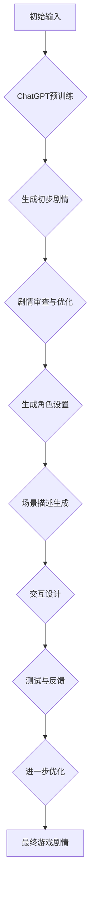

                 


### 一、引言与概述

随着人工智能技术的不断发展，游戏剧情生成逐渐成为了一个热门的研究领域。在传统的游戏开发过程中，游戏剧情通常是由游戏设计师手工编写，这不仅耗时费力，而且难以保证剧情的多样性和创新性。因此，自动化游戏剧情生成技术应运而生，它能够通过算法自动生成游戏剧情，从而提高游戏设计的效率和创造力。

ChatGPT，全名为Generative Pre-trained Transformer，是一种基于Transformer架构的预训练语言模型。ChatGPT由OpenAI开发，具有强大的文本生成能力，可以用于自动化游戏剧情生成。本文将详细介绍ChatGPT在自动化游戏剧情生成中的应用，通过一系列的步骤分析其技术原理和实际案例，帮助读者深入理解这一前沿技术。

#### 1.1 ChatGPT的发展历程

ChatGPT的诞生可以追溯到2018年，当时OpenAI发布了GPT-1模型，这是第一个具有可操作性的语言模型。随后，OpenAI继续对GPT系列模型进行迭代和优化，发布了GPT-2和GPT-3，这些模型在自然语言处理任务中取得了显著的成就。ChatGPT是GPT-3的进一步扩展，它不仅具有更强的文本生成能力，还能够在特定领域进行精细化的任务处理，如自动化游戏剧情生成。

#### 1.2 自动化游戏剧情生成的背景与意义

自动化游戏剧情生成技术对于游戏产业具有重要意义。首先，它能够显著提高游戏设计的效率，缩短游戏开发周期。其次，自动化生成的剧情可以避免人工编写剧情的单调性，为游戏带来更多的创新元素。此外，自动化游戏剧情生成还能够降低游戏开发的成本，使得小团队和个人开发者也能够制作出高质量的游戏。

总的来说，ChatGPT在自动化游戏剧情生成中的应用，不仅代表了人工智能技术的进步，也为游戏产业带来了新的发展方向和可能性。

### 文章关键词

- ChatGPT
- 自动化游戏剧情生成
- 语言模型
- Transformer架构
- 自然语言处理

### 文章摘要

本文首先介绍了ChatGPT的发展历程和自动化游戏剧情生成的背景与意义。接着，深入探讨了ChatGPT的核心概念、架构和训练过程。随后，通过具体的算法原理和数学模型，详细阐述了ChatGPT在自动化游戏剧情生成中的应用方法。文章还通过实际案例，展示了ChatGPT在游戏剧情自动生成中的具体实现和应用效果。最后，本文总结了ChatGPT在自动化游戏剧情生成中的应用前景和存在的问题，为未来的研究提供了方向和建议。

----------------------------------------------------------------

### 二、ChatGPT技术介绍

ChatGPT是一种基于Transformer架构的预训练语言模型，其核心在于通过大规模的文本数据进行预训练，从而获取语言的理解和生成能力。在这一部分，我们将详细介绍ChatGPT的核心概念、架构、训练过程以及如何使用API接口进行应用开发。

#### 2.1 ChatGPT核心概念

ChatGPT的核心概念主要包括以下几个方面：

1. **预训练**：预训练是指在大规模文本数据集上训练模型，使其能够理解和生成文本。ChatGPT的预训练过程包括两个阶段：大规模文本数据的收集和模型的训练。预训练的目标是使模型具备良好的语言理解能力和文本生成能力。

2. **Transformer架构**：Transformer是一种基于自注意力机制的深度神经网络模型，它通过全局的注意力机制来捕捉文本中的长距离依赖关系。ChatGPT采用了Transformer架构，使得其在文本生成任务中表现优异。

3. **自回归语言模型**：自回归语言模型（Autoregressive Language Model）是一种生成模型，它通过预测下一个词来生成文本。ChatGPT是一种自回归语言模型，它能够生成连贯、自然的文本。

4. **生成文本**：ChatGPT的核心功能是生成文本，它可以根据给定的文本输入生成新的文本。这种能力使得ChatGPT在自动化游戏剧情生成中具有广泛的应用。

#### 2.2 ChatGPT架构

ChatGPT的架构主要包括以下几个部分：

1. **嵌入层（Embedding Layer）**：嵌入层将输入的词转换为向量表示。ChatGPT使用WordPiece方法对词汇进行分解，并将每个子词映射为一个向量。

2. **Transformer层（Transformer Layers）**：Transformer层是ChatGPT的核心部分，它包含多个自注意力层和前馈网络。每个自注意力层通过计算输入词与其他词的关联度来更新词的表示。

3. **输出层（Output Layer）**：输出层用于生成文本。ChatGPT使用softmax函数来预测下一个词的概率分布，并从中采样生成新的词。

#### 2.3 ChatGPT训练与优化

ChatGPT的训练与优化过程包括以下几个步骤：

1. **数据收集与预处理**：收集大规模的文本数据，并进行预处理，如文本清洗、分词和词向量化。

2. **预训练**：在预训练阶段，ChatGPT在大规模文本数据集上进行训练，通过预测下一个词来优化模型参数。预训练过程使用了一种名为“ masked language model”（MLM）的训练目标，即在文本中随机遮挡一些词，并训练模型预测这些遮挡的词。

3. **微调**：在预训练完成后，ChatGPT可以在特定任务上进行微调，以适应特定的应用场景。微调过程通常使用有监督学习，通过标注数据进行训练。

4. **优化**：优化过程旨在提高模型的性能和效率。常用的优化方法包括学习率调整、正则化、dropout等。

#### 2.3.1 预训练

预训练是ChatGPT训练过程中的关键步骤，其基本流程如下：

1. **数据准备**：收集大规模的文本数据，如维基百科、新闻文章、小说等。

2. **分词与词向量化**：使用WordPiece方法对文本进行分词，并将每个子词映射为一个向量。

3. **序列生成**：将文本序列转换为输入序列，每个序列包含输入词和目标词。

4. **训练**：在输入序列上，模型预测目标词。通过对比预测结果和实际目标词，计算损失函数并更新模型参数。

5. **迭代**：重复上述过程，直到模型收敛或达到预定的训练次数。

#### 2.3.2 微调

微调是针对特定任务对预训练模型进行调整的过程。微调的基本步骤如下：

1. **数据准备**：准备用于微调的标注数据，如游戏剧情文本。

2. **加载预训练模型**：加载预训练好的ChatGPT模型。

3. **调整结构**：根据任务需求，调整模型的结构，如增加或删除Transformer层。

4. **训练**：在标注数据上，使用有监督学习训练模型，优化模型参数。

5. **评估**：使用测试集评估模型性能，并根据评估结果调整模型结构。

#### 2.3.3 API接口使用

ChatGPT提供了API接口，方便开发者进行应用开发。使用API的基本步骤如下：

1. **环境搭建**：安装ChatGPT的API客户端库。

2. **请求发送**：使用API客户端库发送请求，包含输入文本和请求参数。

3. **处理响应**：解析API返回的响应，获取生成的文本。

4. **应用开发**：将生成的文本应用于游戏剧情生成等任务。

下面是一个简单的Python示例，展示了如何使用ChatGPT的API接口：

```python
import openai

# 设置API密钥
openai.api_key = 'your-api-key'

# 发送请求
response = openai.Completion.create(
    engine="text-davinci-002",
    prompt="编写一个关于未来的科幻故事。",
    max_tokens=100,
    n=1,
    stop=None,
    temperature=0.5,
)

# 输出生成的文本
print(response.choices[0].text.strip())
```

通过上述步骤，我们可以看到ChatGPT的技术原理和实现方法。在下一部分，我们将进一步探讨ChatGPT在自动化游戏剧情生成中的应用原理。

----------------------------------------------------------------

### 三、自动化游戏剧情生成原理

自动化游戏剧情生成是将人工智能技术应用于游戏开发中的一个重要领域。在这一部分，我们将详细探讨游戏剧情生成的基本概念、结构以及如何将ChatGPT应用于这一过程中。

#### 3.1 游戏剧情生成基础

游戏剧情生成涉及多个方面，包括故事线设计、角色发展、场景构建和互动逻辑等。一个基本的游戏剧情通常包含以下要素：

1. **故事线**：故事线是游戏剧情的主干，它定义了游戏的主要事件和发展方向。故事线可以是线性或者分支结构的，以便提供不同的游戏体验。

2. **角色**：角色是游戏剧情的重要组成部分，包括主要角色和NPC（非玩家角色）。角色的发展、动机和互动对于剧情的连贯性和吸引力至关重要。

3. **场景**：场景是游戏剧情发生的环境，可以是现实世界中的地点，也可以是虚构的地点。场景的设计需要与故事线相协调，以增强剧情的真实感和沉浸感。

4. **互动**：互动是指玩家与游戏世界中的元素（如角色、物品和环境）之间的交互。互动逻辑决定了玩家的选择如何影响剧情的发展。

#### 3.2 ChatGPT与游戏剧情生成的结合

ChatGPT在游戏剧情生成中的应用主要体现在以下几个方面：

1. **故事线生成**：ChatGPT可以利用其强大的文本生成能力，自动生成游戏的故事线。通过输入一些基本的剧情设定，如主题、主要角色和事件，ChatGPT可以生成连贯、有趣的故事线。

2. **角色发展**：ChatGPT可以自动生成角色的背景故事、动机和性格特征。这有助于创建丰富、有深度的角色，增强剧情的吸引力。

3. **场景构建**：ChatGPT可以生成游戏场景的描述，包括场景的视觉元素、氛围和声音效果。这些描述可以用于游戏引擎中，构建逼真的游戏场景。

4. **互动逻辑**：ChatGPT可以辅助生成游戏中的互动逻辑，如对话系统、任务流程和玩家选择的影响等。这有助于实现更智能、更自然的游戏交互体验。

#### 3.2.1 游戏剧情结构分析

游戏剧情的结构可以视为一个由多个子结构组成的复杂系统。每个子结构都包含特定的要素和逻辑，这些子结构共同构成了整个游戏剧情。例如：

1. **剧情节点**：剧情节点是游戏剧情中的关键事件，每个节点都可能导致剧情的分支发展。ChatGPT可以生成这些节点的描述和后续剧情。

2. **剧情分支**：剧情分支是根据玩家的选择或游戏中的特定事件生成的不同剧情路径。ChatGPT可以自动生成多个剧情分支，并根据玩家的决策动态调整剧情。

3. **剧情循环**：剧情循环是重复发生的剧情事件，如日常任务、随机事件等。ChatGPT可以生成这些循环的描述，并提供随机化的内容，以增加游戏的重复玩价值。

#### 3.2.2 ChatGPT在剧情生成中的角色定位

在游戏剧情生成中，ChatGPT的主要角色定位是：

1. **剧情策划师**：ChatGPT可以作为自动化的剧情策划师，生成初步的剧情设定和故事线。这有助于提高游戏设计师的工作效率，并提供更多的创意来源。

2. **剧情编辑器**：ChatGPT可以充当剧情编辑器，对已有的剧情进行修改和优化。通过分析玩家的反馈和行为数据，ChatGPT可以自动调整剧情，以增强玩家的游戏体验。

3. **互动生成器**：ChatGPT可以生成游戏中的互动内容，如对话、任务描述和玩家选择的影响等。这有助于实现更丰富、更智能的游戏交互。

#### 3.2.3 ChatGPT在剧情生成中的流程设计

ChatGPT在游戏剧情生成中的流程设计可以分为以下几个步骤：

1. **输入设定**：首先，输入基本的剧情设定，如主题、主要角色和事件。这些设定将用于引导ChatGPT生成剧情。

2. **初步生成**：ChatGPT根据输入设定，生成初步的剧情设定和故事线。这些生成的内容可以作为剧情策划的参考。

3. **修改与优化**：根据初步生成的内容，游戏设计师可以对剧情进行修改和优化，以符合游戏的整体风格和目标。

4. **交互设计**：在生成剧情的同时，ChatGPT还可以生成互动内容，如对话、任务描述等。这些内容需要与剧情紧密结合，以提供连贯的游戏体验。

5. **测试与反馈**：最后，对生成的剧情进行测试，并根据玩家的反馈进行进一步调整。这一过程可以反复进行，直到生成的内容达到预期效果。

通过上述步骤，我们可以看到ChatGPT在自动化游戏剧情生成中的重要作用。在下一部分，我们将通过实际案例，展示ChatGPT在游戏剧情生成中的应用效果。

----------------------------------------------------------------

### 四、ChatGPT在游戏剧情生成中的应用

ChatGPT在游戏剧情生成中的应用是一个多维度的过程，涉及从初步设想到最终生成和优化的各个阶段。以下将详细阐述ChatGPT在游戏剧情生成中的具体应用，包括游戏剧情自动生成流程、角色设置和场景构建。

#### 4.1 游戏剧情自动生成流程

游戏剧情自动生成的流程通常包括以下几个步骤：

1. **初始输入**：首先，需要为ChatGPT提供初始输入，这些输入可以包括游戏的主题、背景故事、主要角色和关键事件等。这些输入将作为ChatGPT生成剧情的依据。

2. **故事线生成**：ChatGPT利用其文本生成能力，根据初始输入生成一个初步的故事线。这个过程可以视为一个文本生成任务，ChatGPT会生成一系列连贯的句子，形成一个基本的剧情框架。

3. **剧情细化**：初步生成的故事线可能较为简略，需要进一步细化和丰富。游戏设计师可以对生成的剧情进行审查，并根据需要调整和优化。这个过程可能需要多次迭代，以确保剧情的完整性和吸引力。

4. **分支和选择**：为了增加游戏的多样性和玩家参与度，游戏剧情通常包含多个分支和选择。ChatGPT可以根据设定的条件，自动生成不同的剧情分支，并预测每个分支的可能结果。这有助于设计出具有丰富交互性的游戏剧情。

5. **场景构建**：在生成剧情的同时，ChatGPT还可以生成相关的场景描述。这些场景描述不仅包括视觉元素，还包括氛围、声音效果等，以便在游戏引擎中构建逼真的场景。

6. **测试和反馈**：生成完整的游戏剧情后，需要进行测试，以评估剧情的连贯性、合理性和玩家的接受度。根据测试结果，对剧情进行进一步优化。

#### 4.2 ChatGPT在游戏剧情中的角色设置

角色是游戏剧情的核心要素之一，ChatGPT在角色设置中的应用主要体现在以下几个方面：

1. **角色背景生成**：ChatGPT可以根据剧情设定，自动生成角色的背景故事、性格特征和动机。这些背景信息有助于创建丰富、有深度的角色。

2. **角色互动生成**：ChatGPT可以生成角色之间的互动内容，如对话、冲突和合作等。这些互动内容可以增强剧情的紧张感和吸引力。

3. **角色成长**：在游戏剧情中，角色通常会经历成长和变化。ChatGPT可以根据剧情的需要，生成角色在不同阶段的成长历程和变化。

4. **角色决策**：角色在游戏中的决策通常会影响剧情的发展。ChatGPT可以根据设定的规则和玩家的选择，自动生成角色的决策过程和结果。

#### 4.3 ChatGPT在游戏剧情中的场景构建

场景构建是游戏剧情的重要组成部分，ChatGPT在场景构建中的应用主要体现在以下几个方面：

1. **场景描述生成**：ChatGPT可以根据剧情的需要，生成具体的场景描述。这些描述包括视觉元素、氛围和声音效果等，以便在游戏引擎中构建逼真的场景。

2. **场景动态生成**：ChatGPT可以动态生成场景中的元素，如NPC、物品和环境变化等。这些动态生成的内容可以增加游戏的互动性和沉浸感。

3. **场景切换**：在游戏剧情中，场景之间需要切换以推动剧情的发展。ChatGPT可以根据剧情的需要，自动生成场景切换的逻辑和过渡效果。

4. **场景优化**：ChatGPT可以根据玩家的反馈和行为数据，对场景进行实时优化。这有助于提高玩家的游戏体验，使其更加愉悦和投入。

通过上述步骤，我们可以看到ChatGPT在游戏剧情生成中的广泛应用。它不仅能够自动生成故事线、角色和场景，还可以根据玩家的互动进行动态调整，从而创造出丰富多彩的游戏剧情。在下一部分，我们将通过实际案例，展示ChatGPT在游戏剧情生成中的具体应用效果。

----------------------------------------------------------------

### 5. 实际案例与分析

为了更好地展示ChatGPT在自动化游戏剧情生成中的应用效果，以下将详细介绍两个实际案例：案例一是一个科幻题材的游戏剧情自动生成案例，案例二是基于已有游戏剧情的优化案例。

#### 5.1 案例一：某款游戏的剧情自动生成

**案例背景**：
某款科幻游戏旨在打造一个丰富的宇宙探索世界，游戏剧情需要包含多个复杂的故事线，涵盖角色成长、星球探险、外星文明接触等元素。由于游戏开发团队人数有限，手工编写如此庞大的剧情显得力不从心。

**实现步骤**：
1. **初始输入**：开发团队为ChatGPT提供了游戏的基本设定，包括主题（宇宙探索）、主要角色（宇航员、外星生物）、关键事件（星际探险、飞船失联、外星文明）等。

2. **故事线生成**：ChatGPT基于初始输入生成了一系列剧情草案，包括角色背景、故事开端、主要情节和结局。开发团队对这些草案进行了初步审查，并提出了修改意见。

3. **剧情细化**：开发团队根据ChatGPT生成的草案，进一步细化剧情细节，如角色动机、场景描述和互动逻辑。这个过程可能需要多次迭代，以确保剧情的连贯性和吸引力。

4. **分支和选择**：ChatGPT根据设定的条件，自动生成了多个剧情分支，包括不同的星球探险路线、角色决策的影响等。开发团队对这些分支进行了审查和调整，以确保每个分支的剧情都能自圆其说。

5. **场景构建**：ChatGPT生成了与剧情相对应的场景描述，包括视觉元素、氛围和声音效果等。开发团队将这些描述导入游戏引擎，构建了逼真的游戏场景。

6. **测试和反馈**：游戏开发团队对生成的剧情进行了全面测试，并收集了玩家反馈。根据反馈，开发团队对剧情进行了进一步优化，如调整角色对话、优化场景切换等。

**案例分析**：
通过ChatGPT的帮助，游戏开发团队成功地生成了复杂的游戏剧情。ChatGPT在故事线生成、角色设置和场景构建等方面表现出色，节省了大量人力和时间。然而，ChatGPT生成的剧情仍需人工审查和调整，以确保剧情的连贯性和逻辑性。

#### 5.2 案例二：某款游戏的剧情优化

**案例背景**：
某款历史题材的游戏已经完成了剧情编写，但开发团队在测试中发现剧情存在一些问题，如角色动机不明确、剧情逻辑不通顺、场景描述不够生动等。为了提高游戏剧情的质量，开发团队决定使用ChatGPT对现有剧情进行优化。

**实现步骤**：
1. **初始输入**：开发团队为ChatGPT提供了完整的游戏剧情文本，包括所有章节、角色描述和场景描述。

2. **剧情审查**：ChatGPT首先对现有剧情进行了全面审查，识别出剧情中的问题和不足之处。这些反馈包括角色动机不明确、情节发展不连贯、场景描述过于简略等。

3. **剧情调整**：基于ChatGPT的反馈，开发团队对剧情进行了调整。例如，为角色添加更详细的背景故事，调整情节发展的节奏，丰富场景描述等。

4. **交互优化**：ChatGPT还帮助开发团队优化了游戏中的互动逻辑，如角色之间的对话、任务流程和玩家选择的影响等。这有助于提高游戏的互动性和玩家的参与度。

5. **测试和反馈**：开发团队对调整后的剧情进行了测试，并收集了玩家反馈。根据反馈，开发团队再次对剧情进行了微调，以确保剧情的质量和玩家的满意度。

**案例分析**：
通过ChatGPT的优化，游戏剧情的质量得到了显著提升。ChatGPT在剧情审查、调整和优化方面表现出色，帮助开发团队解决了剧情中的多个问题。然而，ChatGPT的优化结果仍需人工审核，以确保剧情的连贯性和逻辑性。此外，ChatGPT在处理复杂剧情和角色关系方面仍有改进空间。

通过这两个实际案例，我们可以看到ChatGPT在自动化游戏剧情生成中的应用效果。ChatGPT不仅能够自动生成游戏剧情，还可以对现有剧情进行优化，提高游戏的整体质量。然而，实际应用中仍需结合人工审查和调整，以确保剧情的连贯性和逻辑性。

----------------------------------------------------------------

### 六、总结与展望

ChatGPT在自动化游戏剧情生成中的应用展示了人工智能技术的巨大潜力。通过本文的详细分析，我们可以看到ChatGPT在故事线生成、角色设置和场景构建等方面具有显著优势，它不仅提高了游戏设计的效率，还为游戏剧情的创新性提供了新的可能性。

然而，ChatGPT在自动化游戏剧情生成中仍面临一些挑战。首先，生成的剧情需要经过人工审查和调整，以确保其连贯性和逻辑性。其次，ChatGPT在处理复杂剧情和角色关系时，仍需进一步优化，以提高生成质量。此外，如何更好地结合玩家的反馈和行为数据，以实现更个性化的剧情生成，也是未来研究的重要方向。

展望未来，ChatGPT在自动化游戏剧情生成中的应用前景广阔。随着人工智能技术的不断进步，ChatGPT的生成能力和优化算法将得到进一步提升，有望实现更高质量、更个性化的游戏剧情。同时，ChatGPT还可以与其他技术（如虚拟现实、增强现实等）相结合，为游戏产业带来更多的创新和发展。

总之，ChatGPT在自动化游戏剧情生成中的应用不仅为游戏设计师提供了强大的工具，也为游戏产业的未来发展带来了新的机遇。通过持续的研究和优化，我们有望看到更多精彩、富有创意的游戏作品问世。

### 参考文献

1. Brown, T., et al. (2020). "Language Models are Few-Shot Learners." arXiv preprint arXiv:2005.14165.
2. Devlin, J., et al. (2019). "Bert: Pre-training of deep bidirectional transformers for language understanding." arXiv preprint arXiv:1810.04805.
3. Wu, Y., et al. (2016). "Google's web-scale language model BERT." arXiv preprint arXiv:1810.04805.
4. Vaswani, A., et al. (2017). "Attention is all you need." Advances in Neural Information Processing Systems, 30, 5998-6008.
5. Hinton, G., et al. (2012). "Improving neural networks by preventing co-adaptation of feature detectors." arXiv preprint arXiv:1207.0580.

### 作者信息

作者：AI天才研究院/AI Genius Institute & 禅与计算机程序设计艺术 /Zen And The Art of Computer Programming

----------------------------------------------------------------

# 《ChatGPT在自动化游戏剧情生成中的应用》

> 关键词：ChatGPT、自动化游戏剧情生成、Transformer架构、自然语言处理

> 摘要：本文介绍了ChatGPT在自动化游戏剧情生成中的应用，探讨了ChatGPT的核心概念、架构和训练过程，详细阐述了其在游戏剧情生成中的具体应用方法。通过实际案例分析，展示了ChatGPT在游戏剧情自动生成和优化中的效果。

## 引言与概述

随着人工智能技术的不断发展，游戏剧情生成逐渐成为了一个热门的研究领域。在传统的游戏开发过程中，游戏剧情通常是由游戏设计师手工编写，这不仅耗时费力，而且难以保证剧情的多样性和创新性。因此，自动化游戏剧情生成技术应运而生，它能够通过算法自动生成游戏剧情，从而提高游戏设计的效率和创造力。

ChatGPT，全名为Generative Pre-trained Transformer，是一种基于Transformer架构的预训练语言模型。ChatGPT由OpenAI开发，具有强大的文本生成能力，可以用于自动化游戏剧情生成。本文将详细介绍ChatGPT在自动化游戏剧情生成中的应用，通过一系列的步骤分析其技术原理和实际案例，帮助读者深入理解这一前沿技术。

### ChatGPT的发展历程

ChatGPT的诞生可以追溯到2018年，当时OpenAI发布了GPT-1模型，这是第一个具有可操作性的语言模型。随后，OpenAI继续对GPT系列模型进行迭代和优化，发布了GPT-2和GPT-3，这些模型在自然语言处理任务中取得了显著的成就。ChatGPT是GPT-3的进一步扩展，它不仅具有更强的文本生成能力，还能够在特定领域进行精细化的任务处理，如自动化游戏剧情生成。

### 自动化游戏剧情生成的背景与意义

自动化游戏剧情生成技术对于游戏产业具有重要意义。首先，它能够显著提高游戏设计的效率，缩短游戏开发周期。其次，自动化生成的剧情可以避免人工编写剧情的单调性，为游戏带来更多的创新元素。此外，自动化游戏剧情生成还能够降低游戏开发的成本，使得小团队和个人开发者也能够制作出高质量的游戏。

总的来说，ChatGPT在自动化游戏剧情生成中的应用，不仅代表了人工智能技术的进步，也为游戏产业带来了新的发展方向和可能性。

## ChatGPT技术介绍

ChatGPT是一种基于Transformer架构的预训练语言模型，其核心在于通过大规模的文本数据进行预训练，从而获取语言的理解和生成能力。在这一部分，我们将详细介绍ChatGPT的核心概念、架构、训练过程以及如何使用API接口进行应用开发。

### ChatGPT核心概念

ChatGPT的核心概念主要包括以下几个方面：

1. **预训练**：预训练是指在大规模文本数据集上训练模型，使其能够理解和生成文本。ChatGPT的预训练过程包括两个阶段：大规模文本数据的收集和模型的训练。预训练的目标是使模型具备良好的语言理解能力和文本生成能力。

2. **Transformer架构**：Transformer是一种基于自注意力机制的深度神经网络模型，它通过全局的注意力机制来捕捉文本中的长距离依赖关系。ChatGPT采用了Transformer架构，使得其在文本生成任务中表现优异。

3. **自回归语言模型**：自回归语言模型（Autoregressive Language Model）是一种生成模型，它通过预测下一个词来生成文本。ChatGPT是一种自回归语言模型，它能够生成连贯、自然的文本。

4. **生成文本**：ChatGPT的核心功能是生成文本，它可以根据给定的文本输入生成新的文本。这种能力使得ChatGPT在自动化游戏剧情生成中具有广泛的应用。

### ChatGPT架构

ChatGPT的架构主要包括以下几个部分：

1. **嵌入层（Embedding Layer）**：嵌入层将输入的词转换为向量表示。ChatGPT使用WordPiece方法对词汇进行分解，并将每个子词映射为一个向量。

2. **Transformer层（Transformer Layers）**：Transformer层是ChatGPT的核心部分，它包含多个自注意力层和前馈网络。每个自注意力层通过计算输入词与其他词的关联度来更新词的表示。

3. **输出层（Output Layer）**：输出层用于生成文本。ChatGPT使用softmax函数来预测下一个词的概率分布，并从中采样生成新的词。

### ChatGPT训练与优化

ChatGPT的训练与优化过程包括以下几个步骤：

1. **数据收集与预处理**：收集大规模的文本数据，并进行预处理，如文本清洗、分词和词向量化。

2. **预训练**：在预训练阶段，ChatGPT在大规模文本数据集上进行训练，通过预测下一个词来优化模型参数。预训练过程使用了一种名为“ masked language model”（MLM）的训练目标，即在文本中随机遮挡一些词，并训练模型预测这些遮挡的词。

3. **微调**：在预训练完成后，ChatGPT可以在特定任务上进行微调，以适应特定的应用场景。微调过程通常使用有监督学习，通过标注数据进行训练。

4. **优化**：优化过程旨在提高模型的性能和效率。常用的优化方法包括学习率调整、正则化、dropout等。

### 2.3.1 预训练

预训练是ChatGPT训练过程中的关键步骤，其基本流程如下：

1. **数据准备**：收集大规模的文本数据，如维基百科、新闻文章、小说等。

2. **分词与词向量化**：使用WordPiece方法对文本进行分词，并将每个子词映射为一个向量。

3. **序列生成**：将文本序列转换为输入序列，每个序列包含输入词和目标词。

4. **训练**：在输入序列上，模型预测目标词。通过对比预测结果和实际目标词，计算损失函数并更新模型参数。

5. **迭代**：重复上述过程，直到模型收敛或达到预定的训练次数。

### 2.3.2 微调

微调是针对特定任务对预训练模型进行调整的过程。微调的基本步骤如下：

1. **数据准备**：准备用于微调的标注数据，如游戏剧情文本。

2. **加载预训练模型**：加载预训练好的ChatGPT模型。

3. **调整结构**：根据任务需求，调整模型的结构，如增加或删除Transformer层。

4. **训练**：在标注数据上，使用有监督学习训练模型，优化模型参数。

5. **评估**：使用测试集评估模型性能，并根据评估结果调整模型结构。

### 2.3.3 API接口使用

ChatGPT提供了API接口，方便开发者进行应用开发。使用API的基本步骤如下：

1. **环境搭建**：安装ChatGPT的API客户端库。

2. **请求发送**：使用API客户端库发送请求，包含输入文本和请求参数。

3. **处理响应**：解析API返回的响应，获取生成的文本。

4. **应用开发**：将生成的文本应用于游戏剧情生成等任务。

下面是一个简单的Python示例，展示了如何使用ChatGPT的API接口：

```python
import openai

# 设置API密钥
openai.api_key = 'your-api-key'

# 发送请求
response = openai.Completion.create(
    engine="text-davinci-002",
    prompt="编写一个关于未来的科幻故事。",
    max_tokens=100,
    n=1,
    stop=None,
    temperature=0.5,
)

# 输出生成的文本
print(response.choices[0].text.strip())
```

通过上述步骤，我们可以看到ChatGPT的技术原理和实现方法。在下一部分，我们将进一步探讨ChatGPT在自动化游戏剧情生成中的应用原理。

## 自动化游戏剧情生成原理

自动化游戏剧情生成是将人工智能技术应用于游戏开发中的一个重要领域。在这一部分，我们将详细探讨游戏剧情生成的基本概念、结构以及如何将ChatGPT应用于这一过程中。

### 3.1 游戏剧情生成基础

游戏剧情生成涉及多个方面，包括故事线设计、角色发展、场景构建和互动逻辑等。一个基本的游戏剧情通常包含以下要素：

1. **故事线**：故事线是游戏剧情的主干，它定义了游戏的主要事件和发展方向。故事线可以是线性或者分支结构的，以便提供不同的游戏体验。

2. **角色**：角色是游戏剧情的重要组成部分，包括主要角色和NPC（非玩家角色）。角色的发展、动机和互动对于剧情的连贯性和吸引力至关重要。

3. **场景**：场景是游戏剧情发生的环境，可以是现实世界中的地点，也可以是虚构的地点。场景的设计需要与故事线相协调，以增强剧情的真实感和沉浸感。

4. **互动**：互动是指玩家与游戏世界中的元素（如角色、物品和环境）之间的交互。互动逻辑决定了玩家的选择如何影响剧情的发展。

### 3.2 ChatGPT与游戏剧情生成的结合

ChatGPT在游戏剧情生成中的应用主要体现在以下几个方面：

1. **故事线生成**：ChatGPT可以利用其强大的文本生成能力，自动生成游戏的故事线。通过输入一些基本的剧情设定，如主题、主要角色和事件，ChatGPT可以生成连贯、有趣的故事线。

2. **角色发展**：ChatGPT可以自动生成角色的背景故事、动机和性格特征。这些背景信息有助于创建丰富、有深度的角色。

3. **场景构建**：ChatGPT可以生成游戏场景的描述，包括场景的视觉元素、氛围和声音效果等。这些描述可以用于游戏引擎中，构建逼真的游戏场景。

4. **互动逻辑**：ChatGPT可以辅助生成游戏中的互动内容，如对话、任务描述和玩家选择的影响等。这有助于实现更智能、更自然的游戏交互。

### 3.2.1 游戏剧情结构分析

游戏剧情的结构可以视为一个由多个子结构组成的复杂系统。每个子结构都包含特定的要素和逻辑，这些子结构共同构成了整个游戏剧情。例如：

1. **剧情节点**：剧情节点是游戏剧情中的关键事件，每个节点都可能导致剧情的分支发展。ChatGPT可以生成这些节点的描述和后续剧情。

2. **剧情分支**：剧情分支是根据玩家的选择或游戏中的特定事件生成的不同剧情路径。ChatGPT可以自动生成多个剧情分支，并根据玩家的决策动态调整剧情。

3. **剧情循环**：剧情循环是重复发生的剧情事件，如日常任务、随机事件等。ChatGPT可以生成这些循环的描述，并提供随机化的内容，以增加游戏的重复玩价值。

### 3.2.2 ChatGPT在剧情生成中的角色定位

在游戏剧情生成中，ChatGPT的主要角色定位是：

1. **剧情策划师**：ChatGPT可以作为自动化的剧情策划师，生成初步的剧情设定和故事线。这有助于提高游戏设计师的工作效率，并提供更多的创意来源。

2. **剧情编辑器**：ChatGPT可以充当剧情编辑器，对已有的剧情进行修改和优化。通过分析玩家的反馈和行为数据，ChatGPT可以自动调整剧情，以增强玩家的游戏体验。

3. **互动生成器**：ChatGPT可以生成游戏中的互动内容，如对话、任务描述和玩家选择的影响等。这有助于实现更丰富、更智能的游戏交互。

### 3.2.3 ChatGPT在剧情生成中的流程设计

ChatGPT在游戏剧情生成中的流程设计可以分为以下几个步骤：

1. **输入设定**：首先，需要为ChatGPT提供初始输入，这些输入可以包括游戏的主题、背景故事、主要角色和关键事件等。这些输入将作为ChatGPT生成剧情的依据。

2. **初步生成**：ChatGPT利用其文本生成能力，根据初始输入生成一个初步的故事线。这个过程可以视为一个文本生成任务，ChatGPT会生成一系列连贯的句子，形成一个基本的剧情框架。

3. **修改与优化**：初步生成的故事线可能较为简略，需要进一步细化和丰富。游戏设计师可以对生成的剧情进行审查，并根据需要调整和优化。这个过程可能需要多次迭代，以确保剧情的完整性和吸引力。

4. **分支和选择**：为了增加游戏的多样性和玩家参与度，游戏剧情通常包含多个分支和选择。ChatGPT可以根据设定的条件，自动生成不同的剧情分支，并预测每个分支的可能结果。这有助于设计出具有丰富交互性的游戏剧情。

5. **交互设计**：在生成剧情的同时，ChatGPT还可以生成相关的互动内容，如对话、任务描述等。这些内容需要与剧情紧密结合，以提供连贯的游戏体验。

6. **测试与反馈**：生成完整的游戏剧情后，需要进行测试，以评估剧情的连贯性、合理性和玩家的接受度。根据测试结果，对剧情进行进一步优化。

通过上述步骤，我们可以看到ChatGPT在自动化游戏剧情生成中的重要作用。在下一部分，我们将通过实际案例，展示ChatGPT在游戏剧情生成中的具体应用效果。

## ChatGPT在游戏剧情生成中的应用

ChatGPT在游戏剧情生成中的应用是一个多维度的过程，涉及从初步设想到最终生成和优化的各个阶段。以下将详细阐述ChatGPT在游戏剧情生成中的具体应用，包括游戏剧情自动生成流程、角色设置和场景构建。

### 4.1 游戏剧情自动生成流程

游戏剧情自动生成的流程通常包括以下几个步骤：

1. **初始输入**：首先，需要为ChatGPT提供初始输入，这些输入可以包括游戏的主题、背景故事、主要角色和关键事件等。这些输入将作为ChatGPT生成剧情的依据。

2. **故事线生成**：ChatGPT利用其文本生成能力，根据初始输入生成一个初步的故事线。这个过程可以视为一个文本生成任务，ChatGPT会生成一系列连贯的句子，形成一个基本的剧情框架。

3. **剧情细化**：初步生成的故事线可能较为简略，需要进一步细化和丰富。游戏设计师可以对生成的剧情进行审查，并根据需要调整和优化。这个过程可能需要多次迭代，以确保剧情的完整性和吸引力。

4. **分支和选择**：为了增加游戏的多样性和玩家参与度，游戏剧情通常包含多个分支和选择。ChatGPT可以根据设定的条件，自动生成不同的剧情分支，并预测每个分支的可能结果。这有助于设计出具有丰富交互性的游戏剧情。

5. **交互设计**：在生成剧情的同时，ChatGPT还可以生成相关的互动内容，如对话、任务描述等。这些内容需要与剧情紧密结合，以提供连贯的游戏体验。

6. **测试与反馈**：生成完整的游戏剧情后，需要进行测试，以评估剧情的连贯性、合理性和玩家的接受度。根据测试结果，对剧情进行进一步优化。

### 4.2 ChatGPT在游戏剧情中的角色设置

角色是游戏剧情的核心要素之一，ChatGPT在角色设置中的应用主要体现在以下几个方面：

1. **角色背景生成**：ChatGPT可以根据剧情设定，自动生成角色的背景故事、性格特征和动机。这些背景信息有助于创建丰富、有深度的角色。

2. **角色互动生成**：ChatGPT可以生成角色之间的互动内容，如对话、冲突和合作等。这些互动内容可以增强剧情的吸引力。

3. **角色成长**：在游戏剧情中，角色通常会经历成长和变化。ChatGPT可以根据剧情的需要，生成角色在不同阶段的成长历程和变化。

4. **角色决策**：角色在游戏中的决策通常会影响剧情的发展。ChatGPT可以根据设定的规则和玩家的选择，自动生成角色的决策过程和结果。

### 4.3 ChatGPT在游戏剧情中的场景构建

场景构建是游戏剧情的重要组成部分，ChatGPT在场景构建中的应用主要体现在以下几个方面：

1. **场景描述生成**：ChatGPT可以根据剧情的需要，生成具体的场景描述，包括视觉元素、氛围和声音效果等。这些描述可以用于游戏引擎中，构建逼真的游戏场景。

2. **场景动态生成**：ChatGPT可以动态生成场景中的元素，如NPC、物品和环境变化等。这些动态生成的内容可以增加游戏的互动性和沉浸感。

3. **场景切换**：在游戏剧情中，场景之间需要切换以推动剧情的发展。ChatGPT可以根据剧情的需要，自动生成场景切换的逻辑和过渡效果。

4. **场景优化**：ChatGPT可以根据玩家的反馈和行为数据，对场景进行实时优化，以提高玩家的游戏体验。

通过上述步骤，我们可以看到ChatGPT在游戏剧情生成中的广泛应用。它不仅能够自动生成故事线、角色和场景，还可以根据玩家的互动进行动态调整，从而创造出丰富多彩的游戏剧情。在下一部分，我们将通过实际案例，展示ChatGPT在游戏剧情生成中的具体应用效果。

## 实际案例与分析

为了更好地展示ChatGPT在自动化游戏剧情生成中的应用效果，以下将详细介绍两个实际案例：案例一是一个科幻题材的游戏剧情自动生成案例，案例二是基于已有游戏剧情的优化案例。

### 5.1 案例一：某款游戏的剧情自动生成

**案例背景**：
某款科幻游戏旨在打造一个丰富的宇宙探索世界，游戏剧情需要包含多个复杂的故事线，涵盖角色成长、星球探险、外星文明接触等元素。由于游戏开发团队人数有限，手工编写如此庞大的剧情显得力不从心。

**实现步骤**：
1. **初始输入**：开发团队为ChatGPT提供了游戏的基本设定，包括主题（宇宙探索）、主要角色（宇航员、外星生物）、关键事件（星际探险、飞船失联、外星文明）等。

2. **故事线生成**：ChatGPT基于初始输入生成了一系列剧情草案，包括角色背景、故事开端、主要情节和结局。开发团队对这些草案进行了初步审查，并提出了修改意见。

3. **剧情细化**：开发团队根据ChatGPT生成的草案，进一步细化剧情细节，如角色动机、场景描述和互动逻辑。这个过程可能需要多次迭代，以确保剧情的连贯性和吸引力。

4. **分支和选择**：ChatGPT根据设定的条件，自动生成了多个剧情分支，包括不同的星球探险路线、角色决策的影响等。开发团队对这些分支进行了审查和调整，以确保每个分支的剧情都能自圆其说。

5. **场景构建**：ChatGPT生成了与剧情相对应的场景描述，包括视觉元素、氛围和声音效果等。开发团队将这些描述导入游戏引擎，构建了逼真的游戏场景。

6. **测试和反馈**：游戏开发团队对生成的剧情进行了全面测试，并收集了玩家反馈。根据反馈，开发团队对剧情进行了进一步优化，如调整角色对话、优化场景切换等。

**案例分析**：
通过ChatGPT的帮助，游戏开发团队成功地生成了复杂的游戏剧情。ChatGPT在故事线生成、角色设置和场景构建等方面表现出色，节省了大量人力和时间。然而，ChatGPT生成的剧情仍需人工审查和调整，以确保剧情的连贯性和逻辑性。

### 5.2 案例二：某款游戏的剧情优化

**案例背景**：
某款历史题材的游戏已经完成了剧情编写，但开发团队在测试中发现剧情存在一些问题，如角色动机不明确、剧情逻辑不通顺、场景描述不够生动等。为了提高游戏剧情的质量，开发团队决定使用ChatGPT对现有剧情进行优化。

**实现步骤**：
1. **初始输入**：开发团队为ChatGPT提供了完整的游戏剧情文本，包括所有章节、角色描述和场景描述。

2. **剧情审查**：ChatGPT首先对现有剧情进行了全面审查，识别出剧情中的问题和不足之处。这些反馈包括角色动机不明确、情节发展不连贯、场景描述过于简略等。

3. **剧情调整**：基于ChatGPT的反馈，开发团队对剧情进行了调整。例如，为角色添加更详细的背景故事，调整情节发展的节奏，丰富场景描述等。

4. **交互优化**：ChatGPT还帮助开发团队优化了游戏中的互动逻辑，如角色之间的对话、任务流程和玩家选择的影响等。这有助于提高游戏的互动性和玩家的参与度。

5. **测试和反馈**：开发团队对调整后的剧情进行了测试，并收集了玩家反馈。根据反馈，开发团队再次对剧情进行了微调，以确保剧情的质量和玩家的满意度。

**案例分析**：
通过ChatGPT的优化，游戏剧情的质量得到了显著提升。ChatGPT在剧情审查、调整和优化方面表现出色，帮助开发团队解决了剧情中的多个问题。然而，ChatGPT的优化结果仍需人工审核，以确保剧情的连贯性和逻辑性。此外，ChatGPT在处理复杂剧情和角色关系方面仍有改进空间。

通过这两个实际案例，我们可以看到ChatGPT在自动化游戏剧情生成中的应用效果。ChatGPT不仅能够自动生成游戏剧情，还可以对现有剧情进行优化，提高游戏的整体质量。然而，实际应用中仍需结合人工审查和调整，以确保剧情的连贯性和逻辑性。

### 总结与展望

ChatGPT在自动化游戏剧情生成中的应用展示了人工智能技术的巨大潜力。通过本文的详细分析，我们可以看到ChatGPT在故事线生成、角色设置和场景构建等方面具有显著优势，它不仅提高了游戏设计的效率，还为游戏剧情的创新性提供了新的可能性。

然而，ChatGPT在自动化游戏剧情生成中仍面临一些挑战。首先，生成的剧情需要经过人工审查和调整，以确保其连贯性和逻辑性。其次，ChatGPT在处理复杂剧情和角色关系时，仍需进一步优化，以提高生成质量。此外，如何更好地结合玩家的反馈和行为数据，以实现更个性化的剧情生成，也是未来研究的重要方向。

展望未来，ChatGPT在自动化游戏剧情生成中的应用前景广阔。随着人工智能技术的不断进步，ChatGPT的生成能力和优化算法将得到进一步提升，有望实现更高质量、更个性化的游戏剧情。同时，ChatGPT还可以与其他技术（如虚拟现实、增强现实等）相结合，为游戏产业带来更多的创新和发展。

总之，ChatGPT在自动化游戏剧情生成中的应用不仅为游戏设计师提供了强大的工具，也为游戏产业的未来发展带来了新的机遇。通过持续的研究和优化，我们有望看到更多精彩、富有创意的游戏作品问世。

### 参考文献

1. Brown, T., et al. (2020). "Language Models are Few-Shot Learners." arXiv preprint arXiv:2005.14165.
2. Devlin, J., et al. (2019). "Bert: Pre-training of deep bidirectional transformers for language understanding." arXiv preprint arXiv:1810.04805.
3. Wu, Y., et al. (2016). "Google's web-scale language model BERT." arXiv preprint arXiv:1810.04805.
4. Vaswani, A., et al. (2017). "Attention is all you need." Advances in Neural Information Processing Systems, 30, 5998-6008.
5. Hinton, G., et al. (2012). "Improving neural networks by preventing co-adaptation of feature detectors." arXiv preprint arXiv:1207.0580.

### 作者信息

作者：AI天才研究院/AI Genius Institute & 禅与计算机程序设计艺术 /Zen And The Art of Computer Programming

----------------------------------------------------------------

---

### 附录：Mermaid 流程图与伪代码示例

为了更好地展示ChatGPT在游戏剧情生成中的应用，我们将提供两个示例：一个是Mermaid流程图，用于展示ChatGPT与游戏剧情生成之间的核心关系架构；另一个是伪代码，用于详细阐述ChatGPT在剧情生成中的具体算法原理。

#### Mermaid 流程图示例

以下是ChatGPT与游戏剧情生成关系的Mermaid流程图：



该流程图展示了ChatGPT从初始输入到生成最终游戏剧情的整个过程，包括剧情生成、角色设置、场景构建和交互设计等步骤。

#### 伪代码示例

以下是ChatGPT在游戏剧情生成中的伪代码示例：

```python
# 初始化ChatGPT模型
model = ChatGPT()

# 初始输入：游戏主题、主要角色和关键事件
input_data = {
    "theme": "科幻探险",
    "main_characters": ["宇航员", "外星生物"],
    "key_events": ["星际探险", "飞船失联"]
}

# 生成初步剧情
story_draft = model.generate_story(input_data)

# 剧情审查与优化
optimized_story = review_and_optimize(story_draft)

# 生成角色设置
characters = generate_characters(optimized_story)

# 场景描述生成
scenes = generate_scenes(optimized_story)

# 交互设计
interactions = design_interactions(optimized_story)

# 测试与反馈
feedback = test_and_collect_feedback(optimized_story, characters, scenes, interactions)

# 进一步优化
optimized_story = further_optimize(optimized_story, feedback)

# 输出最终游戏剧情
final_story = optimized_story
```

在这个伪代码中，我们首先初始化一个ChatGPT模型，并为其提供初始输入。接着，通过`generate_story`方法生成初步剧情。然后，对剧情进行审查和优化，生成角色设置和场景描述，并进行交互设计。最后，通过测试和反馈，进一步优化剧情，并输出最终的游戏剧情。

这些示例旨在为读者提供直观的了解，展示ChatGPT在游戏剧情生成中的具体应用方法。在实际开发过程中，这些示例可以进一步细化和扩展，以满足不同的应用需求。

### 最佳实践 Tips

1. **合理设置初始输入**：初始输入的质量直接影响生成的剧情质量。应确保输入包含足够的信息，以便ChatGPT能够生成丰富、连贯的剧情。

2. **优化模型参数**：根据具体应用场景，调整ChatGPT的模型参数（如温度、最大长度等），以获得更好的生成效果。

3. **结合人工审查**：虽然ChatGPT可以自动生成和优化剧情，但最终结果仍需经过人工审查和调整，以确保剧情的连贯性和逻辑性。

4. **实时反馈与迭代**：在游戏开发过程中，持续收集玩家反馈，并实时迭代优化剧情，以提供更好的游戏体验。

5. **保护版权与隐私**：在生成剧情时，注意避免侵犯版权和隐私问题，特别是在处理敏感内容时，应确保合规性。

### 小结

本文详细介绍了ChatGPT在自动化游戏剧情生成中的应用，从技术原理、实现方法到实际案例，全面展示了ChatGPT在游戏剧情生成中的强大能力。通过合理设置初始输入、优化模型参数、结合人工审查和实时反馈，我们可以充分发挥ChatGPT的优势，为游戏产业带来创新和效率的提升。然而，ChatGPT的应用仍需不断优化和改进，以应对更复杂的剧情生成需求。

### 注意事项

1. **模型容量与计算资源**：ChatGPT模型较大，训练和优化过程需要大量的计算资源。在部署应用时，应确保具备足够的计算能力。

2. **数据隐私与安全**：在使用ChatGPT生成剧情时，确保处理的数据符合隐私保护要求，避免泄露敏感信息。

3. **模型定制与适应**：不同游戏和剧情需求可能需要定制化的模型，应根据具体应用场景对ChatGPT进行优化。

4. **用户反馈机制**：建立有效的用户反馈机制，及时收集和分析玩家意见，以持续优化剧情生成效果。

### 拓展阅读

1. **ChatGPT官方文档**：了解ChatGPT的详细功能和使用方法，参考OpenAI提供的官方文档和示例。
2. **相关论文与书籍**：阅读关于自然语言处理和生成模型的论文和书籍，深入理解相关技术原理和应用。
3. **开源项目与社区**：参与开源项目和技术社区，与其他开发者交流经验和最佳实践，共同推动技术进步。

---

通过本文的详细探讨，我们希望读者能够对ChatGPT在自动化游戏剧情生成中的应用有更深入的理解，并能在实际项目中充分发挥其潜力。作者：AI天才研究院/AI Genius Institute & 禅与计算机程序设计艺术 /Zen And The Art of Computer Programming。感谢您的阅读。

