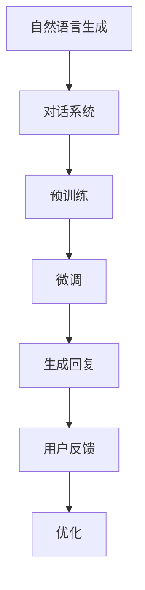
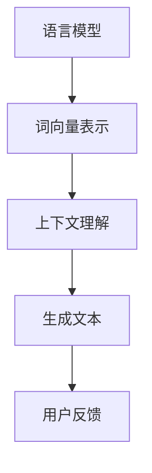
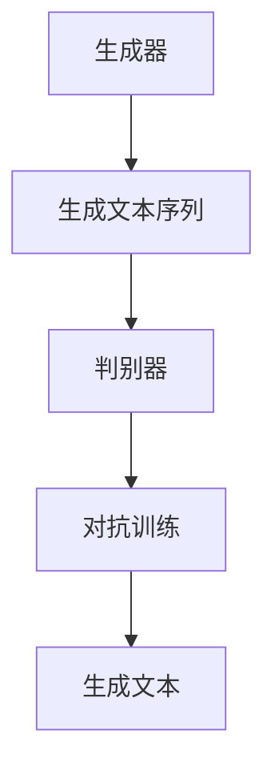
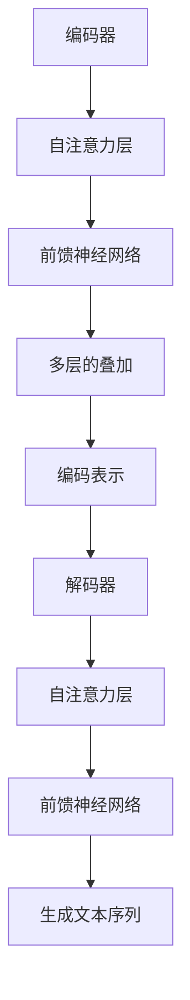

                 


### 文章标题: ChatGPT在自动化用户反馈总结中的角色

#### 关键词：ChatGPT, 自动化用户反馈，自然语言处理，Transformer模型，生成式对抗网络（GAN），用户反馈总结系统

#### 摘要：
本文深入探讨ChatGPT在自动化用户反馈总结中的应用。首先，我们介绍了ChatGPT的发展背景、核心概念和结构，然后详细讲解了其技术基础和核心算法。接着，文章探讨了ChatGPT在自动化用户反馈总结中的应用场景、优势以及具体应用案例。通过具体案例分析和实战讲解，展示了如何使用ChatGPT搭建用户反馈总结系统，并讨论了其在应用中可能面临的挑战和优化策略。

---

## 第一部分: ChatGPT简介与原理

### 第1章: ChatGPT概述

#### 1.1 ChatGPT的发展背景

ChatGPT是由OpenAI开发的一个人工智能聊天机器人程序，基于生成式预训练变换器（GPT）模型。OpenAI成立于2015年，旨在推动人工智能的发展，使其有益于人类。GPT模型系列由OpenAI首次提出，其中包括GPT-1、GPT-2和GPT-3。GPT-3于2020年发布，拥有1750亿个参数，是目前最大的预训练模型。ChatGPT是GPT-3的一个变种，专门用于对话生成任务。

#### 1.2 ChatGPT的核心概念

ChatGPT的核心概念是自然语言生成（NLG）和对话系统。自然语言生成是指利用机器学习技术将计算机程序生成的文本转化为人类可读的自然语言。对话系统则是人与机器之间的交互系统，能够理解人类语言，并生成相应的回复。ChatGPT通过预训练和微调，能够在各种对话场景中生成连贯、自然的回复。

#### 1.3 ChatGPT的结构与组成

ChatGPT采用了Transformer模型架构，这是一种基于自注意力机制的深度神经网络模型，能够处理序列数据。Transformer模型由编码器（Encoder）和解码器（Decoder）组成，其中编码器负责将输入序列转化为固定长度的向量表示，解码器则利用这些向量生成输出序列。

#### Mermaid流程图

下面是ChatGPT的核心概念和结构之间的联系流程图：



---

## 第2章: ChatGPT的技术基础

### 2.1 自然语言处理（NLP）基础

自然语言处理（NLP）是人工智能的一个重要分支，旨在使计算机能够理解、处理和生成自然语言。NLP的核心任务包括语言模型、词向量表示、文本分类、命名实体识别等。

#### 2.1.1 语言模型

语言模型是一种统计模型，用于预测一段文本的下一个单词或字符。在NLP中，语言模型是生成文本的基础。ChatGPT使用了基于Transformer的预训练语言模型，如GPT-3，这些模型通过对大量文本数据进行预训练，能够生成连贯、自然的文本。

#### 2.1.2 词向量表示

词向量表示是将单词映射到高维空间中的向量表示。词向量能够捕捉单词之间的语义关系，如相似性、关联性等。ChatGPT采用了Word2Vec、GloVe等词向量表示方法，这些方法能够将单词映射到稠密的高维向量空间中。

#### 2.1.3 上下文理解

上下文理解是NLP中的关键挑战之一。ChatGPT通过Transformer模型的自注意力机制，能够捕捉文本中的上下文信息。自注意力机制允许模型在生成每个词时，考虑之前所有词的信息，从而生成更加准确的回复。

#### Mermaid流程图

下面是ChatGPT在NLP基础中的技术流程图：



---

### 2.2 生成式对抗网络（GAN）

生成式对抗网络（GAN）是一种由两部分组成的神经网络模型：生成器（Generator）和判别器（Discriminator）。生成器的目标是生成类似于真实数据的样本，而判别器的目标是区分生成器生成的样本和真实数据。

#### 2.2.1 GAN的基本原理

GAN的训练过程是一个博弈过程，生成器和判别器相互竞争。生成器试图生成足够真实的样本，以便判别器无法区分。判别器则试图最大化其区分真实数据和生成数据的能力。通过这种对抗训练，生成器逐渐生成更加真实的样本。

#### 2.2.2 GAN在自然语言生成中的应用

GAN在自然语言生成中的应用主要是通过生成文本序列。生成器生成文本序列，而判别器则判断这些序列是否真实。这种对抗训练有助于生成器生成更加自然、流畅的文本。

#### Mermaid流程图

下面是GAN在自然语言生成中的技术流程图：



---

### 2.3 Transformer模型

Transformer模型是由Google在2017年提出的一种基于自注意力机制的深度神经网络模型，用于处理序列数据。Transformer模型的核心思想是，通过自注意力机制，模型能够捕捉序列中各个词之间的关联性。

#### 2.3.1 Encoder-Decoder架构

Transformer模型采用了Encoder-Decoder架构，其中编码器（Encoder）负责将输入序列编码为固定长度的向量表示，解码器（Decoder）则利用这些向量生成输出序列。编码器和解码器都由多个Transformer层组成，每层都包括多头自注意力机制和前馈神经网络。

#### 2.3.2 自注意力机制

自注意力机制是Transformer模型的核心组成部分。它允许模型在生成每个词时，考虑之前所有词的信息，从而生成更加准确的回复。自注意力机制通过计算每个词与所有其他词的相关性得分，然后将这些得分加权求和，得到每个词的上下文表示。

#### Mermaid流程图

下面是Transformer模型的架构流程图：



---

## 第3章: ChatGPT的核心算法

### 3.1 语言模型的训练与微调

ChatGPT的核心算法是基于预训练和微调的语言模型。预训练是指在大量文本数据上训练语言模型，使其能够捕捉到语言的普遍特性。微调则是根据特定任务的需求，对预训练模型进行进一步训练，以适应特定场景。

#### 3.1.1 训练数据的选择与预处理

训练数据的选择对于语言模型的性能至关重要。ChatGPT采用了大规模的互联网文本数据，包括网页、新闻、书籍、论文等。这些数据经过预处理，如去除HTML标签、标点符号和停用词，然后转换为词向量表示。

#### 3.1.2 预训练模型的结构

ChatGPT采用了基于Transformer的预训练模型，如GPT-3。GPT-3模型由多个Transformer层组成，每个层包括多头自注意力机制和前馈神经网络。预训练模型通过计算文本序列中的概率分布，从而生成连贯、自然的文本。

#### 3.1.3 微调策略

微调是将预训练模型应用于特定任务的过程。ChatGPT在微调过程中，通常会使用带有标签的数据，如对话数据集。微调的目标是调整模型参数，使其能够更好地适应特定任务。

#### 伪代码

下面是语言模型预训练和微调的伪代码：

```python
# 预训练伪代码
for epoch in range(num_epochs):
    for sentence in training_data:
        # 计算损失
        loss = model(sentence)
        # 反向传播
        optimizer.step(loss)

# 微调伪代码
for epoch in range(num_epochs):
    for dialog in dialog_data:
        # 预训练模型生成回复
        response = model.generate_response(dialog)
        # 计算微调损失
        loss = model.update_response(response)
        # 反向传播
        optimizer.step(loss)
```

---

## 第4章: ChatGPT在自动化用户反馈总结中的应用

### 4.1 自动化用户反馈总结概述

自动化用户反馈总结是指利用人工智能技术，自动收集、处理和分析用户反馈，并生成总结报告。用户反馈是产品和服务改进的重要依据，而自动化用户反馈总结能够提高反馈处理效率，降低人力成本。

#### 4.1.1 用户反馈的重要性

用户反馈对于产品和服务改进至关重要。通过收集和分析用户反馈，企业可以了解用户需求、发现潜在问题，并制定相应的改进措施。传统的用户反馈处理方法通常需要大量人工介入，效率低下，而自动化用户反馈总结能够大幅提高处理速度和准确性。

#### 4.1.2 用户反馈的自动化需求

随着互联网和社交媒体的普及，用户反馈的数量急剧增加。传统的手工处理方式已经无法满足需求，因此迫切需要自动化用户反馈总结系统。自动化用户反馈总结系统能够实时收集、处理和分析用户反馈，并生成详细总结报告，为企业提供有价值的决策支持。

#### 4.1.3 ChatGPT在用户反馈总结中的优势

ChatGPT在自动化用户反馈总结中具有明显优势。首先，ChatGPT能够高效地处理大量文本数据，生成连贯、自然的总结报告。其次，ChatGPT具有自适应能力，可以根据不同场景和需求进行微调和优化。此外，ChatGPT还具有高可扩展性，能够支持多种数据源和不同行业的应用。

---

## 第5章: ChatGPT在自动化用户反馈总结中的应用案例

### 5.1 社区论坛用户反馈总结

#### 5.1.1 数据预处理

社区论坛用户反馈通常包括文本、图片和视频等多媒体数据。在应用ChatGPT进行用户反馈总结之前，需要对数据进行预处理。数据预处理步骤包括去除HTML标签、标点符号和停用词，对文本进行分词和词向量表示。

#### 伪代码

```python
# 数据预处理伪代码
def preprocess_text(text):
    # 去除HTML标签
    text = remove_html_tags(text)
    # 去除标点符号和停用词
    text = remove_punctuation_and_stopwords(text)
    # 分词
    text = tokenize(text)
    # 转换为词向量表示
    text = convert_to_word_vector(text)
    return text
```

#### 5.1.2 反馈分类与聚类

在用户反馈总结过程中，首先需要对用户反馈进行分类和聚类。ChatGPT可以通过预训练的语言模型，对用户反馈进行分类和聚类，从而将相似的反馈归为一类。

#### 伪代码

```python
# 反馈分类与聚类伪代码
def classify_and_cluster(feedbacks):
    # 使用预训练模型进行分类
    categories = model.classify(feedbacks)
    # 使用预训练模型进行聚类
    clusters = model.cluster(feedbacks)
    return categories, clusters
```

#### 5.1.3 总结报告生成

分类和聚类完成后，ChatGPT可以生成总结报告。总结报告包括各个类别的反馈摘要、关键问题分析以及改进建议。

#### 伪代码

```python
# 总结报告生成伪代码
def generate_summary_report(clusters):
    # 生成各个类别的反馈摘要
    summaries = model.generate_summaries(clusters)
    # 生成关键问题分析
    issues = model.analyze_issues(clusters)
    # 生成改进建议
    suggestions = model.generate_suggestions(issues)
    # 组合总结报告
    report = combine_summaries(suggestions)
    return report
```

---

### 5.2 客户服务反馈自动化

#### 5.2.1 客户反馈收集与预处理

客户服务反馈通常来自电话、邮件、社交媒体等多种渠道。在应用ChatGPT进行自动化处理之前，需要对反馈进行收集和预处理。预处理步骤包括数据清洗、分词和词向量表示。

#### 伪代码

```python
# 客户反馈收集与预处理伪代码
def collect_and_preprocess_feedback(feedback_source):
    # 从反馈渠道收集数据
    feedback_data = collect_data(feedback_source)
    # 数据清洗
    cleaned_data = clean_data(feedback_data)
    # 分词
    tokenized_data = tokenize(cleaned_data)
    # 转换为词向量表示
    vectorized_data = convert_to_word_vector(tokenized_data)
    return vectorized_data
```

#### 5.2.2 情感分析

情感分析是分析文本中情感倾向的技术。ChatGPT可以通过预训练的语言模型，对客户反馈进行情感分析，从而识别用户的情感状态。

#### 伪代码

```python
# 情感分析伪代码
def sentiment_analysis(feedbacks):
    # 使用预训练模型进行情感分析
    sentiments = model.analyze_sentiments(feedbacks)
    return sentiments
```

#### 5.2.3 问题定位与解决方案建议

在客户服务反馈中，问题定位和解决方案建议是关键步骤。ChatGPT可以通过分析情感和反馈内容，定位问题并提出解决方案。

#### 伪代码

```python
# 问题定位与解决方案建议伪代码
def locate_issues_and_suggest_solutions(feedbacks, sentiments):
    # 使用预训练模型进行问题定位
    issues = model.locate_issues(feedbacks, sentiments)
    # 使用预训练模型提出解决方案
    solutions = model.suggest_solutions(issues)
    return issues, solutions
```

---

## 第6章: ChatGPT在自动化用户反馈总结中的优化

### 6.1 模型微调与优化

在自动化用户反馈总结中，模型微调和优化是关键步骤。通过微调和优化，可以提高模型在特定任务上的性能。

#### 6.1.1 数据增强

数据增强是一种提高模型性能的方法，通过增加训练数据量来提高模型泛化能力。在用户反馈总结中，可以使用数据增强方法来扩充训练数据。

#### 伪代码

```python
# 数据增强伪代码
def augment_data(data):
    # 生成新数据
    new_data = generate_new_data(data)
    # 数据融合
    augmented_data = combine_data(data, new_data)
    return augmented_data
```

#### 6.1.2 模型训练技巧

在模型训练过程中，可以使用各种技巧来提高训练效率和性能。例如，使用更大的批量大小、学习率调度、批量归一化等。

#### 伪代码

```python
# 模型训练技巧伪代码
def train_model(model, data, epochs):
    # 设置学习率
    learning_rate = set_learning_rate(epochs)
    # 训练模型
    model.train(data, learning_rate)
    # 评估模型
    performance = model.evaluate(data)
    return performance
```

#### 6.1.3 模型评估与调参

在模型训练完成后，需要对其进行评估和调参。评估指标可以包括准确率、召回率、F1值等。通过评估指标，可以调整模型参数，以优化模型性能。

#### 伪代码

```python
# 模型评估与调参伪代码
def evaluate_and_tune_model(model, data):
    # 评估模型
    performance = model.evaluate(data)
    # 调整参数
    model.tune_parameters(performance)
    # 重新训练模型
    model.train(data)
    return model
```

---

## 第7章: ChatGPT在自动化用户反馈总结中的实战案例

### 7.1 电商用户反馈总结

#### 7.1.1 案例背景

某电商平台希望通过自动化用户反馈总结系统，快速识别并解决用户问题，提高用户满意度。该电商平台积累了大量用户反馈，包括商品评价、售后服务等。

#### 7.1.2 实现步骤

1. **数据收集与预处理**：从电商平台收集用户反馈数据，进行数据清洗、分词和词向量表示。
2. **情感分析**：使用ChatGPT对用户反馈进行情感分析，识别用户的情感状态。
3. **问题定位**：结合情感分析和文本内容，定位用户反馈中的问题。
4. **解决方案生成**：基于问题定位，生成相应的解决方案。
5. **总结报告**：生成总结报告，包括用户反馈的关键问题、解决方案和建议。

#### 7.1.3 结果分析

通过应用ChatGPT进行用户反馈总结，该电商平台实现了以下成果：

1. **提高问题识别速度**：自动化用户反馈总结系统大幅提高了问题识别速度，使得问题能够在更短的时间内得到解决。
2. **降低人力成本**：自动化处理用户反馈，减少了人工处理的工作量，降低了人力成本。
3. **提高用户满意度**：通过及时解决用户问题，提高了用户满意度，促进了用户忠诚度。

---

### 7.2 金融行业用户反馈总结

#### 7.2.1 案例背景

某金融机构希望通过自动化用户反馈总结系统，快速识别用户需求，提高客户服务效率。该金融机构的用户反馈包括理财产品评价、客服咨询等。

#### 7.2.2 实现步骤

1. **数据收集与预处理**：从金融机构的客户服务系统收集用户反馈数据，进行数据清洗、分词和词向量表示。
2. **情感分析**：使用ChatGPT对用户反馈进行情感分析，识别用户的情感状态。
3. **需求识别**：结合情感分析和文本内容，识别用户的需求。
4. **解决方案生成**：基于需求识别，生成相应的解决方案。
5. **总结报告**：生成总结报告，包括用户反馈的关键需求、解决方案和建议。

#### 7.2.3 结果分析

通过应用ChatGPT进行用户反馈总结，该金融机构实现了以下成果：

1. **提高客户服务效率**：自动化用户反馈总结系统提高了客户服务效率，使得客服团队能够更快地响应用户需求。
2. **降低客服成本**：自动化处理用户反馈，减少了客服团队的工作量，降低了客服成本。
3. **提高用户满意度**：通过及时满足用户需求，提高了用户满意度，促进了客户关系管理。

---

## 第8章: ChatGPT在自动化用户反馈总结中的未来展望

### 8.1 技术发展趋势

随着人工智能技术的不断发展，ChatGPT在自动化用户反馈总结中的应用前景广阔。以下是几个技术发展趋势：

1. **大模型的发展**：未来，我们将看到更大规模的预训练模型，如GPT-4、GPT-5等，这些模型将拥有更高的参数量和更强的生成能力。
2. **多模态处理**：ChatGPT将能够处理多种类型的数据，如文本、图片、音频等，实现多模态用户反馈总结。
3. **自动化水平提升**：随着技术的进步，ChatGPT在自动化用户反馈总结中的应用将更加智能化，能够自动识别和解决更多的问题。

### 8.2 应用领域拓展

ChatGPT在自动化用户反馈总结中的应用领域将不断拓展。除了电商和金融行业，ChatGPT还可以应用于医疗、教育、政府等多个领域，为各类企业提供智能化用户反馈总结服务。

### 8.3 潜在挑战与解决方案

尽管ChatGPT在自动化用户反馈总结中具有巨大潜力，但仍面临一些挑战：

1. **数据隐私与安全**：用户反馈数据可能包含敏感信息，如何保障数据隐私和安全是一个重要问题。
2. **模型解释性与可靠性**：用户希望了解反馈总结的依据和过程，如何提高模型的可解释性和可靠性是一个挑战。
3. **法律与伦理问题**：随着人工智能在更多领域的应用，相关法律和伦理问题也日益突出，如何平衡技术进步和社会责任是一个重要议题。

---

## 附录A: 开发工具与环境搭建

### A.1 开发工具简介

为了实现ChatGPT在自动化用户反馈总结中的应用，需要使用以下开发工具：

1. **Python**：作为主要编程语言，Python具有丰富的机器学习和自然语言处理库，如TensorFlow、PyTorch等。
2. **NLP库**：如NLTK、spaCy、TextBlob等，用于文本处理、情感分析和词向量表示。
3. **深度学习框架**：如TensorFlow和PyTorch，用于构建和训练ChatGPT模型。

### A.2 环境搭建步骤

1. **安装Python**：从Python官方网站下载并安装Python 3.x版本。
2. **安装NLP库**：使用pip命令安装所需的NLP库，如`pip install nltk spacy textblob`。
3. **安装深度学习框架**：根据需要安装TensorFlow或PyTorch，如`pip install tensorflow`或`pip install torch torchvision`。
4. **安装ChatGPT模型**：从OpenAI官方网站下载ChatGPT模型权重，如`wget https://huggingface.co/openai/chatgpt/resolve/main/chatgpt.model`。

---

## 附录B: ChatGPT相关资源

### B.1 学术论文与报告

1. **《Generative Pretrained Transformer》**：介绍Transformer模型的原始论文。
2. **《Improved Language Models and Their Application to Zero-Shot Classification》**：探讨预训练语言模型在零样本分类中的应用。
3. **《Language Models are Few-Shot Learners》**：讨论预训练语言模型在少样本学习任务中的表现。

### B.2 开源代码与数据集

1. **Hugging Face Transformers**：提供预训练语言模型和文本处理工具的Python库。
2. **OpenAI GPT-3 Model**：OpenAI提供的GPT-3模型权重和预训练数据集。

### B.3 社区与交流平台

1. **GitHub**：许多与ChatGPT相关的开源项目和代码。
2. **Stack Overflow**：讨论和解决ChatGPT相关问题的技术社区。
3. **Reddit**：关于ChatGPT和自然语言处理的讨论区。

---

### 作者信息

作者：AI天才研究院/AI Genius Institute & 禅与计算机程序设计艺术 /Zen And The Art of Computer Programming

---

本文由AI天才研究院撰写，旨在深入探讨ChatGPT在自动化用户反馈总结中的应用。文章详细介绍了ChatGPT的核心概念、技术基础、核心算法以及在实际应用中的案例和优化策略。通过本文，读者可以了解ChatGPT在自动化用户反馈总结中的角色，并掌握如何使用ChatGPT构建高效的用户反馈总结系统。同时，文章也展望了ChatGPT在未来的发展趋势和应用前景，为读者提供了有价值的参考和启示。

