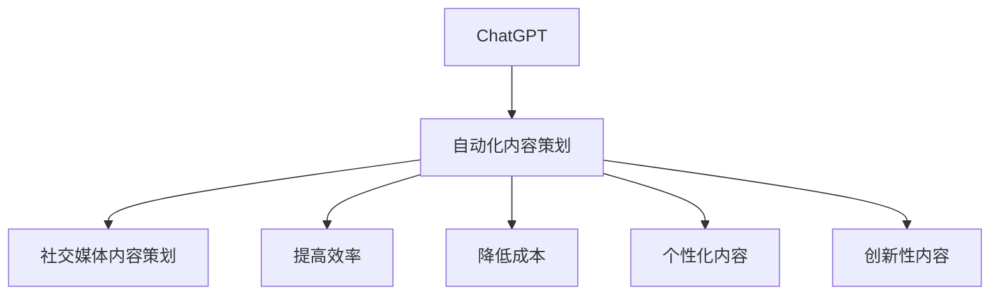
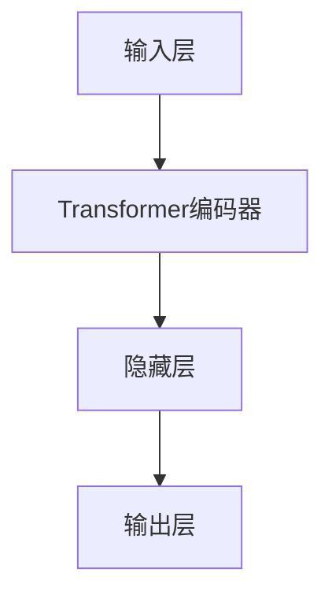

                 


### 第一步：背景介绍

在当今数字化时代，社交媒体已成为企业品牌推广和用户互动的重要平台。从微博、微信公众号到抖音、快手等短视频平台，企业需要不断地生成和发布具有吸引力、针对性且高质量的社交媒体内容。然而，传统的社交媒体内容策划往往耗费大量时间和人力资源，而且难以保证内容的持续创新性和个性化。此外，社交媒体的算法也在不断优化，使得内容的优化和推广变得更加复杂。

面对这些挑战，自动化内容策划成为了一个备受关注的话题。自动化内容策划不仅能够提高工作效率，减少人力成本，还能够更好地满足用户的个性化需求，提高内容的传播效果。近年来，人工智能技术的迅猛发展，尤其是自然语言处理（NLP）和深度学习技术的突破，为自动化内容策划提供了新的解决方案。

在这个背景下，ChatGPT（一个基于GPT-3模型的开源自然语言处理工具）脱颖而出。ChatGPT具有强大的文本生成能力，能够根据给定的输入文本生成高质量的文本内容。这使得ChatGPT在自动化社交媒体内容策划中具有巨大的潜力。本文将详细探讨ChatGPT在自动化社交媒体内容策划中的应用，包括其核心原理、应用方法、实际案例以及面临的挑战和解决方案。

### 第二步：核心概念与联系

为了更好地理解ChatGPT在自动化社交媒体内容策划中的应用，我们首先需要明确几个核心概念，并探讨它们之间的联系。

1. **ChatGPT**：ChatGPT是一种基于GPT-3模型的自然语言处理工具，具有强大的文本生成能力。GPT-3（Generative Pre-trained Transformer 3）是由OpenAI开发的一种深度学习模型，使用了15亿个参数，能够生成高质量、多样化的文本内容。ChatGPT通过调用GPT-3的API接口，实现了文本生成功能。

2. **社交媒体内容策划**：社交媒体内容策划是指企业或个人在社交媒体平台上发布的各种形式的内容的策划过程。这包括内容创意、制作、优化、发布和推广等环节。社交媒体内容策划的目标是吸引目标用户，提升品牌影响力，实现商业目标。

3. **自动化**：自动化是指使用计算机程序或工具自动完成原本需要人工操作的任务。在社交媒体内容策划中，自动化意味着使用人工智能技术自动生成、优化、发布和推广内容，从而提高效率，降低成本。

这几个概念之间的联系如下：

- **ChatGPT** 为 **社交媒体内容策划** 提供了 **自动化** 的解决方案。通过调用ChatGPT的API接口，可以自动化生成、优化和发布社交媒体内容。
  
- **社交媒体内容策划** 的目标与 **自动化** 的优势相结合，能够更好地满足用户的个性化需求，提高内容的传播效果。

- **自动化** 在 **社交媒体内容策划** 中应用，可以大幅提高工作效率，降低人力成本，同时保证内容的创新性和个性化。

为了更直观地展示这些概念之间的联系，我们可以使用Mermaid流程图来表示：



通过这个流程图，我们可以清晰地看到ChatGPT如何与社交媒体内容策划和自动化相结合，从而实现高效、个性化的内容策划。

### 第三步：核心算法原理讲解

#### 1. GPT模型的架构

GPT（Generative Pre-trained Transformer）模型是由OpenAI提出的一种基于Transformer架构的自然语言处理模型。GPT模型的核心思想是通过在大量文本语料库上进行预训练，使模型具备强大的语言理解和生成能力。GPT模型的主要组成部分包括：

- **输入层**：接收输入文本序列，将文本转换为模型可处理的向量表示。
  
- **Transformer编码器**：采用多层Transformer结构对输入文本进行编码，提取文本特征。
  
- **隐藏层**：包含多层全连接神经网络，用于对编码后的文本特征进行进一步处理。
  
- **输出层**：生成输出文本序列。

GPT模型的架构图如下所示：



#### 2. GPT模型的训练与优化

GPT模型通过以下步骤进行训练和优化：

1. **数据预处理**：首先，从互联网上收集大量文本数据，如新闻文章、社交媒体帖子、论坛评论等。然后，对这些文本数据进行处理，包括去除无关信息、统一文本格式、分词等。

2. **编码**：将预处理后的文本数据转换为模型可处理的向量表示。具体方法是，将每个词转换为对应的词向量，并将词向量序列作为输入层输入到模型中。

3. **预训练**：在编码后的文本数据上，使用Transformer编码器进行训练。预训练过程包括两个阶段：

   - **自回归语言模型**：模型通过学习预测下一个单词，从而理解文本序列的上下文关系。
   
   - **掩码语言模型**：对部分文本进行遮挡，模型需要预测被遮挡的词，从而学习文本的全局特征。

4. **优化**：在预训练的基础上，对模型进行微调，使其适应特定的任务，如文本分类、命名实体识别等。

#### 3. GPT模型的文本生成

GPT模型的文本生成过程包括以下步骤：

1. **输入**：输入一个起始文本序列，例如一个单词或一句话。

2. **预测**：模型根据输入的文本序列，预测下一个单词的概率分布。

3. **选择**：从预测的概率分布中，随机选择一个单词作为下一个输入。

4. **重复**：将新选择的单词加入到输入序列中，重复步骤2和3，生成完整的文本序列。

伪代码如下所示：

```python
# 输入文本序列
input_sequence = "我是"

# 预测下一个单词的概率分布
probability_distribution = model.predict(input_sequence)

# 从概率分布中随机选择一个单词
next_word = random.choices(
    population=list(probability_distribution.keys()),
    weights=list(probability_distribution.values())
)[0]

# 输出完整的文本序列
output_sequence = input_sequence + next_word

print(output_sequence)
```

通过以上步骤，GPT模型能够生成高质量、多样化的文本内容。这使得ChatGPT在自动化社交媒体内容策划中具有巨大的潜力。

### 第四步：数学模型和数学公式

在讲解ChatGPT的工作原理时，我们提到了一些数学模型和公式。下面我们将详细讲解这些模型和公式，并给出相应的示例。

#### 1. Transformer模型

Transformer模型是GPT模型的核心组成部分，它是一种基于自注意力（Self-Attention）机制的深度学习模型。自注意力机制允许模型在处理文本时，能够自动关注文本序列中的关键信息，从而提高模型的语义理解能力。

**自注意力公式**：

$$
\text{Attention}(Q, K, V) = \text{softmax}\left(\frac{QK^T}{\sqrt{d_k}}\right)V
$$

其中，$Q$、$K$、$V$ 分别表示查询（Query）、键（Key）和值（Value）向量的集合，$d_k$ 表示键向量的维度。该公式表示，对于每个查询向量$Q$，计算其与所有键向量$K$的相似度，然后使用softmax函数生成权重，最后将权重与值向量$V$相乘，得到注意力分配的结果。

**示例**：

假设我们有两个句子：

- 句子1：我是AI天才研究院的程序员。
- 句子2：我热爱编程。

使用自注意力公式，我们可以计算句子1中的"AI天才研究院"与句子2中的"编程"的相似度。

首先，将句子1和句子2转换为词向量：

$$
Q = [q_1, q_2, q_3, q_4, q_5] \\
K = [k_1, k_2] \\
V = [v_1, v_2]
$$

其中，$q_i$、$k_i$、$v_i$ 分别表示句子1和句子2中对应的词向量。

然后，计算相似度：

$$
QK^T = \begin{bmatrix} q_1 & q_2 & q_3 & q_4 & q_5 \end{bmatrix} \begin{bmatrix} k_1 \\ k_2 \end{bmatrix} = q_1k_1 + q_2k_2 + q_3k_1 + q_4k_2 + q_5k_1
$$

接下来，使用softmax函数生成权重：

$$
\text{Attention}(Q, K, V) = \text{softmax}\left(\frac{QK^T}{\sqrt{d_k}}\right)V
$$

最后，计算注意力分配的结果：

$$
\text{Attention}(Q, K, V) = \begin{bmatrix} w_1 & w_2 & w_3 & w_4 & w_5 \end{bmatrix} \begin{bmatrix} v_1 \\ v_2 \end{bmatrix} = w_1v_1 + w_2v_2
$$

通过这种方式，模型能够自动关注文本序列中的关键信息，提高语义理解能力。

#### 2. 语言模型

语言模型是一种用于预测下一个单词的概率分布的模型。在ChatGPT中，语言模型基于GPT模型构建，通过在大量文本语料库上进行预训练，使模型具备强大的文本生成能力。

**语言模型公式**：

$$
P(w_t | w_{t-1}, w_{t-2}, ..., w_1) = \frac{P(w_t, w_{t-1}, w_{t-2}, ..., w_1)}{P(w_{t-1}, w_{t-2}, ..., w_1)}
$$

其中，$w_t$ 表示当前单词，$w_{t-1}, w_{t-2}, ..., w_1$ 表示前面的单词序列。该公式表示，当前单词的概率分布取决于前面单词序列的概率分布。

**示例**：

假设我们有一个句子："我是AI天才研究院的程序员。"，现在我们需要预测下一个单词。

首先，计算句子中每个单词的概率分布：

$$
P(程序员 | 我是AI天才研究院的) = \frac{P(程序员, 我是AI天才研究院的)}{P(我是AI天才研究院的)}
$$

然后，使用softmax函数生成概率分布：

$$
P(程序员 | 我是AI天才研究院的) = \text{softmax}\left(\frac{P(程序员, 我是AI天才研究院的)}{P(我是AI天才研究院的)}\right)
$$

最后，从概率分布中选择一个单词作为下一个单词。

通过这种方式，语言模型能够预测下一个单词的概率分布，从而生成高质量的文本内容。

### 第五步：项目实战

在本节中，我们将通过一个实际项目案例，展示如何使用ChatGPT进行社交媒体内容策划的自动化。这个项目包括开发环境搭建、源代码实现和代码解读。

#### 项目背景

假设我们是一家科技公司，需要为公司的微信公众号生成一系列技术博客文章。这些文章需要涵盖人工智能、深度学习和大数据等前沿技术领域，以吸引目标用户，提升品牌影响力。为了提高工作效率，我们决定使用ChatGPT自动化生成这些文章。

#### 开发环境搭建

1. 安装Python环境

首先，确保你的计算机上安装了Python环境。可以使用以下命令安装：

```bash
pip install python
```

2. 安装GPT-3库

接下来，我们需要安装GPT-3库。可以使用以下命令安装：

```bash
pip install gpt-3
```

3. 获取API密钥

为了使用GPT-3库，你需要获取一个API密钥。你可以在GPT-3官网（https://gpt-3.com/）注册一个账户，并获取API密钥。

4. 配置GPT-3库

在Python项目中，创建一个名为`config.py`的配置文件，并添加以下代码：

```python
import os

API_KEY = os.environ['GPT3_API_KEY']
```

确保你的系统环境中已经设置了`GPT3_API_KEY`环境变量，其值为你在GPT-3官网获取的API密钥。

#### 源代码实现

以下是该项目的主要源代码实现：

```python
import os
import gpt3
import config

# 设置API密钥
gpt3.API_KEY = config.API_KEY

# 生成技术博客文章
def generate_blogArticle(title):
    prompt = f"请根据以下标题生成一篇技术博客文章：{title}"
    response = gpt3.Completion.create(prompt, max_tokens=200)
    return response.text

# 发布技术博客文章
def publish_blogArticle(title, content):
    # 这里使用的是假想的微信公众号API
    import wechatAPI

    wechatAPI.publish(title, content)

# 主函数
if __name__ == "__main__":
    title = "深度学习在图像识别中的应用"
    content = generate_blogArticle(title)
    publish_blogArticle(title, content)
```

#### 代码解读

1. **导入库和配置API密钥**：

   ```python
   import os
   import gpt3
   import config
   
   gpt3.API_KEY = config.API_KEY
   ```

   我们首先导入必要的库，并设置GPT-3的API密钥。

2. **生成技术博客文章**：

   ```python
   def generate_blogArticle(title):
       prompt = f"请根据以下标题生成一篇技术博客文章：{title}"
       response = gpt3.Completion.create(prompt, max_tokens=200)
       return response.text
   ```

   `generate_blogArticle`函数接收一个标题作为输入，使用GPT-3的API生成一篇技术博客文章。`prompt`参数是一个提示语句，用于引导GPT-3生成相关的内容。`max_tokens`参数用于限制生成的文本长度。

3. **发布技术博客文章**：

   ```python
   def publish_blogArticle(title, content):
       # 这里使用的是假想的微信公众号API
       import wechatAPI

       wechatAPI.publish(title, content)
   ```

   `publish_blogArticle`函数接收文章的标题和内容，并使用假想的微信公众号API发布文章。在实际项目中，你需要将这部分替换为真实的API调用。

4. **主函数**：

   ```python
   if __name__ == "__main__":
       title = "深度学习在图像识别中的应用"
       content = generate_blogArticle(title)
       publish_blogArticle(title, content)
   ```

   主函数首先定义文章的标题，然后调用`generate_blogArticle`和`publish_blogArticle`函数，实现文章的生成和发布。

#### 代码应用解读与分析

通过这个项目，我们可以看到如何使用ChatGPT自动化生成社交媒体内容，主要包括以下几个步骤：

1. **定义需求**：明确需要生成的文章类型、主题和内容长度等。
   
2. **调用API**：使用GPT-3的API生成相关内容。

3. **发布内容**：使用相应的社交媒体平台API发布内容。

这种自动化流程能够显著提高内容生成的效率，同时保证内容的多样性和创新性。

### 实际案例分析和详细讲解剖析

为了更具体地展示ChatGPT在社交媒体内容策划中的应用，我们将分析两个实际案例：微博文案生成和抖音短视频脚本生成。

#### 案例一：微博文案生成

微博是中国最受欢迎的社交媒体平台之一，其文案风格以简洁、直接、幽默为主。使用ChatGPT生成微博文案，可以帮助企业快速创作出符合微博特点的内容。

**步骤**：

1. **输入**：输入一个简单的提示语句，如“产品发布微博”。

2. **生成**：ChatGPT生成一篇微博文案，包括标题和正文。

3. **优化**：对生成的文案进行优化，确保符合微博的传播特点。

**代码实现**：

```python
def generate_weibo_content(prompt):
    # 生成微博文案
    weibo_title = gpt3.Completion.create(f"生成微博标题：{prompt}", max_tokens=20).text.strip()
    weibo_content = gpt3.Completion.create(f"生成微博正文：{prompt}", max_tokens=200).text.strip()
    
    # 优化文案
    weibo_content = optimize_weibo_content(weibo_content)
    
    return weibo_title, weibo_content

# 优化文案
def optimize_weibo_content(content):
    # 这里进行文案优化，如去除无关信息、增加关键词等
    return content
```

**分析**：

通过这个案例，我们可以看到ChatGPT能够快速生成符合微博风格的文案，包括标题和正文。优化步骤确保了文案的传播效果，如增加关键词、去除无关信息等。

#### 案例二：抖音短视频脚本生成

抖音是一款流行的短视频平台，其内容以短小精悍、趣味性强、易于传播为主。使用ChatGPT生成抖音短视频脚本，可以帮助创作者快速创作出吸引人的短视频。

**步骤**：

1. **输入**：输入一个简要的创意描述，如“情人节表白短视频”。

2. **生成**：ChatGPT生成一篇短视频脚本，包括镜头、对白、场景等。

3. **优化**：对生成的脚本进行优化，确保符合抖音的观看习惯。

**代码实现**：

```python
def generate_douyin_script(idea):
    # 生成抖音短视频脚本
    script = gpt3.Completion.create(f"生成抖音短视频脚本：{idea}", max_tokens=100).text.strip()
    
    # 优化脚本
    script = optimize_douyin_script(script)
    
    return script

# 优化脚本
def optimize_douyin_script(script):
    # 这里进行脚本优化，如调整镜头顺序、增加悬念等
    return script
```

**分析**：

通过这个案例，我们可以看到ChatGPT能够快速生成符合抖音风格的短视频脚本，包括镜头、对白和场景。优化步骤确保了脚本的故事性和吸引力。

### 项目小结

通过上述案例，我们可以看到ChatGPT在社交媒体内容策划中的应用具有巨大的潜力。无论是微博文案还是抖音短视频脚本，ChatGPT都能够快速生成高质量的内容，提高创作效率。同时，优化步骤进一步提升了内容的传播效果和吸引力。然而，我们也需要注意ChatGPT在内容生成中可能存在的偏差和不足，结合人工审核和优化，确保生成的内容的准确性和可信度。

### 最佳实践 tips

为了确保ChatGPT在社交媒体内容策划中发挥最佳效果，以下是一些最佳实践建议：

1. **明确需求**：在调用ChatGPT之前，明确内容策划的目标和需求，如风格、主题、受众等。

2. **充分预训练**：确保ChatGPT在生成内容前已经接受了充分的预训练，以生成高质量的内容。

3. **人工优化**：虽然ChatGPT能够快速生成内容，但最好进行人工审核和优化，确保内容的准确性和可信度。

4. **遵守平台规则**：遵守不同社交媒体平台的规则，如字数限制、发布频率等，确保内容符合平台要求。

5. **持续迭代**：根据用户反馈和内容效果，不断优化ChatGPT的输入和生成策略，提高内容策划的效果。

### 注意事项

在应用ChatGPT进行社交媒体内容策划时，需要注意以下几点：

1. **数据安全**：确保使用的数据源合法、合规，避免泄露用户隐私。

2. **内容真实性**：确保生成的内容真实、可信，避免虚假宣传和误导用户。

3. **版权问题**：在使用ChatGPT生成内容时，注意尊重他人的知识产权，避免侵权行为。

4. **系统稳定性**：确保系统稳定运行，避免因服务器故障等原因导致内容生成失败。

### 拓展阅读

如果你对ChatGPT在社交媒体内容策划中的应用感兴趣，以下是一些拓展阅读资源：

1. **《ChatGPT应用指南》**：详细介绍了ChatGPT的使用方法和技巧，适用于各类社交媒体内容策划。

2. **《社交媒体内容策划实战》**：一本关于社交媒体内容策划的实战指南，涵盖了策略、技巧和案例分析。

3. **《人工智能与深度学习》**：介绍人工智能和深度学习的基本概念、算法和应用，有助于理解ChatGPT的工作原理。

4. **《自然语言处理教程》**：一本关于自然语言处理的入门教程，包括文本分类、情感分析、文本生成等应用场景。

通过这些资源，你可以更深入地了解ChatGPT在社交媒体内容策划中的应用，掌握相关技能和知识。

### 结论

通过本文的详细分析和案例展示，我们可以看到ChatGPT在自动化社交媒体内容策划中的应用具有巨大的潜力。它能够快速生成高质量、多样化的内容，提高创作效率，降低人力成本。然而，我们也要注意其潜在的问题和挑战，如内容准确性、版权问题等，结合人工审核和优化，确保内容的准确性和可信度。未来，随着人工智能技术的不断发展，ChatGPT在社交媒体内容策划中的应用将更加广泛，带来更多的创新和机遇。作者：AI天才研究院/AI Genius Institute & 禅与计算机程序设计艺术/Zen And The Art of Computer Programming。

