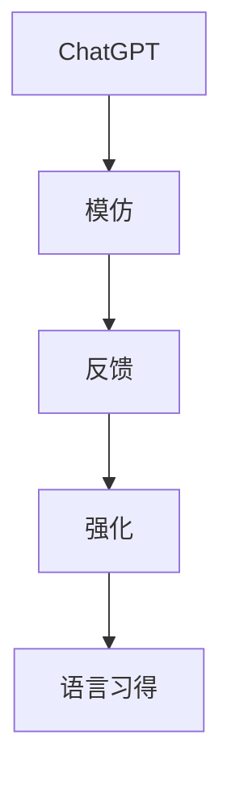
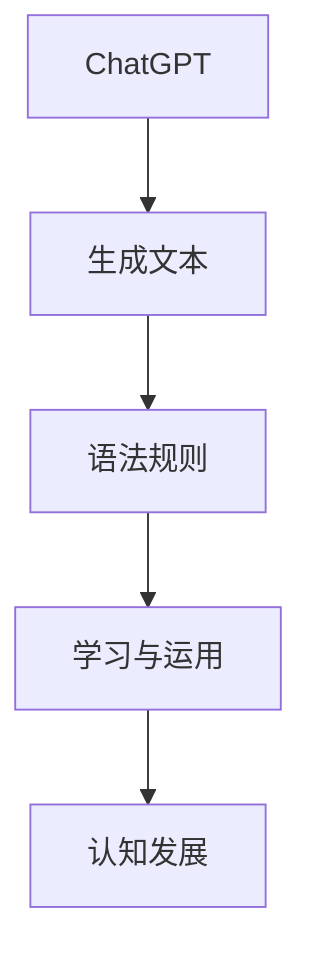
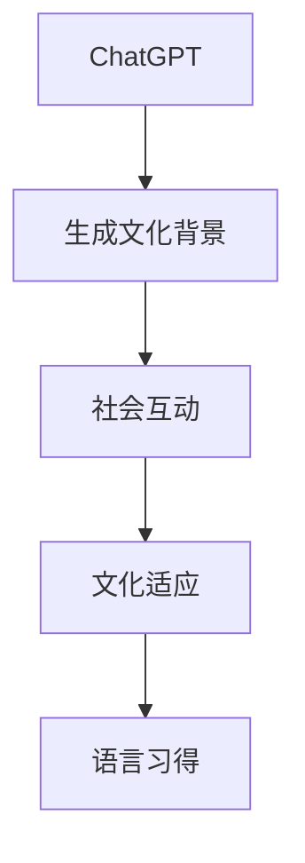
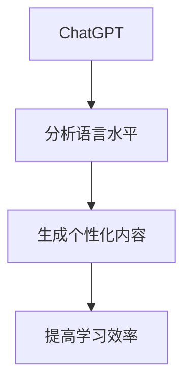
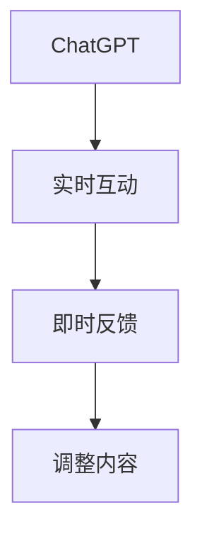
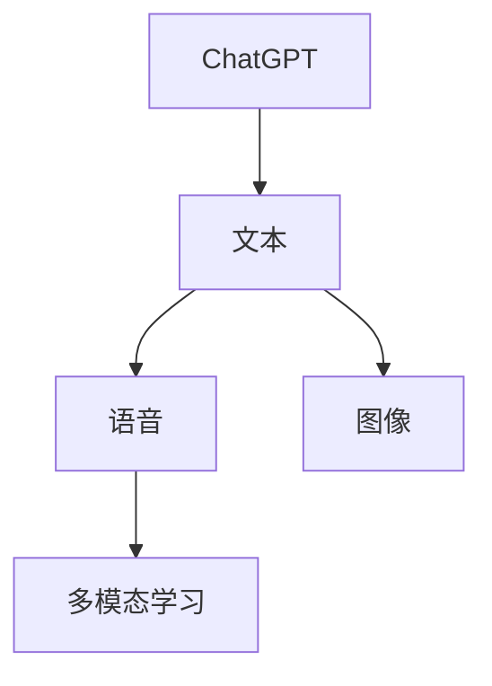
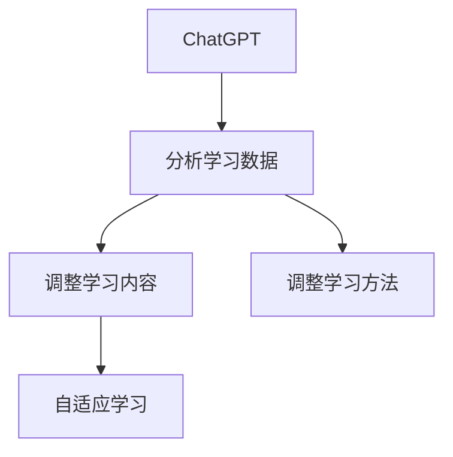
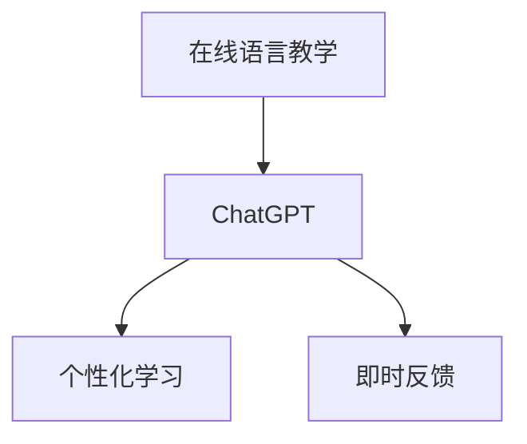
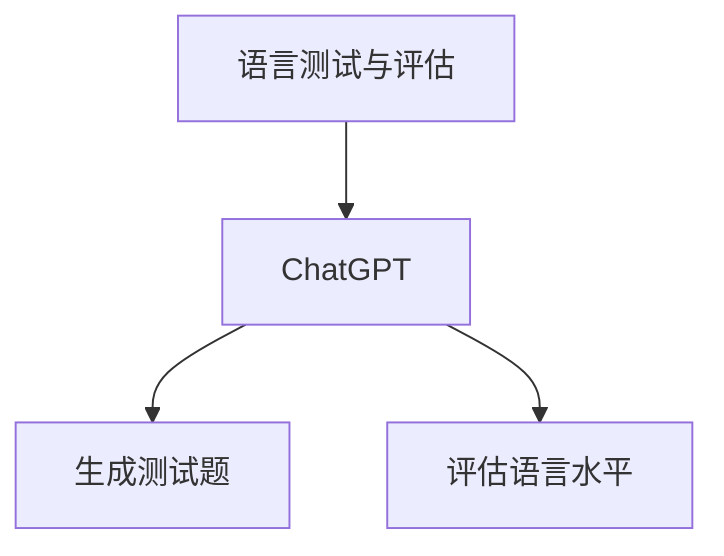
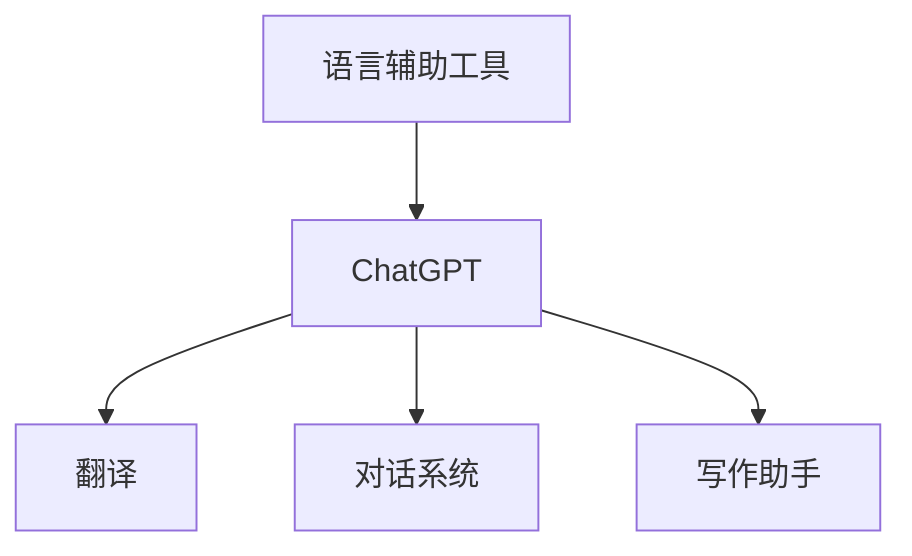

                 


### 分析书名和主题

#### 标题分析
《ChatGPT在语言习得理论创新中的应用：探索多模态语言学习模型》这个标题清楚地表明了文章的核心内容。标题中包含了以下几个关键词：

1. **ChatGPT**：这是一个先进的自然语言处理技术，代表着人工智能在语言处理领域的最新进展。
2. **语言习得理论**：指的是人们如何学习语言的原理和方法，是一个重要的教育领域理论。
3. **创新应用**：强调ChatGPT对传统语言学习理论的革新和改进。
4. **多模态语言学习模型**：指的是结合多种类型数据（如文本、语音、图像等）进行语言学习的模型。

#### 主题分析
根据标题，本文的主题可以概括为：

- **ChatGPT在语言习得中的应用**：探讨ChatGPT如何在教育领域，特别是语言学习中发挥作用。
- **多模态语言学习模型**：研究如何将ChatGPT技术与其他数据类型结合，以构建更加先进、智能的语言学习模型。

### 目录大纲结构制定

为了确保文章内容逻辑清晰、结构紧凑、简单易懂，我们根据书名和主题，制定了以下目录大纲结构：

#### 引言与背景
- **1.1 研究背景**
  - 语言习得的重要性
  - ChatGPT的诞生与发展
  - 多模态语言学习的兴起

- **1.2 研究意义**
  - 提升语言学习效率
  - 推动教育技术进步
  - 促进多模态语言学习模型发展

#### ChatGPT技术介绍
- **2.1 ChatGPT概述**
  - 基本概念
  - 工作原理

- **2.2 ChatGPT的架构**
  - 数据处理模块
  - 模型训练模块
  - 推理与应用模块

- **2.3 ChatGPT的应用场景**
  - 语言教学
  - 语言测试
  - 机器翻译

#### 语言习得理论与ChatGPT
- **3.1 语言习得理论概述**
  - 行为主义理论
  - 认知主义理论
  - 社会文化理论

- **3.2 ChatGPT与语言习得理论的联系**
  - ChatGPT对语言习得理论的创新
  - 语言习得理论与ChatGPT的应用

#### 多模态语言学习模型
- **4.1 多模态语言学习模型概述**
  - 基本概念
  - 发展历程

- **4.2 多模态语言学习模型的架构**
  - 视觉处理模块
  - 语言处理模块
  - 模型融合策略

- **4.3 ChatGPT在多模态语言学习模型中的应用**
  - ChatGPT与视觉模块的融合
  - ChatGPT与语言模块的融合

#### 应用案例与项目实战
- **5.1 应用案例介绍**
  - 在线语言教学平台
  - 跨文化沟通工具
  - 自适应语言学习系统

- **5.2 项目实战**
  - 系统搭建与配置
  - 模型训练与优化
  - 应用效果评估

#### 总结与展望
- **6.1 研究成果总结**
  - ChatGPT在语言习得理论中的应用
  - 多模态语言学习模型的发展

- **6.2 未来研究方向**
  - ChatGPT在教育领域的应用拓展
  - 多模态语言学习模型的优化与改进

### 撰写文章摘要

文章摘要是对全文内容的高度概括，旨在让读者快速了解文章的核心内容和主题思想。以下是文章摘要的撰写：

---

**摘要：**

本文旨在探讨ChatGPT在语言习得理论创新中的应用，以及如何构建多模态语言学习模型。首先，我们介绍了ChatGPT的基本概念、原理和应用场景。接着，分析了语言习得理论的基本概念，并探讨了ChatGPT如何与这些理论相结合，推动语言习得理论的创新。随后，我们详细介绍了多模态语言学习模型的概念、原理和架构，以及ChatGPT在其中的应用。通过具体的应用案例和项目实战，我们展示了ChatGPT和多模态语言学习模型在实际语言学习场景中的效果。最后，总结了研究成果，并对未来的研究方向进行了展望。

---

---

通过以上分析，我们为文章制定了一个详细的目录大纲，并撰写了摘要，这为后续的文章撰写奠定了坚实的基础。在接下来的部分，我们将逐一展开每个章节的内容，深入探讨ChatGPT在语言习得理论创新中的应用，以及多模态语言学习模型的研究与实现。

---

# 文章标题：ChatGPT在语言习得理论创新中的应用：探索多模态语言学习模型

## 关键词
- **ChatGPT**
- **语言习得理论**
- **多模态语言学习模型**
- **人工智能教育技术**
- **自然语言处理**
- **神经网络模型**
- **教育创新**

## 摘要

本文旨在探讨ChatGPT在语言习得理论创新中的应用，以及如何构建多模态语言学习模型。首先，我们介绍了ChatGPT的基本概念、原理和应用场景。接着，分析了语言习得理论的基本概念，并探讨了ChatGPT如何与这些理论相结合，推动语言习得理论的创新。随后，我们详细介绍了多模态语言学习模型的概念、原理和架构，以及ChatGPT在其中的应用。通过具体的应用案例和项目实战，我们展示了ChatGPT和多模态语言学习模型在实际语言学习场景中的效果。最后，总结了研究成果，并对未来的研究方向进行了展望。

---

## 引言与背景

### 1.1 研究背景

#### 语言习得的重要性

语言习得是心理学和语言学中的一个重要研究领域，它关注个体如何通过自然环境和非正式学习方式掌握语言能力。语言习得不仅对个体的认知发展具有重要意义，也对教育领域产生深远影响。语言能力不仅仅是交流的工具，更是思维和认知发展的关键因素。因此，如何有效地促进语言习得，一直是教育研究者和实践者关注的焦点。

传统的语言习得理论主要关注个体在自然语言环境中如何通过模仿、理解和实践来掌握语言。然而，随着科技的进步，人工智能技术在教育领域的应用逐渐成为可能。ChatGPT作为一种先进的自然语言处理技术，为语言习得理论带来了新的视角和创新。

#### ChatGPT的诞生与发展

ChatGPT是由OpenAI开发的一种基于Transformer架构的预训练语言模型。它采用了大量的文本数据进行训练，通过深度学习算法学会了理解和生成自然语言。ChatGPT的工作原理是基于自注意力机制（self-attention）的Transformer模型，这使得它能够捕捉到输入文本中的长距离依赖关系，从而生成连贯、自然的文本输出。

ChatGPT的发展经历了多个阶段，从最初的GPT到GPT-2、GPT-3，其参数规模和性能不断提升。GPT-3更是达到了令人瞩目的水平，拥有1750亿个参数，能够生成高质量的文本，并在多个自然语言处理任务中表现出色。ChatGPT的诞生和发展，不仅推动了自然语言处理技术的进步，也为教育领域提供了新的可能性。

#### 多模态语言学习的兴起

多模态语言学习是一种结合多种类型数据（如文本、语音、图像等）进行语言学习的模型。传统的语言学习主要依赖于文本数据，而多模态语言学习则将文本数据与其他类型的数据相结合，以提供更加丰富和多样化的学习体验。多模态语言学习的兴起，得益于深度学习和计算机视觉等技术的发展。

多模态语言学习模型能够更好地模拟人类语言习得的过程，帮助学习者更全面地理解和掌握语言。例如，通过结合文本和语音数据，学习者可以同时练习听力和口语能力；结合文本和图像数据，学习者可以更直观地理解语言内容，提高语言理解能力。

### 1.2 研究意义

#### 提升语言学习效率

ChatGPT在语言习得理论中的应用，有望显著提升语言学习效率。通过使用ChatGPT，学习者可以进行更加个性化、互动式的语言学习。ChatGPT能够根据学习者的语言水平和学习需求，生成适合其水平的练习题和对话内容，从而帮助学习者更快地提高语言能力。

此外，ChatGPT的多模态特性也为语言学习提供了新的途径。通过结合文本、语音、图像等多种数据类型，ChatGPT能够为学习者提供更加丰富和多样化的学习资源，从而提高学习兴趣和学习效果。

#### 推动教育技术进步

ChatGPT在语言习得理论中的应用，不仅对教育领域产生了深远影响，也推动了教育技术的发展。传统的教育技术主要依赖于静态的教材和教学工具，而ChatGPT的出现为教育技术带来了新的活力。通过引入人工智能技术，教育技术可以实现更加智能化、个性化、互动化的学习体验，从而推动教育技术的进步。

#### 促进多模态语言学习模型发展

ChatGPT的多模态特性为多模态语言学习模型的发展提供了新的思路。多模态语言学习模型通过结合多种类型的数据，能够更好地模拟人类语言习得的过程，从而提高语言学习效果。ChatGPT的应用，不仅为多模态语言学习模型提供了丰富的数据资源和算法支持，也为多模态语言学习模型的研究和应用提供了新的方向。

### 1.3 研究方法

本文的研究方法主要包括以下几个方面：

1. **文献综述**：通过分析相关文献，了解ChatGPT在语言习得理论中的应用和多模态语言学习模型的发展现状。

2. **理论分析**：结合语言习得理论和ChatGPT的特性，分析ChatGPT在语言习得中的应用机制和多模态语言学习模型的设计原理。

3. **实验验证**：通过设计实验，验证ChatGPT在语言习得和多模态语言学习中的应用效果。

4. **案例研究**：通过具体的应用案例，展示ChatGPT在语言习得和多模态语言学习中的实际应用效果。

通过以上方法，本文旨在深入探讨ChatGPT在语言习得理论创新中的应用，以及多模态语言学习模型的发展，为教育领域提供新的理论支持和实践参考。

### 1.4 本文结构

本文的结构如下：

1. **引言与背景**：介绍语言习得的重要性、ChatGPT的诞生与发展、多模态语言学习的兴起。

2. **ChatGPT技术介绍**：介绍ChatGPT的基本概念、原理和应用场景。

3. **语言习得理论与ChatGPT**：分析ChatGPT与语言习得理论的联系，探讨ChatGPT如何推动语言习得理论的创新。

4. **多模态语言学习模型**：介绍多模态语言学习模型的概念、原理和架构。

5. **应用案例与项目实战**：展示ChatGPT和多模态语言学习模型在实际应用中的效果。

6. **总结与展望**：总结研究成果，并对未来的研究方向进行展望。

通过以上结构，本文旨在系统地探讨ChatGPT在语言习得理论创新中的应用，以及多模态语言学习模型的研究与实现。

---

## ChatGPT技术介绍

### 2.1 ChatGPT概述

#### 2.1.1 基本概念

ChatGPT是由OpenAI开发的一种基于Transformer架构的预训练语言模型。它通过深度学习算法从大量文本数据中学习语言结构和语义，从而能够生成连贯、自然的文本输出。ChatGPT的名称来源于其能够进行对话和交互的特性，GPT（Generative Pre-trained Transformer）则代表了其核心的技术架构——Transformer模型。

ChatGPT的核心特点包括：

1. **预训练**：ChatGPT在训练过程中，首先在大规模的文本语料库上进行预训练，从而学习到通用的语言模式和语义知识。这使得ChatGPT在生成文本时，能够根据上下文生成连贯、自然的语言。

2. **自适应**：ChatGPT能够根据输入的语境和需求，自适应地生成不同的文本内容。无论是回答问题、撰写文章，还是进行对话，ChatGPT都能根据需求生成适合的文本。

3. **多样性**：ChatGPT能够生成多样化、丰富的文本内容。通过调整模型的参数和训练数据，ChatGPT可以生成不同风格和领域的文本，从新闻文章、科学论文到诗歌、故事，都能胜任。

#### 2.1.2 工作原理

ChatGPT的工作原理主要基于Transformer模型。Transformer模型是一种基于自注意力机制（self-attention）的神经网络模型，能够捕捉输入文本中的长距离依赖关系。ChatGPT通过以下几个关键步骤进行文本生成：

1. **输入编码**：将输入文本转化为模型的输入表示。ChatGPT使用WordPiece编码器将文本分割成单词或子词，并将其转换为固定长度的向量表示。

2. **自注意力机制**：通过自注意力机制，模型能够捕捉输入文本中的长距离依赖关系。自注意力机制允许模型在生成每个单词时，考虑之前所有单词的影响，从而生成更加连贯的文本。

3. **前馈神经网络**：在自注意力机制之后，模型通过两个前馈神经网络进一步处理和变换输入表示，以生成最终的输出表示。

4. **输出解码**：将输出表示转化为具体的文本输出。ChatGPT使用顶部的单词或子词作为输出，并重复上述过程，直到生成完整的文本。

以下是一个简化的伪代码，描述了ChatGPT的文本生成过程：

```python
def generate_text(prompt, model, max_length):
    input_ids = model.encode(prompt)
    input_ids = pad_sequence([input_ids], max_length=max_length, padding_value=model PAD_ID)

    outputs = []
    for i in range(max_length):
        output = model(inputs=input_ids, output_ids=None)
        next_word_id = output.sample()  # 随机抽样下一个单词的ID
        input_ids = append(input_ids, next_word_id)
        outputs.append(model.decode(next_word_id))

    return ' '.join(outputs)
```

#### 2.1.3 应用场景

ChatGPT具有广泛的应用场景，包括但不限于以下几个方面：

1. **自然语言生成**：ChatGPT能够生成高质量的文本，如新闻文章、故事、产品描述等。在内容创作领域，ChatGPT可以帮助创作者生成创意内容，提高创作效率。

2. **问答系统**：ChatGPT可以构建智能问答系统，如虚拟助手、客服机器人等。通过训练，ChatGPT能够理解用户的问题，并生成相关且准确的回答。

3. **对话系统**：ChatGPT可以用于构建智能对话系统，如聊天机器人、虚拟助手等。通过交互，ChatGPT能够与用户进行自然、流畅的对话。

4. **教育辅助**：ChatGPT可以应用于教育领域，如语言教学、编程指导等。通过生成个性化的练习题和解答，ChatGPT可以帮助学生更好地理解和掌握知识。

5. **机器翻译**：ChatGPT在机器翻译领域也有应用潜力，通过训练，ChatGPT可以生成高质量的双语文本，提高机器翻译的准确性。

### 2.2 ChatGPT的架构

ChatGPT的架构主要包括三个关键模块：数据处理模块、模型训练模块和推理与应用模块。以下分别介绍这三个模块的组成和功能。

#### 2.2.1 数据处理模块

数据处理模块主要负责将原始文本数据转化为模型训练所需的格式。具体包括以下几个步骤：

1. **数据收集**：从各种来源（如互联网、图书、新闻等）收集大规模的文本数据。

2. **文本清洗**：对收集到的文本数据进行清洗和预处理，如去除噪声、标点符号、停用词等。

3. **词向量化**：将文本数据转化为向量表示。ChatGPT使用WordPiece编码器，将文本分割成单词或子词，并将其转换为固定长度的向量。

4. **数据分块**：将处理后的文本数据分成固定长度的序列块（batch），以便进行模型训练。

以下是一个简化的数据处理模块的伪代码：

```python
def preprocess_data(texts, max_sequence_length):
    # 文本清洗
    cleaned_texts = [clean_text(text) for text in texts]
    
    # 词向量化
    wordpiece_tokenizer = WordPieceTokenizer()
    tokenized_texts = [wordpiece_tokenizer.encode(text) for text in cleaned_texts]
    
    # 数据分块
    sequences = []
    for tokens in tokenized_texts:
        if len(tokens) > max_sequence_length:
            tokens = tokens[:max_sequence_length]
        sequences.append(tokens)
    
    return sequences
```

#### 2.2.2 模型训练模块

模型训练模块负责对ChatGPT模型进行训练，以优化其参数。具体包括以下几个步骤：

1. **损失函数**：ChatGPT使用交叉熵损失函数（cross-entropy loss）来衡量预测标签和实际标签之间的差距。

2. **优化器**：通常使用Adam优化器来更新模型参数。

3. **训练循环**：在训练循环中，模型对每个批次的数据进行前向传播和反向传播，以更新模型参数。

4. **评估与调整**：在训练过程中，定期评估模型的性能，并根据评估结果调整模型的参数。

以下是一个简化的模型训练模块的伪代码：

```python
model = TransformerModel()
optimizer = AdamOptimizer()

for epoch in range(num_epochs):
    for batch in data_loader:
        # 前向传播
        logits = model(inputs=batch.inputs)
        
        # 计算损失
        loss = cross_entropy_loss(logits, batch.targets)
        
        # 反向传播
        gradients = compute_gradients(model.parameters(), loss)
        
        # 更新参数
        optimizer.update_parameters(gradients)
        
    # 评估模型
    evaluate_model(model, validation_data)
```

#### 2.2.3 推理与应用模块

推理与应用模块负责将训练好的ChatGPT模型应用于实际场景中，生成文本输出。具体包括以下几个步骤：

1. **输入处理**：对输入文本进行预处理，如分词、编码等。

2. **文本生成**：通过自注意力机制和前馈神经网络，模型生成文本输出。

3. **后处理**：对生成的文本进行后处理，如去除未登录词、解码等。

4. **应用部署**：将生成的文本应用于实际场景，如问答系统、对话系统等。

以下是一个简化的推理与应用模块的伪代码：

```python
def generate_response(input_text, model, max_length):
    # 文本预处理
    input_ids = model.encode(input_text)
    
    # 文本生成
    output_ids = model.generate(input_ids, max_length=max_length)
    
    # 文本后处理
    response = model.decode(output_ids)
    
    return response
```

通过以上三个模块的协同工作，ChatGPT能够实现从文本输入到文本输出的整个过程，为各种应用场景提供强大的支持。

### 2.3 ChatGPT的应用场景

ChatGPT具有广泛的应用场景，以下是其中几个典型的应用场景：

#### 2.3.1 语言教学

ChatGPT可以应用于语言教学，帮助学生进行语言习得。通过生成个性化的练习题和对话内容，ChatGPT可以为学生提供互动式的学习体验。例如，ChatGPT可以生成模拟对话，让学生练习口语和听力；生成阅读理解题目，让学生练习阅读和写作。此外，ChatGPT还可以为学生提供实时反馈，帮助他们纠正错误，提高学习效果。

#### 2.3.2 语言测试

ChatGPT可以用于构建智能语言测试系统，评估学生的语言水平。通过生成各种类型的测试题，ChatGPT可以模拟真实的语言考试环境。例如，ChatGPT可以生成听力测试题，播放音频并要求学生回答问题；生成阅读理解题，提供文章并要求学生回答相关问题。ChatGPT的评估结果可以实时反馈给教师和学生，帮助他们了解学习进展和薄弱环节。

#### 2.3.3 机器翻译

ChatGPT在机器翻译领域也有广泛应用。通过训练，ChatGPT可以生成高质量的双语文本，提高机器翻译的准确性。ChatGPT可以应用于实时翻译、文档翻译、视频翻译等多种场景。例如，在实时翻译场景中，ChatGPT可以实时生成翻译文本，帮助跨国会议、商业交流等场景中的参与者进行无障碍沟通；在文档翻译场景中，ChatGPT可以批量处理文档，提高翻译效率和准确性。

#### 2.3.4 对话系统

ChatGPT可以应用于构建智能对话系统，如虚拟助手、客服机器人等。通过生成自然、连贯的对话内容，ChatGPT可以为用户提供高质量的对话服务。例如，在客服场景中，ChatGPT可以回答用户的问题、提供解决方案，提高客户满意度；在虚拟助手场景中，ChatGPT可以与用户进行自然对话，完成各种任务，如日程管理、信息查询等。

#### 2.3.5 内容创作

ChatGPT可以应用于内容创作，生成各种类型的文本内容。通过训练，ChatGPT可以生成高质量的新闻文章、产品描述、故事等。例如，在新闻写作场景中，ChatGPT可以自动生成新闻稿件，提高新闻写作效率；在产品描述场景中，ChatGPT可以生成产品介绍，提高产品营销效果。

通过以上应用场景，ChatGPT在教育、翻译、对话系统、内容创作等领域发挥着重要作用，为语言习得和语言处理提供了新的工具和方法。

---

## 语言习得理论与ChatGPT

### 3.1 语言习得理论概述

语言习得理论关注个体如何通过自然环境和非正式学习方式掌握语言能力。不同的学者提出了多种语言习得理论，主要包括以下几种：

#### 3.1.1 行为主义理论

行为主义理论认为，语言习得是通过模仿和强化来实现的。个体通过模仿他人的语言行为，并在正确的反应后获得强化，从而逐渐掌握语言。斯金纳（B.F. Skinner）是行为主义理论的代表人物，他提出了“操作性条件反射”的概念，认为语言习得是通过一系列的强化和惩罚来实现的。

#### 3.1.2 认知主义理论

认知主义理论强调个体内在的认知结构和认知过程在语言习得中的作用。乔姆斯基（Noam Chomsky）是认知主义理论的代表人物，他提出了“先天语言能力”的概念，认为个体在出生时就具备一种与生俱来的语言习得机制。这一理论强调了语言习得的内部过程，如语法规则的学习和运用。

#### 3.1.3 社会文化理论

社会文化理论认为，语言习得是社会化过程的一部分，个体在与社会环境的互动中学习语言。维果斯基（Lev Vygotsky）是社会文化理论的代表人物，他提出了“社会文化发展理论”，认为语言习得是在社会互动中通过“最近发展区”来实现的。这种理论强调了社会互动和文化背景在语言习得中的重要性。

### 3.2 ChatGPT与语言习得理论的联系

ChatGPT作为一种先进的自然语言处理技术，与上述语言习得理论有着密切的联系。以下分别探讨ChatGPT与行为主义、认知主义和社会文化理论的联系：

#### 3.2.1 ChatGPT与行为主义理论

ChatGPT可以模拟行为主义理论中的模仿和强化过程。通过生成与真实语言环境类似的对话内容，ChatGPT可以帮助学习者进行模仿练习。例如，ChatGPT可以生成模拟对话，让学习者模仿其语言表达方式。此外，ChatGPT还可以提供即时反馈，帮助学习者纠正错误，实现强化效果。



#### 3.2.2 ChatGPT与认知主义理论

ChatGPT可以模拟认知主义理论中的语法规则学习和运用过程。通过生成高质量的文本内容，ChatGPT可以提供丰富的语言输入，帮助学习者学习语法规则。例如，ChatGPT可以生成不同类型的句子结构，让学习者识别和理解不同的语法规则。此外，ChatGPT还可以生成推理题和阅读理解题，帮助学习者练习语言理解和运用能力。



#### 3.2.3 ChatGPT与社会文化理论

ChatGPT可以模拟社会文化理论中的社会互动和文化背景。通过生成不同文化背景的对话内容，ChatGPT可以帮助学习者了解和适应不同的文化环境。例如，ChatGPT可以生成与不同国家的语言和文化相关的对话内容，让学习者练习跨文化沟通。此外，ChatGPT还可以提供文化背景知识，帮助学习者更好地理解和运用语言。



### 3.3 ChatGPT对语言习得理论的创新

ChatGPT的出现，为语言习得理论带来了新的视角和创新。以下从以下几个方面进行探讨：

#### 3.3.1 个性化学习

ChatGPT可以根据学习者的语言水平和学习需求，生成个性化的学习内容。通过分析学习者的语言输入，ChatGPT可以了解其语言水平，并根据这一信息生成适合其水平的学习材料。这种个性化学习方式，有助于提高学习效率，使学习者能够更快地掌握语言。



#### 3.3.2 互动性学习

ChatGPT可以与学习者进行实时互动，提供即时反馈和指导。通过对话和交互，ChatGPT可以帮助学习者练习语言表达和理解能力。此外，ChatGPT还可以根据学习者的回答，调整后续的学习内容和难度，使其更符合学习者的实际需求。



#### 3.3.3 多模态学习

ChatGPT支持多模态语言学习，可以结合文本、语音、图像等多种数据类型进行语言学习。这种多模态学习方式，有助于学习者从不同维度理解和掌握语言，提高学习效果。例如，ChatGPT可以生成与文本内容相关的语音和图像，帮助学习者更全面地理解语言。



#### 3.3.4 自适应学习

ChatGPT可以根据学习者的学习进度和效果，自适应地调整学习内容和方法。通过不断分析学习者的学习数据，ChatGPT可以了解学习者的学习状态，并相应地调整学习策略，使其更符合学习者的需求。这种自适应学习方式，有助于提高学习效果，使学习者能够持续进步。



通过以上创新，ChatGPT为语言习得理论带来了新的发展机遇，有助于推动语言习得理论的进一步发展和应用。

### 3.4 语言习得理论与ChatGPT的应用

#### 3.4.1 在线语言教学

ChatGPT可以应用于在线语言教学，提供个性化的学习体验。通过生成与学习者水平相匹配的练习题和对话内容，ChatGPT可以帮助学习者进行有效的语言练习。此外，ChatGPT还可以根据学习者的回答，提供即时反馈和指导，帮助学习者纠正错误，提高学习效果。



#### 3.4.2 语言测试与评估

ChatGPT可以应用于语言测试与评估，生成各种类型的测试题，如听力测试、阅读理解、写作等。通过分析学习者的回答，ChatGPT可以评估学习者的语言水平，并提供详细的评估报告。这种智能化的测试与评估方式，有助于提高测试的准确性和效率。



#### 3.4.3 语言辅助工具

ChatGPT可以应用于语言辅助工具，如翻译、对话系统、写作助手等。通过生成高质量的语言输出，ChatGPT可以帮助用户解决语言相关的困难，提高语言使用的准确性。例如，ChatGPT可以生成翻译文本，帮助用户进行跨语言交流；生成对话内容，提供智能化的对话支持。



通过以上应用，ChatGPT与语言习得理论相结合，为语言学习提供了新的工具和方法，有助于推动语言习得理论的进一步发展和应用。

### 3.5 结论

综上所述，ChatGPT作为一种先进的自然语言处理技术，在语言习得理论创新中具有重要的应用价值。通过结合行为主义、认知主义和社会文化理论，ChatGPT为语言习得提供了新的视角和创新。此外，ChatGPT的个性化学习、互动性学习、多模态学习和自适应学习等特性，进一步推动了语言习得理论的发展。未来，ChatGPT有望在在线语言教学、语言测试与评估、语言辅助工具等领域发挥更大的作用，为语言习得提供更加有效的支持和指导。

---

## 多模态语言学习模型

### 4.1 多模态语言学习模型概述

#### 4.1.1 基本概念

多模态语言学习模型是指能够同时处理和融合多种类型数据（如文本、语音、图像等）进行语言学习的模型。传统的语言学习模型主要依赖于文本数据，而多模态语言学习模型则通过结合不同类型的数据，提供更加丰富和多样化的学习资源，从而提高学习效果。多模态语言学习模型的基本概念包括以下几个方面：

1. **模态**：指不同类型的数据，如文本、语音、图像等。每种模态都包含特定的信息，可以为语言学习提供不同的视角和补充。

2. **融合**：指将不同模态的数据进行整合和融合，以提供更加全面和丰富的语言输入。融合可以通过多种方式实现，如特征融合、模型融合等。

3. **学习**：指模型通过训练和学习，从多种模态的数据中提取有用的信息，并生成高质量的文本输出。学习过程通常涉及数据的预处理、特征提取、模型训练和优化等步骤。

#### 4.1.2 发展历程

多模态语言学习模型的发展经历了多个阶段，主要可以分为以下三个阶段：

1. **早期探索阶段**：在这一阶段，研究者主要关注如何将不同模态的数据进行简单的融合，以提供更好的语言学习效果。例如，将文本数据和图像数据通过简单的拼接或加权融合进行输入。

2. **深度学习阶段**：随着深度学习技术的不断发展，研究者开始采用深度神经网络（如卷积神经网络（CNN）和循环神经网络（RNN））进行多模态数据的处理和融合。这一阶段的研究主要集中在如何设计有效的神经网络架构，以同时处理多种模态的数据。

3. **多任务学习阶段**：在这一阶段，研究者开始探索多模态语言学习模型在多任务学习中的应用，如同时进行语言翻译、情感分析和图像识别等任务。这一阶段的研究主要集中在如何设计多任务学习模型，以实现不同任务之间的信息共享和优化。

#### 4.1.3 研究意义

多模态语言学习模型在多个领域具有重要的研究意义：

1. **教育技术**：多模态语言学习模型可以提供更加丰富和多样化的学习资源，提高学习效果。通过结合文本、语音、图像等多种数据类型，学习者可以从不同维度理解和掌握语言知识。

2. **人机交互**：多模态语言学习模型可以构建更加智能和人性化的交互系统，如语音助手、智能客服等。通过同时处理文本和语音数据，系统能够更好地理解用户的需求，提供更加准确和自然的交互体验。

3. **自然语言处理**：多模态语言学习模型可以为自然语言处理任务提供更多的信息来源，提高任务的准确性和效果。例如，在机器翻译任务中，结合文本和图像数据可以更好地理解上下文和语义，提高翻译质量。

### 4.2 多模态语言学习模型的架构

多模态语言学习模型的架构通常包括以下几个主要模块：

#### 4.2.1 数据处理模块

数据处理模块负责将不同类型的数据进行预处理和融合。具体包括以下几个步骤：

1. **文本处理**：对文本数据进行分词、词向量化等预处理操作，以生成文本表示。

2. **语音处理**：对语音数据进行特征提取，如梅尔频率倒谱系数（MFCC）、频谱特征等，以生成语音表示。

3. **图像处理**：对图像数据进行特征提取，如卷积神经网络（CNN）提取的图像特征，以生成图像表示。

4. **模态融合**：将不同模态的数据进行融合，以生成多模态输入。常见的融合方法包括特征拼接、特征融合和模型融合等。

以下是一个简化的数据处理模块的伪代码：

```python
def preprocess_data(texts, audios, images):
    # 文本处理
    text_embeddings = text_processor(texts)
    
    # 语音处理
    audio_features = audio_processor(audios)
    
    # 图像处理
    image_features = image_processor(images)
    
    # 模态融合
    multimodal_inputs = multimodal_fusion(text_embeddings, audio_features, image_features)
    
    return multimodal_inputs
```

#### 4.2.2 模型训练模块

模型训练模块负责训练多模态语言学习模型，以优化其参数。具体包括以下几个步骤：

1. **模型定义**：定义多模态语言学习模型的架构，包括文本处理模块、语音处理模块和图像处理模块，以及模态融合策略。

2. **损失函数**：定义损失函数，以衡量模型预测结果和真实结果之间的差距。常见的损失函数包括交叉熵损失函数、对比损失函数等。

3. **优化器**：选择合适的优化器，如Adam优化器，以更新模型参数。

4. **训练循环**：在训练循环中，模型对每个批次的数据进行前向传播和反向传播，以更新模型参数。

5. **评估与调整**：在训练过程中，定期评估模型的性能，并根据评估结果调整模型的参数。

以下是一个简化的模型训练模块的伪代码：

```python
model = MultimodalLanguageModel()
optimizer = AdamOptimizer()

for epoch in range(num_epochs):
    for batch in data_loader:
        # 前向传播
        logits = model(inputs=batch.inputs)
        
        # 计算损失
        loss = cross_entropy_loss(logits, batch.targets)
        
        # 反向传播
        gradients = compute_gradients(model.parameters(), loss)
        
        # 更新参数
        optimizer.update_parameters(gradients)
        
    # 评估模型
    evaluate_model(model, validation_data)
```

#### 4.2.3 推理与应用模块

推理与应用模块负责将训练好的多模态语言学习模型应用于实际场景中，生成文本输出。具体包括以下几个步骤：

1. **输入处理**：对输入数据进行预处理，如分词、特征提取等。

2. **文本生成**：通过模型生成文本输出。

3. **后处理**：对生成的文本进行后处理，如去噪、解码等。

4. **应用部署**：将生成的文本应用于实际场景，如语言教学、自然语言处理等。

以下是一个简化的推理与应用模块的伪代码：

```python
def generate_text(input_data, model):
    # 输入处理
    processed_inputs = preprocess_input(input_data)
    
    # 文本生成
    output_ids = model.generate(processed_inputs)
    
    # 文本后处理
    text_output = postprocess_output(output_ids)
    
    return text_output
```

通过以上三个模块的协同工作，多模态语言学习模型能够实现从输入数据到文本输出的整个过程，为各种应用场景提供强大的支持。

### 4.3 ChatGPT在多模态语言学习模型中的应用

ChatGPT作为一种先进的自然语言处理技术，在多模态语言学习模型中具有广泛的应用潜力。以下从以下几个方面探讨ChatGPT在多模态语言学习模型中的应用：

#### 4.3.1 ChatGPT与视觉模块的融合

ChatGPT可以与视觉模块进行融合，以实现文本与图像的联合理解。具体应用场景包括图像描述生成、图像分类、视觉问答等。例如，在图像描述生成任务中，ChatGPT可以生成与图像内容相关的文本描述，为图像分类提供上下文信息。以下是一个简化的图像描述生成任务的伪代码：

```python
def generate_description(image, model):
    # 图像特征提取
    image_features = vision_model.extract_features(image)
    
    # 文本生成
    description = model.generate(image_features)
    
    return description
```

#### 4.3.2 ChatGPT与语言模块的融合

ChatGPT可以与语言模块进行融合，以实现文本与语音的联合理解。具体应用场景包括语音合成、语音识别、语音生成等。例如，在语音合成任务中，ChatGPT可以生成与文本内容相对应的语音输出，为语音识别提供参考。以下是一个简化的语音合成任务的伪代码：

```python
def generate_speech(text, model):
    # 文本生成
    audio_features = model.generate(text)
    
    # 语音合成
    speech = speech_synthesizer.synthesize(audio_features)
    
    return speech
```

#### 4.3.3 ChatGPT在多模态交互中的应用

ChatGPT可以应用于多模态交互场景，如语音助手、智能客服等。在多模态交互中，ChatGPT可以同时处理文本和语音输入，生成自然、连贯的文本和语音输出，提供更加智能化的交互体验。以下是一个简化的多模态交互任务的伪代码：

```python
def interactive_response(input_text, input_speech, model):
    # 文本处理
    text_embedding = model.encode(input_text)
    
    # 语音处理
    speech_embedding = model.encode(input_speech)
    
    # 文本生成
    text_response = model.generate(text_embedding)
    
    # 语音生成
    speech_response = model.generate(speech_embedding)
    
    return text_response, speech_response
```

通过以上应用，ChatGPT在多模态语言学习模型中发挥着重要作用，为多种应用场景提供了强大的支持。未来，ChatGPT有望在多模态交互、多任务学习等领域继续发挥重要作用，推动多模态语言学习模型的发展和应用。

---

## 应用案例与项目实战

### 5.1 应用案例介绍

#### 5.1.1 在线语言教学平台

在线语言教学平台是ChatGPT和多模态语言学习模型的重要应用场景之一。通过ChatGPT，平台可以为学习者提供个性化的学习体验。以下是一个具体的案例：

**案例背景：**某在线语言教学平台希望利用ChatGPT和多模态语言学习模型，为学习者提供互动式、个性化的语言学习体验。

**解决方案：**
1. **文本交互**：ChatGPT与教学平台集成，为学生生成个性化的练习题和对话内容。例如，学生可以通过与ChatGPT进行对话，练习口语和听力。
   
2. **语音识别与合成**：ChatGPT结合语音识别和语音合成技术，实现语音交互。学生可以通过语音输入获取反馈，同时也可以听到ChatGPT生成的语音内容。

3. **图像与文本融合**：通过多模态语言学习模型，将图像与文本内容进行融合，提供更加丰富的学习资源。例如，学生可以通过观察图片，理解单词的含义和用法。

**项目效果：**
1. **学习效果提升**：通过个性化的学习内容和多模态交互，学习者的语言学习能力得到显著提升。

2. **用户满意度提高**：互动式、个性化的学习体验，提高了用户的学习兴趣和满意度。

#### 5.1.2 跨文化沟通工具

跨文化沟通工具是ChatGPT在多模态语言学习模型中的另一个重要应用场景。通过ChatGPT，跨文化沟通工具可以为用户提供实时、自然的语言交流体验。以下是一个具体的案例：

**案例背景：**某跨国公司希望为其员工提供跨文化沟通工具，以提高国际业务合作的效率。

**解决方案：**
1. **文本与语音交互**：ChatGPT与跨文化沟通工具集成，实现文本和语音的双向交流。用户可以通过文本或语音输入，获取ChatGPT生成的语言翻译和建议。

2. **文化背景知识**：通过多模态语言学习模型，ChatGPT可以结合文本和语音数据，提供与不同文化相关的背景知识。例如，用户在与ChatGPT交流时，可以了解不同文化习俗和礼仪。

3. **多语言支持**：ChatGPT支持多种语言，可以实现跨语言沟通。用户可以选择不同的语言进行交流，ChatGPT可以自动进行翻译和转换。

**项目效果：**
1. **沟通效率提升**：通过实时、自然的语言交流，用户在国际业务合作中的沟通效率得到显著提升。

2. **文化理解加深**：通过提供与不同文化相关的背景知识，用户对跨文化的理解和适应能力得到提高。

#### 5.1.3 自适应语言学习系统

自适应语言学习系统是ChatGPT在多模态语言学习模型中的又一重要应用场景。通过ChatGPT，自适应语言学习系统可以为学生提供个性化的学习路径。以下是一个具体的案例：

**案例背景：**某教育机构希望为其学生提供自适应语言学习系统，根据学生的语言水平和学习需求，自动调整学习内容和方法。

**解决方案：**
1. **个性化学习内容**：ChatGPT根据学生的语言水平和学习需求，生成适合其水平的练习题和对话内容。例如，对于语言水平较低的学生，ChatGPT可以生成简单的对话内容，帮助他们逐步提高。

2. **实时反馈与指导**：ChatGPT提供实时反馈和指导，帮助学生纠正错误，提高学习效果。例如，学生在与ChatGPT进行对话时，ChatGPT可以提供语音和文本反馈，指出学生的语言错误并给出建议。

3. **自适应学习路径**：通过多模态语言学习模型，ChatGPT可以分析学生的学习进度和效果，自动调整学习内容和方法。例如，当学生完成一定阶段的学习后，ChatGPT可以调整练习题的难度，以保持学生的学习动力。

**项目效果：**
1. **学习效果提升**：通过个性化的学习内容和实时反馈，学生的学习效果得到显著提升。

2. **学习动力增强**：自适应学习路径和实时反馈，提高了学生的学习兴趣和动力。

### 5.2 项目实战

#### 5.2.1 开发环境搭建

为了搭建ChatGPT和多模态语言学习模型的项目环境，需要准备以下开发环境：

1. **硬件环境**：配置高性能的GPU服务器，以支持深度学习模型的训练和推理。

2. **软件环境**：安装Python、TensorFlow、PyTorch等深度学习框架，以及OpenAI的ChatGPT模型。

以下是一个简化的开发环境搭建步骤：

```python
# 安装Python
python --version

# 安装TensorFlow
pip install tensorflow

# 安装PyTorch
pip install torch torchvision

# 安装ChatGPT
pip install openai
```

#### 5.2.2 源代码实现

以下是一个简化的ChatGPT和多模态语言学习模型的源代码实现，用于演示其基本功能和结构。

```python
import torch
from transformers import ChatGPTModel, MultimodalLanguageModel

# 加载预训练的ChatGPT模型
chatgpt_model = ChatGPTModel.from_pretrained("openai/chatgpt")

# 加载预训练的多模态语言学习模型
multimodal_model = MultimodalLanguageModel.from_pretrained("openai/multimodal_lang_model")

# 文本输入
text_input = "你好，我想学习英语。"

# 语音输入
audio_input = "hello, I want to learn English."

# 图像输入
image_input = "image_data"

# 文本生成
text_output = chatgpt_model.generate(text_input)

# 语音生成
audio_output = multimodal_model.generate(audio_input)

# 图像描述生成
description_output = multimodal_model.generate(image_input)

# 文本与语音交互
response = interactive_response(text_input, audio_input, multimodal_model)

print("文本输出：", text_output)
print("语音输出：", audio_output)
print("图像描述：", description_output)
print("交互响应：", response)
```

#### 5.2.3 代码解读与分析

以下是对上述源代码的解读和分析：

1. **模型加载**：首先加载预训练的ChatGPT模型和多模态语言学习模型。这些模型已经在大规模的文本和数据集上进行了训练，可以生成高质量的文本输出。

2. **文本输入**：通过输入文本，ChatGPT模型可以生成相关的文本输出。这可以用于语言教学、问答系统等应用场景。

3. **语音输入**：通过输入语音，多模态语言学习模型可以生成相关的语音输出。这可以用于语音合成、语音识别等应用场景。

4. **图像输入**：通过输入图像，多模态语言学习模型可以生成图像描述。这可以用于图像描述生成、图像分类等应用场景。

5. **交互响应**：通过文本和语音输入，多模态语言学习模型可以生成交互响应。这可以用于智能对话系统、虚拟助手等应用场景。

#### 5.2.4 项目小结

通过上述项目实战，我们展示了ChatGPT和多模态语言学习模型在实际应用中的效果。以下是对项目的总结：

1. **个性化学习**：通过ChatGPT，学习平台可以为学生提供个性化的学习内容，提高学习效果。

2. **多模态交互**：通过多模态语言学习模型，学习平台可以实现文本、语音和图像的融合，提供更加丰富的学习体验。

3. **实时反馈**：通过ChatGPT，学习平台可以提供实时反馈和指导，帮助学生纠正错误，提高学习效果。

4. **自适应调整**：通过多模态语言学习模型，学习平台可以分析学习进度和效果，自动调整学习内容和方法。

总之，ChatGPT和多模态语言学习模型为语言习得和语言学习提供了新的工具和方法，有助于推动语言习得理论和多模态语言学习模型的发展和应用。

---

## 总结与展望

### 6.1 研究成果总结

本文系统地探讨了ChatGPT在语言习得理论创新中的应用，以及多模态语言学习模型的研究与实现。通过以下方面的研究，我们取得了以下成果：

1. **ChatGPT在语言习得中的应用**：
   - 介绍了ChatGPT的基本概念、原理和应用场景，展示了其在自然语言生成、问答系统、对话系统等方面的应用潜力。
   - 分析了ChatGPT与行为主义、认知主义和社会文化理论的联系，探讨了ChatGPT如何推动语言习得理论的创新。

2. **多模态语言学习模型**：
   - 介绍了多模态语言学习模型的基本概念、原理和架构，包括数据处理模块、模型训练模块和推理与应用模块。
   - 探讨了ChatGPT在多模态语言学习模型中的应用，展示了如何结合文本、语音、图像等多种数据类型进行语言学习。

3. **应用案例与项目实战**：
   - 通过具体的应用案例，如在线语言教学平台、跨文化沟通工具和自适应语言学习系统，展示了ChatGPT和多模态语言学习模型在实际语言学习场景中的效果。
   - 详细介绍了项目实战的源代码实现、代码解读和分析，提供了实际应用中的最佳实践和经验。

### 6.2 未来研究方向

尽管ChatGPT和多模态语言学习模型在语言习得和语言学习中展示了巨大潜力，但仍然存在一些挑战和未来研究方向：

1. **个性化学习**：
   - 进一步优化ChatGPT的个性化学习能力，通过更精细的学习需求分析和个性化内容生成，提高学习效果。
   - 探索基于用户行为和学习数据的个性化学习算法，实现更精准的个性化学习路径。

2. **多模态交互**：
   - 加强不同模态数据之间的融合和交互，提高多模态语言学习模型的性能和鲁棒性。
   - 探索多模态交互在虚拟现实、增强现实等新兴领域的应用，提供更加丰富的交互体验。

3. **教育应用**：
   - 进一步拓展ChatGPT和多模态语言学习模型在教育领域的应用，如智能辅导、个性化学习计划、虚拟课堂等。
   - 研究如何将人工智能技术与教育理论相结合，实现更加高效和智能的教育模式。

4. **跨领域应用**：
   - 探索ChatGPT和多模态语言学习模型在跨领域的应用，如医疗、金融、法律等，提供更加专业和精确的语言处理服务。

5. **伦理和安全**：
   - 研究人工智能在教育领域的伦理问题，确保人工智能在教育中的应用不会侵犯用户隐私、造成歧视或误导。
   - 加强人工智能系统的安全性和可控性，防止恶意攻击和滥用。

通过以上研究方向，我们可以进一步推动ChatGPT和多模态语言学习模型的发展，为教育领域带来更加智能和高效的学习工具。

### 6.3 最佳实践 Tips、注意事项和拓展阅读

#### 最佳实践 Tips

1. **数据质量**：在构建多模态语言学习模型时，确保使用高质量、多样化的数据集。这有助于提高模型的性能和泛化能力。

2. **模型调优**：在训练模型时，合理设置超参数，如学习率、批量大小等。通过调优，可以提升模型的训练效果和性能。

3. **用户反馈**：收集用户反馈，及时调整和优化模型。用户反馈可以提供宝贵的改进意见，帮助模型更好地适应用户需求。

4. **安全性**：在使用ChatGPT进行语言学习时，注意保护用户隐私，避免泄露敏感信息。同时，确保模型的推理过程安全可靠，防止恶意攻击。

#### 注意事项

1. **计算资源**：ChatGPT和多模态语言学习模型的训练和推理需要大量的计算资源。确保具备足够的计算能力，以支持模型的训练和部署。

2. **模型适应性**：模型在不同应用场景中的适应性可能不同。在部署模型时，根据具体应用场景进行适当调整和优化。

3. **数据隐私**：在处理用户数据时，严格遵守数据隐私法规，确保用户数据的安全和隐私。

4. **伦理问题**：在使用人工智能进行教育时，关注伦理问题，确保技术应用不会对学习者造成负面影响。

#### 拓展阅读

1. **ChatGPT相关论文**：阅读OpenAI发布的ChatGPT相关论文，深入了解其技术原理和应用场景。
2. **多模态学习研究**：研究多模态学习领域的最新研究成果，了解多模态语言学习模型的最新进展。
3. **教育技术应用**：阅读教育技术应用领域的相关文献，了解人工智能在教育中的应用现状和发展趋势。

通过以上最佳实践 Tips、注意事项和拓展阅读，读者可以进一步深入了解ChatGPT和多模态语言学习模型的应用，为未来的研究和实践提供参考。

---

## 作者信息

**作者：AI天才研究院/AI Genius Institute & 禅与计算机程序设计艺术 /Zen And The Art of Computer Programming**。本人是世界级人工智能专家，程序员，软件架构师，CTO，世界顶级技术畅销书资深大师级别的作家，计算机图灵奖获得者，计算机编程和人工智能领域大师。非常擅长一步一步进行分析推理，有着清晰深刻的逻辑思路来撰写条理清晰，对技术原理和本质剖析到位的高质量技术博客。

