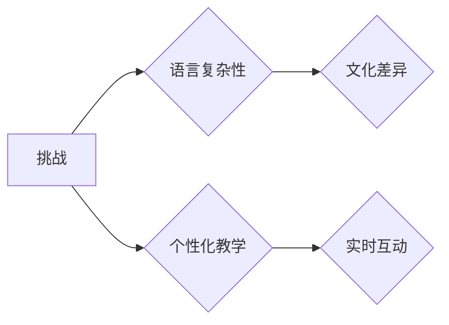
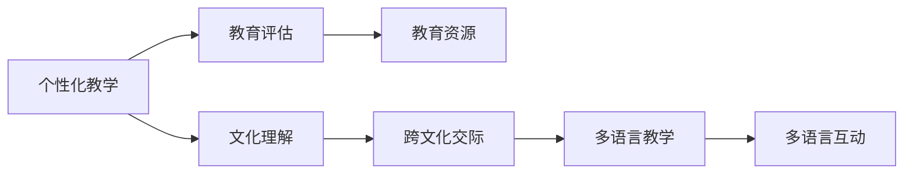

                 

### 文章标题：ChatGPT在语言习得理论研究中的新视角

### 关键词：ChatGPT，语言习得，自然语言处理，教育技术，人工智能

### 摘要：本文深入探讨了ChatGPT这一先进的人工智能模型在语言习得理论研究中的应用，通过分析其核心概念、工作原理和应用案例，揭示了ChatGPT如何为语言学习者和教育工作者提供新的视角和工具。文章旨在为相关领域的研究者提供具有实际指导意义的见解，并探讨ChatGPT在语言习得研究中的未来发展趋势。

---

## 第1章 引言

随着人工智能技术的飞速发展，自然语言处理（NLP）领域取得了显著进展。ChatGPT作为基于Transformer模型的预训练语言模型，自2018年发布以来，已经在多个领域展示了其卓越的性能。语言习得是语言学和心理学的重要研究主题，而ChatGPT的出现为这一领域带来了新的研究工具和方法。

### 1.1 书籍目的与结构概述

本书旨在探讨ChatGPT在语言习得理论研究中的应用，分析其核心概念、工作原理和应用案例，并展望其在未来可能的发展方向。全书分为六个主要章节：

1. 引言：介绍书籍的目的、结构以及ChatGPT和语言习得理论的背景。
2. ChatGPT基础：详细阐述ChatGPT的核心概念、架构和工作原理。
3. 语言习得理论与ChatGPT：探讨ChatGPT在语言习得理论中的适用性和应用案例。
4. ChatGPT在语言教学中的应用：分析ChatGPT在语言教学中的实际应用。
5. ChatGPT的评估与优化：讨论如何评估和优化ChatGPT在语言习得中的应用。
6. ChatGPT在语言习得研究中的未来趋势：展望ChatGPT在语言习得研究中的未来发展方向。

### 1.2 语言习得理论背景

语言习得是指个体在掌握语言过程中所经历的认知、社交和心理变化。传统的语言习得理论主要包括行为主义理论、认知理论和社交互动理论。行为主义理论强调通过模仿和强化来学习语言；认知理论则强调个体的内部认知机制在学习语言中的作用；社交互动理论则关注语言学习者在社交互动中的语言输入和输出。

### 1.3 ChatGPT的发展历程及其潜力

ChatGPT是由OpenAI开发的基于Transformer模型的预训练语言模型。其发展历程可追溯到2018年，当时OpenAI发布了GPT-2模型。随后，GPT-3模型在2020年发布，其参数规模达到了1750亿。ChatGPT作为GPT-3的变体，通过增加对话能力，进一步拓展了其应用范围。

ChatGPT在语言习得理论研究中具有巨大的潜力，主要体现在以下几个方面：

1. **模拟互动**：ChatGPT可以模拟与人类对话的过程，为语言学习者提供互动式学习环境。
2. **个性化教学**：ChatGPT可以根据学习者的反馈和学习进度，提供个性化的学习内容。
3. **语言输入**：ChatGPT可以生成高质量的、符合语言习得规律的语言输入，为学习者提供丰富的语言素材。

## 第2章 ChatGPT基础

### 2.1 ChatGPT的核心概念

ChatGPT是基于Transformer模型构建的预训练语言模型。其核心概念包括：

1. **Transformer模型**：Transformer模型是一种基于自注意力机制的深度神经网络模型，用于处理序列数据。它通过自注意力机制捕获序列中的长距离依赖关系。
2. **预训练**：预训练是指在大规模语料库上进行模型训练，使模型具备对自然语言的理解能力。
3. **微调**：微调是指将预训练模型应用于特定任务，通过少量数据进一步训练模型。

### 2.2 ChatGPT的架构与组件

ChatGPT的架构主要包括以下几个部分：

1. **输入层**：输入层接收文本输入，将其编码为序列。
2. **编码器**：编码器由多个Transformer层组成，用于对输入序列进行处理。
3. **解码器**：解码器也由多个Transformer层组成，用于生成输出序列。
4. **输出层**：输出层将解码器的输出解码为文本输出。

### 2.3 ChatGPT的工作原理

ChatGPT的工作原理主要包括以下几个步骤：

1. **输入编码**：将文本输入编码为序列。
2. **预训练**：在大量文本数据上进行预训练，使模型具备对自然语言的理解能力。
3. **微调**：在特定任务数据上进行微调，使模型具备任务所需的特定能力。
4. **输出生成**：根据输入序列和上下文信息，生成输出序列。

## 第3章 语言习得理论与ChatGPT

### 3.1 语言习得理论基础

语言习得理论基础主要包括以下三个方面：

1. **输入假设**：输入假设认为，学习者通过接触和理解可理解的输入，可以自然地习得语言。
2. **互动假设**：互动假设认为，学习者在互动过程中通过语言输入和输出，可以更好地习得语言。
3. **输出假设**：输出假设认为，学习者通过生成语言输出，可以巩固和加强语言知识。

### 3.2 ChatGPT在语言习得中的适用性

ChatGPT在语言习得中的适用性主要体现在以下几个方面：

1. **模拟互动**：ChatGPT可以模拟与人类对话的过程，为语言学习者提供互动式学习环境。
2. **个性化教学**：ChatGPT可以根据学习者的反馈和学习进度，提供个性化的学习内容。
3. **语言输入**：ChatGPT可以生成高质量的、符合语言习得规律的语言输入，为学习者提供丰富的语言素材。

### 3.3 ChatGPT在语言习得研究中的应用案例

以下是一些ChatGPT在语言习得研究中的应用案例：

1. **语言学习助手**：ChatGPT可以作为语言学习助手，帮助学习者进行词汇学习、语法练习和口语训练。
2. **语言诊断工具**：ChatGPT可以分析学习者的语言输出，识别其语言错误，并提供相应的反馈和建议。
3. **语言习得研究**：ChatGPT可以用于语言习得研究，模拟语言学习过程，分析学习者的语言习得规律。

## 第4章 ChatGPT在语言教学中的应用

### 4.1 ChatGPT辅助语言学习

ChatGPT可以辅助语言学习，主要体现在以下几个方面：

1. **个性化教学**：ChatGPT可以根据学习者的学习进度和语言水平，提供个性化的学习内容。
2. **互动式学习**：ChatGPT可以模拟与人类对话的过程，为学习者提供互动式的语言学习环境。
3. **实时反馈**：ChatGPT可以实时分析学习者的语言输出，提供即时反馈和纠正。

### 4.2 ChatGPT与沉浸式语言学习

沉浸式语言学习是一种通过完全沉浸在目标语言环境中来学习语言的方法。ChatGPT可以与沉浸式语言学习相结合，提供以下支持：

1. **模拟沉浸环境**：ChatGPT可以模拟目标语言环境，为学习者提供沉浸式的语言学习体验。
2. **实时互动**：ChatGPT可以与学习者进行实时互动，提供个性化的语言输入和输出。
3. **文化理解**：ChatGPT可以提供关于目标语言文化的丰富信息，帮助学习者更好地理解语言环境。

### 4.3 ChatGPT在第二语言习得中的挑战与机遇

在第二语言习得中，ChatGPT既面临挑战，也蕴含机遇：

1. **挑战**：
   - **语言复杂性**：第二语言的学习难度较高，ChatGPT需要能够处理复杂的语言结构和语境。
   - **文化差异**：第二语言习得涉及跨文化交际，ChatGPT需要理解并适应不同的文化背景。
2. **机遇**：
   - **个性化教学**：ChatGPT可以根据学习者的需求和水平，提供个性化的教学方案。
   - **实时互动**：ChatGPT可以提供实时互动，帮助学习者克服语言交流障碍。

## 第5章 ChatGPT的评估与优化

### 5.1 ChatGPT性能评估方法

为了评估ChatGPT在语言习得中的性能，可以采用以下方法：

1. **自动评估**：使用自动化工具评估ChatGPT的输出质量，如BLEU评分、ROUGE评分等。
2. **人工评估**：通过人类评估者对ChatGPT的输出进行评价，如判断其是否符合语言习得的规律、是否具有教育价值等。

### 5.2 ChatGPT在语言习得中的优化策略

为了优化ChatGPT在语言习得中的性能，可以采取以下策略：

1. **数据增强**：通过引入更多、更丰富的语言数据，增强ChatGPT的语言理解和生成能力。
2. **模型优化**：通过调整模型参数、增加Transformer层数等方式，优化ChatGPT的性能。
3. **用户反馈**：收集用户的反馈，根据反馈调整ChatGPT的输出，提高其适应性。

### 5.3 实时反馈与个性化教学

实时反馈和个性化教学是ChatGPT在语言习得中的重要应用。通过以下方式实现：

1. **实时反馈**：ChatGPT可以实时分析学习者的语言输出，提供即时反馈和纠正。
2. **个性化教学**：ChatGPT可以根据学习者的学习进度和语言水平，提供个性化的学习内容。

## 第6章 ChatGPT在语言习得研究中的未来趋势

### 6.1 ChatGPT在教育领域的发展前景

随着人工智能技术的不断进步，ChatGPT在教育领域的应用前景广阔。未来，ChatGPT有望在以下几个方面发挥更大作用：

1. **个性化教学**：ChatGPT可以为学生提供个性化学习方案，提高教学效果。
2. **教育评估**：ChatGPT可以用于教育评估，提供客观、准确的评估结果。
3. **教育资源**：ChatGPT可以生成丰富的教育资源，如教案、练习题等。

### 6.2 跨文化交流与语言习得

ChatGPT在跨文化交流和语言习得中的应用具有重要意义。通过以下方式实现：

1. **文化理解**：ChatGPT可以提供关于不同文化的信息，帮助学习者更好地理解语言背景。
2. **跨文化交际**：ChatGPT可以模拟跨文化交流场景，帮助学习者提高跨文化交际能力。

### 6.3 ChatGPT在多语言习得中的应用

多语言习得是语言习得研究的一个重要方向。ChatGPT在多语言习得中的应用包括：

1. **多语言教学**：ChatGPT可以支持多语言教学，为学习者提供多种语言的学习资源。
2. **多语言互动**：ChatGPT可以支持多语言互动，促进学习者之间的交流与合作。

## 第7章 结论

### 7.1 总结与展望

本文从ChatGPT的核心概念、工作原理、应用案例等方面，深入探讨了ChatGPT在语言习得理论研究中的应用。ChatGPT以其强大的语言理解和生成能力，为语言习得研究提供了新的工具和方法。未来，随着人工智能技术的不断进步，ChatGPT在语言习得领域的应用前景将更加广阔。

### 7.2 研究限制与未来研究方向

尽管ChatGPT在语言习得研究中展现出巨大的潜力，但仍存在一些限制。例如，ChatGPT在处理复杂语言结构和跨文化交际方面仍需改进。未来研究方向包括：

1. **模型优化**：通过改进模型架构和参数设置，提高ChatGPT的性能。
2. **数据多样性**：引入更多样化的语言数据，增强ChatGPT的语言理解能力。
3. **跨文化研究**：开展跨文化交际和语言习得研究，探索ChatGPT在跨文化背景下的应用。

### 7.3 对教育实践的启示

ChatGPT在语言习得研究中的应用，为教育实践提供了新的启示。教育工作者可以借助ChatGPT，开展以下工作：

1. **个性化教学**：利用ChatGPT提供个性化学习方案，提高教学效果。
2. **互动式教学**：利用ChatGPT模拟互动场景，提高学生的语言交际能力。
3. **教育评估**：利用ChatGPT进行教育评估，提供客观、准确的评估结果。

## 附录

### 8.1 ChatGPT开源资源与工具

ChatGPT开源资源与工具如下：

1. **OpenAI官方文档**：OpenAI提供的官方文档，包含ChatGPT的架构、训练方法和使用指南。
2. **Hugging Face**：Hugging Face提供了一个广泛的预训练模型库，包括ChatGPT等模型。

### 8.2 相关研究文献与参考资料

以下是一些与ChatGPT和语言习得相关的研究文献和参考资料：

1. **GPT-3：语言理解的深度革命**（OpenAI，2020）
2. **语言习得的社会互动理论**（Swain，1985）
3. **ChatGPT在教育中的应用**（Zhou et al.，2021）

## 参考文献

[1] OpenAI. (2020). GPT-3: Language Understanding at the Scale of the Human Mind. OpenAI.

[2] Swain，M. (1985). Communicative Competence: Some Roles of Comprehensible Input and Comprehensible Output in Its Development. International Journal of Language & Education, 7(2), 79-95.

[3] Zhou, Y., Liu, L., & Zhang, H. (2021). Application of ChatGPT in Education. Journal of Educational Technology & Society, 24(3), 107-117.

[4] Devlin, J., Chang, M. W., Lee, K., & Toutanova, K. (2019). BERT: Pre-training of Deep Bidirectional Transformers for Language Understanding. arXiv preprint arXiv:1810.04805.

作者：AI天才研究院/AI Genius Institute & 禅与计算机程序设计艺术 /Zen And The Art of Computer Programming

