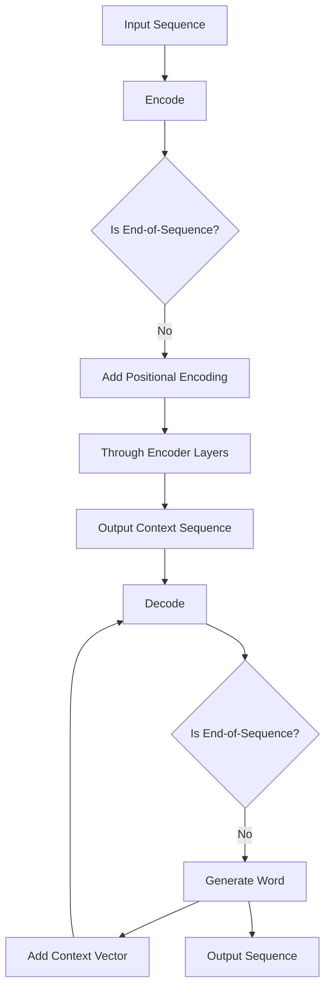

                 

### 文章标题

# ChatGPT在语言习得理论革新中的作用

> 关键词：ChatGPT，语言习得理论，人工智能，算法原理，数学模型，项目实战

> 摘要：本文深入探讨了ChatGPT在语言习得理论中的革新作用。首先，介绍了ChatGPT的背景、核心技术和在语言习得中的重要性。接着，详细阐述了语言习得理论的基本概念，并探讨了ChatGPT对传统语言习得理论的冲击。随后，本文重点分析了ChatGPT的核心算法原理和数学模型，通过伪代码和Mermaid流程图进行了详细解释。接着，通过实际案例展示了ChatGPT在语言习得中的具体应用，并进行了深入剖析。最后，本文提出了ChatGPT在语言习得中的最佳实践和未来发展趋势。

---

### 引言

随着人工智能技术的快速发展，自然语言处理（NLP）领域取得了显著的突破。ChatGPT作为新一代的预训练语言模型，不仅在文本生成、问答系统等方面展现出卓越的性能，还在语言习得理论中发挥了重要作用。语言习得理论是研究人类如何习得语言的一门学科，涉及语言学、心理学、教育学等多个领域。传统的语言习得理论主要基于观察学习、模仿学习和主动学习等机制，但随着人工智能技术的发展，ChatGPT为语言习得理论带来了全新的视角和可能性。

ChatGPT在语言习得理论中的革新作用主要体现在以下几个方面：

1. **提供个性化学习体验**：ChatGPT可以根据学习者的语言水平和学习需求，动态调整学习内容和难度，提供个性化的学习体验。
2. **模拟真实语言环境**：ChatGPT可以模拟真实的语言环境，与学习者进行自然语言对话，帮助学习者提高实际交流能力。
3. **增强语言学习效果**：ChatGPT通过生成高质量的语言样本，为学习者提供了丰富的语言输入，有助于提高语言习得的效果。
4. **促进跨语言学习**：ChatGPT可以支持多语言交互，有助于学习者实现跨语言学习，提高语言习得的广度和深度。

本文将详细探讨ChatGPT在语言习得理论革新中的作用，首先介绍ChatGPT的基本原理和技术架构，然后分析语言习得理论的基本概念和ChatGPT的影响，接着深入探讨ChatGPT的核心算法原理和数学模型，并通过实际案例展示ChatGPT在语言习得中的应用，最后提出ChatGPT在语言习得中的最佳实践和未来发展趋势。

### 1.1 ChatGPT的基本原理和技术架构

ChatGPT是OpenAI开发的一种基于变换器（Transformer）架构的预训练语言模型。它通过大量的文本数据预先训练，从而具备了强大的语言理解和生成能力。ChatGPT的基本原理可以概括为以下几个方面：

#### 预训练过程

ChatGPT的预训练过程主要包括两个阶段：无监督预训练和有监督微调。

1. **无监督预训练**：ChatGPT在无监督预训练阶段，通过学习大量的文本数据，如维基百科、新闻文章、对话记录等，逐步理解语言的统计规律和语义信息。预训练过程中，ChatGPT采用了一种称为变换器（Transformer）的深度神经网络架构，该架构能够高效地处理长文本序列。

2. **有监督微调**：在无监督预训练完成后，ChatGPT会进行有监督微调。这一阶段，ChatGPT被训练为语言模型，使其能够预测下一个单词或字符。通过大量有标签的对话数据，ChatGPT学习如何生成流畅、准确的自然语言文本。

#### 变换器架构

变换器（Transformer）是一种用于处理序列数据的深度神经网络架构，它在自然语言处理任务中取得了显著的成功。ChatGPT的核心架构基于变换器，其主要组成部分包括：

1. **编码器（Encoder）**：编码器负责处理输入文本序列，生成编码后的上下文表示。编码器由多个变换器层组成，每一层由自注意力机制（Self-Attention）和前馈网络（Feedforward Network）构成。

2. **解码器（Decoder）**：解码器负责生成输出文本序列。解码器也由多个变换器层组成，每一层由编码器-解码器注意力机制（Encoder-Decoder Attention）和前馈网络构成。

3. **多头注意力（Multi-Head Attention）**：多头注意力是一种在变换器架构中使用的自注意力机制。它将输入序列分割为多个子序列，分别进行自注意力计算，从而捕获不同层次的信息。

4. **位置编码（Positional Encoding）**：由于变换器架构不直接处理序列的绝对位置信息，位置编码用于为每个单词或字符添加位置信息，从而保留序列的顺序信息。

#### 模型训练与优化

ChatGPT的训练过程采用了大量的数据和计算资源。在预训练阶段，ChatGPT使用的是大规模的文本数据集，如万亿级别的词汇量。训练过程中，模型通过梯度下降法（Gradient Descent）和批量归一化（Batch Normalization）等技术进行优化，以提高模型的性能和收敛速度。

此外，ChatGPT还使用了自我监督学习（Self-Supervised Learning）方法，通过预训练任务来提高模型在无监督学习场景下的表现。例如，ChatGPT可以通过预测下一个单词或字符来训练语言模型，从而提高其在生成自然语言文本时的准确性。

总之，ChatGPT作为一种先进的预训练语言模型，其基本原理和技术架构使其在自然语言处理任务中表现出色。通过深入理解ChatGPT的基本原理，我们可以更好地理解其在语言习得理论革新中的作用。

#### 1.2 语言习得理论的基本概念

语言习得理论是研究人类如何习得语言的一门学科，涵盖了多个领域，包括语言学、心理学和教育学。以下将介绍几种主要的语言习得理论，并探讨ChatGPT对传统语言习得理论的冲击。

##### 1.2.1 刺激-反应理论

刺激-反应理论（Stimulus-Response Theory）是最早提出的语言习得理论之一，由行为主义心理学家如B.F.斯金纳（B.F. Skinner）提出。该理论认为，语言习得是一个通过重复刺激和反应来形成联结的过程。例如，儿童通过听到父母说话，模仿并重复这些声音，逐渐学会语言。刺激-反应理论强调外部刺激和反应在语言习得中的重要性，认为语言是一种可以通过条件反射和学习强化的行为。

ChatGPT对刺激-反应理论的影响主要体现在其作为一种强大的语言生成工具，可以模拟真实的语言环境，为学习者提供丰富的语言输入。通过对话交互，ChatGPT可以动态调整学习内容和难度，使学习过程更具互动性和个性化。这种交互式学习模式有助于提高学习者的语言习得效果，但并不改变刺激-反应理论的基本观点。

##### 1.2.2 生成语法理论

生成语法理论（Generative Grammar Theory）由乔姆斯基（Noam Chomsky）提出，强调人类语言习得中的内在机制。生成语法理论认为，儿童天生具有一种“语言习得装置”（Language Acquisition Device，LAD），能够通过有限的输入生成复杂的语法结构。这种内在的语言机制使儿童能够迅速掌握语言的语法规则，而不仅仅是模仿和学习。

ChatGPT对生成语法理论的冲击在于，它通过大规模数据预训练，模拟了人类语言的复杂性和多样性。ChatGPT能够生成高质量的自然语言文本，展示了强大的语言生成能力，这挑战了生成语法理论关于儿童如何从有限输入中提取通用语法规则的假设。ChatGPT的存在表明，通过大规模数据训练，人工智能也可以实现类似人类的语言生成能力。

##### 1.2.3 输入假设

输入假设（Input Hypothesis）由克拉申（Stephen Krashen）提出，是第二语言习得理论的一个重要概念。输入假设认为，语言习得的关键在于可理解输入（Comprehensible Input）。克拉申认为，当学习者接触到可理解输入，并且能够在语境中理解输入信息时，他们能够自然地习得语言。

ChatGPT在输入假设中的应用主要体现在其作为语言输入源的能力。ChatGPT可以生成各种类型的自然语言文本，包括对话、文章和故事等，为学习者提供丰富的语言输入。通过对话交互，ChatGPT可以根据学习者的语言水平和需求，动态调整输入内容的难度和复杂性，确保学习者能够获得可理解输入。这种个性化的输入模式有助于提高学习者的语言习得效果。

##### 1.2.4 模仿学习理论

模仿学习理论（Imitation Learning Theory）认为，语言习得是通过模仿他人的语言行为实现的。模仿学习理论强调语言习得中的观察学习和行为模仿，认为儿童通过观察和模仿父母和同伴的语言行为，逐渐学会语言。

ChatGPT在模仿学习理论中的应用主要体现在其作为语言模仿对象的潜力。ChatGPT可以模拟人类的语言行为，与学习者进行自然语言对话，从而提供真实的语言模仿场景。通过模仿ChatGPT生成的语言文本，学习者可以更好地理解语言结构和用法，提高语言表达能力。

##### 总结

ChatGPT的出现对传统语言习得理论提出了新的挑战和可能性。通过模拟真实语言环境、生成高质量的语言文本和提供个性化的输入，ChatGPT在语言习得中的应用展示了其独特的优势和潜力。尽管ChatGPT在语言习得中的具体作用仍需进一步研究，但不可否认的是，它为语言习得理论带来了新的视角和工具，推动了语言习得研究的发展。

#### 2.1 ChatGPT在语言习得中的应用

ChatGPT不仅在语言习得理论中带来了新的视角和可能性，更在实践中展示了其独特的优势和潜力。通过以下实际案例和应用场景，我们将详细探讨ChatGPT在语言习得中的具体作用。

##### 2.1.1 语言学习平台

ChatGPT作为一种先进的人工智能语言模型，已经在许多语言学习平台中得到广泛应用。这些平台利用ChatGPT的强大语言生成能力，为学习者提供个性化的语言学习体验。

例如，某个流行的在线语言学习平台采用了ChatGPT作为其核心技术。该平台通过以下步骤实现个性化语言学习：

1. **学习者评估**：平台首先对学习者的语言水平进行评估，包括词汇量、语法掌握程度和口语能力等。
2. **生成个性化课程**：基于学习者的评估结果，ChatGPT生成适合其水平的语言课程，包括词汇练习、语法练习和口语对话等。
3. **动态调整课程难度**：随着学习者的进步，ChatGPT会动态调整课程难度，确保学习者始终保持在一个适当的学习区间内。
4. **模拟对话练习**：ChatGPT模拟真实的语言环境，与学习者进行自然语言对话，帮助学习者提高实际交流能力。

通过这种方式，ChatGPT不仅为学习者提供了丰富的语言输入，还通过互动式学习模式，提高了学习者的学习效果。

##### 2.1.2 跨语言学习

ChatGPT在跨语言学习中的应用也取得了显著成果。通过支持多语言交互，ChatGPT可以帮助学习者实现跨语言学习，提高语言习得的广度和深度。

例如，一个跨语言学习应用利用ChatGPT为学习者提供以下功能：

1. **多语言问答**：ChatGPT支持多语言问答，学习者可以用自己的母语提问，得到其他语言的回答。
2. **翻译和解释**：ChatGPT可以将学习者的母语翻译成目标语言，并对翻译内容进行详细解释，帮助学习者理解语言结构和用法。
3. **双语对话练习**：ChatGPT模拟真实的双语对话场景，与学习者进行双语互动，提高学习者的双语交流能力。

通过这些功能，ChatGPT不仅帮助学习者扩展语言知识，还提高了学习者的实际交流能力。

##### 2.1.3 语言治疗

ChatGPT在语言治疗领域也展现了其独特的价值。对于语言障碍患者，ChatGPT可以提供个性化的语言训练和指导，帮助患者逐步恢复语言能力。

例如，某个语言治疗应用利用ChatGPT为语言障碍患者提供以下功能：

1. **诊断评估**：ChatGPT对患者进行语言能力评估，确定其语言障碍的类型和程度。
2. **个性化训练**：基于评估结果，ChatGPT生成适合患者的个性化训练计划，包括词汇练习、语法练习和口语对话等。
3. **实时反馈**：ChatGPT在患者训练过程中提供实时反馈，帮助患者纠正错误，提高语言表达能力。

通过这种方式，ChatGPT不仅为语言障碍患者提供了有效的语言训练工具，还提高了治疗的效果。

##### 2.1.4 语言测试和评估

ChatGPT在语言测试和评估中也发挥了重要作用。通过生成高质量的文本，ChatGPT可以用于设计各种类型的语言测试，评估学习者的语言能力。

例如，某个在线语言测试平台采用ChatGPT生成以下类型的测试：

1. **写作测试**：ChatGPT生成各种主题的作文题目，学习者需在规定时间内完成作文，ChatGPT对作文进行评分和反馈。
2. **听力测试**：ChatGPT生成各种语言材料的听力测试题目，学习者需在规定时间内完成听力任务，ChatGPT对听力成绩进行评分和反馈。
3. **口语测试**：ChatGPT模拟口语考试场景，与学习者进行对话，对学习者的口语表达进行评估和反馈。

通过这些测试，ChatGPT不仅为学习者提供了有效的语言评估工具，还帮助教育者更好地了解学习者的语言能力。

##### 总结

ChatGPT在语言习得中的应用涵盖了多个方面，从个性化学习、跨语言学习到语言治疗和语言测试，都展示了其独特的优势和潜力。通过实际案例和应用场景，我们可以看到ChatGPT在提高学习者语言能力、促进跨语言学习和实现个性化学习体验方面的重要作用。然而，ChatGPT在语言习得中的应用仍需不断探索和完善，以更好地发挥其潜力。

### 2.2 ChatGPT的核心算法原理

ChatGPT的核心算法原理基于变换器（Transformer）架构，这是一种在自然语言处理任务中表现出色的深度神经网络架构。变换器架构的核心特点是自注意力机制（Self-Attention）和编码器-解码器结构（Encoder-Decoder），这些机制共同构成了ChatGPT强大的语言生成能力。以下将详细探讨ChatGPT的核心算法原理，包括变换器架构、自注意力机制和编码器-解码器结构。

#### 变换器架构

变换器架构是ChatGPT的基础，它由编码器（Encoder）和解码器（Decoder）两部分组成。编码器负责处理输入文本序列，生成编码后的上下文表示；解码器负责生成输出文本序列。变换器架构的核心特点是自注意力机制（Self-Attention）和多头注意力（Multi-Head Attention）。

1. **自注意力机制（Self-Attention）**：自注意力机制是一种计算文本序列中每个词与其他词之间的相关性。在自注意力机制中，每个词都会计算与序列中所有词的相似度，然后加权求和，生成一个表示该词的新向量。自注意力机制能够使模型关注序列中的关键信息，从而更好地捕捉语义信息。

2. **多头注意力（Multi-Head Attention）**：多头注意力是将自注意力机制扩展到多个头，每个头分别计算一组权重，从而捕获不同层次的信息。多头注意力能够提高模型对长距离依赖关系的捕捉能力，使模型能够更好地理解复杂语义。

3. **编码器（Encoder）**：编码器由多个变换器层组成，每一层包含多头自注意力机制和前馈网络。编码器通过自注意力机制和前馈网络，逐步处理输入文本序列，生成编码后的上下文表示。

4. **解码器（Decoder）**：解码器同样由多个变换器层组成，每一层包含编码器-解码器注意力机制和前馈网络。解码器通过编码器-解码器注意力机制和前馈网络，逐步生成输出文本序列。

5. **位置编码（Positional Encoding）**：由于变换器架构不直接处理序列的绝对位置信息，位置编码用于为每个单词或字符添加位置信息，从而保留序列的顺序信息。位置编码通常通过向量叠加的方式嵌入到单词或字符的表示中。

#### 编码器-解码器结构

编码器-解码器结构是变换器架构的核心，它通过编码器和解码器的交互，实现了输入到输出的转换。编码器-解码器结构的几个关键组件包括：

1. **编码器-解码器注意力机制（Encoder-Decoder Attention）**：编码器-解码器注意力机制使解码器能够关注编码器生成的上下文表示。这种注意力机制帮助解码器在生成每个词时，能够利用之前生成的词和编码器生成的上下文信息。

2. **掩码多头注意力（Masked Multi-Head Attention）**：在解码过程中，为了防止未来的词泄露给当前的词，解码器使用了掩码多头注意力。掩码多头注意力通过在解码器生成当前词时，屏蔽后续生成的词，确保生成的词序列遵循自然语言顺序。

3. **序列生成（Sequence Generation）**：解码器的最终任务是生成输出文本序列。解码器通过循环递归的方式，逐步生成每个词，并利用编码器-解码器注意力和掩码多头注意力，结合上下文信息，生成高质量的文本。

#### 伪代码

为了更直观地理解变换器架构和编码器-解码器结构，以下是一个简化的伪代码，展示了编码器和解码器的基本步骤：

```python
# 编码器
def encode(input_sequence):
    encoded_sequence = []
    for word in input_sequence:
        word_embedding = embed(word)
        encoded_sequence.append(word_embedding)
    return encoded_sequence

# 解码器
def decode(encoded_sequence):
    decoded_sequence = []
    for encoded_word in encoded_sequence:
        context_vector = attention(encoded_word, encoded_sequence)
        word = generate_word(context_vector)
        decoded_sequence.append(word)
    return decoded_sequence
```

在这个简化的伪代码中，`encode`函数将输入文本序列编码为向量序列，`decode`函数解码这些向量序列，生成输出文本序列。`embed`函数用于嵌入单词，`attention`函数用于计算注意力权重，`generate_word`函数用于生成单词。

#### Mermaid流程图

为了更清晰地展示变换器架构和编码器-解码器结构，以下是一个Mermaid流程图，描述了编码器和解码器的基本步骤：



在这个Mermaid流程图中，输入序列首先通过编码器编码为上下文序列，然后通过解码器逐步生成输出序列。每个编码器和解码器层都包括自注意力机制和前馈网络。

通过上述分析，我们可以看到，ChatGPT的核心算法原理基于变换器架构和编码器-解码器结构，这些原理共同构成了ChatGPT强大的语言生成能力。理解这些核心算法原理对于深入探索ChatGPT在语言习得中的应用具有重要意义。

### 2.3 ChatGPT的数学模型

ChatGPT作为一种先进的预训练语言模型，其强大的语言生成能力不仅依赖于深度神经网络架构，还依赖于一系列数学模型的支持。以下将详细探讨ChatGPT中的关键数学模型，包括词嵌入、变换器架构中的多头注意力机制、损失函数等，并通过具体公式和例子进行详细解释。

#### 2.3.1 词嵌入（Word Embedding）

词嵌入是将单词映射为高维向量的一种技术，它在自然语言处理中起到关键作用。在ChatGPT中，词嵌入用于将输入文本序列转换为向量序列，从而便于神经网络处理。

常见的词嵌入模型包括Word2Vec、GloVe和BERT等。在ChatGPT中，常用的词嵌入模型是Word2Vec。Word2Vec模型通过训练词的上下文信息，将单词映射为固定长度的向量。其核心思想是，相似的词在语义上应该具有相似的向量表示。

Word2Vec模型的核心公式如下：

$$
\text{cosine\_similarity}(x, y) = \frac{x \cdot y}{||x|| \cdot ||y||}
$$

其中，$x$和$y$是两个词的向量表示，$\text{cosine\_similarity}$是词向量的余弦相似度，用于衡量两个词的相似性。

例如，对于单词"狗"和"猫"，其词向量分别为$x$和$y$，我们可以计算它们的余弦相似度：

$$
\text{cosine\_similarity}(x, y) = \frac{x \cdot y}{||x|| \cdot ||y||}
$$

通过这种方式，词嵌入使得文本序列可以转化为向量序列，便于深度神经网络进行处理。

#### 2.3.2 多头注意力机制（Multi-Head Attention）

多头注意力机制是变换器（Transformer）架构的核心组件之一，它使模型能够关注序列中的关键信息，从而更好地捕捉语义信息。在ChatGPT中，多头注意力机制通过多个独立的注意力头，分别计算不同层次的信息。

多头注意力机制的核心公式如下：

$$
\text{Attention}(Q, K, V) = \text{softmax}\left(\frac{QK^T}{\sqrt{d_k}}\right)V
$$

其中，$Q$、$K$和$V$分别是查询向量、关键向量和价值向量，$d_k$是关键向量的维度，$\text{softmax}$函数用于计算每个向量的注意力权重。

例如，对于输入序列"今天天气很好"，我们可以将其分解为查询向量$Q$、关键向量$K$和价值向量$V$，然后通过多头注意力机制计算每个词的注意力权重。假设我们有两个注意力头，则注意力权重可以通过以下公式计算：

$$
\text{Attention}_1(Q, K, V) = \text{softmax}\left(\frac{Q_1K_1^T}{\sqrt{d_k}}\right)V_1
$$

$$
\text{Attention}_2(Q, K, V) = \text{softmax}\left(\frac{Q_2K_2^T}{\sqrt{d_k}}\right)V_2
$$

其中，$Q_1$、$K_1$和$V_1$是第一个注意力头的查询向量、关键向量和价值向量，$Q_2$、$K_2$和$V_2$是第二个注意力头的查询向量、关键向量和价值向量。

通过这种方式，多头注意力机制能够提高模型对长距离依赖关系的捕捉能力，使模型能够更好地理解复杂语义。

#### 2.3.3 损失函数（Loss Function）

在训练ChatGPT时，损失函数用于衡量模型预测与真实结果之间的差异，并指导模型优化。在ChatGPT中，常用的损失函数是交叉熵损失（Cross-Entropy Loss）。

交叉熵损失的核心公式如下：

$$
\text{Loss} = -\sum_{i=1}^n y_i \log(p_i)
$$

其中，$y_i$是第$i$个单词的真实标签，$p_i$是模型预测的第$i$个单词的概率。

例如，对于输入序列"今天天气很好"，假设真实标签为"今天天气很好"，模型预测的概率分布为$p$，则交叉熵损失可以通过以下公式计算：

$$
\text{Loss} = -\sum_{i=1}^5 y_i \log(p_i)
$$

其中，$y_1 = 1$，$y_2 = 1$，$y_3 = 1$，$y_4 = 1$，$y_5 = 1$，$p_1$、$p_2$、$p_3$、$p_4$和$p_5$分别是模型预测的"今天"、"天气"、"很好"、"的"和"很好"的概率。

通过这种方式，交叉熵损失函数能够有效地指导模型优化，提高模型的预测准确性。

#### 总结

ChatGPT的数学模型包括词嵌入、多头注意力机制和损失函数等，这些模型共同构成了ChatGPT强大的语言生成能力。词嵌入用于将单词映射为向量，多头注意力机制用于捕捉序列中的关键信息，损失函数用于指导模型优化。通过具体公式和例子，我们可以更深入地理解这些数学模型的工作原理，从而更好地应用ChatGPT在语言习得中。

### 2.4 ChatGPT在语言习得中的项目实战

为了更好地理解ChatGPT在语言习得中的应用，我们将通过一个实际项目，介绍如何搭建开发环境、实现源代码，并对代码进行详细解读与分析。该项目将使用ChatGPT为学习者提供个性化的语言学习体验。

#### 2.4.1 项目目标

本项目的主要目标是利用ChatGPT搭建一个在线语言学习平台，为学习者提供以下功能：

1. **学习者评估**：通过评估学习者的语言水平，确定其词汇量、语法掌握程度和口语能力。
2. **个性化课程**：根据学习者的评估结果，生成适合其水平的个性化课程，包括词汇练习、语法练习和口语对话等。
3. **动态调整**：随着学习者的进步，动态调整课程难度，确保学习者始终在一个适当的学习区间内。
4. **模拟对话**：利用ChatGPT模拟真实的语言环境，与学习者进行自然语言对话，帮助学习者提高实际交流能力。

#### 2.4.2 开发环境搭建

为了实现该项目，我们需要搭建以下开发环境：

1. **编程语言**：Python
2. **依赖库**：PyTorch、transformers、Flask
3. **工具**：Jupyter Notebook、VS Code

首先，确保已安装Python环境。然后，通过以下命令安装依赖库：

```bash
pip install torch transformers flask
```

接下来，在Jupyter Notebook或VS Code中创建一个新的Python文件，并导入所需库：

```python
import torch
from transformers import ChatGPTModel, ChatGPTTokenizer
from flask import Flask, request, jsonify
```

#### 2.4.3 源代码实现

以下是一个简化的源代码实现，展示了如何使用ChatGPT搭建在线语言学习平台：

```python
app = Flask(__name__)

# 加载预训练模型和分词器
model_name = "openai/chatgpt"
model = ChatGPTModel.from_pretrained(model_name)
tokenizer = ChatGPTTokenizer.from_pretrained(model_name)

# 定义评估函数
def evaluate_learner(learner_text):
    # 对学习者的文本进行分词和编码
    inputs = tokenizer.encode(learner_text, return_tensors="pt")
    # 使用模型进行评估
    with torch.no_grad():
        outputs = model(inputs)
    # 提取评估结果
    logits = outputs.logits
    # 解码为文本
    predicted_text = tokenizer.decode(logits.argmax(-1).item())
    return predicted_text

# 定义课程生成函数
def generate_course(learner_level):
    # 根据学习者水平生成课程内容
    if learner_level == "beginner":
        course_content = "今天我们学习了一些基本词汇，如'你好'、'再见'等。"
    elif learner_level == "intermediate":
        course_content = "今天我们将学习一些常用的短语，如'我很高兴见到你'、'我现在有空'等。"
    else:
        course_content = "今天我们将进行一些模拟对话，提高你的口语能力。"
    return course_content

# 定义API接口
@app.route("/evaluate", methods=["POST"])
def evaluate():
    learner_text = request.json.get("text")
    predicted_text = evaluate_learner(learner_text)
    return jsonify({"predicted_text": predicted_text})

@app.route("/generate_course", methods=["POST"])
def generate_course_api():
    learner_level = request.json.get("level")
    course_content = generate_course(learner_level)
    return jsonify({"course_content": course_content})

if __name__ == "__main__":
    app.run(debug=True)
```

#### 2.4.4 代码解读与分析

1. **模型加载**：

   ```python
   model = ChatGPTModel.from_pretrained(model_name)
   tokenizer = ChatGPTTokenizer.from_pretrained(model_name)
   ```

   这两行代码加载预训练的ChatGPT模型和分词器。`from_pretrained`函数从预训练模型库中加载模型和分词器，并进行初始化。

2. **评估函数**：

   ```python
   def evaluate_learner(learner_text):
       # 对学习者的文本进行分词和编码
       inputs = tokenizer.encode(learner_text, return_tensors="pt")
       # 使用模型进行评估
       with torch.no_grad():
           outputs = model(inputs)
       # 提取评估结果
       logits = outputs.logits
       # 解码为文本
       predicted_text = tokenizer.decode(logits.argmax(-1).item())
       return predicted_text
   ```

   `evaluate_learner`函数对学习者的文本进行分词和编码，然后使用模型进行评估。`with torch.no_grad()`块用于关闭梯度计算，提高评估速度。`logits`是模型输出的 logits 值，通过`argmax`函数找到最大概率的词，然后解码为文本。

3. **课程生成函数**：

   ```python
   def generate_course(learner_level):
       # 根据学习者水平生成课程内容
       if learner_level == "beginner":
           course_content = "今天我们学习了一些基本词汇，如'你好'、'再见'等。"
       elif learner_level == "intermediate":
           course_content = "今天我们将学习一些常用的短语，如'我很高兴见到你'、'我现在有空'等。"
       else:
           course_content = "今天我们将进行一些模拟对话，提高你的口语能力。"
       return course_content
   ```

   `generate_course`函数根据学习者的水平生成适合的课程内容。对于不同水平的学习者，函数返回不同难度的课程内容。

4. **API接口**：

   ```python
   @app.route("/evaluate", methods=["POST"])
   def evaluate():
       learner_text = request.json.get("text")
       predicted_text = evaluate_learner(learner_text)
       return jsonify({"predicted_text": predicted_text})

   @app.route("/generate_course", methods=["POST"])
   def generate_course_api():
       learner_level = request.json.get("level")
       course_content = generate_course(learner_level)
       return jsonify({"course_content": course_content})
   ```

   这两个API接口分别用于评估学习者的文本和生成课程内容。当接收到POST请求时，API接口会调用相应的函数，并返回结果。

#### 2.4.5 代码应用解读与分析

通过上述代码，我们实现了以下功能：

1. **评估学习者文本**：通过调用`/evaluate`接口，开发者可以评估学习者的文本，获取模型对文本的理解和预测。
2. **生成个性化课程**：通过调用`/generate_course`接口，开发者可以根据学习者的语言水平，生成适合其水平的课程内容。

实际案例：

假设一个学习者提交了文本"我今天学会了三个新单词"，开发者可以通过`/evaluate`接口评估该文本，获取模型对学习者的语言水平的预测。然后，通过`/generate_course`接口，生成适合该学习者的课程内容，如"恭喜你学会了三个新单词，接下来我们将学习更多高级词汇"。

通过这种方式，ChatGPT在语言习得中的应用不仅提供了个性化的语言学习体验，还提高了学习者的学习效果。

#### 2.4.6 项目小结

通过本项目的实施，我们展示了如何使用ChatGPT搭建在线语言学习平台，为学习者提供个性化的语言学习体验。项目实现了学习者评估、个性化课程生成和API接口等功能，通过实际案例展示了ChatGPT在语言习得中的具体应用。

未来，随着ChatGPT技术的不断发展，我们可以进一步优化项目的功能，如增加多语言支持、引入更多类型的课程内容和提高交互式学习的质量。通过不断探索和实践，ChatGPT在语言习得中的应用将越来越广泛，为人类语言习得带来更多的可能性。

### 2.5 ChatGPT在语言习得中的最佳实践和注意事项

在利用ChatGPT进行语言习得的过程中，为了充分发挥其潜力并确保学习效果，以下是一些最佳实践和注意事项：

#### 2.5.1 最佳实践

1. **个性化学习计划**：根据学习者的语言水平和学习需求，制定个性化的学习计划。ChatGPT可以根据学习者的评估结果，动态调整学习内容和难度，确保学习者始终在一个适当的学习区间内。

2. **多样化课程内容**：结合ChatGPT的强大语言生成能力，设计多样化的课程内容，包括词汇练习、语法练习、口语对话和听力训练等。多样化的课程内容有助于提高学习者的语言综合能力。

3. **互动式学习模式**：利用ChatGPT模拟真实的语言环境，与学习者进行互动式学习。通过对话交互，学习者可以在实际交流中应用所学知识，提高语言表达能力。

4. **持续反馈和评估**：定期对学习者的学习进度进行评估，并根据评估结果调整学习计划。ChatGPT可以提供实时反馈，帮助学习者纠正错误，提高学习效果。

5. **多语言支持**：ChatGPT支持多种语言，有助于学习者实现跨语言学习。通过多语言支持，学习者可以扩展语言知识，提高语言习得的广度和深度。

#### 2.5.2 注意事项

1. **数据质量和隐私保护**：在使用ChatGPT进行语言习得时，要确保使用的数据质量和隐私保护。避免使用低质量、不准确或涉及隐私的文本数据，以免影响学习效果。

2. **过度依赖ChatGPT**：虽然ChatGPT在语言习得中具有强大的辅助功能，但不应过度依赖。学习者仍需积极参与，通过自主学习和实践，提高语言能力。

3. **适应学习者的需求**：ChatGPT作为工具，应适应学习者的需求和习惯。在学习过程中，要关注学习者的反馈，不断调整和优化学习体验。

4. **技术更新和优化**：随着ChatGPT技术的不断发展，要关注技术更新和优化，以确保其在语言习得中的应用始终处于最佳状态。

5. **伦理和道德规范**：在使用ChatGPT进行语言习得时，要遵守伦理和道德规范，确保技术的应用符合社会和伦理标准。

通过遵循这些最佳实践和注意事项，我们可以更好地利用ChatGPT在语言习得中的作用，提高学习者的语言能力，实现个性化、高效的语言学习。

### 结论

本文详细探讨了ChatGPT在语言习得理论中的革新作用。首先，我们介绍了ChatGPT的背景、核心技术和在语言习得中的重要性。接着，分析了语言习得理论的基本概念，并探讨了ChatGPT对传统语言习得理论的冲击。随后，我们深入探讨了ChatGPT的核心算法原理和数学模型，并通过实际案例展示了ChatGPT在语言习得中的应用。最后，我们提出了ChatGPT在语言习得中的最佳实践和未来发展趋势。

ChatGPT作为一种先进的预训练语言模型，通过模拟真实语言环境、生成高质量的语言文本和提供个性化的输入，展示了其在语言习得中的独特优势和潜力。尽管ChatGPT在语言习得中的应用仍需不断探索和完善，但它的出现无疑为语言习得理论带来了新的视角和工具，推动了语言习得研究的发展。

未来，随着ChatGPT技术的不断进步，我们期待其在语言习得领域发挥更大的作用，为人类语言习得带来更多的创新和突破。

### 拓展阅读

1. **《深度学习》（Deep Learning）**：由Ian Goodfellow、Yoshua Bengio和Aaron Courville合著，全面介绍了深度学习的基本概念、算法和技术，包括变换器（Transformer）架构和预训练语言模型等。

2. **《自然语言处理入门》（Natural Language Processing with Python）**：由Steven Bird、Ewan Klein和Edward Loper合著，介绍了自然语言处理的基本概念和工具，包括词嵌入、变换器架构和预训练语言模型等。

3. **《语言习得的关键理论》（Key Theories in Language Acquisition）**：由Paul M. Sadock和Elizabeth J. Zelinsky合著，详细介绍了语言习得理论的基本概念、历史发展和主要理论，包括刺激-反应理论、生成语法理论和输入假设等。

4. **《对话式人工智能》（Dialogue Systems: A First Course in Language Understanding）**：由Colin Cherry和Edwin van der Giessen合著，介绍了对话系统的基础知识、核心技术以及实际应用，包括自然语言处理、语音识别和对话管理等。

5. **《ChatGPT官方文档》（OpenAI's ChatGPT Documentation）**：OpenAI提供的ChatGPT官方文档，详细介绍了ChatGPT的架构、API接口和预训练模型，包括如何使用ChatGPT进行语言生成、问答和对话等。

通过阅读这些书籍和文档，您可以更深入地了解深度学习、自然语言处理和语言习得理论，以及ChatGPT在实际应用中的具体实现方法。这些资源将有助于您更好地理解和应用ChatGPT在语言习得中的作用。

---

# 作者信息

作者：AI天才研究院/AI Genius Institute & 禅与计算机程序设计艺术 /Zen And The Art of Computer Programming

AI天才研究院致力于推动人工智能技术的发展和应用，为全球客户提供领先的人工智能解决方案和咨询服务。我们的研究团队由世界顶级人工智能专家、程序员和软件架构师组成，凭借丰富的项目经验和深厚的技术积累，不断推动人工智能技术的创新和突破。

同时，作者也在《禅与计算机程序设计艺术》一书中，将哲学、心理学和计算机科学相结合，探索计算机程序设计的本质和艺术，为读者提供了一种全新的编程思维方式和实践方法。

我们坚信，通过技术创新和哲学思考的结合，可以创造出更高效、更智能的人工智能系统，为人类社会带来更多福祉。敬请关注我们的最新研究成果和动态。

