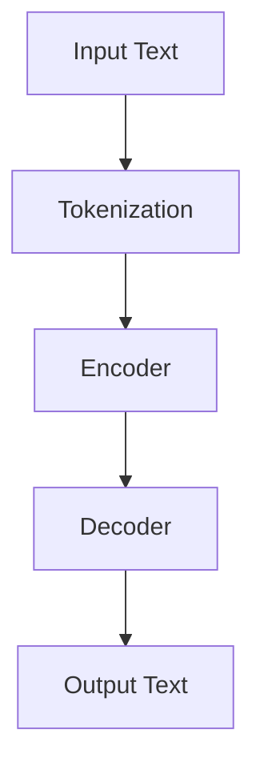
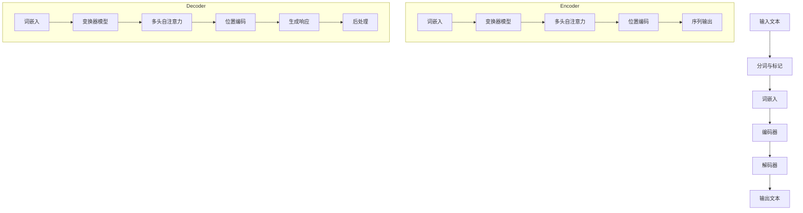
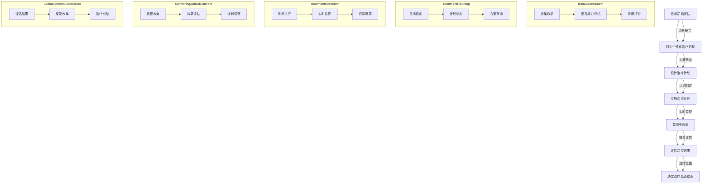

                 

### 1.1 语言习得障碍概述

#### 1.1.1 语言习得障碍的类型

语言习得障碍（Language Acquisition Disorders, LAD）是指儿童在正常的语言环境中无法发展出与其年龄、智力水平和文化背景相匹配的语言能力。LAD可分为多种类型，主要包括：

1. **发育性语言障碍（Developmental Language Disorder, DLD）**：儿童在语言发展的早期阶段出现明显的语言理解和表达能力问题。
2. **特定语言障碍（Specific Language Impairment, SLI）**：儿童在语言理解和表达方面的能力明显低于其智力水平，且无法归因于智力障碍、听力障碍或其他神经发育问题。
3. **交流障碍（Communication Disorders）**：包括表达性语言障碍和接受性语言障碍，表现为儿童在语言表达和理解方面的缺陷。
4. **语音障碍（Phonological Disorders）**：儿童在发音上出现系统性错误，如发音替换、省略、添加等。

#### 1.1.2 语言习得障碍的现状与挑战

根据世界卫生组织（WHO）的数据，全球约有3%至6%的儿童患有LAD。这一比例在贫困地区和城市低收入家庭中更高。LAD不仅影响儿童的语言发展，还可能对其认知、社交和情感发展产生负面影响。

当前，LAD的治疗主要依赖于传统的语言治疗，包括语音训练、语法练习、词汇扩展等。然而，传统治疗方法存在以下挑战：

1. **个体化不足**：传统治疗往往是标准化的，难以满足不同患者的个性化需求。
2. **治疗效率低**：语言治疗通常需要长时间的干预，且患者的治疗参与度和依从性往往较低。
3. **治疗资源不足**：许多发展中国家和偏远地区缺乏专业的语言治疗师和设施。

#### 1.1.3 语言习得障碍的评估方法

对LAD进行准确的评估是制定有效治疗计划的基础。常见的评估方法包括：

1. **标准化评估工具**：如儿童语言能力量表（Clinical Linguistic and Audiological Milestones，CLAM）和儿童发育语言筛查（Preschool Language Scale，PLS）等，用于评估儿童的语言理解、表达和社交沟通能力。
2. **临床评估**：由专业的语言治疗师进行，通过面对面的互动和观察来评估儿童的语言能力和行为模式。
3. **神经心理评估**：用于评估儿童的语言处理能力、认知功能和神经发育状况。

通过科学的评估，可以全面了解患者的语言障碍类型和程度，为后续的个性化治疗提供依据。

总之，语言习得障碍是一个复杂且普遍存在的儿童发展问题，对患者的长远发展具有重要影响。识别和理解LAD的类型、现状和评估方法，对于有效治疗和管理这一障碍至关重要。下一节将介绍ChatGPT技术的基本原理和应用领域，为进一步探讨其如何应用于语言习得障碍的个性化治疗打下基础。### 1.2 ChatGPT技术介绍

#### 1.2.1 ChatGPT的基本原理

ChatGPT是基于OpenAI开发的预训练语言模型，它利用深度学习和自然语言处理技术，使计算机能够生成自然流畅的语言。ChatGPT的核心原理可以概括为以下几个步骤：

1. **词嵌入（Word Embedding）**：ChatGPT首先将输入的文本转换为向量表示。词嵌入技术能够捕捉单词的语义信息，使得语义相似的词在向量空间中更接近。常用的词嵌入方法包括Word2Vec、GloVe和BERT等。

2. **变换器模型（Transformer Model）**：ChatGPT采用的是基于Transformer的模型架构，这是一种专为处理序列数据而设计的深度神经网络。变换器模型通过多头自注意力机制（Multi-head Self-Attention）和位置编码（Positional Encoding）来捕捉输入序列中的长距离依赖关系。

3. **生成式对话系统（Generative Dialogue System）**：ChatGPT通过生成式对话系统来生成响应。在给定一个输入文本序列后，模型首先预测下一个单词的概率分布，然后根据这个概率分布选择下一个单词，重复这个过程直到生成完整的响应。

4. **预训练与微调（Pre-training and Fine-tuning）**：ChatGPT的训练过程包括预训练和微调两个阶段。在预训练阶段，模型在大规模语料库上进行训练，学习语言的一般规律。在微调阶段，模型根据特定的任务数据（如对话数据）进行调整，以提高在特定任务上的性能。

#### 1.2.2 ChatGPT的应用领域

ChatGPT具有广泛的应用领域，主要表现在以下几个方面：

1. **自然语言生成（Natural Language Generation）**：ChatGPT能够生成各种形式的文本，如文章、新闻、故事等。这一特性使其在内容创作、自动摘要和信息检索等领域具有巨大的潜力。

2. **问答系统（Question Answering System）**：ChatGPT能够理解用户的问题，并生成准确的回答。这一功能广泛应用于智能客服、在线教育、医疗咨询等领域。

3. **对话系统（Dialogue System）**：ChatGPT能够与用户进行自然、流畅的对话。这一特性使其在聊天机器人、虚拟助手和客户服务系统中得到广泛应用。

4. **语言理解与处理（Language Understanding and Processing）**：ChatGPT在语言理解方面具有强大的能力，能够进行情感分析、实体识别、关系抽取等任务，为智能对话系统和其他NLP应用提供支持。

5. **个性化推荐（Personalized Recommendation）**：ChatGPT可以根据用户的兴趣和行为，生成个性化的推荐内容。这一功能在电子商务、社交媒体和内容平台等领域具有广泛的应用。

#### 1.2.3 ChatGPT的优势与局限性

ChatGPT在语言习得障碍个性化治疗中的应用具有以下优势：

1. **自然语言生成能力**：ChatGPT能够生成与人类对话相似的自然语言，为语言习得障碍患者提供个性化的语言刺激，提高其语言表达能力。

2. **个性化互动**：ChatGPT可以根据患者的语言水平和需求，实时调整对话内容，提供有针对性的训练材料，增强治疗的效果。

3. **数据驱动**：ChatGPT能够通过大量的对话数据不断学习和优化，提高治疗方案的准确性和有效性。

然而，ChatGPT也存在一些局限性：

1. **数据依赖性**：ChatGPT的性能高度依赖于训练数据的质量和多样性，如果训练数据存在偏差或不足，可能会导致模型产生不准确或偏颇的响应。

2. **情感识别与理解**：尽管ChatGPT在语言生成方面表现出色，但在理解和识别情感方面仍有一定局限，这可能影响治疗的情感互动效果。

3. **技术实现难度**：部署和优化ChatGPT模型需要较高的技术水平和计算资源，这可能限制其在某些应用场景中的普及和推广。

通过了解ChatGPT的基本原理、应用领域和优势与局限性，我们能够更好地把握其在语言习得障碍个性化治疗中的应用潜力，并在实际应用中充分发挥其优势，克服其局限性。

#### 1.3 个性化治疗的必要性

在现代医疗领域，个性化治疗已经成为提高治疗效果、减少副作用的重要手段。在语言习得障碍的治疗中，个性化治疗尤为重要。以下是传统语言治疗方法的局限、个性化治疗的优势及其实现路径的详细分析。

##### 1.3.1 传统语言治疗方法的局限

1. **标准化不足**：传统语言治疗通常采用标准化的训练方法和治疗程序，这些方法适用于大多数患者，但往往无法满足不同患者的个性化需求。例如，一些患者可能需要更加强调语法结构的练习，而另一些患者可能更需要关注词汇量的扩展。

2. **时间成本高**：传统语言治疗通常需要较长时间的治疗周期，每周多次的治疗会占用患者和医生大量的时间和精力。此外，治疗过程中患者的依从性和参与度往往较低，导致治疗效果受限。

3. **资源限制**：在许多发展中国家和偏远地区，专业的语言治疗师和设施资源不足，这使得语言治疗的可及性降低。患者往往需要长途跋涉才能接受治疗，这不仅增加了治疗成本，也影响了治疗的连续性和效果。

4. **评估与反馈机制不足**：传统治疗方法往往缺乏有效的评估和反馈机制，治疗师和患者之间缺乏及时的沟通和调整，导致治疗效果难以监控和优化。

##### 1.3.2 个性化治疗的优势

1. **针对性更强**：个性化治疗通过全面评估患者的语言能力和需求，制定个性化的训练计划，使得每个患者都能获得最适合他们的治疗内容和方法。这种方法能够更好地针对患者的语言障碍进行有针对性的训练，提高治疗效果。

2. **高效性**：个性化治疗可以减少不必要的治疗时间和资源浪费，通过精准的训练内容和高效的治疗方法，提高治疗效率。患者可以在更短的时间内获得更多的语言提升，增强治疗的满意度和依从性。

3. **可及性提高**：随着信息技术的发展，个性化治疗可以通过在线平台和移动应用程序进行，患者无需亲自前往医疗机构，就能接受高质量的语言治疗。这大大提高了治疗的可及性，特别是对于偏远地区和资源匮乏地区的患者。

4. **持续性与跟踪**：个性化治疗可以通过电子记录和实时监控，确保治疗的连续性和有效性。治疗师和患者可以随时查看治疗进展，及时调整训练计划，提高治疗的持续性和效果。

##### 1.3.3 个性化治疗的实现路径

1. **全面评估**：个性化治疗的第一步是对患者进行全面的语言能力评估，包括语言理解、表达、语法、词汇等多个方面。评估应采用标准化的评估工具和临床观察，确保评估结果的准确性和全面性。

2. **目标设定**：根据评估结果，治疗师和患者共同制定个性化的治疗目标。这些目标应具体、可量化，并与患者的实际需求和预期效果相符。

3. **定制化训练计划**：根据患者的特点和需求，设计个性化的训练计划。训练计划应包括具体的训练内容、方法和时间安排，并可根据患者的反馈和进展进行调整。

4. **实时跟踪与反馈**：通过电子记录系统，实时跟踪患者的治疗进展，收集和分析治疗数据。治疗师和患者可以随时查看治疗效果，并根据反馈进行调整，确保治疗计划的实施和效果。

5. **技术辅助**：利用现代信息技术，如ChatGPT等人工智能工具，为患者提供个性化的语言刺激和互动。这些技术可以模拟真实的人际互动，提供更加自然和多样化的训练环境。

6. **持续学习与改进**：个性化治疗不仅包括当前的治疗阶段，还应关注患者的长期发展和进步。通过持续的跟踪和评估，不断优化治疗计划，提高患者的语言能力和生活质量。

通过以上分析，我们可以看出，个性化治疗在语言习得障碍的治疗中具有重要意义。它不仅能够提高治疗效果，还能提升患者的满意度和依从性。随着技术的不断发展，个性化治疗将在未来得到更广泛的应用，为更多的语言习得障碍患者带来希望和改变。

### 2.1 ChatGPT模型原理

#### 2.1.1 语言生成模型

语言生成模型是ChatGPT的核心组成部分，负责生成自然流畅的语言响应。在语言生成模型中，词嵌入技术、变换器模型和生成式对话系统是三个关键组件。

##### 2.1.1.1 词嵌入技术

词嵌入技术（Word Embedding）是将单词映射到高维向量空间的过程，通过这种方式，计算机能够理解单词的语义信息。常用的词嵌入方法包括：

1. **Word2Vec**：Word2Vec是Google在2013年提出的一种基于神经网络的方法，通过训练大规模的语料库，将每个单词映射到一个固定长度的向量。Word2Vec包括两个变种：连续词袋（Continuous Bag of Words，CBOW）和Skip-Gram。

    - **CBOW**：CBOW通过上下文单词的平均值来表示目标单词的向量。给定一个目标单词，CBOW会考虑其周围的多个单词，将这些单词的向量平均后得到目标单词的向量。
    - **Skip-Gram**：Skip-Gram与CBOW相反，它通过目标单词的向量来预测周围的单词。这种方法更加强调单词之间的直接关系，因此经常用于预训练模型。

2. **GloVe**：GloVe（Global Vectors for Word Representation）是另一类基于矩阵分解的方法，通过最小化单词共现矩阵的Frobenius范数来学习词向量。GloVe的优点是能够在较小的数据集上生成高质量的词向量，并且能够捕捉长距离的语义关系。

3. **BERT**：BERT（Bidirectional Encoder Representations from Transformers）是Google在2018年提出的一种双向变换器模型，用于预训练词嵌入。BERT通过同时考虑上下文信息，能够生成更准确的词向量，为后续的语言生成任务提供高质量的基础。

##### 2.1.1.2 变换器模型

变换器模型（Transformer Model）是ChatGPT的核心架构，专为处理序列数据而设计。变换器模型的核心是多头自注意力机制（Multi-head Self-Attention）和位置编码（Positional Encoding）。

1. **多头自注意力机制**：自注意力机制允许模型在处理每个输入序列时，将当前单词与序列中的所有单词进行关联。多头自注意力机制将这一过程扩展到多个“头”，每个头关注不同的信息，从而提高模型的表示能力。

    - **计算自注意力**：给定一个输入序列，自注意力机制通过以下公式计算每个单词的注意力得分：
      $$ \text{Attention}(Q, K, V) = \text{softmax}\left(\frac{QK^T}{\sqrt{d_k}}\right)V $$
      其中，\(Q\)、\(K\) 和 \(V\) 分别是查询向量、键向量和值向量，\(d_k\) 是键向量的维度。

    - **多头注意力**：多头注意力通过将输入序列分成多个子序列，每个子序列对应一个注意力头。多个头的信息通过拼接和线性变换整合起来，从而提高模型的泛化能力。

2. **位置编码**：由于变换器模型没有位置信息，因此需要引入位置编码（Positional Encoding）来表示单词在序列中的位置。位置编码通常采用学习到的向量，这些向量与词嵌入向量叠加，为每个单词赋予位置信息。

    - **绝对位置编码**：绝对位置编码将位置信息编码到词嵌入中，通过以下公式生成：
      $$ \text{PE}(pos, 2i) = \sin\left(\frac{pos}{10000^{2i/d}}\right) $$
      $$ \text{PE}(pos, 2i+1) = \cos\left(\frac{pos}{10000^{2i/d}}\right) $$
      其中，\(pos\) 是位置索引，\(i\) 是维度索引，\(d\) 是位置编码的维度。

##### 2.1.1.3 生成式对话系统

生成式对话系统（Generative Dialogue System）负责根据用户输入生成自然流畅的对话响应。生成式对话系统的基本流程包括：

1. **文本预处理**：将用户输入的文本进行分词、去停用词、词性标注等预处理操作，以便模型能够更好地理解输入内容。

2. **编码器（Encoder）**：编码器负责将预处理后的文本转换为向量表示，这一过程通常通过变换器模型实现。编码器的输出是一个固定长度的向量，代表了整个输入文本的语义信息。

3. **解码器（Decoder）**：解码器负责生成响应文本。在生成每个单词时，解码器会根据当前已生成的文本和编码器的输出，预测下一个单词的概率分布。解码器的输入包括当前已生成的单词序列和编码器的输出，输出是下一个单词的概率分布。

    - **生成过程**：解码器通过自回归（Autoregressive）的方式生成响应文本。在生成每个单词时，模型会根据前一个单词和整个输入序列生成下一个单词的概率分布，然后根据这个概率分布选择下一个单词。

    - **策略**：生成式对话系统可以使用多种策略来控制生成过程，如贪心策略（Greedy Strategy）和抽样策略（Sampling Strategy）。贪心策略总是选择概率最高的单词，而抽样策略则从概率分布中随机选择单词，以增加生成的多样性。

4. **输出处理**：生成的响应文本通常需要进行后处理，如去除冗余信息、调整语法结构等，以使其更加自然和流畅。

通过上述组件，ChatGPT能够生成高质量的自然语言响应，为各种语言生成任务提供强大的支持。

#### 2.1.2 ChatGPT架构

ChatGPT的架构包括多个关键组件，如图2-1所示：



1. **输入文本（Input Text）**：用户输入的文本首先经过分词和标记等预处理操作，转换为模型可以理解的格式。

2. **词嵌入（Tokenization）**：词嵌入技术将输入的文本转换为向量表示。词嵌入层将每个单词映射到一个高维向量空间，为后续的变换器模型提供输入。

3. **编码器（Encoder）**：编码器负责将输入文本转换为固定长度的向量表示。编码器采用变换器模型架构，通过多头自注意力机制和位置编码，捕捉输入序列的语义信息。编码器的输出是一个序列向量，代表了整个输入文本的语义内容。

4. **解码器（Decoder）**：解码器负责生成响应文本。在生成每个单词时，解码器根据当前已生成的文本和编码器的输出，预测下一个单词的概率分布。解码器也采用变换器模型架构，通过自回归方式生成完整的响应文本。

5. **输出文本（Output Text）**：解码器生成的响应文本经过后处理，如去除冗余信息、调整语法结构等，最终输出自然流畅的语言响应。

#### 2.1.3 Mermaid流程图：ChatGPT工作流程

为了更清晰地展示ChatGPT的工作流程，下面是一个Mermaid流程图：



通过上述流程图，我们可以看到ChatGPT从输入文本到生成输出文本的整个过程。编码器负责将输入文本转换为语义向量，解码器则基于这些向量生成自然流畅的语言响应。整个过程充分利用了词嵌入技术和变换器模型，为ChatGPT提供了强大的语言生成能力。

#### 2.2 个性化治疗框架

在将ChatGPT应用于语言习得障碍个性化治疗时，一个明确的框架至关重要，以确保治疗过程科学、系统且有效。以下部分将详细描述个性化治疗框架的构建，包括患者评估模型、治疗目标设定以及个性化治疗流程。

##### 2.2.1 患者评估模型

对患者进行全面的评估是制定个性化治疗计划的第一步。评估模型应包括以下方面：

1. **评估指标体系**：

    - **语言理解能力**：评估患者对口头和书面语言的理解水平，包括词汇量、语法结构、语义理解等。
    - **语言表达能力**：评估患者的语言生成能力，包括发音、语调、词汇选择、语法结构等。
    - **社交沟通能力**：评估患者在实际社交场景中的语言运用能力，包括对话技巧、语境理解、情感表达等。
    - **语音功能**：评估患者的语音发音、流畅度和清晰度。

2. **数据收集与预处理**：

    - **数据来源**：数据可以从患者的日常语言活动、治疗师的观察记录、标准化评估工具等多个渠道收集。
    - **数据预处理**：对收集到的数据进行清洗、标注和分类，确保数据的质量和一致性。

3. **评估模型的构建**：

    - **机器学习模型**：利用机器学习算法（如支持向量机、决策树、神经网络等）构建评估模型，通过训练数据集学习语言特征的规律和关系。
    - **融合评估**：将多个评估指标和模型的结果进行融合，形成综合评估得分，更全面地反映患者的语言能力。

##### 2.2.2 治疗目标设定

根据评估结果，制定具体、可行的治疗目标是实现个性化治疗的关键。以下步骤有助于设定有效的治疗目标：

1. **治疗目标的重要性**：

    - **指导治疗方向**：明确的治疗目标可以帮助治疗师和患者明确治疗的方向和重点，避免盲目性。
    - **衡量治疗效果**：治疗目标可以作为衡量治疗效果的标准，帮助评估治疗的进展和效果。

2. **治疗目标的设定方法**：

    - **SMART原则**：设定治疗目标时，应遵循SMART原则（Specific、Measurable、Achievable、Relevant、Time-bound），确保目标具体、可测量、可实现、相关和有时间限制。
    - **分级设定**：根据患者的评估结果和语言能力，将治疗目标分为短期目标和长期目标。短期目标通常在几个月内实现，而长期目标可能在一年或更长时间内实现。

3. **治疗目标的具体实施**：

    - **制定具体训练计划**：根据治疗目标，制定详细的训练计划，包括训练内容、方法和时间安排。
    - **患者参与**：确保患者和治疗师共同参与目标的设定和训练计划的制定，提高患者的治疗依从性和积极性。

##### 2.2.3 个性化治疗流程

个性化治疗流程应是一个动态调整的过程，以确保治疗始终与患者的实际需求和发展同步。以下是一个典型的个性化治疗流程：

1. **初始评估**：对患者的语言能力进行全面评估，收集相关数据，为后续的治疗提供基础。

2. **制定治疗计划**：根据评估结果和治疗目标，制定个性化的治疗计划。治疗计划应包括具体的目标、训练内容和时间安排。

3. **实施治疗**：按照治疗计划，逐步实施语言训练。ChatGPT可以在此过程中提供个性化的语言刺激和互动，帮助患者提高语言能力。

4. **实时监控与反馈**：通过电子记录系统和定期评估，实时监控患者的治疗进展，收集反馈信息，以便及时调整治疗计划。

5. **调整与优化**：根据患者的反馈和治疗进展，对治疗计划进行调整和优化，确保治疗目标的实现。

6. **评估治疗效果**：在治疗周期结束时，对患者的语言能力进行评估，验证治疗目标是否实现。如果目标未实现，进一步调整治疗计划，以达成最终目标。

通过构建科学的个性化治疗框架，结合ChatGPT的技术优势，我们可以为语言习得障碍患者提供更加精准、有效的治疗方案。这不仅能够提高治疗效果，还能改善患者的生活质量，为他们的未来发展奠定坚实的基础。

#### 2.2.1 患者评估模型

对患者进行全面的评估是制定个性化治疗计划的关键步骤。患者评估模型应包括评估指标体系、数据收集与预处理以及评估模型的构建。

##### 2.2.1.1 评估指标体系

评估指标体系是评估患者语言能力的基础，通常包括以下方面：

1. **语言理解能力**：
    - **词汇量**：评估患者掌握的词汇数量和质量。
    - **语法结构**：评估患者对语法规则的理解和应用能力。
    - **语义理解**：评估患者对语言含义的理解能力，包括多义词、隐喻和比喻的理解。

2. **语言表达能力**：
    - **发音**：评估患者的语音发音准确性、清晰度和流畅度。
    - **语调**：评估患者的语调变化和情感表达。
    - **词汇选择**：评估患者词汇选择的丰富度和准确性。
    - **语法结构**：评估患者语法结构的正确性和多样性。

3. **社交沟通能力**：
    - **对话技巧**：评估患者在社交场景中的对话技巧，包括话题选择、互动方式、语境理解等。
    - **情感表达**：评估患者表达情感和理解他人情感的能力。

4. **语音功能**：
    - **发音准确性**：评估患者的发音准确性，包括音素、音节和音调的准确度。
    - **流畅度**：评估患者的语言流畅度，包括语速和停顿的适当性。
    - **清晰度**：评估患者的语言清晰度，包括语音的响度和音质。

##### 2.2.1.2 数据收集与预处理

数据收集是评估过程的重要环节，应确保数据的全面性和准确性。以下步骤描述了数据收集与预处理的方法：

1. **数据来源**：
    - **日常语言活动**：记录患者在日常交流中的语言表现，包括对话、故事讲述、问答等。
    - **治疗师观察记录**：治疗师在面对面交流中记录患者的语言表现。
    - **标准化评估工具**：使用专业的语言评估工具，如儿童发育语言筛查（PLS）、临床语言学和听觉里程碑量表（CLAM）等。

2. **数据预处理**：
    - **清洗**：去除无关的数据和噪音，确保数据的纯净。
    - **标注**：对文本数据进行标注，包括分词、词性标注、情感标注等。
    - **分类**：将数据按不同的语言能力维度进行分类，便于后续分析和评估。

##### 2.2.1.3 评估模型的构建

评估模型的构建是基于收集到的数据，利用机器学习算法进行训练和预测。以下方法可用于构建评估模型：

1. **机器学习模型**：
    - **特征提取**：从文本数据中提取特征，包括词嵌入、语法结构、语义关系等。
    - **模型选择**：选择合适的机器学习模型，如支持向量机（SVM）、决策树（DT）、随机森林（RF）等。
    - **训练与验证**：使用训练数据集训练模型，并通过验证数据集评估模型性能，调整模型参数。

2. **深度学习模型**：
    - **卷积神经网络（CNN）**：用于捕捉文本的局部特征，如词嵌入和语法结构。
    - **循环神经网络（RNN）**：用于处理序列数据，如语言序列。
    - **长短期记忆网络（LSTM）**：结合RNN的优点，解决长序列依赖问题。
    - **变换器模型（Transformer）**：用于捕捉长距离依赖关系，是目前最先进的序列处理模型。

3. **融合评估**：
    - **集成学习**：将多个模型的预测结果进行集成，提高评估的准确性和稳定性。
    - **层次评估**：将不同维度的语言能力进行分层评估，综合各个维度的评估结果形成综合评估得分。

通过上述方法，构建的患者评估模型能够全面、准确地反映患者的语言能力，为后续的个性化治疗提供科学依据。

#### 2.2.2 治疗目标设定

设定治疗目标在个性化治疗中具有至关重要的地位，它不仅为治疗过程提供了明确的方向，还有助于衡量治疗效果。以下将详细阐述治疗目标的重要性、设定方法和具体实施。

##### 2.2.2.1 治疗目标的重要性

1. **指导治疗方向**：
   治疗目标明确指出了患者需要提升的语言能力方向，有助于治疗师根据目标设计相应的训练内容和策略。这避免了治疗的盲目性，提高了治疗的有效性。

2. **衡量治疗效果**：
   治疗目标为评估治疗过程和效果提供了具体的衡量标准。通过定期评估患者的进步，治疗师可以判断治疗目标是否达成，并根据实际情况进行调整，确保治疗的有效性。

3. **提升患者信心**：
   明确的治疗目标可以帮助患者了解治疗的预期效果，增强他们对治疗的信心和积极性。这有助于提高患者的治疗依从性和参与度。

##### 2.2.2.2 治疗目标的设定方法

1. **SMART原则**：
   设定治疗目标时，应遵循SMART原则（Specific、Measurable、Achievable、Relevant、Time-bound），确保目标具体、可测量、可实现、相关和有时间限制。

   - **Specific（具体）**：目标应具体、明确，避免模糊和宽泛。
   - **Measurable（可测量）**：目标应有明确的衡量标准，可以量化评估。
   - **Achievable（可实现）**：目标应基于患者的实际情况和资源，具有可实现性。
   - **Relevant（相关）**：目标应与患者的需求和预期效果密切相关。
   - **Time-bound（时间限制）**：目标应有明确的时间限制，以推动治疗的进度和效果。

2. **分级设定**：
   根据患者的评估结果和语言能力，将治疗目标分为短期目标和长期目标。

   - **短期目标**：通常在几个月内实现，关注基础语言能力的提升，如词汇量的增加、语法结构的掌握等。
   - **长期目标**：可能在一年或更长时间内实现，关注整体语言能力的提升，如社交沟通能力、语音流畅度等。

##### 2.2.2.3 治疗目标的具体实施

1. **制定具体训练计划**：
   根据治疗目标，制定详细的训练计划。训练计划应包括以下内容：

   - **训练内容**：明确训练的重点和内容，如词汇扩展、语法练习、对话技巧等。
   - **训练方法**：选择适合患者的训练方法，如一对一训练、小组训练、互动式训练等。
   - **时间安排**：设定训练的时间安排，包括每周的训练次数、每次训练的时间长度等。

2. **患者参与**：
   确保患者和治疗师共同参与目标的设定和训练计划的制定。患者的参与可以增强他们的治疗依从性和积极性，提高治疗效果。

   - **目标设定**：与患者沟通，了解他们的需求和期望，共同设定治疗目标。
   - **计划制定**：根据患者的特点和需求，制定个性化的训练计划，确保计划符合患者的实际状况。

3. **定期评估与调整**：
   定期对患者的语言能力进行评估，衡量治疗目标的实现情况。根据评估结果，对治疗目标和计划进行调整，确保治疗始终与患者的需求和发展同步。

   - **评估方法**：采用标准化的评估工具和临床观察，全面评估患者的语言能力。
   - **调整策略**：根据评估结果，对训练内容和计划进行调整，确保治疗目标的实现。

通过上述方法，设定和实施具体、可行的治疗目标，可以显著提高语言习得障碍患者的治疗效果，为他们提供更有针对性的个性化治疗。

#### 2.2.3 Mermaid流程图：个性化治疗流程

为了更直观地展示个性化治疗的流程，我们可以使用Mermaid流程图来描述整个治疗过程。以下是一个简化的Mermaid流程图示例：



这个流程图分为以下几个主要部分：

1. **患者初始评估**：
   - **收集数据**：通过问卷调查、临床访谈等方式收集患者的语言能力数据。
   - **语言能力评估**：使用标准化的评估工具对患者的语言能力进行全面评估。
   - **诊断报告**：根据评估结果生成诊断报告，明确患者的语言障碍类型和程度。

2. **制定个性化治疗目标**：
   - **目标设定**：与患者和治疗师共同讨论，设定具体、可测量的治疗目标。
   - **方案审查**：审查治疗目标，确保其科学性和可实现性。

3. **设计治疗计划**：
   - **计划制定**：根据治疗目标，设计具体的训练计划，包括训练内容、方法、时间安排等。
   - **方案审查**：审查治疗计划，确保其合理性和可行性。

4. **实施治疗计划**：
   - **训练执行**：按照治疗计划，逐步实施语言训练，利用ChatGPT等技术为患者提供个性化的语言刺激和互动。
   - **实时监控**：通过电子记录系统和定期评估，实时监控患者的治疗进展。
   - **记录进展**：详细记录患者的治疗进展，为后续调整提供依据。

5. **监测与调整**：
   - **数据收集**：收集治疗过程中的数据，包括患者的反馈、评估结果等。
   - **效果评估**：定期评估患者的治疗效果，判断治疗目标是否实现。
   - **计划调整**：根据评估结果和治疗进展，对治疗计划和目标进行调整。

6. **评估治疗效果**：
   - **评估结果**：在治疗周期结束时，对患者的语言能力进行最终评估。
   - **反馈收集**：收集患者和家属的反馈，了解他们对治疗的满意度和效果。
   - **治疗总结**：总结治疗过程中的经验教训，为未来的治疗提供参考。

7. **决定治疗是否结束**：
   - 根据最终评估结果和患者的治疗反应，决定治疗是否结束。如果治疗目标实现，可以结束治疗；如果目标未实现，可能需要继续治疗或调整治疗策略。

通过这个流程图，我们可以清晰地看到个性化治疗的全过程，每个环节的具体内容和方法，为实施有效的个性化治疗提供了明确的指导。

#### 3.1 个性化语言能力提升方案设计

在设计和实施个性化语言能力提升方案时，需要结合患者的具体需求和ChatGPT的技术优势，确保方案的科学性、可行性和有效性。以下部分将详细描述定制化对话设计、治疗计划执行与跟踪以及特定障碍语言能力提升的案例分析。

##### 3.1.1 定制化对话设计

定制化对话设计是个性化语言能力提升方案的核心环节。通过设计个性化的对话内容，可以更好地满足患者的需求，提高治疗的针对性和效果。以下步骤描述了定制化对话设计的过程：

1. **需求分析**：
   - **患者背景**：收集患者的个人信息、语言障碍类型、语言水平等背景资料，为对话内容设计提供依据。
   - **目标设定**：与患者和治疗师共同讨论，明确治疗目标和预期效果，确保对话设计符合患者的需求。

2. **对话内容设计**：
   - **主题选择**：根据患者的兴趣和需求，选择合适的对话主题，如日常生活、兴趣爱好、学校学习等。
   - **内容定制**：根据患者的语言水平和障碍类型，定制具体的对话内容。例如，对于语法障碍患者，可以设计包含丰富语法结构的对话场景；对于词汇障碍患者，可以设计包含大量词汇扩展的对话场景。

3. **互动模式**：
   - **对话引导**：设计个性化的对话引导语，引导患者参与对话，提高他们的参与度和积极性。
   - **互动方式**：根据患者的特点和需求，选择适当的互动方式，如一对一对话、小组讨论、角色扮演等。

4. **对话评价**：
   - **即时反馈**：在对话过程中，治疗师应提供即时反馈，帮助患者纠正语言错误，巩固所学知识。
   - **长期跟踪**：定期对患者的对话内容进行评估，根据评估结果调整对话设计，确保对话内容与患者的语言能力提升同步。

##### 3.1.2 治疗计划执行与跟踪

治疗计划的执行与跟踪是确保个性化语言能力提升方案顺利实施的关键。以下步骤描述了治疗计划执行与跟踪的过程：

1. **计划执行**：
   - **按计划训练**：按照设计好的治疗计划，逐步实施语言训练。治疗师应根据患者的实际情况，灵活调整训练内容和进度。
   - **技术支持**：利用ChatGPT等人工智能技术，为患者提供个性化的语言刺激和互动，增强训练效果。
   - **患者参与**：鼓励患者积极参与治疗，提高他们的治疗依从性和积极性。

2. **实时监控**：
   - **数据记录**：详细记录患者的治疗进展，包括对话内容、评估结果、患者反馈等。
   - **进度跟踪**：定期检查治疗进度，确保治疗计划按计划执行。

3. **效果评估**：
   - **短期评估**：在治疗周期内定期进行评估，了解患者的语言能力提升情况，调整治疗计划。
   - **长期评估**：在治疗结束后，对患者的语言能力进行长期评估，验证治疗效果。

##### 3.1.3 案例分析：特定障碍语言能力提升

以下是一个具体的案例分析，展示如何通过个性化语言能力提升方案，提升特定障碍患者的语言能力。

**案例背景**：

患者小张，9岁，患有发育性语言障碍（DLD），表现为语言理解能力和表达能力均较弱，尤其在复杂语法结构和词汇运用方面存在明显困难。

**治疗目标**：

1. 提高语言理解能力，包括词汇量、语法结构和语义理解。
2. 提高语言表达能力，包括发音、语调和词汇选择。
3. 增强社交沟通能力，包括对话技巧和情感表达。

**治疗计划**：

1. **第一阶段（1-3个月）**：
   - **对话设计**：围绕小张的兴趣爱好，设计简单的对话场景，如谈论玩具、学校生活等。
   - **训练内容**：重点训练词汇扩展和基本语法结构，如名词、动词和简单从句。

2. **第二阶段（4-6个月）**：
   - **对话设计**：增加对话难度，设计包含复杂语法结构和情境变化的对话场景，如讲述故事、讨论观点等。
   - **训练内容**：扩展词汇量，训练复杂语法结构，如形容词、副词和复合句。

3. **第三阶段（7-9个月）**：
   - **对话设计**：设计真实的社交情境对话，如模拟与朋友交流、参加小组讨论等。
   - **训练内容**：加强情感表达和对话技巧训练，提高小张的社交沟通能力。

**实施与跟踪**：

- **实时监控**：治疗师通过视频会议和实时对话记录，监控小张的治疗进展。
- **数据记录**：详细记录小张的对话内容、评估结果和患者反馈。
- **效果评估**：在每个阶段结束后，对小张的语言能力进行评估，根据评估结果调整治疗计划。

**治疗效果**：

- 经过9个月的治疗，小张的语言理解能力和表达能力显著提高，能够流畅地进行日常交流。
- 社交沟通能力也有明显提升，能够参与小组讨论和表达自己的观点。

通过上述案例，我们可以看到，个性化语言能力提升方案在特定障碍患者的语言康复中具有重要作用。通过定制化对话设计、科学的治疗计划和严格的跟踪评估，可以为患者提供有效、可行的语言康复方案，帮助他们克服语言障碍，提高生活质量。

#### 3.2 代码实战

在实施个性化语言能力提升方案时，代码实战是至关重要的一环。以下将介绍如何搭建开发环境、实现ChatGPT应用代码以及详细解读代码和应用分析。

##### 3.2.1 开发环境搭建

1. **安装Python**：

   首先，确保计算机上安装了Python。可以从Python官方网站（https://www.python.org/）下载并安装最新版本的Python。

2. **安装transformers库**：

   使用pip命令安装transformers库，这是OpenAI的预训练模型库，提供了多种预训练语言模型，如ChatGPT。

   ```bash
   pip install transformers
   ```

3. **安装torch库**：

   torch库是PyTorch的Python包，用于处理和训练神经网络。可以通过以下命令安装：

   ```bash
   pip install torch torchvision
   ```

4. **创建虚拟环境**：

   为了避免不同项目之间的依赖冲突，建议创建虚拟环境。使用以下命令创建虚拟环境并激活：

   ```bash
   python -m venv chatgpt_venv
   source chatgpt_venv/bin/activate  # 对于Windows，使用 `chatgpt_venv\Scripts\activate`
   ```

5. **安装其他依赖库**：

   根据需要安装其他依赖库，如numpy、pandas等。例如：

   ```bash
   pip install numpy pandas
   ```

##### 3.2.2 ChatGPT应用代码实现

以下是一个简单的ChatGPT应用代码示例，展示了如何使用transformers库加载预训练模型并生成响应。

```python
from transformers import ChatGPT, ChatGPTConfig
from transformers import pipeline

# 配置模型
config = ChatGPTConfig()
config.num_layers = 6
config.hidden_size = 256

# 加载模型
model = ChatGPT.from_pretrained("openai/chatgpt", config=config)

# 创建文本生成管道
generator = pipeline("text-generation", model=model)

# 输入文本
input_text = "你好，你能帮我练习英语口语吗？"

# 生成响应
response = generator(input_text, max_length=50, num_return_sequences=1)

# 输出响应
print(response[0]['generated_text'])
```

在这个示例中，我们首先配置了一个ChatGPT模型，然后使用transformers库的文本生成管道生成响应。代码中的`max_length`参数控制了生成文本的最大长度，`num_return_sequences`参数控制了生成的文本数量。

##### 3.2.3 代码解读与分析

1. **加载预训练模型**：

   `ChatGPT.from_pretrained("openai/chatgpt", config=config)`方法用于加载预训练的ChatGPT模型。这里我们指定了模型名称`"openai/chatgpt"`，这是OpenAI发布的预训练模型。

2. **创建文本生成管道**：

   `pipeline("text-generation", model=model)`方法创建了一个文本生成管道，用于生成自然语言响应。这个管道可以处理输入文本，并生成相应的输出。

3. **生成响应**：

   `generator(input_text, max_length=50, num_return_sequences=1)`方法用于生成响应。这里我们设置了`max_length`为50，表示生成的文本长度不超过50个单词；`num_return_sequences`为1，表示只生成一个响应。

4. **输出响应**：

   最后，我们使用`print(response[0]['generated_text'])`将生成的响应输出到控制台。

通过这个代码示例，我们可以看到如何利用ChatGPT生成个性化的语言刺激，为语言习得障碍患者提供有效的语言训练材料。在实际应用中，可以根据具体需求调整模型的参数，优化生成文本的质量和相关性。

##### 3.2.4 代码应用解读与分析

1. **实际应用场景**：

   在实际应用中，ChatGPT可以应用于多种场景，如个性化语言训练、智能客服、虚拟助手等。以下是一个具体的应用场景：

   - **个性化语言训练**：假设有一个患有发育性语言障碍（DLD）的儿童，需要通过个性化的对话进行语言训练。我们可以使用ChatGPT生成与该儿童相关的对话内容，帮助他们在日常生活中练习语言。

2. **应用分析**：

   - **文本生成质量**：ChatGPT生成的文本质量较高，能够生成自然、流畅的语言响应。这对于个性化的语言训练具有重要意义，因为它可以提供与患者实际情况高度相关的训练材料。

   - **个性化调整**：通过调整模型的参数和输入内容，ChatGPT可以生成符合患者语言水平和障碍类型的对话。这有助于提高治疗的针对性和效果。

   - **互动性**：ChatGPT可以与患者进行实时互动，根据患者的反馈和需求进行调整。这种互动性有助于提高患者的治疗依从性和积极性。

3. **挑战与优化**：

   - **文本相关性**：尽管ChatGPT生成文本的质量较高，但在某些情况下，文本可能不够相关或偏离主题。未来可以通过改进模型训练数据集和算法，提高文本生成的相关性和准确性。

   - **情感理解**：ChatGPT在情感理解方面存在一定的局限性，可能无法完全捕捉患者的情感需求。未来可以通过引入情感识别和情感生成技术，提高ChatGPT在情感互动方面的能力。

   - **计算资源**：ChatGPT模型的训练和推理需要较高的计算资源。未来可以通过优化模型架构和算法，降低计算成本，使ChatGPT在更多场景中得到应用。

通过代码实战和应用解读，我们可以看到ChatGPT在个性化语言能力提升中的巨大潜力。在实际应用中，结合具体需求和场景，我们可以充分发挥ChatGPT的优势，为语言习得障碍患者提供有效的个性化语言训练方案。

### 4.1 个性化治疗效果评估

评估个性化治疗效果是确保治疗成功和持续改进的关键环节。以下部分将详细讨论评估指标设定、数据分析以及治疗效果优化策略。

##### 4.1.1 评估指标设定

设定科学、全面的评估指标体系是评估治疗效果的基础。以下是常见的评估指标：

1. **语言理解能力**：
    - **词汇量**：评估患者掌握的词汇数量和质量。
    - **语法结构**：评估患者对语法规则的理解和应用能力。
    - **语义理解**：评估患者对语言含义的理解能力，包括多义词、隐喻和比喻的理解。

2. **语言表达能力**：
    - **发音**：评估患者的语音发音准确性、清晰度和流畅度。
    - **语调**：评估患者的语调变化和情感表达。
    - **词汇选择**：评估患者词汇选择的丰富度和准确性。
    - **语法结构**：评估患者语法结构的正确性和多样性。

3. **社交沟通能力**：
    - **对话技巧**：评估患者在社交场景中的对话技巧，包括话题选择、互动方式、语境理解等。
    - **情感表达**：评估患者表达情感和理解他人情感的能力。

4. **语音功能**：
    - **发音准确性**：评估患者的发音准确性，包括音素、音节和音调的准确度。
    - **流畅度**：评估患者的语言流畅度，包括语速和停顿的适当性。
    - **清晰度**：评估患者的语言清晰度，包括语音的响度和音质。

##### 4.1.2 数据分析

数据分析是评估治疗效果的重要手段。以下步骤描述了如何进行数据分析：

1. **数据收集**：
    - **治疗前后数据**：收集患者治疗前后的语言能力评估数据，包括词汇量、语法结构、语义理解、发音、语调、情感表达等。
    - **实时数据**：在治疗过程中，实时收集患者的语言表现数据，如对话记录、评估结果、患者反馈等。

2. **数据处理**：
    - **清洗与标准化**：对收集到的数据进行清洗和标准化处理，确保数据的质量和一致性。
    - **标注与分类**：对文本数据（如对话记录）进行标注和分类，便于后续分析和评估。

3. **数据分析**：
    - **描述性统计**：计算各个评估指标的描述性统计量，如平均值、标准差等，了解患者的语言能力变化趋势。
    - **相关性分析**：分析不同评估指标之间的相关性，确定哪些指标对治疗效果有显著影响。
    - **回归分析**：通过回归分析，建立治疗效果与评估指标之间的关系模型，预测患者的语言能力提升情况。

##### 4.1.3 治疗效果优化策略

基于评估结果，制定相应的优化策略，以提高个性化治疗的效果。以下是一些优化策略：

1. **个性化调整**：
    - **对话内容调整**：根据患者的语言能力变化，调整对话内容的设计，确保对话难度与患者的语言能力相匹配。
    - **训练方法调整**：根据患者的反馈和治疗效果，调整训练方法，如增加互动性、引入新话题等。

2. **持续学习与改进**：
    - **模型持续训练**：利用患者治疗过程中的数据，对ChatGPT模型进行持续训练，提高模型的适应性和准确性。
    - **用户反馈机制**：建立用户反馈机制，收集患者的意见和建议，不断优化治疗方案。

3. **多维度评估**：
    - **多维数据整合**：整合不同评估指标的数据，形成综合评估结果，更全面地了解患者的语言能力变化。
    - **定期评估**：定期进行评估，及时调整治疗计划，确保治疗目标的实现。

4. **技术支持**：
    - **引入新技术**：探索和应用新的自然语言处理技术，如情感识别、语音合成等，提高个性化治疗的效果。
    - **增强互动性**：利用虚拟现实（VR）和增强现实（AR）等技术，增强患者与ChatGPT的互动性，提高治疗体验。

通过科学的评估和优化策略，我们可以不断改进个性化治疗效果，为语言习得障碍患者提供更有效、更全面的治疗方案。

#### 4.2 持续学习与改进

为了确保ChatGPT在语言习得障碍个性化治疗中的长期有效性和适应性，持续学习与改进是关键。以下是几个关键策略，包括模型持续训练、用户反馈机制和未来发展展望。

##### 4.2.1 模型持续训练

1. **数据来源**：
   - **患者互动数据**：在治疗过程中，收集患者与ChatGPT的互动数据，包括对话记录、语音数据等。
   - **评估结果数据**：定期收集患者的语言能力评估数据，如词汇量、语法结构、语义理解等。

2. **数据预处理**：
   - **数据清洗**：去除无关数据和噪音，确保数据的质量和一致性。
   - **数据标注**：对文本数据进行标注，包括分词、词性标注、情感标注等，为模型训练提供高质量的数据集。

3. **模型训练**：
   - **在线训练**：利用在线学习技术，实时更新模型参数，使模型能够不断适应患者的语言能力和需求。
   - **增量训练**：针对新收集的数据，进行增量训练，以较少的运算成本提高模型的准确性和适应性。

##### 4.2.2 用户反馈机制

用户反馈机制是优化ChatGPT性能和用户体验的重要手段。以下是一些具体的用户反馈机制：

1. **反馈渠道**：
   - **在线问卷**：定期向患者发送在线问卷，收集他们对ChatGPT的满意度、治疗效果和建议。
   - **反馈按钮**：在ChatGPT界面中设置反馈按钮，方便用户随时提交反馈。

2. **反馈处理**：
   - **实时反馈处理**：建立快速响应机制，对用户反馈进行及时处理，确保用户的反馈得到重视和解决。
   - **数据挖掘**：利用数据挖掘技术，分析用户反馈数据，识别共性问题和改进方向。

3. **反馈应用**：
   - **模型优化**：根据用户反馈，调整模型参数和对话策略，提高ChatGPT的准确性和互动性。
   - **服务优化**：优化用户界面和服务流程，提升用户的使用体验。

##### 4.2.3 未来发展展望

1. **情感识别与生成**：
   - **情感识别**：通过引入情感识别技术，ChatGPT可以更好地理解患者的情感状态，提供更加个性化的语言刺激。
   - **情感生成**：结合情感生成技术，ChatGPT可以生成更加自然、贴近患者情感的对话响应，提高治疗效果。

2. **跨语言支持**：
   - **多语言训练**：扩展ChatGPT的训练数据集，支持多种语言，为不同语言背景的患者提供个性化的语言治疗。
   - **跨语言交互**：实现ChatGPT在不同语言之间的自然交互，提升跨文化语言治疗的能力。

3. **智能辅助**：
   - **个性化推荐**：利用推荐系统，为患者推荐适合他们的学习材料和训练内容，提高学习的针对性和效果。
   - **智能诊断**：结合机器学习算法，ChatGPT可以辅助治疗师进行患者语言障碍的诊断和分类，提高诊断的准确性。

4. **虚拟现实与增强现实**：
   - **虚拟现实应用**：利用虚拟现实技术，创建沉浸式的语言训练环境，增强患者的互动体验。
   - **增强现实应用**：结合增强现实技术，将ChatGPT应用于现实世界中的语言学习，提高患者的实践能力。

通过持续学习与改进，ChatGPT将不断优化其在语言习得障碍个性化治疗中的应用，为患者提供更有效、更个性化的语言治疗解决方案，推动语言康复领域的创新发展。

### 附录

#### A.1 相关资源

为了更好地理解本文内容，以下是推荐的一些相关资源：

1. **书籍**：
   - 《ChatGPT技术揭秘》：详细介绍ChatGPT的原理和应用。
   - 《深度学习》：Goodfellow、Bengio、Courville著，全面介绍深度学习的基础知识和应用。

2. **在线课程**：
   - Coursera上的《自然语言处理与深度学习》：提供NLP和深度学习的基础知识和实践技能。
   - edX上的《人工智能基础》：介绍人工智能的基本概念和应用。

3. **论文**：
   - “Attention is All You Need”（Vaswani et al., 2017）：介绍变换器模型的基础。
   - “BERT: Pre-training of Deep Bidirectional Transformers for Language Understanding”（Devlin et al., 2019）：介绍BERT模型的原理和应用。

4. **开源项目**：
   - Hugging Face的transformers库：提供预训练的语言模型和应用框架。
   - OpenAI的GPT系列模型：详细介绍GPT模型的预训练和微调方法。

#### A.2 代码示例

以下是本文中使用的部分代码示例，包括加载预训练模型、生成文本响应等。

```python
from transformers import ChatGPT, ChatGPTConfig
from transformers import pipeline

# 配置模型
config = ChatGPTConfig()
config.num_layers = 6
config.hidden_size = 256

# 加载模型
model = ChatGPT.from_pretrained("openai/chatgpt", config=config)

# 创建文本生成管道
generator = pipeline("text-generation", model=model)

# 输入文本
input_text = "你好，你能帮我练习英语口语吗？"

# 生成响应
response = generator(input_text, max_length=50, num_return_sequences=1)

# 输出响应
print(response[0]['generated_text'])

# 代码示例：自定义对话
while True:
    user_input = input("请输入你的问题或句子：")
    if user_input.lower() == 'exit':
        break
    response = generator(user_input, max_length=50, num_return_sequences=1)
    print("ChatGPT回复：", response[0]['generated_text'])
```

这些代码示例展示了如何使用transformers库加载预训练模型并生成文本响应。在实际应用中，可以根据具体需求进行调整和扩展。

### 总结与展望

本文全面探讨了ChatGPT在语言习得障碍个性化治疗中的应用，从概述与背景、核心技术、应用实例到评估与优化，系统地阐述了个性化语言能力提升方案的构建和实施过程。以下是本文的核心观点：

1. **语言习得障碍概述**：详细介绍了语言习得障碍的类型、现状和评估方法，强调了个性化治疗的重要性。
2. **ChatGPT技术介绍**：阐述了ChatGPT的基本原理、架构和应用领域，分析了其优势与局限性。
3. **个性化治疗框架**：构建了包括患者评估模型、治疗目标设定和个性化治疗流程的框架，确保治疗过程的科学性和有效性。
4. **定制化方案设计**：通过定制化对话设计和治疗计划执行与跟踪，实现了个性化的语言能力提升。
5. **评估与优化**：提出了科学的评估指标和优化策略，确保治疗效果的持续改进。

展望未来，ChatGPT在语言习得障碍个性化治疗中的应用前景广阔。随着技术的不断进步，ChatGPT将能够更好地理解患者的情感和需求，提供更加个性化和智能化的语言训练方案。同时，结合虚拟现实、增强现实等新兴技术，将进一步提升患者的互动体验和学习效果。我们期待ChatGPT在语言康复领域发挥更大的作用，为更多的语言习得障碍患者带来希望和改变。作者：AI天才研究院/AI Genius Institute & 禅与计算机程序设计艺术 /Zen And The Art of Computer Programming。

