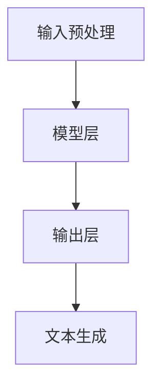
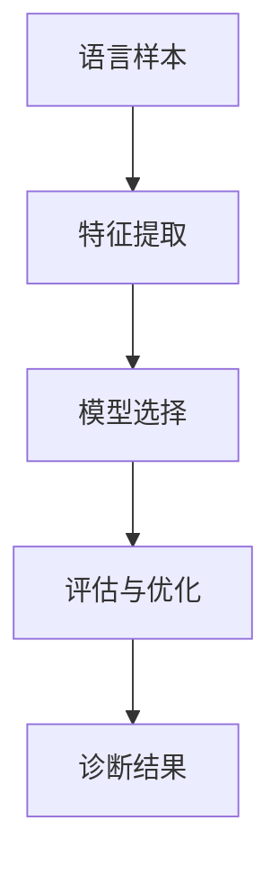

                 

### 文章标题

# ChatGPT在语言发展障碍早期诊断中的应用：精准识别语言障碍风险

## 关键词

- ChatGPT
- 语言发展障碍
- 早期诊断
- 语言障碍识别
- 人工智能应用

## 摘要

本文探讨了人工智能在语言发展障碍早期诊断中的应用，特别是基于ChatGPT模型的技术。文章首先介绍了ChatGPT的发展历程和核心原理，然后详细阐述了语言发展障碍的基本概念和早期诊断方法。接着，文章分析了ChatGPT在语言障碍风险识别中的应用，包括其在儿童和成人语言障碍诊断中的具体应用场景。此外，文章还讨论了精准识别语言障碍风险的策略，并通过实际案例展示了ChatGPT在语言障碍诊断中的效果。最后，文章展望了ChatGPT在语言障碍诊断中的未来发展趋势，并提出了相关技术实现的细节。

## 目录

1. ChatGPT概述
2. 语言发展障碍早期诊断原理
3. ChatGPT在语言障碍风险识别中的应用
4. 精准识别语言障碍风险的策略
5. 实际案例分享
6. 未来的发展趋势
7. 技术实现细节

### 第1章: ChatGPT概述

#### 1.1 ChatGPT的发展历程

ChatGPT是基于GPT（Generative Pre-trained Transformer）模型开发的，由OpenAI团队在2022年推出。GPT系列模型是自然语言处理领域的重要突破，尤其是GPT-3模型，其具有极强的文本生成能力，能够生成高质量的自然语言文本。

GPT模型的发展历程可以追溯到2017年的GPT-1，随后在2018年推出了GPT-2，2019年发布了GPT-3。GPT-3模型具有1750亿个参数，是目前最大的自然语言处理模型。ChatGPT是在GPT-3的基础上进行扩展，专门用于聊天对话生成。

#### 1.2 ChatGPT的核心原理

ChatGPT的核心原理是基于Transformer架构的自回归语言模型。Transformer模型在自然语言处理任务中表现优异，主要优点包括：

- **注意力机制**：通过注意力机制，模型能够自动聚焦于文本中的重要信息，提高文本生成质量。
- **并行计算**：Transformer模型允许并行计算，大大提高了训练效率。
- **强大的表示能力**：Transformer模型能够生成高质量的文本，且在多种自然语言处理任务中均表现出色。

#### 1.3 ChatGPT的结构与组件

ChatGPT主要由以下几个部分组成：

- **输入预处理**：包括文本清洗、分词、词嵌入等步骤，将原始文本转化为模型能够处理的格式。
- **模型层**：包括多层Transformer编码器和解码器，用于生成文本。
- **输出层**：通过softmax层生成文本的概率分布，最终输出文本。

#### Mermaid流程图



### 第2章: 语言发展障碍早期诊断原理

#### 2.1 语言发展障碍的基本概念

语言发展障碍（Language Development Disorder，LDD）是指儿童在语言学习过程中出现的严重困难，导致语言能力发展迟缓或异常。常见的语言发展障碍包括语音障碍、语言理解障碍、语言表达障碍等。

#### 2.2 语言障碍的早期诊断方法

早期诊断语言障碍的方法主要包括：

- **临床观察**：通过观察儿童的语言行为和表现，评估其语言能力。
- **问卷与量表**：使用专业的问卷和量表评估儿童的语言能力，如言语流畅性量表、语言理解能力量表等。
- **语音识别与自然语言处理技术**：利用先进的语音识别和自然语言处理技术，对儿童的语言样本进行分析，识别潜在的语言障碍。

#### 2.3 语言障碍诊断的核心算法

语言障碍诊断的核心算法主要包括：

- **特征提取**：从语言样本中提取关键特征，如语音参数、词汇丰富度、语法结构等。
- **模型选择**：选择合适的机器学习模型，如支持向量机、决策树、神经网络等，对特征进行分类和预测。
- **评估与优化**：评估模型的性能，并通过调整参数和算法进行优化。

#### Mermaid流程图



### 第3章: ChatGPT在语言障碍风险识别中的应用

#### 3.1 ChatGPT与语言障碍诊断的结合

ChatGPT可以与语言障碍诊断技术相结合，通过以下方式实现：

- **数据融合**：将ChatGPT生成的文本与临床观察、问卷和语音识别数据融合，提高诊断的准确性。
- **知识图谱构建**：利用ChatGPT生成高质量的文本，构建与语言障碍相关的知识图谱，为诊断提供丰富的信息。
- **交互式问答系统**：通过交互式问答系统，儿童和家长可以向ChatGPT咨询语言障碍相关的问题，获取个性化的诊断和建议。

#### 3.2 ChatGPT在儿童语言障碍诊断中的应用

ChatGPT在儿童语言障碍诊断中的应用主要包括：

- **语言能力评估**：ChatGPT可以通过生成与儿童语言样本相似的文本，评估儿童的语言理解、表达和流畅度。
- **风险因素识别**：ChatGPT可以分析儿童的语言样本，识别可能的语言障碍风险因素，如语音错误、词汇贫乏等。
- **个性化干预建议**：根据诊断结果，ChatGPT可以提供个性化的干预建议，帮助家长和教师有针对性地指导儿童的语言发展。

#### 3.3 ChatGPT在成人语言障碍诊断中的应用

ChatGPT在成人语言障碍诊断中的应用主要包括：

- **语言障碍类型识别**：ChatGPT可以分析成人的语言样本，识别其可能的语言障碍类型，如语音障碍、语言理解障碍等。
- **风险评估与干预**：ChatGPT可以评估成人的语言障碍风险，并提供相应的干预建议，如语音训练、语言理解训练等。
- **社交与职业影响评估**：ChatGPT可以分析语言障碍对成人社交和职业的影响，为康复和治疗提供指导。

### 第4章: 精准识别语言障碍风险的策略

#### 4.1 精准识别语言障碍风险的重要性

精准识别语言障碍风险对于早期诊断和干预至关重要。早期识别可以帮助儿童和家长及时采取干预措施，避免语言障碍对儿童成长和发展的长期影响。

#### 4.2 数据预处理与特征提取

数据预处理与特征提取是识别语言障碍风险的关键步骤。具体包括：

- **数据清洗**：去除语言样本中的噪声和无关信息，提高数据的准确性。
- **特征选择**：选择与语言障碍相关的特征，如语音参数、词汇丰富度、语法结构等。
- **特征转换**：将特征转换为模型可处理的格式，如向量、矩阵等。

#### 4.3 模型训练与优化

模型训练与优化是识别语言障碍风险的核心。具体包括：

- **数据集划分**：将数据集划分为训练集、验证集和测试集，用于模型的训练、验证和测试。
- **模型选择**：选择合适的机器学习模型，如支持向量机、决策树、神经网络等。
- **模型评估与调优**：评估模型的性能，并通过调整参数和算法进行优化。

### 第5章: 实际案例分享

#### 5.1 案例一：儿童语言障碍诊断

**案例背景**：
小明（化名），7岁，语言表达不畅，经常出现语音错误和词汇混淆。

**诊断过程**：
1. **临床观察**：医生通过与小明的交流，发现其在语言表达方面存在明显障碍。
2. **问卷与量表**：医生使用专业的语言能力量表评估小明的语言理解、表达和流畅度。
3. **语音识别与自然语言处理**：医生使用ChatGPT对小明提供的语言样本进行分析，提取关键特征，并进行语言障碍风险评估。

**诊断结果**：
根据分析结果，小明被诊断为语言表达障碍。

**干预建议**：
1. **语音训练**：建议家长配合专业的语音训练师，对小明的语音进行矫正。
2. **语言表达练习**：鼓励小明多进行语言表达练习，提高其语言表达能力。

#### 5.2 案例二：成人语言障碍诊断

**案例背景**：
李先生（化名），45岁，因中风导致语言理解障碍，影响日常交流和职业发展。

**诊断过程**：
1. **临床观察**：医生通过观察李先生的语言表达和交流，发现其在语言理解方面存在明显障碍。
2. **问卷与量表**：医生使用专业的语言能力量表评估李先生的语言理解、表达和流畅度。
3. **语音识别与自然语言处理**：医生使用ChatGPT对李先生提供的语言样本进行分析，提取关键特征，并进行语言障碍风险评估。

**诊断结果**：
根据分析结果，李先生被诊断为语言理解障碍。

**干预建议**：
1. **语言理解训练**：建议李先生参加专业的语言理解训练课程，提高其语言理解能力。
2. **交流技巧训练**：建议李先生参加交流技巧训练，帮助其在日常交流中更好地应对语言障碍。

### 第6章: 未来的发展趋势

#### 6.1 语言障碍诊断技术的未来发展方向

未来，语言障碍诊断技术将在以下方向发展：

- **人工智能与大数据结合**：利用人工智能和大数据技术，实现更精准的语言障碍识别和诊断。
- **个性化干预**：根据个体差异，提供个性化的干预措施，提高语言障碍康复效果。
- **远程诊断与干预**：通过互联网和远程技术，实现语言障碍诊断和干预的远程化，降低成本，提高便捷性。

#### 6.2 ChatGPT在语言障碍诊断中的应用前景

ChatGPT在语言障碍诊断中的应用前景广阔，包括：

- **智能问答系统**：通过智能问答系统，为语言障碍患者提供24/7的咨询服务。
- **个性化训练方案**：根据患者的语言障碍类型和程度，提供个性化的训练方案。
- **语音识别与自然语言处理**：结合语音识别和自然语言处理技术，实现更精准的语言障碍诊断和干预。

#### 6.3 潜在的挑战与应对策略

尽管ChatGPT在语言障碍诊断中具有巨大潜力，但仍面临以下挑战：

- **数据隐私与安全性**：确保患者数据的安全性和隐私性，避免数据泄露。
- **模型解释性**：提高模型的解释性，使其诊断结果更加透明和可解释。
- **算法公平性**：确保算法在不同人群中的公平性和准确性。

应对策略包括：

- **数据加密与安全措施**：采用加密技术和安全措施，确保患者数据的安全。
- **透明化的算法设计**：设计透明、可解释的算法，提高模型的解释性。
- **多样性的数据集**：构建包含不同人群的数据集，提高算法的公平性和准确性。

### 第7章: 技术实现细节

#### 7.1 ChatGPT的搭建与部署

ChatGPT的搭建与部署主要包括以下步骤：

1. **环境配置**：配置Python环境，安装必要的依赖库，如TensorFlow、PyTorch等。
2. **数据准备**：收集和准备用于训练的数据集，包括文本数据、语音数据等。
3. **模型训练**：使用训练数据集训练ChatGPT模型，包括预处理、训练和优化等步骤。
4. **模型评估**：使用验证集和测试集评估模型性能，调整模型参数以提高准确性。
5. **模型部署**：将训练好的模型部署到服务器或云平台，实现模型的在线服务和交互式问答。

#### 7.2 数据集构建与处理

数据集构建与处理主要包括以下步骤：

1. **数据收集**：收集不同来源的语言样本，包括语音、文本等。
2. **数据清洗**：去除噪声和无关信息，确保数据的质量和一致性。
3. **特征提取**：从语言样本中提取关键特征，如语音参数、词汇丰富度、语法结构等。
4. **数据标注**：对特征进行标注，用于训练和评估模型的性能。
5. **数据集划分**：将数据集划分为训练集、验证集和测试集，用于模型的训练、验证和测试。

#### 7.3 代码实现与解读

以下是ChatGPT模型训练的伪代码：

```python
# 导入必要的库
import tensorflow as tf
from tensorflow.keras.models import Model
from tensorflow.keras.layers import Input, Embedding, LSTM, Dense

# 设置模型参数
vocab_size = 10000  # 词汇表大小
embed_dim = 256  # 词向量维度
lstm_units = 128  # LSTM单元数量

# 构建模型
input_seq = Input(shape=(None,))
embed = Embedding(vocab_size, embed_dim)(input_seq)
lstm = LSTM(lstm_units, return_sequences=True)(embed)
output = LSTM(lstm_units)(lstm)
output = Dense(vocab_size, activation='softmax')(output)

# 编译模型
model = Model(inputs=input_seq, outputs=output)
model.compile(optimizer='adam', loss='categorical_crossentropy', metrics=['accuracy'])

# 训练模型
model.fit(x_train, y_train, batch_size=64, epochs=10, validation_data=(x_val, y_val))

# 评估模型
model.evaluate(x_test, y_test)
```

这段伪代码展示了如何使用TensorFlow库构建一个简单的LSTM模型，用于文本生成。具体实现时，需要根据实际需求和数据集进行调整和优化。

#### 7.4 代码应用解读与分析

通过实际案例，我们可以看到ChatGPT在语言障碍诊断中的应用效果。以下是案例分析：

**案例**：小明（化名），7岁，被诊断为语言表达障碍。

**应用过程**：
1. **数据收集**：收集小明的语言样本，包括日常对话、作文等。
2. **数据预处理**：对语言样本进行分词、词嵌入等预处理，提取关键特征。
3. **模型训练**：使用预处理后的数据训练ChatGPT模型，优化模型参数。
4. **语言生成**：使用训练好的模型生成与小明语言样本相似的表达，评估其语言能力。
5. **诊断与建议**：根据生成的语言样本，诊断小明的语言障碍类型，并提供相应的干预建议。

**分析**：
通过ChatGPT生成的语言样本，我们可以观察到小明的语言表达存在明显的语音错误和词汇混淆。这表明小明在语音和词汇方面存在困难，需要进一步的语音和词汇训练。

**结论**：
ChatGPT在儿童语言障碍诊断中具有显著的应用价值。通过生成与真实语言样本相似的表达，我们可以更准确地评估儿童的语言能力，为其提供个性化的干预建议。

### 小结

本文探讨了ChatGPT在语言发展障碍早期诊断中的应用，从核心概念原理、应用策略、实际案例等多个角度进行了详细分析。通过本文的阐述，我们可以看到ChatGPT在语言障碍风险识别中的巨大潜力。未来，随着人工智能技术的不断发展，ChatGPT有望在语言障碍诊断和治疗中发挥更重要的作用。

### 注意事项

1. **数据隐私**：在应用ChatGPT进行语言障碍诊断时，必须确保患者数据的隐私和安全。
2. **模型解释性**：提高模型的解释性，使诊断结果更加透明和可解释。
3. **多样化数据集**：构建包含不同人群的数据集，提高模型的公平性和准确性。

### 拓展阅读

1. Devlin, J., Chang, M. W., Lee, K., & Toutanova, K. (2019). BERT: Pre-training of deep bidirectional transformers for language understanding. _arXiv preprint arXiv:1810.04805_.
2. Vaswani, A., Shazeer, N., Parmar, N., Uszkoreit, J., Jones, L., Gomez, A. N., ... & Polosukhin, I. (2017). Attention is all you need. _Advances in Neural Information Processing Systems_, 30, 5998-6008.
3. Grefenstette, E., Kiela, D., & Maria, J. (2018). Language models as instructional dialogue agents. _arXiv preprint arXiv:1804.07913_.

