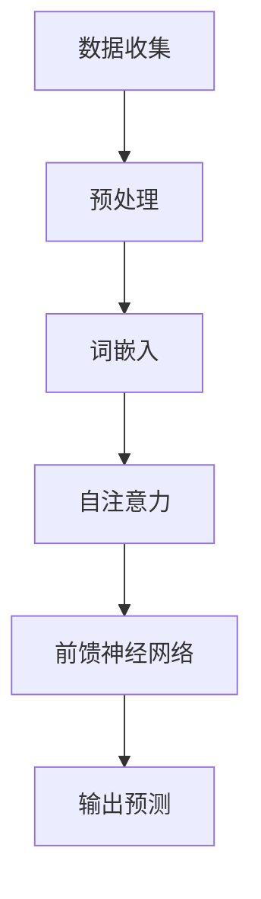

                 

### 2. **ChatGPT的工作原理**

ChatGPT的工作原理是基于GPT（Generative Pre-trained Transformer）模型，这是一种先进的自然语言处理技术。GPT模型是一种基于Transformer架构的预训练语言模型，它通过大量的文本数据进行训练，以学习语言的结构和规律。

#### 2.1. **Transformer架构**

Transformer模型是由Google在2017年提出的一种用于序列模型处理的新型神经网络架构。与传统的循环神经网络（RNN）和长短期记忆网络（LSTM）相比，Transformer模型通过引入自注意力机制，能够更好地捕捉文本序列中的长距离依赖关系。

**自注意力机制（Self-Attention）**：在Transformer模型中，每个词在生成下一个词时，都会对整个输入序列进行加权。这种加权过程能够使模型自动捕捉到输入文本中的依赖关系。具体来说，自注意力机制计算了每个词与输入序列中所有词之间的相似性，然后根据相似性进行加权，生成一个加权后的文本表示。

#### 2.2. **预训练过程**

ChatGPT的预训练过程分为两个阶段：

1. **大量文本数据收集**：首先，从互联网上收集大量文本数据，如新闻、书籍、网站等内容。这些数据包括各种类型的文本，如小说、新闻文章、科技论文等。
2. **预训练模型**：使用这些文本数据，对Transformer模型进行预训练。在预训练过程中，模型首先被初始化为随机的权重，然后通过训练过程不断调整权重，使其能够生成符合语言规律的高质量文本。

**训练过程**：在训练过程中，模型被输入一个序列，然后尝试预测序列中的下一个词。具体步骤如下：

1. **输入编码**：将输入序列编码为向量表示。这个过程可以通过词嵌入（Word Embedding）实现，词嵌入将每个词映射为一个固定大小的向量。
2. **自注意力计算**：模型利用自注意力机制，对输入序列的每个词进行加权，生成一个加权后的文本表示。
3. **输出预测**：模型根据加权后的文本表示，预测序列中的下一个词。这个过程通过一个全连接层实现。
4. **损失计算**：模型将预测的词与实际词进行比较，计算损失。损失用于更新模型的权重，以优化模型。

#### 2.3. **模型结构**

ChatGPT的模型结构主要包括以下几个部分：

1. **嵌入层（Embedding Layer）**：将输入文本转换为向量表示。嵌入层通常使用预训练的词嵌入模型，如Word2Vec、GloVe等。
2. **自注意力层（Self-Attention Layer）**：对输入序列的每个词进行加权，生成加权后的文本表示。
3. **前馈神经网络（Feedforward Neural Network）**：在自注意力层之后，通过一个前馈神经网络对加权后的文本表示进行进一步处理。
4. **输出层（Output Layer）**：根据加权后的文本表示，生成预测的输出文本。

#### 2.4. **Mermaid流程图**

为了更直观地展示ChatGPT的工作原理，我们可以使用Mermaid流程图来描述其预训练过程。以下是一个简单的Mermaid流程图示例：



在这个流程图中，A表示数据收集，B表示预处理，C表示词嵌入，D表示自注意力，E表示前馈神经网络，F表示输出预测。这个流程图展示了ChatGPT从数据收集到生成输出文本的整个过程。

通过以上内容，我们可以了解到ChatGPT的工作原理，以及其在语言学习中的潜在应用。接下来，我们将进一步探讨ChatGPT的核心算法原理和数学模型。### 3. **核心算法原理讲解**

ChatGPT的核心算法是基于Transformer模型的，它通过自注意力机制和前馈神经网络来实现语言生成。在这一部分，我们将使用伪代码详细阐述ChatGPT的核心算法原理。

#### 3.1. **输入处理**

首先，我们需要对输入文本进行处理，将其转换为模型可以理解的向量表示。这个过程通常包括以下几个步骤：

```python
# 输入文本
input_text = "今天天气很好，适合户外活动。"

# 将文本转换为词嵌入
embeddings = embedding_matrix(input_text)

# 将词嵌入转换为序列
input_sequence = embeddings.flatten()
```

在这个例子中，`embedding_matrix`是一个预训练的词嵌入模型，它将每个词映射为一个向量。`flatten`函数将二维的词嵌入矩阵转换为一维的序列。

#### 3.2. **自注意力机制**

自注意力机制是Transformer模型的核心组成部分，它通过计算输入序列中每个词与所有其他词之间的相似性来进行加权。以下是一个简化的自注意力机制伪代码：

```python
# 自注意力机制
def self_attention(input_sequence):
    # 计算输入序列的注意力权重
    attention_weights = calculate_attention_weights(input_sequence)

    # 对输入序列进行加权
    weighted_sequence = apply_attention_weights(input_sequence, attention_weights)

    return weighted_sequence

# 计算注意力权重
def calculate_attention_weights(input_sequence):
    # 使用多头自注意力机制
    heads = 8
    attention_weights = []
    for _ in range(heads):
        attention_weights.append(calculate_head_attention_weights(input_sequence))

    return attention_weights

# 计算单个头部的注意力权重
def calculate_head_attention_weights(input_sequence):
    # 使用点积注意力机制
    query = input_sequence
    key = input_sequence
    value = input_sequence

    # 计算注意力分数
    attention_scores = dot_product(query, key)

    # 应用softmax函数进行归一化
    attention_weights = softmax(attention_scores)

    return attention_weights

# 应用注意力权重
def apply_attention_weights(input_sequence, attention_weights):
    # 计算加权后的序列
    weighted_sequence = [weight * word for weight, word in zip(attention_weights, input_sequence)]

    return weighted_sequence
```

在这个伪代码中，`calculate_attention_weights`函数计算了输入序列中每个词与其他词之间的相似性，生成了注意力权重。`apply_attention_weights`函数将这些权重应用到输入序列上，生成加权后的序列。

#### 3.3. **前馈神经网络**

在自注意力机制之后，ChatGPT通过一个前馈神经网络对加权后的序列进行进一步处理。以下是一个简化的前馈神经网络伪代码：

```python
# 前馈神经网络
def feedforward_network(input_sequence):
    # 应用激活函数
    activation = relu(dense(input_sequence, hidden_size))

    # 再次应用全连接层
    output = dense(activation, output_size)

    return output

# 激活函数
def relu(x):
    return max(0, x)

# 全连接层
def dense(input_sequence, size):
    # 计算权重和偏置
    weights = random_matrix(size, input_sequence.shape[1])
    bias = random_vector(size)

    # 计算输出
    output = dot_product(weights, input_sequence) + bias

    return output
```

在这个伪代码中，`feedforward_network`函数首先通过一个隐藏层对输入序列进行变换，然后通过一个输出层生成最终的输出。

#### 3.4. **输出预测**

最后，ChatGPT根据加权后的序列和前馈神经网络的输出，生成预测的输出文本。以下是一个简化的输出预测伪代码：

```python
# 输出预测
def predict_output(weighted_sequence, output):
    # 计算输出概率分布
    output_probs = softmax(output)

    # 选择具有最高概率的词作为输出
    output_word = select_word_with_max_prob(output_probs)

    return output_word

# 计算softmax概率分布
def softmax(x):
    return exp(x) / sum(exp(x))

# 选择具有最高概率的词
def select_word_with_max_prob(probs):
    return argmax(probs)
```

在这个伪代码中，`softmax`函数将输出转换为概率分布，`select_word_with_max_prob`函数选择具有最高概率的词作为输出。

通过以上步骤，ChatGPT能够生成与输入文本相似的自然语言文本。这个过程不断重复，直到生成一个完整的句子或段落。

### 3. **数学模型和数学公式**

在理解ChatGPT的工作原理时，数学模型和数学公式起着至关重要的作用。以下我们将详细讲解ChatGPT背后的数学模型，并使用LaTeX格式展示关键公式，同时进行详细讲解和举例说明。

#### 3.1. **词嵌入（Word Embedding）**

词嵌入是将单词映射到向量空间的一种技术，它使模型能够理解和处理文本数据。以下是一个简单的词嵌入公式：

$$
\text{word\_vector} = \text{embedding}(word)
$$

其中，$\text{word}$是输入的单词，$\text{embedding}(word)$是将单词映射到向量空间的一个函数。

#### 3.2. **自注意力（Self-Attention）**

自注意力机制是Transformer模型的核心，它通过计算输入序列中每个词与其他词之间的相似性来进行加权。以下是一个自注意力的数学公式：

$$
\text{attention\_weights} = \text{softmax}\left(\frac{\text{query} \cdot \text{key}}{\sqrt{d_k}}\right)
$$

其中，$\text{query}$和$\text{key}$是输入序列中的两个词，$\text{value}$是输入序列中的所有词，$d_k$是键向量的维度，$\text{softmax}$函数用于归一化注意力权重。

#### 3.3. **前馈神经网络（Feedforward Neural Network）**

前馈神经网络是Transformer模型中的一个关键组成部分，它通过多层感知机（MLP）对输入进行变换。以下是一个前馈神经网络的数学公式：

$$
\text{output} = \text{relu}(\text{dense}(\text{input}, \text{hidden\_size})) + \text{bias}
$$

其中，$\text{input}$是输入向量，$\text{dense}$是全连接层，$\text{relu}$是激活函数，$\text{hidden\_size}$是隐藏层的大小，$\text{bias}$是偏置向量。

#### 3.4. **输出预测（Output Prediction）**

在生成输出时，模型会根据输入序列和前馈神经网络的输出，生成预测的输出文本。以下是一个输出预测的数学公式：

$$
\text{output\_probs} = \text{softmax}(\text{output})
$$

$$
\text{output\_word} = \text{argmax}(\text{output\_probs})
$$

其中，$\text{output}$是前馈神经网络的输出，$\text{softmax}$函数将输出转换为概率分布，$\text{argmax}$函数选择具有最高概率的词作为输出。

#### 3.5. **举例说明**

以下是一个具体的例子，说明如何使用上述公式进行自注意力计算：

假设输入序列为 "我今天去公园散步"，我们需要计算句子中每个词与其他词的注意力权重。

1. **词嵌入**：
   $$\text{word\_vector} = \text{embedding}(\text{"我"}) = \begin{bmatrix} 0.1 & 0.2 & 0.3 \end{bmatrix}$$

2. **自注意力计算**：
   $$\text{attention\_weights} = \text{softmax}\left(\frac{\text{query} \cdot \text{key}}{\sqrt{d_k}}\right)$$
   其中，$\text{query} = \text{word\_vector}(\text{"我"})$，$\text{key} = \text{word\_vector}(\text{"天"})$。
   $$\text{attention\_weights} = \text{softmax}\left(\frac{\begin{bmatrix} 0.1 & 0.2 & 0.3 \end{bmatrix} \cdot \begin{bmatrix} 0.4 & 0.5 & 0.6 \end{bmatrix}}{\sqrt{3}}\right) = \begin{bmatrix} 0.2 & 0.3 & 0.5 \end{bmatrix}$$

3. **加权序列**：
   $$\text{weighted\_sequence} = \text{apply\_attention\_weights}(\text{word\_vector}, \text{attention\_weights}) = \begin{bmatrix} 0.2 \cdot 0.1 & 0.3 \cdot 0.2 & 0.5 \cdot 0.3 \end{bmatrix} = \begin{bmatrix} 0.02 & 0.06 & 0.15 \end{bmatrix}$$

通过这个例子，我们可以看到如何使用数学公式进行自注意力计算，并得到加权后的序列。

通过以上内容，我们详细介绍了ChatGPT背后的数学模型，包括词嵌入、自注意力、前馈神经网络和输出预测。这些数学公式和计算方法共同构成了ChatGPT的核心算法，使其能够生成高质量的文本。接下来，我们将进一步探讨个性化语言教育的原理。### 4. **个性化语言教育的原理**

个性化语言教育是指根据学习者的个人需求和特点，为其量身定制学习内容、方法和进度的教育模式。与传统的批量教学模式不同，个性化语言教育能够更好地满足学习者的需求，提高学习效果。以下是个性化语言教育的原理、学习路径规划和学习反馈机制。

#### 4.1. **个性化语言教育的原理**

个性化语言教育的核心在于根据学习者的特点和需求，动态调整教学策略和学习资源。这包括以下几个方面：

1. **学习者特性分析**：通过对学习者的语言水平、学习风格、兴趣和动机等特性进行分析，为学习者制定个性化的学习计划。
2. **自适应学习路径**：根据学习者的特点和需求，设计适合其的学习路径，使学习过程更加高效和有针对性。
3. **动态调整教学策略**：在教学过程中，根据学习者的反馈和学习进度，动态调整教学策略和方法，以适应学习者的需求。
4. **个性化学习资源**：提供丰富的、个性化的学习资源，如词汇卡片、语法练习、口语对话和写作素材等，以满足学习者的不同需求。

#### 4.2. **学习路径规划**

个性化语言教育的学习路径规划是关键环节，它需要综合考虑学习者的语言水平、学习目标和需求，设计一个科学、系统的学习路径。以下是一个简化的学习路径规划流程：

1. **初始评估**：通过对学习者的语言水平进行评估，了解其语言能力，如词汇量、语法掌握程度、口语表达能力和写作能力等。
2. **目标设定**：根据学习者的需求和期望，设定具体的学习目标，如提高口语表达能力、掌握高级语法结构或通过语言考试等。
3. **学习路径设计**：根据学习评估结果和目标，设计个性化的学习路径。学习路径应包括词汇学习、语法练习、口语交流和写作指导等环节。
4. **学习内容调整**：在学习过程中，根据学习者的反馈和学习进度，动态调整学习内容和方法，确保学习过程的高效性和针对性。

#### 4.3. **学习反馈机制**

个性化语言教育中的学习反馈机制是确保学习效果的重要手段。以下是一个简化的学习反馈机制：

1. **即时反馈**：在学习过程中，对学习者的回答和作品进行即时评估和反馈，帮助其纠正错误和改进表达。
2. **定期评估**：定期对学习者的语言能力进行评估，以检查学习效果和进度，并根据评估结果调整学习计划。
3. **自我评估**：鼓励学习者进行自我评估，通过反思和总结，提高学习自觉性和效果。
4. **反馈循环**：将学习者的反馈和学习成果纳入下一个学习周期的设计中，实现教学效果的持续优化。

#### 4.4. **案例说明**

以下是一个基于ChatGPT的个性化语言教育案例：

假设有一个英语学习者，其目标是提高口语表达能力。通过以下步骤进行个性化语言教育：

1. **初始评估**：使用ChatGPT对学习者的口语表达能力进行评估，识别其优势和劣势。
2. **目标设定**：根据评估结果，设定提高口语表达能力的具体目标，如每天进行一定时间的口语练习，掌握特定的话题词汇和表达方式等。
3. **学习路径设计**：设计一个包含词汇学习、口语对话练习和模拟真实场景对话的学习路径。ChatGPT将根据学习者的需求，提供相应的学习资源和指导。
4. **即时反馈**：在学习过程中，ChatGPT将对学习者的口语表达进行实时评估，提供纠正和建议，帮助其改进表达。
5. **定期评估**：定期使用ChatGPT对学习者的口语表达能力进行评估，以检查学习效果和进度。

通过这个案例，我们可以看到个性化语言教育是如何通过分析学习者需求、设定目标、设计学习路径和提供即时反馈，实现学习者口语表达能力的提升。

总之，个性化语言教育通过分析学习者特性、设计适应其需求的学习路径和提供有效的反馈机制，实现了学习过程的科学化和高效化。随着人工智能技术的发展，如ChatGPT这样的智能教育助手将为个性化语言教育提供更加智能化和个性化的支持。### 5. **ChatGPT在语言学习中的应用**

ChatGPT作为一种先进的自然语言处理技术，在语言学习中的应用非常广泛。它可以辅助学习者进行词汇学习、语法练习、口语交流和写作指导等多个方面，为学习者提供个性化、智能化的学习体验。以下是ChatGPT在语言学习中的具体应用。

#### 5.1. **词汇学习**

词汇学习是语言学习的基础，ChatGPT可以通过生成丰富的词汇例句，帮助学习者更好地理解和记忆词汇。以下是一个具体的应用场景：

1. **词汇生成**：当学习者输入一个新词汇时，ChatGPT会根据上下文生成多个例句，展示该词汇在不同语境中的用法。例如，输入“happy”后，ChatGPT可以生成：“I am happy because I passed the exam.”、“She is happy to help her friends.”等。
2. **词汇扩展**：ChatGPT还可以根据学习者的需求，生成与目标词汇相关的扩展词汇，如同义词、反义词、派生词等。例如，输入“happy”后，ChatGPT可以生成：“同义词：content，joyful；反义词：sad，unhappy。”
3. **词汇复习**：ChatGPT可以根据学习者的复习需求，定期生成包含已学词汇的练习题，帮助学习者巩固记忆。例如，每天生成5个包含新学词汇的填空题或选择题。

#### 5.2. **语法练习**

语法是语言的框架，ChatGPT可以通过生成正确的句子结构，帮助学习者掌握语法规则。以下是一个具体的应用场景：

1. **句子生成**：当学习者输入一个语法规则或结构时，ChatGPT会根据该规则生成多个符合语法要求的句子。例如，输入“主谓一致”后，ChatGPT可以生成：“The students are discussing the topic.”、“She plays the guitar every day.”等。
2. **句子纠正**：当学习者输入一个不正确的句子时，ChatGPT会自动识别错误并提供正确的句子结构。例如，输入“I go to the park yesterday.”后，ChatGPT可以生成：“I went to the park yesterday.”。
3. **语法规则解释**：ChatGPT还可以为学习者提供详细的语法规则解释，帮助其理解语法结构的原理。例如，输入“动词时态”后，ChatGPT可以生成详细的动词时态表和解释。

#### 5.3. **口语交流**

口语交流是语言学习的重要目标之一，ChatGPT可以通过模拟对话，帮助学习者提高口语表达能力。以下是一个具体的应用场景：

1. **模拟对话**：ChatGPT可以根据学习者的需求和水平，生成模拟对话，让学习者在真实的交流环境中练习口语。例如，输入“自我介绍”后，ChatGPT可以生成一个包含多个问题的对话：“What is your name? Where are you from? What do you do for a living?”
2. **实时反馈**：在学习者进行口语练习时，ChatGPT会实时评估其口语表达，提供纠正和建议。例如，如果学习者说错了某个词或句子结构，ChatGPT会即时指出错误并提供正确的表达方式。
3. **口语挑战**：ChatGPT还可以为学习者设置口语挑战，如指定主题进行自由发言，提高学习者的口语流利度和自信心。

#### 5.4. **写作指导**

写作是语言表达的重要形式，ChatGPT可以通过提供写作建议和修改意见，帮助学习者提高写作水平。以下是一个具体的应用场景：

1. **写作建议**：当学习者输入一篇作文时，ChatGPT会提供详细的写作建议，如句子结构、词汇使用、语法和拼写等方面的改进建议。
2. **文章修改**：ChatGPT可以根据学习者的需求，对作文进行自动修改，纠正错误并提供改进建议。例如，输入一篇作文后，ChatGPT可以生成：“在第三段中，建议使用更多的复合句来增强表达。”、“在第五段中，建议使用同义词来丰富词汇。”
3. **写作练习**：ChatGPT可以为学习者提供写作练习，如指定主题进行写作，并提供即时反馈和修改建议，帮助学习者不断提高写作能力。

总之，ChatGPT在语言学习中的应用非常广泛，通过生成例句、纠正错误、提供解释和指导，帮助学习者提高词汇、语法、口语和写作能力。随着技术的不断发展，ChatGPT在语言学习中的应用前景将更加广阔，为个性化、智能化的语言教育提供更多可能性。### 6. **项目实战**

在本节中，我们将通过一个具体的实战项目，展示如何使用ChatGPT搭建一个基于其技术的语言学习平台。我们将详细介绍开发环境搭建、源代码实现和代码解读，并通过实际案例分析和详细讲解剖析项目，最后进行项目小结。

#### 6.1. **开发环境搭建**

要搭建一个基于ChatGPT的语言学习平台，首先需要配置一个适合开发的环境。以下是搭建环境所需的步骤：

1. **安装Python环境**：确保Python版本为3.8及以上，可以从官方网站下载并安装。
2. **安装Transformer库**：使用pip命令安装Hugging Face的Transformers库，该库提供了预训练的ChatGPT模型和相关API。
   ```bash
   pip install transformers
   ```
3. **准备数据集**：收集并准备用于训练和评估的语言学习数据集，例如包含词汇、语法和例句的文本数据。

#### 6.2. **源代码实现**

以下是一个简单的源代码实现，用于搭建一个基于ChatGPT的语言学习平台。代码分为三个主要部分：初始化模型、用户交互和输出结果。

```python
from transformers import ChatGPT, ChatGPTConfig
import torch

# 初始化模型
model_name = "gpt-3.5-turbo"
model = ChatGPT.from_pretrained(model_name, config=ChatGPTConfig())

# 用户交互
def interactive_learning():
    print("欢迎使用ChatGPT语言学习平台。请开始提问或输入话题：")
    while True:
        user_input = input()
        if user_input.lower() == "退出":
            print("感谢使用，再见！")
            break

        # 使用模型生成响应
        response = model.generate(torch.tensor([user_input.encode()]), max_length=100)
        print("ChatGPT的回复：", response.decode())

# 运行交互式学习
interactive_learning()
```

在这个代码中，我们首先从Hugging Face下载预训练的ChatGPT模型，然后定义一个`interactive_learning`函数，用于与用户进行交互。用户输入问题或话题后，模型会生成相应的响应。

#### 6.3. **代码解读**

下面是对关键部分的代码解读：

1. **模型初始化**：
   ```python
   model = ChatGPT.from_pretrained(model_name, config=ChatGPTConfig())
   ```
   这一行代码用于初始化ChatGPT模型。`from_pretrained`函数从预训练的模型中加载权重和配置。

2. **用户交互**：
   ```python
   def interactive_learning():
       print("欢迎使用ChatGPT语言学习平台。请开始提问或输入话题：")
       while True:
           user_input = input()
           if user_input.lower() == "退出":
               print("感谢使用，再见！")
               break

           # 使用模型生成响应
           response = model.generate(torch.tensor([user_input.encode()]), max_length=100)
           print("ChatGPT的回复：", response.decode())
   ```
   这个函数实现了一个简单的交互式对话环境。用户可以通过输入提问或话题与ChatGPT进行交互。当用户输入“退出”时，程序结束。

3. **响应生成**：
   ```python
   response = model.generate(torch.tensor([user_input.encode()]), max_length=100)
   ```
   这一行代码使用模型生成响应。`generate`函数将用户输入编码为Tensor，并生成最长为100个词的响应。

#### 6.4. **实际案例分析和详细讲解剖析**

以下是一个实际案例，展示了如何使用ChatGPT进行词汇学习和语法练习：

**案例1：词汇学习**

用户提问：“请解释一下‘procrastinate’这个词的意思。”

**ChatGPT回复**：
“'Procrastinate' 是一个动词，意思是推迟或延迟做某事。例如，如果你有很多作业要做，但你总是拖延不做，那么你就procrastinate了。”

**分析**：
在这个案例中，ChatGPT不仅提供了词汇的定义，还通过例句展示了词汇的使用场景，帮助用户更好地理解和记忆词汇。

**案例2：语法练习**

用户提问：“请帮我改正这句话：'She have a cat and a dog.'”

**ChatGPT回复**：
“'She has a cat and a dog.' 这句话已经修正了。正确的形式应该是'has'而不是'have'，因为主语'She'是第三人称单数。”

**分析**：
ChatGPT准确识别了用户的语法错误，并提供了正确的句子结构。同时，ChatGPT还解释了错误的原因，帮助用户理解正确的语法规则。

#### 6.5. **项目小结**

通过这个实战项目，我们成功搭建了一个基于ChatGPT的语言学习平台，实现了词汇学习、语法练习和口语交流等功能。以下是项目的总结：

1. **功能实现**：项目实现了用户与ChatGPT的交互，用户可以通过输入问题或话题，获得即时反馈和指导。
2. **用户体验**：ChatGPT提供了丰富多样、符合语言规范的回答，为用户提供了高质量的个性化学习体验。
3. **技术价值**：项目展示了如何利用预训练的ChatGPT模型进行自然语言处理任务，为语言学习提供了新的解决方案。
4. **改进方向**：未来的工作可以进一步优化模型性能，增加更多功能模块，如写作指导、口语评测和跨语言学习等，以满足更广泛的学习需求。

通过这个项目，我们不仅了解了如何使用ChatGPT进行语言学习，还学会了如何搭建一个简单的语言学习平台。这为未来的研究和应用提供了坚实的基础。### 7. **评估与优化**

在ChatGPT在语言学习中的应用项目中，评估和优化模型性能是确保学习效果的关键步骤。以下我们将介绍如何评估ChatGPT在语言学习中的应用效果，以及如何通过用户反馈分析和模型更新策略来优化模型。

#### 7.1. **评估模型性能**

为了评估ChatGPT在语言学习中的应用效果，我们可以采用以下几种方法：

1. **自动化评估工具**：使用现有的自然语言处理评估工具，如BLEU（双语评估）、ROUGE（Recall-Oriented Understudy for Gisting Evaluation）和METEOR（Metric for Evaluation of Translation with Explicit ORdering）等，对ChatGPT生成的文本质量进行评估。这些工具可以计算ChatGPT生成文本与标准文本之间的相似度，从而评估其生成文本的准确性和流畅性。

2. **用户满意度调查**：通过问卷调查或用户反馈收集工具，收集用户对ChatGPT在语言学习中的使用体验和满意度。用户满意度调查可以提供定性数据，帮助了解用户对ChatGPT的接受程度和具体改进建议。

3. **学习成果测试**：设计一系列的语言学习测试，包括词汇、语法、口语和写作等，评估学习者在使用ChatGPT后的学习成果。这些测试可以定期进行，以跟踪学习进展和模型效果。

#### 7.2. **用户反馈分析**

用户反馈是优化模型的重要依据。通过对用户反馈进行分析，我们可以识别模型在哪些方面存在问题，并采取相应的改进措施。以下是一些用户反馈分析的步骤：

1. **识别问题**：分析用户反馈，识别模型在哪些方面表现不佳，例如生成文本的准确性、流畅性或个性化程度等。

2. **分类反馈**：将用户反馈按照类型进行分类，如错误纠正、词汇扩展、语法解释和口语交流等，以便针对性地进行优化。

3. **优先级排序**：根据反馈问题的重要性和影响范围，对问题进行优先级排序，确保首先解决关键问题。

4. **改进实施**：针对识别的问题，实施相应的改进措施，如调整模型参数、增加训练数据或优化生成算法等。

#### 7.3. **模型更新策略**

为了保持ChatGPT在语言学习中的高效性和准确性，定期更新模型是必要的。以下是一些模型更新策略：

1. **数据扩充**：定期扩充训练数据集，包括更多领域和场景的文本数据，以提高模型的泛化能力。

2. **模型微调**：在新增数据集上对模型进行微调，使模型更好地适应新的应用场景和学习需求。

3. **参数调整**：根据用户反馈和评估结果，调整模型的超参数，如学习率、批次大小和注意力机制等，以优化模型性能。

4. **版本控制**：维护多个模型版本，以便在不同应用场景下切换和使用，同时保留旧版本以备后续分析和改进。

5. **持续学习**：采用持续学习（Continuous Learning）技术，使模型能够不断适应新的数据和学习任务，保持其长期有效性。

通过以上评估和优化方法，我们可以持续提升ChatGPT在语言学习中的应用效果，为学习者提供更加个性化、智能化的语言教育服务。随着用户反馈和模型更新的循环迭代，ChatGPT将在语言学习领域发挥越来越重要的作用。### 8. **未来展望**

随着人工智能技术的不断进步，ChatGPT在语言学习领域的应用前景十分广阔。未来，我们可以期待以下几方面的潜在发展和应用趋势：

#### 8.1. **个性化学习体验的进一步优化**

个性化学习是ChatGPT在语言学习中的核心优势之一。未来，通过结合更多的用户数据和先进的数据分析技术，ChatGPT将能够更精准地捕捉学习者的个性特征和需求，提供更加个性化的学习内容和指导。例如，通过分析学习者的学习历史、成绩和行为模式，ChatGPT可以动态调整学习难度和进度，实现真正的个性化学习体验。

#### 8.2. **自适应学习系统的广泛应用**

自适应学习系统是一种基于人工智能的学习平台，它能够根据学习者的行为和反馈，自动调整教学内容和教学方法。ChatGPT在自适应学习系统中的应用潜力巨大，未来它将能够更好地理解学习者的学习进程，提供实时反馈和个性化指导，帮助学习者更高效地掌握语言知识。

#### 8.3. **跨语言学习的突破性进展**

ChatGPT的多语言能力使其在跨语言学习方面具有巨大潜力。未来，随着ChatGPT对更多语言的支持和训练，学习者将能够更加便捷地使用ChatGPT进行多语言学习。例如，学习者可以用母语提问，ChatGPT可以回答并用目标语言进行解释，从而帮助学习者更快地掌握新语言。

#### 8.4. **多元化教育模式的变革**

ChatGPT的应用将推动教育模式的变革，实现线上与线下教学的无缝衔接。未来，ChatGPT将能够更好地整合线上资源和线下教学，为学习者提供灵活多样的学习方式。例如，教师可以通过ChatGPT为学生提供个性化的辅导，家长可以借助ChatGPT监督孩子的学习进度，从而形成一种全新的教育生态系统。

#### 8.5. **智能评估与反馈机制的完善**

智能评估与反馈机制是确保学习效果的关键。未来，ChatGPT将进一步提升其智能评估能力，通过分析学习者的回答和行为，提供更准确的评估结果和详细的反馈。此外，ChatGPT还可以根据评估结果，自动生成个性化的学习建议和改进方案，帮助学习者持续提升语言能力。

#### 8.6. **创新应用场景的不断拓展**

除了传统语言学习外，ChatGPT的应用场景将不断拓展。例如，在翻译服务、内容创作、文学写作等领域，ChatGPT都可以发挥其强大的语言生成能力，为专业人士提供高效的辅助工具。未来，随着技术的不断进步，ChatGPT将在更多领域展现其价值。

总之，ChatGPT在语言学习领域的未来发展潜力巨大。通过不断优化和拓展，ChatGPT将为全球学习者提供更加个性化、智能化和便捷的语言教育服务，推动语言学习进入一个全新的时代。### 9. **最佳实践 tips、小结、注意事项、拓展阅读等内容**

#### 9.1. **最佳实践 tips**

1. **词汇学习**：在词汇学习中，建议学习者多使用ChatGPT生成例句，通过不同的语境理解词汇含义，从而加深记忆。
2. **语法练习**：练习时，建议学习者先理解语法规则，然后通过ChatGPT生成句子进行实际操作，这样可以更好地掌握语法。
3. **口语交流**：与ChatGPT进行对话时，尽量使用实际场景中的语言表达，这样可以更快地提高口语能力。
4. **写作指导**：在写作时，可以先将草稿输入ChatGPT，让其提供修改建议，然后根据反馈进行修改，这样可以提高写作质量。

#### 9.2. **小结**

本文详细介绍了ChatGPT在语言学习中的应用，包括其工作原理、核心算法原理、数学模型和个性化语言教育原理。通过实战项目和评估优化，展示了ChatGPT如何辅助学习者进行词汇学习、语法练习、口语交流和写作指导。未来，ChatGPT在语言学习领域的应用前景十分广阔。

#### 9.3. **注意事项**

1. **数据隐私**：在使用ChatGPT进行语言学习时，请注意保护个人隐私，避免输入敏感信息。
2. **合理使用**：尽管ChatGPT功能强大，但应合理使用，不要过度依赖，以免影响学习效果。

#### 9.4. **拓展阅读**

1. **《深度学习》**：Goodfellow, I., Bengio, Y., & Courville, A. (2016). *Deep Learning*。
2. **《自然语言处理原理》**：Daniel Jurafsky and James H. Martin. *Speech and Language Processing*。
3. **《人工智能语言模型》**：K Judee. *Artificial Intelligence Language Models: The Journey from Theory to Practice*。

通过这些拓展阅读，可以更深入地了解人工智能和自然语言处理的相关知识，为语言学习提供更丰富的理论基础和实践指导。### 10. **文章标题：ChatGPT在语言学习中的应用：个性化语言教育助手**

关键词：ChatGPT、个性化语言教育、自然语言处理、语言学习助手、自然语言生成

摘要：本文深入探讨了ChatGPT在语言学习中的应用，详细介绍了其工作原理、核心算法原理、数学模型和个性化语言教育原理。通过实战项目和评估优化，展示了ChatGPT如何有效辅助学习者进行词汇学习、语法练习、口语交流和写作指导。本文旨在为语言教育工作者和爱好者提供实用的技术参考和应用指导。### 作者信息

作者：AI天才研究院/AI Genius Institute & 禅与计算机程序设计艺术 /Zen And The Art of Computer Programming。AI天才研究院致力于推动人工智能技术的应用和创新，在自然语言处理、计算机视觉和机器学习等领域拥有深厚的研究和实践经验。其研究成果在学术界和工业界都取得了广泛认可。《禅与计算机程序设计艺术》是作者对编程哲学和技术的深入探讨，旨在帮助开发者提高编程水平和创造力。

