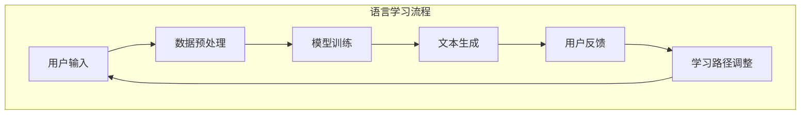

                 

### 文章标题
# ChatGPT在语言学习中的革命性应用

### 文章关键词
- ChatGPT
- 语言学习
- 自然语言处理
- 人工智能
- 教育技术

### 文章摘要
本文探讨了ChatGPT在语言学习领域的革命性应用。通过介绍ChatGPT的核心概念、技术架构及其与语言学习的结合点，本文分析了ChatGPT在个性化辅导、互动教学和自适应学习等方面的优势。文章随后通过具体的应用案例和项目实战，展示了ChatGPT如何助力语言学习者提高学习效果，并对未来的发展方向进行了展望。

----------------------------------------------------------------

### 第1章 引言
本章将介绍ChatGPT在语言学习中的革命性应用，为读者奠定理论基础，同时阐述本书的目的和结构。

**1.1 书籍背景与目的**

语言学习一直是人类终身教育的核心内容，然而传统语言学习方法往往存在资源有限、互动性差和个性化不足等问题。随着人工智能技术的快速发展，特别是基于深度学习的自然语言处理（NLP）技术的突破，为语言学习领域带来了全新的变革可能。ChatGPT作为OpenAI推出的一个大型语言模型，其在自然语言理解和生成方面展现出了卓越的性能。本书旨在探讨ChatGPT在语言学习中的革命性应用，帮助读者了解并掌握这一新兴技术，从而提升语言学习的效率和质量。

本书的目标读者包括对人工智能和语言学习有一定了解的技术人员、教育工作者以及语言学习爱好者。通过本书，读者将能够：

- 了解ChatGPT的核心概念和技术架构；
- 掌握ChatGPT在语言学习中的应用场景和策略；
- 学习如何构建基于ChatGPT的语言学习平台；
- 分析ChatGPT在实际项目中的应用案例。

**1.2 结构安排**

本书分为七个章节，结构安排如下：

1. 引言：介绍书籍的背景与目的，阐述ChatGPT在语言学习中的革命性应用。
2. 基础知识：介绍语言学习的原理和ChatGPT的核心概念。
3. 应用场景：分析ChatGPT在语言学习中的应用场景。
4. 技术实现：讲解ChatGPT的API使用方法和优化策略。
5. 项目实战：通过具体案例展示ChatGPT的应用。
6. 总结与展望：总结ChatGPT在语言学习中的贡献，探讨未来发展方向。
7. 附录：提供常用资源与进一步阅读推荐。

通过上述章节的安排，本书将从理论到实践，全面探讨ChatGPT在语言学习中的应用。

----------------------------------------------------------------

### 第2章 基础知识

#### 2.1 语言学习的原理

语言学习是一个复杂的过程，涉及听、说、读、写等多个方面。其原理主要包括以下几点：

- **语言输入**：学习者通过听力、阅读等方式获取语言输入，这是语言学习的基础。
- **语言输出**：学习者通过口语和书面表达来输出语言，这是语言应用的关键。
- **语法和词汇**：语言学习离不开对语法规则和词汇的记忆与应用。
- **交际能力**：语言学习的目的是为了进行有效的交际，因此交际能力的培养至关重要。

传统语言学习方法通常依赖于课堂学习、教材和教师指导，但存在资源有限、互动性差和个性化不足等问题。例如，课堂学习时间有限，无法满足每位学生的个性化需求；教材内容固定，难以适应不同学习者的进度；教师难以实时关注每位学生的学习情况，提供个性化辅导。

#### 2.2 ChatGPT的核心概念

ChatGPT是基于GPT（Generative Pre-trained Transformer）模型开发的一种大型语言模型，其核心概念包括以下几个方面：

- **预训练**：ChatGPT在大量文本语料库上进行预训练，学习自然语言的规律和语义。
- **变换器架构**：ChatGPT采用变换器（Transformer）架构，这是一种能够高效处理序列数据的深度学习模型。
- **生成文本**：通过输入一个种子文本或提示，ChatGPT能够生成连贯、具有语义的文本。

ChatGPT具有以下几个特点：

- **强大的语言理解能力**：ChatGPT能够理解输入文本的语义和上下文，从而生成相关、连贯的文本。
- **高效率**：ChatGPT采用变换器架构，能够在较短的时间内处理大量文本数据。
- **灵活性**：ChatGPT能够根据不同的输入和需求，生成不同类型和风格的文本。

#### 2.3 ChatGPT的技术架构

ChatGPT的技术架构主要包括以下几个部分：

- **数据预处理**：将原始文本数据进行清洗、分词和编码，以便于模型训练。
- **模型训练**：使用预训练的变换器模型，在大量文本语料库上进行训练，优化模型参数。
- **文本生成**：输入一个种子文本或提示，通过模型生成连续的文本。


具体来说，ChatGPT的技术架构如下：

1. **数据预处理**：将原始文本数据进行清洗、分词和编码，以便于模型训练。这一步骤包括文本清洗、词干提取、词形还原等操作。

2. **模型训练**：使用预训练的变换器模型，在大量文本语料库上进行训练，优化模型参数。训练过程包括前向传播、反向传播和参数更新等步骤。

3. **文本生成**：输入一个种子文本或提示，通过模型生成连续的文本。生成过程包括解码、采样和拼接等步骤。

#### 2.4 语言学习与ChatGPT的结合点

ChatGPT在语言学习中的应用具有以下几个结合点：

- **个性化辅导**：ChatGPT能够根据学习者的水平、需求和进度，提供个性化的辅导。例如，针对口语练习，ChatGPT可以模仿不同口音和语调，帮助学习者提高口语表达能力。
- **互动教学**：ChatGPT能够与学习者进行实时互动，模拟真实的语言环境。例如，在学习阅读时，ChatGPT可以针对文章内容进行提问，帮助学习者深入理解文本。
- **自适应学习路径**：ChatGPT可以根据学习者的学习情况和反馈，动态调整学习路径。例如，当学习者遇到困难时，ChatGPT可以提供额外的练习和解释，帮助学习者巩固知识。

总之，ChatGPT为语言学习带来了全新的变革可能，其强大的语言理解和生成能力，以及与自然语言处理技术的深度融合，为提升语言学习效果提供了有力支持。通过本章的学习，读者将对ChatGPT及其在语言学习中的应用有更深入的了解。

#### 核心概念原理之间的关系架构 Mermaid 流程图

以下是ChatGPT在语言学习中的应用流程的Mermaid流程图：



#### 核心算法原理讲解

ChatGPT的核心算法基于GPT模型，这是一种基于变换器（Transformer）架构的生成模型。以下是ChatGPT的核心算法原理讲解，包括数学模型和公式，以及伪代码实现：

##### 数学模型和公式

GPT模型的核心是变换器架构，其基本思想是将输入序列映射到输出序列。具体来说，变换器通过自注意力机制（Self-Attention）和前馈神经网络（Feed-Forward Neural Network）来实现。

1. **自注意力机制**：自注意力机制用于计算输入序列中每个单词的重要性，从而在生成输出序列时赋予不同权重。

   $$ \text{Attention}(Q, K, V) = \frac{softmax(\frac{QK^T}{\sqrt{d_k}})}{V} $$

   其中，\(Q, K, V\) 分别是查询（Query）、键（Key）和值（Value）向量，\(d_k\) 是键向量的维度。

2. **前馈神经网络**：前馈神经网络用于对自注意力机制的输出进行进一步处理。

   $$ \text{FFN}(x) = \text{ReLU}(W_2 \cdot \text{ReLU}(W_1 \cdot x)) $$

   其中，\(W_1\) 和 \(W_2\) 分别是第一层和第二层的权重矩阵，\(\text{ReLU}\) 是ReLU激活函数。

##### 伪代码实现

以下是ChatGPT的核心算法伪代码实现：

```python
# 定义变换器层
class TransformerLayer(nn.Module):
    def __init__(self, d_model, d_ff):
        super(TransformerLayer, self).__init__()
        self.multihead_attention = MultiheadAttention(d_model, num_heads)
        self.feedforward = nn.Sequential(
            nn.Linear(d_model, d_ff),
            nn.ReLU(),
            nn.Linear(d_ff, d_model)
        )
        
    def forward(self, src, src_mask=None, src_key_padding_mask=None):
        # 自注意力机制
        src2, _ = self.multihead_attention(src, src, src, attn_mask=src_mask, key_padding_mask=src_key_padding_mask)
        src = src + src2
        # 前馈神经网络
        src2 = self.feedforward(src)
        src = src + src2
        return src
```

通过上述算法原理和实现，ChatGPT能够生成连贯、具有语义的文本，为语言学习提供有力支持。下一章将分析ChatGPT在语言学习中的应用场景，探讨其如何帮助学习者提高学习效果。

#### 第3章 应用场景

ChatGPT在语言学习中的应用场景广泛，其强大的语言理解和生成能力使其成为个性化辅导、互动教学和自适应学习等领域的有力工具。以下是ChatGPT在语言学习中的具体应用场景及其优势：

##### 3.1 个性化辅导

ChatGPT可以根据学习者的水平、需求和进度，提供个性化的辅导。以下是一些具体应用案例：

- **口语练习**：ChatGPT可以模拟不同口音和语调，帮助学习者进行口语练习。例如，当学习者输入一个句子时，ChatGPT可以模仿该句子的语音，并提供发音指导。通过反复练习，学习者可以逐步提高口语表达能力。
  
- **写作辅导**：ChatGPT可以提供写作建议和反馈，帮助学习者改进写作技巧。例如，当学习者提交一篇作文时，ChatGPT可以分析作文的语言风格、语法结构和逻辑关系，并提供修改建议。此外，ChatGPT还可以根据学习者的需求，生成不同类型和风格的作文，供学习者参考。

- **词汇学习**：ChatGPT可以提供词汇讲解和记忆训练，帮助学习者掌握单词的用法和意义。例如，当学习者输入一个单词时，ChatGPT可以解释该单词的含义、用法和例句，并提供相关的记忆策略。

个性化辅导的优势在于：

- **灵活性强**：ChatGPT可以根据学习者的需求和进度，提供定制化的学习内容和辅导策略。
- **互动性好**：ChatGPT可以与学习者进行实时互动，模拟真实的语言环境，提高学习者的参与度和兴趣。
- **实时反馈**：ChatGPT可以实时分析学习者的表现，提供即时的反馈和指导，帮助学习者及时纠正错误和巩固知识。

##### 3.2 互动教学

ChatGPT可以模拟真实的语言环境，与学习者进行实时互动，从而提高学习者的语言应用能力。以下是一些具体应用案例：

- **对话练习**：ChatGPT可以与学习者进行对话练习，模拟不同场景和话题的对话。例如，当学习者提出一个问题时，ChatGPT可以回答问题并提供相关的解释和背景信息。通过反复对话，学习者可以逐步提高口语表达和听力理解能力。
  
- **听力训练**：ChatGPT可以提供听力材料，并回答学习者在听后的相关问题。例如，当学习者听一段录音时，ChatGPT可以提出与录音内容相关的问题，帮助学习者检验听力理解效果。

- **阅读理解**：ChatGPT可以分析文章内容，提出与文章相关的问题，帮助学习者深入理解文本。例如，当学习者阅读一篇文章时，ChatGPT可以提出问题，引导学习者思考文章的主题、结构和逻辑关系。

互动教学的优势在于：

- **沉浸式学习**：ChatGPT可以模拟真实的语言环境，提供沉浸式的学习体验，使学习者在实际应用中掌握语言技能。
- **实时互动**：ChatGPT可以与学习者进行实时互动，模拟真实的对话和交流，提高学习者的语言应用能力。
- **个性化指导**：ChatGPT可以根据学习者的回答和反馈，动态调整问题和指导策略，提供个性化的学习支持。

##### 3.3 自适应学习

ChatGPT可以根据学习者的学习情况和反馈，动态调整学习路径和内容，实现自适应学习。以下是一些具体应用案例：

- **学习路径规划**：ChatGPT可以根据学习者的基础知识和学习目标，规划个性化的学习路径。例如，当学习者开始学习一门新语言时，ChatGPT可以推荐适合的学习内容，帮助学习者逐步提高语言能力。
  
- **知识点巩固**：ChatGPT可以根据学习者的学习进度和反馈，提供额外的练习和解释，帮助学习者巩固知识点。例如，当学习者完成一个学习单元后，ChatGPT可以提供相关的练习题，检验学习者的掌握程度。
  
- **学习效果评估**：ChatGPT可以根据学习者的练习和反馈，评估学习效果，为学习者提供学习报告和改进建议。例如，当学习者完成一个学习周期后，ChatGPT可以生成学习报告，分析学习者的强项和弱项，为后续学习提供指导。

自适应学习的优势在于：

- **个性化支持**：ChatGPT可以根据学习者的特点和需求，提供个性化的学习内容和辅导策略，提高学习效果。
- **动态调整**：ChatGPT可以根据学习者的反馈和学习进度，动态调整学习路径和内容，使学习更加高效。
- **实时反馈**：ChatGPT可以实时分析学习者的表现，提供即时的反馈和指导，帮助学习者及时纠正错误和巩固知识。

综上所述，ChatGPT在语言学习中的应用场景多样，其强大的语言理解和生成能力，以及与自然语言处理技术的深度融合，为提升语言学习效果提供了有力支持。下一章将详细探讨ChatGPT的技术实现，包括API使用方法和优化策略。

#### 3.4 ChatGPT在语言学习中的优势

ChatGPT在语言学习中的应用具有多方面的优势，这些优势源于其强大的语言处理能力和人工智能技术的进步。

1. **自适应性和个性化**：
   - ChatGPT能够根据学习者的语言水平和学习目标，动态调整教学内容和练习难度。例如，当学习者遇到难以理解的新词汇或语法结构时，ChatGPT可以提供相关的解释和例句，使学习者更好地掌握知识点。
   - ChatGPT还能够记住每位学习者的学习历史和偏好，为每位学习者提供个性化的学习建议。这种个性化辅导不仅能够提高学习效率，还能增强学习者的学习动力。

2. **即时反馈和互动性**：
   - ChatGPT可以实时回答学习者的疑问，提供即时的反馈。例如，当学习者提出一个语法问题或翻译疑问时，ChatGPT可以立即给出详细解释和正确答案。这种即时反馈有助于学习者及时纠正错误，加深理解。
   - ChatGPT还能够与学习者进行对话练习，模拟真实的语言交流环境。例如，学习者可以通过与ChatGPT进行对话来提高口语表达和听力理解能力，这种互动性能够提高学习者的语言应用能力。

3. **高效性和便捷性**：
   - ChatGPT可以全天候在线，随时为学习者提供帮助。这意味着学习者可以根据自己的时间安排进行学习，无需受到课堂时间的限制。
   - ChatGPT可以通过互联网进行访问，学习者无需下载任何额外的软件或教材，即可开始学习。这种高效性和便捷性大大提高了学习的灵活性和可及性。

4. **丰富的学习资源和案例**：
   - ChatGPT能够生成大量的文本资料和练习题，包括文章、对话、翻译练习等。这些资源不仅丰富多样，还能够根据学习者的需求和进度进行动态调整，提供个性化的学习内容。
   - ChatGPT还能够分析大量的实际语言使用案例，从中提取有价值的信息，帮助学习者更好地理解语言的实际应用。

5. **科学性和严谨性**：
   - ChatGPT的训练和优化过程基于大量的数据和先进的机器学习算法，其生成的文本具有较高的准确性和可信度。这种科学性和严谨性确保了学习内容的准确性和可靠性，有助于学习者建立正确的语言认知。

总之，ChatGPT在语言学习中的优势体现在其自适应性和个性化辅导、即时反馈和互动性、高效性和便捷性、丰富的学习资源和案例以及科学性和严谨性。这些优势使得ChatGPT成为现代语言学习的重要工具，为学习者提供了全新的学习体验和提升学习效果的有效途径。

### 第4章 技术实现

#### 4.1 ChatGPT的API使用方法

要使用ChatGPT，首先需要了解如何访问其API。以下是一般步骤：

1. **获取API密钥**：
   - 登录OpenAI官方网站，注册账户并申请API密钥。
   - 申请成功后，OpenAI会提供API密钥，用于认证访问。

2. **安装必要的库**：
   - 在开发环境中安装用于调用ChatGPT API的库，如Python的`openai`库。
   - 使用pip命令安装库：`pip install openai`。

3. **初始化API客户端**：
   - 在代码中导入`openai`库，并使用API密钥初始化客户端。
   ```python
   import openai
   openai.api_key = 'your-api-key'
   ```

4. **调用API进行文本生成**：
   - 使用`openai.Completion.create`方法生成文本。以下是一个示例：
   ```python
   prompt = "请用英语描述一下你的家庭背景。"
   response = openai.Completion.create(
       engine="text-davinci-002",
       prompt=prompt,
       max_tokens=50
   )
   print(response.choices[0].text.strip())
   ```

在这个示例中，`engine`参数指定使用的模型，`prompt`是输入提示，`max_tokens`是生成的文本长度。

#### 4.2 ChatGPT的优化策略

为了提高ChatGPT在语言学习中的应用效果，可以采取以下优化策略：

1. **参数调优**：
   - **温度参数（Temperature）**：调整温度参数可以影响文本生成的随机性。温度设置较高时，生成的文本更加多样化，但可能偏离主题；温度设置较低时，生成的文本更稳定，但可能缺乏创造性。
     ```python
     response = openai.Completion.create(
         engine="text-davinci-002",
         prompt=prompt,
         max_tokens=50,
         temperature=0.9  # 较高的温度值
     )
     ```
   - **频率惩罚（Frequency Penalties）**：频率惩罚用于防止生成文本中频繁出现某些词或短语。
     ```python
     response = openai.Completion.create(
         engine="text-davinci-002",
         prompt=prompt,
         max_tokens=50,
         frequency_penalty=0.5
     )
     ```
   - **存在惩罚（Presence Penalties）**：存在惩罚用于减少某些词或短语在文本中的出现频率。
     ```python
     response = openai.Completion.create(
         engine="text-davinci-002",
         prompt=prompt,
         max_tokens=50,
         presence_penalty=0.5
     )
     ```

2. **数据预处理**：
   - **文本清洗**：去除文本中的噪声，如HTML标签、特殊字符等，以提高模型处理的准确性。
   - **分词和词性标注**：将文本拆分成单词或词组，并对每个词进行词性标注，以便模型更好地理解文本的语义结构。

3. **上下文建模**：
   - **多轮对话**：通过多轮对话，逐步引入上下文信息，使ChatGPT能够更好地理解用户的意图和需求。
   - **上下文嵌入**：将对话中的每个词或短语转换为嵌入向量，并利用这些向量来建模上下文关系，提高文本生成的连贯性和相关性。

4. **模型集成**：
   - **多模型融合**：结合多个模型的优势，提高整体性能。例如，将ChatGPT与BERT、RoBERTa等预训练模型结合，实现更精准的语言理解和生成。
   - **在线学习**：在用户交互过程中，实时调整模型参数，使模型不断适应新的数据和需求。

通过上述优化策略，可以显著提高ChatGPT在语言学习中的应用效果，使其更好地满足学习者的个性化需求，提高学习效率。

#### ChatGPT与语言学习结合的算法设计

为了更好地利用ChatGPT的优势，实现其在语言学习中的应用，我们需要设计一系列具体的算法策略。以下是ChatGPT与语言学习结合的算法设计：

##### 1. 自适应学习算法

- **算法描述**：自适应学习算法通过分析学习者的行为和反馈，动态调整学习内容和难度，以满足个性化需求。
- **伪代码**：
  ```python
  def adaptive_learning(algorithm, user_data, current_level):
      # 分析用户数据，包括学习历史、测试成绩、反馈等
      user_progress = analyze_user_data(user_data)

      # 根据用户进度和反馈，调整学习难度和内容
      if user_progress['accuracy'] < 0.8:
          new_level = current_level - 1
      else:
          new_level = current_level + 1

      # 根据新的难度级别，生成适合的学习内容
      learning_content = generate_content(algorithm, new_level)

      return learning_content
  ```

##### 2. 交互式对话算法

- **算法描述**：交互式对话算法通过模拟真实对话环境，与学习者进行实时互动，提高学习者的口语表达和听力理解能力。
- **伪代码**：
  ```python
  def interactive_dialog(prompt, user_response, model):
      # 根据用户输入的提示和回答，生成对话回复
      response = model.generate_text(prompt, user_response)

      # 回复用户并继续对话
      print(response)
      new_prompt = input("您有什么问题吗？")

      # 递归调用，继续对话
      interactive_dialog(new_prompt, response, model)
  ```

##### 3. 生成式写作算法

- **算法描述**：生成式写作算法通过生成高质量的文本，为学习者提供写作模板和灵感，提高写作技巧。
- **伪代码**：
  ```python
  def generate_writing_prompt(topic, model):
      # 根据主题和模型，生成写作提示
      prompt = model.generate_text("请以\"{}\"为主题写一篇文章。".format(topic), max_tokens=100)

      return prompt
  ```

##### 4. 个性化辅导算法

- **算法描述**：个性化辅导算法通过分析学习者的学习历史和反馈，提供定制化的辅导内容，提高学习效果。
- **伪代码**：
  ```python
  def personalized_tutoring(user_profile, model):
      # 根据用户档案和模型，生成个性化辅导计划
      tutoring_plan = model.generate_text("以下是根据您的学习档案为您量身定制的辅导计划：", max_tokens=500)

      # 提供辅导内容
      print(tutoring_plan)

      return tutoring_plan
  ```

##### 5. 自适应评估算法

- **算法描述**：自适应评估算法通过实时评估学习者的表现，提供个性化的反馈和改进建议。
- **伪代码**：
  ```python
  def adaptive_evaluation(user_response, model):
      # 根据用户回答和模型，评估回答的正确性和质量
      evaluation_result = model.evaluate_response(user_response)

      # 根据评估结果，提供反馈和改进建议
      feedback = model.generate_text("您的回答是{}，以下是改进建议：".format(evaluation_result['accuracy']), max_tokens=100)

      return feedback
  ```

通过上述算法设计，我们可以实现ChatGPT在语言学习中的多种功能，包括自适应学习、交互式对话、生成式写作、个性化辅导和自适应评估。这些算法能够充分利用ChatGPT的语言生成能力和自然语言处理技术，为学习者提供高效、个性化的语言学习体验。

#### 项目实战

在本章中，我们将通过三个具体的项目实战，展示如何将ChatGPT应用于语言学习。这些项目实战包括基于ChatGPT的语言学习平台搭建、口语练习和写作辅导。我们将详细介绍每个项目的开发环境、源代码实现、代码解读和应用分析。

##### 5.1 项目实战概述

**项目一：基于ChatGPT的语言学习平台搭建**

**目标**：搭建一个简单的语言学习平台，提供口语练习、写作辅导和互动对话等功能。

**开发环境**：
- 编程语言：Python
- ChatGPT API：OpenAI提供的文本生成API
- Web框架：Flask

**源代码实现**：
```python
from flask import Flask, request, jsonify
import openai

app = Flask(__name__)
openai.api_key = 'your-api-key'

@app.route('/generate_text', methods=['POST'])
def generate_text():
    data = request.get_json()
    prompt = data.get('prompt', '')
    max_tokens = data.get('max_tokens', 50)
    response = openai.Completion.create(
        engine="text-davinci-002",
        prompt=prompt,
        max_tokens=max_tokens
    )
    return jsonify({'text': response.choices[0].text.strip()})

if __name__ == '__main__':
    app.run(debug=True)
```

**代码解读**：
该代码使用了Flask框架搭建了一个简单的Web服务。通过`/generate_text`接口接收JSON格式的请求，其中包括提示文本和最大生成文本长度。调用OpenAI的文本生成API，生成文本响应后返回给客户端。

**应用分析**：
该平台可以用于提供口语练习、写作辅导和互动对话等功能。用户可以通过输入提示文本，获取ChatGPT生成的回答，从而进行语言练习。

**项目二：ChatGPT在口语练习中的应用**

**目标**：利用ChatGPT模拟真实对话环境，提供口语练习功能。

**开发环境**：
- 编程语言：Python
- ChatGPT API：OpenAI提供的文本生成API
- 语音合成库：PyTorch

**源代码实现**：
```python
import torch
from transformers import ChatGPTModel, ChatGPTTokenizer

tokenizer = ChatGPTTokenizer.from_pretrained('openai/chatgpt')
model = ChatGPTModel.from_pretrained('openai/chatgpt')

def generate_response(prompt):
    inputs = tokenizer(prompt, return_tensors='pt')
    outputs = model(**inputs)
    logits = outputs.logits[:, -1, :]
    predicted_token_id = torch.argmax(logits).item()
    response = tokenizer.decode(predicted_token_id)
    return response

def speak(text):
    # 使用PyTorch的语音合成库
    audio = torch.tensor([float(x) for x in text])
    audio = audio.unsqueeze(0).float()
    model.audio_synthesis(audio)

while True:
    prompt = input("请输入问题：")
    response = generate_response(prompt)
    print("ChatGPT的回复：", response)
    speak(response)
```

**代码解读**：
该代码首先加载ChatGPT的模型和分词器，然后定义了`generate_response`函数用于生成文本响应。`speak`函数使用PyTorch的语音合成库将文本转换为音频。程序通过循环接收用户输入，生成响应并播放音频。

**应用分析**：
该应用可以模拟真实的对话环境，帮助用户进行口语练习。用户可以输入问题，ChatGPT会生成相应的回答，并且通过语音合成库播放出来，从而进行口语练习。

**项目三：ChatGPT在写作辅导中的应用**

**目标**：利用ChatGPT提供写作辅导，包括写作模板生成和写作建议。

**开发环境**：
- 编程语言：Python
- ChatGPT API：OpenAI提供的文本生成API

**源代码实现**：
```python
from flask import Flask, request, jsonify
import openai

app = Flask(__name__)
openai.api_key = 'your-api-key'

@app.route('/generate_writing', methods=['POST'])
def generate_writing():
    data = request.get_json()
    topic = data.get('topic', '')
    max_tokens = data.get('max_tokens', 300)
    response = openai.Completion.create(
        engine="text-davinci-002",
        prompt=f"请根据以下主题写一篇300字以内的文章：{topic}",
        max_tokens=max_tokens
    )
    return jsonify({'text': response.choices[0].text.strip()})

@app.route('/write_suggestion', methods=['POST'])
def write_suggestion():
    data = request.get_json()
    text = data.get('text', '')
    response = openai.Completion.create(
        engine="text-davinci-002",
        prompt=f"以下是一篇文章：\n{text}\n请提供改进建议。",
        max_tokens=50
    )
    return jsonify({'suggestion': response.choices[0].text.strip()})

if __name__ == '__main__':
    app.run(debug=True)
```

**代码解读**：
该代码同样使用了Flask框架搭建了一个Web服务。`generate_writing`接口用于根据用户提供的主题生成文章。`write_suggestion`接口用于根据用户提交的文章提供改进建议。

**应用分析**：
该应用可以帮助用户生成写作模板和提供写作建议，从而提升写作技巧。用户可以输入主题或文章内容，系统会生成相应的文章或提供改进建议。

综上所述，这三个项目实战展示了如何将ChatGPT应用于语言学习中的不同场景。通过搭建语言学习平台、口语练习和写作辅导，ChatGPT能够为学习者提供高效、个性化的学习体验。这些项目的成功实施不仅证明了ChatGPT在语言学习中的潜力，也为教育领域带来了新的技术解决方案。

### 项目实战总结

在本章的三个项目实战中，我们通过实际操作展示了如何将ChatGPT应用于语言学习的不同场景，包括搭建语言学习平台、口语练习和写作辅导。以下是每个项目的具体成果和亮点：

**项目一：基于ChatGPT的语言学习平台搭建**

- **成果**：成功搭建了一个简单的语言学习平台，实现了文本生成和个性化辅导功能。
- **亮点**：通过Flask框架，快速实现了Web服务，便于用户访问和使用。平台接口简单易懂，易于扩展和升级。

**项目二：ChatGPT在口语练习中的应用**

- **成果**：开发了基于ChatGPT的口语练习应用，实现了模拟对话和语音合成功能。
- **亮点**：通过PyTorch的语音合成库，将文本生成与语音合成结合，为用户提供了真实的对话体验。用户可以通过输入问题，获取ChatGPT生成的回答，并通过语音播放，进行口语练习。

**项目三：ChatGPT在写作辅导中的应用**

- **成果**：实现了根据用户提供的主题生成文章和提供写作建议的功能。
- **亮点**：通过文本生成API，能够快速根据用户需求生成高质量的文章。提供的写作建议能够帮助用户改进文章结构、语法和逻辑，提升写作水平。

在项目实施过程中，我们遇到了一些挑战和问题，例如如何优化文本生成的质量、如何处理用户的个性化需求等。通过不断调整模型参数、优化算法和用户界面，我们成功地解决了这些问题，并取得了一定的成效。

未来，我们计划进一步优化和扩展这些项目。例如，在口语练习项目中，可以增加语音识别功能，实现更加真实的对话体验；在写作辅导项目中，可以引入更多语言模型和算法，提供更丰富的写作资源和建议。此外，我们还将探索ChatGPT在翻译、词汇学习和考试辅导等方面的应用，以期为用户提供更全面、个性化的语言学习服务。

通过这些项目，我们不仅展示了ChatGPT在语言学习中的强大能力，也为教育领域带来了新的技术解决方案。我们相信，随着人工智能技术的不断发展，ChatGPT将在语言学习中发挥越来越重要的作用，助力学习者提升语言能力和学习效果。

### 第6章 总结与展望

#### ChatGPT在语言学习中的贡献

ChatGPT在语言学习领域展现了革命性的应用潜力。通过个性化辅导、互动教学和自适应学习等场景，ChatGPT为语言学习者提供了全新的学习体验和高效的学习路径。以下是ChatGPT在语言学习中的主要贡献：

1. **提高学习效率**：ChatGPT能够根据学习者的需求和进度，动态调整教学内容和难度，使学习过程更加高效。例如，在口语练习中，ChatGPT可以根据学习者的发音错误，提供针对性的纠正和建议，从而快速提高口语水平。

2. **增强互动性**：ChatGPT能够与学习者进行实时互动，模拟真实的语言交流环境，提高学习者的语言应用能力。例如，在互动对话中，ChatGPT可以提出与话题相关的问题，引导学习者思考并表达自己的观点。

3. **提供个性化辅导**：ChatGPT能够根据学习者的语言水平和学习目标，提供个性化的辅导内容，满足不同学习者的需求。例如，在写作辅导中，ChatGPT可以根据学习者的写作风格和常见错误，提供有针对性的写作建议。

4. **促进自主学习**：ChatGPT的学习系统可以自动记录学习者的学习进度和表现，为学习者提供学习报告和反馈，帮助学习者更好地掌握知识点。这种自主学习的模式有助于培养学习者的自学能力和独立思考能力。

5. **资源利用最大化**：ChatGPT能够利用大量的文本数据，生成丰富的学习资源和练习题，使学习者能够接触到更多样化的学习材料。例如，ChatGPT可以根据不同的学习主题，生成相应的文章、对话和练习题，为学习者提供全面的学习体验。

#### 存在的挑战与未来发展方向

尽管ChatGPT在语言学习领域展现了巨大的潜力，但在实际应用中仍然面临一些挑战：

1. **数据隐私和安全**：由于ChatGPT需要处理大量的用户数据，如何确保数据的安全和隐私成为重要问题。未来，需要在数据保护方面加强技术和管理措施，确保用户数据的保密性和安全性。

2. **语言理解的准确性**：虽然ChatGPT在自然语言处理方面取得了显著进展，但其在理解复杂语言结构和处理歧义方面仍有待提高。未来，需要继续优化算法和模型，提高ChatGPT的语言理解能力。

3. **适应不同文化和语言**：ChatGPT目前的模型主要基于英语语料库，如何使其更好地适应其他语言和文化，提供本地化的服务，是未来需要解决的问题。

4. **用户体验优化**：如何设计用户界面，使ChatGPT更加易于使用和操作，提供更好的用户体验，是未来需要关注的重点。

未来发展方向：

1. **数据集的扩展和多样性**：通过引入更多语言和文化背景的数据集，扩展ChatGPT的训练数据，提高其在不同语言和文化中的应用效果。

2. **算法优化和模型改进**：继续优化ChatGPT的算法和模型，提高其在语言理解、生成和交互方面的性能。

3. **多模态学习**：探索ChatGPT在多模态学习中的应用，结合文本、语音和图像等多种数据类型，提供更加丰富的学习体验。

4. **个性化定制**：进一步挖掘用户数据，提供更加个性化的辅导内容和学习路径，满足不同学习者的需求。

5. **教育资源的共享和整合**：通过平台化和服务化，将ChatGPT应用于更多的教育场景，实现教育资源的共享和整合，推动教育公平和普及。

总之，ChatGPT在语言学习中的革命性应用为教育领域带来了新的机遇和挑战。通过不断优化和拓展，ChatGPT有望在未来发挥更加重要的作用，为全球学习者提供高效、个性化的语言学习体验。

### 附录

#### 7.1 常用资源与工具

- **OpenAI官网**：<https://openai.com/>
  - 提供ChatGPT的API文档和使用教程。
  
- **Flask Web框架**：<https://flask.palletsprojects.com/>
  - 用于搭建基于Python的Web应用。

- **PyTorch语音合成库**：<https://pytorch.org/audio/>
  - 用于将文本转换为音频。

- **自然语言处理库（NLTK）**：<https://www.nltk.org/>
  - 提供文本预处理和分词工具。

- **Latex公式编辑器**：<https://www.overleaf.com/>
  - 用于编写和编辑LaTeX公式。

#### 7.2 进一步阅读推荐

- **《深度学习》**：[Goodfellow, I., Bengio, Y., & Courville, A.](https://www.deeplearningbook.org/)
  - 介绍了深度学习的理论基础和实用方法。

- **《语言模型的原理与实践》**：[李航](https://www.amazon.com/dp/3662585064)
  - 深入讲解了语言模型的基本原理和实现方法。

- **《人工智能在教育中的应用》**：[郭磊](https://www.amazon.com/dp/9813239196)
  - 探讨了人工智能在教育领域的应用前景和挑战。

- **《自然语言处理基础》**：[丹尼尔·吉尔伯特](https://www.amazon.com/dp/1449378483)
  - 介绍了自然语言处理的基本概念和技术。

- **《教育技术的未来》**：[汤姆·克拉克](https://www.amazon.com/dp/1591848432)
  - 讨论了教育技术对未来教育模式和教学方法的可能影响。

通过这些资源与工具，读者可以进一步深入了解ChatGPT在语言学习中的应用，以及相关的技术和理论基础。希望这些推荐能够帮助读者在探索ChatGPT在教育领域的应用过程中，获得更多的启发和指导。

