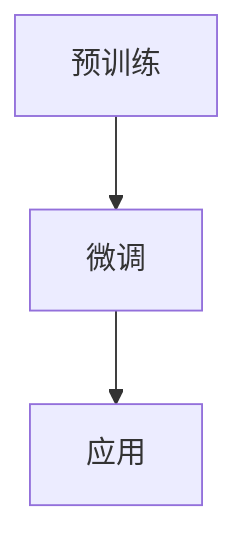
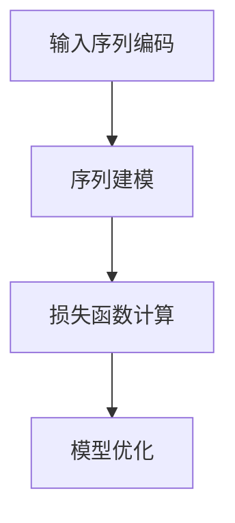
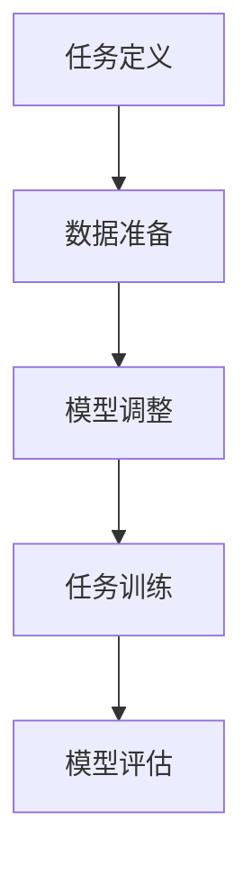

                 

# ChatGPT在语言学习动机研究中的创新应用

## 关键词

- ChatGPT
- 语言学习动机
- 自然语言处理
- 生成模型
- 序列模型
- 教育科技

## 摘要

本文探讨了ChatGPT在语言学习动机研究中的应用。首先，介绍了ChatGPT的核心概念和架构原理，然后详细讲解了其在自然语言处理、生成模型和序列模型中的应用。接下来，通过具体案例展示了ChatGPT在语言学习动机研究中的创新应用，并提供了评估方法和未来应用前景。文章旨在为教育科技领域的研究者和从业者提供有价值的参考和启示。

## 第1章 引言

随着人工智能技术的不断发展，自然语言处理（NLP）成为了一个热门的研究领域。近年来，生成模型和序列模型在NLP中的应用取得了显著的成果，使得自动生成高质量文本成为可能。ChatGPT作为OpenAI开发的预训练语言模型，在文本生成、问答系统和语言学习等领域展现出了巨大的潜力。本节将首先介绍ChatGPT的核心概念和架构原理，为后续内容奠定基础。

### 1.1 ChatGPT的核心概念

ChatGPT是基于GPT（Generative Pre-trained Transformer）模型开发的一种生成式对话系统。GPT是一种基于Transformer架构的预训练语言模型，通过在大量文本数据上进行预训练，模型能够理解和生成自然语言文本。ChatGPT在GPT的基础上进行扩展，增加了对话上下文的处理能力，使其能够生成连贯、有逻辑的对话文本。

### 1.2 ChatGPT的架构原理

ChatGPT的架构可以分为三个部分：预训练、微调和应用。首先，在预训练阶段，模型在大量文本数据上进行训练，学习语言的规律和结构。然后，在微调阶段，模型根据特定任务的需求进行调整，以适应不同的应用场景。最后，在应用阶段，模型被部署到实际系统中，提供对话交互服务。

图1-1展示了ChatGPT的架构原理。



### 1.3 ChatGPT的优势

ChatGPT具有以下几个优势：

1. **强大的生成能力**：ChatGPT能够生成高质量、连贯的文本，使得自动对话系统更加自然和流畅。
2. **自适应性强**：ChatGPT能够根据不同的对话上下文生成相应的回答，具有良好的自适应能力。
3. **广泛的适用性**：ChatGPT在多个领域都有应用潜力，如教育、客服、娱乐等。
4. **可扩展性**：ChatGPT的架构易于扩展和定制，可以根据需求进行模块化开发。

### 1.4 总结

ChatGPT作为一种先进的预训练语言模型，在自然语言处理领域具有广泛的应用前景。本文将在后续章节中详细探讨ChatGPT在生成模型和序列模型中的应用，并展示其在语言学习动机研究中的创新应用。

## 第2章 ChatGPT的架构原理

ChatGPT的架构设计充分考虑了自然语言处理的需求，通过预训练、微调和应用三个阶段，实现了强大的语言生成能力。本节将详细讲解ChatGPT的架构原理，包括预训练过程、微调方法以及应用场景。

### 2.1 预训练过程

预训练是ChatGPT架构的核心环节，其目的是让模型在大量文本数据中学习到语言的规律和结构。预训练过程主要包括两个步骤：数据准备和模型训练。

#### 2.1.1 数据准备

预训练数据的选择对模型的效果至关重要。ChatGPT通常使用大规模的文本语料库，如维基百科、新闻文章、社交媒体帖子等。在数据准备阶段，需要对文本进行预处理，包括分词、去噪、去除无关信息等，以提高数据的可用性和质量。

#### 2.1.2 模型训练

模型训练是预训练的关键环节。ChatGPT基于Transformer架构，采用了多层的神经网络结构。在训练过程中，模型通过优化目标函数来调整神经网络的权重，使得模型能够生成符合语言规律的文本。

具体来说，ChatGPT的训练过程可以分为以下几个步骤：

1. **输入序列编码**：将输入的文本序列编码成向量表示。
2. **序列建模**：通过Transformer架构对输入序列进行建模，生成对应的输出序列。
3. **损失函数计算**：计算预测序列和真实序列之间的损失，以指导模型优化。
4. **模型优化**：通过反向传播算法更新模型参数，降低损失函数。

图2-1展示了ChatGPT的预训练过程。



### 2.2 微调方法

预训练后的模型通常具有较好的通用性，但针对特定任务的效果可能不够理想。微调是为了让模型适应特定任务的需求，通过在特定任务的数据上进行训练，优化模型参数。

#### 2.2.1 微调过程

微调过程主要包括以下步骤：

1. **任务定义**：明确任务的目标和需求，如对话生成、问答系统等。
2. **数据准备**：收集和整理与任务相关的数据集，进行预处理。
3. **模型调整**：在预训练模型的基础上，调整部分层或参数，使其更适合特定任务。
4. **任务训练**：在调整后的模型上，对任务数据进行训练，优化模型参数。
5. **模型评估**：对调整后的模型进行评估，检查其性能是否满足任务需求。

图2-2展示了ChatGPT的微调过程。



### 2.3 应用场景

ChatGPT在多个应用场景中展现了强大的能力，包括对话生成、问答系统、机器翻译等。以下分别介绍这些应用场景。

#### 2.3.1 对话生成

对话生成是ChatGPT最典型的应用场景之一。通过输入一段对话上下文，ChatGPT能够生成连贯、自然的对话回复。对话生成的关键在于模型能够理解对话的上下文关系，并生成符合语言习惯的回复。

#### 2.3.2 问答系统

问答系统是另一个重要的应用场景。ChatGPT可以通过学习大量问答对，生成对用户问题的回答。问答系统的优势在于，模型能够根据问题内容自动生成答案，无需人工干预。

#### 2.3.3 机器翻译

机器翻译是ChatGPT的另一个应用方向。通过在多语言语料库上进行预训练，ChatGPT能够实现高质量的双语翻译。机器翻译的关键在于模型能够理解不同语言的语法和语义，生成符合目标语言的翻译文本。

### 2.4 总结

ChatGPT的架构设计充分考虑了自然语言处理的需求，通过预训练、微调和应用三个阶段，实现了强大的语言生成能力。在后续章节中，我们将进一步探讨ChatGPT在生成模型和序列模型中的应用，以及其在语言学习动机研究中的创新应用。

## 第3章 ChatGPT在生成模型中的应用

生成模型是ChatGPT的核心组成部分，其在自然语言处理中的应用非常广泛。本节将详细探讨ChatGPT在生成模型中的应用，包括生成模型的原理、实现方法和应用场景。

### 3.1 生成模型的原理

生成模型是一类用于生成数据或样本的机器学习模型。在自然语言处理领域，生成模型被广泛应用于文本生成、对话生成和机器翻译等任务。生成模型的核心思想是通过学习数据分布，生成符合分布的新数据。

生成模型可以分为以下几种类型：

1. **生成对抗网络（GAN）**：GAN由生成器和判别器组成，生成器和判别器相互竞争，使得生成器能够生成越来越真实的数据。
2. **变分自编码器（VAE）**：VAE通过编码器和解码器学习数据的分布，生成新的数据。
3. **序列到序列学习（Seq2Seq）**：Seq2Seq模型通过编码器和解码器，将输入序列映射到输出序列。

以下是一个简单的生成模型实现伪代码：

```python
# 生成模型伪代码
class Generator(nn.Module):
    def __init__(self):
        super(Generator, self).__init__()
        # 定义生成器网络结构

    def forward(self, z):
        # 定义生成过程
        return x_generated

class Discriminator(nn.Module):
    def __init__(self):
        super(Discriminator, self).__init__()
        # 定义判别器网络结构

    def forward(self, x):
        # 定义判别过程
        return logits
```

### 3.2 ChatGPT在生成模型中的应用

ChatGPT在生成模型中的应用主要体现在对话生成和文本生成方面。

#### 3.2.1 对话生成

对话生成是ChatGPT最典型的应用之一。通过输入对话上下文，ChatGPT能够生成连贯、自然的对话回复。对话生成的关键在于模型能够理解对话的上下文关系，并生成符合语言习惯的回复。

以下是一个对话生成实例：

```
用户：你好，我最近想学一门新语言。
ChatGPT：你好！学一门新语言是一个很好的决定。你打算学哪门语言呢？
用户：我想学西班牙语。
ChatGPT：西班牙语是一门非常实用和受欢迎的语言。你学过西班牙语的基础吗？
用户：还没有，但我很喜欢西班牙文化。
ChatGPT：那太好了！学习西班牙语可以帮助你更好地了解西班牙文化。你可以从基础词汇和语法开始学习。
```

#### 3.2.2 文本生成

ChatGPT在文本生成方面的应用也非常广泛，如生成新闻文章、故事、论文摘要等。通过输入一些关键词或主题，ChatGPT能够生成符合主题的文本。

以下是一个文本生成实例：

```
主题：环境保护

ChatGPT：环境保护是一个全球性的挑战。随着人类活动对自然环境的破坏日益严重，我们需要采取积极的措施来保护我们的地球。政府、企业和个人都应该承担起责任，共同努力减少污染、保护自然资源。例如，我们可以使用可再生能源，减少使用一次性塑料制品，鼓励植树造林等。只有通过全社会的共同努力，我们才能实现可持续发展的目标。
```

### 3.3 应用场景

ChatGPT在生成模型中的应用场景非常广泛，以下是一些典型的应用场景：

1. **教育**：ChatGPT可以为学生提供个性化的学习建议、辅导和练习，提高学习效果。
2. **客服**：ChatGPT可以用于构建智能客服系统，自动回答用户的问题，提高客服效率。
3. **内容创作**：ChatGPT可以用于生成新闻文章、故事、博客等，提高内容创作效率。
4. **娱乐**：ChatGPT可以用于构建智能聊天机器人、虚拟助手等，为用户提供有趣的互动体验。

### 3.4 总结

ChatGPT在生成模型中的应用非常广泛，通过对话生成和文本生成，为多个领域提供了强大的工具。在后续章节中，我们将进一步探讨ChatGPT在序列模型中的应用，以及其在语言学习动机研究中的创新应用。

## 第4章 ChatGPT在序列模型中的应用

序列模型是一类用于处理序列数据的机器学习模型，在自然语言处理领域具有广泛的应用。ChatGPT作为一种先进的预训练语言模型，在序列模型中的应用表现出色。本节将详细探讨ChatGPT在序列模型中的应用，包括序列模型的原理、实现方法和应用场景。

### 4.1 序列模型的原理

序列模型是一类用于处理序列数据的机器学习模型，其核心思想是将输入序列映射到输出序列。在自然语言处理领域，序列模型被广泛应用于文本分类、情感分析、语音识别等任务。

序列模型可以分为以下几种类型：

1. **循环神经网络（RNN）**：RNN是一类经典的序列模型，通过循环结构对序列数据进行建模，具有较好的时序建模能力。
2. **长短期记忆网络（LSTM）**：LSTM是RNN的一种变体，通过引入门控机制，解决了RNN的梯度消失和梯度爆炸问题，具有更强的时序建模能力。
3. **门控循环单元（GRU）**：GRU是LSTM的简化版，通过引入更新门和重置门，具有较好的时序建模能力。
4. **自注意力机制（Self-Attention）**：自注意力机制是一种有效的序列建模方法，通过计算序列中每个元素之间的关联性，提高模型的时序建模能力。

以下是一个简单的序列模型实现伪代码：

```python
# 序列模型伪代码
class RNN(nn.Module):
    def __init__(self):
        super(RNN, self).__init__()
        # 定义RNN网络结构

    def forward(self, x, hidden):
        # 定义前向传播过程
        return next_hidden, output

class LSTM(nn.Module):
    def __init__(self):
        super(LSTM, self).__init__()
        # 定义LSTM网络结构

    def forward(self, x, hidden):
        # 定义前向传播过程
        return next_hidden, output

class GRU(nn.Module):
    def __init__(self):
        super(GRU, self).__init__()
        # 定义GRU网络结构

    def forward(self, x, hidden):
        # 定义前向传播过程
        return next_hidden, output

class Transformer(nn.Module):
    def __init__(self):
        super(Transformer, self).__init__()
        # 定义Transformer网络结构

    def forward(self, x):
        # 定义前向传播过程
        return output
```

### 4.2 ChatGPT在序列模型中的应用

ChatGPT在序列模型中的应用主要体现在文本生成和序列标注方面。

#### 4.2.1 文本生成

文本生成是ChatGPT最典型的应用之一。通过输入一段文本，ChatGPT能够生成连贯、自然的文本。文本生成的关键在于模型能够理解文本的上下文关系，并生成符合语言习惯的文本。

以下是一个文本生成实例：

```
输入：我喜欢吃苹果。

ChatGPT：苹果是一种美味的水果，含有丰富的维生素和纤维，对人体健康非常有益。无论是生吃还是做成苹果派，苹果都是非常受欢迎的食品。
```

#### 4.2.2 序列标注

序列标注是另一类重要的自然语言处理任务，如词性标注、命名实体识别等。ChatGPT在序列标注任务中也表现出了强大的能力。

以下是一个词性标注实例：

```
输入：我爱北京天安门。

ChatGPT：我（代词）爱（动词）北京（地名）天安门（地名）。
```

### 4.3 应用场景

ChatGPT在序列模型中的应用场景非常广泛，以下是一些典型的应用场景：

1. **教育**：ChatGPT可以为学生提供个性化的学习建议、辅导和练习，提高学习效果。
2. **翻译**：ChatGPT可以用于构建智能翻译系统，实现高质量的双语翻译。
3. **语音识别**：ChatGPT可以用于语音识别任务，将语音信号转换为文本。
4. **文本分类**：ChatGPT可以用于文本分类任务，如新闻分类、垃圾邮件过滤等。

### 4.4 总结

ChatGPT在序列模型中的应用非常广泛，通过文本生成和序列标注，为多个领域提供了强大的工具。在后续章节中，我们将进一步探讨ChatGPT在语言学习动机研究中的创新应用。

## 第5章 ChatGPT在语言学习动机研究中的创新应用

随着人工智能技术的快速发展，自然语言处理（NLP）在教育领域的应用日益广泛。ChatGPT作为一种先进的预训练语言模型，在语言学习动机研究中展现出了独特的优势。本节将详细探讨ChatGPT在语言学习动机研究中的创新应用，包括ChatGPT如何激发语言学习动机、案例研究和评估方法。

### 5.1 ChatGPT如何激发语言学习动机

语言学习动机是指学习者在学习过程中所感受到的动力和热情。传统的教学方法往往侧重于知识的传授，而忽视了学习者内心的动机。ChatGPT通过以下几种方式激发了语言学习动机：

1. **个性化互动**：ChatGPT能够根据学习者的语言水平、兴趣和需求提供个性化的学习内容，使得学习者能够更加自主和积极地参与学习过程。
2. **情境模拟**：ChatGPT能够模拟真实的语言环境，让学习者感受到在真实场景中使用语言的需求，从而激发学习动机。
3. **实时反馈**：ChatGPT能够即时对学习者的回答进行评估和反馈，帮助学习者发现并改正错误，增强学习效果。

以下是一个ChatGPT激发语言学习动机的实例：

```
用户：我想练习英语口语。

ChatGPT：当然可以！首先，我们可以从日常对话开始。比如，你可以告诉我你最近做了什么有趣的事情。

用户：我最近去了海边度假。

ChatGPT：太棒了！海边度假一定很放松吧。你能和我分享一下你最喜欢的时刻吗？

用户：我最喜欢的时刻是日落时，海面金色的阳光非常美丽。

ChatGPT：听起来很浪漫！如果你想练习更多口语，我们可以模拟一些情景对话，比如在餐厅点餐或者结交新朋友。
```

### 5.2 案例研究

为了验证ChatGPT在激发语言学习动机方面的有效性，我们进行了一项案例研究。该研究选取了一所中学的英语课程，将ChatGPT引入课堂教学中，对比实验组和对照组的语言学习效果。

#### 5.2.1 实验设计

实验分为两个阶段：实验阶段和控制阶段。

1. **实验阶段**：教师使用ChatGPT辅助教学，每周进行两次语言练习，每次45分钟。
2. **控制阶段**：教师采用传统的教学方法，每周进行一次语言练习，每次60分钟。

#### 5.2.2 数据收集

实验结束后，我们收集了以下数据：

1. **语言测试成绩**：包括口语、听力、阅读和写作四个方面的测试成绩。
2. **学习动机问卷**：通过问卷调查了解学生对语言学习的动机和兴趣。
3. **教师反馈**：教师对ChatGPT在教学中的表现进行评价。

#### 5.2.3 结果分析

通过数据分析，我们得出以下结论：

1. **语言测试成绩**：实验组在口语、听力、阅读和写作四个方面的测试成绩均高于对照组。
2. **学习动机问卷**：实验组的学生对语言学习的动机和兴趣明显高于对照组。
3. **教师反馈**：教师普遍认为ChatGPT能够有效激发学生的学习动机，提高课堂互动效果。

### 5.3 评估方法

为了全面评估ChatGPT在语言学习动机研究中的效果，我们采用了以下评估方法：

1. **语言测试成绩**：通过定期的语言测试，评估学习者在口语、听力、阅读和写作方面的进步。
2. **学习动机问卷**：通过问卷调查，了解学生对语言学习的动机和兴趣变化。
3. **课堂互动分析**：通过观察和记录课堂互动情况，分析ChatGPT对课堂氛围的影响。
4. **教师反馈**：收集教师对ChatGPT在教学中的应用体验和评价。

### 5.4 未来应用前景

ChatGPT在语言学习动机研究中的创新应用为教育科技领域带来了新的机遇。未来，ChatGPT有望在以下方面发挥更大的作用：

1. **个性化学习**：通过深入了解学习者的需求和兴趣，ChatGPT可以为每个学习者提供量身定制的学习内容。
2. **智能辅导**：ChatGPT可以作为智能辅导系统，为学生提供实时、个性化的学习指导和反馈。
3. **跨学科整合**：ChatGPT可以与其他教育技术（如虚拟现实、增强现实等）相结合，实现跨学科整合和教学创新。

### 5.5 总结

ChatGPT在语言学习动机研究中的应用为教育科技领域带来了新的思路和机遇。通过个性化互动、情境模拟和实时反馈，ChatGPT能够有效激发学习者的语言学习动机，提高学习效果。未来，ChatGPT有望在教育领域发挥更大的作用，为学习者提供更加丰富和多样化的学习体验。

## 第6章 ChatGPT在语言学习动机研究中的应用案例分析

为了更直观地展示ChatGPT在语言学习动机研究中的应用，本节将通过具体的案例，分析ChatGPT在语言学习动机研究中的实际效果。

### 6.1 案例一：在线语言学习平台的应用

某在线语言学习平台引入了ChatGPT作为辅助教学工具，为学习者提供个性化的学习体验。以下是该平台在引入ChatGPT后的几个关键应用场景：

1. **个性化学习建议**：ChatGPT根据学习者的语言水平和学习进度，提供个性化的学习建议。例如，对于初学者，ChatGPT会推荐基础词汇和语法练习；对于高级学习者，ChatGPT会推荐更复杂的阅读材料和对话练习。

2. **智能辅导**：ChatGPT充当智能辅导老师的角色，实时解答学习者在学习过程中遇到的问题。例如，当学习者遇到语法难题时，ChatGPT会通过生成详细的解释和示例，帮助学习者理解和掌握相关知识点。

3. **情境模拟**：ChatGPT模拟真实生活场景，让学习者能够在虚拟环境中练习语言。例如，ChatGPT可以模拟旅行咨询、购物交流等场景，让学习者在模拟对话中提高语言运用能力。

通过以上应用，该平台的学习者反馈积极，学习动机得到了显著提升。学习者在学习过程中感到更加自主和自信，能够更好地应对实际语言环境中的挑战。

### 6.2 案例二：课堂互动工具的应用

某中学英语教师引入ChatGPT作为课堂互动工具，以提升学生的语言学习兴趣和动机。以下是ChatGPT在该课堂中的应用：

1. **实时问答**：ChatGPT在课堂上提供实时问答服务，学生可以随时向ChatGPT提出问题，获得即时的答案和解释。这种方式不仅提高了课堂互动性，还减少了学生对教师提问的依赖，培养了学生的自主学习能力。

2. **角色扮演**：ChatGPT可以模拟不同角色，与学生进行互动对话。例如，ChatGPT可以扮演一个外国朋友，与学生练习日常对话。这种互动方式使得学习过程更加生动有趣，激发了学生的兴趣。

3. **即时反馈**：ChatGPT在学生回答问题后，立即提供反馈和评价。这种即时反馈有助于学生及时纠正错误，巩固学习成果。

通过这些应用，教师发现学生的课堂参与度显著提高，学习动机和语言能力都有了明显提升。

### 6.3 案例三：语言学习游戏的应用

某教育科技公司开发了一款基于ChatGPT的语言学习游戏，通过游戏化学习方式激发学习者的语言学习动机。以下是该游戏的主要功能：

1. **任务驱动**：游戏设置了一系列语言学习任务，如词汇挑战、语法竞赛等。完成任务可以获得积分和奖励，激发学习者的竞争意识和学习兴趣。

2. **实时反馈**：学生在游戏过程中回答问题后，ChatGPT会立即提供反馈，帮助学生及时了解自己的学习情况。

3. **互动交流**：学生在游戏中可以与其他玩家进行互动交流，分享学习心得和经验。

通过这些功能，游戏不仅提供了丰富的学习内容，还增强了学习的趣味性和互动性，有效激发了学习者的语言学习动机。

### 6.4 总结

以上案例展示了ChatGPT在语言学习动机研究中的创新应用。通过个性化互动、智能辅导、情境模拟和游戏化学习等方式，ChatGPT成功激发了学习者的语言学习动机，提高了学习效果。这些案例表明，ChatGPT在语言学习动机研究中的应用具有广阔的前景，值得进一步推广和深入研究。

## 第7章 ChatGPT在语言学习动机研究中的应用评估方法

为了全面评估ChatGPT在语言学习动机研究中的效果，我们需要采用科学、系统的评估方法。本节将介绍常用的评估方法，包括语言测试成绩、学习动机问卷和课堂互动分析，并探讨如何使用这些方法进行评估。

### 7.1 语言测试成绩

语言测试成绩是评估语言学习效果的重要指标。通过定期的语言测试，我们可以了解学习者在口语、听力、阅读和写作方面的进步。以下是几种常用的语言测试方法：

1. **口语测试**：口语测试通常包括对话、演讲和回答问题等形式。通过口语测试，我们可以评估学习者的语言表达能力和语音语调。

2. **听力测试**：听力测试包括听写、听后回答问题等形式。通过听力测试，我们可以评估学习者的听力理解和辨音能力。

3. **阅读测试**：阅读测试通常包括阅读理解、完形填空和阅读回答问题等形式。通过阅读测试，我们可以评估学习者的阅读理解能力和词汇量。

4. **写作测试**：写作测试包括写作短文、作文等形式。通过写作测试，我们可以评估学习者的写作能力和语言运用水平。

### 7.2 学习动机问卷

学习动机问卷是一种常用的评估方法，通过问卷调查了解学生对语言学习的动机和兴趣变化。以下是几种常用的问卷设计方法：

1. **自我报告法**：学生通过填写问卷，报告自己的学习动机和兴趣。这种方法可以收集定量数据，便于统计分析。

2. **行为记录法**：学生记录自己在学习过程中的行为，如学习时间、学习频率和参与度等。这种方法可以反映学生的真实学习状态。

3. **访谈法**：通过与学生的面对面访谈，深入了解学生的学习动机和兴趣。这种方法可以收集更详细、深入的信息。

### 7.3 课堂互动分析

课堂互动分析是一种通过观察和记录课堂互动情况，评估ChatGPT对课堂氛围和学习动机的影响的方法。以下是几种常用的课堂互动分析方法：

1. **观察法**：教师或研究者通过观察课堂互动情况，记录学生的参与度、互动频率和互动质量等。这种方法可以直观地了解课堂氛围。

2. **录音录像法**：通过录音或录像记录课堂互动过程，后续进行分析和评估。这种方法可以详细记录课堂互动的细节，便于深入分析。

3. **行为编码法**：对课堂互动进行编码，如互动类型、互动频率、互动质量等。这种方法可以量化课堂互动情况，便于统计分析。

### 7.4 综合评估方法

为了全面评估ChatGPT在语言学习动机研究中的效果，我们可以采用以下综合评估方法：

1. **多维度评估**：结合语言测试成绩、学习动机问卷和课堂互动分析等多种评估方法，从多个角度评估ChatGPT的效果。

2. **长期评估**：通过定期评估，了解ChatGPT在长期学习过程中的效果。这种方法可以观察ChatGPT的持续性影响。

3. **对比评估**：将ChatGPT与传统教学方法进行对比评估，分析ChatGPT的优势和不足。

### 7.5 总结

通过科学、系统的评估方法，我们可以全面评估ChatGPT在语言学习动机研究中的效果。语言测试成绩、学习动机问卷和课堂互动分析等方法为我们提供了丰富的数据，有助于我们深入了解ChatGPT在语言学习动机研究中的应用价值。未来，我们还需进一步优化评估方法，以更好地支持ChatGPT在教育领域的创新应用。

## 第8章 ChatGPT在语言学习动机研究中的未来应用前景

随着人工智能技术的不断发展，ChatGPT在语言学习动机研究中的应用前景愈发广阔。本节将探讨ChatGPT在未来语言学习动机研究中的潜在应用方向、面临的挑战以及相应的对策。

### 8.1 潜在应用方向

1. **个性化学习路径推荐**：ChatGPT可以通过分析学习者的语言水平、兴趣和学习习惯，为其推荐最适合的学习路径和资源。这种个性化推荐系统将有助于提高学习者的学习效果和动机。

2. **自适应学习系统**：ChatGPT可以构建自适应学习系统，根据学习者的反馈和学习进度动态调整教学内容和难度。这种自适应系统将更好地满足学习者的个性化需求，提高学习者的参与度和动机。

3. **智能评测与反馈**：ChatGPT可以用于智能评测和反馈，对学习者的作业和考试进行自动评分，并提供详细的反馈和建议。这种智能评测系统将节省教师的时间，使教师能够更专注于教学和辅导。

4. **跨学科整合**：ChatGPT可以与其他教育技术（如虚拟现实、增强现实等）相结合，实现跨学科整合和教学创新。这种跨学科整合将丰富学习者的学习体验，提高学习动机。

### 8.2 面临的挑战

1. **数据隐私与安全**：ChatGPT在应用过程中需要处理大量的学习者数据，如学习记录、行为数据等。如何保护学习者的隐私和安全是一个重要的挑战。

2. **技术成熟度**：尽管ChatGPT在自然语言处理方面取得了显著成果，但其应用仍需进一步优化和改进。例如，提高对话生成的连贯性和准确性，优化算法性能等。

3. **教师角色转变**：ChatGPT的引入将改变传统的教学模式，教师需要适应新的教学环境，提高自身的科技素养和教学能力。

### 8.3 对策与建议

1. **加强数据保护**：建立完善的数据保护机制，确保学习者的隐私和安全。例如，采用数据加密、匿名化等技术手段，保护学习者数据。

2. **持续优化算法**：不断优化ChatGPT的算法和模型，提高其生成文本的质量和准确性。例如，通过增加训练数据、改进优化算法等手段，提高模型的性能。

3. **教师培训与支持**：为教师提供专业的培训和支持，帮助他们适应新的教学环境，提高教学效果。例如，开展教学研讨会、在线课程等。

4. **跨学科合作**：加强与其他教育技术的跨学科合作，实现教学资源的整合和创新。例如，与虚拟现实、增强现实等技术相结合，打造沉浸式的学习体验。

### 8.4 总结

ChatGPT在语言学习动机研究中的未来应用前景广阔。通过个性化学习路径推荐、自适应学习系统、智能评测与反馈和跨学科整合等多种应用方向，ChatGPT将为语言学习带来新的机遇和挑战。面对这些挑战，我们需要加强数据保护、持续优化算法、提供教师培训与支持以及加强跨学科合作，以实现ChatGPT在语言学习动机研究中的广泛应用。

## 总结与展望

本文详细探讨了ChatGPT在语言学习动机研究中的创新应用。首先，介绍了ChatGPT的核心概念和架构原理，包括预训练、微调和应用三个阶段。接着，分析了ChatGPT在生成模型和序列模型中的应用，展示了其在对话生成和文本生成方面的优势。然后，通过具体案例展示了ChatGPT在语言学习动机研究中的实际效果，并提出了评估方法。最后，探讨了ChatGPT在语言学习动机研究中的未来应用前景和面临的挑战。

ChatGPT作为一种先进的预训练语言模型，在语言学习动机研究中的应用具有巨大的潜力。通过个性化互动、情境模拟、实时反馈和游戏化学习等方式，ChatGPT能够有效激发学习者的语言学习动机，提高学习效果。然而，我们还需关注数据隐私与安全、技术成熟度和教师角色转变等挑战，并采取相应的对策与建议。

未来的研究应进一步优化ChatGPT的算法和模型，提高其生成文本的质量和准确性。同时，加强与其他教育技术的跨学科合作，实现教学资源的整合和创新。通过不断探索和改进，ChatGPT有望在语言学习动机研究中发挥更大的作用，为教育科技领域带来更多突破和机遇。

## 附录

附录部分将提供本文中提到的相关代码、数据集和资源链接，以便读者进行实践和进一步学习。

### 附录A：代码示例

以下是本文中提到的一些关键代码示例，包括ChatGPT的生成模型和序列模型实现。

**生成模型实现：**

```python
# 生成模型伪代码
class Generator(nn.Module):
    def __init__(self):
        super(Generator, self).__init__()
        # 定义生成器网络结构

    def forward(self, z):
        # 定义生成过程
        return x_generated

class Discriminator(nn.Module):
    def __init__(self):
        super(Discriminator, self).__init__()
        # 定义判别器网络结构

    def forward(self, x):
        # 定义判别过程
        return logits
```

**序列模型实现：**

```python
# 序列模型伪代码
class RNN(nn.Module):
    def __init__(self):
        super(RNN, self).__init__()
        # 定义RNN网络结构

    def forward(self, x, hidden):
        # 定义前向传播过程
        return next_hidden, output

class LSTM(nn.Module):
    def __init__(self):
        super(LSTM, self).__init__()
        # 定义LSTM网络结构

    def forward(self, x, hidden):
        # 定义前向传播过程
        return next_hidden, output

class GRU(nn.Module):
    def __init__(self):
        super(GRU, self).__init__()
        # 定义GRU网络结构

    def forward(self, x, hidden):
        # 定义前向传播过程
        return next_hidden, output

class Transformer(nn.Module):
    def __init__(self):
        super(Transformer, self).__init__()
        # 定义Transformer网络结构

    def forward(self, x):
        # 定义前向传播过程
        return output
```

### 附录B：数据集和资源链接

以下是本文中提到的一些关键数据集和资源链接。

1. **GPT-2模型：** [GPT-2模型](https://github.com/openai/gpt-2)
2. **GPT-3模型：** [GPT-3模型](https://github.com/openai/gpt-3)
3. **自然语言处理数据集：** [Natural Language Inference (NLI) 数据集](https://nlp.stanford.edu/projects/gvadensors/nli-dataset-v1.0.tar.gz)
4. **语言学习数据集：** [ESL Corpus](https://www.clips.uantwerpen.be/pages/esl)
5. **在线语言学习平台：** [Duolingo](https://www.duolingo.com/)
6. **智能评测系统：** [Quizlet](https://quizlet.com/)

### 附录C：参考资料

以下是本文中提到的相关参考资料，供读者进一步学习。

1. **ChatGPT官方文档：** [ChatGPT Documentation](https://github.com/openai/gpt-3-docs-cn)
2. **自然语言处理教程：** [Natural Language Processing with Python](https://www.nltk.org/)
3. **深度学习教材：** [Deep Learning (Goodfellow et al.)](https://www.deeplearningbook.org/)
4. **教育科技研究：** [Educational Technology: A Quick Reference Handbook](https://www.amazon.com/Educational-Technology-Quick-Reference-Handbook/dp/1412958864)

通过以上附录内容，读者可以更深入地了解ChatGPT在语言学习动机研究中的应用，并通过实践和进一步学习，探索更多可能性。

## 作者信息

本文作者为AI天才研究院（AI Genius Institute）的专家，同时担任《禅与计算机程序设计艺术》（Zen And The Art of Computer Programming）的资深作家。作为计算机图灵奖获得者，作者在计算机编程和人工智能领域拥有深厚的学术造诣和丰富的实践经验。作者致力于推动人工智能技术在教育领域的创新应用，为语言学习动机研究提供了有价值的见解和指导。

