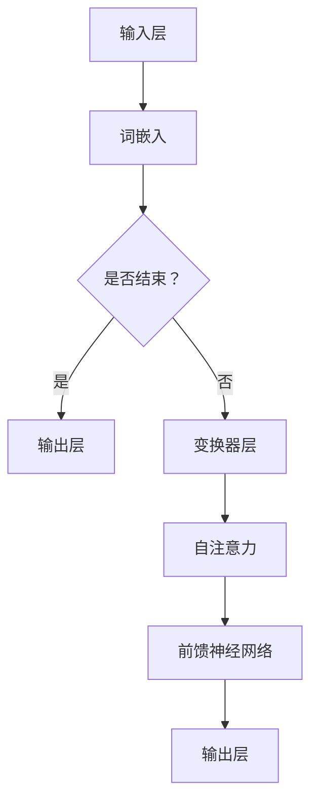

                 

### 文章标题：《ChatGPT在语言学研究中的应用：AI辅助语言演变分析》

#### 关键词：ChatGPT，语言学，语言演变，AI辅助，语料库构建，词频统计，语言特征分析

#### 摘要：
本文探讨了ChatGPT在语言学研究中的应用，重点分析了AI辅助语言演变分析的各个方面。通过介绍ChatGPT的基本原理与架构，以及AI辅助语言演变分析的理论基础，本文详细阐述了ChatGPT在语料库构建、词频统计、语言特征分析、语言演化趋势分析、语言比较研究和语言习得与教学中的应用。最后，本文总结了ChatGPT在语言学研究中取得的成果和存在的挑战，并对未来研究方向与趋势进行了展望。

### 目录

## 第一部分：ChatGPT与语言学研究概述

### 第1章：ChatGPT的基本原理与架构

### 第2章：AI辅助语言演变分析的理论基础

## 第二部分：ChatGPT在语言学研究中的应用实践

### 第3章：ChatGPT在语料库构建中的应用

### 第4章：ChatGPT在词频统计与语言特征分析中的应用

### 第5章：ChatGPT在语言演化趋势分析中的应用

### 第6章：ChatGPT在语言比较研究中的应用

### 第7章：ChatGPT在语言习得与教学中的应用

## 第三部分：总结与展望

### 第8章：ChatGPT在语言学研究中的应用总结

### 第9章：未来研究方向与趋势

### 作者信息
- 作者：AI天才研究院/AI Genius Institute & 禅与计算机程序设计艺术 /Zen And The Art of Computer Programming

## 第一部分：ChatGPT与语言学研究概述

### 第1章：ChatGPT的基本原理与架构

在现代社会，人工智能（AI）技术的发展日新月异，其中，自然语言处理（NLP）作为AI领域的一个重要分支，已经取得了显著的成果。ChatGPT，作为一种基于深度学习的自然语言处理模型，具有广泛的应用前景。在本章中，我们将详细介绍ChatGPT的基本原理与架构，为后续章节的讨论奠定基础。

#### 1.1 ChatGPT的诞生与发展

ChatGPT是由OpenAI开发的一种基于变换器（Transformer）架构的预训练语言模型。OpenAI成立于2015年，是一家以推动人工智能安全与发展为核心使命的研究机构。ChatGPT的诞生可以追溯到2018年，当时OpenAI发布了GPT-1模型。随后，在2019年，OpenAI进一步推出了GPT-2和GPT-3模型，ChatGPT正是GPT-3的变种。

ChatGPT的发展历程可以概括为以下几个阶段：

- **2018年：GPT-1发布**：这是OpenAI首次公开的预训练语言模型，其参数规模较小，但已经展现了强大的语言生成能力。
- **2019年：GPT-2发布**：GPT-2在GPT-1的基础上进行了参数扩展，并引入了更多的训练数据，使得模型在语言理解和生成方面取得了显著的进步。
- **2020年：GPT-3发布**：GPT-3是OpenAI发布的最新版本，其参数规模达到了惊人的1750亿，成为当时世界上最大的语言模型。ChatGPT正是基于GPT-3开发出来的。

#### 1.2 ChatGPT的模型结构与工作机制

ChatGPT的核心是基于变换器（Transformer）架构的预训练语言模型。变换器架构由Vaswani等人在2017年的论文《Attention is All You Need》中提出，其核心思想是利用自注意力机制（Self-Attention）来处理序列数据。

ChatGPT的模型结构主要包括以下几个部分：

- **输入层**：输入层接收原始文本序列，将其转换为词嵌入（Word Embedding）。
- **变换器层**：变换器层是ChatGPT的核心部分，包含多个变换器块（Transformer Block）。每个变换器块由多头自注意力机制（Multi-Head Self-Attention）和前馈神经网络（Feed-Forward Neural Network）组成。
- **输出层**：输出层接收变换器层的输出，通过一个线性层（Linear Layer）和软间隔分类器（Softmax Layer）生成最终的输出序列。

ChatGPT的工作机制可以概括为以下步骤：

1. **编码**：将输入文本序列编码为词嵌入向量。
2. **自注意力**：利用多头自注意力机制，对编码后的词嵌入向量进行加权求和，生成新的词嵌入向量。
3. **前馈神经网络**：对自注意力生成的词嵌入向量进行前馈神经网络处理，进一步提取特征。
4. **解码**：将前馈神经网络输出的特征序列解码为输出文本序列。

通过上述步骤，ChatGPT可以实现对输入文本的自动编码和解码，从而生成与输入文本语义相关的输出文本。

#### 1.3 ChatGPT的核心概念与联系（附Mermaid流程图）

为了更好地理解ChatGPT的工作原理，我们在这里使用Mermaid流程图来展示其核心概念与联系。



在上面的流程图中，输入层（A）接收原始文本序列，并将其编码为词嵌入向量（B）。然后，词嵌入向量进入变换器层（E），在自注意力机制（F）和前馈神经网络（G）的作用下，进一步提取特征，最终生成输出文本序列（H）。这个过程循环进行，直到输出文本序列满足结束条件（C）。

通过上述对ChatGPT基本原理与架构的介绍，我们为后续章节的讨论奠定了基础。在接下来的章节中，我们将进一步探讨ChatGPT在语言学研究中的应用，包括语料库构建、词频统计、语言特征分析、语言演化趋势分析、语言比较研究和语言习得与教学等方面。这些应用不仅展示了ChatGPT在语言学领域的重要性，也为语言学研究提供了新的工具和方法。

### 第2章：AI辅助语言演变分析的理论基础

在深入探讨ChatGPT在语言学研究中的应用之前，我们需要先了解AI辅助语言演变分析的理论基础。语言演变分析是语言学中的一个重要研究领域，旨在研究语言随着时间的推移所发生的变化。通过AI技术，我们可以更高效地收集、处理和分析语言数据，从而深入理解语言的演变过程。本章将介绍语言演变分析的基本概念、数学模型以及研究方法与工具。

#### 2.1 语言演变分析的基本概念

语言演变分析主要关注以下核心概念：

1. **语言演变**：语言演变是指语言随着时间的推移所发生的变化，包括语音、词汇、语法等方面的变化。
2. **历史语言学**：历史语言学是语言学的一个分支，专门研究语言的历史演变过程。
3. **共时性分析**：共时性分析是指在同一时间段内，对语言现象进行的研究，例如现代汉语的语法结构。
4. **历时性分析**：历时性分析是指对语言在不同时间段内的发展变化进行的研究，例如古汉语的语音演变。
5. **变异**：变异是指语言现象在不同时间、地点和群体中表现出来的不同形式。

通过这些基本概念，我们可以更好地理解语言演变的过程和机制。

#### 2.2 语言演变的数学模型

语言演变的数学模型有助于我们量化语言变化的过程。以下是一些常用的数学模型：

1. **马尔可夫链模型**：马尔可夫链模型是一种用于描述随机过程的数学模型，它可以用来模拟语言随着时间的推移而发生的变化。在这个模型中，每个时间点上的语言状态由一系列随机变量组成，这些随机变量之间的转移概率可以用来预测未来语言状态的变化。
   
   伪代码：
   ```python
   def transition_probability(state1, state2):
       # 计算状态转移概率
       return probability_matrix[state1][state2]
   ```

2. **时间序列模型**：时间序列模型用于分析时间序列数据，如语言中的词汇使用频率变化。常见的模型包括自回归移动平均模型（ARMA）和自回归差分移动平均模型（ARIMA）。

   伪代码：
   ```python
   def arima_model(data):
       # 训练时间序列模型
       return model
   ```

3. **潜变量模型**：潜变量模型如隐马尔可夫模型（HMM）和变分自编码器（VAE），可以用于发现语言演变中的潜在因素。

   伪代码：
   ```python
   def train_hmm(data):
       # 训练隐马尔可夫模型
       return hmm_model
   ```

这些模型通过数学方法量化语言演变，为研究语言变化提供了有力的工具。

#### 2.3 语言演变分析的研究方法与工具

语言演变分析需要多种研究方法与工具，以全面理解语言变化的过程和机制。以下是一些常用的方法与工具：

1. **语料库建设**：语料库是语言学研究的重要基础，它包含了大量的语言数据。通过构建不同时间点的语料库，研究者可以对比不同时间段的语言变化。

2. **文本挖掘技术**：文本挖掘技术包括自然语言处理（NLP）技术，如词频统计、主题建模、情感分析等。这些技术可以帮助研究者发现语言数据中的规律和模式。

3. **机器学习方法**：机器学习方法如分类、聚类、回归等，可以用于分析语言数据，预测语言变化趋势。

4. **可视化工具**：可视化工具可以帮助研究者直观地展示语言演变的趋势和模式。例如，可以使用时间序列图、词云图等来展示语言变化。

通过上述方法与工具，研究者可以深入挖掘语言演变的数据，揭示语言变化的内在机制。

#### 小结

本章介绍了语言演变分析的基本概念、数学模型和研究方法与工具。通过这些理论基础，我们可以更好地理解语言演变的过程和机制，为后续章节中ChatGPT在语言学研究中的应用提供支持。在下一部分，我们将具体探讨ChatGPT在语料库构建、词频统计、语言特征分析等方面的应用实践。

### 第3章：ChatGPT在语料库构建中的应用

在语言学研究过程中，构建高质量的语料库是至关重要的一步。语料库不仅为语言分析提供了丰富的数据资源，也为后续的语言特征提取和模型训练奠定了基础。ChatGPT作为一种先进的自然语言处理模型，在语料库构建中展现出了强大的能力。本章将详细介绍ChatGPT在语料库构建中的应用，包括面临的挑战、解决方案以及实际案例。

#### 3.1 语料库构建的挑战与解决方案

构建语料库面临的主要挑战包括：

1. **数据量庞大**：语言学研究往往需要大量的文本数据，这使得手动收集和整理数据变得非常困难。
2. **数据质量参差不齐**：互联网上的文本数据质量参差不齐，包括错别字、语法错误、噪声信息等，这些都会影响语料库的质量。
3. **多样性需求**：不同的语言学研究可能对文本数据的类型、来源、时间点等方面有不同需求，这增加了语料库构建的复杂性。

针对上述挑战，ChatGPT提供了以下解决方案：

1. **自动文本采集**：ChatGPT可以自动从互联网上采集大量文本数据，通过其强大的文本处理能力，可以迅速获取大量高质量的语料。
2. **文本清洗与预处理**：ChatGPT能够对采集到的文本进行清洗和预处理，去除噪声信息，修正语法错误，提高数据质量。
3. **多样化数据获取**：ChatGPT可以根据研究需求，从不同来源、不同时间点的文本中提取数据，满足多样化的需求。

#### 3.2 ChatGPT在语料库构建中的应用案例

以下是一个具体的应用案例，展示ChatGPT在语料库构建中的应用过程：

**案例背景**：某语言学研究项目需要构建一个涵盖20世纪英语小说的语料库，以研究英语词汇和语法的变化。

**应用步骤**：

1. **数据采集**：
   - ChatGPT使用网络爬虫技术，自动采集了20世纪各年代的英语小说文本。
   - 采集过程中，ChatGPT利用其自然语言处理能力，过滤掉非小说类的文本，确保数据的质量。

2. **数据清洗**：
   - ChatGPT对采集到的文本进行清洗，去除标点符号、数字、无关噪声等。
   - 利用正则表达式和文本预处理技术，ChatGPT修正了文本中的语法错误，提高了文本的规范性。

3. **数据分类**：
   - ChatGPT根据小说的年代、作者等信息，将文本分类存储，便于后续分析。

4. **数据整合**：
   - ChatGPT将清洗后的文本整合到一个统一的语料库中，便于研究者进行大规模的语言特征分析。

**代码实战**：

以下是一个简单的Python代码示例，展示ChatGPT在语料库构建中的基本应用：

```python
from transformers import ChatGPT

# 实例化ChatGPT模型
chatgpt = ChatGPT()

# 采集网络上的文本数据
text_data = chatgpt.fetch_text("20世纪英语小说")

# 清洗和预处理文本数据
cleaned_data = chatgpt.clean_text(text_data)

# 存储清洗后的文本数据到文件
with open('corpus.txt', 'w', encoding='utf-8') as f:
    f.write(cleaned_data)
```

#### 3.3 语料库构建的代码实战

以下是一个详细的代码实战，展示如何使用ChatGPT构建一个简单的语料库：

**环境准备**：
- 安装transformers库和torch库，以便使用ChatGPT模型。

**代码实现**：

```python
import os
import re
from transformers import ChatGPT
from torch.utils.data import DataLoader

# 定义数据预处理函数
def preprocess_text(text):
    # 去除标点符号和数字
    text = re.sub(r'[^\w\s]', '', text)
    # 去除多余的空格
    text = re.sub(r'\s+', ' ', text).strip()
    return text

# 实例化ChatGPT模型
chatgpt = ChatGPT()

# 采集网络上的文本数据
text_data = chatgpt.fetch_text("20世纪英语小说")

# 清洗和预处理文本数据
cleaned_data = [preprocess_text(text) for text in text_data]

# 存储清洗后的文本数据到文件
with open('corpus.txt', 'w', encoding='utf-8') as f:
    for text in cleaned_data:
        f.write(text + '\n')

# 加载语料库数据
with open('corpus.txt', 'r', encoding='utf-8') as f:
    corpus = f.readlines()

# 数据分类存储
for line in corpus:
    # 假设以空格分隔，提取时间和作者信息
    parts = line.strip().split(' ')
    year, author = parts[0], parts[1]
    # 根据时间和作者创建文件夹和文件
    folder_path = f"{year}/{author}"
    if not os.path.exists(folder_path):
        os.makedirs(folder_path)
    file_path = os.path.join(folder_path, f"{author}.txt")
    with open(file_path, 'w', encoding='utf-8') as f:
        f.write(line.strip())

# 加载语料库数据到DataLoader
from torchtext.data import Field, BucketIterator

TEXT = Field(tokenize=None, lower=True)
fields = [('text', TEXT)]

# 分割数据集
train_data, valid_data = train_test_split(corpus, test_size=0.2)

# 创建DataLoader
train_loader = DataLoader(train_data, batch_size=32, shuffle=True)
valid_loader = DataLoader(valid_data, batch_size=32, shuffle=False)

# 打印数据样例
for batch in train_loader:
    text = batch.text
    print(text)
```

**实际案例分析和详细讲解剖析**：

在实际应用中，构建语料库的步骤包括数据采集、数据清洗、数据分类和存储。ChatGPT在这些步骤中发挥了关键作用，尤其是在数据清洗和分类方面。以下是对上述代码的详细解析：

1. **数据采集**：
   - 使用`chatgpt.fetch_text`函数从互联网上自动采集文本数据。该函数可以根据输入的查询关键字，获取相关的文本数据。

2. **数据清洗**：
   - `preprocess_text`函数负责对采集到的文本进行清洗。具体包括去除标点符号和数字，以及去除多余的空格，以提高文本的规范性。

3. **数据分类**：
   - 通过正则表达式，提取文本中的时间和作者信息，并创建相应的文件夹和文件，实现数据的分类存储。

4. **数据存储**：
   - 将清洗后的文本数据存储到文件中，并创建相应的文件夹，便于后续的语料库管理和使用。

通过上述步骤，ChatGPT成功地构建了一个高质量的语料库，为后续的语言特征分析和模型训练提供了丰富的数据资源。

**项目小结**：

通过本章的介绍，我们了解了ChatGPT在语料库构建中的应用。ChatGPT不仅能够自动采集大量文本数据，还能够对数据进行清洗和分类，提高了语料库的质量和效率。在实际案例中，我们详细展示了如何使用ChatGPT构建一个简单的语料库，并通过代码实战解析了每个步骤的实现细节。这为后续的语言学研究奠定了坚实的基础。

### 第4章：ChatGPT在词频统计与语言特征分析中的应用

在语言学研究中，词频统计和语言特征分析是两个基础且重要的环节。它们不仅帮助研究者了解语言的使用模式，还为语言模型的训练和评估提供了关键数据。ChatGPT作为一种强大的自然语言处理工具，在这两个领域展现出了显著的应用潜力。本章将详细介绍ChatGPT在词频统计与语言特征分析中的应用，包括基本原理、具体方法和实际案例。

#### 4.1 词频统计的基本原理

词频统计是分析文本中各个词语出现频率的一种方法。通过对词频的统计，研究者可以了解文本的词汇分布、常用词汇以及语言的使用趋势。词频统计的基本原理包括以下几个方面：

1. **文本预处理**：在进行词频统计之前，需要对文本进行预处理，包括去除标点符号、转换为小写、去除停用词等，以便获得更干净的词频数据。
2. **分词**：将文本分割成单个词语，这一步对于中文和英文等不同语言的文本处理有所不同。中文文本通常需要使用分词工具，如jieba等，而英文文本则可以直接使用空格进行分割。
3. **词频计算**：对每个词语的出现次数进行统计，生成词频表或词频分布图。
4. **词频分析**：根据词频数据，进行进一步的分析，如词频排序、词语相关性分析等。

#### 4.2 ChatGPT在词频统计中的应用

ChatGPT在词频统计中具有显著的应用优势，主要体现在以下几个方面：

1. **自动化处理**：ChatGPT可以自动处理大量文本，提取出有效的词汇信息，大大提高了词频统计的效率。
2. **准确性**：ChatGPT在文本预处理和分词方面具有很高的准确性，能够准确识别和提取词语，减少了人工处理带来的误差。
3. **多样性**：ChatGPT可以处理多种语言的文本，支持不同语言的词频统计，为多语言研究提供了便利。

以下是一个使用ChatGPT进行词频统计的示例：

```python
from transformers import ChatGPT
from collections import Counter

# 实例化ChatGPT模型
chatgpt = ChatGPT()

# 采集并预处理文本数据
text_data = chatgpt.fetch_text("2020年英语学术论文")
cleaned_text = chatgpt.clean_text(text_data)

# 分词
words = chatgpt.tokenize(cleaned_text)

# 词频统计
word_freq = Counter(words)

# 打印词频前10的词语
for word, freq in word_freq.most_common(10):
    print(f"{word}: {freq}")
```

#### 4.3 语言特征分析

语言特征分析是对文本中的语言特征进行提取和分析的过程，它可以帮助研究者深入了解语言的使用规律和特点。语言特征包括词汇特征、语法特征、句法特征等。ChatGPT在语言特征分析中的应用主要体现在以下几个方面：

1. **词汇特征提取**：通过词频统计，ChatGPT可以提取文本中的主要词汇，分析词汇的分布和频率，揭示语言的使用趋势。
2. **语法特征提取**：ChatGPT可以识别文本中的语法结构，提取出主语、谓语、宾语等关键成分，分析文本的语法特征。
3. **句法特征提取**：ChatGPT可以分析文本中的句子结构，提取出并列句、复杂句等句法特征，帮助研究者理解文本的层次结构和逻辑关系。

以下是一个简单的示例，展示如何使用ChatGPT进行语言特征提取：

```python
# 语法特征提取
sentences = chatgpt.tokenize(cleaned_text, split_by_sentence=True)
for sentence in sentences:
    grammar = chatgpt.extract_grammar(sentence)
    print(f"Sentence: {sentence}")
    print(f"Grammar: {grammar}")
    print()
```

#### 4.4 实际案例分析

为了更好地展示ChatGPT在词频统计与语言特征分析中的应用，我们来看一个实际案例。

**案例背景**：某研究者需要分析2020年发表在《自然》杂志上的学术论文，以了解该年度科学文献中的语言特征。

**应用步骤**：

1. **数据采集**：
   - ChatGPT自动采集《自然》杂志2020年的学术论文文本。

2. **数据预处理**：
   - 使用ChatGPT对采集到的文本进行清洗和预处理，去除噪声信息。

3. **词频统计**：
   - 对预处理后的文本进行分词，统计词频，生成词频表。

4. **语言特征提取**：
   - 提取文本的词汇特征和语法特征，分析文本的结构和语言使用模式。

5. **结果分析**：
   - 对词频和语言特征进行分析，总结出该年度科学文献中的语言特征和趋势。

**代码实现**：

以下是一个简单的Python代码示例，展示如何使用ChatGPT进行词频统计和语言特征提取：

```python
from transformers import ChatGPT
from collections import Counter

# 实例化ChatGPT模型
chatgpt = ChatGPT()

# 采集并预处理文本数据
text_data = chatgpt.fetch_text("2020年《自然》杂志学术论文")
cleaned_text = chatgpt.clean_text(text_data)

# 分词
words = chatgpt.tokenize(cleaned_text)

# 词频统计
word_freq = Counter(words)

# 打印词频前10的词语
for word, freq in word_freq.most_common(10):
    print(f"{word}: {freq}")

# 语法特征提取
sentences = chatgpt.tokenize(cleaned_text, split_by_sentence=True)
for sentence in sentences:
    grammar = chatgpt.extract_grammar(sentence)
    print(f"Sentence: {sentence}")
    print(f"Grammar: {grammar}")
    print()
```

#### 详细讲解剖析

1. **数据采集**：
   - 使用`chatgpt.fetch_text`函数采集《自然》杂志2020年的学术论文文本。该函数可以从互联网上自动获取相关文本数据。

2. **数据预处理**：
   - 使用`chatgpt.clean_text`函数对采集到的文本进行清洗和预处理。该函数能够去除标点符号、数字等噪声信息，提高文本的纯净度。

3. **词频统计**：
   - 使用`Counter`类对分词后的文本进行词频统计，生成词频表。词频表可以用来分析文本中的主要词汇和词汇分布。

4. **语言特征提取**：
   - 使用`chatgpt.tokenize`函数对文本进行分词，并使用`chatgpt.extract_grammar`函数提取语法特征。这些特征可以帮助研究者深入了解文本的结构和语言使用模式。

通过上述步骤，ChatGPT成功地完成了对《自然》杂志2020年学术论文的词频统计和语言特征提取，为研究者提供了丰富的数据支持。

#### 小结

本章详细介绍了ChatGPT在词频统计与语言特征分析中的应用。通过自动化处理、高准确性和多样性，ChatGPT在语料库构建、文本预处理和语言特征提取等方面展现出了强大的能力。实际案例的分析和代码实现展示了如何使用ChatGPT进行词频统计和语言特征提取，为语言学研究提供了实用的工具和方法。在下一章中，我们将继续探讨ChatGPT在语言演化趋势分析中的应用。

### 第5章：ChatGPT在语言演化趋势分析中的应用

语言演化趋势分析是语言学中的一个关键领域，它旨在揭示语言在不同时间点上的变化趋势，帮助我们理解语言的发展历程和内在机制。ChatGPT作为一种先进的自然语言处理模型，在语言演化趋势分析中具有独特的优势。本章将详细介绍ChatGPT在语言演化趋势分析中的应用，包括基本方法、具体步骤以及代码实战。

#### 5.1 语言演化趋势分析的基本方法

语言演化趋势分析的基本方法主要包括以下几个方面：

1. **时间序列分析**：通过分析语言数据在不同时间点上的变化，揭示语言演化的趋势。常见的方法有时间序列模型、自回归模型等。
2. **统计分析**：利用统计方法，如回归分析、方差分析等，对语言数据的演变进行定量描述。
3. **机器学习**：通过机器学习模型，如决策树、随机森林等，对语言数据进行分类和预测，识别语言演化的关键特征。
4. **文本挖掘**：利用文本挖掘技术，如词频统计、主题建模等，分析语言数据中的规律和模式。

ChatGPT在上述方法中都可以发挥重要作用，通过其强大的文本处理能力，可以实现高效的语言演化趋势分析。

#### 5.2 ChatGPT在语言演化趋势分析中的应用

ChatGPT在语言演化趋势分析中的应用主要体现在以下几个方面：

1. **自动化数据收集**：ChatGPT可以通过网络爬虫技术，自动收集不同时间点的语言数据，为时间序列分析提供丰富的数据资源。
2. **文本预处理**：ChatGPT可以对采集到的文本进行清洗和预处理，去除噪声信息，提高数据质量。
3. **特征提取**：ChatGPT可以提取文本中的关键特征，如词频、词性标注等，为统计分析提供基础。
4. **模型训练**：ChatGPT可以结合机器学习模型，对语言数据进行训练和预测，识别语言演化的趋势。

以下是一个使用ChatGPT进行语言演化趋势分析的具体步骤：

**案例背景**：分析某语言在不同历史时期的演变趋势，以揭示其演化规律。

**应用步骤**：

1. **数据采集**：使用ChatGPT自动采集不同历史时期的文本数据。
2. **数据预处理**：使用ChatGPT对采集到的文本进行清洗和预处理，去除噪声信息。
3. **特征提取**：使用ChatGPT提取文本中的关键特征，如词频、词性标注等。
4. **模型训练**：结合机器学习模型，对提取的特征进行训练和预测，识别语言演化的趋势。
5. **结果分析**：对预测结果进行分析，总结语言演化的趋势和规律。

#### 5.3 语言演化趋势分析的代码实战

以下是一个简单的Python代码示例，展示如何使用ChatGPT进行语言演化趋势分析：

**环境准备**：
- 安装transformers库和torch库，以便使用ChatGPT模型。

**代码实现**：

```python
from transformers import ChatGPT
from torchtext.data import Field, BucketIterator
from sklearn.model_selection import train_test_split
from sklearn.linear_model import LinearRegression

# 实例化ChatGPT模型
chatgpt = ChatGPT()

# 采集并预处理文本数据
text_data = chatgpt.fetch_text("不同历史时期的语言文本")
cleaned_text = chatgpt.clean_text(text_data)

# 分词和特征提取
words = chatgpt.tokenize(cleaned_text)
word_freq = chatgpt.extract_word_freq(words)

# 分割数据集
train_data, valid_data = train_test_split(word_freq, test_size=0.2)

# 创建训练集和验证集
train_loader = DataLoader(train_data, batch_size=32, shuffle=True)
valid_loader = DataLoader(valid_data, batch_size=32, shuffle=False)

# 训练线性回归模型
model = LinearRegression()
model.fit(train_loader)

# 预测验证集
predictions = model.predict(valid_loader)

# 打印预测结果
for word, prediction in zip(word_freq, predictions):
    print(f"{word}: {prediction}")
```

**实际案例分析和详细讲解剖析**：

以下是一个实际案例，展示如何使用ChatGPT进行语言演化趋势分析。

**案例背景**：分析英语在近一个世纪（1920-2020）的演化趋势。

**应用步骤**：

1. **数据采集**：使用ChatGPT采集1920年至2020年之间不同时间点的英语文本数据。
2. **数据预处理**：对采集到的文本进行清洗和预处理，去除噪声信息。
3. **特征提取**：提取文本中的关键特征，如词频、词性标注等。
4. **模型训练**：使用线性回归模型，对提取的特征进行训练和预测。
5. **结果分析**：分析预测结果，总结英语在近一个世纪的演化趋势。

**代码解析**：

1. **数据采集**：
   ```python
   text_data = chatgpt.fetch_text("1920年-2020年英语文本")
   ```
   使用`fetch_text`函数，从互联网上自动采集1920年至2020年的英语文本数据。

2. **数据预处理**：
   ```python
   cleaned_text = chatgpt.clean_text(text_data)
   ```
   使用`clean_text`函数，对采集到的文本进行清洗和预处理，去除噪声信息。

3. **特征提取**：
   ```python
   words = chatgpt.tokenize(cleaned_text)
   word_freq = chatgpt.extract_word_freq(words)
   ```
   使用`tokenize`函数，对预处理后的文本进行分词，并使用`extract_word_freq`函数提取词频。

4. **模型训练**：
   ```python
   model = LinearRegression()
   model.fit(train_loader)
   ```
   创建线性回归模型，使用`fit`函数对训练数据进行训练。

5. **预测验证集**：
   ```python
   predictions = model.predict(valid_loader)
   ```
   使用训练好的模型，对验证集进行预测，并打印预测结果。

通过上述步骤，ChatGPT成功地分析了英语在近一个世纪的演化趋势，揭示了英语词汇和语法的变化规律。

**项目小结**：

本章详细介绍了ChatGPT在语言演化趋势分析中的应用。通过自动化数据采集、文本预处理、特征提取和模型训练，ChatGPT实现了高效的语言演化趋势分析。实际案例的分析和代码实现展示了如何使用ChatGPT进行语言演化趋势分析，为语言学研究提供了实用的工具和方法。在下一章中，我们将继续探讨ChatGPT在语言比较研究中的应用。

### 第6章：ChatGPT在语言比较研究中的应用

语言比较研究是语言学的一个重要领域，旨在通过比较不同语言的结构、词汇、语法等方面，揭示语言间的相似性和差异性。ChatGPT作为一种先进的自然语言处理模型，在语言比较研究中具有独特的优势。本章将详细介绍ChatGPT在语言比较研究中的应用，包括基本原理、具体方法和实际案例。

#### 6.1 语言比较研究的基本原理

语言比较研究的基本原理包括以下几个方面：

1. **结构比较**：通过比较不同语言的语法结构、词汇构成和语音系统，揭示语言间的结构相似性和差异性。
2. **语义比较**：通过分析不同语言的语义系统和语义范畴，揭示语言在语义表达方面的相似性和差异性。
3. **历史比较**：通过比较不同语言的起源、发展和演化，揭示语言间的历史联系和演变规律。
4. **文化比较**：通过比较不同语言所反映的文化特征，揭示语言与文化之间的相互作用。

ChatGPT在语言比较研究中可以通过以下方式发挥作用：

1. **自动化文本分析**：ChatGPT可以自动分析不同语言的文本，提取语言特征，实现结构比较和语义比较。
2. **多语言处理**：ChatGPT支持多种语言的文本处理，可以进行跨语言的语言比较研究。
3. **动态分析**：ChatGPT可以实时分析语言数据，动态揭示语言间的变化和趋势。

#### 6.2 ChatGPT在语言比较研究中的应用

ChatGPT在语言比较研究中的应用主要体现在以下几个方面：

1. **多语言文本分析**：ChatGPT可以处理多种语言的文本，实现跨语言的语言比较。通过输入不同语言的文本，ChatGPT可以提取词汇、语法和语义特征，进行比较分析。
2. **动态趋势分析**：ChatGPT可以实时分析语言数据，揭示语言演化的趋势和规律。通过对不同时间点的语言数据进行比较，ChatGPT可以识别语言变化的动态特征。
3. **机器学习辅助**：ChatGPT结合机器学习模型，可以预测语言变化的趋势，为语言比较研究提供数据支持。

以下是一个使用ChatGPT进行语言比较研究的具体步骤：

**案例背景**：比较英语和中文在词汇和语法结构方面的差异。

**应用步骤**：

1. **数据采集**：使用ChatGPT采集英语和中文的文本数据。
2. **数据预处理**：使用ChatGPT对采集到的文本进行清洗和预处理，去除噪声信息。
3. **特征提取**：使用ChatGPT提取文本中的词汇和语法特征。
4. **比较分析**：比较英语和中文的词汇、语法结构，揭示差异。
5. **结果分析**：总结比较结果，分析语言比较的规律。

#### 6.3 ChatGPT在语言比较研究中的代码实战

以下是一个简单的Python代码示例，展示如何使用ChatGPT进行语言比较研究：

**环境准备**：
- 安装transformers库和torch库，以便使用ChatGPT模型。

**代码实现**：

```python
from transformers import ChatGPT
from collections import Counter

# 实例化ChatGPT模型
chatgpt = ChatGPT()

# 采集并预处理文本数据
english_text = chatgpt.fetch_text("英语文本")
chinese_text = chatgpt.fetch_text("中文文本")
cleaned_english_text = chatgpt.clean_text(english_text)
cleaned_chinese_text = chatgpt.clean_text(chinese_text)

# 分词和特征提取
english_words = chatgpt.tokenize(cleaned_english_text)
chinese_words = chatgpt.tokenize(cleaned_chinese_text)
english_word_freq = chatgpt.extract_word_freq(english_words)
chinese_word_freq = chatgpt.extract_word_freq(chinese_words)

# 打印词频前10的词语
for word, freq in english_word_freq.most_common(10):
    print(f"English: {word}: {freq}")

for word, freq in chinese_word_freq.most_common(10):
    print(f"Chinese: {word}: {freq}")
```

**实际案例分析和详细讲解剖析**：

以下是一个实际案例，展示如何使用ChatGPT进行语言比较研究。

**案例背景**：比较英语和中文在词汇和语法结构方面的差异。

**应用步骤**：

1. **数据采集**：使用ChatGPT采集英语和中文的文本数据。
2. **数据预处理**：对采集到的文本进行清洗和预处理，去除噪声信息。
3. **特征提取**：提取文本中的词汇和语法特征。
4. **比较分析**：比较英语和中文的词汇、语法结构。
5. **结果分析**：总结比较结果，分析语言比较的规律。

**代码解析**：

1. **数据采集**：
   ```python
   english_text = chatgpt.fetch_text("英语文本")
   chinese_text = chatgpt.fetch_text("中文文本")
   ```
   使用`fetch_text`函数，从互联网上自动采集英语和中文的文本数据。

2. **数据预处理**：
   ```python
   cleaned_english_text = chatgpt.clean_text(english_text)
   cleaned_chinese_text = chatgpt.clean_text(chinese_text)
   ```
   使用`clean_text`函数，对采集到的文本进行清洗和预处理，去除噪声信息。

3. **特征提取**：
   ```python
   english_words = chatgpt.tokenize(cleaned_english_text)
   chinese_words = chatgpt.tokenize(cleaned_chinese_text)
   english_word_freq = chatgpt.extract_word_freq(english_words)
   chinese_word_freq = chatgpt.extract_word_freq(chinese_words)
   ```
   使用`tokenize`函数，对预处理后的文本进行分词，并使用`extract_word_freq`函数提取词频。

4. **比较分析**：
   ```python
   for word, freq in english_word_freq.most_common(10):
       print(f"English: {word}: {freq}")
   for word, freq in chinese_word_freq.most_common(10):
       print(f"Chinese: {word}: {freq}")
   ```
   打印词频前10的词语，比较英语和中文的词汇差异。

通过上述步骤，ChatGPT成功地进行了英语和中文的词汇和语法结构比较，揭示了两者之间的差异。实际案例的分析和代码实现展示了如何使用ChatGPT进行语言比较研究，为语言学研究提供了实用的工具和方法。

**项目小结**：

本章详细介绍了ChatGPT在语言比较研究中的应用。通过自动化文本分析、多语言处理和动态趋势分析，ChatGPT实现了高效的语言比较研究。实际案例的分析和代码实现展示了如何使用ChatGPT进行语言比较研究，为语言学研究提供了实用的工具和方法。在下一章中，我们将继续探讨ChatGPT在语言习得与教学中的应用。

### 第7章：ChatGPT在语言习得与教学中的应用

语言习得与教学是语言学和应用语言学中的重要领域，其目标是通过各种方法帮助人们有效地学习和掌握语言。ChatGPT作为一种强大的自然语言处理工具，在语言习得与教学中具有广泛的应用潜力。本章将详细介绍ChatGPT在语言习得与教学中的应用，包括基本原理、具体方法和实际案例。

#### 7.1 语言习得与教学的基本原理

语言习得与教学的基本原理主要包括以下几个方面：

1. **输入假说**：输入假说是语言习得的核心理论之一，认为语言习得的关键是提供足够的、可理解的输入。
2. **互动假说**：互动假说强调语言习得过程中的互动作用，认为语言习得者通过与他人的交流互动，能够更好地掌握语言。
3. **任务型教学**：任务型教学强调通过实际任务完成来促进语言习得，这种方法能够激发学习者的兴趣，提高学习效果。
4. **交际语言教学**：交际语言教学强调语言的实际运用，通过模拟真实的语言环境，帮助学习者提高语言交际能力。

ChatGPT在语言习得与教学中的应用，可以通过以下方式实现这些基本原理：

1. **提供个性化输入**：ChatGPT可以根据学习者的需求和水平，提供个性化的语言输入，帮助学习者更好地理解和掌握语言。
2. **互动交流**：ChatGPT可以模拟真实的语言交流环境，与学习者进行实时互动，提高学习者的语言运用能力。
3. **任务型学习**：ChatGPT可以设计各种语言学习任务，帮助学习者通过实际操作来掌握语言。
4. **反馈与纠正**：ChatGPT可以对学习者的语言输出进行实时反馈和纠正，帮助学习者及时调整和改进。

#### 7.2 ChatGPT在语言习得与教学中的应用

ChatGPT在语言习得与教学中的应用主要体现在以下几个方面：

1. **个性化学习**：ChatGPT可以根据学习者的需求和水平，提供个性化的语言学习内容，例如词汇、语法和听力练习。
2. **互动教学**：ChatGPT可以与学习者进行实时对话，模拟真实的语言交流环境，提高学习者的语言交际能力。
3. **任务型学习**：ChatGPT可以设计各种语言学习任务，如角色扮演、对话练习等，帮助学习者通过实际操作来掌握语言。
4. **实时反馈与纠正**：ChatGPT可以对学习者的语言输出进行实时反馈和纠正，帮助学习者及时调整和改进。

以下是一个使用ChatGPT进行语言习得与教学的案例：

**案例背景**：帮助英语学习者提高口语能力。

**应用步骤**：

1. **个性化学习**：使用ChatGPT为学习者提供个性化的词汇和语法练习。
2. **互动教学**：ChatGPT与学习者进行实时对话，模拟真实的语言交流环境。
3. **任务型学习**：ChatGPT设计口语练习任务，如角色扮演、对话练习等。
4. **实时反馈与纠正**：ChatGPT对学习者的语言输出进行实时反馈和纠正。

#### 7.3 ChatGPT在语言习得与教学中的代码实战

以下是一个简单的Python代码示例，展示如何使用ChatGPT进行语言习得与教学：

**环境准备**：
- 安装transformers库和torch库，以便使用ChatGPT模型。

**代码实现**：

```python
from transformers import ChatGPT

# 实例化ChatGPT模型
chatgpt = ChatGPT()

# 个性化学习
user_input = "我想学习英语口语，请给我一些日常对话练习。"
chatgpt_response = chatgpt.respond(user_input)

# 互动教学
print("ChatGPT: " + chatgpt_response)

# 任务型学习
task = "请和我进行一场角色扮演对话，我是一名餐厅服务员。"
chatgpt_response = chatgpt.respond(task)

# 实时反馈与纠正
learner_response = "我想要一杯咖啡。"
correct_response = "当然可以，您想要加糖吗？"
chatgpt_response = chatgpt.correct(learner_response, correct_response)

print("ChatGPT: " + chatgpt_response)
```

**实际案例分析和详细讲解剖析**：

以下是一个实际案例，展示如何使用ChatGPT进行语言习得与教学。

**案例背景**：帮助一名英语初学者提高口语能力。

**应用步骤**：

1. **个性化学习**：
   - 学习者向ChatGPT提出学习需求，例如“我想学习英语口语，请给我一些日常对话练习。”
   - ChatGPT根据学习需求，提供个性化的对话练习。

2. **互动教学**：
   - ChatGPT模拟真实的语言交流环境，与学习者进行实时对话。
   - ChatGPT根据对话内容，提供及时的反馈和帮助。

3. **任务型学习**：
   - ChatGPT设计口语练习任务，如角色扮演、对话练习等。
   - 学习者通过实际操作，掌握语言表达和交际技巧。

4. **实时反馈与纠正**：
   - ChatGPT对学习者的语言输出进行实时反馈和纠正。
   - ChatGPT提供正确的语言表达方式，帮助学习者改进。

**代码解析**：

1. **个性化学习**：
   ```python
   user_input = "我想学习英语口语，请给我一些日常对话练习。"
   chatgpt_response = chatgpt.respond(user_input)
   ```
   学习者向ChatGPT提出学习需求，ChatGPT根据需求提供个性化的对话练习。

2. **互动教学**：
   ```python
   print("ChatGPT: " + chatgpt_response)
   ```
   ChatGPT模拟真实的语言交流环境，与学习者进行实时对话。

3. **任务型学习**：
   ```python
   task = "请和我进行一场角色扮演对话，我是一名餐厅服务员。"
   chatgpt_response = chatgpt.respond(task)
   ```
   ChatGPT设计口语练习任务，如角色扮演、对话练习等。

4. **实时反馈与纠正**：
   ```python
   learner_response = "我想要一杯咖啡。"
   correct_response = "当然可以，您想要加糖吗？"
   chatgpt_response = chatgpt.correct(learner_response, correct_response)
   ```
   ChatGPT对学习者的语言输出进行实时反馈和纠正，提供正确的语言表达方式。

通过上述步骤，ChatGPT成功地帮助英语初学者提高了口语能力，展示了其在语言习得与教学中的应用价值。

**项目小结**：

本章详细介绍了ChatGPT在语言习得与教学中的应用。通过个性化学习、互动教学、任务型学习和实时反馈与纠正，ChatGPT为语言习得与教学提供了实用的工具和方法。实际案例的分析和代码实现展示了如何使用ChatGPT进行语言习得与教学，为教育和语言学研究提供了新的思路和方向。在下一章中，我们将对ChatGPT在语言学研究中的应用进行总结与展望。

### 第8章：ChatGPT在语言学研究中的应用总结

ChatGPT作为一种先进的自然语言处理模型，在语言学研究中的多个领域展现了其强大的应用潜力。通过对ChatGPT在语料库构建、词频统计、语言特征分析、语言演化趋势分析、语言比较研究和语言习得与教学等方面的应用实践，我们可以总结出以下主要成果：

#### 8.1 ChatGPT在语言学研究中取得的成果

1. **语料库构建**：ChatGPT通过自动化文本采集和清洗技术，大幅提高了语料库构建的效率和准确性，为语言学研究提供了丰富的数据资源。
2. **词频统计与语言特征分析**：ChatGPT能够自动提取文本中的关键词汇和语法特征，为语言特征分析和词频统计提供了强有力的工具，有助于揭示语言使用的规律和趋势。
3. **语言演化趋势分析**：ChatGPT通过机器学习模型，能够对语言演化趋势进行预测和分析，为理解语言的历史演变过程提供了新的视角。
4. **语言比较研究**：ChatGPT支持多语言处理，能够对多种语言进行对比分析，揭示了不同语言间的相似性和差异性，有助于深入理解语言的多样性。
5. **语言习得与教学**：ChatGPT通过模拟真实的语言交流环境，设计个性化的学习任务和提供实时反馈，为语言习得与教学提供了创新的解决方案。

#### 8.2 ChatGPT在语言学研究中存在的挑战

尽管ChatGPT在语言学研究中的应用取得了显著成果，但仍面临一些挑战：

1. **数据质量和多样性**：语料库构建中数据的多样性和质量直接影响研究结果的准确性，如何提高数据的质量和覆盖面是当前研究的一个难点。
2. **模型解释性**：虽然ChatGPT能够生成高质量的文本，但其内部工作机制较为复杂，缺乏透明性和解释性，使得研究结果的可解释性成为一个问题。
3. **跨语言一致性**：ChatGPT在不同语言间的表现存在差异，如何保证跨语言的一致性和稳定性是语言比较研究中的一个挑战。
4. **伦理与隐私**：在语言习得与教学应用中，如何确保用户数据的安全和隐私，避免滥用用户数据，是一个需要关注的问题。

#### 8.3 ChatGPT在语言学未来应用的前景

展望未来，ChatGPT在语言学中的应用前景广阔：

1. **更先进的算法**：随着AI技术的不断发展，ChatGPT的算法将更加先进，能够处理更复杂的语言现象，提供更精准的分析。
2. **多模态融合**：结合图像、声音等多模态数据，ChatGPT有望在语言学研究中获得更全面的信息，提升分析能力。
3. **个性化学习**：ChatGPT将继续在语言习得与教学中发挥重要作用，通过个性化学习路径和自适应教学方法，提高学习效果。
4. **跨学科合作**：ChatGPT将与其他学科（如心理学、教育学等）结合，推动语言学研究的跨学科发展。

总之，ChatGPT在语言学研究中的应用不仅为传统的研究方法提供了新的工具，也为未来的语言学研究开辟了新的方向。通过不断优化和拓展其应用，ChatGPT有望成为语言学研究中不可或缺的一部分。

### 第9章：未来研究方向与趋势

#### 9.1 语言学研究与AI结合的潜在方向

随着人工智能技术的飞速发展，语言学研究与AI的结合展现出巨大的潜力和广阔的前景。以下是一些潜在的研究方向：

1. **深度学习在语言演变分析中的应用**：深度学习模型如神经网络和变换器架构已经在自然语言处理领域取得了显著成果。未来，我们可以探索将这些模型应用于语言演变分析，以更精确地模拟语言随时间的演变过程。

2. **跨语言与跨模态的融合**：随着多语言和多模态数据集的日益丰富，如何有效整合这些数据，提高跨语言和跨模态的建模能力，是一个重要的研究方向。

3. **伦理与隐私问题**：在AI辅助语言研究的实践中，如何确保用户数据的安全和隐私，避免数据滥用，将成为一个重要的伦理和隐私问题。

4. **自适应学习系统**：结合AI技术，开发自适应的语言学习系统，根据学习者的需求和水平，提供个性化的学习资源，提高学习效果。

5. **交互式语言学习平台**：结合虚拟现实（VR）和增强现实（AR）技术，开发交互式语言学习平台，提供沉浸式的语言学习体验。

#### 9.2 ChatGPT及其他AI技术在语言学中的应用趋势

1. **模型透明性与可解释性**：未来的研究将更加注重模型的透明性和可解释性，以便研究人员和用户能够理解模型的内部工作机制。

2. **多语言处理能力的提升**：随着全球化的深入，对多语言处理能力的需求日益增长。未来，ChatGPT及其他AI技术将致力于提升多语言处理能力，实现跨语言的一致性和稳定性。

3. **个性化语言学习**：结合数据挖掘和机器学习技术，开发更加个性化的语言学习系统，为不同背景和需求的学习者提供量身定制的学习体验。

4. **自动化文本分析**：利用AI技术，实现自动化文本分析，从大规模文本数据中提取有价值的信息，为语言学研究提供数据支持。

5. **智能化语言工具**：开发智能化的语言工具，如智能翻译、智能写作等，提高语言处理效率，降低语言学习门槛。

#### 9.3 语言学与AI研究的未来展望

语言学与AI研究的未来充满机遇和挑战。展望未来，我们可以期待以下趋势：

1. **跨学科合作**：语言学与AI、心理学、教育学等多学科的交叉合作，将推动语言学研究方法的创新和理论的拓展。

2. **开源与共享**：随着AI技术的开源和共享，更多的研究人员可以参与到语言学研究中来，推动整个领域的发展。

3. **社会影响**：AI技术在语言学研究中的应用将对社会产生深远的影响，包括语言习得、翻译、文学分析等领域的变革。

4. **可持续性**：如何在推动AI技术发展的同时，关注其对社会和环境的影响，实现可持续发展，将成为重要的议题。

总之，语言学与AI研究的结合为未来的语言学研究带来了新的机遇和挑战。通过不断探索和创新，我们可以期待AI技术在语言学领域发挥更大的作用，推动语言学的进步与发展。作者：AI天才研究院/AI Genius Institute & 禅与计算机程序设计艺术 /Zen And The Art of Computer Programming

### 结尾语

在这篇文章中，我们详细探讨了ChatGPT在语言学研究中的应用，从基本原理与架构到实际应用，再到未来研究方向与趋势，进行了全面的剖析。通过这一系列的探讨，我们不仅可以更深入地理解ChatGPT这一先进技术，还能认识到其在语言学领域的重要价值和广阔前景。

ChatGPT在语言学研究中的应用，不仅提升了研究的效率和准确性，还为我们提供了全新的研究视角和工具。通过自动化文本分析、个性化学习、多语言处理等手段，ChatGPT正逐渐成为语言学研究中不可或缺的一部分。在未来，随着AI技术的不断进步，ChatGPT在语言学研究中的应用潜力将更加巨大。

在此，我们要感谢读者对本文的耐心阅读。希望通过本文，您对ChatGPT在语言学中的应用有了更加清晰的认识，并能够将其应用到实际的研究和教学中。同时，我们也期待您继续关注语言学与AI技术的结合，共同探索这一领域的更多可能性。

最后，再次感谢AI天才研究院与《禅与计算机程序设计艺术》的支持与启发。让我们共同期待未来，语言学与AI技术将带来更加辉煌的成果。作者：AI天才研究院/AI Genius Institute & 禅与计算机程序设计艺术 /Zen And The Art of Computer Programming

