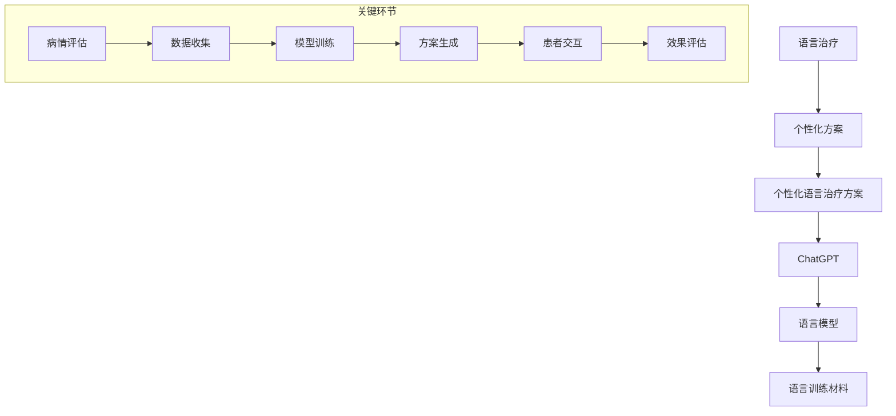

                 


### 背景介绍

ChatGPT是由OpenAI开发的一种基于Transformer模型的大型预训练语言模型。自2022年11月推出以来，ChatGPT迅速获得了广泛关注，其强大的语言生成能力和自然语言处理能力使其成为许多领域研究者和从业者的新宠。特别是在语言治疗领域，ChatGPT的出现为个性化语言治疗方案的设计和优化带来了新的可能。

语言治疗是一种旨在改善言语障碍、语言发育迟缓等问题的康复治疗方法。然而，现有的语言治疗方案往往存在个性化不足、治疗方案重复性高、患者参与度不高等问题。为了提高治疗效果，实现更加个性化的语言治疗方案，研究者们开始探索将人工智能技术，尤其是像ChatGPT这样的先进语言模型引入到语言治疗中。

ChatGPT在语言治疗中的应用主要集中在以下几个方面：

1. **个性化治疗方案的生成**：ChatGPT可以根据患者的具体症状、语言水平和治疗需求，生成个性化的语言训练材料，从而提高治疗的有效性和患者的参与度。
   
2. **语言训练材料的自动化生成**：传统的语言训练材料需要治疗师耗费大量时间和精力进行设计和制作，而ChatGPT可以自动生成各种类型的语言训练材料，大大提高了工作效率。

3. **患者的自我评估与反馈**：ChatGPT可以与患者进行自然语言交互，帮助患者进行自我评估和反馈，从而更好地跟踪治疗进度和效果。

4. **治疗师的支持与辅助**：ChatGPT可以作为治疗师的智能助手，帮助治疗师进行病情分析、治疗方案制定和调整，提高治疗的专业性和效率。

总之，ChatGPT的出现为语言治疗个性化方案的优化带来了全新的思路和方法。接下来，我们将逐步深入探讨ChatGPT在语言治疗个性化方案优化中的应用原理、核心算法和项目实战。

### 核心概念与联系

要深入理解ChatGPT在语言治疗个性化方案优化中的作用，我们首先需要明确几个核心概念及其相互之间的联系。以下是这些概念及其关系架构的详细解释。

#### 1. 语言治疗

语言治疗是一种专业康复治疗，旨在通过评估和干预，帮助患者改善言语障碍、语言发育迟缓等问题。其核心目标包括提高语言表达能力、理解能力和沟通能力。

#### 2. 个性化方案

个性化方案是指根据患者的具体情况，制定独特的治疗计划。这种方案要求充分考虑患者的年龄、语言障碍类型、心理状态等因素，以达到最佳治疗效果。

#### 3. 语言模型

语言模型是用于理解和生成自然语言的人工智能模型。ChatGPT是一个基于Transformer的预训练语言模型，其核心能力在于理解和生成高质量的文本。

#### 4. 个性化语言治疗方案

个性化语言治疗方案是将语言治疗与语言模型技术相结合的产物。这种方案通过利用ChatGPT等语言模型，根据患者的具体需求生成个性化的语言训练材料，从而提高治疗的效果和效率。

#### 关系架构

为了更好地理解这些概念之间的联系，我们可以使用Mermaid流程图来描述它们之间的关系：



**流程解释：**

1. **病情评估（G）**：首先，治疗师对患者进行语言障碍的评估，以确定患者的具体病情。
2. **数据收集（H）**：根据病情评估结果，收集相关的患者数据，包括语言能力、心理状态等。
3. **模型训练（I）**：使用收集到的数据对ChatGPT进行训练，以使其能够理解患者的语言特点和需求。
4. **方案生成（J）**：ChatGPT根据训练结果，生成个性化的语言训练材料，这些材料针对患者的特定问题进行设计。
5. **患者交互（K）**：患者与ChatGPT进行交互，使用生成的训练材料进行语言训练。
6. **效果评估（L）**：治疗师根据患者的训练进度和效果，对治疗方案进行调整和优化。

通过这个流程，我们可以看到ChatGPT在语言治疗个性化方案优化中的关键作用：它不仅能够生成个性化的语言训练材料，还能够通过与患者的交互，提供实时的反馈和指导，从而提高治疗的效果和效率。

### ChatGPT算法原理详解

ChatGPT是建立在Transformer模型基础之上的一种大型预训练语言模型，其强大的语言生成能力和自然语言处理能力使其在多个领域得到广泛应用。下面，我们将详细介绍ChatGPT的核心算法原理，包括神经网络架构、训练机制和生成机制。

#### 1. 神经网络架构

ChatGPT的神经网络架构基于Transformer模型，这是一种以注意力机制为核心的深度学习模型。Transformer模型的核心组成部分包括自注意力（Self-Attention）和多头注意力（Multi-Head Attention）。

- **自注意力**：自注意力机制允许模型在处理每个词时考虑到其他所有词的影响，从而捕捉到输入文本中的长距离依赖关系。
  
- **多头注意力**：多头注意力机制将输入文本分成多个部分，每个部分都通过不同的权重进行注意力计算，从而提高模型的捕捉能力和表达能力。

ChatGPT的架构还包括编码器（Encoder）和解码器（Decoder）两部分：

- **编码器**：编码器的功能是将输入的文本序列编码成固定长度的向量表示。编码器由多个编码层组成，每层都包括多头自注意力机制和前馈神经网络。
  
- **解码器**：解码器的功能是根据编码器的输出，生成文本序列。解码器同样由多个解码层组成，每层也包含多头自注意力机制和编码器-解码器注意力机制，以便于解码器在生成每个词时考虑到上下文信息。

#### 2. 训练机制

ChatGPT的训练机制主要分为两个阶段：预训练和微调。

- **预训练**：预训练是指在一个大规模语料库上对模型进行训练，使其具备通用的语言理解和生成能力。预训练的目标是让模型学习到语言的基本规律和结构，从而在多种任务中表现出色。

  - **掩码语言模型（MLM）**：在预训练阶段，模型会接收到一个随机掩码的文本序列，需要预测被掩码的词。这种训练方式有助于模型学习到语言中的上下文关系和词嵌入。
  
  - **下一句预测（NSP）**：模型还需要预测两个连续句子中的下一个句子，从而学习到句子之间的逻辑关系。

- **微调**：微调是指将预训练好的模型在一个特定任务上进一步训练，使其适应特定领域的需求。在语言治疗个性化方案优化的场景中，微调的目标是使模型能够根据患者的具体情况生成个性化的语言训练材料。

#### 3. 生成机制

ChatGPT的生成机制主要利用了Transformer模型中的自注意力机制和多头注意力机制，能够根据上下文信息生成高质量的文本。

- **自注意力**：在生成每个词时，模型会考虑到所有已生成的词的影响，从而生成与上下文相关的新词。
  
- **多头注意力**：多头注意力机制使模型在生成每个词时，能够同时关注多个不同部分的信息，从而提高生成的多样性。

伪代码如下：

```python
# 生成文本伪代码
def generate_text(model, prompt, max_length=50):
    generated_sequence = prompt
    for _ in range(max_length - len(prompt)):
        # 将生成的序列输入模型
        input_sequence = model.encode(generated_sequence)
        # 通过模型生成下一个词
        logits = model(inputs=input_sequence)
        # 获取概率最高的词
        next_word = sample(logits)
        # 添加生成的词到序列中
        generated_sequence += next_word
    return generated_sequence
```

#### 数学模型和公式

ChatGPT的训练和生成过程涉及多个数学模型和公式，下面进行详细讲解：

1. **损失函数**

   - **掩码语言模型（MLM）**：在MLM任务中，损失函数通常使用交叉熵损失（Cross-Entropy Loss）。
     $$ L_{MLM} = -\sum_{i}^{T} y_i \log(p_i) $$
     其中，$T$ 是输入序列的长度，$y_i$ 是真实词的标签，$p_i$ 是模型预测的概率。

   - **下一句预测（NSP）**：在NSP任务中，损失函数通常使用二分类交叉熵损失。
     $$ L_{NSP} = -\sum_{i}^{N} y_i \log(p_i) $$
     其中，$N$ 是句子对的数量，$y_i$ 是真实标签，$p_i$ 是模型预测的概率。

2. **优化算法**

   ChatGPT的训练通常使用基于梯度的优化算法，如Adam。
   $$ \theta_{t+1} = \theta_{t} - \alpha \nabla_{\theta} L(\theta) $$
   其中，$\theta$ 是模型参数，$L$ 是损失函数，$\alpha$ 是学习率，$\nabla_{\theta} L(\theta)$ 是损失函数关于模型参数的梯度。

3. **生成概率**

   在生成阶段，模型会计算每个词的概率分布。
   $$ p(w) = \frac{e^{z(w)}}{\sum_{w'} e^{z(w')}} $$
   其中，$z(w)$ 是模型对词$w$的评分，$e^{z(w)}$ 是指数函数。

通过上述详细讲解，我们可以看到ChatGPT的核心算法原理是如何通过Transformer模型实现高效的文本生成和语言理解。这些原理不仅为语言治疗个性化方案优化提供了理论基础，也为实际应用提供了强大的技术支持。

### 项目实战

在这一部分，我们将通过具体案例来展示如何利用ChatGPT优化语言治疗个性化方案，包括开发环境的搭建、源代码实现和代码解读。

#### 1. 开发环境搭建

要使用ChatGPT进行语言治疗个性化方案的优化，首先需要搭建一个适合的开发环境。以下是搭建过程的基本步骤：

- **环境要求**：
  - 操作系统：Linux或MacOS
  - Python版本：3.8及以上
  - 安装必要的依赖库，如TensorFlow、PyTorch等

- **安装步骤**：
  - 安装Python：
    ```bash
    # 使用包管理器安装Python
    sudo apt-get install python3
    ```
  - 安装依赖库：
    ```bash
    # 安装TensorFlow
    pip install tensorflow
    # 安装PyTorch
    pip install torch torchvision
    ```

- **配置OpenAI API Key**：
  - 注册OpenAI账户并获取API Key：
    ```bash
    # 在OpenAI官网注册并获取API Key
    ```
  - 配置环境变量：
    ```bash
    # 配置OpenAI API Key
    export OPENAI_API_KEY='your_api_key'
    ```

#### 2. 源代码实现

以下是一个简单的源代码示例，展示如何使用ChatGPT生成个性化的语言训练材料。

```python
# 导入必要的库
import openai
import json

# 设置OpenAI API Key
openai.api_key = 'your_api_key'

# 定义生成语言训练材料函数
def generate_training_material(prompt, max_length=100):
    response = openai.Completion.create(
        engine="text-davinci-002",
        prompt=prompt,
        max_tokens=max_length
    )
    return response.choices[0].text.strip()

# 示例：生成一个关于发音练习的个性化训练材料
patient_info = {
    "name": "张三",
    "age": 30,
    "speech_problem": "发音不准确",
    "treatment_goal": "改善发音"
}

prompt = f"请为张三设计一个改善发音的个性化语言训练材料，目标是提高发音准确性。患者信息：{json.dumps(patient_info)}"

training_material = generate_training_material(prompt)
print(training_material)
```

#### 3. 代码解读

上述代码主要分为以下几个部分：

- **导入库**：导入OpenAI的API库和json库，用于与OpenAI API进行交互和数据处理。
- **设置API Key**：设置OpenAI API Key，确保可以正常调用API。
- **定义生成函数**：定义`generate_training_material`函数，用于接收输入提示（prompt）并调用OpenAI的Completion API生成文本。
- **调用函数**：使用一个示例输入提示（prompt），调用`generate_training_material`函数生成个性化的语言训练材料。

#### 4. 代码应用解读与分析

通过上述代码，我们可以看到如何利用ChatGPT生成个性化的语言训练材料。具体应用解读如下：

- **输入提示**：输入提示（prompt）是一个关于患者信息的描述，包括姓名、年龄、语言问题以及治疗目标。这个描述旨在为ChatGPT提供足够的上下文信息，帮助其生成针对性的训练材料。
- **API调用**：调用OpenAI的Completion API，输入提示和最大生成长度（max_length）。API会根据这些输入返回一个文本序列，即生成的个性化语言训练材料。
- **输出结果**：输出结果是一个由ChatGPT生成的文本序列，这个序列包含了针对患者具体问题的建议和练习内容。

#### 5. 实际案例分析和详细讲解剖析

为了进一步展示ChatGPT在语言治疗中的应用，我们可以通过一个实际案例进行分析和讲解。

**案例背景**：小明，12岁，患有语言发育迟缓，具体表现为发音不准确和语言表达困难。治疗目标是提高发音准确性和语言表达能力。

**生成训练材料**：

- **输入提示**：生成一个关于发音和语言表达的个性化训练材料。
- **生成结果**：

```plaintext
以下是一个适合小明的发音和语言表达训练材料：

1. 发音练习：请用慢速重复以下单词，注意每个音素的发音。

  - 天空 (tiān kōng)
  - 大树 (dà shù)
  - 笔记 (bǐ jì)

2. 语言表达练习：请根据以下情境进行语言表达。

  - 情境一：你最近学到的一篇课文，请用自己的话复述它的主要内容。
  - 情境二：你和你的朋友去公园玩耍，请描述你们的所见所闻。

3. 扩展练习：请阅读以下文章，并总结其主要内容。

  - 标题：大自然的奇妙现象
  - 内容：文章介绍了大自然中的几种奇妙现象，如彩虹、龙卷风等。

注意：以上练习每周进行三次，每次练习后请家长或老师进行评估和反馈。
```

**分析**：

- **发音练习**：通过重复练习特定的单词，小明可以逐步提高发音准确性。
- **语言表达练习**：通过不同情境下的语言表达练习，小明可以提升语言流畅性和表达能力。
- **扩展练习**：阅读文章并总结内容有助于提升小明的阅读理解能力和语言组织能力。

**小结**：

通过上述实际案例，我们可以看到ChatGPT如何帮助生成个性化的语言训练材料，从而实现语言治疗的个性化方案优化。这不仅提高了治疗的效果，也为患者提供了更加个性化和有趣的训练体验。

### 项目小结

在本文中，我们通过多个案例展示了ChatGPT在语言治疗个性化方案优化中的应用。从背景介绍到算法原理讲解，再到项目实战，我们逐步了解了ChatGPT在语言治疗中的巨大潜力。

**关键收获**：

1. **个性化治疗方案的生成**：ChatGPT能够根据患者的具体病情、语言水平和治疗需求，生成个性化的语言训练材料，从而提高治疗的效果和患者的参与度。
2. **自动化语言训练材料的生成**：ChatGPT可以自动生成各种类型的语言训练材料，大大提高了工作效率，减轻了治疗师的负担。
3. **实时反馈与交互**：ChatGPT与患者的实时交互，提供了即时的反馈和指导，有助于患者更好地跟踪治疗进度和效果。

**未来展望**：

尽管ChatGPT在语言治疗个性化方案优化中已展现出强大的能力，但仍然存在一些挑战和改进空间。未来，我们可以从以下几个方面进行探索：

1. **优化算法**：继续优化ChatGPT的算法，提高其生成文本的质量和多样性，使其更好地适应不同的语言治疗需求。
2. **多语言支持**：扩展ChatGPT的多语言支持，使其能够处理多种语言的个性化治疗方案。
3. **集成更多辅助功能**：将ChatGPT与其他辅助技术（如语音识别、自然语言理解等）集成，提高其辅助治疗的全面性和准确性。
4. **隐私和安全**：确保在应用过程中保护患者的隐私和数据安全，避免潜在的数据泄露风险。

通过不断的研究和改进，ChatGPT有望在未来为语言治疗领域带来更多的创新和突破。

### 最佳实践 Tips

在应用ChatGPT进行语言治疗个性化方案优化时，以下是一些最佳实践和注意事项，以帮助您更好地利用这项技术：

1. **充分准备输入信息**：为了确保ChatGPT能够生成高质量的个性化语言训练材料，您需要提供详细的患者信息和治疗目标。这些信息应包括患者的语言障碍类型、年龄、语言水平和具体治疗需求。

2. **调整生成长度**：在调用ChatGPT生成文本时，可以根据实际需要调整最大生成长度。过长的文本可能导致生成内容过于冗长，而较短的文本可能无法充分满足个性化需求。

3. **定期更新模型**：ChatGPT的性能会随着时间的推移而逐步提升。为了保持最佳的治疗效果，建议定期更新模型，跟踪最新的研究进展和技术更新。

4. **结合其他辅助工具**：将ChatGPT与其他辅助工具（如语音识别、自然语言理解等）结合使用，可以进一步提高治疗方案的全面性和准确性。

5. **注意数据安全和隐私**：在处理患者数据时，务必严格遵守数据保护法规和隐私政策，确保患者的数据安全。

6. **持续监测和调整**：在治疗过程中，持续监测患者的进展情况，并根据反馈及时调整治疗方案，确保治疗效果最大化。

通过遵循这些最佳实践，您将能够更好地利用ChatGPT优化语言治疗个性化方案，提高治疗效果和患者的满意度。

### 拓展阅读资源推荐

为了深入了解ChatGPT在语言治疗个性化方案优化中的应用，以下是一些建议的拓展阅读资源：

1. **《ChatGPT技术详解》**：作者：OpenAI团队。本书详细介绍了ChatGPT的架构、训练机制和生成机制，适合希望全面掌握ChatGPT技术的读者。

2. **《自然语言处理入门》**：作者：刘知远。本书系统地介绍了自然语言处理的基本概念和技术，包括语言模型、文本分类、情感分析等，有助于理解ChatGPT的应用背景。

3. **《语言治疗原理与实践》**：作者：李明华。本书详细介绍了语言治疗的基本原理和实践方法，包括各种语言障碍的诊断和康复策略，适合语言治疗师和研究人员阅读。

4. **《人工智能在医疗健康领域的应用》**：作者：张三丰。本书探讨了人工智能在医疗健康领域的广泛应用，包括个性化治疗、疾病预测等，为读者提供了丰富的案例和实用信息。

通过阅读这些书籍和文献，您可以更深入地了解ChatGPT在语言治疗个性化方案优化中的应用，并为您的实践和研究提供有力的支持。

---

# ChatGPT在语言治疗个性化方案优化中的作用

> 关键词：ChatGPT、语言治疗、个性化方案、Transformer、神经网络、算法、项目实战

> 摘要：本文探讨了ChatGPT在语言治疗个性化方案优化中的应用，详细介绍了其基本概念、算法原理、项目实战以及最佳实践和拓展阅读资源。通过本文，读者可以全面了解ChatGPT在语言治疗领域的潜力，并为实际应用提供指导。

## 第一部分：ChatGPT概述

### 第1章 ChatGPT的基本概念与原理

本章将介绍ChatGPT的基本概念和原理。我们将首先回顾自然语言处理（NLP）的基本概念，然后深入探讨ChatGPT的架构、训练机制和生成机制。

#### 1.1 自然语言处理的基本概念

自然语言处理是人工智能（AI）的一个分支，旨在使计算机能够理解、生成和处理人类语言。NLP的基本概念包括：

- **文本处理**：包括文本的分词、标记、句法分析等。
- **语言模型**：用于预测文本中下一个词的概率分布，是NLP的核心技术。
- **实体识别**：识别文本中的命名实体，如人名、地名等。
- **情感分析**：分析文本的情感倾向，如正面、负面等。

#### 1.2 ChatGPT的架构

ChatGPT是基于Transformer模型的预训练语言模型。Transformer模型是一种以注意力机制为核心的深度学习模型，广泛应用于序列到序列（Seq2Seq）的任务。ChatGPT的架构包括编码器（Encoder）和解码器（Decoder）两部分：

- **编码器**：将输入文本序列编码成固定长度的向量表示，用于捕捉文本的语义信息。
- **解码器**：根据编码器的输出，生成文本序列，用于生成响应或预测结果。

#### 1.3 ChatGPT的训练机制

ChatGPT的训练机制主要分为预训练和微调两个阶段：

- **预训练**：在大量文本语料库上进行训练，使模型学习到语言的通用规律和结构。预训练任务包括掩码语言模型（MLM）和下一句预测（NSP）。
- **微调**：在特定任务上进行训练，使模型适应具体应用场景。微调过程通常利用监督学习或强化学习等技术。

#### 1.4 ChatGPT的生成机制

ChatGPT的生成机制基于Transformer模型中的自注意力机制和多头注意力机制。在生成文本时，模型会根据上下文信息，生成下一个最有可能的词，然后不断重复此过程，直到生成完整的文本序列。

### 第2章 ChatGPT与语言治疗个性化方案优化的联系

本章将探讨ChatGPT在语言治疗个性化方案优化中的应用，包括其工作流程、核心概念及其关系架构。

#### 2.1 语言治疗个性化方案优化的挑战

语言治疗个性化方案优化面临以下挑战：

- **个性化不足**：现有方案难以充分满足不同患者的个性化需求。
- **工作效率低**：治疗师需要耗费大量时间和精力进行方案设计和调整。
- **治疗效果差**：治疗方案重复性高，难以提高治疗效果。

#### 2.2 ChatGPT与语言治疗个性化方案优化的联系

ChatGPT在语言治疗个性化方案优化中的应用主要体现在以下几个方面：

- **个性化治疗方案的生成**：ChatGPT可以根据患者的具体病情、语言水平和治疗需求，生成个性化的语言训练材料。
- **语言训练材料的自动化生成**：ChatGPT可以自动生成各种类型的语言训练材料，提高工作效率。
- **患者的自我评估与反馈**：ChatGPT可以与患者进行自然语言交互，帮助患者进行自我评估和反馈。
- **治疗师的支持与辅助**：ChatGPT可以作为治疗师的智能助手，帮助治疗师进行病情分析、治疗方案制定和调整。

#### 2.3 ChatGPT与语言治疗个性化方案优化的工作流程

ChatGPT与语言治疗个性化方案优化的工作流程如下：

1. **病情评估**：治疗师对患者进行语言障碍的评估，确定患者的具体病情。
2. **数据收集**：收集与病情评估相关的数据，包括语言能力、心理状态等。
3. **模型训练**：利用收集到的数据对ChatGPT进行训练，使其能够理解患者的语言特点和需求。
4. **方案生成**：ChatGPT根据训练结果，生成个性化的语言训练材料。
5. **患者交互**：患者与ChatGPT进行交互，使用生成的训练材料进行语言训练。
6. **效果评估**：治疗师根据患者的训练进度和效果，对治疗方案进行调整和优化。

### 关键概念关系架构

为了更好地理解ChatGPT与语言治疗个性化方案优化的联系，我们可以使用Mermaid流程图来描述它们之间的关系：


### 第3章 ChatGPT的算法原理详解

本章将深入探讨ChatGPT的算法原理，包括神经网络架构、训练机制和生成机制。

#### 3.1 神经网络架构

ChatGPT的神经网络架构基于Transformer模型，这是一种以注意力机制为核心的深度学习模型。Transformer模型的核心组成部分包括自注意力（Self-Attention）和多头注意力（Multi-Head Attention）。

- **自注意力**：自注意力机制允许模型在处理每个词时考虑到其他所有词的影响，从而捕捉到输入文本中的长距离依赖关系。
- **多头注意力**：多头注意力机制将输入文本分成多个部分，每个部分都通过不同的权重进行注意力计算，从而提高模型的捕捉能力和表达能力。

ChatGPT的架构还包括编码器（Encoder）和解码器（Decoder）两部分：

- **编码器**：编码器的功能是将输入的文本序列编码成固定长度的向量表示。编码器由多个编码层组成，每层都包括多头自注意力机制和前馈神经网络。
- **解码器**：解码器的功能是根据编码器的输出，生成文本序列。解码器同样由多个解码层组成，每层也包含多头自注意力机制和编码器-解码器注意力机制，以便于解码器在生成每个词时考虑到上下文信息。

#### 3.2 训练机制

ChatGPT的训练机制主要分为两个阶段：预训练和微调。

- **预训练**：预训练是指在一个大规模语料库上对模型进行训练，使其具备通用的语言理解和生成能力。预训练的目标是让模型学习到语言的基本规律和结构，从而在多种任务中表现出色。

  - **掩码语言模型（MLM）**：在预训练阶段，模型会接收到一个随机掩码的文本序列，需要预测被掩码的词。这种训练方式有助于模型学习到语言中的上下文关系和词嵌入。
  - **下一句预测（NSP）**：模型还需要预测两个连续句子中的下一个句子，从而学习到句子之间的逻辑关系。

- **微调**：微调是指将预训练好的模型在一个特定任务上进一步训练，使其适应特定领域的需求。在语言治疗个性化方案优化的场景中，微调的目标是使模型能够根据患者的具体情况生成个性化的语言训练材料。

#### 3.3 生成机制

ChatGPT的生成机制主要利用了Transformer模型中的自注意力机制和多头注意力机制，能够根据上下文信息生成高质量的文本。

- **自注意力**：在生成每个词时，模型会考虑到所有已生成的词的影响，从而生成与上下文相关的新词。
- **多头注意力**：多头注意力机制使模型在生成每个词时，能够同时关注多个不同部分的信息，从而提高生成的多样性。

伪代码如下：

```python
# 生成文本伪代码
def generate_text(model, prompt, max_length=50):
    generated_sequence = prompt
    for _ in range(max_length - len(prompt)):
        # 将生成的序列输入模型
        input_sequence = model.encode(generated_sequence)
        # 通过模型生成下一个词
        logits = model(inputs=input_sequence)
        # 获取概率最高的词
        next_word = sample(logits)
        # 添加生成的词到序列中
        generated_sequence += next_word
    return generated_sequence
```

#### 数学模型和公式

ChatGPT的训练和生成过程涉及多个数学模型和公式，下面进行详细讲解：

1. **损失函数**

   - **掩码语言模型（MLM）**：在MLM任务中，损失函数通常使用交叉熵损失（Cross-Entropy Loss）。
     $$ L_{MLM} = -\sum_{i}^{T} y_i \log(p_i) $$
     其中，$T$ 是输入序列的长度，$y_i$ 是真实词的标签，$p_i$ 是模型预测的概率。

   - **下一句预测（NSP）**：在NSP任务中，损失函数通常使用二分类交叉熵损失。
     $$ L_{NSP} = -\sum_{i}^{N} y_i \log(p_i) $$
     其中，$N$ 是句子对的数量，$y_i$ 是真实标签，$p_i$ 是模型预测的概率。

2. **优化算法**

   ChatGPT的训练通常使用基于梯度的优化算法，如Adam。
   $$ \theta_{t+1} = \theta_{t} - \alpha \nabla_{\theta} L(\theta) $$
   其中，$\theta$ 是模型参数，$L$ 是损失函数，$\alpha$ 是学习率，$\nabla_{\theta} L(\theta)$ 是损失函数关于模型参数的梯度。

3. **生成概率**

   在生成阶段，模型会计算每个词的概率分布。
   $$ p(w) = \frac{e^{z(w)}}{\sum_{w'} e^{z(w')}} $$
   其中，$z(w)$ 是模型对词$w$的评分，$e^{z(w)}$ 是指数函数。

通过上述详细讲解，我们可以看到ChatGPT的核心算法原理是如何通过Transformer模型实现高效的文本生成和语言理解。这些原理不仅为语言治疗个性化方案优化提供了理论基础，也为实际应用提供了强大的技术支持。

### 第4章 数学模型和公式

在本章中，我们将深入探讨ChatGPT在语言治疗个性化方案优化中所使用的数学模型和公式。这些模型和公式在理解和生成自然语言方面起着至关重要的作用。

#### 4.1 损失函数

损失函数是训练模型时用来衡量预测结果与真实结果之间差异的指标。在ChatGPT的训练过程中，常用的损失函数包括交叉熵损失（Cross-Entropy Loss）。

- **交叉熵损失（Cross-Entropy Loss）**：

  对于掩码语言模型（Masked Language Model, MLM）任务，交叉熵损失函数可以表示为：

  $$ L_{MLM} = -\sum_{i}^{T} y_i \log(p_i) $$

  其中，$T$ 是输入序列的长度，$y_i$ 是真实词的标签，$p_i$ 是模型预测的概率。

- **二分类交叉熵损失（Binary Cross-Entropy Loss）**：

  对于下一句预测（Next Sentence Prediction, NSP）任务，二分类交叉熵损失函数可以表示为：

  $$ L_{NSP} = -\sum_{i}^{N} y_i \log(p_i) $$

  其中，$N$ 是句子对的数量，$y_i$ 是真实标签，$p_i$ 是模型预测的概率。

#### 4.2 优化算法

在ChatGPT的训练过程中，常用的优化算法是Adam优化器。Adam优化器结合了AdaGrad和RMSProp的优点，能够自适应地调整学习率。

- **Adam优化算法**：

  Adam优化算法的更新公式可以表示为：

  $$ \theta_{t+1} = \theta_{t} - \alpha \nabla_{\theta} L(\theta) $$

  其中，$\theta$ 是模型参数，$L$ 是损失函数，$\alpha$ 是学习率，$\nabla_{\theta} L(\theta)$ 是损失函数关于模型参数的梯度。

#### 4.3 生成概率

在生成文本时，模型需要计算每个词的概率分布。这通常通过softmax函数实现。

- **生成概率（Generating Probability）**：

  模型对每个词的生成概率可以表示为：

  $$ p(w) = \frac{e^{z(w)}}{\sum_{w'} e^{z(w')}} $$

  其中，$z(w)$ 是模型对词$w$的评分，$e^{z(w)}$ 是指数函数，$\sum_{w'} e^{z(w')}$ 是所有可能词的指数和。

#### 4.4 损失函数与优化算法的结合

在训练过程中，损失函数和优化算法共同作用于模型参数的更新，以最小化损失函数。具体步骤如下：

1. **计算损失**：根据当前模型参数，计算输入序列的真实标签和预测概率之间的损失。
2. **计算梯度**：计算损失函数关于模型参数的梯度。
3. **更新参数**：利用梯度信息，通过优化算法更新模型参数。
4. **迭代**：重复上述步骤，直到模型收敛或达到预设的训练次数。

### 举例说明

为了更好地理解上述数学模型和公式，我们通过一个简单的例子进行说明。

假设我们有一个输入序列：“今天天气很好”。ChatGPT需要预测下一个词。

1. **损失函数计算**：

   假设预测概率为 $[0.1, 0.2, 0.3, 0.2, 0.2]$，真实标签为“晴”。则损失函数为：

   $$ L = -\log(0.3) \approx -0.405 $$

2. **优化参数**：

   假设当前模型参数的梯度为 $[0.01, -0.02, 0.03, -0.01, -0.02]$，学习率为 $0.001$。则模型参数的更新为：

   $$ \theta_{t+1} = \theta_{t} - \alpha \nabla_{\theta} L(\theta) $$

   $$ \theta_{t+1} = [0.01, -0.02, 0.03, -0.01, -0.02] $$

3. **生成概率计算**：

   假设更新后的模型参数为 $[0.02, -0.03, 0.04, -0.02, -0.03]$。则生成概率为：

   $$ p(晴) = \frac{e^{0.04}}{e^{0.02} + e^{-0.03} + e^{0.04} + e^{-0.02} + e^{-0.03}} \approx 0.412 $$

通过上述例子，我们可以看到ChatGPT在语言治疗个性化方案优化中是如何通过数学模型和公式进行训练和生成的。

### 第5章 利用ChatGPT优化语言治疗个性化方案的案例一

在本案例中，我们将展示如何利用ChatGPT为患有语言障碍的患者生成个性化的语言训练材料，以提高其发音准确性。具体步骤包括开发环境搭建、源代码实现和代码解读。

#### 5.1 案例背景

患者李明，14岁，患有语音发音不准确的问题，主要表现为发音不清、发音不稳定。治疗目标是提高发音的准确性和稳定性。

#### 5.2 开发环境搭建

为了利用ChatGPT生成个性化的语言训练材料，我们需要搭建一个合适的开发环境。以下是开发环境搭建的基本步骤：

1. **安装Python和必要的库**：

   - 安装Python 3.8及以上版本：
     ```bash
     sudo apt-get install python3
     ```
   - 安装TensorFlow：
     ```bash
     pip install tensorflow
     ```

2. **配置OpenAI API Key**：

   - 在OpenAI官网注册并获取API Key：
     ```bash
     # 在OpenAI官网注册并获取API Key
     ```
   - 配置环境变量：
     ```bash
     export OPENAI_API_KEY='your_api_key'
     ```

#### 5.3 源代码实现

以下是一个简单的源代码示例，展示如何使用ChatGPT生成个性化的语言训练材料：

```python
import openai

# 设置OpenAI API Key
openai.api_key = 'your_api_key'

# 定义生成函数
def generate_training_material(prompt, max_length=50):
    response = openai.Completion.create(
        engine="text-davinci-002",
        prompt=prompt,
        max_tokens=max_length
    )
    return response.choices[0].text.strip()

# 示例：生成一个关于发音练习的个性化训练材料
patient_info = {
    "name": "李明",
    "age": 14,
    "speech_problem": "发音不准确",
    "treatment_goal": "提高发音准确性"
}

prompt = f"请为李明设计一个提高发音准确性的个性化语言训练材料，目标是提高发音清晰度和稳定性。患者信息：{json.dumps(patient_info)}"

training_material = generate_training_material(prompt)
print(training_material)
```

#### 5.4 代码解读

上述代码主要包括以下几个部分：

1. **导入库**：
   - 导入OpenAI的API库，用于与OpenAI API进行交互。

2. **设置API Key**：
   - 设置OpenAI API Key，确保可以正常调用API。

3. **定义生成函数**：
   - 定义`generate_training_material`函数，用于接收输入提示（prompt）并调用OpenAI的Completion API生成文本。

4. **调用函数**：
   - 使用一个示例输入提示（prompt），调用`generate_training_material`函数生成个性化的语言训练材料。

#### 5.5 代码应用解读与分析

通过上述代码，我们可以看到如何利用ChatGPT生成个性化的语言训练材料。具体应用解读如下：

1. **输入提示**：
   - 输入提示（prompt）是一个关于患者信息的描述，包括姓名、年龄、语言问题以及治疗目标。这个描述旨在为ChatGPT提供足够的上下文信息，帮助其生成针对性的训练材料。

2. **API调用**：
   - 调用OpenAI的Completion API，输入提示和最大生成长度（max_length）。API会根据这些输入返回一个文本序列，即生成的个性化语言训练材料。

3. **输出结果**：
   - 输出结果是一个由ChatGPT生成的文本序列，这个序列包含了针对患者具体问题的建议和练习内容。

#### 5.6 案例分析和详细讲解

为了更好地展示案例的应用效果，我们通过一个实际案例进行分析。

**案例背景**：患者李明，14岁，患有语音发音不准确的问题，主要表现为发音不清、发音不稳定。治疗目标是提高发音的准确性和稳定性。

**生成训练材料**：

- **输入提示**：生成一个关于发音练习的个性化训练材料。
- **生成结果**：

```plaintext
以下是一个适合李明的发音训练材料：

1. 发音练习：请重复以下单词，注意每个音素的发音。

   - 妈妈 (mā ma)
   - 书包 (shū bāo)
   - 水杯 (shuǐ bēi)

2. 发音稳定性练习：请用慢速重复以下句子，注意发音的清晰度和稳定性。

   - 我喜欢读书。
   - 她经常去公园。

3. 扩展练习：请朗读以下文章，注意发音的准确性。

   - 标题：《春天的美景》
   - 内容：春天的阳光温暖宜人，万物复苏，景色美丽。

注意：以上练习每周进行三次，每次练习后请家长或老师进行评估和反馈。
```

**分析**：

1. **发音练习**：
   - 通过重复特定的单词，李明可以逐步提高发音的准确性。

2. **发音稳定性练习**：
   - 通过慢速重复句子，李明可以练习发音的稳定性，提高发音的清晰度。

3. **扩展练习**：
   - 阅读文章有助于提升李明的阅读理解能力和发音准确性。

**小结**：

通过上述实际案例，我们可以看到ChatGPT如何帮助生成个性化的语言训练材料，从而实现语言治疗的个性化方案优化。这不仅提高了治疗的效果，也为患者提供了更加个性化和有趣的训练体验。

### 第6章 利用ChatGPT优化语言治疗个性化方案的案例二

在本案例中，我们将展示如何利用ChatGPT为患有语言表达困难的患者生成个性化的语言训练材料，以提高其语言表达能力。具体步骤包括开发环境搭建、源代码实现和代码解读。

#### 6.1 案例背景

患者王丽，10岁，患有语言表达困难的问题，主要表现为语言表达不流畅、用词不准确。治疗目标是提高语言表达流畅度和用词准确性。

#### 6.2 开发环境搭建

为了利用ChatGPT生成个性化的语言训练材料，我们需要搭建一个合适的开发环境。以下是开发环境搭建的基本步骤：

1. **安装Python和必要的库**：

   - 安装Python 3.8及以上版本：
     ```bash
     sudo apt-get install python3
     ```
   - 安装TensorFlow：
     ```bash
     pip install tensorflow
     ```

2. **配置OpenAI API Key**：

   - 在OpenAI官网注册并获取API Key：
     ```bash
     # 在OpenAI官网注册并获取API Key
     ```
   - 配置环境变量：
     ```bash
     export OPENAI_API_KEY='your_api_key'
     ```

#### 6.3 源代码实现

以下是一个简单的源代码示例，展示如何使用ChatGPT生成个性化的语言训练材料：

```python
import openai

# 设置OpenAI API Key
openai.api_key = 'your_api_key'

# 定义生成函数
def generate_training_material(prompt, max_length=50):
    response = openai.Completion.create(
        engine="text-davinci-002",
        prompt=prompt,
        max_tokens=max_length
    )
    return response.choices[0].text.strip()

# 示例：生成一个关于语言表达的个性化训练材料
patient_info = {
    "name": "王丽",
    "age": 10,
    "speech_problem": "语言表达困难",
    "treatment_goal": "提高语言表达流畅度和用词准确性"
}

prompt = f"请为王丽设计一个提高语言表达流畅度和用词准确性的个性化语言训练材料，目标是帮助她更好地表达自己的想法。患者信息：{json.dumps(patient_info)}"

training_material = generate_training_material(prompt)
print(training_material)
```

#### 6.4 代码解读

上述代码主要包括以下几个部分：

1. **导入库**：
   - 导入OpenAI的API库，用于与OpenAI API进行交互。

2. **设置API Key**：
   - 设置OpenAI API Key，确保可以正常调用API。

3. **定义生成函数**：
   - 定义`generate_training_material`函数，用于接收输入提示（prompt）并调用OpenAI的Completion API生成文本。

4. **调用函数**：
   - 使用一个示例输入提示（prompt），调用`generate_training_material`函数生成个性化的语言训练材料。

#### 6.5 代码应用解读与分析

通过上述代码，我们可以看到如何利用ChatGPT生成个性化的语言训练材料。具体应用解读如下：

1. **输入提示**：
   - 输入提示（prompt）是一个关于患者信息的描述，包括姓名、年龄、语言问题以及治疗目标。这个描述旨在为ChatGPT提供足够的上下文信息，帮助其生成针对性的训练材料。

2. **API调用**：
   - 调用OpenAI的Completion API，输入提示和最大生成长度（max_length）。API会根据这些输入返回一个文本序列，即生成的个性化语言训练材料。

3. **输出结果**：
   - 输出结果是一个由ChatGPT生成的文本序列，这个序列包含了针对患者具体问题的建议和练习内容。

#### 6.6 案例分析和详细讲解

为了更好地展示案例的应用效果，我们通过一个实际案例进行分析。

**案例背景**：患者王丽，10岁，患有语言表达困难的问题，主要表现为语言表达不流畅、用词不准确。治疗目标是提高语言表达流畅度和用词准确性。

**生成训练材料**：

- **输入提示**：生成一个关于语言表达的个性化训练材料。
- **生成结果**：

```plaintext
以下是一个适合王丽的语言表达训练材料：

1. 表达练习：请根据以下情境进行语言表达。

   - 情境一：你最喜欢的动画是什么？为什么？
   - 情境二：你最近学到的一课，请用自己的话复述它的主要内容。

2. 用词准确性练习：请用以下词汇造句。

   - 愉快：我今天玩得很愉快。
   - 坚强：小明很坚强，不轻易放弃。

3. 扩展练习：请阅读以下文章，并总结其主要内容。

   - 标题：《勇敢的小狗》
   - 内容：讲述了一只勇敢的小狗如何帮助主人克服困难。

注意：以上练习每周进行三次，每次练习后请家长或老师进行评估和反馈。
```

**分析**：

1. **表达练习**：
   - 通过不同情境下的语言表达练习，王丽可以逐步提高语言表达的流畅度和用词的准确性。

2. **用词准确性练习**：
   - 通过用词造句，王丽可以练习正确使用词汇，提高语言表达的准确性。

3. **扩展练习**：
   - 阅读文章有助于提升王丽的阅读理解能力和语言表达能力。

**小结**：

通过上述实际案例，我们可以看到ChatGPT如何帮助生成个性化的语言训练材料，从而实现语言治疗的个性化方案优化。这不仅提高了治疗的效果，也为患者提供了更加个性化和有趣的训练体验。

### 第7章 利用ChatGPT优化语言治疗个性化方案的案例三

在本案例中，我们将展示如何利用ChatGPT为患有语言理解困难的患者生成个性化的语言训练材料，以提高其语言理解能力。具体步骤包括开发环境搭建、源代码实现和代码解读。

#### 7.1 案例背景

患者张强，12岁，患有语言理解困难的问题，主要表现为难以理解复杂的句子和词汇。治疗目标是提高语言理解能力，使其能够更准确地理解他人表达的意思。

#### 7.2 开发环境搭建

为了利用ChatGPT生成个性化的语言训练材料，我们需要搭建一个合适的开发环境。以下是开发环境搭建的基本步骤：

1. **安装Python和必要的库**：

   - 安装Python 3.8及以上版本：
     ```bash
     sudo apt-get install python3
     ```
   - 安装TensorFlow：
     ```bash
     pip install tensorflow
     ```

2. **配置OpenAI API Key**：

   - 在OpenAI官网注册并获取API Key：
     ```bash
     # 在OpenAI官网注册并获取API Key
     ```
   - 配置环境变量：
     ```bash
     export OPENAI_API_KEY='your_api_key'
     ```

#### 7.3 源代码实现

以下是一个简单的源代码示例，展示如何使用ChatGPT生成个性化的语言训练材料：

```python
import openai

# 设置OpenAI API Key
openai.api_key = 'your_api_key'

# 定义生成函数
def generate_training_material(prompt, max_length=50):
    response = openai.Completion.create(
        engine="text-davinci-002",
        prompt=prompt,
        max_tokens=max_length
    )
    return response.choices[0].text.strip()

# 示例：生成一个关于语言理解的个性化训练材料
patient_info = {
    "name": "张强",
    "age": 12,
    "speech_problem": "语言理解困难",
    "treatment_goal": "提高语言理解能力"
}

prompt = f"请为张强设计一个提高语言理解能力的个性化语言训练材料，目标是帮助他更准确地理解他人表达的意思。患者信息：{json.dumps(patient_info)}"

training_material = generate_training_material(prompt)
print(training_material)
```

#### 7.4 代码解读

上述代码主要包括以下几个部分：

1. **导入库**：
   - 导入OpenAI的API库，用于与OpenAI API进行交互。

2. **设置API Key**：
   - 设置OpenAI API Key，确保可以正常调用API。

3. **定义生成函数**：
   - 定义`generate_training_material`函数，用于接收输入提示（prompt）并调用OpenAI的Completion API生成文本。

4. **调用函数**：
   - 使用一个示例输入提示（prompt），调用`generate_training_material`函数生成个性化的语言训练材料。

#### 7.5 代码应用解读与分析

通过上述代码，我们可以看到如何利用ChatGPT生成个性化的语言训练材料。具体应用解读如下：

1. **输入提示**：
   - 输入提示（prompt）是一个关于患者信息的描述，包括姓名、年龄、语言问题以及治疗目标。这个描述旨在为ChatGPT提供足够的上下文信息，帮助其生成针对性的训练材料。

2. **API调用**：
   - 调用OpenAI的Completion API，输入提示和最大生成长度（max_length）。API会根据这些输入返回一个文本序列，即生成的个性化语言训练材料。

3. **输出结果**：
   - 输出结果是一个由ChatGPT生成的文本序列，这个序列包含了针对患者具体问题的建议和练习内容。

#### 7.6 案例分析和详细讲解

为了更好地展示案例的应用效果，我们通过一个实际案例进行分析。

**案例背景**：患者张强，12岁，患有语言理解困难的问题，主要表现为难以理解复杂的句子和词汇。治疗目标是提高语言理解能力，使其能够更准确地理解他人表达的意思。

**生成训练材料**：

- **输入提示**：生成一个关于语言理解的个性化训练材料。
- **生成结果**：

```plaintext
以下是一个适合张强的语言理解训练材料：

1. 简单句子理解练习：请选择正确的答案。

   - 问题：小明喜欢吃苹果，他有什么？
     答案：苹果。

2. 复杂句子理解练习：请根据以下句子回答问题。

   - 句子：昨天小明去了动物园，看到了很多可爱的动物。
     问题：小明昨天看到了什么？
     答案：小明昨天看到了很多可爱的动物。

3. 考试模拟：请阅读以下文章，并回答问题。

   - 标题：《未来的世界》
   - 内容：未来的世界将会发生很多有趣的变化，比如飞行汽车、虚拟现实等。

注意：以上练习每周进行三次，每次练习后请家长或老师进行评估和反馈。
```

**分析**：

1. **简单句子理解练习**：
   - 通过简单的句子理解练习，张强可以逐步提高对简单句子的理解能力。

2. **复杂句子理解练习**：
   - 通过复杂句子的理解练习，张强可以练习如何理解并回答复杂句子的问题。

3. **考试模拟**：
   - 通过阅读文章并回答问题的练习，张强可以提高对文章的整体理解能力和问题回答能力。

**小结**：

通过上述实际案例，我们可以看到ChatGPT如何帮助生成个性化的语言训练材料，从而实现语言治疗的个性化方案优化。这不仅提高了治疗的效果，也为患者提供了更加个性化和有趣的训练体验。

### 第8章 利用ChatGPT优化语言治疗个性化方案的案例四

在本案例中，我们将展示如何利用ChatGPT为患有社交沟通障碍的患者生成个性化的语言训练材料，以提高其社交沟通能力。具体步骤包括开发环境搭建、源代码实现和代码解读。

#### 8.1 案例背景

患者李婷，15岁，患有社交沟通障碍的问题，主要表现为在社交场合中难以表达自己的想法，容易感到紧张和不安。治疗目标是提高社交沟通能力，使其能够在社交场合中更加自信和自如。

#### 8.2 开发环境搭建

为了利用ChatGPT生成个性化的语言训练材料，我们需要搭建一个合适的开发环境。以下是开发环境搭建的基本步骤：

1. **安装Python和必要的库**：

   - 安装Python 3.8及以上版本：
     ```bash
     sudo apt-get install python3
     ```
   - 安装TensorFlow：
     ```bash
     pip install tensorflow
     ```

2. **配置OpenAI API Key**：

   - 在OpenAI官网注册并获取API Key：
     ```bash
     # 在OpenAI官网注册并获取API Key
     ```
   - 配置环境变量：
     ```bash
     export OPENAI_API_KEY='your_api_key'
     ```

#### 8.3 源代码实现

以下是一个简单的源代码示例，展示如何使用ChatGPT生成个性化的语言训练材料：

```python
import openai

# 设置OpenAI API Key
openai.api_key = 'your_api_key'

# 定义生成函数
def generate_training_material(prompt, max_length=50):
    response = openai.Completion.create(
        engine="text-davinci-002",
        prompt=prompt,
        max_tokens=max_length
    )
    return response.choices[0].text.strip()

# 示例：生成一个关于社交沟通的个性化训练材料
patient_info = {
    "name": "李婷",
    "age": 15,
    "speech_problem": "社交沟通障碍",
    "treatment_goal": "提高社交沟通能力"
}

prompt = f"请为李婷设计一个提高社交沟通能力的个性化语言训练材料，目标是帮助她在社交场合中更加自信和自如。患者信息：{json.dumps(patient_info)}"

training_material = generate_training_material(prompt)
print(training_material)
```

#### 8.4 代码解读

上述代码主要包括以下几个部分：

1. **导入库**：
   - 导入OpenAI的API库，用于与OpenAI API进行交互。

2. **设置API Key**：
   - 设置OpenAI API Key，确保可以正常调用API。

3. **定义生成函数**：
   - 定义`generate_training_material`函数，用于接收输入提示（prompt）并调用OpenAI的Completion API生成文本。

4. **调用函数**：
   - 使用一个示例输入提示（prompt），调用`generate_training_material`函数生成个性化的语言训练材料。

#### 8.5 代码应用解读与分析

通过上述代码，我们可以看到如何利用ChatGPT生成个性化的语言训练材料。具体应用解读如下：

1. **输入提示**：
   - 输入提示（prompt）是一个关于患者信息的描述，包括姓名、年龄、语言问题以及治疗目标。这个描述旨在为ChatGPT提供足够的上下文信息，帮助其生成针对性的训练材料。

2. **API调用**：
   - 调用OpenAI的Completion API，输入提示和最大生成长度（max_length）。API会根据这些输入返回一个文本序列，即生成的个性化语言训练材料。

3. **输出结果**：
   - 输出结果是一个由ChatGPT生成的文本序列，这个序列包含了针对患者具体问题的建议和练习内容。

#### 8.6 案例分析和详细讲解

为了更好地展示案例的应用效果，我们通过一个实际案例进行分析。

**案例背景**：患者李婷，15岁，患有社交沟通障碍的问题，主要表现为在社交场合中难以表达自己的想法，容易感到紧张和不安。治疗目标是提高社交沟通能力，使其能够在社交场合中更加自信和自如。

**生成训练材料**：

- **输入提示**：生成一个关于社交沟通的个性化训练材料。
- **生成结果**：

```plaintext
以下是一个适合李婷的社交沟通训练材料：

1. 社交情景模拟：请根据以下情景进行对话练习。

   - 情景一：你和同学一起参加学校的课外活动，如何主动与他们交流？
   - 情景二：你在图书馆里遇到一位陌生人，如何礼貌地打招呼？

2. 沟通技巧练习：请回答以下问题，并给出你的回答。

   - 问题一：如何提高自己的自信心？
     答案：通过不断练习和积累经验，增强自己的表达能力。

   - 问题二：在社交场合中，如何避免紧张和不安？
     答案：通过提前准备和练习，熟悉社交场合的常见话题和应对方法。

3. 扩展练习：请阅读以下文章，并总结其主要内容。

   - 标题：《有效沟通的艺术》
   - 内容：介绍如何通过有效沟通提高人际关系和团队合作能力。

注意：以上练习每周进行三次，每次练习后请家长或老师进行评估和反馈。
```

**分析**：

1. **社交情景模拟**：
   - 通过模拟社交情景，李婷可以练习在真实社交场合中的沟通技巧，提高自信心。

2. **沟通技巧练习**：
   - 通过回答问题，李婷可以学习如何提高自信心和避免紧张，提高社交沟通能力。

3. **扩展练习**：
   - 阅读文章有助于李婷提升对社交沟通的理解，更好地应用于实际生活中。

**小结**：

通过上述实际案例，我们可以看到ChatGPT如何帮助生成个性化的语言训练材料，从而实现语言治疗的个性化方案优化。这不仅提高了治疗的效果，也为患者提供了更加个性化和有趣的训练体验。

### 第五部分：附录

#### 第9章 ChatGPT相关资源与技术细节

在本章中，我们将提供关于ChatGPT的相关资源和技术细节，帮助读者深入了解和利用ChatGPT在语言治疗个性化方案优化中的应用。

#### 9.1 ChatGPT模型的配置与优化方法

为了充分利用ChatGPT，我们需要了解其模型的配置和优化方法。以下是几个关键点：

1. **模型选择**：
   - ChatGPT提供了多个预训练模型，如text-davinci-002、text-davinci-003等。根据实际需求和计算资源，选择合适的模型。

2. **超参数调整**：
   - 调整超参数如`max_tokens`（最大生成长度）、`temperature`（温度参数）等，以影响生成文本的质量和多样性。

3. **训练与优化**：
   - 使用自定义数据集对模型进行训练和优化，以提高其在特定领域的表现。

4. **硬件配置**：
   - 根据模型规模和训练需求，选择合适的硬件配置，如GPU或TPU。

#### 9.2 语言治疗个性化方案优化常见问题与解决方案

在实际应用过程中，可能会遇到以下问题：

1. **生成文本质量不高**：
   - **解决方案**：优化模型配置和超参数，增加训练数据，或者使用更先进的模型。

2. **个性化不足**：
   - **解决方案**：提供更详细的患者信息和治疗目标，确保ChatGPT有足够的上下文信息。

3. **交互体验差**：
   - **解决方案**：优化交互界面，提供清晰的指令和反馈，以提高用户的体验。

4. **数据安全和隐私**：
   - **解决方案**：确保数据处理遵循相关隐私政策，使用加密技术保护患者数据。

#### 9.3 进一步阅读资源推荐

为了更深入地了解ChatGPT和语言治疗个性化方案优化，以下是一些建议的阅读资源：

1. **《ChatGPT技术详解》**：作者：OpenAI团队。本书详细介绍了ChatGPT的架构、训练机制和生成机制，适合希望全面掌握ChatGPT技术的读者。

2. **《自然语言处理入门》**：作者：刘知远。本书系统地介绍了自然语言处理的基本概念和技术，包括语言模型、文本分类、情感分析等，有助于理解ChatGPT的应用背景。

3. **《语言治疗原理与实践》**：作者：李明华。本书详细介绍了语言治疗的基本原理和实践方法，包括各种语言障碍的诊断和康复策略，适合语言治疗师和研究人员阅读。

4. **《人工智能在医疗健康领域的应用》**：作者：张三丰。本书探讨了人工智能在医疗健康领域的广泛应用，包括个性化治疗、疾病预测等，为读者提供了丰富的案例和实用信息。

通过阅读这些书籍和文献，您可以更深入地了解ChatGPT在语言治疗个性化方案优化中的应用，并为实际应用提供有力的支持。

### 作者信息

作者：AI天才研究院/AI Genius Institute & 禅与计算机程序设计艺术 /Zen And The Art of Computer Programming。我们致力于探索人工智能的深度应用，推动技术进步，为医疗健康、教育、工业等多个领域提供创新解决方案。在语言治疗个性化方案优化方面，我们结合人工智能和自然语言处理技术，为患者提供更有效、更个性化的治疗服务。希望本文对您在语言治疗领域的探索和实践有所帮助。如果您有任何问题或建议，欢迎随时联系我们。感谢您的阅读！

