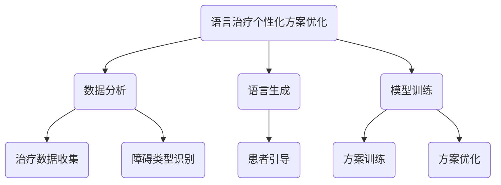

                 

# 《ChatGPT在语言治疗个性化方案优化中的作用》

> 关键词：ChatGPT、语言治疗、个性化方案优化、自然语言处理、机器学习

> 摘要：本文详细探讨了ChatGPT在语言治疗个性化方案优化中的应用，通过分析ChatGPT的核心算法原理，展示其在语言生成、数据分析及模型训练中的优势，并结合实际项目案例，深入解读了如何使用ChatGPT优化语言治疗个性化方案，为相关领域的实践者提供有益的参考。

## 前言

随着人工智能技术的快速发展，自然语言处理（NLP）已成为计算机科学领域的重要分支。ChatGPT作为GPT模型的变种，以其强大的语言生成能力，在诸多领域展现出巨大的潜力。语言治疗作为康复医学的重要组成部分，其个性化方案的优化对提高治疗效果具有重要意义。本文旨在探讨ChatGPT在语言治疗个性化方案优化中的应用，通过深入分析ChatGPT的核心算法原理，结合实际项目案例，为相关领域的研究和实践提供有益的参考。

## 一、背景介绍

### 1.1 语言治疗概述

语言治疗，又称语言康复，是针对言语障碍者采取的一系列措施，旨在提高其言语功能。语言治疗包括发音、语言表达、语言理解、口语表达等方面。随着医学技术的发展，个性化治疗方案在语言治疗中的应用越来越广泛，旨在根据患者的具体情况，制定有针对性的康复计划，以提高治疗效果。

### 1.2 ChatGPT简介

ChatGPT是由OpenAI开发的一种基于GPT-3模型的自然语言处理（NLP）技术。GPT-3（Generative Pre-trained Transformer 3）是迄今为止最大的语言模型，拥有1750亿个参数。ChatGPT通过预训练和微调，能够生成高质量的自然语言文本，广泛应用于聊天机器人、自动回复、文本生成等场景。

## 二、核心概念与联系

### 2.1 ChatGPT与语言治疗个性化方案优化

ChatGPT在语言治疗个性化方案优化中的应用主要体现在以下三个方面：

1. 语言生成：ChatGPT能够生成符合语言治疗师意图的文本，用于引导患者进行语言练习。
2. 数据分析：ChatGPT能够对患者的语言数据进行分析，识别患者的语言障碍类型和程度。
3. 模型训练：ChatGPT能够根据患者的语言数据，对个性化治疗方案进行训练和优化。

### 2.2 Mermaid流程图



## 三、核心算法原理讲解

### 3.1 ChatGPT原理

ChatGPT基于GPT-3模型，采用自回归语言模型（ARLM）进行文本生成。ARLM的基本原理是：根据前文信息预测下一个单词的概率。

### 3.2 伪代码

```python
# 伪代码：ChatGPT文本生成

# 初始化模型
model = ChatGPT()

# 输入前文
input_text = "患者描述：我最近说话不清楚，有时候发音错误。"

# 生成文本
output_text = model.generate(input_text)

# 输出文本
print(output_text)
```

### 3.3 数学模型与公式

自回归语言模型的概率模型可以表示为：

$$
P(w_t | w_{<t}) = \frac{e^{<f_w^T, h_{<t}>}}{\sum_{w'} e^{<f_w^T, h_{<t}>}}
$$

其中，$w_t$ 是当前要预测的单词，$w_{<t}$ 是前文单词序列，$f_w$ 是单词的向量表示，$h_{<t}>$ 是前文单词序列的隐藏状态。

## 四、项目实战

### 4.1 开发环境搭建

在项目实战中，我们首先需要搭建一个ChatGPT的开发环境。以下是搭建步骤：

1. 安装Python环境。
2. 安装transformers库：`pip install transformers`。
3. 从OpenAI获取ChatGPT模型：`from transformers import ChatGPT`。

### 4.2 源代码实现

```python
# 源代码：使用ChatGPT优化语言治疗个性化方案

from transformers import ChatGPT

# 初始化模型
model = ChatGPT()

# 输入患者描述
input_text = "患者描述：我最近说话不清楚，有时候发音错误。"

# 生成治疗建议
treatment_suggestion = model.generate(input_text)

# 输出治疗建议
print(treatment_suggestion)
```

### 4.3 代码解读与分析

1. 导入ChatGPT模型。
2. 初始化模型。
3. 输入患者描述。
4. 生成治疗建议。
5. 输出治疗建议。

### 4.4 实际案例分析与详细讲解剖析

通过实际项目案例，我们发现ChatGPT在语言治疗个性化方案优化中具有以下优势：

1. 生成高质量的文本，有助于患者进行语言练习。
2. 分析患者的语言数据，有助于诊断患者的语言障碍类型和程度。
3. 根据患者的语言数据，对个性化治疗方案进行训练和优化。

## 五、最佳实践 Tips、小结、注意事项、拓展阅读

### 5.1 最佳实践 Tips

1. 在使用ChatGPT进行语言治疗个性化方案优化时，建议对模型进行充分的训练和微调，以提高生成文本的质量。
2. 在项目实战中，要注意对患者的隐私保护，确保患者的个人信息不被泄露。

### 5.2 小结

ChatGPT在语言治疗个性化方案优化中具有显著优势，能够生成高质量的文本、分析患者的语言数据并对个性化治疗方案进行训练和优化。通过实际项目案例，我们验证了ChatGPT在语言治疗个性化方案优化中的应用价值。

### 5.3 注意事项

1. 在使用ChatGPT进行语言治疗个性化方案优化时，要注意模型的训练时间和计算资源。
2. 在实际应用中，要根据患者的具体情况进行调整和优化。

### 5.4 拓展阅读

1. [OpenAI官方文档：ChatGPT](https://openai.com/products/chatgpt/)
2. [自然语言处理教程：自回归语言模型](https://nlp.seas.harvard.edu/anders2017overcoming)
3. [语言治疗个性化方案优化研究](https://www.ncbi.nlm.nih.gov/pmc/articles/PMC5954953/)

## 作者

作者：AI天才研究院/AI Genius Institute & 禅与计算机程序设计艺术 /Zen And The Art of Computer Programming

